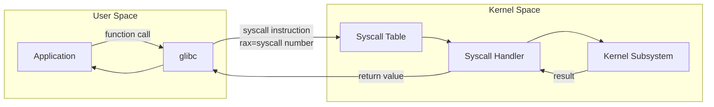
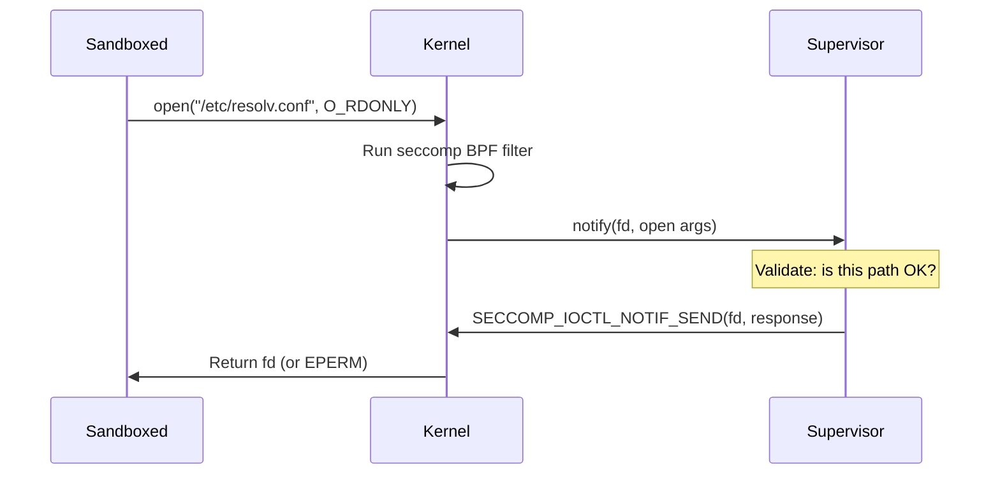
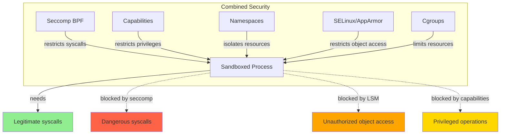

# Seccomp (Secure Computing Mode)

## Introduction

Seccomp (Secure Computing Mode) is a Linux kernel feature that restricts the system calls a process can make. Originally introduced in Linux 2.6.12 (2005) as a simple "trap to a single syscall" mode, it was significantly extended with **seccomp-bpf** in Linux 3.5 (2012) to allow flexible syscall filtering using BPF (Berkeley Packet Filter) programs.

Seccomp is a critical defense-in-depth mechanism. Even if an attacker achieves code execution within a process, seccomp can prevent that code from calling dangerous system calls — blocking file system access, network communication, process creation, or other operations the compromised process doesn't legitimately need.

Seccomp is used extensively by browsers (Chrome, Firefox), container runtimes (Docker, Podman), systemd services, and the kernel itself (via `prctl`).

## How System Calls Work

Before understanding seccomp, it's important to understand system calls:



```bash
# Linux x86_64 uses the syscall instruction
# The syscall number goes in rax, arguments in rdi, rsi, rdx, r10, r8, r9

# Example: write(1, "hello", 5)
# rax = 1 (sys_write)
# rdi = 1 (fd = stdout)
# rsi = address of "hello"
# rdx = 5 (length)

# There are ~330+ syscalls on x86_64 Linux
# Some examples:
# 0   → sys_read
# 1   → sys_write
# 2   → sys_open
# 9   → sys_mmap
# 56  → sys_clone
# 57  → sys_fork
# 59  → sys_execve
# 231 → sys_exit_group
# 317 → sys_seccomp
```

## Seccomp Modes

### Mode 1: Strict Mode (Original Seccomp)

The original seccomp mode allows only four system calls: `read()`, `write()`, `exit()`, and `sigreturn()`. Any other syscall results in the process being killed.

```c
#include <stdio.h>
#include <unistd.h>
#include <seccomp.h>
#include <linux/seccomp.h>
#include <sys/prctl.h>

int main() {
    // Enable strict seccomp mode
    prctl(PR_SET_SECCOMP, SECCOMP_MODE_STRICT);

    // This works
    write(1, "Hello from seccomp strict!\n", 27);

    // This will KILL the process
    open("/etc/passwd", O_RDONLY);  // SIGKILL!

    return 0;
}
```

```bash
# Compile and test
gcc -o seccomp_strict seccomp_strict.c
./seccomp_strict
# Hello from seccomp strict!
# Killed
# (dmesg shows: audit: type=1326 audit(...): auid=... uid=... ...
#   comm="seccomp_strict" exe="..." sig=31 compat=0 ...)
```

### Mode 2: Seccomp-BPF (Filter Mode)

Introduced in Linux 3.5, this is the mode used by virtually all modern seccomp users. It allows attaching a BPF program to filter syscalls.

```mermaid
graph TD
    A[Process makes syscall] --> B{Seccomp filter attached?}
    B -->|No| C[Normal syscall processing]
    B -->|Yes| D[Run BPF filter program]
    D --> E{Filter verdict}
    E -->|SECCOMP_RET_ALLOW| C
    E -->|SECCOMP_RET_KILL| F[Process killed (SIGSYS)]
    E -->|SECCOMP_RET_TRAP| G[Process receives SIGSYS]
    E -->|SECCOMP_RET_ERRNO| H[Syscall returns errno]
    E -->|SECCOMP_RET_TRACE| I[ptrace notified]
    E -->|SECCOMP_RET_LOG| J[Allow + log in audit]
    E -->|SECCOMP_RET_USER_NOTIF| K[Notify userspace supervisor]

    style F fill:#FF6347
    style G fill:#FFA500
    style H fill:#FFD700
    style C fill:#90EE90
```

### Seccomp Return Actions

| Action | Value | Behavior |
|--------|-------|----------|
| `SECCOMP_RET_KILL_PROCESS` | 0x80000000 | Kill entire process (Linux 4.14+) |
| `SECCOMP_RET_KILL_THREAD` | 0x00000000 | Kill calling thread |
| `SECCOMP_RET_TRAP` | 0x00030000 | Send SIGSYS to process |
| `SECCOMP_RET_ERRNO` | 0x00050000 | Return specified errno |
| `SECCOMP_RET_USER_NOTIF` | 0x7FC00000 | Notify userspace supervisor |
| `SECCOMP_RET_TRACE` | 0x7FF00000 | Notify ptrace tracer |
| `SECCOMP_RET_LOG` | 0x7FFE0000 | Allow and log |
| `SECCOMP_RET_ALLOW` | 0x7FFF0000 | Allow syscall |

## Using Seccomp with libseccomp

The `libseccomp` library provides a higher-level API for creating seccomp filters:

```bash
# Install libseccomp development headers
sudo apt install libseccomp-dev     # Debian/Ubuntu
sudo dnf install libseccomp-devel   # RHEL/Fedora
```

### Example: Allowlist Filter

```c
/* seccomp_allowlist.c — Only allow essential syscalls */
#include <stdio.h>
#include <stdlib.h>
#include <unistd.h>
#include <fcntl.h>
#include <seccomp.h>
#include <errno.h>

int main(void) {
    scmp_filter_ctx ctx;

    /* Create a default-deny context (default action = KILL) */
    ctx = seccomp_init(SCMP_ACT_KILL);
    if (ctx == NULL) {
        perror("seccomp_init");
        return 1;
    }

    /* Allow basic I/O */
    seccomp_rule_add(ctx, SCMP_ACT_ALLOW, SCMP_SYS(read), 0);
    seccomp_rule_add(ctx, SCMP_ACT_ALLOW, SCMP_SYS(write), 0);
    seccomp_rule_add(ctx, SCMP_ACT_ALLOW, SCMP_SYS(close), 0);
    seccomp_rule_add(ctx, SCMP_ACT_ALLOW, SCMP_SYS(exit), 0);
    seccomp_rule_add(ctx, SCMP_ACT_ALLOW, SCMP_SYS(exit_group), 0);

    /* Allow memory management (needed by glibc) */
    seccomp_rule_add(ctx, SCMP_ACT_ALLOW, SCMP_SYS(mmap), 0);
    seccomp_rule_add(ctx, SCMP_ACT_ALLOW, SCMP_SYS(munmap), 0);
    seccomp_rule_add(ctx, SCMP_ACT_ALLOW, SCMP_SYS(brk), 0);
    seccomp_rule_add(ctx, SCMP_ACT_ALLOW, SCMP_SYS(mprotect), 0);

    /* Allow stat operations */
    seccomp_rule_add(ctx, SCMP_ACT_ALLOW, SCMP_SYS(fstat), 0);
    seccomp_rule_add(ctx, SCMP_ACT_ALLOW, SCMP_SYS(stat), 0);

    /* Load the filter */
    if (seccomp_load(ctx) < 0) {
        perror("seccomp_load");
        seccomp_release(ctx);
        return 1;
    }

    seccomp_release(ctx);

    /* Test: write works */
    printf("Seccomp filter loaded! Only essential syscalls allowed.\n");

    /* Test: try to open a file — this will be KILLED */
    int fd = open("/etc/passwd", O_RDONLY);
    /* Never reaches here */
    printf("fd = %d\n", fd);

    return 0;
}
```

```bash
gcc -o seccomp_allowlist seccomp_allowlist.c -lseccomp
./seccomp_allowlist
# Seccomp filter loaded! Only essential syscalls allowed.
# Bad system call (core dumped)

# Check dmesg for the audit message
sudo dmesg | tail -5
# [12345.678] audit: type=1326 audit(1690000000.000:456):
#   auid=1000 uid=1000 gid=1000 ses=1 pid=1234 comm="seccomp_allowlist"
#   exe="/home/user/seccomp_allowlist" sig=31 arch=c000003e
#   syscall=2 compat=0 ip=0x7f... code=0x0
#                                                    ^^^^^^^^
#                                              syscall=2 is sys_open
```

### Example: Parameter-Based Filtering

```c
/* seccomp_params.c — Allow write only to stdout/stderr */
#include <seccomp.h>
#include <stdio.h>
#include <unistd.h>

int main(void) {
    scmp_filter_ctx ctx = seccomp_init(SCMP_ACT_KILL);
    if (!ctx) return 1;

    /* Allow read */
    seccomp_rule_add(ctx, SCMP_ACT_ALLOW, SCMP_SYS(read), 0);

    /* Allow write ONLY to fd 1 (stdout) or fd 2 (stderr) */
    seccomp_rule_add(ctx, SCMP_ACT_ALLOW, SCMP_SYS(write), 1,
                     SCMP_A0(SCMP_CMP_EQ, 1));  /* fd == stdout */
    seccomp_rule_add(ctx, SCMP_ACT_ALLOW, SCMP_SYS(write), 1,
                     SCMP_A0(SCMP_CMP_EQ, 2));  /* fd == stderr */

    /* Allow exit */
    seccomp_rule_add(ctx, SCMP_ACT_ALLOW, SCMP_SYS(exit_group), 0);
    seccomp_rule_add(ctx, SCMP_ACT_ALLOW, SCMP_SYS(brk), 0);

    seccomp_load(ctx);
    seccomp_release(ctx);

    /* This works (stdout) */
    printf("Hello from filtered process!\n");

    /* This writes to fd 3 (a file) — will be killed */
    int fd = open("/tmp/test", 1);
    write(fd, "data", 4);

    return 0;
}
```

## Seccomp Notify (Userspace Supervisor)

Linux 5.0 introduced `SECCOMP_RET_USER_NOTIF`, which allows a **supervisor process** to handle syscalls on behalf of the sandboxed process:



This is used by container runtimes (like Docker with `runc`) and snap-confine for more flexible sandboxing decisions that can't be expressed in BPF alone.

## Seccomp and Containers

### Docker Seccomp Profiles

Docker uses seccomp to restrict container syscalls. The default profile blocks ~44 of ~300+ syscalls:

```bash
# View Docker's default seccomp profile
cat /etc/docker/seccomp.json | python3 -m json.tool | head -30
# {
#     "defaultAction": "SCMP_ACT_ERRNO",
#     "defaultErrnoRet": 1,
#     "archMap": [
#         {
#             "architecture": "SCMP_ARCH_X86_64",
#             "subArchitectures": [
#                 "SCMP_ARCH_X86",
#                 "SCMP_ARCH_X32"
#             ]
#         }
#     ],
#     "syscalls": [
#         {
#             "names": ["accept", "accept4", "access", ...],
#             "action": "SCMP_ACT_ALLOW"
#         }
#     ]
# }

# Run a container with the default seccomp profile (default)
docker run --rm alpine cat /proc/1/status | grep Seccomp
# Seccomp:    2           ← 2 = SECCOMP_MODE_FILTER
# Seccomp_filters: 1

# Run with no seccomp (UNSAFE)
docker run --rm --security-opt seccomp=unconfined alpine cat /proc/1/status | grep Seccomp
# Seccomp:    0           ← 0 = disabled

# Run with a custom profile
docker run --rm --security-opt seccomp=myprofile.json alpine echo "custom seccomp"

# Create a custom profile that blocks everything except essentials
cat > /tmp/minimal-seccomp.json << 'EOF'
{
    "defaultAction": "SCMP_ACT_ERRNO",
    "defaultErrnoRet": 1,
    "architectures": ["SCMP_ARCH_X86_64"],
    "syscalls": [
        {
            "names": [
                "read", "write", "close", "fstat", "mmap", "mprotect",
                "munmap", "brk", "exit_group", "writev", "access",
                "getpid", "getuid", "getgid", "geteuid", "getegid",
                "arch_prctl", "set_tid_address", "futex", "openat"
            ],
            "action": "SCMP_ACT_ALLOW"
        }
    ]
}
EOF

docker run --rm --security-opt seccomp=/tmp/minimal-seccomp.json alpine echo "minimal"
# minimal (might fail if echo needs more syscalls than listed)
```

### Containerd and OCI Runtime Spec

```json
// OCI runtime spec seccomp configuration
{
    "linux": {
        "seccomp": {
            "defaultAction": "SCMP_ACT_ERRNO",
            "defaultErrnoRet": 1,
            "architectures": [
                "SCMP_ARCH_X86_64",
                "SCMP_ARCH_X86"
            ],
            "syscalls": [
                {
                    "names": ["read", "write", "exit", "exit_group", "mmap"],
                    "action": "SCMP_ACT_ALLOW"
                }
            ]
        }
    }
}
```

## systemd Seccomp Integration

systemd provides built-in seccomp support for service units:

```ini
# /etc/systemd/system/myapp.service
[Unit]
Description=My Sandboxed Application

[Service]
ExecStart=/usr/local/bin/myapp

# Seccomp filtering
SystemCallFilter=@system-service    # Allow common service syscalls
SystemCallFilter=~@privileged       # Deny privileged syscalls
SystemCallArchitectures=native      # Only native architecture (no 32-bit)
MemoryDenyWriteExecute=true         # Deny W+X memory mappings
RestrictRealtime=true               # Deny realtime scheduling

# Other hardening (not seccomp, but complementary)
ProtectSystem=strict
ProtectHome=true
PrivateTmp=true
NoNewPrivileges=true
CapabilityBoundingSet=CAP_NET_BIND_SERVICE
```

```bash
# Reload and check
sudo systemctl daemon-reload
sudo systemctl start myapp

# See the seccomp filters applied
systemctl show myapp -p SystemCallFilter
# SystemCallFilter=@system-service ~@privileged

# Predefined syscall groups:
# @system-service — Common service syscalls (read, write, open, etc.)
# @file-system    — File operations
# @network-io     — Network I/O
# @ipc            — IPC (shared memory, semaphores, etc.)
# @privileged     — Privileged operations (mount, chown, etc.)
# @process        — Process management (fork, exec, kill, etc.)
# @signal         — Signal handling
# @timer          — Timer operations
# @chown          — chown operations
# @cpu-emulation  — CPU emulation (modify_ldt, etc.)
# @debug          — Debugging (ptrace, etc.)
# @module         — Kernel module operations
# @mount          — Mount operations
# @reboot         — Reboot operations
# @swap           — Swap operations
```

### Listing Syscall Groups

```bash
# systemd provides a tool to list syscall groups
systemd-analyze syscall-filter
# @system-service
#     @aio
#     @basic-io
#     @chown
#     @default
#     @file-system
#     @io-event
#     @ipc
#     @memory-lock
#     @network-io
#     @process
#     @resources
#     @setuid
#     @signal
#     @sync
#     @timer

# List syscalls in a specific group
systemd-analyze syscall-filter @network-io
# @network-io
#     accept
#     accept4
#     bind
#     connect
#     getpeername
#     getsockname
#     getsockopt
#     listen
#     recv
#     recvfrom
#     recvmmsg
#     recvmsg
#     send
#     sendmmsg
#     sendmsg
#     sendto
#     setsockopt
#     shutdown
#     socket
#     socketpair
```

## Seccomp with prctl and prctl(PR_SET_SECCOMP)

```c
#include <stdio.h>
#include <unistd.h>
#include <linux/seccomp.h>
#include <sys/prctl.h>
#include <linux/filter.h>
#include <linux/audit.h>

/* BPF program: allow only read, write, exit, exit_group */
static struct sock_filter filter[] = {
    /* Load syscall number */
    BPF_STMT(BPF_LD | BPF_W | BPF_ABS, offsetof(struct seccomp_data, nr)),

    /* Allow read (0) */
    BPF_JUMP(BPF_JMP | BPF_JEQ | BPF_K, __NR_read, 4, 0),
    /* Allow write (1) */
    BPF_JUMP(BPF_JMP | BPF_JEQ | BPF_K, __NR_write, 3, 0),
    /* Allow exit (60) */
    BPF_JUMP(BPF_JMP | BPF_JEQ | BPF_K, __NR_exit, 2, 0),
    /* Allow exit_group (231) */
    BPF_JUMP(BPF_JMP | BPF_JEQ | BPF_K, __NR_exit_group, 1, 0),

    /* Deny everything else */
    BPF_STMT(BPF_RET | BPF_K, SECCOMP_RET_KILL),
    /* Allow */
    BPF_STMT(BPF_RET | BPF_K, SECCOMP_RET_ALLOW),
};

static struct sock_fprog prog = {
    .len = sizeof(filter) / sizeof(filter[0]),
    .filter = filter,
};

int main(void) {
    /* Tell the kernel we want to use seccomp */
    prctl(PR_SET_NO_NEW_PRIVS, 1, 0, 0, 0);

    /* Load the BPF filter */
    prctl(PR_SET_SECCOMP, SECCOMP_MODE_FILTER, &prog);

    /* Allowed */
    write(STDOUT_FILENO, "Seccomp BPF loaded!\n", 20);

    /* Will be killed */
    open("/etc/passwd", 0);

    return 0;
}
```

## Seccomp Profiles for Real Applications

### Chrome/Chromium Browser Sandbox

```bash
# Chrome uses seccomp extensively for its multi-process architecture
# Each renderer process runs in a seccomp sandbox

# The sandbox restricts renderers from:
# - Opening files directly (must go through browser process)
# - Making network connections
# - Spawning processes
# - Using most privileged syscalls

# Check Chrome's seccomp usage
cat /proc/$(pgrep -f "chrome --type=renderer" | head -1)/status | grep Seccomp
# Seccomp:    2
# Seccomp_filters: 1
```

### Nginx with Seccomp

```bash
# Nginx doesn't use seccomp by default, but you can add it via systemd
# /etc/systemd/system/nginx.service.d/hardening.conf
cat > /tmp/nginx-seccomp.conf << 'EOF'
[Service]
SystemCallFilter=@system-service @network-io
SystemCallFilter=~@privileged @reboot @module @cpu-emulation
EOF
```

## Debugging Seccomp Violations

```bash
# When a process is killed by seccomp, dmesg shows the reason
sudo dmesg | grep seccomp
# [12345.678] audit: type=1326 audit(...): auid=1000 uid=1000 pid=1234
#   comm="myapp" exe="/usr/bin/myapp" sig=31 arch=c000003e syscall=2 ...

# syscall=2 → sys_open (the blocked syscall)
# sig=31 → SIGSYS (the seccomp signal)
# arch=c000003e → AUDIT_ARCH_X86_64

# Use strace to see what syscalls a program makes
strace -c -S calls /usr/bin/myapp 2>&1 | sort -k 1 -n -r | head -20
# % time     seconds  usecs/call     calls    errors syscall
# ------ ----------- ----------- --------- --------- --------
#  45.23    0.001234          12       100           read
#  32.11    0.000890          89        10           write
#  12.45    0.000345           8        40           mmap
#   ...

# Use seccomp-tools to analyze (Ruby gem)
gem install seccomp-tools
seccomp-tools dump /usr/bin/myapp
#  line  CODE  JT   JF      K
# =================================
#  0000: 0x20 0x00 0x00 0x00000000  A = data.arch
#  0001: 0x15 0x00 0x05 0xc000003e  if (A != 0xc000003e) goto 0007
#  ...
```

### Common Seccomp Audit Fields

| Field | Description |
|-------|-------------|
| `syscall` | Syscall number (see `/usr/include/asm/unistd_64.h`) |
| `arch` | Architecture (0xc000003e = x86_64) |
| `sig` | Signal sent (31 = SIGSYS) |
| `comm` | Process name |
| `exe` | Executable path |
| `auid` | Audit UID |
| `pid` | Process ID |

## Seccomp and Other Security Mechanisms

Seccomp is most effective when combined with other security layers:



## BPF Filter Details

Seccomp-BPF filters are classic BPF (cBPF) programs — the same bytecode format used by `socket()`. Each filter consists of an array of `struct sock_filter` instructions:

### BPF Instruction Set for Seccomp

```c
struct sock_filter {
    __u16 code;   /* Opcode */
    __u8  jt;     /* Jump if true */
    __u8  jf;     /* Jump if false */
    __u32 k;      /* Generic field */
};
```

Key BPF instructions used in seccomp filters:

| Instruction | Code | Description |
|-------------|------|-------------|
| `BPF_LD+BPF_W+BPF_ABS` | 0x20 | Load 32-bit word from `seccomp_data` at offset `k` |
| `BPF_JMP+BPF_JEQ+BPF_K` | 0x15 | Jump if A == k |
| `BPF_JMP+BPF_JGE+BPF_K` | 0x35 | Jump if A >= k (unsigned) |
| `BPF_JMP+BPF_JGT+BPF_K` | 0x25 | Jump if A > k (unsigned) |
| `BPF_JMP+BPF_JSET+BPF_K` | 0x45 | Jump if A & k != 0 |
| `BPF_RET+BPF_K` | 0x06 | Return constant k |
| `BPF_RET+BPF_A` | 0x16 | Return value in accumulator |

### The seccomp_data Structure

The BPF program receives a `seccomp_data` structure as input:

```c
struct seccomp_data {
    int nr;                   /* Syscall number */
    __u32 arch;               /* AUDIT_ARCH_* value */
    __u64 instruction_pointer; /* CPU instruction pointer */
    __u64 args[6];            /* Syscall arguments */
};
```

The program loads fields using `BPF_LD+BPF_W+BPF_ABS` with these offsets:

```c
offsetof(struct seccomp_data, nr)                    /* 0  */
offsetof(struct seccomp_data, arch)                  /* 4  */
offsetof(struct seccomp_data, instruction_pointer)   /* 8  */
offsetof(struct seccomp_data, args[0])               /* 16 */
```

### BPF Filter Program Limits

- Maximum program length: 4096 instructions (`BPF_MAXINSNS`)
- Maximum call depth: 16 (for BPF-to-BPF calls)
- No loops allowed (must be a DAG)
- Return value must be a valid `SECCOMP_RET_*` action

### Kernel Processing

When a syscall is made, the kernel:

1. Checks if `TIF_SECCOMP` is set for the current task
2. Calls `__seccomp_filter()` which runs the BPF program(s)
3. The program returns an action verdict
4. Actions are processed in order: `SECCOMP_RET_KILL_PROCESS` > `SECCOMP_RET_KILL_THREAD` > `SECCOMP_RET_TRAP` > `SECCOMP_RET_ERRNO` > `SECCOMP_RET_USER_NOTIF` > `SECCOMP_RET_TRACE` > `SECCOMP_RET_LOG` > `SECCOMP_RET_ALLOW`
5. If multiple filters are attached (via `prctl` and inherited), they are run in reverse order; the most restrictive result wins

### Seccomp Notify (SECCOMP_RET_USER_NOTIF)

Linux 5.0 introduced `SECCOMP_RET_USER_NOTIF`, which sends a file descriptor to a supervisor process:

```c
/* Supervisor side */
int notify_fd = seccomp_notify_fd(ctx);
struct seccomp_notif *req;
seccomp_notify_alloc(ctx, &req, NULL);

/* Receive notification */
seccomp_notify_receive(notify_fd, req);

/* The req contains:
 *   req->pid          — PID of the sandboxed process
 *   req->data.nr      — Syscall number
 *   req->data.args[6] — Syscall arguments
 */

/* Respond with a return value */
struct seccomp_notif_resp resp = {
    .id = req->id,
    .val = 0,           /* Return value */
    .error = 0,         /* Or -EPERM, etc. */
    .flags = 0,
};
seccomp_notify_respond(notify_fd, &resp);
```

This is used by container runtimes for flexible sandboxing decisions that cannot be expressed purely in BPF (e.g., path-based file access control).

## References

- [The Linux Kernel Documentation](https://docs.kernel.org/)
- [GNU Project Documentation](https://www.gnu.org/doc/doc.html)
- [GNU Manuals](https://www.gnu.org/manual/manual.html)
- [Free Software Directory](https://directory.fsf.org/wiki/Main_Page)
- [Planet GNU](https://planet.gnu.org/)
- [Free Software Books](https://www.gnu.org/doc/other-free-books.html)

- Linux Kernel Seccomp Documentation: https://www.kernel.org/doc/html/latest/userspace-api/seccomp_filter.html
- `man 2 seccomp` — Seccomp system call
- `man 2 prctl` — PR_SET_SECCOMP and related operations
- `man 3 seccomp_init` — libseccomp API
- libseccomp project: https://github.com/seccomp/libseccomp
- Seccomp BPF specification: https://www.kernel.org/doc/html/latest/networking/filter.html
- Kernel seccomp documentation: https://docs.kernel.org/security/seccomp.html
- seccomp_data structure: include/uapi/linux/seccomp.h
- Chrome Sandbox Design: https://chromium.googlesource.com/chromium/src/+/HEAD/docs/design/sandbox.md
- Docker Seccomp Profiles: https://docs.docker.com/engine/security/seccomp/
- systemd.exec(5) — SystemCallFilter and related directives: https://www.freedesktop.org/software/systemd/man/latest/systemd.exec.html
- KRSI (Kernel Runtime Security Instrumentation): https://lwn.net/Articles/808048/
- seccomp-tools: https://github.com/david942j/seccomp-tools

## Related Topics

- [Linux Security Overview](./overview.md) — Where seccomp fits in defense in depth
- [Capabilities](./capabilities.md) — Fine-grained root privileges, often used with seccomp
- [SELinux](./selinux.md) — MAC that complements seccomp's syscall filtering
- [AppArmor](./apparmor.md) — Alternative MAC with profile-based confinement
- [Hardening](./hardening.md) — System-wide hardening including seccomp for services
- [Secure Boot](./secure-boot.md) — Boot chain integrity that precedes runtime security
