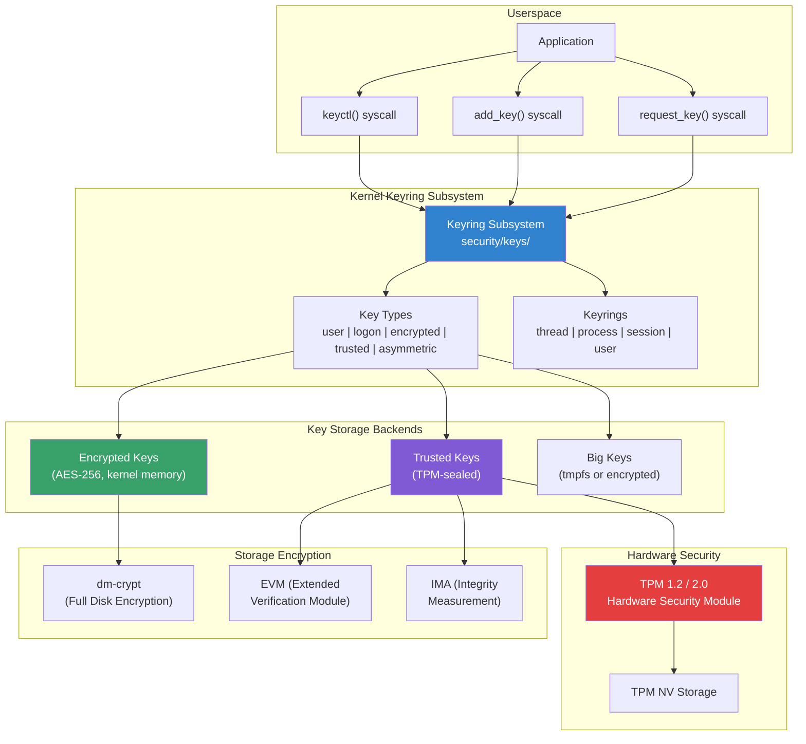
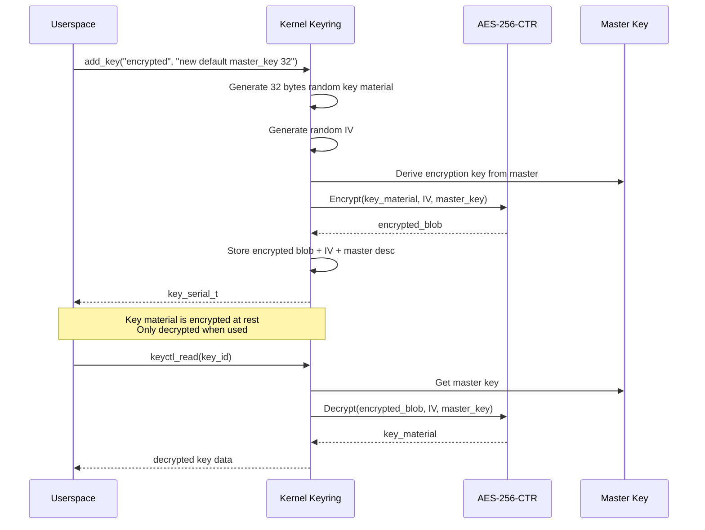
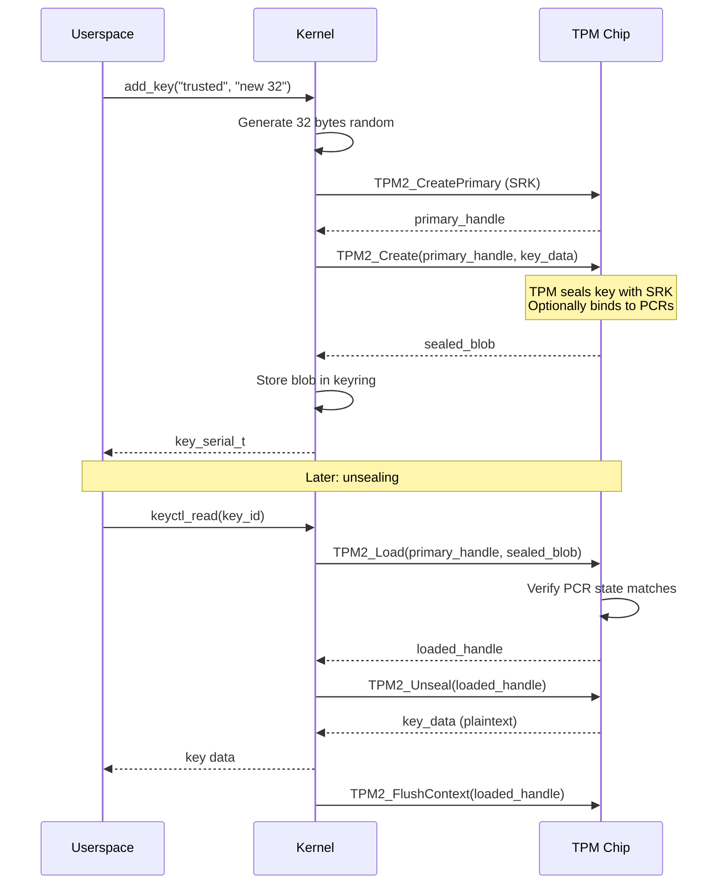
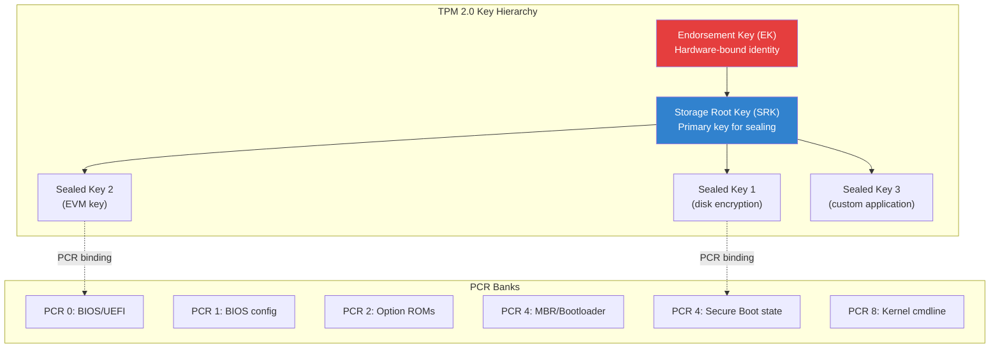
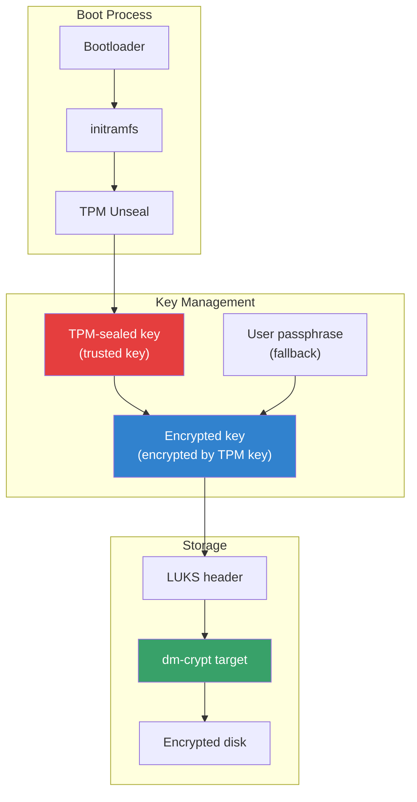
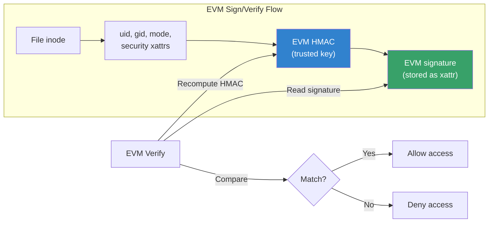
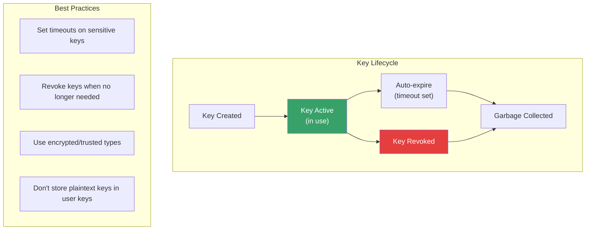

# Kernel Secrets Management

## Introduction

The Linux kernel provides several mechanisms for managing cryptographic secrets: the **kernel keyring** for storing keys in kernel memory, **encrypted keys** that encrypt key material at rest, **TPM integration** for hardware-backed key storage, and **dm-crypt/TPM** for full-disk encryption key management.

While [Keyring](./keyring.md) and [Secrets](./secrets.md) cover the core API and concepts, this page focuses on **practical secrets management** — how these subsystems integrate to provide end-to-end security for cryptographic keys, from generation through storage to use.

## Architecture Overview



## Key Types in Depth

### Encrypted Keys

Encrypted keys store key material encrypted in kernel memory. The encryption key is derived from a **master key** that can come from a TPM, a user-supplied passphrase, or a kernel-generated random key.

```c
/* Encrypted key payload structure */
struct encrypted_key_payload {
    struct rcu_head rcu;
    char *format;           /* "default" or "ecryptfs" */
    const char *master_desc; /* Master key description */
    const char *datalen;    /* Key data length as string */
    u8 *iv;                 /* Initialization vector */
    u8 *encrypted_data;     /* Encrypted key material */
    unsigned short datablob_len; /* Total blob length */
    unsigned short decrypted_datalen; /* Actual key length */
    unsigned short payload_datalen;   /* Encrypted data length */
    unsigned short format_len;
    unsigned short master_desc_len;
    unsigned short datalen_len;
};
```

#### Creating Encrypted Keys

```bash
# Create an encrypted key with a user-type master key
# The master key is used to encrypt the key material
keyctl add user master_key "$(head -c 32 /dev/urandom | xxd -p)" @u

# Create an encrypted key (32 bytes) using the master key
keyctl add encrypted my_key "new default master_key 32" @u

# Create an encrypted key bound to a TPM
keyctl add encrypted my_key "new default trusted:tpm-key 32" @u

# Read the encrypted key payload
keyctl pipe $(keyctl search @u encrypted my_key)

# Show all keys in the session keyring
keyctl list @s
```

#### Encrypted Key Flow



### Trusted Keys (TPM-Sealed)

Trusted keys are sealed inside the TPM chip. The key material never leaves the TPM in plaintext — it can only be unsealed by the same TPM that sealed it.

```c
/* Trusted key payload */
struct trusted_key_payload {
    struct rcu_head rcu;
    unsigned int key_len;
    unsigned int blob_len;
    unsigned char migratable;
    unsigned char old_format;
    unsigned char *key;     /* Decrypted key (in kernel memory) */
    unsigned char *blob;    /* TPM-sealed blob */
};

struct trusted_key_options {
    uint16_t keytype;       /* TPM key type (SRK) */
    uint32_t keyhandle;     /* TPM key handle */
    unsigned char keyauth[SHA1_DIGEST_SIZE]; /* Key authorization */
    unsigned char blobauth[SHA1_DIGEST_SIZE]; /* Blob authorization */
    uint32_t pcrinfo_len;
    unsigned char pcrinfo[MAX_PCRINFO_SIZE]; /* PCR binding data */
    int pcrlock;
};
```

#### Creating and Using Trusted Keys

```bash
# Check TPM status
cat /sys/class/tpm/tpm0/device/description
tpm2_getcap properties-fixed

# Create a trusted key (TPM 2.0)
keyctl add trusted my_trusted_key "new 32" @u

# Create a trusted key bound to specific PCRs
# This key can only be unsealed if PCR values match
keyctl add trusted my_pcr_key "new 32 pcr_info=0,1,2,3,7" @u

# Create a migratable trusted key (can be moved to another TPM)
keyctl add trusted my_migratable "new 32 migratable=1" @u

# Use trusted key as master for encrypted key
keyctl add encrypted disk_key "new default trusted:my_trusted_key 32" @u

# Seal a key to a specific TPM handle
keyctl add trusted my_key "new 32 keyhandle=0x81000001" @u
```

#### Trusted Key TPM Seal/Unseal Flow



### Asymmetric Keys

```bash
# Create asymmetric key pair (requires CONFIG_ASYMMETRIC_KEY_TYPE)
# Usually loaded from X.509 certificates

# List loaded certificates
keyctl list @u

# Import a PKCS#7 signed certificate
keyctl padd asymmetric my_cert @u < cert.der

# Use with dm-verity, module signing, etc.
```

## TPM Integration

### TPM 2.0 Key Hierarchy



### TPM 2.0 Userspace Tools

```bash
# Install tpm2-tools
sudo apt install tpm2-tools    # Debian/Ubuntu
sudo dnf install tpm2-tools    # Fedora/RHEL

# Check TPM capabilities
tpm2_getcap properties-fixed

# Create a primary key (SRK equivalent)
tpm2_createprimary -C o -c primary.ctx

# Create a sealed object
tpm2_create -C primary.ctx -u pub.key -r priv.key \
    -i- <<< "my secret data"

# Load the sealed object
tpm2_load -C primary.ctx -u pub.key -r priv.key -c loaded.ctx

# Unseal
tpm2_unseal -c loaded.ctx
# Output: my secret data

# Seal with PCR policy (PCR 7 = Secure Boot state)
tpm2_createpolicy --policy-pcr -l sha256:7 -L pcr.policy
tpm2_create -C primary.ctx -L pcr.policy -u pub.key -r priv.key \
    -i- <<< "secure boot secret"

# NV (Non-Volatile) storage
tpm2_nvdefine -C o -s 64 -a "ownerwrite|ownerread" 0x1000001
tpm2_nvwrite -C o -i secret.bin 0x1000001
tpm2_nvread -C o -s 64 0x1000001
```

### TPM and Kernel Keyring Integration

```bash
# The kernel's trusted key type uses TPM automatically

# Load the TPM driver
sudo modprobe tpm_tis        # TPM 1.2 (typical desktop)
sudo modprobe tpm_crb        # TPM 2.0 (typical modern system)
sudo modprobe tpm_tis_spi    # TPM on SPI bus (embedded)

# Verify TPM is available
ls /dev/tpm* /sys/class/tpm/

# Create a TPM-backed trusted key
keyctl add trusted tpm_key "new 32" @u

# This key is sealed to the TPM's SRK
# Can only be unsealed on the same machine with the same TPM

# Use it as a master key for dm-crypt
keyctl add encrypted disk_key "new default trusted:tpm_key 32" @u
```

## dm-crypt and Key Management

### Full Disk Encryption with Kernel Keys



### Setting Up TPM-Based Disk Encryption

```bash
# 1. Create a TPM-backed trusted key
keyctl add trusted disk_tpm_key "new 32" @u

# 2. Create an encrypted key using the TPM key as master
keyctl add encrypted disk_enc_key \
    "new default trusted:disk_tpm_key 32" @u

# 3. Extract the key for LUKS
KEY_HEX=$(keyctl pipe $(keyctl search @u encrypted disk_enc_key) | \
    grep -oP 'key\[\K[0-9a-f]+')

# 4. Add the key to LUKS
echo -n "$KEY_HEX" | xxd -r -p | \
    cryptsetup luksAddKey /dev/sda2 --new-key-file=-

# 5. Set up auto-unlock in initramfs
# The initramfs will:
# a. Load TPM driver
# b. Create trusted key (TPM auto-seal)
# c. Create encrypted key
# d. Use it to unlock LUKS

# Alternative: use systemd-cryptenroll with TPM2
systemd-cryptenroll /dev/sda2 --tpm2-device=auto --tpm2-pcrs=7
```

### systemd-cryptenroll with TPM

```bash
# Modern approach: systemd-cryptenroll (systemd 248+)

# Enroll with TPM2, binding to Secure Boot state (PCR 7)
sudo systemd-cryptenroll --tpm2-device=auto \
    --tpm2-pcrs=7 \
    /dev/nvme0n1p3

# Enroll with TPM2 + PIN (two-factor)
sudo systemd-cryptenroll --tpm2-device=auto \
    --tpm2-pcrs=7 \
    --tpm2-with-pin=true \
    /dev/nvme0n1p3

# Check enrolled methods
sudo systemd-cryptenroll /dev/nvme0n1p3

# Unlock in /etc/crypttab:
# my_disk UUID=... none tpm2-device=auto
```

## EVM and IMA Integration

### EVM (Extended Verification Module)

EVM uses a trusted key to protect file metadata integrity:

```bash
# EVM requires a trusted key
# Create an EVM trusted key
keyctl add trusted evm_key "new 32" @u

# Load it into the EVM keyring
keyctl add encrypted evm-key "new default trusted:evm_key 32" @u

# Initialize EVM
echo 1 > /sys/kernel/security/evm

# EVM signs file metadata (uid, gid, mode, xattrs)
# using HMAC with the trusted key

# Enable EVM at boot (kernel command line)
# evm=fix  — fix EVM signatures
# evm=x509 — use X.509 certificate for EVM
```



### IMA (Integrity Measurement Architecture)

IMA measures and optionally verifies file integrity:

```bash
# IMA measures file hashes into TPM PCRs

# Check IMA policy
cat /sys/kernel/security/ima/policy

# Example IMA policy
# Measure all executed files
echo "measure func=BPRM_CHECK" > /sys/kernel/security/ima/policy

# Measure all files read by root
echo "measure func=FILE_MASK uid=0" >> /sys/kernel/security/ima/policy

# Appraise (verify signature) all executed files
echo "appraise func=BPRM_CHECK" >> /sys/kernel/security/ima/policy

# Sign files for IMA appraisal
evmctl ima_sign --key /path/to/privkey.pem /usr/bin/my_app

# Verify signatures
evmctl ima_verify --key /path/x509.der /usr/bin/my_app

# View IMA measurement log
cat /sys/kernel/security/ima/ascii_runtime_measurements
```

## Kernel Keyring API Programming

### Complete Example: Key Lifecycle Management

```c
#include <stdio.h>
#include <stdlib.h>
#include <string.h>
#include <unistd.h>
#include <sys/syscall.h>
#include <linux/keyctl.h>
#include <errno.h>

/* Wrapper for add_key syscall */
key_serial_t add_key(const char *type, const char *description,
                     const void *payload, size_t plen,
                     key_serial_t keyring)
{
    return syscall(__NR_add_key, type, description,
                   payload, plen, keyring);
}

/* Wrapper for keyctl syscall */
long keyctl(int cmd, ...)
{
    va_list ap;
    unsigned long args[4];

    va_start(ap, cmd);
    for (int i = 0; i < 4; i++)
        args[i] = va_arg(ap, unsigned long);
    va_end(ap);

    return syscall(__NR_keyctl, cmd, args[0], args[1],
                   args[2], args[3]);
}

int main(void)
{
    key_serial_t session_keyring;
    key_serial_t user_key, enc_key;

    /* Get current session keyring */
    session_keyring = keyctl(KEYCTL_JOIN_SESSION_KEYRING, "my_session");
    if (session_keyring < 0) {
        perror("join session keyring");
        return 1;
    }
    printf("Session keyring: %d\n", session_keyring);

    /* Add a user-type key */
    const char *secret = "my-secret-data-1234567890123456";
    user_key = add_key("user", "master_key",
                       secret, strlen(secret),
                       session_keyring);
    if (user_key < 0) {
        perror("add_key user");
        return 1;
    }
    printf("User key: %d\n", user_key);

    /* Create an encrypted key using the user key as master */
    const char *enc_params = "new default master_key 32";
    enc_key = add_key("encrypted", "my_encrypted_key",
                      enc_params, strlen(enc_params),
                      session_keyring);
    if (enc_key < 0) {
        perror("add_key encrypted");
        return 1;
    }
    printf("Encrypted key: %d\n", enc_key);

    /* Read the encrypted key's payload */
    char buf[512];
    long len = keyctl(KEYCTL_READ, enc_key, buf, sizeof(buf));
    if (len < 0) {
        perror("keyctl read");
        return 1;
    }
    printf("Encrypted key payload (%ld bytes): ", len);
    for (long i = 0; i < len && i < 32; i++)
        printf("%02x", (unsigned char)buf[i]);
    printf("...\n");

    /* Search for a key */
    key_serial_t found = keyctl(KEYCTL_SEARCH, session_keyring,
                                "encrypted", "my_encrypted_key", 0);
    printf("Found key: %d\n", found);

    /* Set key timeout (auto-revoke after 300 seconds) */
    keyctl(KEYCTL_SET_TIMEOUT, enc_key, 300);
    printf("Set 300s timeout on encrypted key\n");

    /* Revoke the user key (master) — encrypted key becomes inaccessible */
    keyctl(KEYCTL_REVOKE, user_key);
    printf("Revoked master key\n");

    /* Clear the entire session keyring */
    keyctl(KEYCTL_CLEAR, session_keyring);
    printf("Cleared session keyring\n");

    return 0;
}
```

### Kernel Keyring in Container Environments

```c
/*
 * Containers have restricted keyrings. To share keys:
 * 1. Use KEY_SPEC_PROCESS_KEYRING for container-wide keys
 * 2. Use KEY_SPEC_USER_KEYRING for cross-container keys (same UID)
 * 3. Use KEY_SPEC_PERSISTENT_KEYRING for keys that survive restarts
 */

#include <linux/keyctl.h>
#include <sys/syscall.h>

/* Create a persistent keyring (survives login sessions) */
key_serial_t persistent_keyring(void)
{
    return syscall(__NR_keyctl, KEYCTL_GET_PERSISTENT,
                   getuid(), KEY_SPEC_USER_SESSION_KEYRING);
}

/* Share a key between containers (same user namespace) */
key_serial_t share_key_across_containers(const char *key_desc,
                                          const void *payload,
                                          size_t len)
{
    key_serial_t user_keyring;

    /* Get the user keyring — shared across all processes of this UID */
    user_keyring = syscall(__NR_keyctl, KEYCTL_GET_KEYRING_ID,
                           KEY_SPEC_USER_KEYRING, 1);

    /* Add key to user keyring — visible in all containers of this UID */
    return syscall(__NR_add_key, "user", key_desc,
                   payload, len, user_keyring);
}
```

## Security Considerations

### Key Lifetime Management



### Security Hardening Checklist

```bash
# 1. Disable kernel keyring access from user namespaces
#    (prevents container escapes via keyring)
sysctl kernel.keys.maxkeys=200
sysctl kernel.keys.maxbytes=20000

# 2. Use encrypted keys instead of user keys for secrets
keyctl add encrypted my_key "new default 32" @u
# NOT: keyctl add user my_key "plaintext_secret" @u

# 3. Set key timeouts for session-specific secrets
keyctl SET_TIMEOUT $KEY_ID 3600  # 1 hour

# 4. Clear session keyring on process exit
#    (automatic for SESSION keyring, manual for others)

# 5. Use TPM-bound keys for disk encryption
#    (key cannot be extracted from TPM)

# 6. Bind trusted keys to PCR values
#    (key only usable when system integrity is verified)
keyctl add trusted pcr_key "new 32 pcr_info=0,7" @u

# 7. Monitor key operations via audit
sudo auditctl -a always,exit -F arch=b64 -S add_key -S keyctl
```

## Troubleshooting

### Common Issues

```bash
# "Key has been revoked" — master key was revoked
# Solution: recreate the key hierarchy

# "Required key not available" — keyring doesn't contain the key
keyctl list @u    # Check user keyring
keyctl list @s    # Check session keyring
keyctl list @t    # Check thread keyring

# "Permission denied" — key permissions don't allow access
# Check key permissions:
keyctl describe $KEY_ID

# "Operation not supported" — key type not compiled in
# Check kernel config:
zgrep CONFIG_ENCRYPTED_KEYS /proc/config.gz
zgrep CONFIG_TRUSTED_KEYS /proc/config.gz
zgrep CONFIG_TCG_TPM /proc/config.gz

# "No such device" — TPM not available
ls /dev/tpm*
dmesg | grep -i tpm

# Keyring size limits
sysctl kernel.keys.maxkeys      # Max keys (200 default)
sysctl kernel.keys.maxbytes     # Max total payload bytes (20000)
sysctl kernel.keys.root_maxkeys # Max keys for root (1000000)
sysctl kernel.keys.root_maxbytes # Max bytes for root (25000000)
```

## Source References

| Source | Path | Description |
|--------|------|-------------|
| Keyring core | `security/keys/` | Keyring subsystem |
| Encrypted keys | `security/keys/encrypted-keys/` | Encrypted key type |
| Trusted keys | `security/keys/trusted-keys/` | TPM-sealed trusted keys |
| TPM driver | `drivers/char/tpm/` | TPM device drivers |
| dm-crypt | `drivers/md/dm-crypt.c` | Full disk encryption |
| EVM | `security/integrity/evm/` | Extended Verification Module |
| IMA | `security/integrity/ima/` | Integrity Measurement Architecture |
| Keyctl | `security/keys/keyctl.c` | keyctl syscall implementation |
| Header | `include/linux/key.h` | Key data structures |
| UAPI | `include/uapi/linux/keyctl.h` | Userspace API definitions |

## See Also

- [Keyring](./keyring.md) — Core keyring API and types
- [Secrets](./secrets.md) — Kernel secrets management overview
- [Cryptography](./cryptography.md) — Kernel crypto subsystem
- [Integrity](./integrity.md) — IMA/EVM integrity framework
- [Secure Boot](./secure-boot.md) — UEFI Secure Boot chain
- [Hardening](./hardening.md) — Security hardening guide
