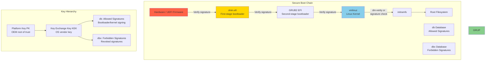
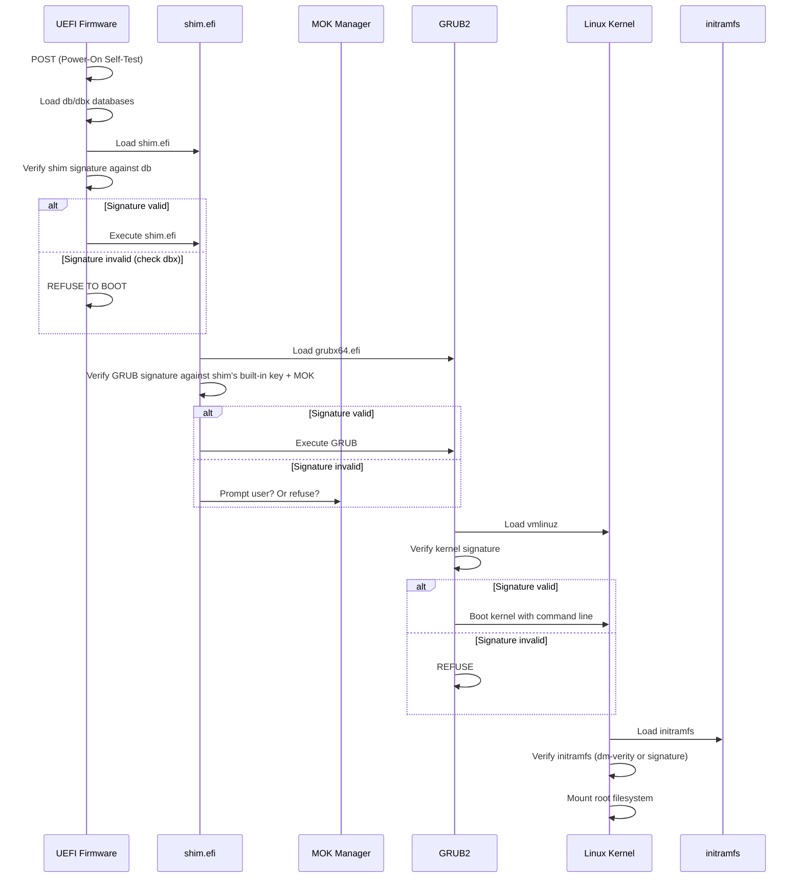
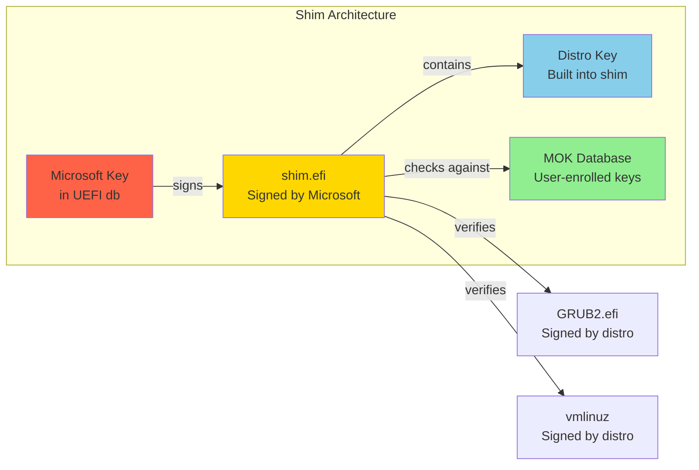
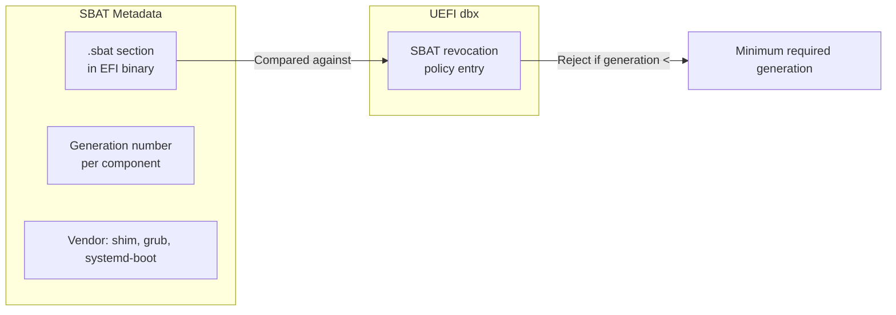

# UEFI Secure Boot

## Introduction

UEFI Secure Boot is a security standard developed by the UEFI Forum that ensures a system only boots software that is trusted by the Original Equipment Manufacturer (OEM). It uses public-key cryptography to verify the digital signature of each piece of boot software — from the UEFI firmware itself through the bootloader, to the kernel, and optionally to the initial RAM filesystem (initramfs).

Secure Boot was introduced with Windows 8 (2012) and is now required for all systems shipping with the "Windows" logo. While initially controversial in the Linux community, major distributions have developed mechanisms to work with Secure Boot while preserving user freedom to boot custom kernels and operating systems.

## The Boot Chain



### Boot Sequence Details



## Key Hierarchy

### Platform Key (PK)

The Platform Key is the root of trust for the entire Secure Boot chain. It is typically owned by the hardware manufacturer (OEM).

```bash
# View the Platform Key
sudo efi-readvar -v PK
# Variable PK, length 1191
# PK: List 0, type X509
#     Signature 0, Owner 2658bc80-a3c2-4293-aa1c-97a4a04c4254
#     Subject: C=US, ST=Washington, L=Redmond, O=Microsoft Corporation
#              CN=Microsoft Corporation UEFI CA 2011

# The PK is almost always a Microsoft key on x86 systems
# On ARM systems, it's typically the OEM's own key
```

### Key Exchange Key (KEK)

KEK is used to sign updates to the db and dbx databases. Typically, both Microsoft's KEK and the OS vendor's KEK are enrolled.

```bash
# View KEK
sudo efi-readvar -v KEK
# Variable KEK, length 2382
# KEK: List 0, type X509
#     Signature 0, Owner 77fa9abd-0359-4d32-bd60-28f4e78f784b
#     Subject: C=US, ST=Washington, L=Redmond, O=Microsoft Corporation
#              CN=Microsoft Corporation KEK CA 2011
# KEK: List 1, type X509
#     Signature 0, Owner a8ba3c5b-8eb2-4649-8e22-704e1979e64d
#     Subject: C=GB, ST=Isle of Man, L=Douglas, O=Canonical Ltd.
#              CN=Canonical Ltd. Secure Boot Signing
```

### Signature Databases (db and dbx)

```bash
# db: Allowed signing certificates and hashes
sudo efi-readvar -v db
# Shows Microsoft UEFI CA, Microsoft Windows PCA, and distro-specific keys

# dbx: Forbidden signatures (revoked)
sudo efi-readvar -v dbx
# Contains revoked bootloader hashes (vulnerable GRUB, shim versions)

# View all Secure Boot variables at once
sudo efi-readvar
# PK, KEK, db, dbx entries listed
```

## Shim: The First-Stage Bootloader

Shim is a simple, signed EFI application that acts as a first-stage bootloader. Its purpose is to bridge the gap between Microsoft's keys (which OEMs trust) and Linux distribution keys.

### How Shim Works



```bash
# Shim is typically installed by the distro
ls -la /boot/efi/EFI/ubuntu/shimx64.efi
# -rwxr-xr-x 1 root root 123456 Jul 21 10:00 /boot/efi/EFI/ubuntu/shimx64.efi

# The UEFI boot entry points to shim, not GRUB directly
sudo efibootmgr -v
# Boot0000* ubuntu	HD(1,GPT,...)/File(\EFI\ubuntu\shimx64.efi)

# Shim contains a built-in distro key
# For Ubuntu: Canonical Ltd. Secure Boot Signing
# For Fedora: Fedora Secure Boot Signing
# For SUSE: SUSE Linux Enterprise Secure Boot CA

# Shim also checks the MOK (Machine Owner Key) database
# This allows users to enroll their own keys
```

## MOK (Machine Owner Key)

MOK allows users to enroll their own signing keys, giving them control over what software can boot on their system.

### MOK Management

```bash
# Install mokutil
sudo apt install mokutil        # Debian/Ubuntu
sudo dnf install mokutil        # RHEL/Fedora

# Check Secure Boot status
mokutil --sb-state
# SecureBoot enabled

# List enrolled MOKs
mokutil --list-enrolled
# [key 1]
# SHA1 Fingerprint: aa:bb:cc:dd:ee:ff:...
# Subject: C=US, O=MyOrg, CN=MyOrg Secure Boot Key

# List pending MOKs (waiting for enrollment)
mokutil --list-new

# Import a new MOK (for custom kernel modules or bootloaders)
# Step 1: Generate a signing key
openssl req -new -x509 \
  -newkey rsa:2048 \
  -keyout MOK.priv \
  -outform DER \
  -out MOK.der \
  -nodes \
  -days 36500 \
  -subj "/CN=My Custom Signing Key/"

# Step 2: Enroll the key
sudo mokutil --import MOK.der
# password: **** (this password is needed at reboot)

# Step 3: Reboot
sudo reboot

# Step 4: In the MOK Manager (blue screen):
#   → Enroll MOK
#   → Continue
#   → Enter password set in step 2
#   → Reboot

# Step 5: Verify enrollment
mokutil --list-enrolled | grep -A2 "Custom"
# Subject: CN=My Custom Signing Key
```

### Signing Kernel Modules with MOK

```bash
# After enrolling a MOK, you can sign kernel modules for Secure Boot

# Sign an out-of-tree kernel module
sudo /usr/src/linux-headers-$(uname -r)/scripts/sign-file \
  sha256 \
  /path/to/MOK.priv \
  /path/to/MOK.der \
  /lib/modules/$(uname -r)/extra/mydriver.ko

# Verify the signature
modprobe --dump-modversions /lib/modules/$(uname -r)/extra/mydriver.ko 2>&1 | head

# Now the module will load with Secure Boot enabled
sudo modprobe mydriver
# Works! Without signing, you'd get:
# modprobe: ERROR: could not insert 'mydriver': Required key not available

# For DKMS modules, configure automatic signing:
# /etc/dkms/framework.conf
# mok_signing_key="/path/to/MOK.priv"
# mok_certificate="/path/to/MOK.der"
```

## How Major Distributions Handle Secure Boot

### Ubuntu / Debian

```bash
# Ubuntu uses shim → GRUB → kernel, all signed
# The signing chain:
# 1. Microsoft signs Canonical's shim
# 2. shim contains Canonical's key
# 3. Canonical signs GRUB and kernel packages

# View the signing keys
sudo apt install sbsigntool
sbverify --list /boot/vmlinuz-$(uname -r)
# signature 0
# image signature issuers:
#  - /C=GB/ST=Isle of Man/L=Douglas/O=Canonical Ltd./CN=Canonical Ltd. Secure Boot Signing (2021 v1)
# image signature certificates:
#  - subject: /C=GB/ST=Isle of Man/L=Douglas/O=Canonical Ltd./CN=Canonical Ltd. Secure Boot Signing (2021 v1)
#    issuer:  /C=GB/ST=Isle of Man/L=Douglas/O=Canonical Ltd/emailAddress=secureboot@canonical.com/CN=Canonical Ltd. Master Certificate Authority (2021 v1)

# Ubuntu also supports automatic MOK enrollment for DKMS modules
# When you install a DKMS module, it prompts to set a password
# and enroll the key on next reboot
```

### Fedora / RHEL

```bash
# Fedora uses a similar shim → GRUB → kernel chain
# But with Fedora-specific signing keys

# View the kernel signature
pesign -S -i /boot/vmlinuz-$(uname -r)
# The Fedora signing key is enrolled in the UEFI db by default

# RHEL uses the same mechanism but with Red Hat's signing keys
# RHEL also has FIPS-certified boot options

# Fedora supports Unified Kernel Images (UKI)
# UKI bundles kernel + initramfs + cmdline into a single signed EFI binary
# This ensures the entire boot chain is verified
```

### openSUSE / SUSE

```bash
# SUSE uses shim signed by Microsoft, containing SUSE's key
# GRUB2 and kernel are signed by SUSE

# SUSE also supports Secure Boot with custom keys via YaST
sudo yast2 bootloader
# → Secure Boot tab → Enable/Disable/Custom keys
```

## Unified Kernel Images (UKI)

A modern approach where the kernel, initramfs, and command line are bundled into a single signed EFI binary:

```bash
# systemd-boot and UKI (Linux 6.x+ with systemd 252+)

# Create a UKI
sudo ukify build \
  --linux=/boot/vmlinuz-$(uname -r) \
  --initrd=/boot/initrd.img-$(uname -r) \
  --cmdline="root=UUID=... ro quiet splash" \
  --os-release="@/etc/os-release" \
  --secureboot-private-key=/path/to/MOK.priv \
  --secureboot-certificate=/path/to/MOK.der \
  --output=/boot/efi/EFI/Linux/linux-$(uname -r).efi

# The resulting .efi is self-contained and signed
# No separate bootloader needed — the UEFI loads it directly

# With systemd-boot as the bootloader:
bootctl status
# System:
#      Firmware: UEFI 2.70 (...)
# Secure Boot: enabled (user)
#   Setup Mode: user
# Boot into FW: supported

# Current Boot Loader:
#       Product: systemd-boot 253
# ...
```

## Secure Boot and Kernel Lockdown

The Linux kernel includes a **Lockdown** LSM that is automatically enabled when Secure Boot is active:

```bash
# Check lockdown status
cat /sys/kernel/security/lockdown
# [none] integrity confidentiality
# When Secure Boot is active, it's typically:
# none [integrity] confidentiality

# In integrity mode:
# - Kernel module signature verification is enforced
# - /dev/mem, /dev/kmem are disabled
# - hibernation to untrusted storage is blocked
# - Some debug features are restricted

# In confidentiality mode (stricter):
# - All of integrity mode
# - CPU mitigations cannot be disabled
# - Kernel config cannot be read via /proc/config.gz

# Manually set lockdown (requires Secure Boot or boot parameter)
echo integrity | sudo tee /sys/kernel/security/lockdown

# Boot parameter:
# lockdown=integrity  or  lockdown=confidentiality
```

## Troubleshooting Secure Boot

### Common Issues

```bash
# Issue 1: "Security Policy Violation" on boot
# Cause: Unsigned or improperly signed bootloader/kernel
# Fix: Check signatures, re-enroll MOK, or disable Secure Boot

# Verify kernel signature
sudo sbverify --cert /etc/ssl/certs/ubuntu-uefi-ca.pem /boot/vmlinuz-$(uname -r)
# Signature verification OK

# Issue 2: "Required key not available" when loading kernel module
# Cause: Module not signed with enrolled key
# Fix: Sign the module with your MOK (see above)

# Check module signature
modinfo -F signer mymodule.ko
# (empty = unsigned)

# Issue 3: MOK Manager doesn't appear on reboot
# Cause: UEFI boot order may not include shim
# Fix: Use efibootmgr to fix boot order
sudo efibootmgr -v
sudo efibootmgr -o 0000,0001,0002

# Issue 4: Can't disable Secure Boot
# Some systems have BIOS password protection
# Contact the system administrator or OEM
```

### Debugging Tools

```bash
# Install Secure Boot tools
sudo apt install sbsigntool efitools mokutil

# Verify an EFI binary's signature
sbsign --key MOK.priv --cert MOK.der --output signed.efi unsigned.efi
sbverify --cert MOK.der signed.efi

# Check UEFI variables
sudo efivar -l | grep -i secure
# SecureBoot
# PK
# KEK
# db
# dbx

# Read the SecureBoot variable directly
sudo efivar -n 8be4df61-93ca-11d2-aa0d-00e098032b8c-SecureBoot -p
# 0000 01 00 00 00                                      ....
# ← 01 = Secure Boot enabled

# View kernel command line for Secure Boot parameters
cat /proc/cmdline | tr ' ' '\n' | grep -i secure
# (may show lockdown= or other SB-related parameters)

# Check dmesg for Secure Boot messages
dmesg | grep -i "secure boot\|lockdown\|moksb"
# [    0.000000] Secure boot enabled
# [    0.000000] Lockdown: swapper/0: kexec_load disabled; use kexec_file_load
```

## Disabling Secure Boot

```bash
# Disabling Secure Boot is done in the UEFI firmware settings
# It CANNOT be done from within Linux (security by design)

# Access UEFI settings:
# Method 1: Hold Shift during boot → GRUB menu → UEFI Firmware Settings
# Method 2: From Windows: Settings → Recovery → Advanced Startup → UEFI
# Method 3: From Linux:
sudo systemctl reboot --firmware-setup

# Once in UEFI settings:
# 1. Navigate to Security or Boot tab
# 2. Find "Secure Boot" option
# 3. Set to "Disabled"
# 4. Save and exit

# WARNING: Disabling Secure Boot:
# - Removes kernel module signature enforcement
# - Disables Lockdown LSM
# - Allows unsigned code to run at boot
# - May void compliance requirements (PCI-DSS, HIPAA)
# - Is necessary for some NVIDIA proprietary drivers
```

## Custom Secure Boot Setup

For organizations that want their own root of trust:

```bash
# Generate a complete PKI for Secure Boot

# 1. Generate Platform Key (PK)
openssl req -new -x509 -newkey rsa:2048 -nodes \
  -keyout PK.key -out PK.crt -days 3650 \
  -subj "/CN=My Org Platform Key/"

# 2. Generate Key Exchange Key (KEK)
openssl req -new -x509 -newkey rsa:2048 -nodes \
  -keyout KEK.key -out KEK.crt -days 3650 \
  -subj "/CN=My Org KEK/"

# 3. Generate db key (for signing bootloaders and kernels)
openssl req -new -x509 -newkey rsa:2048 -nodes \
  -keyout db.key -out db.crt -days 3650 \
  -subj "/CN=My Org Secure Boot Signing/"

# 4. Convert to EFI signature list format
cert-to-efi-sig-list -g "$(uuidgen)" PK.crt PK.esl
cert-to-efi-sig-list -g "$(uuidgen)" KEK.crt KEK.esl
cert-to-efi-sig-list -g "$(uuidgen)" db.crt db.esl

# 5. Sign the ESL files
sign-efi-sig-list -g "$(uuidgen)" -k PK.key -c PK.crt PK PK.esl PK.auth
sign-efi-sig-list -g "$(uuidgen)" -k PK.key -c PK.crt KEK KEK.esl KEK.auth
sign-efi-sig-list -g "$(uuidgen)" -k PK.key -c PK.crt db db.esl db.auth

# 6. Enroll keys (from UEFI shell or efivar)
# WARNING: This replaces the OEM's keys!
# Only do this if you control the entire boot chain

# 7. Sign GRUB and kernel with your db key
sbsign --key db.key --cert db.crt --output grubx64.efi grubx64.efi
sbsign --key db.key --cert db.crt --output vmlinuz vmlinuz
```

## References

- [The Linux Kernel Documentation](https://docs.kernel.org/)
- [LWN.net - Linux and free software news](https://lwn.net/)
- [GNU Project Documentation](https://www.gnu.org/doc/doc.html)
- [GNU Manuals](https://www.gnu.org/manual/manual.html)
- [Free Software Directory](https://directory.fsf.org/wiki/Main_Page)
- [Planet GNU](https://planet.gnu.org/)
- [Free Software Books](https://www.gnu.org/doc/other-free-books.html)

- UEFI Forum: https://www.uefi.org/
- UEFI Specification: https://uefi.org/specifications
- Shim bootloader: https://github.com/rhboot/shim
- Rod Smith's Secure Boot Guide: https://www.rodsbooks.com/efi-bootloaders/secureboot.html
- Ubuntu Secure Boot: https://ubuntu.com/security/secure-boot
- Fedora Secure Boot: https://fedoraproject.org/wiki/Secureboot
- ArchWiki Secure Boot: https://wiki.archlinux.org/title/Unified_Extensible_Firmware_Interface/Secure_Boot
- `man 1 mokutil` — MOK management
- `man 1 sbsign` — Sign EFI binaries
- `man 1 sbverify` — Verify EFI binary signatures
- `man 1 efi-readvar` — Read UEFI Secure Boot variables
- `man 7 lockdown` — Kernel Lockdown
- Microsoft UEFI CA Signing: https://techcommunity.microsoft.com/t5/hardware-dev-center/uefi-ca-key-rotation/ba-p/3848603
- Unified Kernel Images: https://uapi-group.org/specifications/specs/unified_kernel_image/

## SBAT (Secure Boot Advanced Targeting)

SBAT is a mechanism introduced in 2021 to enable fine-grained revocation of boot components without revoking entire signing certificates. It's now the primary revocation mechanism for shim and GRUB.

### How SBAT Works



Each EFI binary (shim, GRUB, kernel) contains an `.sbat` section with structured metadata:

```csv
# Example .sbat section content (shim)
sbat,1,SBAT Version,sbat,1,https://github.com/rhboot/shim/blob/main/SBAT.md
shim,3,UEFI shim,shim,1,https://github.com/rhboot/shim
shim.x64,2,UEFI shim for x64,shim,1,https://github.com/rhboot/shim
shim.ubuntu,2,Ubuntu shim,shim,1,https://ubuntu.com
```

### SBAT Revocation Flow

```bash
# When a vulnerability is found in GRUB:
# 1. GRUB's SBAT generation is bumped (e.g., grub,2 → grub,3)
# 2. A UEFI dbx update adds: "grub: minimum generation = 3"
# 3. Any GRUB with generation < 3 is refused by shim

# Check SBAT data in an EFI binary
objdump -j .sbat -s /boot/efi/EFI/ubuntu/grubx64.efi

# Check current SBAT revocation policy
# (stored in UEFI dbx or in shim's built-in revocation list)
mokutil --list-sbat-revocations
```

### Why SBAT Is Better Than dbx Hash Revocation

| Aspect | dbx Hash Revocation | SBAT |
|--------|-------------------|------|
| Granularity | Per-binary hash | Per-component generation |
| Update size | One entry per vulnerable binary | One entry per component |
| Impact | Blocks specific binary versions | Blocks all versions below threshold |
| Maintenance | Grows unboundedly | Compact |

## dbx Updates

The dbx (forbidden signatures database) is periodically updated to revoke vulnerable boot components:

```bash
# Check current dbx entries
sudo efi-readvar -v dbx

# Apply a dbx update (from a UEFI update capsule)
sudo fwupdmgr refresh
sudo fwupdmgr update

# On systems with LVFS (Linux Vendor Firmware Service):
sudo fwupdmgr get-updates
sudo fwupdmgr update

# Manual dbx update (using efitools)
# WARNING: Can brick your system if done incorrectly!
sudo UpdateVar -dbx dbx-update.auth

# Check dbx entry count
sudo efi-readvar -v dbx | grep -c "Signature"
```

## UEFI Shell

For debugging Secure Boot, a UEFI shell is invaluable:

```bash
# Download the UEFI shell from Tianocore
# https://github.com/tianocore/edk2/tree/master/ShellBinPkg

# Copy to EFI partition
sudo mkdir -p /boot/efi/EFI/tools/
sudo cp Shell.efi /boot/efi/EFI/tools/

# Add a UEFI boot entry
sudo efibootmgr --create --disk /dev/sda --part 1 \
    --loader '\EFI\tools\Shell.efi' --label "UEFI Shell"

# In the UEFI shell, you can:
# - List Secure Boot variables: SecureBoot -c
# - Enroll keys: EnrollKey -c PK.der
# - Verify signatures: VerifySign -c grubx64.efi
# - Load drivers: load driver.efi
```

## Secure Boot and Measured Boot (TPM)

Secure Boot and Measured Boot (via TPM) are complementary:

```mermaid
graph TD
    subgraph "Secure Boot"
        SB_VERIFY["Verify signature"]
        SB_ALLOW["Allow/deny execution"]
        SB_FAIL["Refuse to boot on failure"]
    end
    subgraph "Measured Boot"
        MB_PCR["Extend TPM PCR"]
        MB_LOG["Event log (TCG log)"]
        MB_REMOTE["Remote attestation"]
    end
    subgraph "TPM"
        TPM["TPM 2.0 chip"]
        PCR["PCR[0-7]: Boot measurements"]
    end

    UEFI --> SB_VERIFY
    UEFI --> MB_PCR
    SB_VERIFY --> SB_ALLOW
    MB_PCR --> TPM
    TPM --> PCR
    MB_LOG --> MB_REMOTE
```

```bash
# Check TPM PCR values
tpm2_pcrread sha256
# PCR[0]: BIOS/UEFI firmware measurement
# PCR[1]: UEFI configuration
# PCR[2]: Option ROMs
# PCR[3]: Option ROM configuration
# PCR[4]: Boot manager measurement
# PCR[5]: GPT partition table
# PCR[6]: ...
# PCR[7]: Secure Boot state (db, dbx, PK, KEK)

# View the TCG event log
sudo cat /sys/kernel/security/tpm0/binary_bios_measurements | tpm2_eventlog

# Remote attestation (requires attestation server)
# The TPM signs PCR values with its endorsement key
# A remote server can verify the boot chain integrity
```

## Key Management Best Practices

```bash
# Key rotation strategy:
# 1. Generate new db key annually
# 2. Sign all new boot components with new key
# 3. Add new key to UEFI db (keep old key enrolled until all systems updated)
# 4. After all systems use new key-signed components, remove old key from db

# Key backup (CRITICAL):
# Store PK, KEK, and db private keys in:
# - Hardware security module (HSM) for production
# - Encrypted offline storage (minimum)
# - NEVER on the same machine that uses them

# Key ceremony for organizations:
# 1. Generate keys on an air-gapped machine
# 2. Store private keys in HSM or encrypted USB
# 3. Distribute public keys via firmware updates
# 4. Document key fingerprints and custodians
# 5. Test key enrollment on non-production hardware first

# Emergency key revocation:
# If a private key is compromised:
# 1. Generate a new key pair
# 2. Sign a dbx update revoking the compromised key
# 3. Distribute the dbx update to all systems
# 4. Re-sign all boot components with the new key
# 5. Update MOK on all systems
```

## Related Topics

- [Linux Security Overview](./overview.md) — Where Secure Boot fits in the security architecture
- [Hardening](./hardening.md) — System hardening that extends the Secure Boot chain
- [Cryptography](./cryptography.md) — Public-key cryptography used by Secure Boot
- [SELinux](./selinux.md) — MAC that operates after Secure Boot verifies the kernel
- [Seccomp](./seccomp.md) — Runtime restrictions after secure boot completes

