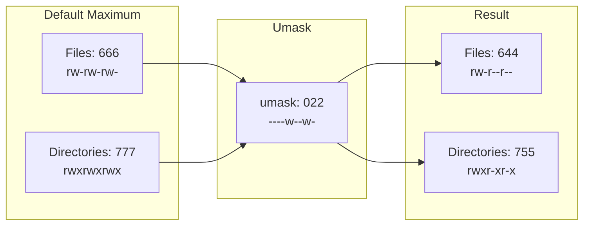
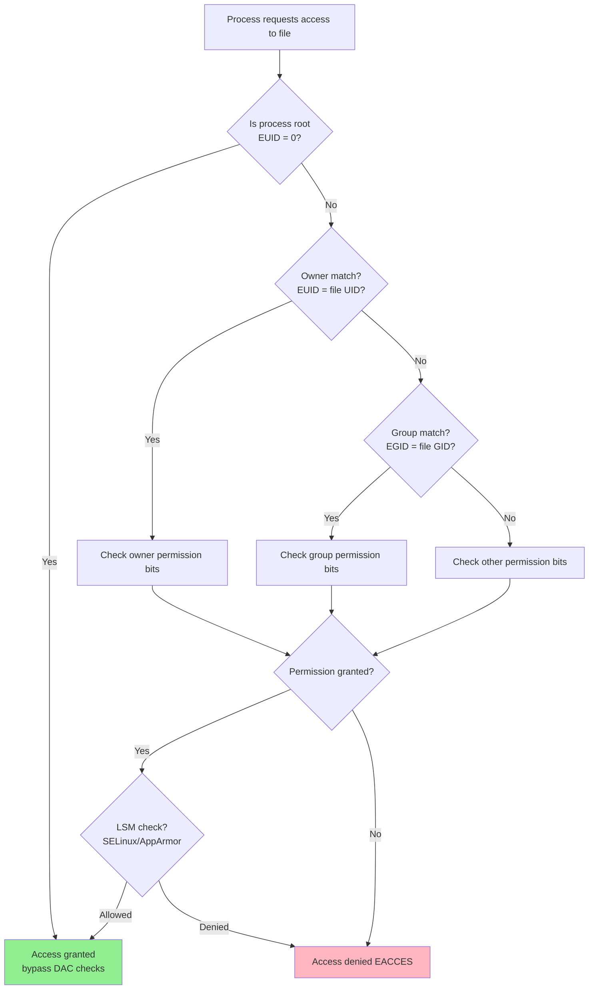

# Unix Security Model

## Introduction

The Unix security model is one of the oldest and most influential access control systems in computing. Designed in the 1970s at Bell Labs, its core concepts — users, groups, and file permissions — remain the foundation of Linux security today. While modern Linux systems layer mandatory access controls (SELinux, AppArmor) and other mechanisms on top, understanding the traditional Unix model is essential because it is the first check applied to every file access, process operation, and IPC mechanism on the system.

This model is formally classified as **Discretionary Access Control (DAC)**: the owner of a resource *discretionarily* decides who can access it, as opposed to Mandatory Access Control where the system administrator sets policy that even the owner cannot override.

## Users and the User Database

### User Identity

Every process on a Linux system runs as a user (technically, a **UID**). The kernel does not understand usernames — it only works with numeric UIDs. The mapping is maintained in `/etc/passwd`.

```bash
# View the user database
cat /etc/passwd | head -5
# root:x:0:0:root:/root:/bin/bash
# daemon:x:1:1:daemon:/usr/sbin:/usr/sbin/nologin
# bin:x:2:2:bin:/bin:/usr/sbin/nologin
# sys:x:3:3:sys:/dev:/usr/sbin/nologin
# sync:x:4:65534:sync:/bin:/bin/sync
```

Each line has seven colon-separated fields:

```
username:password:UID:GID:GECOS:home_directory:shell
```

| Field | Description | Example |
|-------|-------------|---------|
| username | Login name | `root` |
| password | `x` means password is in `/etc/shadow` | `x` |
| UID | User ID number | `0` |
| GID | Primary group ID | `0` |
| GECOS | Comment / full name | `root` |
| home directory | Absolute path | `/root` |
| shell | Login shell | `/bin/bash` |

### UID Ranges

```
0           → root (superuser)
1-999       → System users (daemons, services)
1000-60000  → Regular users (interactive logins)
65534       → nobody (mapped user for unprivileged operations)
```

```bash
# Check your current UID
id -u
# 1000

# Check the UID of a user
id -u nobody
# 65534

# The kernel checks UID, not username
# If two users have the same UID, the kernel treats them as the same user
# (this is sometimes called a "shared UID" and is generally bad practice)
```

### Real vs. Effective vs. Saved User ID

Every process has **four** user IDs, not just one:

```mermaid
graph LR
    subgraph "Process User IDs"
        RUID[Real UID<br/>Who launched the process]
        EUID[Effective UID<br/>Used for permission checks]
        SUID[Saved Set-UID<br/>Can switch back to EUID]
        FSUID[Filesystem UID<br/>Used for FS checks (Linux-specific)]
    end

    RUID -->|normal exec| EUID
    EUID -->|setuid binary| EUID
    EUID -->|setreuid| RUID
    SUID -->|setuid cap| EUID
```

```bash
# Demonstrate real vs effective UID with a setuid binary
ls -l /usr/bin/passwd
# -rwsr-xr-x 1 root root 68208 Mar 23 10:00 /usr/bin/passwd
#    ^
#    s = setuid bit

# When you run passwd:
# - Real UID = your UID (e.g., 1000)
# - Effective UID = root (0, because of setuid bit)
# - Saved UID = root (0)

# In C, you can see this:
cat << 'EOF' > /tmp/show_uids.c
#include <stdio.h>
#include <unistd.h>
int main() {
    printf("Real UID:      %d\n", getuid());
    printf("Effective UID: %d\n", geteuid());
    printf("Saved UID:     %d\n", getsuid());   // Linux-specific
    printf("Filesystem UID:%d\n", getfsuid());   // Linux-specific
    return 0;
}
EOF
gcc /tmp/show_uids.c -o /tmp/show_uids
/tmp/show_uids
# Real UID:      1000
# Effective UID: 1000
# Saved UID:     1000
# Filesystem UID:1000

# Make it setuid root and run again
sudo chown root:root /tmp/show_uids
sudo chmod u+s /tmp/show_uids
/tmp/show_uids
# Real UID:      1000
# Effective UID: 0
# Saved UID:     0
# Filesystem UID:0
```

## Groups

Groups are collections of users that share access to resources.

### Group Database

```bash
cat /etc/group | head -5
# root:x:0:
# daemon:x:1:
# bin:x:2:
# sys:x:3:
# adm:x:4:syslog,user1
```

Format: `groupname:password:GID:list_of_members`

### Primary vs. Supplementary Groups

```bash
# Every user has ONE primary group (set in /etc/passwd)
# and zero or more supplementary groups

# View all groups for a user
id
# uid=1000(user1) gid=1000(user1) groups=1000(user1),27(sudo),100(users)

# The primary group is what new files get assigned
touch /tmp/testfile
ls -l /tmp/testfile
# -rw-r--r-- 1 user1 user1 0 Jul 21 10:00 /tmp/testfile
#              ^^^^^ ^^^^^
#              owner group (primary group)

# Switch to a different primary group temporarily
newgrp docker
# Now new files will have the "docker" group

# Add a user to a supplementary group
sudo usermod -aG docker user1
# -a = append (don't remove existing groups)
# -G = supplementary groups
```

### The Effective Group ID

Similar to users, processes have a real GID, effective GID, and saved set-GID:

```c
gid_t getgid(void);   // Real GID
gid_t getegid(void);  // Effective GID — used for permission checks
```

## File Permissions

### Traditional Permission Bits

Every file and directory has three sets of permission bits: owner, group, and others. Each set has read (r), write (w), and execute (x).

```bash
ls -l /usr/bin/vim
# -rwxr-xr-x 1 root root 3074624 Jan  1 00:00 /usr/bin/vim
#  rwxr-xr-x
#  │││││││││
#  │││││││╰─ Others: execute
#  ││││││╰── Others: read
#  │││││╰─── Others: (no write)
#  ││││╰──── Group: execute
#  │││╰───── Group: read
#  ││╰────── Group: (no write)
#  │╰─────── Owner: execute
#  │╰─────── Owner: read
#  ╰──────── Owner: write
```

### Numeric (Octal) Representation

Each permission set is represented by 3 bits, which map to an octal digit:

```
rwx = 111 = 7
rw- = 110 = 6
r-x = 101 = 5
r-- = 100 = 4
-wx = 011 = 3
-w- = 010 = 2
--x = 001 = 1
--- = 000 = 0
```

```bash
chmod 755 /usr/local/bin/myapp
# Owner: rwx (7), Group: r-x (5), Others: r-x (5)

chmod 640 /etc/myapp.conf
# Owner: rw- (6), Group: r-- (4), Others: --- (0)

# Symbolic mode
chmod u+x script.sh          # Add execute for owner
chmod g-w,o-rx file.txt      # Remove write for group, read+execute for others
chmod a+r public.txt          # Add read for all (a = all = ugo)
chmod u=rwx,go= private.key   # Set exactly: owner rwx, group and others nothing
```

### Permission Semantics: Files vs. Directories

The same bits have different meanings for files and directories:

| Bit | File | Directory |
|-----|------|-----------|
| Read (r) | Read file contents | List directory entries (`ls`) |
| Write (w) | Modify file contents | Create, delete, rename entries within |
| Execute (x) | Run as a program | Enter the directory (`cd`) and access files within |

```bash
# Without execute on a directory, you can't access files inside
chmod 644 /tmp/testdir
ls -l /tmp/testdir/
# ls: cannot access '/tmp/testdir/somefile': Permission denied
# (can see the listing because read is set, but can't stat files)

# Without read but with execute, you can access files by name but not list
chmod 311 /tmp/testdir
ls /tmp/testdir/
# ls: cannot open directory '/tmp/testdir/': Permission denied
cat /tmp/testdir/somefile    # Works if you know the exact name!
```

## Special Permission Bits

### SUID (Set User ID)

When a file with the SUID bit is executed, the process runs with the **effective UID of the file's owner**, not the user who launched it.

```bash
# The 's' in the owner execute position
ls -l /usr/bin/passwd
# -rwsr-xr-x 1 root root 68208 Mar 23 10:00 /usr/bin/passwd
#    ^
#    s (SUID)

# If owner execute is NOT set but SUID is, you see 'S' (capital)
chmod u-s /tmp/test_suid
chmod u=rws /tmp/test_suid
ls -l /tmp/test_suid
# -rwSr-xr-x ...    ← capital S = SUID set but owner can't execute (error!)

# Find all SUID files (audit for security)
find / -perm -4000 -type f 2>/dev/null
```

**Security implications**: SUID binaries are a primary target for privilege escalation. Every SUID binary on the system is a potential attack vector.

### SGID (Set Group ID)

On files: the process runs with the effective GID of the file's group.
On directories: new files inherit the directory's group (not the user's primary group).

```bash
# SGID on a file
chmod g+s /usr/local/bin/myapp
ls -l /usr/local/bin/myapp
# -rwxr-sr-x 1 root staff 12345 Jul 21 10:00 /usr/local/bin/myapp
#         ^
#         s (SGID)

# SGID on a directory — very useful for shared directories
mkdir /shared
chgrp developers /shared
chmod g+s /shared
# Now any file created in /shared will have group "developers"
touch /shared/testfile
ls -l /shared/testfile
# -rw-r--r-- 1 user1 developers 0 Jul 21 10:00 /shared/testfile
#                   ^^^^^^^^^^
#                   Inherited from directory, not user's primary group
```

### Sticky Bit

On directories: files can only be deleted by their owner, the directory owner, or root.

```bash
# The classic example: /tmp
ls -ld /tmp
# drwxrwxrwt 15 root root 4096 Jul 21 10:00 /tmp
#          ^
#          t (sticky bit)

# Without sticky bit, any user could delete any file in /tmp
# (if they have write permission on the directory)

# Set the sticky bit
chmod +t /shared/public
# or
chmod 1777 /shared/public

# Now user1 can't delete user2's files in /shared/public
```

## umask: Default Permissions

The **umask** controls the default permissions for newly created files and directories. It is a bitmask that *removes* permissions.



```bash
# Check current umask
umask
# 0022

# Octal notation
umask -S
# u=rwx,g=rx,o=rx

# Set umask for current session
umask 027
# New files:  666 - 027 = 640 (rw-r-----)
# New dirs:   777 - 027 = 750 (rwxr-x---)

# Demonstrate
umask 027
touch /tmp/newfile
mkdir /tmp/newdir
ls -l /tmp/newfile /tmp/newdir
# -rw-r----- 1 user1 user1    0 Jul 21 10:00 /tmp/newfile
# drwxr-x--- 2 user1 user1 4096 Jul 21 10:00 /tmp/newdir

# Note: The umask cannot ADD permissions, only remove them
# Even with umask 000, executing a file won't set the execute bit
# (the program must use chmod or set it explicitly)
```

### Making umask Persistent

```bash
# For bash — add to ~/.bashrc or ~/.profile
echo "umask 027" >> ~/.bashrc

# For all users — /etc/login.defs
grep UMASK /etc/login.defs
# UMASK 027

# For specific services — often set in their unit files or wrapper scripts
# Example: systemd service
# [Service]
# UMask=0027
```

## Access Control Lists (ACLs)

Traditional Unix permissions have a limitation: you can only set permissions for one owner, one group, and others. ACLs extend this to allow per-user and per-group permissions.

```bash
# Check if filesystem supports ACLs
mount | grep acl
# /dev/sda1 on / type ext4 (rw,relatime,errors=remount-ro,acl)

# Set an ACL — give user "bob" read+write access to a file owned by alice
setfacl -m u:bob:rw /home/alice/project/report.txt

# View ACLs
getfacl /home/alice/project/report.txt
# # file: home/alice/project/report.txt
# # owner: alice
# # group: alice
# user::rw-
# user:bob:rw-
# group::r--
# mask::rw-
# other::r--

# Note the '+' in ls output indicating ACLs
ls -l /home/alice/project/report.txt
# -rw-rw-r--+ 1 alice alice 1024 Jul 21 10:00 report.txt
#            ^
#            + indicates extended ACL

# Set a default ACL for a directory (inherited by new files)
setfacl -d -m g:developers:rwx /shared/project/

# Remove an ACL
setfacl -x u:bob /home/alice/project/report.txt

# Remove all ACLs
setfacl -b /home/alice/project/report.txt
```

### ACL Mask

The ACL **mask** is the effective permissions limit for all named users, named groups, and the owning group. It is automatically adjusted when you set ACLs:

```bash
# The mask is shown in getfacl output
getfacl myfile
# user::rw-
# user:bob:rwx          # effective: rw- (masked by mask)
# group::r--
# mask::rw-             # This is the limit
# other::r--

# Bob's rwx is masked down to rw- because the mask is rw-
# To fix: set the mask to rwx
setfacl -m m::rwx myfile
```

## Process Credentials and Privilege Checking

### How the Kernel Checks Permissions



Important: **root (EUID=0) bypasses DAC checks** but is still subject to MAC checks (SELinux, AppArmor) and capability restrictions.

```bash
# Root can read any file regardless of permissions
sudo cat /tmp/root_only.txt
# Works even if permissions are 000

# But SELinux can deny root:
# type=AVC msg=audit(...): avc: denied { read } for ... scontext=...
```

### Supplementary Groups

The kernel also checks supplementary groups. A process has one effective GID but can be a member of up to **NGROUPS_MAX** (typically 65536) supplementary groups.

```bash
# Check a process's groups
cat /proc/self/status | grep Groups
# Groups: 1000 27 100

# The kernel checks: if the file's GID matches ANY of the process's
# groups (effective + supplementary), the group permissions apply
```

## Security Implications and Common Pitfalls

### The Root Problem

The traditional Unix model gives root (UID 0) almost unlimited power:

```bash
# Root can do almost anything:
# - Read/write any file
# - Change any process's UID
# - Bind to any port
# - Load kernel modules
# - Change system time
# - Bypass most permission checks

# This violates least privilege
# Solution: Capabilities (see capabilities.md)
```

### World-Readable Home Directories

```bash
# Default umask often creates world-readable home directories
ls -ld /home/user1
# drwxr-xr-x 22 user1 user1 4096 Jul 21 10:00 /home/user1
#          ^^^
#          Others can list and enter!

# Fix
chmod 750 /home/user1
# or set HOME_MODE in /etc/login.defs
grep HOME_MODE /etc/login.defs
# HOME_MODE 0750
```

### Race Conditions (TOCTOU)

The check-then-use pattern creates Time-of-Check-to-Time-of-Use (TOCTOU) vulnerabilities:

```bash
# Vulnerable pattern (DON'T DO THIS):
# if (access(filename, W_OK) == 0) {   ← Check
#     fd = open(filename, O_WRONLY);     ← Use (attacker can swap the file!)
# }

# The kernel checks permissions at open() time, not at access() time
# Always use open() with O_NOFOLLOW and fstat() instead of access()+open()
```

### Setuid Shell Scripts

```bash
# NEVER make shell scripts setuid
# They are vulnerable to race conditions and symlink attacks
# Use sudo with specific command grants instead

# Instead of:
# chmod u+s /usr/local/bin/admin-script.sh

# Do this:
echo "user1 ALL=(root) NOPASSWD: /usr/local/bin/admin-script.sh" | \
  sudo tee /etc/sudoers.d/admin-script
```

## Modern Extensions

The traditional Unix model has been extended over time:

| Extension | Description | Reference |
|-----------|-------------|-----------|
| POSIX ACLs | Per-user/per-group file permissions | This chapter |
| Capabilities | Fine-grained root privileges | [Capabilities](./capabilities.md) |
| SELinux/AppArmor | Mandatory access controls | [SELinux](./selinux.md), [AppArmor](./apparmor.md) |
| Seccomp | Syscall filtering | [Seccomp](./seccomp.md) |
| Namespaces | Process isolation | [Overview](./overview.md) |
| User Namespaces | Per-namespace UID mapping | Container security |

## References

- `man 2 stat` — File permissions and ownership: https://man7.org/linux/man-pages/man2/stat.2.html
- `man 2 access` — Permission checking: https://man7.org/linux/man-pages/man2/access.2.html
- `man 1 chmod` — Changing file permissions: https://man7.org/linux/man-pages/man1/chmod.1.html
- `man 1 umask` — Setting the file creation mask: https://man7.org/linux/man-pages/man2/umask.2.html
- `man 5 passwd` — User account information: https://man7.org/linux/man-pages/man5/passwd.5.html
- `man 5 group` — Group information: https://man7.org/linux/man-pages/man5/group.5.html
- `man 5 acl` — POSIX Access Control Lists: https://man7.org/linux/man-pages/man5/acl.5.html
- The Linux Programming Interface by Michael Kerrisk, Chapters 9-15: https://man7.org/tlpi/
- W. Richard Stevens, Advanced Programming in the UNIX Environment, Chapter 4
- POSIX.1-2017, Base Definitions, Section 3.150 "File Permission Bits": https://pubs.opengroup.org/onlinepubs/9699919799/basedefs/V1_chap03.html

## Related Topics

- [Linux Security Overview](./overview.md) — Broader security architecture context
- [Capabilities](./capabilities.md) — Replacing the root monolith with fine-grained privileges
- [SELinux](./selinux.md) — Mandatory Access Control beyond DAC
- [AppArmor](./apparmor.md) — Path-based mandatory access control
- [PAM](./pam.md) — Authentication and session management
- [Hardening](./hardening.md) — Practical system hardening including permission hardening
