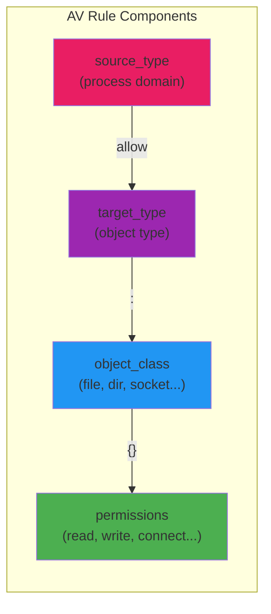
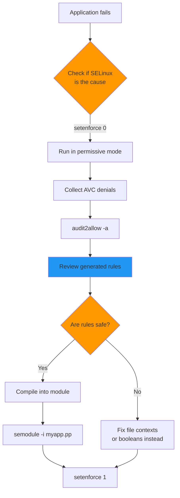
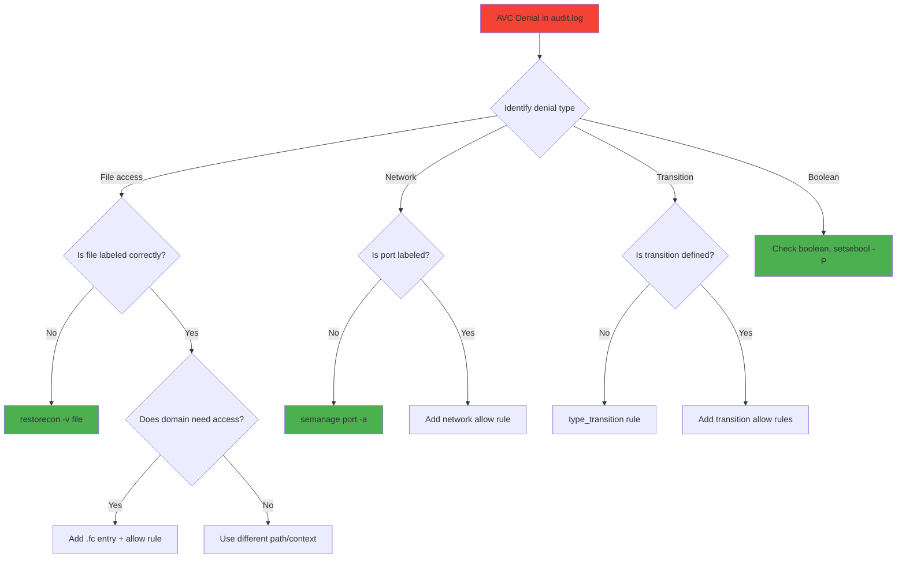
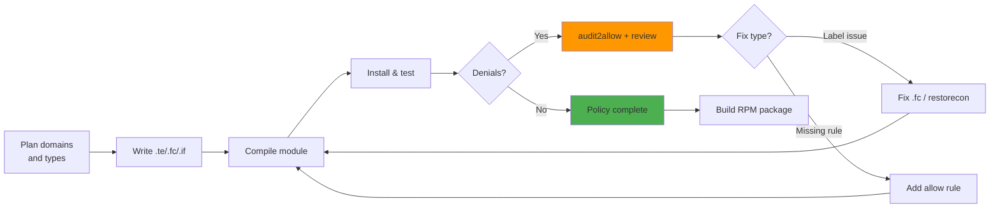

# SELinux Programming Guide

## Introduction

SELinux (Security-Enhanced Linux) programming involves writing, compiling, and managing security policies that enforce Mandatory Access Control (MAC) on Linux systems. While the [base SELinux page](./selinux.md) covers concepts and administration, this guide focuses on the **development side** — writing custom policy modules, understanding type enforcement rules, managing booleans, and using tools like `audit2allow` and `semodule` to build and deploy policies.

SELinux policy is the most complex security policy on any mainstream operating system. A default RHEL/Fedora system ships with over 100,000 policy rules. Understanding how to write, debug, and extend these policies is essential for systems engineers, security auditors, and anyone deploying custom applications on SELinux-enabled systems.

## Policy Architecture

### Layered Policy Model

SELinux policies are built from multiple layers that combine at runtime:

```mermaid
graph TB
    subgraph "Policy Layers"
        MLS[MLS/MCS Constraints]
        TE[Type Enforcement Rules]
        RBAC[RBAC Rules]
        COND[Conditional Rules<br>(Booleans)]
    end

    subgraph "Policy Modules"
        BASE[base-policy<br>(core kernel types)]
        MOD1[module: httpd<br>(web server policy)]
        MOD2[module: postgresql<br>(database policy)]
        MOD3[module: custom-app<br>(your policy)]
    end

    subgraph "Compiled Policy"
        POLICY[policy.33<br>(loaded into kernel)]
    end

    BASE --> POLICY
    MOD1 --> POLICY
    MOD2 --> POLICY
    MOD3 --> POLICY
    TE --> POLICY
    RBAC --> POLICY
    COND --> POLICY
    MLS --> POLICY

    style BASE fill:#4CAF50
    style MOD3 fill:#FF9800
    style POLICY fill:#2196F3
```

### Policy Source Structure

SELinux policy source files use specific file extensions:

| Extension | Purpose | Example |
|-----------|---------|---------|
| `.te` | Type Enforcement rules | `httpd.te` |
| `.fc` | File Contexts labeling | `httpd.fc` |
| `.if` | Interface definitions | `httpd.if` |
| `.spt` | Macro/template source | `apache.spt` |
| `.conf` | Configuration (booleans, etc.) | `setsebool.conf` |

A typical policy module directory:

```
myapp-selinux/
├── Makefile
├── myapp.te          # Type enforcement rules
├── myapp.fc          # File context labels
├── myapp.if          # Public interfaces for other modules
├── myapp_selinux.spec # RPM spec for packaging
└── README.md
```

## Type Enforcement (TE)

Type Enforcement is the core of SELinux policy. Every process runs in a **domain** (a type used for processes), and every object has a **type**. Policy rules define which domain can access which type and how.

### Defining Types and Domains

```te
# myapp.te — Define a new domain for our application

# Declare the process domain
type myapp_t;                     # Process domain type
type myapp_exec_t;                # Executable file type

# Domain transition: when init_t executes a file labeled myapp_exec_t,
# the resulting process transitions to myapp_t
init_daemon_domain(myapp_t, myapp_exec_t)

# Or for systemd services:
# systemd_unit_file(myapp_unit_t)
```

### Access Vector (AV) Rules

AV rules grant specific permissions between domains and types:

```te
# Allow myapp_t to read files labeled etc_t
allow myapp_t etc_t:file { read open getattr };

# Allow myapp_t to connect to TCP port 8080 (labeled http_port_t)
allow myapp_t http_port_t:tcp_socket { name_connect };

# Allow myapp_t to create and write log files
type myapp_log_t;
logging_log_file(myapp_log_t)
allow myapp_t myapp_log_t:file { create write open append getattr setattr };
allow myapp_t myapp_log_t:dir { search write add_name };

# Allow myapp_t to use network
corenet_tcp_bind_generic_node(myapp_t)
corenet_tcp_bind_http_port(myapp_t)
```

### Understanding AV Rule Syntax

```
allow source_type target_type : object_class { permissions };
```



Common object classes and permissions:

```te
# File access
allow domain type:file { read write open create unlink getattr setattr lock append execute };

# Directory access
allow domain type:dir { search read open create rmdir add_name remove_name };

# Network sockets
allow domain port_type:tcp_socket { create connect bind listen accept read write };
allow domain port_type:udp_socket { create bind read write sendto recvfrom };

# Process operations
allow domain type:process { fork transition signal execmod };

# IPC
allow domain type:unix_stream_socket { connectto read write };
```

### Type Transition Rules

Type transitions define how process domains and file types change:

```te
# When myapp_t creates a file in a tmp_t directory,
# the new file gets labeled myapp_tmp_t
type_transition myapp_t tmp_t:file myapp_tmp_t;

# When myapp_t executes a shell script labeled shell_exec_t,
# the new process transitions to shell_t (if allowed)
type_transition myapp_t shell_exec_t:process shell_t;

# For directories
type_transition myapp_t var_t:dir myapp_var_t;
```

**Important**: `type_transition` only sets the *default* label. The `allow` rules must also permit the actual creation:

```te
# The transition says "label new files as myapp_tmp_t"
type_transition myapp_t tmp_t:file myapp_tmp_t;

# But we also need permission to create files of that type
allow myapp_t myapp_tmp_t:file { create write open };

# And permission on the parent directory
allow myapp_t tmp_t:dir { write add_name search };
```

## Policy Interfaces

Interfaces are the public API of a policy module — they allow other modules to interact with your module without knowing its internal types.

### Defining Interfaces

```te
# myapp.if — Interface definitions

## <summary>
## Allow a domain to connect to myapp via TCP.
## </summary>
## <param name="domain">
## <summary>
## Domain allowed to connect.
## </summary>
## </param>
interface(`myapp_tcp_connect',`
    gen_require(`
        type myapp_t;
        type myapp_port_t;
    ')

    allow $1 myapp_port_t:tcp_socket { name_connect };
    allow $1 myapp_t:tcp_socket { connectto };
')

## <summary>
## Read myapp log files.
## </summary>
interface(`myapp_read_log',`
    gen_require(`
        type myapp_log_t;
    ')

    allow $1 myapp_log_t:file { read open getattr };
    allow $1 myapp_log_t:dir { search read };
')
```

### Using Interfaces

```te
# other_module.te — Using myapp's interfaces
# Allow monitoring_t to read myapp logs
myapp_read_log(monitoring_t)

# Allow web_t to connect to myapp
myapp_tcp_connect(web_t)
```

### Built-in Policy Macros

The reference policy provides hundreds of macros:

```te
# Common macros from the reference policy

# File operations
files_read_etc_files(myapp_t)         # Read /etc files
files_manage_var_files(myapp_t)       # Manage /var files
files_search_tmp(myapp_t)             # Search /tmp

# Network operations
corenet_all_recvfrom_unlabeled(myapp_t)
corenet_tcp_sendrecv_generic_if(myapp_t)

# Logging
logging_send_syslog_msg(myapp_t)      # Send to syslog

# System operations
miscfiles_read_localization(myapp_t)  # Read locale files
sysnet_dns_name_resolve(myapp_t)      # DNS resolution
```

## File Contexts

File contexts (`.fc` files) define the default SELinux labels for files on disk.

### File Context Syntax

```te
# myapp.fc — File contexts

# Executable
/usr/bin/myapp            --      system_u:object_r:myapp_exec_t:s0
/usr/sbin/myappd          --      system_u:object_r:myapp_exec_t:s0

# Configuration
/etc/myapp(/.*)?                   system_u:object_r:myapp_conf_t:s0
/etc/myapp/myapp\.conf             system_u:object_r:myapp_conf_t:s0

# Data and logs
/var/lib/myapp(/.*)?               system_u:object_r:myapp_var_lib_t:s0
/var/log/myapp(/.*)?               system_u:object_r:myapp_log_t:s0

# PID file
/run/myapp\.pid                    system_u:object_r:myapp_var_run_t:s0
/run/myapp(/.*)?                   system_u:object_r:myapp_var_run_t:s0

# Systemd unit
/usr/lib/systemd/system/myapp\.service  system_u:object_r:myapp_unit_t:s0
```

### Applying File Contexts

```bash
# Apply file contexts from policy
sudo restorecon -Rv /usr/bin/myapp /etc/myapp /var/lib/myapp

# Add custom contexts without modifying policy
sudo semanage fcontext -a -t myapp_exec_t '/opt/myapp/bin/myapp'
sudo restorecon -v /opt/myapp/bin/myapp

# View current contexts
ls -Z /usr/bin/myapp
# -rwxr-xr-x. 1 root root system_u:object_r:myapp_exec_t:s0 /usr/bin/myapp

# Check what the policy says the label should be
matchpathcon /usr/bin/myapp
# /usr/bin/myapp  system_u:object_r:myapp_exec_t:s0

# List all file context definitions
sudo semanage fcontext -l | grep myapp
```

## Booleans

Booleans are runtime-toggleable policy switches that enable or disable specific permission sets without recompiling policy.

### Defining Booleans

```te
# myapp.te

# Define a boolean
gen_bool(myapp_connect_database, false)

# Conditional rules
if (myapp_connect_database) {
    allow myapp_t postgresql_port_t:tcp_socket { name_connect };
    allow myapp_t postgresql_db_t:file { read open };
} else {
    # Optional: explicit denial or just no access
}
```

### Managing Booleans

```bash
# List all booleans and their current/persistent values
getsebool -a | grep myapp
# myapp_connect_database --> off

# Set boolean (runtime only, lost on reboot)
sudo setsebool myapp_connect_database on

# Set boolean persistently (survives reboot)
sudo setsebool -P myapp_connect_database on

# View boolean details
sudo semanage boolean -l | grep myapp
# myapp_connect_database  (off  ,  off)  Allow myapp to connect to database

# Toggle multiple booleans at once
sudo setsebool -P httpd_can_network_connect on httpd_can_sendmail off
```

### Common Predefined Booleans

```bash
# Web server booleans
httpd_can_network_connect      # httpd can make network connections
httpd_can_network_connect_db   # httpd can connect to databases
httpd_enable_homedirs          # httpd can serve user home directories
httpd_graceful_shutdown        # allow httpd graceful shutdown

# General booleans
nis_enabled                    # NIS support
ssh_sysadm_login              # SSH login for sysadm_r users
```

## Compiling and Loading Policy Modules

### Using semodule_package

```bash
# Step 1: Compile the .te file into a module
checkmodule -M -m -o myapp.mod myapp.te

# Step 2: Package the module with file contexts
semodule_package -o myapp.pp -m myapp.mod -f myapp.fc

# Step 3: Install the module
sudo semodule -i myapp.pp

# Verify installation
sudo semodule -l | grep myapp
```

### Using Makefile (Recommended)

```makefile
# Makefile for SELinux policy module

TARGET = myapp
MODULES = $(TARGET).pp

all: $(MODULES)

%.pp: %.te %.fc %.if
	checkmodule -M -m -o $*.mod $*.te
	semodule_package -o $@ -m $*.mod -f $*.fc

install: $(MODULES)
	semodule -i $<

clean:
	rm -f *.mod *.pp

reload: install
	restorecon -Rv /usr/bin/myapp /etc/myapp /var/lib/myapp
```

### Using sepolicy (Fedora/RHEL)

```bash
# Generate a skeleton policy module
sepolicy generate --init /usr/bin/myapp

# This creates:
#   myapp.te
#   myapp.if
#   myapp.fc
#   myapp_selinux.spec

# Build and install
make -f /usr/share/selinux/devel/Makefile myapp.pp
sudo semodule -i myapp.pp
```

## audit2allow: Generating Policy from Denials

`audit2allow` is the most important SELinux development tool. It reads AVC denial messages from the audit log and generates the `allow` rules needed to permit the denied access.

### Basic Workflow



### Using audit2allow

```bash
# View all denials and suggested rules
sudo ausearch -m avc -ts recent | audit2allow

# Generate a named module
sudo ausearch -m avc -ts recent | audit2allow -M myapp

# This creates:
#   myapp.te  (type enforcement rules)
#   myapp.pp  (compiled policy package)

# Review the generated .te file before installing!
cat myapp.te

# Install the generated module
sudo semodule -i myapp.pp
```

### Best Practices with audit2allow

```bash
# 1. Run in permissive mode to collect ALL denials
sudo setenforce 0
# Run your application thoroughly
sudo setenforce 1

# 2. Collect denials from the permissive run
sudo ausearch -m avc -ts today | audit2allow -M myapp_test

# 3. Review critically — audit2allow suggests the MINIMUM rules,
#    but they may be too broad. Example output to review:
#    allow myapp_t shadow_t:file read;    ← DANGEROUS! Don't allow this
#    allow myapp_t myapp_log_t:file write; ← OK, expected

# 4. Use -R for reference policy suggestions
sudo ausearch -m avc -ts today | audit2allow -R

# 5. Use --neverallow to check against neverallow rules
sudo ausearch -m avc -ts today | audit2allow --neverallow
```

### Common audit2allow Patterns

```bash
# Audit says:
# avc: denied { read } for pid=1234 comm="myapp"
#   path="/etc/myapp/config.yml" dev="sda1" ino=5678
#   scontext=system_u:system_r:myapp_t:s0
#   tcontext=system_u:object_r:unlabeled_t:s0

# Bad fix (allowing access to unlabeled files):
# allow myapp_t unlabeled_t:file read;

# Good fix (correct the file label):
sudo semanage fcontext -a -t myapp_conf_t '/etc/myapp(/.*)?'
sudo restorecon -Rv /etc/myapp

# Or if the file should have a standard label:
sudo restorecon -v /etc/myapp/config.yml
```

## SELinux Networking

### Port Labeling

```bash
# View port labels
sudo semanage port -l | grep http
# http_port_t  tcp  80, 81, 443, 488, 8008, 8009, 8443, 9000

# Add a custom port label for your application
sudo semanage port -a -t myapp_port_t -p tcp 8080
sudo semanage port -a -t myapp_port_t -p tcp 8443

# Modify an existing port label
sudo semanage port -m -t myapp_port_t -p tcp 9090

# Delete a port label
sudo semanage port -d -t myapp_port_t -p tcp 9090
```

### Network-Related TE Rules

```te
# Allow binding to a specific port
type myapp_port_t;
corenet_port(myapp_port_t)

# Allow myapp to bind to its port
allow myapp_t myapp_port_t:tcp_socket { name_bind };

# Allow connecting to a database port
allow myapp_t postgresql_port_t:tcp_socket { name_connect };

# Allow receiving connections from the network
corenet_tcp_recvfrom_unlabeled(myapp_t)

# Allow sending mail (if needed)
corenet_tcp_sendrecv_smtp_port(myapp_t)
```

## SELinux for Containers

Container runtimes need special SELinux handling:

```te
# Container process domain
type container_t;
type container_file_t;

# Container runtime domain (e.g., container_runtime_t)
allow container_runtime_t container_t:process transition;
allow container_runtime_t container_file_t:file { read open execute };

# MCS (Multi-Category Security) for container isolation
# Each container gets unique categories
# container_t:s0:c100,c200 vs container_t:s0:c300,c400
# Containers cannot access each other's files due to MCS
```

### Container SELinux Labels

```bash
# Run container with specific SELinux labels
podman run --security-opt label=type:myapp_t myimage

# Disable SELinux labeling for a container
podman run --security-opt label=disable myimage

# Use a specific MCS category
podman run --security-opt label=level:s0:c100,c200 myimage

# Check container process labels
ps -eZ | grep container_t
# system_u:system_r:container_t:s0:c100,c200 12345 ?  00:00:01 nginx
```

## Policy Analysis and Debugging

### Using seinfo and sesearch

```bash
# Install setools if not present
sudo dnf install setools-console

# List all types in policy
seinfo -t

# List all allow rules involving myapp_t
sesearch -A -s myapp_t

# Find what myapp_t can read
sesearch -A -s myapp_t -c file -p read

# Find all transitions from myapp_t
sesearch -T -s myapp_t

# Find all booleans that affect myapp_t
sesearch -A -s myapp_t -b

# Count policy statistics
seinfo --stats
#   Types:        5234
#   Attributes:    312
#   Allow:      103456
#   Boolean:      345
```

### SELinux Troubleshooting Flowchart



### Writing Custom Audit Rules

```bash
# Monitor all access by a specific domain
sudo auditctl -w /var/lib/myapp -p rwxa -k myapp_files

# Search audit logs for your key
sudo ausearch -k myapp_files

# Real-time monitoring
sudo ausearch -m avc -ts now --raw | audit2why
```

## Complete Policy Module Example

Here is a complete, real-world policy module for a hypothetical application:

```te
# ============================================
# myapp.te — Complete policy module
# ============================================

# Policy module declaration
policy_module(myapp, 1.0.0)

# ── Type Declarations ──────────────────────
type myapp_t;                    # Process domain
type myapp_exec_t;               # Executable
type myapp_conf_t;               # Configuration files
type myapp_var_lib_t;            # Data in /var/lib
type myapp_log_t;                # Log files
type myapp_var_run_t;            # PID/socket files
type myapp_port_t;               # Network port
type myapp_unit_t;               # Systemd unit file
type myapp_tmp_t;                # Temp files

# ── Attribute Declarations ─────────────────
attribute myapp_domain;
attribute myapp_file_type;

# ── Type Attributes ────────────────────────
typeattribute myapp_t myapp_domain;

# ── Boolean Declarations ───────────────────
gen_bool(myapp_use_nfs, false)
gen_bool(myapp_connect_ldap, false)
gen_bool(myapp_send_mail, false)

# ── Domain Transitions ─────────────────────
# Systemd service transition
init_daemon_domain(myapp_t, myapp_exec_t)

# File transitions
type_transition myapp_t tmp_t:file myapp_tmp_t;
type_transition myapp_t var_t:dir myapp_var_lib_t;

# ── Base Policy Rules ──────────────────────

# Allow process operations
allow myapp_t self:process { fork signal sigchld };
allow myapp_t self:fifo_file { read write };
allow myapp_t self:unix_stream_socket create_stream_socket_perms;

# File access
allow myapp_t myapp_exec_t:file { read open execute execute_no_trans getattr };
allow myapp_t myapp_conf_t:file { read open getattr };
allow myapp_t myapp_var_lib_t:dir { search read open create write add_name };
allow myapp_t myapp_var_lib_t:file { create read write open append getattr setattr unlink };
allow myapp_t myapp_log_t:file { create write open append getattr setattr };
allow myapp_t myapp_log_t:dir { search write add_name };
allow myapp_t myapp_var_run_t:file { create read write open getattr setattr unlink };
allow myapp_t myapp_var_run_t:dir { search write add_name };
allow myapp_t myapp_tmp_t:file { create read write open append getattr setattr unlink };

# Network access
allow myapp_t myapp_port_t:tcp_socket { name_bind name_connect };
corenet_tcp_bind_generic_node(myapp_t)
corenet_tcp_sendrecv_generic_if(myapp_t)

# DNS resolution
sysnet_dns_name_resolve(myapp_t)

# Read system files
files_read_etc_files(myapp_t)
files_manage_var_dirs(myapp_t)
miscfiles_read_localization(myapp_t)

# Logging
logging_send_syslog_msg(myapp_t)
logging_log_filetrans(myapp_t, myapp_log_t, file)

# ── Boolean-Conditional Rules ──────────────

tunable_policy(`myapp_use_nfs',`
    fs_nfs_rw_files(myapp_t)
    fs_nfs_rw_dirs(myapp_t)
')

tunable_policy(`myapp_connect_ldap',`
    corenet_tcp_connect_ldap_port(myapp_t)
')

tunable_policy(`myapp_send_mail',`
    corenet_tcp_connect_smtp_port(myapp_t)
')
```

```te
# ============================================
# myapp.fc — File contexts
# ============================================

/usr/bin/myapp                    --  system_u:object_r:myapp_exec_t:s0
/usr/sbin/myappd                  --  system_u:object_r:myapp_exec_t:s0
/etc/myapp(/.*)?                          system_u:object_r:myapp_conf_t:s0
/etc/myapp/config\.yml                    system_u:object_r:myapp_conf_t:s0
/var/lib/myapp(/.*)?                      system_u:object_r:myapp_var_lib_t:s0
/var/log/myapp(/.*)?                      system_u:object_r:myapp_log_t:s0
/run/myapp(/.*)?                          system_u:object_r:myapp_var_run_t:s0
/usr/lib/systemd/system/myapp\.service    system_u:object_r:myapp_unit_t:s0
```

```te
# ============================================
# myapp.if — Interface definitions
# ============================================

## <summary>Allow domain to connect to myapp TCP port.</summary>
interface(`myapp_tcp_connect',`
    gen_require(`
        type myapp_t;
        type myapp_port_t;
    ')
    allow $1 myapp_port_t:tcp_socket { name_connect };
')

## <summary>Allow domain to read myapp log files.</summary>
interface(`myapp_read_log',`
    gen_require(`
        type myapp_log_t;
    ')
    allow $1 myapp_log_t:file { read open getattr };
    allow $1 myapp_log_t:dir { search read };
')

## <summary>Allow domain to manage myapp data.</summary>
interface(`myapp_manage_data',`
    gen_require(`
        type myapp_var_lib_t;
    ')
    allow $1 myapp_var_lib_t:dir list_dir_perms;
    allow $1 myapp_var_lib_t:file manage_file_perms;
')
```

## SELinux Kernel Internals

### The SELinux Kernel Module

The SELinux kernel code resides in `security/selinux/` in the kernel source tree:

```
security/selinux/
├── ss/                    # Security Server (policy engine)
│   ├── policydb.c         # Policy database operations
│   ├── services.c         # Access vector computation
│   ├── conditional.c      # Boolean/conditional evaluation
│   ├── ebitmap.c          # Extended bitmap (for efficient type sets)
│   └── hashtab.c          # Hash table implementation
├── hooks.c                # LSM hook implementations
├── avc.c                  # Access Vector Cache (AVC)
├── netif.c                # Network interface labeling
├── netnode.c              # Network node/port labeling
├── xfrm.c                 # IPsec labeling
└── include/
    └── security/
        └── selinux.h      # Public kernel API
```

### The AVC (Access Vector Cache)

The AVC caches access decisions to avoid recomputing them:

```c
/* Simplified AVC lookup (from security/selinux/avc.c) */
struct avc_entry *avc_lookup(u32 ssid, u32 tsid, u16 tclass)
{
    struct avc_node *node;

    /* Check cache first */
    node = avc_cache_lookup(ssid, tsid, tclass);
    if (node)
        return &node->ae;  /* Cache hit */

    /* Cache miss — query security server */
    return NULL;
}
```

### LSM Hooks

SELinux implements the Linux Security Module interface:

```c
/* Key LSM hooks SELinux implements (from security/selinux/hooks.c) */

static struct security_hook_list selinux_hooks[] = {
    LSM_HOOK_INIT(bprm_set_creds, selinux_bprm_set_creds),
    LSM_HOOK_INIT(inode_permission, selinux_inode_permission),
    LSM_HOOK_INIT(file_permission, selinux_file_permission),
    LSM_HOOK_INIT(socket_create, selinux_socket_create),
    LSM_HOOK_INIT(socket_connect, selinux_socket_connect),
    LSM_HOOK_INIT(socket_bind, selinux_socket_bind),
    LSM_HOOK_INIT(task_kill, selinux_task_kill),
    LSM_HOOK_INIT(sb_mount, selinux_mount),
    /* ... ~200 hooks total */
};
```

## Policy Development Tips

### Common Pitfalls

1. **Never use `audit2allow` output blindly** — always review and understand each rule
2. **Fix file contexts first** — many denials are caused by incorrect labels, not missing rules
3. **Use booleans for optional access** — don't hardcode all permissions
4. **Test in permissive mode** — collect all denials before writing rules
5. **Use reference policy macros** — they handle edge cases you might miss

### Development Workflow



## Kernel Source References

| File | Description |
|------|-------------|
| `security/selinux/hooks.c` | LSM hook implementations |
| `security/selinux/avc.c` | Access Vector Cache |
| `security/selinux/ss/policydb.c` | Policy database |
| `security/selinux/ss/services.c` | Security server |
| `security/selinux/include/security/selinux.h` | Public API |
| `security/selinux/selinuxfs.c` | `/sys/fs/selinux` filesystem |

## Further Reading

- [SELinux Project Wiki](https://selinuxproject.org/)
- [Red Hat SELinux Guide](https://docs.redhat.com/en/documentation/red_hat_enterprise_linux/9/html/using_selinux/)
- [Fedora SELinux Guide](https://docs.fedoraproject.org/en-US/Fedora/23/html/SELinux_Users_and_Administrators_Guide/)
- [Reference Policy Source](https://github.com/SELinuxProject/refpolicy)
- [Dan Walsh's SELinux Blog](https://danwalsh.livejournal.com/)
- Kernel source: `security/selinux/`
