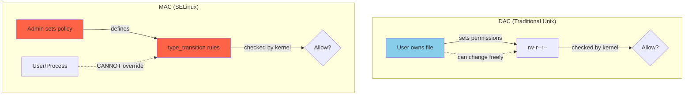
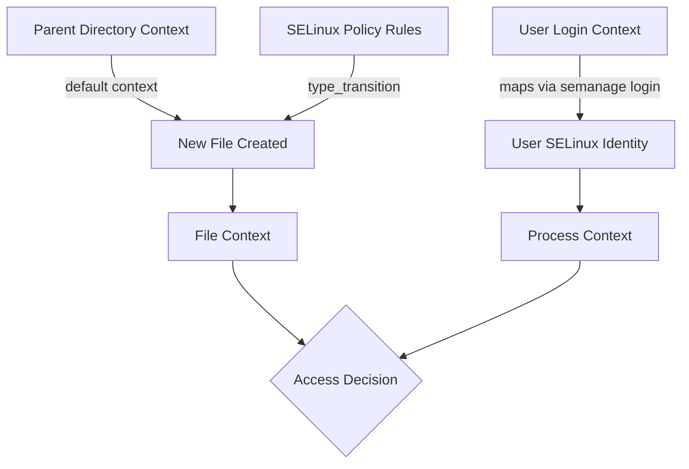
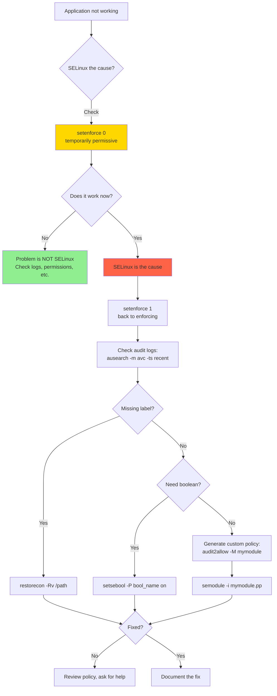

# SELinux (Security-Enhanced Linux)

## Introduction

SELinux (Security-Enhanced Linux) is a **Mandatory Access Control (MAC)** implementation for the Linux kernel, originally developed by the United States National Security Agency (NSA) and released to the open-source community in 2000. It is the default MAC system on Red Hat Enterprise Linux (RHEL), Fedora, CentOS Stream, Rocky Linux, and Android.

Unlike Discretionary Access Control (DAC), where file owners control access permissions, MAC policies are set by the system administrator and **cannot be overridden by users**. SELinux provides fine-grained access control based on **security labels** (contexts) assigned to every process and object on the system. Even root processes are subject to SELinux policy restrictions.

## DAC vs. MAC: The Fundamental Difference



### Why MAC Matters

Consider this scenario:

```bash
# A web server runs as root (bad practice, but common)
# With DAC only:
#   root can read /etc/shadow → web server vulnerability exposes shadow file

# With SELinux:
#   Even though the process runs as root, SELinux labels it as httpd_t
#   httpd_t is NOT allowed to read files labeled shadow_t
#   Access denied, even for root!
```

```bash
# Demonstration: root process denied by SELinux
# As root, try to read a file with wrong context:
cat /var/www/html/index.html    # Works — httpd_t can read httpd_sys_content_t

# If you move a file from /etc to /var/www:
cp /etc/shadow /var/www/html/shadow
cat /var/www/html/shadow         # Root can read (DAC allows)

# But the web server (httpd_t) cannot:
curl http://localhost/shadow     # SELinux denies — shadow_t context
# Check the denial in audit log:
sudo ausearch -m avc -ts recent
# type=AVC msg=audit(...): avc: denied { read } for ...
#   scontext=system_u:system_r:httpd_t:s0
#   tcontext=system_u:object_r:shadow_t:s0
```

## SELinux Security Contexts

Every process and object (file, directory, socket, port, etc.) has a **security context** — a label that SELinux uses for access decisions.

### Context Format

```
user:role:type:level
```

| Component | Description | Example |
|-----------|-------------|---------|
| **User** | SELinux user identity | `system_u`, `unconfined_u` |
| **Role** | Role in RBAC | `system_r`, `object_r`, `unconfined_r` |
| **Type** | Domain/type (most important for TE) | `httpd_t`, `tmp_t` |
| **Level** | MLS/MCS sensitivity and category | `s0`, `s0:c0,c1023` |

### Viewing Contexts

```bash
# File contexts (-Z flag)
ls -Z /var/www/html/
# system_u:object_r:httpd_sys_content_t:s0 index.html
# system_u:object_r:httpd_sys_content_t:s0 style.css

# Process contexts
ps auxZ | grep httpd
# system_u:system_r:httpd_t:s0    root   1234  0.0  0.1 /usr/sbin/httpd
# system_u:system_r:httpd_t:s0    apache 1235  0.0  0.0 /usr/sbin/httpd

# Port contexts
semanage port -l | grep http
# http_port_t                    tcp      80, 81, 443, 488, 8008, 8009, 8443, 9000

# User contexts
semanage login -l
# Login Name    SELinux User    MLS/MCS Range    Service
# __default__   unconfined_u    s0-s0:c0.c1023   *
# root          unconfined_u    s0-s0:c0.c1023   *
# guest_u       guest_u         s0               *
```

### Context Inheritance



```bash
# Files inherit context from parent directory by default
mkdir /var/www/html/images
ls -Zd /var/www/html/images
# system_u:object_r:httpd_sys_content_t:s0 /var/www/html/images
# Inherits httpd_sys_content_t from /var/www/html

# restorecon resets contexts to policy defaults
restorecon -Rv /var/www/html/
# Relabeled /var/www/html/shadow from unconfined_u:object_r:shadow_t:s0
#                                to system_u:object_r:httpd_sys_content_t:s0

# chcon changes context temporarily (lost on restorecon)
chcon -t httpd_sys_content_t /tmp/myfile.html

# semanage fcontext sets persistent context mappings
sudo semanage fcontext -a -t httpd_sys_content_t "/data/www(/.*)?"
sudo restorecon -Rv /data/www/
```

## SELinux Policy Types

### Targeted Policy

The default policy on RHEL/Fedora. It confines specific daemons (httpd, named, sshd, etc.) while leaving user processes in the `unconfined_t` domain.

```bash
# Check the active policy
sestatus
# SELinux status:                 enabled
# SELinuxfs mount:                /sys/fs/selinux
# SELinux root directory:         /etc/selinux
# Loaded policy name:             targeted
# Current mode:                   enforcing
# Mode from config file:          enforcing
# Policy MLS status:              enabled
# Policy deny_unknown status:     allowed
# Memory protection checking:     actual (secure)
# Max kernel policy version:      33
```

### MLS (Multi-Level Security)

Used in government/military environments. Implements Bell-LaPadula model with sensitivity levels (Unclassified, Confidential, Secret, Top Secret) and categories (compartments).

```bash
# MLS context example
# Top Secret, compartments 1 and 5:
# TopSecret:secret_r:topsecret_t:s1-s5
```

### Minimum Policy

A subset of the targeted policy that confines only a few key services, useful for systems with limited resources.

## SELinux Policy Language

### Type Enforcement (TE)

Type Enforcement is the core of SELinux policy. Rules define what **types** (labels) can access what **resources** with what **permissions**.

```
# Example policy rules (in .te source files):

# Allow httpd_t to read files labeled httpd_sys_content_t
allow httpd_t httpd_sys_content_t:file { read getattr open };

# Allow httpd_t to connect to MySQL port
allow httpd_t mysqld_port_t:tcp_socket { name_connect };

# Type transition: when httpd_t creates a file in tmp_t,
# label it httpd_tmp_t instead
type_transition httpd_t tmp_t:file httpd_tmp_t;
```

### Understanding allow Rules

```
allow source_type target_type : object_class { permissions };
```

```bash
# Example: reading the actual policy
sesearch --allow -s httpd_t -t httpd_sys_content_t -c file
# Found 1 semantic allow rules:
#    allow httpd_t httpd_sys_content_t:file { ioctl read getattr lock open };
```

### Booleans

Booleans are on/off switches that modify policy behavior without editing policy source:

```bash
# List all booleans
getsebool -a | head -20
# abrt_anon_write --> off
# abrt_handle_event --> off
# abrt_upload_watch_anon_write --> off
# ...
# httpd_can_network_connect --> off
# httpd_can_network_connect_db --> off
# httpd_enable_cgi --> on
# ...

# Get a specific boolean
getsebool httpd_can_network_connect
# httpd_can_network_connect --> off

# Set a boolean (runtime + persistent)
sudo setsebool -P httpd_can_network_connect on
# -P = persistent (survives reboot)

# Common httpd booleans
sudo setsebool -P httpd_can_network_connect on       # Allow outbound connections
sudo setsebool -P httpd_can_network_connect_db on    # Allow DB connections
sudo setsebool -P httpd_enable_homedirs on            # Serve from ~/public_html
sudo setsebool -P httpd_use_nfs on                    # Use NFS-mounted content

# Find booleans related to a keyword
semanage boolean -l | grep httpd
```

## SELinux Modes

```bash
# Check current mode
getenforce
# Enforcing

# Modes:
# Enforcing  — Policy is enforced, denials are logged
# Permissive — Policy is NOT enforced, denials are logged (for debugging)
# Disabled   — SELinux is completely off (requires reboot to re-enable)

# Temporarily switch to permissive (for troubleshooting)
sudo setenforce 0
getenforce
# Permissive

# Switch back to enforcing
sudo setenforce 1

# Permanently change mode (requires reboot for disabled ↔ enabled)
sudo vi /etc/selinux/config
# SELINUX=enforcing    ← set to enforcing, permissive, or disabled
# SELINUXTYPE=targeted
```

**Warning**: Disabling SELinux requires a full reboot to re-enable, because files created while disabled won't have proper labels. Always use Permissive mode for troubleshooting instead.

## Troubleshooting SELinux

### Reading Denial Messages

```bash
# View recent SELinux denials
sudo ausearch -m avc -ts recent
# type=AVC msg=audit(1690000245.123:456): avc:  denied  { read } for
#   pid=1234 comm="httpd" name="shadow" dev="sda1" ino=56789
#   scontext=system_u:system_r:httpd_t:s0
#   tcontext=system_u:object_r:shadow_t:s0
#   tclass=file permissive=0

# Breakdown:
# { read }          — The denied permission
# pid=1234          — Process ID
# comm="httpd"      — Process name
# scontext=...      — Source context (the process)
# tcontext=...      — Target context (the file)
# tclass=file       — Object class
# permissive=0      — Was enforcing (0) or permissive (1)

# Human-readable format
sudo ausearch -m avc -ts recent | audit2why
# type=AVC msg=audit(...): avc: denied { read } for ...
#     Was caused by:
#         Missing file context on /var/www/html/shadow.
#         The default SELinux type for this path is httpd_sys_content_t.
#         Run: restorecon -v /var/www/html/shadow
```

### setroubleshoot

The `setroubleshoot` framework provides user-friendly explanations of SELinux denials:

```bash
# Install setroubleshoot
sudo dnf install setroubleshoot-server setroubleshoot-plugins

# View troubleshooting alerts
sudo sealert -a /var/log/audit/audit.log
# *****  Plugin catchall_boolean (76.5 confidence) suggests   **********
#
# If you want to allow httpd to can network connect
# Then you must tell SELinux about this by enabling the 'httpd_can_network_connect' boolean.
#
# Do
# setsebool -P httpd_can_network_connect 1
#
# *****  Plugin restorecon (8.71 confidence) suggests      **********
#
# If you want to fix the label...
# restorecon -v /var/www/html/shadow

# Watch for real-time alerts
sudo sealert -b    # GUI version (needs desktop)
```

### Common Troubleshooting Workflow



### Generating Custom Policy Modules

```bash
# From denial messages, generate a policy module
sudo ausearch -m avc -ts recent | audit2allow -M myfix
# ******************** IMPORTANT ***********************
# To make this policy package active, execute:
# semodule -i myfix.pp

# Review the generated .te file before loading!
cat myfix.te
# module myfix 1.0;
# require {
#     type httpd_t;
#     type mysqld_port_t;
#     class tcp_socket { name_connect };
# }
# allow httpd_t mysqld_port_t:tcp_socket { name_connect };

# Install the module
sudo semodule -i myfix.pp

# WARNING: audit2allow generates the MINIMUM policy to silence denials.
# Always review generated rules — blindly loading them can weaken security.
# The proper fix might be a boolean or correct labeling instead.
```

## Practical SELinux Administration

### Managing File Contexts

```bash
# View default file context rules
semanage fcontext -l | grep /var/www
# /var/www(/.*)?          all files   system_u:object_r:httpd_sys_content_t:s0
# /var/www/cgi-bin(/.*)?  all files   system_u:object_r:httpd_sys_script_exec_t:s0

# Add a custom context for a non-standard directory
sudo semanage fcontext -a -t httpd_sys_content_t "/srv/webapp(/.*)?"
sudo restorecon -Rv /srv/webapp/
# Relabeled /srv/webapp from unconfined_u:object_r:default_t:s0
#                       to system_u:object_r:httpd_sys_content_t:s0

# Modify an existing context
sudo semanage fcontext -m -t httpd_sys_content_t "/var/www/html(/.*)?"

# Delete a custom context
sudo semanage fcontext -d "/srv/webapp(/.*)?"
```

### Managing Port Contexts

```bash
# List port contexts
semanage port -l | grep http
# http_port_t    tcp    80, 81, 443, 488, 8008, 8009, 8443, 9000

# Add a custom port for httpd
sudo semanage port -a -t http_port_t -p tcp 8080
# Now httpd can bind to port 8080

# Modify an existing port mapping
sudo semanage port -m -t http_port_t -p tcp 8888

# Delete a custom port
sudo semanage port -d -t http_port_t -p tcp 8080
```

### Managing User Mappings

```bash
# Map Linux users to SELinux users
sudo semanage login -a -s user_u bob
# Bob will run in the user_u domain (more confined than unconfined_u)

# Map a range of UIDs
sudo semanage login -a -s staff_u -r s0:c0.c1023 '%users'

# View SELinux users
semanage user -l
# SELinux User  Labeling  MLS/       MLS/
#               prefix    MCS Level  MCS Range     SELinux Roles
# guest_u       user      s0         s0            guest_r
# root          user      s0         s0-s0:c0.c1023  staff_r sysadm_r system_r unconfined_r
# staff_u       user      s0         s0-s0:c0.c1023  staff_r sysadm_r
# sysadm_u      user      s0         s0-s0:c0.c1023  sysadm_r
# unconfined_u  user      s0         s0-s0:c0.c1023  system_r unconfined_r
# user_u        user      s0         s0            user_r
```

### SELinux and Containers

SELinux provides strong container isolation:

```bash
# Containers run with MCS (Multi-Category Security) labels
# Each container gets a unique category pair (e.g., s0:c123,c456)
# This prevents containers from accessing each other's files

# View container processes
ps auxZ | grep container
# system_u:system_r:container_t:s0:c123,c456 root 1234 ...
# system_u:system_r:container_t:s0:c789,c012 root 5678 ...
#                                      ^^^^^^^^^^^^
#                                      Unique categories per container

# Disable SELinux confinement for a specific container (NOT recommended)
podman run --security-opt label=disable myimage

# Set a specific label
podman run --security-opt label=level:s0:c100,c200 myimage
```

## SELinux Reference Policy

The reference policy is the modular policy source used by major distributions:

```bash
# Policy modules are stored as compiled .pp files
ls /var/lib/selinux/targeted/active/modules/400/
# abrt  cups  httpd  init  kernel  mount  sshd  unconfined  ...

# View the policy store size
sudo semodule -l | wc -l
# ~400 modules

# List loaded modules
sudo semodule -l | grep httpd
# httpd    2.0

# Disable a module (set to 0 priority)
sudo semodule -d httpd

# Re-enable
sudo semodule -e httpd
```

## Performance Considerations

SELinux adds minimal overhead:

```bash
# Benchmark: file access with and without SELinux
# Typical overhead: 1-3% for file operations, <1% for network operations

# The main cost is memory for the AVC (Access Vector Cache)
# Default AVC size is 512 entries
cat /sys/fs/selinux/avc/cache_threshold
# 512

# Monitor AVC statistics
sudo avcstat
# lookups    hits    misses  allocations  reclaims  frees
# 1234567    1234000  567     567          0         0
# High miss rate indicates the cache is too small
```

## SELinux vs. AppArmor

| Feature | SELinux | AppArmor |
|---------|---------|----------|
| Labeling | Label-based (inode xattr) | Path-based |
| Complexity | High (full TE/RBAC/MLS) | Lower (profile-based) |
| Default distros | RHEL, Fedora, Android | Ubuntu, SUSE, Debian |
| Learning curve | Steep | Moderate |
| Flexibility | Very high | Moderate |
| File moves | Context follows file | Profile uses path |
| Per-file control | Yes (fine-grained types) | Yes (path globs) |

See [AppArmor](./apparmor.md) for detailed comparison and usage.

## References

- [The Linux Kernel Documentation](https://docs.kernel.org/)
- [LWN.net - Linux and free software news](https://lwn.net/)
- [GNU Project Documentation](https://www.gnu.org/doc/doc.html)
- [GNU Manuals](https://www.gnu.org/manual/manual.html)
- [Free Software Directory](https://directory.fsf.org/wiki/Main_Page)
- [Planet GNU](https://planet.gnu.org/)
- [Free Software Books](https://www.gnu.org/doc/other-free-books.html)

- SELinux Project Wiki: https://selinuxproject.org/
- Red Hat SELinux Documentation: https://docs.redhat.com/en/documentation/red_hat_enterprise_linux/9/html/using_selinux/
- Fedora SELinux Guide: https://docs.fedoraproject.org/en-US/Fedora/25/html/SELinux_Users_and_Administrators_Guide/
- SELinux Notebook (Tresys): https://github.com/SELinuxProject/selinux-notebook
- NSA SELinux Original Paper: https://www.nsa.gov/Research/Selinux/
- Dan Walsh SELinux Blog: https://danwalsh.livejournal.com/
- `man 8 selinux` — SELinux overview
- `man 8 semanage` — SELinux policy management tool
- `man 8 sealert` — SELinux alert diagnosis tool
- `man 8 restorecon` — Restore file security contexts

## Related Topics

- [Linux Security Overview](./overview.md) — Where SELinux fits in the security architecture
- [AppArmor](./apparmor.md) — Alternative MAC implementation
- [Security Model](./security-model.md) — Traditional Unix DAC that SELinux augments
- [Capabilities](./capabilities.md) — Fine-grained root privileges
- [Seccomp](./seccomp.md) — Syscall filtering used alongside SELinux
- [Hardening](./hardening.md) — General system hardening including SELinux configuration
