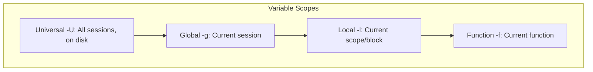

# Fish (Friendly Interactive Shell)

## Introduction

Fish is a smart, user-friendly command-line shell designed to be discoverable and readable out of the box. Unlike Bash and Zsh, Fish is **not POSIX-compatible** — it deliberately breaks from POSIX syntax to provide a cleaner, more consistent language. Fish provides syntax highlighting, autosuggestions, and tab completion without any plugins or configuration.

## Key Philosophy

Fish prioritizes:
1. **Discoverability**: Features work without reading manuals
2. **Consistency**: Fewer special cases and gotchas
3. **User-friendliness**: Sensible defaults, rich color
4. **Scripting clarity**: Cleaner syntax than POSIX sh

## Syntax Highlighting (Built-in)

Fish highlights commands as you type:

```fish
# Valid commands appear in the default color
ls /tmp

# Unknown commands appear in red
nonexistent_command

# Strings are quoted with color
echo "hello world"

# Errors (unclosed quotes, invalid syntax) are highlighted
echo "unterminated

# Redirections are highlighted differently
echo test > /dev/null

# Command-specific coloring
# Options: specific color
# File paths: colored by type
```

### Configuration

```fish
# Disable specific highlighting
set -g fish_color_command normal
set -g fish_color_error red --bold
set -g fish_color_param cyan
set -g fish_color_quote yellow
set -g fish_color_redirection magenta
set -g fish_color_comment brblack

# View all color settings
set -n | grep fish_color
```

## Autosuggestions (Built-in)

Fish shows autosuggestions from history as gray text after the cursor:

```fish
# Type partial command
doc<TAB>
# Suggests: docker-compose up -d  (from history)

# Accept suggestion: → (right arrow) or End
# Accept one word: Alt+→ or Ctrl+→
# Accept and execute: Alt+Enter

# Autosuggestion sources (in order):
# 1. History matches
# 2. Completions
# 3. Known directories
```

## Abbreviations

Abbreviations are like aliases but expand inline, so you can see the full command:

```fish
# Define abbreviation
abbr -a gs git status
abbr -a gc git commit
abbr -a gp git push
abbr -a gl git log --oneline --graph

# Use
gs<TAB>
# Expands to: git status

# Abbreviations with positional arguments
abbr -a gcmsg git commit -m

# With command-specific expansion
abbr -a --position command gc git commit

# List abbreviations
abbr -l

# Remove abbreviation
abbr -e gs
```

### Abbreviations vs Aliases

| Feature | Abbreviation | Alias |
|---|---|---|
| Expansion | Inline (visible) | Hidden |
| History | Expanded form stored | Alias name stored |
| Editing | Can modify before executing | Runs immediately |
| Tab completion | Works after expansion | May need setup |

## Universal Variables

Fish's universal variables persist across all sessions automatically:

```fish
# Universal variable (persists across sessions, written to disk)
set -U EDITOR vim
set -U fish_greeting "Welcome to Fish!"

# Global variable (current session only)
set -g my_var "hello"

# Local variable (current scope only)
set -l temp "temp"

# Function variable (current function)
set -f func_var "in function"

# Export to child processes
set -gx LANG en_US.UTF-8
set -gx PATH $PATH /usr/local/bin

# View all universal variables
set -U

# View where variables are stored
cat ~/.config/fish/fish_variables
```

### Variable Scoping



## Tab Completion

Fish has rich built-in completion:

```fish
# Command completion
git <TAB>
# add        - Add file contents to the index
# bisect     - Find the change that introduced a bug
# branch     - List, create, or delete branches
# checkout   - Switch branches or restore files
# ...

# Option completion
git commit --<TAB>
# --all             - Tell the command to automatically stage files
# --amend           - Amend the tip of the branch
# --author          - Override the commit author
# --message         - Use the given message as the commit message
# ...

# File completion with type indicators
ls <TAB>
# Documents/    (directory, with trailing /)
# file.txt      (file)
# script.sh     (executable, green)

# Process completion
kill <TAB>
# Shows running processes with PIDs

# Variable completion
echo $fish_<TAB>
# $fish_color_command  $fish_pid  $fish_version  ...
```

### Writing Custom Completions

```fish
# ~/.config/fish/completions/mycommand.fish

# Simple completion
complete -c mycommand -a "start stop restart status" -d "Service action"

# File completion
complete -c mycommand -f  # Disable file completion
complete -c mycommand -a "(__fish_complete_suffix .txt)" -d "Text files"

# Conditional completion
complete -c mycommand -n "__fish_seen_subcommand_from start" \
    -a "option1 option2" -d "Start options"

complete -c mycommand -n "__fish_seen_subcommand_from stop" \
    -a "--force --graceful" -d "Stop options"

# Dynamic completion from command output
complete -c mycommand -a "(mycommand --list-choices)"

# Exclusive subcommands (no file completion)
complete -c git -n "__fish_use_subcommand" -a commit -d "Record changes"
complete -c git -n "__fish_seen_subcommand_from commit" \
    -s m -d "Commit message" -r
```

## Fish Functions

```fish
# Define a function
function greet
    echo "Hello, $argv[1]!"
end

# With description
function greet -d "Greet someone by name"
    echo "Hello, $argv[1]!"
end

# With arguments handling
function mkcd
    mkdir -p $argv[1]
    cd $argv[1]
end

# With event handlers
function on_exit --on-event fish_exit
    echo "Goodbye!"
end

function on_pwd --on-variable PWD
    echo "Directory changed to: $PWD"
end

# Wrapping existing commands
function ls --wraps ls --description "List with colors"
    command ls --color=auto $argv
end

# Function with options parsing
function myutil
    argparse 'h/help' 'v/verbose' 'n/name=' -- $argv
    or return

    if set -q _flag_help
        echo "Usage: myutil [-h] [-v] [-n NAME]"
        return
    end

    if set -q _flag_verbose
        echo "Verbose mode"
    end

    if set -q _flag_name
        echo "Name: $_flag_name"
    end

    echo "Args: $argv"
end
```

## Web Configuration

Fish includes a web-based configuration UI:

```fish
# Open web config
fish_config

# Or specific tabs
fish_config prompt   # Prompt configuration
fish_config colors   # Color scheme configuration

# This opens a browser at http://localhost:8000
```

### Available Prompts

```fish
# List available prompts
fish_config prompt show

# Set a prompt theme
fish_config prompt choose <name>

# Popular prompts:
# informative_vcs  - Git info, command duration
# classic          - Traditional prompt
# classic_vcs      - Classic with git info
# terlar           - Compact, informative
# astronaut        - Unicode decorations
```

### Color Schemes

```fish
# Browse color schemes
fish_config colors show

# Apply a scheme
fish_config colors choose <name>

# Popular schemes:
# default    - Fish default colors
# solarized  - Solarized dark/light
# dracula    - Dracula theme
# nord       - Nord theme
# zenburn    - Zenburn theme
```

## Fish Scripting

### Conditionals

```fish
if test -f /etc/passwd
    echo "File exists"
else if test -d /etc
    echo "Directory exists"
else
    echo "Neither"
end

# String comparison
if test "$var" = "hello"
    echo "Match"
end

# Numeric comparison
if test $count -gt 10
    echo "More than 10"
end

# Modern test syntax
if string match -q "*.txt" $filename
    echo "Text file"
end
```

### Loops

```fish
# For loop
for file in *.txt
    echo "Processing: $file"
end

# C-style for loop
for i in (seq 1 10)
    echo $i
end

# While loop
while read -la line
    echo "Line: $line"
end < input.txt

# Piping into while
cat file.txt | while read -la line
    echo $line
end
```

### Error Handling

```fish
# Check exit status
if command_that_might_fail
    echo "Success"
else
    echo "Failed"
end

# or: run second command if first fails
command || fallback_command

# and: run second command if first succeeds
command && next_command

# begin/end blocks
begin
    command1
    command2
end; or echo "Something failed"
```

### String Manipulation

```fish
# String operations (no need for external commands)
set str "Hello, World!"

echo (string length $str)          # 13
echo (string sub -s 1 -l 5 $str)  # Hello
echo (string upper $str)           # HELLO, WORLD!
echo (string lower $str)           # hello, world!
echo (string replace "World" "Fish" $str)  # Hello, Fish!
echo (string match "*.txt" file.txt)       # file.txt
echo (string split "," $str)       # "Hello" " World!"

# Trim
echo (string trim "  hello  ")    # hello

# Repeat
echo (string repeat -n 5 "*")     # *****
```

## Fish vs Bash Scripting

| Feature | Fish | Bash |
|---|---|---|
| Variable assignment | `set var value` | `var=value` |
| Variable access | `$var` | `$var` or `${var}` |
| Environment export | `set -gx VAR val` | `export VAR=val` |
| Conditionals | `if test ...` | `if [ ... ]` or `if [[ ... ]]` |
| Loops | `for x in ...` | `for x in ...` |
| Command substitution | `(command)` | `$(command)` or `` `command` `` |
| Arrays | `set arr a b c` | `arr=(a b c)` |
| String quoting | Single = literal, Double = expand | Same |
| Heredocs | `read` in pipe | `<<EOF` |
| Arithmetic | `math` command | `$((expr))` |

### Migration Tips

```bash
# Bash
export PATH="$PATH:/usr/local/bin"
for i in {1..10}; do echo $i; done
result=$(grep -r "pattern" /path)
array=("one" "two" "three")
echo ${array[1]}

# Fish equivalent
set -gx PATH $PATH /usr/local/bin
for i in (seq 1 10); echo $i; end
set result (grep -r "pattern" /path)
set array one two three
echo $array[1]  # Fish arrays are 1-indexed
```

## Useful Built-in Commands

```fish
# math - Calculator
math "3 + 4 * 2"        # 11
math "sqrt(2)"          # 1.414214
math "2 ^ 10"           # 1024

# string - String manipulation
string match "*.txt" file.txt  # file.txt
string split ":" $PATH         # Split PATH

# status - Shell status
status is-login         # True if login shell
status is-interactive   # True if interactive
status current-command  # Current command name

# fish_config - Configuration
fish_config theme       # List themes
fish_config prompt      # List prompts

# type - Show command type
type ls                 # ls is /usr/bin/ls
type cd                 # cd is a builtin

# help - Open documentation
help                    # Open docs in browser
help command            # Open command docs
```

## Installation and Setup

```bash
# Install on Ubuntu/Debian
sudo apt-add-repository ppa:fish-shell/release-3
sudo apt update
sudo apt install fish

# Install on macOS
brew install fish

# Install on Fedora
sudo dnf install fish

# Set as default shell
echo /usr/bin/fish | sudo tee -a /etc/shells
chsh -s /usr/bin/fish
```

### Configuration Directory

```
~/.config/fish/
├── config.fish          # Main configuration (like .bashrc)
├── fish_variables       # Universal variables (auto-managed)
├── functions/           # Autoloaded functions
│   ├── fish_prompt.fish
│   ├── fish_greeting.fish
│   └── my_function.fish
├── completions/         # Autoloaded completions
│   └── mycommand.fish
└── conf.d/              # Configuration snippets
    └── my_config.fish
```

## Plugin Ecosystem

### Fisher

Fisher is the most popular Fish plugin manager — it has zero dependencies and installs plugins directly into `~/.config/fish/`:

```fish
# Install Fisher
curl -sL https://raw.githubusercontent.com/jorgebucaran/fisher/main/functions/fisher.fish | source && fisher install jorgebucaran/fisher

# Install a plugin
fisher install jorgebucaran/autopair.fish    # Auto-close brackets/quotes
fisher install PatrickF1/fzf.fish            # fzf integration
fisher install jethrokuan/z                  # Directory jumping (like z.sh)
fisher install ilancosman/tide@v6            # Powerline-style prompt
fisher install jorgebucaran/nvm.fish         # Node.js version manager
fisher install franciscolourenco/done        # Notification when long commands finish

# List installed plugins
fisher list

# Update all plugins
fisher update

# Remove a plugin
fisher remove jorgebucaran/autopair.fish

# Install from a gist
fisher install https://gist.github.com/user/id

# Fisher installs files directly into:
# ~/.config/fish/functions/   (functions)
# ~/.config/fish/completions/ (completions)
# ~/.config/conf.d/           (conf.d snippets)
```

### Oh My Fish (OMF)

Oh My Fish is an older plugin framework with a theme system:

```fish
# Install Oh My Fish
curl https://raw.githubusercontent.com/oh-my-fish/oh-my-fish/master/bin/install | fish

# Install a theme
omf install agnoster

# List available themes
omf list

# Install a plugin
omf install bass          # Bash utility support (source bash env)
omf install foreign-env   # Import env from other shells

# Change theme
omf theme bobthefish

# Update everything
omf update

# Remove Oh My Fish
omf destroy
```

### Popular Plugins

| Plugin | Description |
|--------|-------------|
| `autopair.fish` | Auto-close `()`, `[]`, `{}`, `""`, `''` |
| `fzf.fish` | fzf integration for history, files, variables |
| `z` or `zoxide` | Fast directory jumping by frecency |
| `tide` | Powerline prompt (like Powerlevel10k for Zsh) |
| `bass` | Source Bash/Zsh scripts in Fish |
| `done` | Notify when long-running commands complete |
| `grc` | Generic colouriser for common commands |
| `nvm.fish` | Node Version Manager for Fish |
| `sdkman-for-fish` | SDKMAN integration for Java ecosystem |
| `pisces` | Auto-close pairs (lighter alternative to autopair) |
| `sponge` | Clean failed commands from history |
| `puffer-fish` | Typing shorthand expansions (`...` → `../..`) |

## fzf Integration

fzf (fuzzy finder) integrates deeply with Fish:

```fish
# Install the fzf.fish plugin
fisher install PatrickF1/fzf.fish

# fzf.fish provides these key bindings (default):
# Ctrl+R  — Search command history
# Ctrl+T  — Search files in current directory
# Ctrl+V  — Search environment variables
# Alt+C   — Search subdirectories and cd into selection
# Alt+L   — Search git log

# Manual fzf integration (without plugin)
# History search
function fzf_history
    history | fzf --no-sort | read -l command
    and commandline -rb $command
end
bind \cr fzf_history

# File search
function fzf_files
    set -l file (find . -type f 2>/dev/null | fzf)
    and commandline -i $file
end
bind \ct fzf_files

# Git branch checkout
function fzf_git_branch
    set -l branch (git branch -a | fzf --height 40% | string trim)
    and git checkout $branch
end
```

## Key Bindings

Fish has configurable key bindings for both Emacs (default) and Vi mode:

```fish
# View current bindings
bind --all

# Emacs mode (default) key bindings:
# Ctrl+A  — Beginning of line
# Ctrl+E  — End of line
# Ctrl+W  — Delete word backward
# Ctrl+U  — Delete to beginning of line
# Ctrl+K  — Delete to end of line
# Ctrl+Y  — Paste (yank) from killring
# Alt+D   — Delete word forward
# Alt+L   — Lowercase word
# Alt+U   — Uppercase word

# Vi mode
fish_vi_key_bindings

# Switch back to Emacs mode
fish_default_key_bindings

# Custom key binding
bind \cg 'git status'           # Ctrl+G runs git status
bind \el 'ls -la'               # Alt+L runs ls -la

# Bind in different modes
bind -M insert \ce 'edit_config'  # In insert mode
bind -M default \ce 'edit_config'  # In normal mode

# Custom function bound to a key
function __fish_toggle_sudo
    set -l cmd (commandline)
    if string match -q 'sudo *' $cmd
        commandline (string replace 'sudo ' '' $cmd)
    else
        commandline "sudo $cmd"
    end
end
bind \es __fish_toggle_sudo     # Alt+S toggles sudo prefix
```

### Vi Mode

```fish
# Enable Vi mode permanently
set -U fish_key_bindings fish_vi_key_bindings

# Vi mode indicator in prompt
function fish_mode_prompt
    switch $fish_bind_mode
        case default
            set_color --bold red
            echo '[N] '
        case insert
            set_color --bold green
            echo '[I] '
        case replace_one
            set_color --bold cyan
            echo '[R] '
        case visual
            set_color --bold magenta
            echo '[V] '
    end
    set_color normal
end
```

## Performance and Startup Time

Fish is notably fast compared to Zsh with many plugins:

```fish
# Measure Fish startup time
time fish -i -c exit

# Typical times:
# Fish (no plugins):    ~30-50ms
# Fish (10 plugins):    ~50-100ms
# Zsh (Oh-My-Zsh):     ~200-500ms
# Bash:                 ~20-40ms

# Profile startup
fish --profile /tmp/fish_prof -i -c exit
sort -nk 2 /tmp/fish_prof | tail -20

# Check what autoloads on startup
fish -c 'functions --details fish_prompt'
# /home/user/.config/fish/functions/fish_prompt.fish
```

### Why Fish Is Fast

1. **No plugin loading at startup**: Fish uses autoloading — functions in `~/.config/fish/functions/` are loaded on first use, not at startup.
2. **No init file scanning**: Unlike Zsh (which sources `.zshrc`), Fish reads `config.fish` once, and universal variables are cached.
3. **Built-in completions**: Completion scripts are cached and autoloaded per-command.
4. **Efficient C++ core**: The core shell is written in C++ with minimal startup overhead.

## Fish with Modern Tools

### Starship Prompt

```fish
# Install Starship
curl -sS https://starship.rs/install.sh | sh

# Add to config.fish
# ~/.config/fish/config.fish
starship init fish | source

# Starship config: ~/.config/starship.toml
# Shows: git status, node/python/rust versions, cmd duration, etc.
```

### zoxide (Smarter cd)

```fish
# Install zoxide
curl -sSfL https://raw.githubusercontent.com/ajeetdsouza/zoxide/main/install.sh | sh

# Add to config.fish
zoxide init fish | source

# Now use 'z' instead of 'cd'
z projects         # Jump to most frecent match
z foo bar          # Jump to dir matching both "foo" and "bar"
zi                 # Interactive selection with fzf
```

### direnv (Per-directory Environment)

```fish
# Install direnv
sudo apt install direnv   # or brew install direnv

# Add to config.fish
direnv hook fish | source

# Create .envrc in a project directory
echo 'export NODE_ENV=development' > .envrc
direnv allow

# Now the env vars activate automatically when you cd into the directory
```

## Nix and home-manager Integration

```fish
# Fish is a first-class citizen in the Nix ecosystem

# Install via Nix
nix-env -iA nixpkgs.fish

# home-manager configuration
# ~/.config/home-manager/home.nix
{
  programs.fish = {
    enable = true;
    shellInit = ''
      set -gx EDITOR vim
    '';
    shellAbbrs = {
      gs = "git status";
      gc = "git commit";
    };
    plugins = [
      {
        name = "autopair";
        src = pkgs.fetchFromGitHub {
          owner = "jorgebucaran";
          repo = "autopair.fish";
          rev = "1.0.4";
          sha256 = "...";
        };
      }
    ];
  };
}
```

## Debugging Fish Scripts

```fish
# Enable debug output
fish --debug-level=3

# Debug specific categories
fish --debug='config'      # Debug config loading
fish --debug='complete'    # Debug completion
fish --debug='history'     # Debug history

# Trace function execution
function myfunc --no-scope-shadowing
    set -g fish_trace 1
    # ... commands will be traced ...
    set -g fish_trace 0
end

# Print debug info
fish -c 'echo $version'
# 3.7.0

fish -c 'echo $fish_pid'

# Check Fish installation
type fish
# fish is /usr/bin/fish

# Validate syntax
fish -n ~/.config/fish/config.fish
# (no output = valid)
```

## Fish 4.0+ Features

Recent Fish versions have added significant capabilities:

```fish
# Fish 3.6+: Improved string operations
string match -r '(?<year>\d{4})-(?<month>\d{2})' '2024-07'
# year=2024 month=07

# Fish 3.6+: $status_stack
# Access exit status of previous commands in a pipeline

# Fish 4.0+ (planned):
# - Rust rewrite of parts of the core
# - Improved startup performance
# - Better Windows support
```

## References

- [Fish Shell Documentation](https://fishshell.com/docs/current/)
- [Fish Shell Tutorial](https://fishshell.com/docs/current/tutorial.html)
- [Fish Cookbook](https://github.com/fish-shell/fish-shell/wiki)
- [Fish Plugin Manager - Fisher](https://github.com/jorgebucaran/fisher)
- [Oh My Fish](https://github.com/oh-my-fish/oh-my-fish)
- [fzf.fish](https://github.com/PatrickF1/fzf.fish)
- [Tide Prompt](https://github.com/IlanCosman/tide)
- [Awesome Fish](https://github.com/jorgebucaran/awsm-fish) — curated plugin list
- [Fish FAQ](https://fishshell.com/docs/current/faq.html)

## Related Topics

- [Shell Overview](./overview.md) — shell types and fundamentals
- [Zsh](./zsh.md) — alternative modern shell with POSIX compatibility
- [POSIX Shell](./posix-shell.md) — portable scripting (what Fish deliberately avoids)

