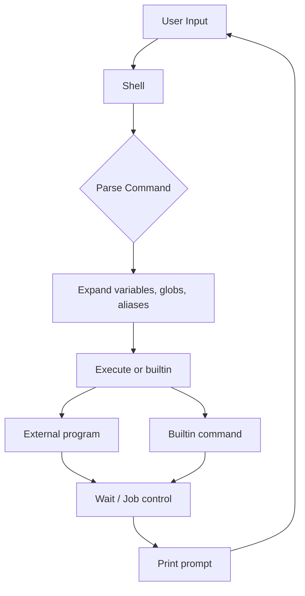

# Shell Overview

## Introduction

A shell is a command-line interpreter that provides a user interface to the operating system. It reads commands from the user (or from a script), parses them, and executes programs. But a shell is much more than a simple command runner — it provides job control, variable expansion, globbing, piping, redirection, scripting language features, and programmable completion.

## What Shells Do

### Core Functions



1. **Command parsing**: Tokenize input, handle quoting, semicolons, pipes
2. **Expansion**: Variables (`$HOME`), globs (`*.txt`), command substitution, arithmetic
3. **Redirection**: `>`, `<`, `>>`, `2>&1`, here-documents, process substitution
4. **Execution**: Run external programs or builtins
5. **Job control**: Background (`&`), foreground (`fg`), suspend (`Ctrl-Z`)
6. **Scripting**: Conditionals, loops, functions, error handling

### Expansion Order

Shells perform expansions in a specific order:

1. Brace expansion: `{a,b,c}` → `a b c`
2. Tilde expansion: `~` → `/home/user`
3. Parameter expansion: `$VAR`, `${VAR:-default}`
4. Command substitution: `$(cmd)` or `` `cmd` ``
5. Arithmetic expansion: `$((1 + 2))`
6. Word splitting (on unquoted results)
7. Pathname expansion (globbing): `*.txt`
8. Quote removal

```bash
# Demonstration of expansion order
echo {1..3}          # 1 2 3 (brace)
echo ~               # /home/user (tilde)
echo $HOME           # /home/user (parameter)
echo $(date)         # Tue Jul 21 17:00:00 CST 2026 (command)
echo $((2 + 3))     # 5 (arithmetic)
echo *.md            # file1.md file2.md (glob)
```

## Shell Types

### Login Shell

A login shell is invoked when a user first logs in. It reads specific startup files.

```bash
# Startup file order for login shells:
# 1. /etc/profile (system-wide)
# 2. ~/.bash_profile, ~/.bash_login, or ~/.profile (first found)
# 3. ~/.bash_logout (on exit)

# Check if login shell
shopt login_shell   # Bash
[[ -o login ]]      # POSIX
```

**Characteristics:**
- Reads `/etc/profile` first
- Reads user's profile (`~/.bash_profile`, `~/.profile`)
- Sets `PATH`, environment variables
- Runs login-specific initialization
- Reads `~/.bash_logout` on exit

### Interactive Non-Login Shell

```bash
# Startup files:
# ~/.bashrc (Bash)
# ~/.zshrc (Zsh)

# Example: opening a terminal in a GUI desktop
# This is typically an interactive non-login shell
```

**Characteristics:**
- Does NOT read profile files
- Reads `~/.bashrc` (Bash) or `~/.zshrc` (Zsh)
- Aliases, functions, prompt customization
- Most terminal emulators start this type

### Non-Interactive Shell

```bash
# Running a script
./myscript.sh
bash myscript.sh

# Startup files:
# $BASH_ENV (if set) for Bash
# /etc/zshenv, ~/.zshenv for Zsh
```

**Characteristics:**
- No prompt displayed
- Used for scripts, cron jobs, system tasks
- Minimal startup files
- `$BASH_ENV` or `$ENV` can specify startup file

### Shell Invocation Flags

| Flag | Login | Interactive | Script | Notes |
|---|---|---|---|---|
| `bash` | No | Yes | No | Default interactive |
| `bash -l` | Yes | Yes | No | Login shell |
| `bash -c "cmd"` | No | No | No | One-shot command |
| `bash script.sh` | No | No | Yes | Run script |
| `bash -i script.sh` | No | Yes | Yes | Interactive script |
| `bash --norc` | No | Yes | No | Skip .bashrc |
| `bash --noprofile` | Yes | Yes | No | Skip profile |

## /etc/shells

The `/etc/shells` file lists valid login shells:

```bash
cat /etc/shells
# /bin/sh
# /bin/bash
# /bin/dash
# /bin/zsh
# /usr/bin/fish
# /usr/bin/git-shell
```

### Managing Shells

```bash
# Change default shell
chsh -s /bin/zsh
# or
chsh username  # prompts for shell

# View current shell
echo $SHELL      # Login shell
echo $0          # Current shell
ps -p $$         # Process info for current shell

# List available shells
cat /etc/shells
```

### Security Considerations

- Only shells listed in `/etc/shells` are valid for `chsh`
- Adding `/bin/false` or `/usr/sbin/nologin` prevents interactive login
- FTP servers check `/etc/shells` for valid login shells

```bash
# Disable interactive login for a user
sudo chsh -s /usr/sbin/nologin serviceaccount

# /usr/sbin/nologin prints a message and exits
# /bin/false just exits with status 1
```

## Major Shells Comparison

### sh (Bourne Shell)

The original UNIX shell, now usually a symlink:

```bash
ls -la /bin/sh
# /bin/sh -> dash (Debian/Ubuntu)
# /bin/sh -> bash (RHEL/CentOS)
```

### Bash (Bourne Again Shell)

The most widely used Linux shell:

```bash
bash --version
# GNU bash, version 5.2.15(1)-release
```

Key features:
- Arrays, associative arrays
- Extended globbing (`**`, `?(pattern)`)
- Programmable completion
- `[[ ]]` test syntax
- Process substitution `<()` `>()`
- Coprocesses
- `select` statement

### Zsh (Z Shell)

See [Zsh](./zsh.md) for detailed coverage.

### Fish (Friendly Interactive Shell)

See [Fish](./fish.md) for detailed coverage.

### Dash

Minimal POSIX shell, used as `/bin/sh` on Debian/Ubuntu:

```bash
# Designed for speed, not features
# Used for system scripts that need fast startup
time bash -c 'for i in $(seq 10000); do :; done'
time dash -c 'i=1; while [ $i -le 10000 ]; do i=$((i+1)); done'
# dash is typically 4-10x faster for loops
```

### Shell Feature Matrix

| Feature | sh | bash | zsh | fish | dash |
|---|---|---|---|---|---|
| POSIX compliant | ✅ | Mostly | Mostly | ❌ | ✅ |
| Arrays | ❌ | ✅ | ✅ | Lists | ❌ |
| Associative arrays | ❌ | ✅ | ✅ | ❌ | ❌ |
| Functions | Basic | ✅ | ✅ | ✅ | Basic |
| Completion | ❌ | ✅ | ✅ | ✅ | ❌ |
| Syntax highlighting | ❌ | ❌ | Plugin | ✅ | ❌ |
| Autosuggestions | ❌ | ❌ | Plugin | ✅ | ❌ |
| Startup speed | Fast | Moderate | Moderate | Moderate | Fast |
| Scripting | Basic | Rich | Rich | Different | Basic |

## Shell Scripting Basics

### Shebang

```bash
#!/bin/bash          # Use bash
#!/bin/sh            # Use default sh (POSIX)
#!/usr/bin/env bash  # Portable bash invocation
#!/usr/bin/env python3  # Python script
```

### Variables and Environment

```bash
# Local variable (not exported to child processes)
MY_VAR="hello"

# Environment variable (inherited by child processes)
export MY_VAR="hello"

# Read-only variable
readonly CONSTANT="immutable"

# Special variables
echo $?      # Exit status of last command
echo $$      # PID of current shell
echo $!      # PID of last background process
echo $0      # Name of script
echo $1 $2   # Positional parameters
echo $#      # Number of positional parameters
echo $@      # All positional parameters (separate words)
echo $*      # All positional parameters (single word)
```

### Control Flow

```bash
# if/elif/else
if [ -f /etc/passwd ]; then
    echo "File exists"
elif [ -d /etc ]; then
    echo "Directory exists"
else
    echo "Neither"
fi

# for loop
for file in *.txt; do
    echo "Processing: $file"
done

# while loop
while read -r line; do
    echo "Line: $line"
done < input.txt

# case statement
case "$1" in
    start)   do_start ;;
    stop)    do_stop ;;
    restart) do_stop; do_start ;;
    *)       echo "Usage: $0 {start|stop|restart}" ;;
esac
```

### Functions

```bash
# POSIX style
greet() {
    local name="$1"
    echo "Hello, $name!"
    return 0
}

# Bash style
function greet {
    local name="$1"
    echo "Hello, $name!"
    return 0
}

greet "World"
```

## Programmatic Shell Detection

```bash
# Detect current shell
detect_shell() {
    case "$(ps -p $$ -o comm=)" in
        *bash) echo "bash" ;;
        *zsh)  echo "zsh" ;;
        *fish) echo "fish" ;;
        *dash) echo "dash" ;;
        *sh)   echo "sh" ;;
        *)     echo "unknown" ;;
    esac
}

# Check for features
if [ -n "$BASH_VERSION" ]; then
    echo "Running in Bash $BASH_VERSION"
elif [ -n "$ZSH_VERSION" ]; then
    echo "Running in Zsh $ZSH_VERSION"
fi
```

## Shell Initialization Flow

```mermaid
graph TD
    A[Login] --> B{Login Shell?}
    B -->|Yes| C[/etc/profile]
    C --> D[~/.bash_profile or ~/.profile]
    D --> E[~/.bashrc - if sourced by profile]
    B -->|No| F{Interactive?}
    F -->|Yes| G[~/.bashrc]
    F -->|No| H[$BASH_ENV]
    E --> I[Prompt displayed]
    G --> I
    H --> J[Execute script]
```

## Security Hardening

```bash
# Disable dangerous features in scripts
set -euo pipefail
# -e: Exit on error
# -u: Error on undefined variables
# -o pipefail: Pipeline fails if any command fails

# Check for common mistakes
set -o noclobber   # Don't overwrite files with >
shopt -s failglob  # Error if glob matches nothing

# Input validation
validate_input() {
    local input="$1"
    if [[ "$input" =~ [^a-zA-Z0-9._-] ]]; then
        echo "Invalid input" >&2
        return 1
    fi
}

# Safe PATH for scripts
export PATH=/usr/local/bin:/usr/bin:/bin

# Prevent globbing
set -f

# Prevent word splitting
IFS=$'\n\t'

# Trap for cleanup
trap 'rm -f "$tempfile"' EXIT
tempfile=$(mktemp) || exit 1
```

## Debugging and Troubleshooting

```bash
# Trace script execution
bash -x script.sh       # Print each command before execution

# Selective tracing
set -x                  # Enable trace
# ... code to debug ...
set +x                  # Disable trace

# Syntax checking
bash -n script.sh       # Check syntax without running

# Show shell options
set -o                  # All options with state
shopt                    # Bash-specific options

# Show defined functions
declare -F              # List function names
type function_name      # Show function body

# Show exported variables
export -p

# Show aliases
alias

# Verbose prompt for debugging
export PS4='+ ${BASH_SOURCE}:${LINENO}: '
set -x
```

## I/O Redirection

Shells provide powerful I/O redirection for controlling where input comes from and output goes to.

### File Descriptors

Every process has three standard file descriptors:

| FD | Name | Description |
|----|------|-------------|
| 0 | stdin | Standard input |
| 1 | stdout | Standard output |
| 2 | stderr | Standard error |

### Output Redirection

```bash
# Overwrite file with stdout
echo "hello" > file.txt

# Append to file
echo "world" >> file.txt

# Redirect stderr to file
command 2> error.log

# Redirect both stdout and stderr (Bash)
command &> all.log
command > all.log 2>&1    # POSIX equivalent

# Redirect stdout and stderr to different files
command > output.log 2> error.log

# Discard output
command > /dev/null
command 2>/dev/null        # Discard stderr
command &>/dev/null        # Discard both

# Redirect fd to another fd
command 2>&1               # stderr goes to stdout
command 1>&2               # stdout goes to stderr

# Prevent file overwriting (noclobber)
set -C                     # or set -o noclobber
echo "test" >| file.txt   # Force overwrite even with noclobber
```

### Input Redirection

```bash
# Read from file
cat < file.txt

# Here document (multi-line input)
cat <<EOF
Line 1
Line 2
$variable_expanded
EOF

# Here document without variable expansion
cat <<'EOF'
$not_expanded
EOF

# Indented here document (strips leading tabs)
cat <<-EOF
\tindented
EOF

# Here string (Bash)
grep "pattern" <<< "Search in this string"
read -r first last <<< "John Doe"
```

### File Descriptor Manipulation

```bash
# Open file for reading on fd 3
exec 3< input.txt
read -r line <&3
exec 3<&-                  # Close fd 3

# Open file for writing on fd 4
exec 4> output.txt
echo "data" >&4
exec 4>&-                  # Close fd 4

# Open for read/write
exec 5<> file.txt
read -r line <&5
echo "new line" >&5
exec 5<&-
```

### Redirection Order Matters

```bash
# This redirects stderr (fd 2) to where stdout (fd 1) currently points
command 2>&1 > file.txt    # stderr goes to terminal, stdout to file

# This redirects stdout to file, then stderr to same place
command > file.txt 2>&1    # both go to file

# Rule: redirections are processed left to right
# 2>&1 means "make fd 2 point where fd 1 points NOW"
```

## Pipes and Pipelines

Pipes connect the stdout of one command to the stdin of the next:

```bash
# Basic pipe
cat file.txt | grep "error" | sort

# Multi-stage pipeline
ps aux | grep "nginx" | grep -v grep | awk '{print $2}'

# Pipeline exit status (POSIX)
# Returns exit status of LAST command
cmd1 | cmd2 | cmd3    # $? is cmd3's exit code

# pipefail (Bash, ksh, zsh)
set -o pipefail
# Returns exit status of rightmost failed command
cmd1 | cmd2 | cmd3    # If cmd1 fails, $? is cmd1's exit code

# Tee: write to both stdout and file
cat file.txt | tee output.txt | grep "error"

# Process substitution (Bash, zsh)
diff <(ls dir1) <(ls dir2)

# Named pipes (FIFOs)
mkfifo /tmp/mypipe
echo "data" > /tmp/mypipe &
cat /tmp/mypipe
rm /tmp/mypipe
```

### Pipeline Component Roles

```
┌──────────────────────────────────────────────────┐
│  Pipeline Data Flow                               │
├──────────────────────────────────────────────────┤
│                                                  │
│  Producer  →  Filter  →  Filter  →  Consumer     │
│  (stdin)     (stdin→stdout)         (stdin)       │
│                                                  │
│  cat file | grep err | sort  | less              │
│                                                  │
│  All commands run concurrently.                   │
│  Shell connects stdout of each to stdin of next. │
└──────────────────────────────────────────────────┘
```

### Pipeline Performance Considerations

```bash
# Avoid useless use of cat (UUOC)
# Slow: spawns extra process
cat file.txt | grep "pattern"
# Fast: grep reads file directly
grep "pattern" file.txt

# But pipes are sometimes necessary
cat file1 file2 | sort    # Concatenate then sort
find . -name "*.py" | xargs wc -l

# Pipeline buffering
# stdout is line-buffered when connected to terminal
# stdout is block-buffered when connected to pipe
# Use stdbuf to control buffering:
stdbuf -oL command    # Line-buffered output
stdbuf -o0 command    # Unbuffered output
```

## Job Control

Job control allows managing multiple processes from a single terminal.

### Background and Foreground

```bash
# Run command in background
command &

# List current jobs
jobs -l     # With PIDs
jobs -p     # PIDs only

# Bring job to foreground
fg %1       # Job number 1
fg          # Most recent job

# Send job to background
bg %1       # Continue job 1 in background

# Suspend current foreground job
# Ctrl+Z (SIGTSTP)

# Disown job (detach from shell)
disown %1
disown -h %1    # Don't send HUP on shell exit

# Wait for background jobs
wait            # Wait for all
wait %1         # Wait for specific job
wait $PID       # Wait for specific PID
```

### Job Control Signals

```bash
# Ctrl+C  → SIGINT  → Interrupt foreground job
# Ctrl+Z  → SIGTSTP → Suspend foreground job
# Ctrl+\  → SIGQUIT → Quit (generates core dump)

# Send signal to job
kill -TERM %1
kill -INT %1
```

### Job Control Best Practices

```bash
# Use nohup for long-running tasks
nohup long_command &

# Or use disown
long_command &
disown

# Or use screen/tmux for persistent sessions
tmux new -s mysession
# ... work ...
# Ctrl+B, D to detach
tmux attach -t mysession

# Monitor background jobs in script
sleep 10 &
pid=$!
echo "Waiting for PID $pid"
wait $pid
echo "Exit status: $?"
```

## Environment and Process Inheritance

### Environment Variables

```bash
# Set environment variable (inherited by child processes)
export MY_VAR="value"

# Set for single command
MY_VAR="value" command

# Unset
unset MY_VAR

# Show all environment variables
env
printenv
export -p

# Important environment variables
# PATH     - Command search path
# HOME     - User home directory
# USER     - Current username
# SHELL    - Login shell
# TERM     - Terminal type
# LANG     - Locale
# EDITOR   - Default editor
# PAGER    - Default pager
# PS1      - Primary prompt
# IFS      - Internal field separator
```

### PATH Manipulation

```bash
# Add directory to PATH
export PATH="$HOME/bin:$PATH"

# Add to end
export PATH="$PATH:/usr/local/bin"

# Remove directory from PATH
PATH=$(echo "$PATH" | tr ':' '\n' | grep -v '/bad/dir' | tr '\n' ':')
PATH=${PATH%:}  # Remove trailing colon

# Check if directory is in PATH
case ":$PATH:" in
    *:/usr/local/bin:*) echo "In PATH" ;;
    *) echo "Not in PATH" ;;
esac
```

### Process Inheritance Model

```
┌──────────────────────────────────────────────────┐
│  Process Environment Inheritance                   │
├──────────────────────────────────────────────────┤
│                                                  │
│  Parent Shell                                     │
│  ├── export VAR=value    → child sees VAR         │
│  ├── VAR=value           → child does NOT see VAR │
│  └── unset VAR           → child does NOT see VAR │
│                                                  │
│  Child Process                                    │
│  ├── Inherits exported variables                  │
│  ├── Inherits open file descriptors               │
│  ├── Inherits working directory                   │
│  ├── Inherits signal handlers (mostly reset)      │
│  └── Does NOT inherit: aliases, functions,        │
│      shell options, unexported variables           │
└──────────────────────────────────────────────────┘
```

### Subshells

```bash
# Subshell: copy of current shell
(
    cd /tmp
    echo "Inside: $(pwd)"
)
echo "Outside: $(pwd)"    # Original directory

# Variable scope in subshells
x=1
(
    x=2
    echo "Subshell: $x"    # 2
)
echo "Parent: $x"          # 1 (unchanged)

# Pipeline subshells (Bash, ksh)
# Each component of a pipeline runs in a subshell
count=0
seq 5 | while read n; do count=$((count + n)); done
echo $count                # 0 (subshell didn't affect parent)

# Process substitution creates subshells
diff <(cmd1) <(cmd2)
```

## Command Lookup Order

When you type a command, the shell resolves it in a specific order:

### Lookup Order

```
┌──────────────────────────────────────────────────┐
│  Command Lookup Order (Bash)                      │
├──────────────────────────────────────────────────┤
│                                                  │
│  1. Aliases                                      │
│  2. Keywords (if, while, for, case, etc.)        │
│  3. Functions                                    │
│  4. Built-in commands (cd, echo, type, etc.)     │
│  5. Hash table (cached paths)                    │
│  6. External commands (in $PATH)                 │
│                                                  │
│  Override with:                                   │
│  - command cmd  → bypass aliases/functions        │
│  - builtin cmd  → force builtin                   │
│  - \cmd          → bypass alias                   │
│  - enable -n cmd → disable builtin               │
└──────────────────────────────────────────────────┘
```

### Checking Command Resolution

```bash
# Show what a command resolves to
type command          # Shows all matches
type -a command       # Show ALL (alias, function, builtin, file)
type -t command       # Just type: alias, builtin, file, function

# Which binary would run
which command

# Hash table (cached command paths)
hash                  # Show cached commands
hash -r               # Clear cache
hash -d command       # Remove specific entry

# Examples
$ type -a ls
ls is aliased to 'ls --color=auto'
ls is /usr/bin/ls

$ type cd
cd is a shell builtin

$ type grep
grep is /usr/bin/grep
```

## Aliases

Aliases provide shorthand for commands:

```bash
# Define alias
alias ll='ls -la'
alias gs='git status'
alias ..='cd ..'
alias ...='cd ../..'

# List all aliases
alias

# Remove alias
unalias ll

# Bypass alias
\ls                # Backslash bypass
command ls         # Bypass alias and function
/usr/bin/ls        # Full path

# Alias vs function
# Alias: simple text substitution, no arguments
alias greet='echo Hello'
greet              # Hello
greet World        # Hello (World ignored!)

# Function: full argument handling
greet() { echo "Hello, $1!"; }
greet World        # Hello, World!
```

## Globbing (Filename Expansion)

Globbing expands wildcard patterns into matching filenames:

```bash
# Basic globs
*               # Any characters
?               # Single character
[abc]           # Any of a, b, c
[!abc]          # Not a, b, or c
[a-z]           # Range: a through z

# Examples
ls *.txt                    # All .txt files
ls file?.log                # file1.log, fileA.log, etc.
ls [0-9]*.png               # PNG files starting with digit
ls *.{jpg,png,gif}          # Multiple extensions

# Dot files are NOT matched by default
ls *              # Does not match .hidden
ls .*             # Matches .hidden, ., ..

# Bash-specific globs
shopt -s globstar
ls **/*.py        # Recursive: all .py files
shopt -s dotglob
ls *              # Now matches dot files too
shopt -s nullglob
ls *.nonexistent  # Returns empty (no error)
shopt -s failglob
ls *.nonexistent  # Error if no match
```

## Command History

```bash
# History navigation
!!              # Repeat last command
!n              # Repeat command number n
!string         # Last command starting with string
!?string        # Last command containing string
!$              # Last argument of previous command
!^              # First argument of previous command

# History substitution
!!:s/old/new    # Replace in last command
^old^new^       # Quick substitution
!!:gs/old/new   # Global substitution

# History configuration
HISTSIZE=10000              # Commands in memory
HISTFILESIZE=20000          # Lines in history file
HISTCONTROL=ignoreboth      # Ignore duplicates and space-prefixed
HISTTIMEFORMAT="%F %T "     # Show timestamps
```

## Shell Arithmetic

```bash
# Arithmetic expansion $(( ))
echo $((2 + 3))           # 5
echo $((10 / 3))          # 3 (integer division)
echo $((2 ** 10))         # 1024 (exponentiation)

# Variables in arithmetic (no $ needed inside $( ))
x=10; y=3
echo $((x + y))           # 13
echo $((x % y))           # 1 (modulo)

# Arithmetic command (Bash)
((count++))
((total += 5))
if ((x > 10)); then echo "big"; fi

# Floating point (use bc or awk)
result=$(echo "scale=2; 3.14 * 2" | bc)
result=$(awk 'BEGIN { printf "%.2f", 3.14 * 2 }')
```

## Common Shell Patterns

### Script Boilerplate

```bash
#!/bin/bash
set -euo pipefail

PROGNAME=$(basename "$0")

usage() {
    cat <<EOF
Usage: $PROGNAME [OPTIONS] ARGUMENT

Options:
  -h, --help     Show this help
  -v, --verbose  Verbose output
  -n, --dry-run  Dry run
EOF
}

log()   { printf '%s: %s\n' "$PROGNAME" "$*" >&2; }
error() { log "ERROR: $*"; exit 1; }

# Trap for cleanup
cleanup() { rm -f "${TEMP_FILE:-}"; }
trap cleanup EXIT
TEMP_FILE=$(mktemp) || exit 1

# Parse arguments
verbose=0
dry_run=0
while [[ $# -gt 0 ]]; do
    case "$1" in
        -h|--help)    usage; exit 0 ;;
        -v|--verbose) verbose=1; shift ;;
        -n|--dry-run) dry_run=1; shift ;;
        -*)           error "Unknown option: $1" ;;
        *)            break ;;
    esac
done

[[ $# -ge 1 ]] || error "Missing required argument"
```

### Safe File Processing

```bash
# Process files safely (handles spaces, special chars)
find . -name "*.txt" -print0 | while IFS= read -r -d '' file; do
    echo "Processing: $file"
done

# Or with mapfile (Bash)
mapfile -d '' files < <(find . -name "*.txt" -print0)
for file in "${files[@]}"; do
    echo "Processing: $file"
done
```

## References

- [Bash Reference Manual](https://www.gnu.org/software/bash/manual/bash.html)
- [POSIX Shell Command Language](https://pubs.opengroup.org/onlinepubs/9699919799/utilities/V3_chap02.html)
- [The Art of Command Line](https://jvns.ca/blog/2015/11/20/what-even-is-a-terminal/)
- [Greg's Wiki - Bash Guide](https://mywiki.wooledge.org/BashGuide)
- [ShellCheck](https://www.shellcheck.net/) — linting tool for shell scripts
- [tldp.org - Bash Guide](https://tldp.org/LDP/abs/html/)
- [GNU Bash Manual](https://www.gnu.org/software/bash/manual/bash.html)

## Related Topics

- [POSIX Shell](./posix-shell.md) — portable shell scripting
- [Zsh](./zsh.md) — advanced interactive shell
- [Fish](./fish.md) — user-friendly shell
- [grep](./grep.md) — text search in shell pipelines
- [find](./find.md) — file search
- [xargs](./xargs.md) — argument processing
