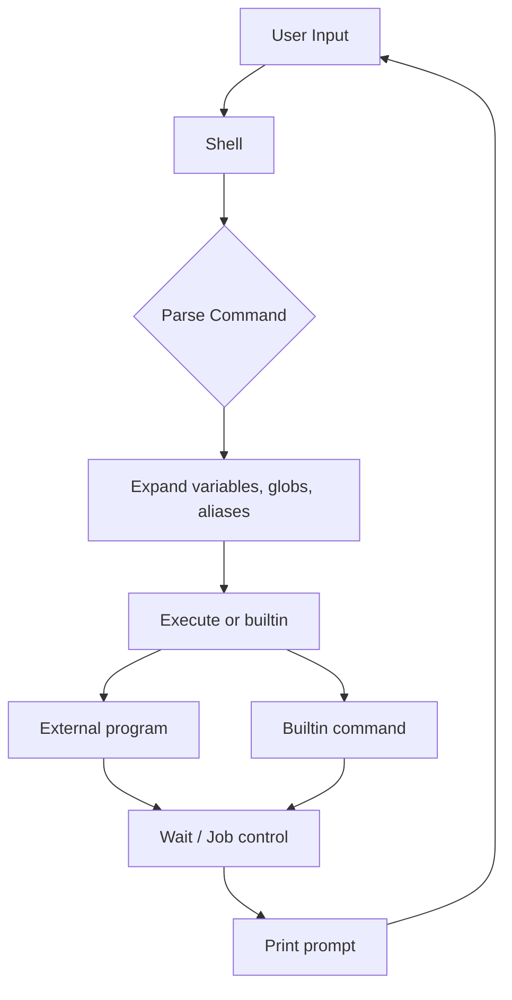

# Shell Overview

## Introduction

A shell is a command-line interpreter that provides a user interface to the operating system. It reads commands from the user (or from a script), parses them, and executes programs. But a shell is much more than a simple command runner — it provides job control, variable expansion, globbing, piping, redirection, scripting language features, and programmable completion.

## What Shells Do

### Core Functions



1. **Command parsing**: Tokenize input, handle quoting, semicolons, pipes
2. **Expansion**: Variables (`$HOME`), globs (`*.txt`), command substitution, arithmetic
3. **Redirection**: `>`, `<`, `>>`, `2>&1`, here-documents, process substitution
4. **Execution**: Run external programs or builtins
5. **Job control**: Background (`&`), foreground (`fg`), suspend (`Ctrl-Z`)
6. **Scripting**: Conditionals, loops, functions, error handling

### Expansion Order

Shells perform expansions in a specific order:

1. Brace expansion: `{a,b,c}` → `a b c`
2. Tilde expansion: `~` → `/home/user`
3. Parameter expansion: `$VAR`, `${VAR:-default}`
4. Command substitution: `$(cmd)` or `` `cmd` ``
5. Arithmetic expansion: `$((1 + 2))`
6. Word splitting (on unquoted results)
7. Pathname expansion (globbing): `*.txt`
8. Quote removal

```bash
# Demonstration of expansion order
echo {1..3}          # 1 2 3 (brace)
echo ~               # /home/user (tilde)
echo $HOME           # /home/user (parameter)
echo $(date)         # Tue Jul 21 17:00:00 CST 2026 (command)
echo $((2 + 3))     # 5 (arithmetic)
echo *.md            # file1.md file2.md (glob)
```

## Shell Types

### Login Shell

A login shell is invoked when a user first logs in. It reads specific startup files.

```bash
# Startup file order for login shells:
# 1. /etc/profile (system-wide)
# 2. ~/.bash_profile, ~/.bash_login, or ~/.profile (first found)
# 3. ~/.bash_logout (on exit)

# Check if login shell
shopt login_shell   # Bash
[[ -o login ]]      # POSIX
```

**Characteristics:**
- Reads `/etc/profile` first
- Reads user's profile (`~/.bash_profile`, `~/.profile`)
- Sets `PATH`, environment variables
- Runs login-specific initialization
- Reads `~/.bash_logout` on exit

### Interactive Non-Login Shell

```bash
# Startup files:
# ~/.bashrc (Bash)
# ~/.zshrc (Zsh)

# Example: opening a terminal in a GUI desktop
# This is typically an interactive non-login shell
```

**Characteristics:**
- Does NOT read profile files
- Reads `~/.bashrc` (Bash) or `~/.zshrc` (Zsh)
- Aliases, functions, prompt customization
- Most terminal emulators start this type

### Non-Interactive Shell

```bash
# Running a script
./myscript.sh
bash myscript.sh

# Startup files:
# $BASH_ENV (if set) for Bash
# /etc/zshenv, ~/.zshenv for Zsh
```

**Characteristics:**
- No prompt displayed
- Used for scripts, cron jobs, system tasks
- Minimal startup files
- `$BASH_ENV` or `$ENV` can specify startup file

### Shell Invocation Flags

| Flag | Login | Interactive | Script | Notes |
|---|---|---|---|---|
| `bash` | No | Yes | No | Default interactive |
| `bash -l` | Yes | Yes | No | Login shell |
| `bash -c "cmd"` | No | No | No | One-shot command |
| `bash script.sh` | No | No | Yes | Run script |
| `bash -i script.sh` | No | Yes | Yes | Interactive script |
| `bash --norc` | No | Yes | No | Skip .bashrc |
| `bash --noprofile` | Yes | Yes | No | Skip profile |

## /etc/shells

The `/etc/shells` file lists valid login shells:

```bash
cat /etc/shells
# /bin/sh
# /bin/bash
# /bin/dash
# /bin/zsh
# /usr/bin/fish
# /usr/bin/git-shell
```

### Managing Shells

```bash
# Change default shell
chsh -s /bin/zsh
# or
chsh username  # prompts for shell

# View current shell
echo $SHELL      # Login shell
echo $0          # Current shell
ps -p $$         # Process info for current shell

# List available shells
cat /etc/shells
```

### Security Considerations

- Only shells listed in `/etc/shells` are valid for `chsh`
- Adding `/bin/false` or `/usr/sbin/nologin` prevents interactive login
- FTP servers check `/etc/shells` for valid login shells

```bash
# Disable interactive login for a user
sudo chsh -s /usr/sbin/nologin serviceaccount

# /usr/sbin/nologin prints a message and exits
# /bin/false just exits with status 1
```

## Major Shells Comparison

### sh (Bourne Shell)

The original UNIX shell, now usually a symlink:

```bash
ls -la /bin/sh
# /bin/sh -> dash (Debian/Ubuntu)
# /bin/sh -> bash (RHEL/CentOS)
```

### Bash (Bourne Again Shell)

The most widely used Linux shell:

```bash
bash --version
# GNU bash, version 5.2.15(1)-release
```

Key features:
- Arrays, associative arrays
- Extended globbing (`**`, `?(pattern)`)
- Programmable completion
- `[[ ]]` test syntax
- Process substitution `<()` `>()`
- Coprocesses
- `select` statement

### Zsh (Z Shell)

See [Zsh](./zsh.md) for detailed coverage.

### Fish (Friendly Interactive Shell)

See [Fish](./fish.md) for detailed coverage.

### Dash

Minimal POSIX shell, used as `/bin/sh` on Debian/Ubuntu:

```bash
# Designed for speed, not features
# Used for system scripts that need fast startup
time bash -c 'for i in $(seq 10000); do :; done'
time dash -c 'i=1; while [ $i -le 10000 ]; do i=$((i+1)); done'
# dash is typically 4-10x faster for loops
```

### Shell Feature Matrix

| Feature | sh | bash | zsh | fish | dash |
|---|---|---|---|---|---|
| POSIX compliant | ✅ | Mostly | Mostly | ❌ | ✅ |
| Arrays | ❌ | ✅ | ✅ | Lists | ❌ |
| Associative arrays | ❌ | ✅ | ✅ | ❌ | ❌ |
| Functions | Basic | ✅ | ✅ | ✅ | Basic |
| Completion | ❌ | ✅ | ✅ | ✅ | ❌ |
| Syntax highlighting | ❌ | ❌ | Plugin | ✅ | ❌ |
| Autosuggestions | ❌ | ❌ | Plugin | ✅ | ❌ |
| Startup speed | Fast | Moderate | Moderate | Moderate | Fast |
| Scripting | Basic | Rich | Rich | Different | Basic |

## Shell Scripting Basics

### Shebang

```bash
#!/bin/bash          # Use bash
#!/bin/sh            # Use default sh (POSIX)
#!/usr/bin/env bash  # Portable bash invocation
#!/usr/bin/env python3  # Python script
```

### Variables and Environment

```bash
# Local variable (not exported to child processes)
MY_VAR="hello"

# Environment variable (inherited by child processes)
export MY_VAR="hello"

# Read-only variable
readonly CONSTANT="immutable"

# Special variables
echo $?      # Exit status of last command
echo $$      # PID of current shell
echo $!      # PID of last background process
echo $0      # Name of script
echo $1 $2   # Positional parameters
echo $#      # Number of positional parameters
echo $@      # All positional parameters (separate words)
echo $*      # All positional parameters (single word)
```

### Control Flow

```bash
# if/elif/else
if [ -f /etc/passwd ]; then
    echo "File exists"
elif [ -d /etc ]; then
    echo "Directory exists"
else
    echo "Neither"
fi

# for loop
for file in *.txt; do
    echo "Processing: $file"
done

# while loop
while read -r line; do
    echo "Line: $line"
done < input.txt

# case statement
case "$1" in
    start)   do_start ;;
    stop)    do_stop ;;
    restart) do_stop; do_start ;;
    *)       echo "Usage: $0 {start|stop|restart}" ;;
esac
```

### Functions

```bash
# POSIX style
greet() {
    local name="$1"
    echo "Hello, $name!"
    return 0
}

# Bash style
function greet {
    local name="$1"
    echo "Hello, $name!"
    return 0
}

greet "World"
```

## Programmatic Shell Detection

```bash
# Detect current shell
detect_shell() {
    case "$(ps -p $$ -o comm=)" in
        *bash) echo "bash" ;;
        *zsh)  echo "zsh" ;;
        *fish) echo "fish" ;;
        *dash) echo "dash" ;;
        *sh)   echo "sh" ;;
        *)     echo "unknown" ;;
    esac
}

# Check for features
if [ -n "$BASH_VERSION" ]; then
    echo "Running in Bash $BASH_VERSION"
elif [ -n "$ZSH_VERSION" ]; then
    echo "Running in Zsh $ZSH_VERSION"
fi
```

## Shell Initialization Flow

```mermaid
graph TD
    A[Login] --> B{Login Shell?}
    B -->|Yes| C[/etc/profile]
    C --> D[~/.bash_profile or ~/.profile]
    D --> E[~/.bashrc - if sourced by profile]
    B -->|No| F{Interactive?}
    F -->|Yes| G[~/.bashrc]
    F -->|No| H[$BASH_ENV]
    E --> I[Prompt displayed]
    G --> I
    H --> J[Execute script]
```

## Security Hardening

```bash
# Disable dangerous features in scripts
set -euo pipefail
# -e: Exit on error
# -u: Error on undefined variables
# -o pipefail: Pipeline fails if any command fails

# Check for common mistakes
set -o noclobber   # Don't overwrite files with >
shopt -s failglob  # Error if glob matches nothing

# Input validation
validate_input() {
    local input="$1"
    if [[ "$input" =~ [^a-zA-Z0-9._-] ]]; then
        echo "Invalid input" >&2
        return 1
    fi
}
```

## References

- [Bash Reference Manual](https://www.gnu.org/software/bash/manual/bash.html)
- [POSIX Shell Command Language](https://pubs.opengroup.org/onlinepubs/9699919799/utilities/V3_chap02.html)
- [The Art of Command Line](https://jvns.ca/blog/2015/11/20/what-even-is-a-terminal/)
- [Greg's Wiki - Bash Guide](https://mywiki.wooledge.org/BashGuide)
- [ShellCheck](https://www.shellcheck.net/) — linting tool for shell scripts

## Related Topics

- [POSIX Shell](./posix-shell.md) — portable shell scripting
- [Zsh](./zsh.md) — advanced interactive shell
- [Fish](./fish.md) — user-friendly shell
- [grep](./grep.md) — text search in shell pipelines
- [find](./find.md) — file search
- [xargs](./xargs.md) — argument processing
