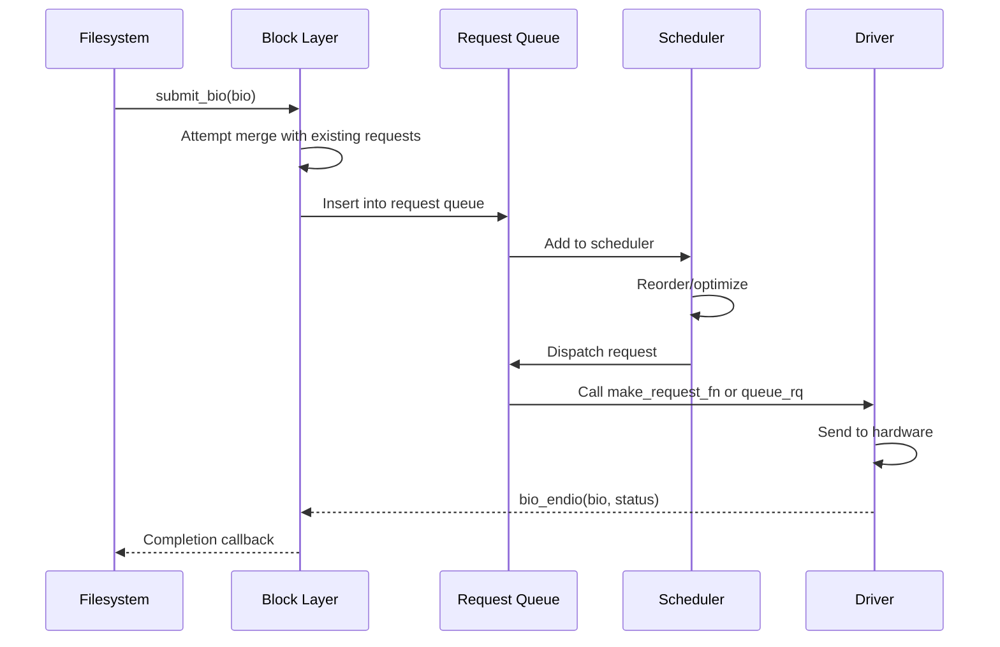
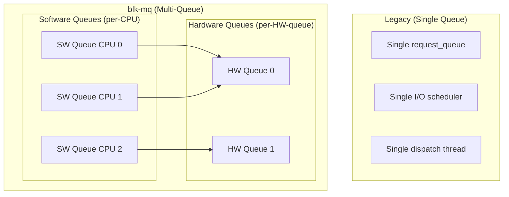
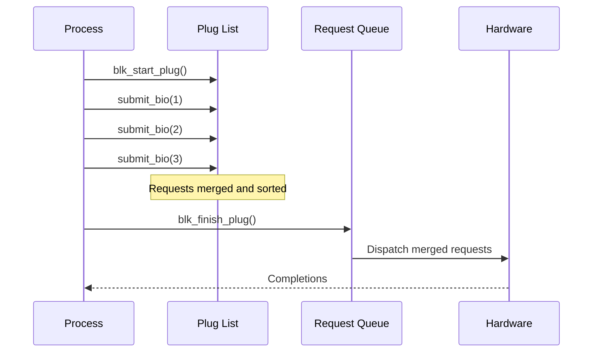
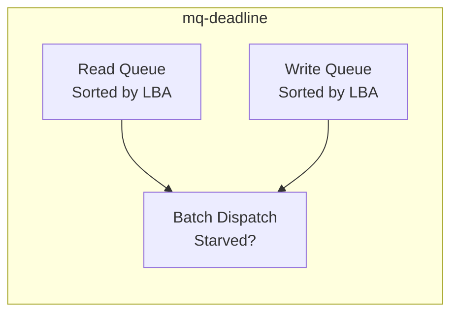
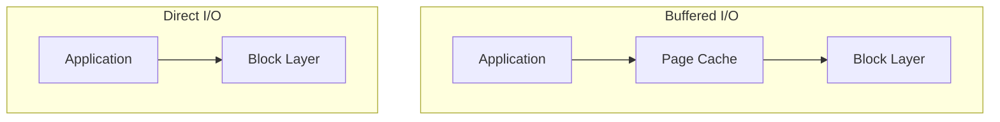
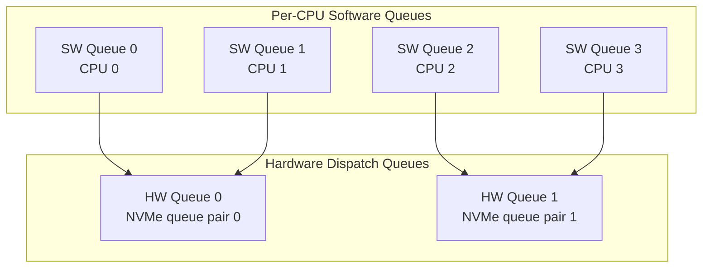
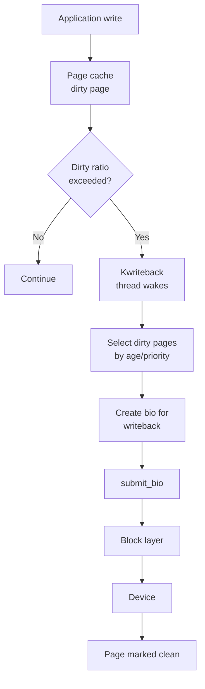
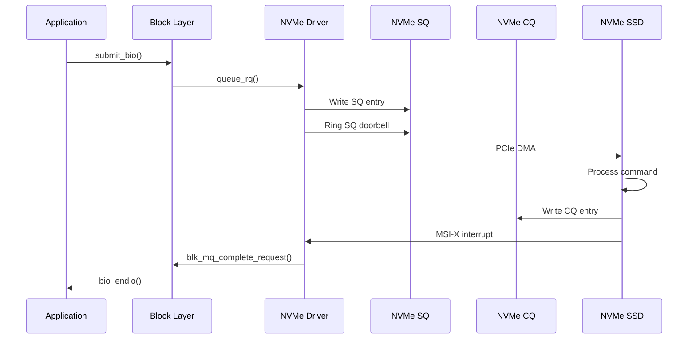

# Block I/O Layer

## Introduction

The block I/O layer is the heart of Linux storage. It sits between the filesystem and the device drivers, managing all read and write requests to block devices. This layer handles request merging, scheduling, plugging/unplugging, and dispatching—optimizing I/O for both throughput and latency.

Understanding the block I/O layer is critical for performance tuning. A misconfigured I/O scheduler or a poor queue depth setting can mean the difference between 10,000 and 500,000 IOPS on the same hardware.

## The `bio` Structure

The `bio` (block I/O) structure is the fundamental unit of I/O in the Linux block layer:

```c
struct bio {
    struct bio          *bi_next;       /* request queue link */
    struct block_device *bi_bdev;       /* target device */
    unsigned int         bi_opf;        /* op and flags */
    unsigned short       bi_flags;      /* BIO_* flags */
    unsigned short       bi_ioprio;     /* I/O priority */
    unsigned short       bi_write_hint; /* write hint */
    blk_status_t         bi_status;     /* I/O status */
    atomic_t             __bi_remaining;

    struct bvec_iter     bi_iter;       /* current index into bio vec array */
    bio_end_io_t        *bi_end_io;     /* completion callback */
    void                *bi_private;    /* owner-private data */

    unsigned short       bi_vcnt;       /* number of bio_vec's */
    unsigned short       bi_max_vecs;   /* max bio_vec's allocated */
    atomic_t             __bi_cnt;      /* pin count */
    struct bio_vec      *bi_io_vec;     /* scatter-gather list */
    /* ... */
};
```

### bio Lifecycle



### bio_vec: Scatter-Gather I/O

A single `bio` can reference multiple non-contiguous memory regions via `bio_vec`:

```c
struct bio_vec {
    struct page *bv_page;    /* page to read/write */
    unsigned int bv_len;     /* bytes in this segment */
    unsigned int bv_offset;  /* offset within page */
};
```

This enables scatter-gather I/O—a single I/O request can read from or write to multiple memory pages, which is essential for filesystems that store data in page-sized chunks.

## Request Queues

Each block device has a `request_queue` that holds pending I/O requests:

```c
struct request_queue {
    struct request        *last_merge;
    struct elevator_queue *elevator;     /* I/O scheduler */
    struct blk_mq_ops     *mq_ops;      /* blk-mq operations */
    struct blk_mq_tag_set *tag_set;      /* tag set for blk-mq */
    struct list_head       icq_list;
    request_fn_proc       *request_fn;   /* legacy dispatch */
    make_request_fn       *make_request_fn; /* legacy entry */
    struct blk_mq_ctx __percpu *queue_ctx;
    unsigned int           nr_requests;  /* max queued requests */
    /* ... */
};
```

### blk-mq (Multi-Queue Block Layer)

Modern Linux uses **blk-mq** (Block Multi-Queue), which replaced the legacy single-queue architecture:



### blk-mq in Practice

```bash
# View queue configuration
cat /sys/block/nvme0n1/queue/nr_requests
# 1023

cat /sys/block/sda/queue/nr_requests
# 256

# Check if device uses blk-mq
ls /sys/block/sda/mq/
# 0  1  2  3

# Number of hardware queues
ls /sys/block/nvme0n1/mq/ | wc -l
# 32
```

## Plug/Unplug Mechanism

The block layer uses a **plug/unplug** mechanism to batch I/O requests before dispatching them to the hardware. This improves performance by allowing request merging and sorting.

### How Plugging Works

1. **Plug**: When a process starts submitting I/O, the request queue is "plugged"—new requests are held in a per-task plug list
2. **Accumulate**: Multiple `bio`s accumulate in the plug list during a single filesystem operation
3. **Unplug**: When the operation completes (or the plug list is full), the queue is "unplugged"—all accumulated requests are dispatched together

```c
/* Pseudocode for plug/unplug */
blk_start_plug(&plug);          /* Start plugging */
submit_bio(bio1);                /* Queued in plug list */
submit_bio(bio2);                /* Queued in plug list */
submit_bio(bio3);                /* Queued in plug list */
blk_finish_plug(&plug);         /* Unplug: dispatch all at once */
```



## I/O Schedulers

The I/O scheduler (also called the elevator) determines the order in which requests are dispatched to the hardware. Linux provides three main schedulers for blk-mq:

### Available Schedulers

```bash
# Check current and available schedulers
cat /sys/block/sda/queue/scheduler
# [mq-deadline] kyber bfq none

# Change scheduler
echo bfq > /sys/block/sda/queue/scheduler
```

### mq-deadline

**mq-deadline** is the default scheduler for most block devices. It maintains separate read and write queues and enforces latency deadlines.



**Key behavior:**
- Maintains sorted read and write queues (by LBA position)
- Dispatches in batches to minimize seek time
- Enforces a deadline (default: 500ms for reads, 5s for writes)
- Reads are prioritized over writes (latency-sensitive)

```bash
# mq-deadline tunables
ls /sys/block/sda/queue/iosched/
# fifo_batch  front_merges  read_expire  writes_expire  fifo_batch

echo 128 > /sys/block/sda/queue/iosched/read_expire    # ms
echo 5000 > /sys/block/sda/queue/iosched/writes_expire  # ms
echo 16 > /sys/block/sda/queue/iosched/fifo_batch
echo 1 > /sys/block/sda/queue/iosched/front_merges
```

### BFQ (Budget Fair Queueing)

**BFQ** provides proportional-share scheduling with per-process fairness, making it ideal for interactive workloads and desktop systems.

**Key features:**
- Per-process I/O budgets
- Low-latency interactive class
- Proportional bandwidth distribution via cgroups
- Fairness across processes

```bash
# BFQ tunables
ls /sys/block/sda/queue/iosched/
# back_seek_max  back_seek_penalty  fifo_expire_async  fifo_expire_sync
# low_latency  slice_async  slice_idle  slice_sync  timeout_sync

echo 1 > /sys/block/sda/queue/iosched/low_latency  # Enable low-latency mode
echo 128 > /sys/block/sda/queue/iosched/slice_sync   # ms per sync slice
echo 8 > /sys/block/sda/queue/iosched/slice_idle     # ms between dispatches
echo 16384 > /sys/block/sda/queue/iosched/back_seek_max  # sectors

# BFQ with cgroups
# Create a cgroup with I/O weight
mkdir /sys/fs/cgroup/test
echo 200 > /sys/fs/cgroup/test/io.bfq.weight  # Default is 100
```

### Kyber

**Kyber** is a lightweight scheduler designed for fast devices (NVMe, high-end SSDs). It focuses on latency by adjusting queue depths based on latency targets.

```bash
# Kyber tunables
ls /sys/block/nvme0n1/queue/iosched/
# read_lat_nsec  write_lat_nsec

echo 2000 > /sys/block/nvme0n1/queue/iosched/read_lat_nsec   # 2μs target
echo 10000 > /sys/block/nvme0n1/queue/iosched/write_lat_nsec  # 10μs target
```

### Scheduler Comparison

| Feature | mq-deadline | BFQ | Kyber |
|---------|-------------|-----|-------|
| Best for | Servers, general use | Desktops, interactive | Fast SSDs, NVMe |
| Merge strategy | Front/back merge | Front/back merge | Minimal |
| Fairness | Time-based deadline | Proportional share | Latency-based |
| Per-cgroup control | No | Yes (io.bfq.weight) | No |
| Overhead | Low | Medium | Very low |
| Default device | SATA/SAS HDD/SSD | - | NVMe (where applicable) |

### none (No Scheduler)

For NVMe devices with multiple hardware queues, the scheduler can be set to `none`:

```bash
echo none > /sys/block/nvme0n1/queue/scheduler
```

This bypasses the software scheduler entirely, relying on the device's internal scheduling. This is often the best choice for high-performance NVMe devices.

## I/O Priority

Linux supports I/O priorities using the `ioprio` system:

```bash
# Set I/O priority (class + level)
# Classes: 0=none, 1=realtime, 2=best-effort, 3=idle
ionice -c 2 -n 0 dd if=/dev/zero of=/tmp/test bs=1M count=100 &
# Best-effort, priority 0 (highest)

ionice -c 2 -n 7 dd if=/dev/zero of=/tmp/test2 bs=1M count=100 &
# Best-effort, priority 7 (lowest)

ionice -c 3 dd if=/dev/zero of=/tmp/test3 bs=1M count=100 &
# Idle - only runs when no other I/O pending

# Check I/O priority of a process
ionice -p $$
# none: prio 0
```

## Block I/O Tracing

### blktrace and blkparse

`blktrace` captures detailed block I/O events:

```bash
# Trace block I/O for 10 seconds
blktrace -d /dev/sda -o - | blktrace -i - -d sda.trace &
sleep 10
kill %1

# Parse and view
blkparse -i sda.trace | head -50
# 253,0    1        1     0.000000000  2345  A   W 12345678 + 8 <- (253,1) 12345600
# 253,0    1        2     0.000001234  2345  Q   W 12345678 + 8
# 253,0    1        3     0.000002345  2345  G   W 12345678 + 8
# 253,0    1        4     0.000003456  2345  I   W 12345678 + 8
# 253,0    1        5     0.000004567  2345  D   W 12345678 + 8
# 253,0    1        6     0.005123456  2345  C   W 12345678 + 8 [0]

# Event types:
# A = Remap (bio remapped)
# Q = Block I/O request queued
# G = Get request
# I = Insert request into scheduler
# D = Dispatch to driver
# C = Complete
# M = Back merge
# F = Front merge

# Aggregate statistics
btt -i sda.trace
# D2C: min=0.001ms, max=15.234ms, avg=0.567ms
# Q2C: min=0.002ms, max=16.789ms, avg=0.890ms
```

### bpftrace I/O Tracing

```bash
# Trace I/O latency distribution
bpftrace -e '
tracepoint:block:block_rq_complete {
    @usecs = hist((nsecs - args->alloc_time) / 1000);
}'

# Trace I/O by process
bpftrace -e '
tracepoint:block:block_rq_issue {
    @io_by_comm[comm] = count();
}'
```

## Direct I/O vs Buffered I/O



```bash
# Buffered I/O (default) - uses page cache
dd if=/dev/zero of=/tmp/test_buffered bs=1M count=100

# Direct I/O - bypasses page cache
dd if=/dev/zero of=/tmp/test_direct bs=1M count=100 oflag=direct

# O_DIRECT in C
int fd = open("/tmp/test", O_WRONLY | O_DIRECT);
// Buffer must be aligned to block size
void *buf;
posix_memalign(&buf, 4096, 4096);
write(fd, buf, 4096);
```

## I/O Accounting

```bash
# Per-device I/O stats
cat /proc/diskstats
#  8  0 sda 123456 789 12345678 9012 567890 123 45678901 2345 0 6789 11357

# Fields (from left):
# major minor name
# reads_completed reads_merged sectors_read read_time_ms
# writes_completed writes_merged sectors_written write_time_ms
# io_in_progress io_time_ms weighted_io_time_ms
# discards_completed discards_merged sectors_discarded discard_time_ms

# Per-process I/O
iotop -oP
# Total DISK READ:  123.45 M/s | Total DISK WRITE: 67.89 M/s
#   PID  PRIO  USER     DISK READ  DISK WRITE  SWAPIN    IO>    COMMAND
#  1234  be/4  root     100.00 M/s    0.00 B/s  0.00 %  99.99 % dd if=/dev/sda
```

## References

- [Linux Block I/O Documentation](https://www.kernel.org/doc/html/latest/block/)
- [blk-mq API](https://www.kernel.org/doc/html/latest/block/blk-mq.html)
- [I/O Scheduler Documentation](https://www.kernel.org/doc/html/latest/block/switching-sched.html)
- [blktrace man page](https://linux.die.net/man/1/blktrace)

## Multi-Queue Block Layer (blk-mq) Deep Dive

### Queue Topology

The blk-mq architecture maps software queues to hardware queues:



### Tag Sets

The `blk_mq_tag_set` structure defines the hardware queue topology:

```c
struct blk_mq_tag_set {
    const struct blk_mq_ops *ops;
    unsigned int            nr_hw_queues;   /* number of HW queues */
    unsigned int            queue_depth;    /* max tags per HW queue */
    unsigned int            cmd_size;       /* per-request driver data */
    int                     numa_node;      /* NUMA affinity */
    unsigned int            flags;          /* BLK_MQ_F_* */
    void                    *driver_data;   /* driver private */
};
```

### Queue Depth and Performance

```bash
# View current queue depth
$ cat /sys/block/nvme0n1/queue/nr_requests
1023

# Check tag usage
$ cat /sys/block/nvme0n1/mq/0/tags
# nr_tags=1023, nr_reserved=0
# depth=128, wake_batch=32
# tags_in_use=45, active_queues=1

# Adjust queue depth (rarely needed)
$ echo 256 > /sys/block/nvme0n1/queue/nr_requests
```

## io_uring Block I/O

io_uring provides high-performance asynchronous I/O with minimal
system call overhead:

```c
#include <liburing.h>

struct io_uring ring;
struct io_uring_params params = {};

/* Initialize io_uring */
io_uring_queue_init_params(256, &ring, &params);

/* Prepare a read submission */
struct io_uring_sqe *sqe = io_uring_get_sqe(&ring);
io_uring_prep_read(sqe, fd, buf, 4096, 0);
sqe->flags |= IOSQE_FIXED_FILE;

/* Submit and wait */
io_uring_submit(&ring);
struct io_uring_cqe *cqe;
io_uring_wait_cqe(&ring, &cqe);

printf("Read %d bytes\n", cqe->res);
io_uring_cqe_seen(&ring, cqe);
```

### io_uring vs Traditional I/O

| Aspect | read/write | aio | io_uring |
|---|---|---|---|
| System calls per I/O | 1 (blocking) | 1 (submit) + 1 (wait) | 0 (SQ polling) |
| Batching | No | Yes (submit) | Yes (submit ring) |
| Completion model | Blocking | Eventfd / polling | CQ ring / polling |
| Buffer management | App-managed | App-managed | Provided buffers |
| Kernel overhead | Medium | Medium | Lowest |

### io_uring Block Device Access

```c
/* Open block device directly */
int fd = open("/dev/nvme0n1", O_RDWR | O_DIRECT);

/* Align buffer to block size */
void *buf;
posix_memalign(&buf, 4096, 4096);

/* Submit via io_uring */
struct io_uring_sqe *sqe = io_uring_get_sqe(&ring);
io_uring_prep_read(sqe, fd, buf, 4096, offset);
```

## Writeback and Dirty Pages

### Dirty Page Lifecycle



### Writeback Parameters

```bash
# Dirty ratio — % of total RAM before writeback starts
$ cat /proc/sys/vm/dirty_ratio
20

# Background dirty ratio — % for background writeback
$ cat /proc/sys/vm/dirty_background_ratio
10

# Dirty expiry time (centiseconds)
$ cat /proc/sys/vm/dirty_expire_centisecs
3000   # 30 seconds

# Writeback interval (centiseconds)
$ cat /proc/sys/vm/dirty_writeback_centisecs
500    # 5 seconds

# Per-device writeback
$ cat /sys/block/sda/bdi/writeback
# Shows writeback statistics for this device
```

### Tuning Writeback

```bash
# For databases — prefer direct I/O, reduce dirty ratios
$ echo 5 > /proc/sys/vm/dirty_ratio
$ echo 2 > /proc/sys/vm/dirty_background_ratio

# For large file servers — increase dirty ratios
$ echo 40 > /proc/sys/vm/dirty_ratio
$ echo 10 > /proc/sys/vm/dirty_background_ratio

# Check dirty page stats
$ cat /proc/meminfo | grep -i dirty
Dirty:           123456 kB
Writeback:         5678 kB
WritebackTmp:         0 kB
```

## I/O Throttling

### Device-Mapper I/O Throttling (dm-ioband / cgroup)

```bash
# cgroup v2 I/O max limits
$ echo "8:0 rbps=10485760 wbps=5242880" > /sys/fs/cgroup/limited/io.max
# rbps = read bytes/sec, wbps = write bytes/sec

$ echo "8:0 riops=1000 wiops=500" > /sys/fs/cgroup/limited/io.max
# riops = read IOPS, wiops = write IOPS

# Verify limits
$ cat /sys/fs/cgroup/limited/io.max
8:0 rbps=10485760 wbps=5242880 riops=1000 wiops=500
```

### I/O Latency Control (io.latency)

```bash
# Set latency target (microseconds)
$ echo "8:0 target=10000" > /sys/fs/cgroup/limited/io.latency
# If latency exceeds 10ms, throttle competing cgroups
```

## I/O Accounting

### Per-Device Statistics

```bash
$ cat /proc/diskstats
#  8  0 sda 123456 789 12345678 9012 567890 123 45678901 2345 0 6789 11357

# Fields (from left):
# major minor name
# reads_completed reads_merged sectors_read read_time_ms
# writes_completed writes_merged sectors_written write_time_ms
# io_in_progress io_time_ms weighted_io_time_ms
# discards_completed discards_merged sectors_discarded discard_time_ms
```

### Per-Process I/O

```bash
$ iotop -oP
# Total DISK READ:  123.45 M/s | Total DISK WRITE: 67.89 M/s
#   PID  PRIO  USER     DISK READ  DISK WRITE  SWAPIN    IO>    COMMAND
#  1234  be/4  root     100.00 M/s    0.00 B/s  0.00 %  99.99 % dd if=/dev/sda
```

### BPF-Based I/O Analysis

```bash
# Trace I/O latency by device and operation
bpftrace -e '
tracepoint:block:block_rq_complete {
    @latency[ args->dev, args->rwbs ] = hist((nsecs - @start[args->dev, args->sector]) / 1000);
}
tracepoint:block:block_rq_issue {
    @start[args->dev, args->sector] = nsecs;
}'

# I/O size distribution
bpftrace -e '
tracepoint:block:block_rq_issue {
    @size[comm] = hist(args->bytes / 1024);
}'

# Count I/O by operation type
bpftrace -e '
tracepoint:block:block_rq_issue {
    @[args->rwbs] = count();
}'
```

## NVMe Block I/O Specifics

### NVMe I/O Path



### NVMe Queue Configuration

```bash
# Number of I/O queues
$ cat /sys/block/nvme0n1/device/queue_count
# 32 (one per CPU on modern systems)

# Queue depth
$ cat /sys/block/nvme0n1/queue/nr_requests
# 1023

# Polling mode (for ultra-low latency)
$ echo 1 > /sys/block/nvme0n1/queue/io_poll

# Disable I/O scheduler (best for NVMe)
$ echo none > /sys/block/nvme0n1/queue/scheduler
```

## Further Reading

- [The Linux Kernel Documentation](https://docs.kernel.org/)
- [GNU Project Documentation](https://www.gnu.org/doc/doc.html)
- [GNU Manuals](https://www.gnu.org/manual/manual.html)
- [Free Software Directory](https://directory.fsf.org/wiki/Main_Page)
- [Planet GNU](https://planet.gnu.org/)
- [Free Software Books](https://www.gnu.org/doc/other-free-books.html)

- <https://kernel.dk/axboe.pdf> - Jens Axboe's slides on the block layer
- <https://lwn.net/Articles/552904/> - A block layer introduction
- <https://github.com/axboe/fio> - Flexible I/O Tester
- <https://www.thomas-krenn.com/en/wiki/Linux_I/O_Scheduler_Comparison> - Scheduler benchmarks

## Related Topics

- [Storage Overview](overview.md)
- [SCSI and NVMe](scsi-nvme.md)
- [I/O Performance](../performance/io.md)
- [BPF and bpftrace](../observability/bpf-bpftrace.md)
