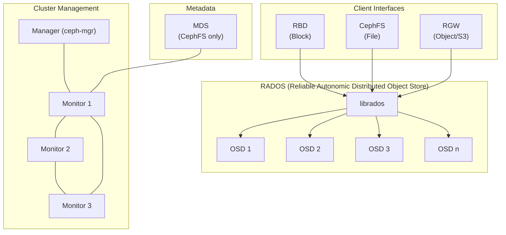
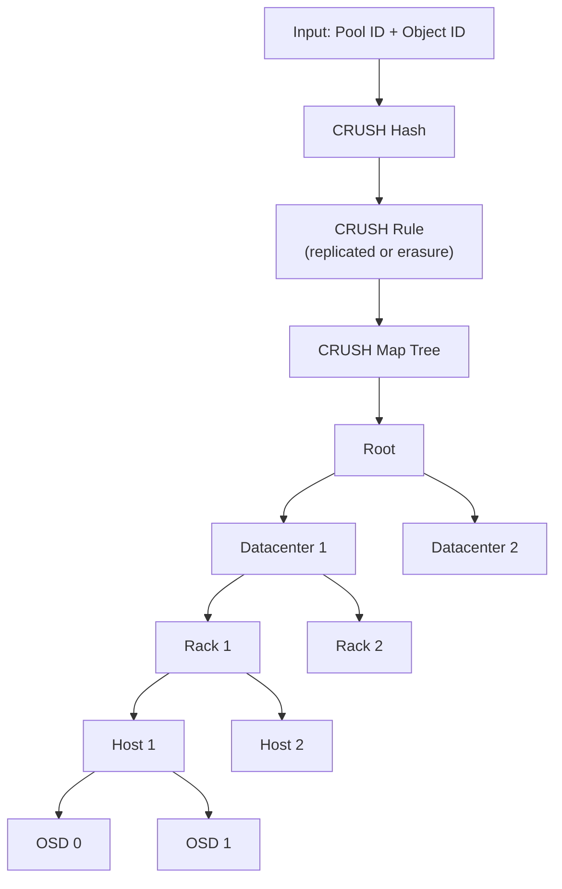
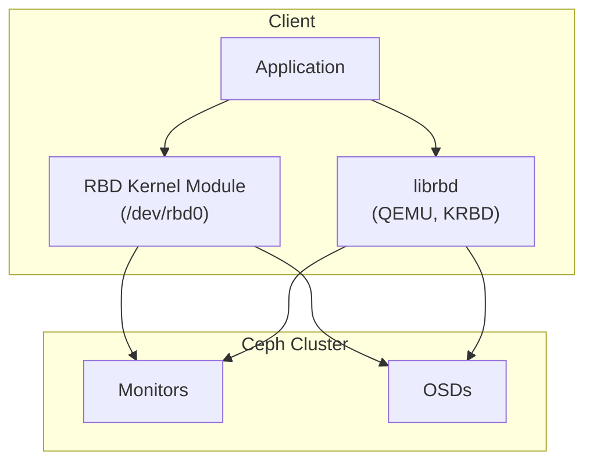

# Ceph Distributed Storage

## Introduction

Ceph is an open-source, distributed storage platform that provides object, block, and file storage from a single unified cluster. Unlike traditional SAN/NAS solutions, Ceph has no single point of failure, scales horizontally, and runs on commodity hardware. It's the most widely deployed open-source storage solution, powering private clouds (OpenStack, Kubernetes), research institutions, and enterprise data centers.

This chapter covers Ceph's core architecture (RADOS), the CRUSH algorithm, RBD (RADOS Block Device), CephFS, and performance tuning.

## Ceph Architecture Overview



## RADOS: The Foundation

RADOS (Reliable Autonomic Distributed Object Store) is Ceph's storage backend. Every piece of data in Ceph is stored as a RADOS object.

### RADOS Objects

- Each object has a unique ID (OID) within a pool
- Objects are stored on OSDs (Object Storage Daemons)
- Objects can be replicated or erasure-coded
- Object size is typically 4 MiB (configurable)

```bash
# List RADOS objects in a pool
rados -p mypool ls | head -20
# rbd_data.image1.0000000000000000
# rbd_data.image1.0000000000000001
# rbd_data.image1.0000000000000002

# Get object info
rados -p mypool stat rbd_data.image1.0000000000000000
# mypool/rbd_data.image1.0000000000000000 mtime 2026-07-21 10:00:00.000000, size 4194304
```

### OSD (Object Storage Daemon)

Each OSD manages a portion of the cluster's data. Typically one OSD per disk (HDD or SSD):

```bash
# Check OSD status
ceph osd tree
# ID  CLASS  WEIGHT   TYPE NAME       STATUS  REWEIGHT  PRI-AFF
# -1         27.29448  root default
# -3          9.09816      host node1
#  0    hdd   1.81963          osd.0      up   1.00000  1.00000
#  1    hdd   1.81963          osd.1      up   1.00000  1.00000
#  2    hdd   1.81963          osd.2      up   1.00000  1.00000
#  3    ssd   0.90981          osd.3      up   1.00000  1.00000
# -5          9.09816      host node2
#  4    hdd   1.81963          osd.4      up   1.00000  1.00000
#  5    hdd   1.81963          osd.5      up   1.00000  1.00000
#  6    hdd   1.81963          osd.6      up   1.00000  1.00000
#  7    ssd   0.90981          osd.7      up   1.00000  1.00000

# OSD performance counters
ceph daemon osd.0 perf dump | jq '.osd'
# {
#   "op_wip": 0,
#   "op": 123456,
#   "op_in_bytes": 789012345,
#   "op_out_bytes": 456789012,
#   "op_r": 98765,
#   "op_w": 24691,
#   "op_rw": 0,
#   ...
# }
```

## CRUSH Algorithm

CRUSH (Controlled Replication Under Scalable Hashing) is Ceph's data placement algorithm. It determines which OSDs store each object **without a central directory**—clients compute placement directly.

### How CRUSH Works



### CRUSH Map

```bash
# View CRUSH map
ceph osd getcrushmap -o crushmap.bin
crushtool -d crushmap.bin -o crushmap.txt
cat crushmap.txt
# begin crush map
# tunable choose_local_tries 0
# tunable choose_local_fallback_tries 0
# tunable choose_total_tries 50
#
# devices
# device 0 osd.0 class hdd
# device 1 osd.1 class hdd
# device 2 osd.2 class hdd
# device 3 osd.3 class ssd
#
# types
# type 0 osd
# type 1 host
# type 2 chassis
# type 3 rack
# type 4 row
# type 5 pdu
# type 6 pod
# type 7 room
# type 8 datacenter
# type 9 zone
# type 10 region
# type 11 root
#
# buckets
# host node1 {
#     id -3
#     alg straw2
#     hash 0
#     item osd.0 weight 1.81963
#     item osd.1 weight 1.81963
# }
# root default {
#     id -1
#     alg straw2
#     hash 0
#     item node1 weight 3.63926
#     item node2 weight 3.63926
# }
#
# rules
# rule replicated_rule {
#     id 0
#     type replicated
#     min_size 1
#     max_size 10
#     step take default
#     step chooseleaf firstn 0 type host
#     step emit
# }
# end crush map
```

### CRUSH Rules

```bash
# Create a custom CRUSH rule (e.g., for SSD-only pool)
ceph osd crush rule create-replicated ssd_rule default host ssd

# Create rule for rack-level fault tolerance
ceph osd crush rule create-replicated rack_rule default rack

# Assign rule to pool
ceph osd pool set mypool crush_rule ssd_rule
```

## Pools and Placement Groups (PGs)

### Pool Management

```bash
# Create a replicated pool
ceph osd pool create mypool 128 128 replicated replicated_rule
# 128 PGs, 128 PGP (placement groups for placement)

# Create an erasure-coded pool
ceph osd erasure-code-profile set myprofile k=4 m=2 plugin=jerasure technique=reed_sol_van
ceph osd pool create ecpool 128 128 erasure myprofile

# List pools
ceph osd pool ls detail
# pool 1 'mypool' replicated size 3 min_size 2 crush_rule 0 object_hash rjenkins
#   pg_num 128 pgp_num 128 last_change 42 flags hashpspool stripe_width 0
# pool 2 'ecpool' erasure size 6 min_size 5 crush_rule 1 object_hash rjenkins
#   pg_num 128 pgp_num 128 last_change 45 flags hashpspool erasure

# Set pool properties
ceph osd pool set mypool size 3          # 3 replicas
ceph osd pool set mypool min_size 2      # Minimum for writes
ceph osd pool set mypool pg_num 256      # Increase PGs
ceph osd pool set mypool pgp_num 256     # Must match pg_num

# Get pool stats
ceph osd pool stats mypool
# pool mypool iorecovery 123 iowr 456 iord 789
```

### Placement Groups (PGs)

PGs are the fundamental unit of data distribution and recovery:

```bash
# View PG status
ceph pg stat
# 1536 pgs: 1536 active+clean; 456 GiB data, 1.2 TiB used, 8.8 TiB / 10 TiB avail

# View PG details
ceph pg dump --format json-pretty | jq '.pg_map.pg_stats[0]'
# {
#   "pgid": "1.0",
#   "state": "active+clean",
#   "stat_sum": {
#     "num_bytes": 1234567,
#     "num_objects": 42
#   },
#   "up": [0, 1, 2],
#   "acting": [0, 1, 2]
# }

# PG states explained:
# active+clean         - Normal, all replicas consistent
# active+degraded      - Some OSDs down, data still available
# active+remapped      - PG being moved to different OSDs
# active+recovery      - Data being recovered
# active+undersized    - Fewer replicas than configured
# inactive             - PG not available
```

## RBD (RADOS Block Device)

RBD provides block storage backed by RADOS. It's the most common way to use Ceph for virtual machines (OpenStack, Kubernetes).



### RBD Operations

```bash
# Create an RBD image
rbd create mypool/myimage --size 100G
rbd create mypool/myimage --size 100G --image-format 2 --object-size 23
# --object-size 23 means 2^23 = 8 MiB objects

# List RBD images
rbd ls mypool
# myimage

# Get image info
rbd info mypool/myimage
# rbd image 'myimage':
# 	size 100 GiB in 25600 objects
# 	order 23 (8 MiB objects)
# 	block_name_prefix: rbd_data.123456789012
# 	format: 2
# 	features: layering, exclusive-lock, object-map, fast-diff, deep-flatten
# 	op_features:
# 	flags:
# 	create_timestamp: Mon Jul 21 10:00:00 2026

# Map RBD image to kernel block device
rbd map mypool/myimage
# /dev/rbd0

# Create filesystem and mount
mkfs.xfs /dev/rbd0
mount /dev/rbd0 /mnt/ceph

# Unmap
umount /mnt/ceph
rbd unmap /dev/rbd0

# Resize
rbd resize mypool/myimage --size 200G --allow-shrink  # Shrink
rbd resize mypool/myimage --size 200G                  # Grow

# Delete
rbd rm mypool/myimage
```

### RBD Snapshots and Clones

```bash
# Create snapshot
rbd snap create mypool/myimage@snap1

# List snapshots
rbd snap ls mypool/myimage
# SNAPID  NAME   SIZE    PROTECTED  TIMESTAMP
#     10  snap1  100 GiB            Mon Jul 21 10:00:00 2026

# Protect snapshot (required before cloning)
rbd snap protect mypool/myimage@snap1

# Clone snapshot
rbd clone mypool/myimage@snap1 mypool/clone1

# Flatten clone (make independent of parent)
rbd flatten mypool/clone1

# Rollback to snapshot
rbd snap rollback mypool/myimage@snap1

# Delete snapshot
rbd snap unprotect mypool/myimage@snap1
rbd snap rm mypool/myimage@snap1
```

### RBD Kernel Module (krbd)

```bash
# Load RBD kernel module
modprobe rbd

# Map using kernel module
rbd map mypool/myimage --id admin --keyring /etc/ceph/ceph.client.admin.keyring

# View mapped RBD devices
rbd device list
# id  pool   namespace  image   snap  device
#  0  mypool            myimage  -     /dev/rbd0

# RBD kernel module parameters
cat /sys/module/rbd/parameters/single_major
# Y (use single major number for all RBD devices)
```

### RBD Performance

```bash
# Benchmark RBD
rbd bench --io-type write --io-size 4096 --io-threads 16 --io-total 1073741824 mypool/myimage
# bench  type write io_size 4096 io_threads 16 bytes 1073741824
#   sec    ops   ops/s    mb/s  mean stddev    min    max  50%   90%   99%
#     1   4096   4096     16    3.8  1.2       1     12    3     6    10
#     2   8192   4096     16    3.9  1.3       1     15    3     6    11
# ...

# RBD with fio (using rbd engine)
fio --name=rbd-test --ioengine=rbd --clientname=admin \
    --pool=mypool --rbdname=myimage \
    --rw=randread --bs=4k --size=1G --numjobs=4 --iodepth=32
```

## CephFS

CephFS provides a POSIX-compliant filesystem built on RADOS. It uses MDS (Metadata Server) daemons for metadata and RADOS for data.

```bash
# Create CephFS data and metadata pools
ceph osd pool create cephfs_data 128
ceph osd pool create cephfs_metadata 64

# Create filesystem
ceph fs new cephfs cephfs_metadata cephfs_data

# Check status
ceph fs status
# cephfs - 0 clients
# ======
# POOL          TYPE     USED  AVAIL
# cephfs_metadata  metadata  1024  8.8 TiB
# cephfs_data      data     0     8.8 TiB
# MDS  cephfs:1  {0=node1=up:active}

# Mount CephFS (kernel mount)
mount -t ceph 192.168.1.100:/ /mnt/cephfs -o name=admin,secret=AQBS...

# Mount with ceph-fuse
ceph-fuse /mnt/cephfs

# Mount in /etc/fstab
# 192.168.1.100:/ /mnt/cephfs ceph name=admin,secret=AQBS...,noatime 0 0
```

## Ceph Cluster Management

### Health and Status

```bash
# Cluster health
ceph health detail
# HEALTH_OK
# or
# HEALTH_WARN 3 pgs degraded
# HEALTH_ERR 1 pgs are stuck inactive

# Cluster status
ceph status
#   cluster:
#     id:     12345678-1234-1234-1234-123456789abc
#     health: HEALTH_OK
#
#   services:
#     mon: 3 daemons, quorum node1,node2,node3 (age 2d)
#     mgr: node1(active, since 2d)
#     mds: cephfs:1 {0=node1=up:active}
#     osd: 16 osds: 16 up (since 2d), 16 in (since 2d)
#
#   data:
#     pools:   5 pools, 640 pgs
#     objects: 123.45k objects, 456 GiB
#     usage:   1.2 TiB used, 8.8 TiB / 10 TiB avail
#     pgs:     640 active+clean

# Detailed cluster usage
ceph df
# --- RAW STORAGE ---
# CLASS  SIZE   AVAIL   USED   RAW USED  %RAW USED
# hdd    10 TiB 8.8 TiB 1.2 TiB  1.2 TiB      12.00
# ssd    2 TiB  1.8 TiB  200 GiB  200 GiB       9.77
# TOTAL  12 TiB 10.6 TiB 1.4 TiB  1.4 TiB      11.67
#
# --- POOLS ---
# POOL           ID  PGS  STORED  OBJECTS  USED  %USED  MAX AVAIL
# mypool          1  128  456 GiB   123456  1.2 TiB  12.00   8.8 TiB
# ecpool          2  128  200 GiB    67890  600 GiB   5.88   8.8 TiB
```

### OSD Management

```bash
# Add a new OSD
ceph-volume lvm create --data /dev/sde

# Mark OSD out (removes from cluster)
ceph osd out osd.0

# Mark OSD in
ceph osd in osd.0

# Set OSD weight
ceph osd crush reweight osd.0 2.0

# Remove OSD
ceph osd purge osd.0 --yes-i-really-mean-it

# Set OSD flags
ceph osd set noout      # Prevent OSDs from being marked out
ceph osd unset noout
ceph osd set norebalance  # Prevent rebalancing
ceph osd unset norebalance
```

## Ceph Performance Tuning

### Network Tuning

```bash
# Use jumbo frames
ip link set eth0 mtu 9000

# Separate public and cluster networks
# ceph.conf
# [global]
# public_network = 192.168.1.0/24
# cluster_network = 10.0.1.0/24

# Enable kernel bypass (DPDK) for high-performance networks
# Requires additional configuration
```

### OSD Tuning

```bash
# Increase OSD memory target
# /etc/ceph/ceph.conf
# [osd]
# osd_memory_target = 4294967296  # 4 GiB

# Adjust recovery settings
ceph tell 'osd.*' injectargs --osd-max-backfills 1
ceph tell 'osd.*' injectargs --osd-recovery-max-active 3
ceph tell 'osd.*' injectargs --osd-recovery-sleep 0.1

# Adjust scrub scheduling
ceph tell 'osd.*' injectargs --osd-scrub-begin-hour=2
ceph tell 'osd.*' injectargs --osd-scrub-end-hour=6

# BlueStore tuning (default backend)
# /etc/ceph/ceph.conf
# [osd]
# bluestore_cache_size_ssd = 3221225472   # 3 GiB for SSD OSDs
# bluestore_cache_size_hdd = 1073741824   # 1 GiB for HDD OSDs
# bluestore_rocksdb_options = compression=kNoCompression,max_write_buffer_number=4,min_write_buffer_number_to_merge=1,recycle_log_file_num=4,compaction_style=0
```

### Pool Tuning

```bash
# Adjust PG count (more PGs = better distribution, more memory)
ceph osd pool set mypool pg_num 256
ceph osd pool set mypool pgp_num 256

# Set pool quotas
ceph osd pool set-quota mypool max_objects 1000000
ceph osd pool set-quota mypool max_bytes 1073741824000  # 1 TiB

# Enable/disable application on pool
ceph osd pool application enable mypool rbd
```

## Ceph in Kubernetes (Rook)

```yaml
# Rook CephCluster CRD (simplified)
apiVersion: ceph.rook.io/v1
kind: CephCluster
metadata:
  name: rook-ceph
  namespace: rook-ceph
spec:
  cephVersion:
    image: quay.io/ceph/ceph:v18.2.0
  dataDirHostPath: /var/lib/rook
  storage:
    useAllNodes: true
    useAllDevices: true
  network:
    provider: host
  dashboard:
    enabled: true
```

```bash
# Deploy Rook operator
kubectl apply -f https://raw.githubusercontent.com/rook/rook/master/deploy/examples/operator.yaml
kubectl apply -f https://raw.githubusercontent.com/rook/rook/master/deploy/examples/cluster.yaml

# Create storage class
kubectl apply -f https://raw.githubusercontent.com/rook/rook/master/deploy/examples/csi/rbd/storageclass.yaml

# Create PVC
cat <<EOF | kubectl apply -f -
apiVersion: v1
kind: PersistentVolumeClaim
metadata:
  name: ceph-pvc
spec:
  storageClassName: rook-ceph-block
  accessModes:
    - ReadWriteOnce
  resources:
    requests:
      storage: 10Gi
EOF
```

## References

- [Ceph Documentation](https://docs.ceph.com/)
- [CRUSH Paper](https://ceph.com/wp-content/uploads/2016/08/weil-crush-sc06.pdf)
- [Ceph Architecture](https://docs.ceph.com/en/latest/architecture/)
- [Rook Ceph Operator](https://rook.io/docs/rook/latest/ceph-storage.html)

## Further Reading

- [The Linux Kernel Documentation](https://docs.kernel.org/)
- [LWN.net - Linux and free software news](https://lwn.net/)
- [GNU Project Documentation](https://www.gnu.org/doc/doc.html)
- [GNU Manuals](https://www.gnu.org/manual/manual.html)
- [Free Software Directory](https://directory.fsf.org/wiki/Main_Page)
- [Planet GNU](https://planet.gnu.org/)
- [Free Software Books](https://www.gnu.org/doc/other-free-books.html)

- <https://ceph.io/en/> - Ceph project homepage
- <https://docs.ceph.com/en/latest/rados/operations/> - RADOS operations guide
- <https://docs.ceph.com/en/latest/rbd/> - RBD documentation
- <https://www.usenix.org/conference/atc14/technical-sessions/presentation/weil> - CRUSH algorithm paper

## Related Topics

- [Storage Overview](overview.md)
- [RAID Explained](raid-explained.md)
- [Block I/O Layer](block-io.md)
- [I/O Performance](../performance/io.md)
