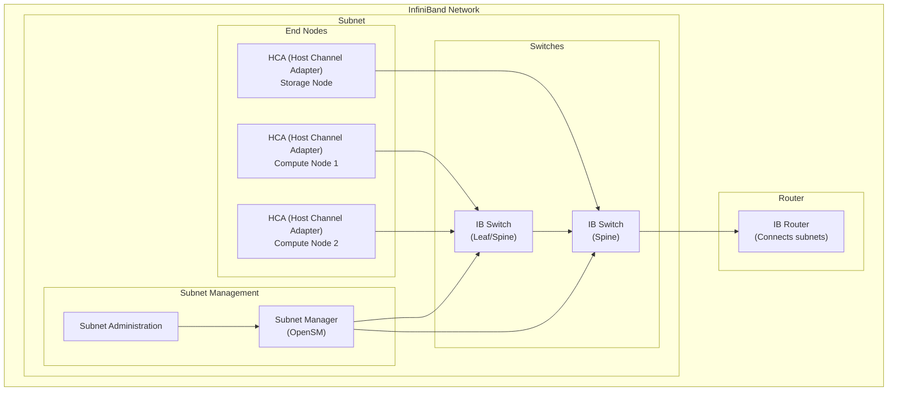
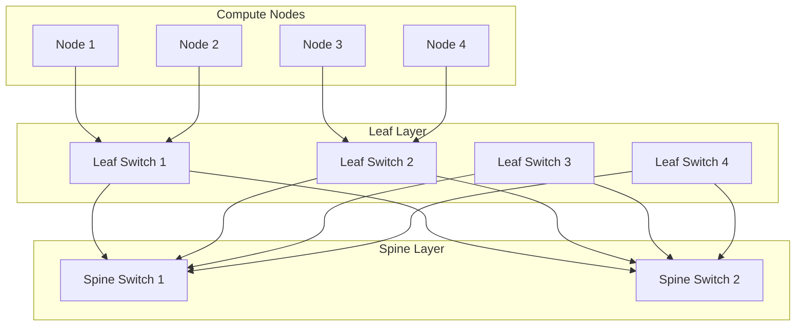
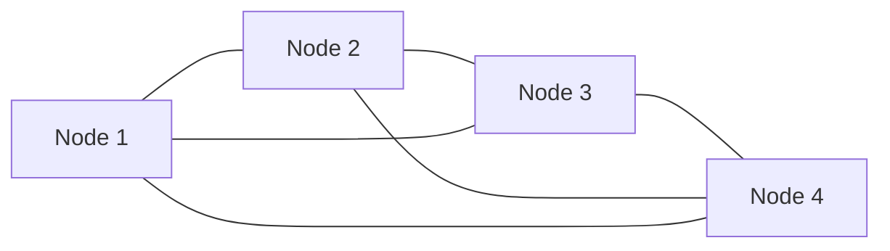
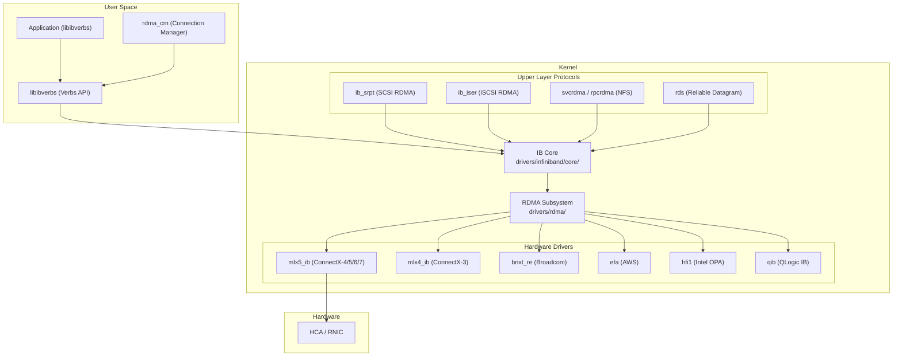

# InfiniBand Networking

## Introduction

InfiniBand (IB) is a high-performance, low-latency networking technology originally developed in the late 1990s by the InfiniBand Trade Association (IBTA). Unlike traditional Ethernet, InfiniBand was designed from the ground up for high-performance computing (HPC), storage fabrics, and data center interconnects, offering features like hardware-level remote direct memory access (RDMA), credit-based lossless flow control, and very high bandwidth.

Modern InfiniBand is the interconnect of choice for the world's fastest supercomputers and AI training clusters. As of 2025, over 60% of the Top500 supercomputers use InfiniBand networking, with speeds reaching 400 Gbps (NDR) and 800 Gbps (XDR).

**Key characteristics:**

- **Bandwidth**: SDR (2.5 Gbps) → DDR (5 Gbps) → QDR (10 Gbps) → FDR (14.0625 Gbps) → EDR (25.78125 Gbps) → HDR (50 Gbps) → NDR (100 Gbps) → XDR (200 Gbps per lane, 800 Gbps aggregate)
- **Latency**: Sub-microsecond for small messages
- **RDMA**: Native hardware-level remote memory access
- **Lossless**: Credit-based flow control — no packet drops under normal operation
- **CPU offload**: NIC handles protocol processing without CPU involvement

## Architecture Overview



### Components

| Component | Description | Linux Representation |
|-----------|-------------|:-------------------:|
| **HCA** (Host Channel Adapter) | Network interface card for IB | `mlx5_0`, `mlx4_0` |
| **Switch** | Forwards IB packets (LID-based routing) | Managed via SM |
| **Subnet Manager (SM)** | Configures routing, assigns LIDs, manages topology | OpenSM / `ib_sm` |
| **Subnet Administration (SA)** | Provides information about subnet topology | `saquery` tool |
| **Router** | Connects IB subnets | `ib_routing` |

### InfiniBand Packet Structure

InfiniBand uses **Transport Layer Packets (TLPs)** with a link-layer header:

```
┌──────────────┬──────────────┬─────────────┬───────────┬──────────┐
│ Local Route  │ Global Route │   Base      │  Payload  │  ICRC    │
│ Header (LRH) │ Header (GRH) │ Transport   │  (0-4096  │ (32-bit  │
│  (8 bytes)   │ (40 bytes)   │ Header (BTH)│   bytes)  │  CRC)    │
│              │  (optional)  │  (12 bytes) │           │          │
└──────────────┴──────────────┴─────────────┴───────────┴──────────┘
```

- **LRH**: Contains SLID (Source LID), DLID (Destination LID), Virtual Lane (VL)
- **GRH**: Used for L3 routing between subnets (IPv6-based GID addressing)
- **BTH**: Opcode, destination QP, PSN (Packet Sequence Number)

## Speed Evolution

| Generation | Speed (4x) | Encoding | Link Rate | Year | IBTA Spec |
|-----------|:----------:|:--------:|:---------:|:----:|:---------:|
| **SDR** | 10 Gbps | 8b/10b | 2.5 Gbps | 2001 | 1.0 |
| **DDR** | 20 Gbps | 8b/10b | 5 Gbps | 2004 | 1.1 |
| **QDR** | 40 Gbps | 8b/10b | 10 Gbps | 2007 | 1.2 |
| **FDR** | 56.25 Gbps | 64b/66b | 14.0625 Gbps | 2011 | 1.3 |
| **EDR** | 100 Gbps | 64b/66b | 25.78125 Gbps | 2014 | 1.4 |
| **HDR** | 200 Gbps | PAM4 | 50 Gbps | 2019 | 1.5 |
| **NDR** | 400 Gbps | PAM4 | 100 Gbps | 2022 | 1.6 |
| **XDR** | 800 Gbps | PAM4 | 200 Gbps | 2025+ | 1.7 |

## Topology Types

### Fat Tree

Common in HPC clusters — non-blocking bisection bandwidth:



### Torus/Mesh

Used in large-scale HPC for direct-connect topologies:



## Linux InfiniBand Stack

### Kernel Modules



### Key Kernel Files

| Path | Purpose |
|------|---------|
| `drivers/infiniband/core/` | IB core: verbs, CM, MAD, SA |
| `drivers/infiniband/core/ib_core.c` | Core initialization |
| `drivers/infiniband/core/uverbs_main.c` | Userspace verbs (`/dev/infiniband/uverbs*`) |
| `drivers/infiniband/core/cma.c` | RDMA Connection Manager |
| `drivers/infiniband/core/mad.c` | Management Datagram handling |
| `drivers/infiniband/hw/mlx5/` | Mellanox ConnectX driver |
| `include/rdma/ib_verbs.h` | Core verbs header |
| `include/uapi/rdma/` | Userspace API headers |

## Hardware: Host Channel Adapters (HCAs)

### NVIDIA (Mellanox) ConnectX Series

| HCA | Speed | IB Gen | Key Features |
|-----|:-----:|:------:|-------------|
| ConnectX-3 | 40 Gbps | QDR/FDR | Legacy, still deployed |
| ConnectX-4 | 100 Gbps | EDR | SR-IOV, VXLAN offload |
| ConnectX-5 | 100 Gbps | EDR | NVMe offload, enhanced VXLAN |
| ConnectX-6 | 200 Gbps | HDR | Crypto offload, multi-host |
| ConnectX-6 Dx | 200 Gbps | HDR | IPsec/TLS offload |
| ConnectX-7 | 400 Gbps | NDR | GPUDirect, SHARP |
| ConnectX-8 | 800 Gbps | XDR | Latest generation |

### Intel Omni-Path (OPA)

Intel's alternative IB-compatible fabric (HFI1 driver):

- 100 Gbps per port
- Integrated in Intel Xeon processors (some models)
- Uses `hfi1` kernel driver

## Configuration

### Installing InfiniBand Packages

```bash
# Debian/Ubuntu
sudo apt install rdma-core ibverbs-utils infiniband-diags \
    opensm perftest rdmacm-utils ibutils

# RHEL/CentOS/Fedora
sudo dnf install rdma-core libibverbs-utils infiniband-diags \
    opensm perftest librdmacm-utils

# NVIDIA MLNX_OFED (recommended for latest features)
# Download from: https://network.nvidia.com/products/infiniband-drivers/linux/mlnx_ofed/
sudo ./mlnxofedinstall --add-kernel-support --without-fw-update
```

### Loading Kernel Modules

```bash
# Core IB modules
sudo modprobe ib_core
sudo modprobe ib_uverbs
sudo modprobe ib_umad
sudo modprobe ib_cm
sudo modprobe iw_cm
sudo modprobe rdma_cm
sudo modprobe rdma_ucm

# Mellanox drivers
sudo modprobe mlx5_core
sudo modprobe mlx5_ib

# Legacy Mellanox
sudo modprobe mlx4_core
sudo modprobe mlx4_ib

# Verify
lsmod | grep -E "ib_|mlx|rdma"
```

### Verifying HCA Status

```bash
# List IB devices
$ ibv_devices
    device           node GUID
    ------           ----------------
    mlx5_0           0002c90300abcdef

# Detailed device info
$ ibv_devinfo -d mlx5_0
hca_id: mlx5_0
        transport:                      InfiniBand (0)
        fw_ver:                         16.35.2000
        node_guid:                      0002c903:00abcdef
        sys_image_guid:                 0002c903:00abcdef
        vendor_id:                      0x02c9
        vendor_part_id:                 4119
        hw_ver:                         0x0
        phys_port_cnt:                  1
        port:   1
                state:                  PORT_ACTIVE (4)
                max_mtu:                4096 (5)
                active_mtu:             4096 (5)
                sm_lid:                 1
                port_lid:               3
                port_lmc:               0x00
                link_layer:             InfiniBand

# IB port status
$ ibstat mlx5_0
CA 'mlx5_0'
        CA type: MT4119
        Num ports: 1
        Firmware version: 16.35.2000
        Hardware version: 0
        Node GUID: 0x0002c90300abcdef
        System image GUID: 0x0002c90300abcdef
        Port 1:
                State: Active
                Physical state: LinkUp
                Rate: 100
                Base lid: 3
                LMC: 0
                SM lid: 1
                Capability mask: 0x2651e848
                Port GUID: 0x0002c90300abcdef
                Link layer: InfiniBand
```

## Subnet Manager (OpenSM)

The Subnet Manager (SM) is essential for InfiniBand operation. It discovers the fabric topology, assigns Local IDs (LIDs) to each port, computes routing tables, and configures switches.

### OpenSM Basics

```bash
# OpenSM is the reference open-source Subnet Manager
# Install
sudo apt install opensm    # Debian/Ubuntu
sudo dnf install opensm    # RHEL/Fedora

# Start OpenSM (typically runs on one node or on a switch)
sudo opensm

# Or as a systemd service
sudo systemctl enable opensm
sudo systemctl start opensm

# Run on a specific port
sudo opensm -g 0x0002c90300abcdef    # By GUID
sudo opensm -B    # Run in background (daemon mode)

# Specify a partition configuration file
sudo opensm -P /etc/opensm/partitions.conf
```

### OpenSM Routing Engines

```bash
# Default routing: MinHop (shortest path)
sudo opensm -R minhop

# Fat-tree optimized routing
sudo opensm -R ftree

# Up/Down routing (avoids routing loops)
sudo opensm -UP

# LASH (Linear Assignment for Source-based Hop-by-hop routing)
sudo opensm -R lash

# Torus-2QoS (for torus topologies)
sudo opensm -R torus-2QoS

# Dragonfly routing
sudo opensm -R dfsssp
```

### Partition Configuration

```bash
# /etc/opensm/partitions.conf
# Default partition (all ports)
Default=0x7fff, ipoib, rate=15:ALL;

# Restricted partition (specific ports only)
Restricted=0x8001, rate=15, mtu=4:0x1234,0x5678,0x9abc;

# Partition with QoS
HighPerf=0x8002, rate=30, mtu=5, sl=3:0xdef0,0x1111;
```

### Fabric Discovery and Monitoring

```bash
# Discover fabric topology
ibnetdiscover
# Output shows nodes, ports, and links

# Query node info
ibstat
ibstatus

# Check SM state
smpquery -C mlx5_0 nodeinfo 1    # Port 1
smpquery -C mlx5_0 portinfo 1

# Query SA (Subnet Administration)
saquery                          # List all path records
saquery -c                       # Class Port Info
saquery --smkey 0x1              # SM info

# Get LID-to-GUID mapping
ibaddr

# Port counters (errors, packets)
perfquery -C mlx5_0 -a -x

# Per-port extended counters
perfquery -C mlx5_0 1 -x
# PortXmitData, PortRcvData, PortXmitPkts, PortRcvPkts
# PortXmitDiscards, PortRcvErrors, PortXmitWait
```

## Fabric Topology and Diagnostics

### ibnetdiscover

```bash
# Discover and display fabric topology
$ ibnetdiscover
# Output:
# vendid=0x2c9
# devid=0xcb84
# sysimgguid=0x0002c90300abcdef
# switchguid=0x0002c90300abcdef(0002c90300abcdef)
# Switch  36 "S-0002c90300abcdef"     # "Switch Mellanox" lid 1 lmc 0
#     1  "H-0002c90300abcdef"        # "Node 1 mlx5_0" lid 3
#     2  "H-0002c90300abcdef"        # "Node 2 mlx5_0" lid 4
# CA    40 "H-0002c90300abcdef"
#     1  "S-0002c90300abcdef"        # lid 3 lmc 0 "mlx5_0"

# Generate topology file for analysis
ibnetdiscover > /tmp/ibnet.topology

# Graphical topology (needs graphviz)
ibtopo2dot /tmp/ibnet.topology > /tmp/ibtopo.dot
dot -Tpng /tmp/ibtopo.dot -o /tmp/ibtopo.png
```

### ibdiagnet (Fabric Diagnostics)

```bash
# Comprehensive fabric diagnostics
$ ibdiagnet
# Performs:
# - Topology discovery
# - LID assignment verification
# - Link quality checks
# - Error counter analysis
# - Routing verification

# Output:
# Loading IBDiagnet...
# -I- Discovering ... 2 nodes found
# -I- Topology is OK
# -I- Errors       : 0
# -I- Warnings     : 0

# Additional options
ibdiagnet -r           # Record topology to file
ibdiagnet --skip dup_guids  # Skip duplicate GUID checks
ibdiagnet -P all=0xff  # Check all ports
```

### ibping (Connectivity Test)

```bash
# IB ping — tests L2 connectivity
# Server side:
ibping -S    # Start as server

# Client side:
ibping -L 3    # Ping node with LID 3

# Ping by GUID
ibping -G 0x0002c90300abcdef
```

### ibtracert (Route Tracing)

```bash
# Trace path between two endpoints
ibtracert 3 4    # From LID 3 to LID 4

# Shows each hop:
# From ca lid 3 port 1 to ca lid 4 port 1
# Hop 1: Switch lid 1 out port 1 -> in port 2
# Hop 2: ca lid 4 port 1
```

## Performance Benchmarking

```bash
# RDMA Write bandwidth (IB transport)
# Server:
ib_write_bw -d mlx5_0 -a
# Client:
ib_write_bw -d mlx5_0 --report_gbits 192.168.100.2

# RDMA Read bandwidth
ib_read_bw -d mlx5_0 -a
ib_read_bw -d mlx5_0 --report_gbits 192.168.100.2

# RDMA Write latency
ib_write_lat -d mlx5_0 -a
ib_write_lat -d mlx5_0 192.168.100.2

# Send/Receive latency
ib_send_lat -d mlx5_0 -a
ib_send_lat -d mlx5_0 192.168.100.2

# Bidirectional bandwidth
ib_write_bw -d mlx5_0 -a --bidir
ib_write_bw -d mlx5_0 --bidir --report_gbits 192.168.100.2

# Multi-stream bandwidth
ib_write_bw -d mlx5_0 -a -q 8    # 8 queue pairs
ib_write_bw -d mlx5_0 -q 8 --report_gbits 192.168.100.2

# Atomic latency
ib_atomic_lat -d mlx5_0 -a
ib_atomic_lat -d mlx5_0 192.168.100.2
```

### Typical Performance Numbers

| Operation | EDR (100G) | HDR (200G) | NDR (400G) |
|-----------|:----------:|:----------:|:----------:|
| RDMA Write BW | ~97 Gbps | ~195 Gbps | ~390 Gbps |
| RDMA Write Lat | ~1.0 μs | ~0.8 μs | ~0.6 μs |
| RDMA Read Lat | ~1.5 μs | ~1.2 μs | ~0.9 μs |
| Send Lat | ~1.2 μs | ~1.0 μs | ~0.7 μs |

## Topology and Routing

### Fat-Tree Routing

Fat-tree is the most common topology for IB clusters:

```bash
# Configure OpenSM for fat-tree routing
sudo opensm -R ftree -f /var/log/opensm/opensm.log

# Fat-tree requirements:
# - All switches at same level have same number of ports
# - Each switch connects to all switches in adjacent level
# - Non-blocking bisection bandwidth
```

### Topology File Format

```bash
# OpenSM topology file (.topology)
# Define node types and connections

# Example topology:
# Switch  1  "Spine-1"    # LID 1
#   1    "Leaf-1"        # connects to port 1
#   2    "Leaf-2"
#   3    "Leaf-3"
#
# Switch  2  "Leaf-1"     # LID 2
#   1    "Spine-1"
#   2    "Spine-2"
#   3    "Compute-1"
#   4    "Compute-2"
```

## InfiniBand in Linux Containers and VMs

### SR-IOV for InfiniBand

```bash
# Enable SR-IOV on HCA
sudo mlxconfig -d mlx5_0 set SRIOV_EN=1 NUM_OF_VFS=8

# Create VFs
echo 8 | sudo tee /sys/class/infiniband/mlx5_0/device/sriov_numvfs

# List VFs
ls /sys/class/infiniband/

# Assign VF to container
sudo docker run --device /dev/infiniband/uverbs0 \
    --device /dev/infiniband/ucm0 \
    -v /sys/class/infiniband:/sys/class/infiniband \
    ib-app:latest

# Assign VF to VM (libvirt XML)
# <hostdev mode='subsystem' type='pci'>
#   <source>
#     <address domain='0x0000' bus='0x03' slot='0x00' function='0x1'/>
#   </source>
# </hostdev>
```

### Kubernetes RDMA Device Plugin

```bash
# Install Mellanox Network Operator for Kubernetes
# This handles RDMA device plugin, SR-IOV, and device management
helm install nic-operator mellanox/network-operator

# Pod spec requesting RDMA resources:
# resources:
#   limits:
#     rdma/hca: 1
```

## Security

### Partition Keys (P_Keys)

InfiniBand uses Partition Keys (P_Keys) for fabric-level traffic isolation:

```bash
# View P_Key configuration
smpquery -C mlx5_0 pkeytable 1

# P_Key 0x7fff = full partition (default, all members)
# P_Key 0x8000+ = limited membership (can only communicate with full members)

# Configure P_Key in OpenSM partitions.conf
# MyPartition=0x8001, rate=15:0x1234,0x5678;
```

### Service Levels and QoS

```bash
# InfiniBand supports 16 Virtual Lanes (VLs)
# VL 0-15, where VL 15 is reserved for management

# Check VL configuration
smpquery -C mlx5_0 portinfo 1 | grep -i vl

# OpenSM QoS configuration
# /etc/opensm/opensm.conf
# qos TRUE
# qos_max_vls 8
```

## Monitoring

```bash
# Real-time port counters
watch -n 1 "perfquery -C mlx5_0 -a -x"

# Monitor link errors
perfquery -C mlx5_0 1 | grep -E "Error|Discard|Wait"

# Key counters to monitor:
# PortRcvErrors - Receive errors (CRC, etc.)
# PortXmitDiscards - Transmit drops (congestion)
# PortXmitWait - Time spent waiting to transmit
# PortRcvRemotePhysicalErrors - Remote physical errors
# SymbolErrorCounter - Symbol errors (physical layer)

# Network throughput monitoring
ibstat mlx5_0 | grep -i rate

# Topology changes (SM reconfiguration)
dmesg | grep -i "infiniband\|mlx5"

# Monitor SM state
saquery --smkey 0x1
```

## Troubleshooting

### Common Issues

**No IB devices found:**
```bash
# Check PCI devices
lspci | grep -i mellanox
lspci | grep -i infiniband

# Load drivers
sudo modprobe mlx5_core mlx5_ib

# Check dmesg
dmesg | grep -i mlx5
dmesg | grep -i infiniband
```

**Port not active:**
```bash
# Check port state
ibstat mlx5_0
# State should be "Active", Physical state "LinkUp"

# If "Down": check cable/transceiver
ethtool -m mlx5_0

# If "Initializing": SM not running
sudo systemctl status opensm

# Check SM assignment
ibstat | grep "sm lid"
```

**SM not assigning LIDs:**
```bash
# Check OpenSM is running
ps aux | grep opensm
sudo systemctl status opensm

# Check OpenSM logs
sudo journalctl -u opensm

# Restart OpenSM
sudo systemctl restart opensm
```

**Poor performance:**
```bash
# Check link rate
ibstat mlx5_0 | grep Rate

# Check for errors
perfquery -C mlx5_0 -a -x | grep -E "Error|Discard"

# Verify MTU
ibstat mlx5_0 | grep -i mtu

# Check congestion
perfquery -C mlx5_0 1 | grep XmitWait

# NUMA alignment
numactl --hardware
# Pin IB IRQs to NUMA-local CPUs
sudo set_irq_affinity.sh mlx5_0
```

**Duplicate LIDs:**
```bash
# This indicates fabric misconfiguration
ibdiagnet | grep -i "duplicate"

# Restart SM to reassign LIDs
sudo systemctl restart opensm
```

## References

- InfiniBand Trade Association: <https://www.infinibandta.org/>
- IBTA specification volumes: <https://www.infinibandta.org/infiniband-specification>
- Linux InfiniBand kernel subsystem: `drivers/infiniband/`
- NVIDIA MLNX_OFED: <https://network.nvidia.com/products/infiniband-drivers/linux/mlnx_ofed/>
- OpenSM documentation: `man opensm`
- rdma-core project: <https://github.com/linux-rdma/rdma-core>
- perftest suite: <https://github.com/linux-rdma/perftest>
- infiniband-diags: <https://github.com/linux-rdma/rdma-core/tree/master/infiniband-diags>
- Red Hat InfiniBand guide: <https://docs.redhat.com/en/documentation/red_hat_enterprise_linux/9/html/configuring_infiniband_and_rdma_networks>
- Top500 interconnect statistics: <https://top500.org/lists/top500/2025/06/>
- "InfiniBand Network Architecture" by Tom Shanley, MindShare Press
