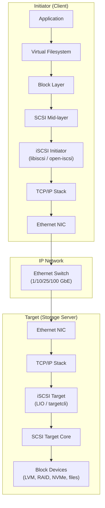
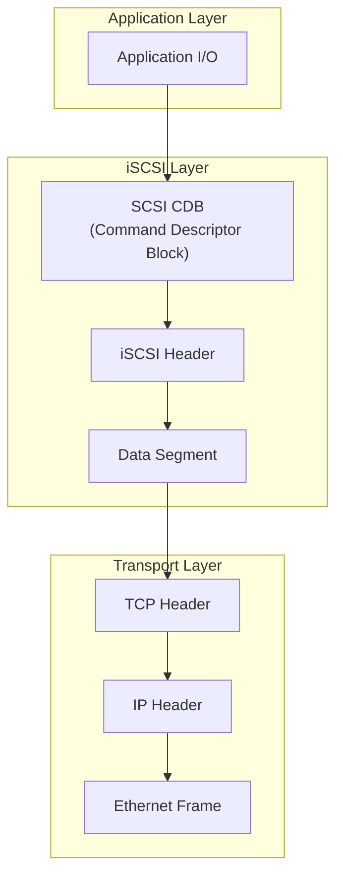
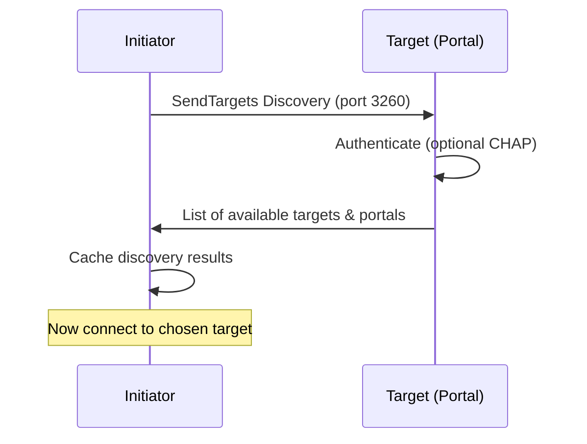
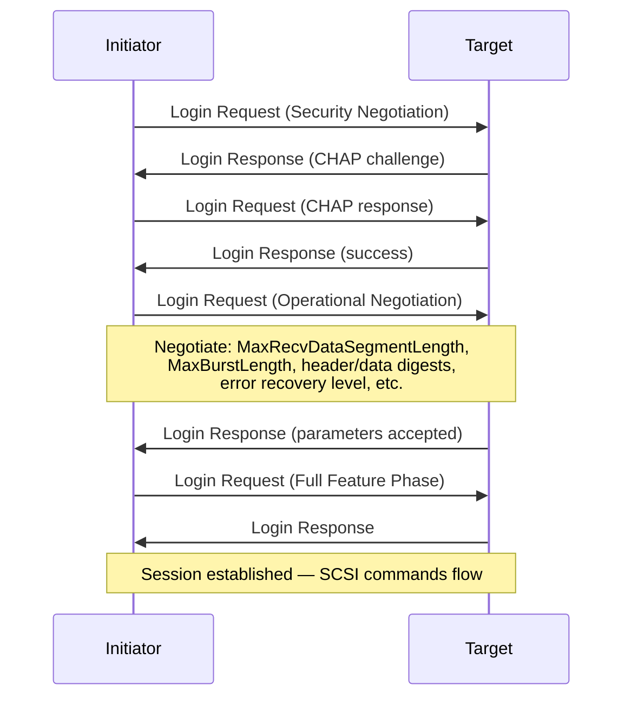
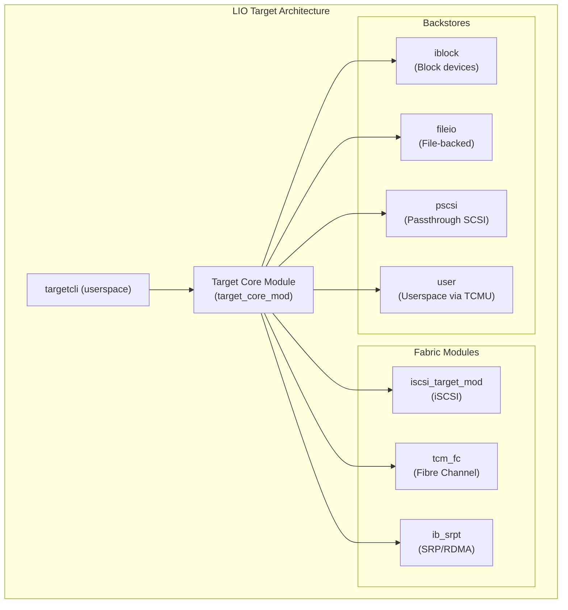

# iSCSI (Internet Small Computer System Interface)

## Introduction

iSCSI is a storage networking protocol that encapsulates SCSI commands within TCP/IP packets, enabling block-level storage access over standard Ethernet networks. Defined in RFC 3720 (2004) and updated in RFC 7143, iSCSI allows organizations to build Storage Area Networks (SANs) using existing IP infrastructure without the expense of dedicated Fibre Channel hardware.

iSCSI is the most widely deployed IP SAN protocol in Linux environments. The Linux kernel includes a mature, production-grade iSCSI stack with both **initiator** (client) and **target** (server) implementations, making Linux a capable iSCSI storage server.

**Key advantages:**

- Uses standard Ethernet — no specialized hardware required
- Works across existing network infrastructure (LAN, WAN, VPN)
- Mature, well-understood protocol with broad vendor support
- Supports CHAP authentication and IPsec encryption
- Cost-effective alternative to Fibre Channel SANs

## Architecture Overview



### Key Concepts

| Term | Definition |
|------|-----------|
| **Initiator** | The client that connects to and accesses iSCSI storage |
| **Target** | The server that exports iSCSI storage volumes |
| **LUN** | Logical Unit Number — a block device exposed by the target |
| **TPG** | Target Portal Group — a set of network portals (IP:port) sharing configuration |
| **Portal** | An IP address and port (default 3260) that the target listens on |
| **IQN** | iSCSI Qualified Name — unique identifier: `iqn.2024-01.com.example:storage0` |
| **Session** | An iSCSI connection between initiator and target (one or more connections) |
| **Discovery** | The process of finding available targets on a network |

### iSCSI Protocol Stack



An iSCSI **Protocol Data Unit (PDU)** consists of:

- **Header**: Opcode, flags, initiator/task tags, LUN, command serial number
- **Data Segment**: Optional payload (data, text parameters, sense data)
- **Digest**: Optional CRC32 checksums for header and data integrity

### iSCSI PDU Types

| PDU Type | Direction | Purpose |
|----------|-----------|---------|
| SCSI Command | Initiator→Target | Read, write, management commands |
| SCSI Response | Target→Initiator | Command completion status |
| Data-Out | Initiator→Target | Write data payload |
| Data-In | Target→Initiator | Read data payload |
| Login Request/Response | Both | Session authentication and negotiation |
| Text Request/Response | Both | Parameter negotiation |
| NOP-Out/In | Both | Keep-alive / ping |
| Logout Request/Response | Both | Session teardown |
| Async Message | Target→Initiator | Event notification |
| Reject | Target→Initiator | PDU rejection |

## iSCSI Session Phases

### Discovery Phase



### Login Phase



### Full Feature Phase

Normal SCSI command processing: initiator sends SCSI commands (read, write, etc.) and receives responses. The session remains active until logout or timeout.

## Linux iSCSI Implementations

### Initiator: open-iscsi

The primary Linux iSCSI initiator is **open-iscsi** (`iscsiadm`), which provides both a kernel component (`iscsi_tcp`) and a userspace management daemon (`iscsid`).

### Target: LIO (Linux-IO)

The Linux kernel's SCSI target framework is **LIO** (Linux-IO), accessible via the **targetcli** shell. LIO supports multiple backstores (block devices, files, RAM disks) and multiple fabric modules (iSCSI, Fibre Channel, SAS, etc.).



## Configuration: iSCSI Target (LIO)

### Installing targetcli

```bash
# Debian/Ubuntu
sudo apt install targetcli-fb

# RHEL/CentOS/Fedora
sudo dnf install targetcli

# openSUSE/SLES
sudo zypper install targetcli-fb

# Load required kernel modules
sudo modprobe target_core_mod
sudo modprobe target_core_file
sudo modprobe target_core_iblock
sudo modprobe iscsi_target_mod
```

### Basic Target Configuration with targetcli

```bash
sudo targetcli

# The targetcli shell uses a filesystem-like tree structure
# / > ls
# o- / ................................................... [...]
#   o- backstores ........................................ [...]
#   | o- block ........................................... [...]
#   | o- fileio .......................................... [...]
#   | o- pscsi ........................................... [...]
#   | o- ramdisk ......................................... [...]
#   o- iscsi ............................................. [...]
#   o- loopback .......................................... [...]
#   o- vhost ............................................. [...]
```

#### Step 1: Create a Backstore

```bash
# Block backstore (recommended for production)
/backstores/block create name=disk0 dev=/dev/vg_storage/lv_iscsi0

# Fileio backstore (for testing)
/backstores/fileio create name=disk1 file_or_dev=/srv/iscsi/disk1.img \
    size=100G sparse=true

# Verify
/backstores/block ls
```

#### Step 2: Create an iSCSI Target

```bash
# Create target with auto-generated IQN
/iscsi create
# Created target iqn.2024-01.com.example:target0

# Or specify IQN
/iscsi create iqn.2024-01.com.example:storage.array0
```

#### Step 3: Configure Network Portal

```bash
# Navigate to the target's TPG
/iscsi/iqn.2024-01.com.example:target0/tpg1

# Add network portal (IP:port)
/portals create ip_address=192.168.100.10 port=3260
# Using 0.0.0.0 listens on all interfaces
/portals create ip_address=0.0.0.0 port=3260
```

#### Step 4: Add LUN (Map Backstore to Target)

```bash
# Add LUN from block backstore
/luns create /backstores/block/disk0
# Created LUN 0

# Or specify LUN number
/luns create lun=1 /backstores/block/disk1
```

#### Step 5: Configure Access Control

```bash
# Option A: Allow any initiator (for testing only)
/iscsi/iqn.2024-01.com.example:target0/tpg1 set attribute authentication=0 demo_mode_write_protect=0 generate_node_acls=1

# Option B: Configure specific initiator ACLs
# First, enable authentication
/iscsi/iqn.2024-01.com.example:target0/tpg1 set attribute authentication=1

# Set target credentials (incoming user = initiator authenticates to target)
/iscsi/iqn.2024-01.com.example:target0/tpg1/acls create \
    iqn.2024-01.com.example:client01

# Set CHAP credentials for the initiator
/iscsi/iqn.2024-01.com.example:target0/tpg1/acls/iqn.2024-01.com.example:client01 \
    set auth userid=target_user
/iscsi/iqn.2024-01.com.example:target0/tpg1/acls/iqn.2024-01.com.example:client01 \
    set auth password=target_secret

# Set mutual CHAP (optional — target authenticates to initiator)
/iscsi/iqn.2024-01.com.example:target0/tpg1/acls/iqn.2024-01.com.example:client01 \
    set auth mutual_userid=initiator_user
/iscsi/iqn.2024-01.com.example:target0/tpg1/acls/iqn.2024-01.com.example:client01 \
    set auth mutual_password=initiator_secret
```

#### Step 6: Save and Exit

```bash
# Save configuration (persisted across reboots)
/saveconfig

# Exit targetcli
/exit
```

### Complete Example: Creating a Multi-LUN Target

```bash
sudo targetcli << 'EOF'
# Create backstores
/backstores/block create name=ssd0 dev=/dev/nvme0n1
/backstores/block create name=ssd1 dev=/dev/nvme1n1
/backstores/block create name=hdd0 dev=/dev/sda

# Create iSCSI target
/iscsi create iqn.2024-01.com.example:faststorage

# Configure portal
/iscsi/iqn.2024-01.com.example:faststorage/tpg1/portals create ip_address=192.168.100.10

# Map LUNs
/iscsi/iqn.2024-01.com.example:faststorage/tpg1/luns create /backstores/block/ssd0
/iscsi/iqn.2024-01.com.example:faststorage/tpg1/luns create /backstores/block/ssd1
/iscsi/iqn.2024-01.com.example:faststorage/tpg1/luns create /backstores/block/hdd0

# Allow any host (demo mode)
/iscsi/iqn.2024-01.com.example:faststorage/tpg1 set attribute authentication=0 demo_mode_write_protect=0 generate_node_acls=1

# Save
/saveconfig
EOF
```

## Configuration: iSCSI Initiator

### Installing open-iscsi

```bash
# Debian/Ubuntu
sudo apt install open-iscsi

# RHEL/CentOS/Fedora
sudo dnf install iscsi-initiator-utils

# openSUSE/SLES
sudo zypper install open-iscsi

# Load kernel module
sudo modprobe iscsi_tcp
```

### Setting Initiator Name

```bash
# Set initiator name (must match ACL on target if configured)
echo "InitiatorName=iqn.2024-01.com.example:client01" | \
    sudo tee /etc/iscsi/initiatorname.iscsi

# Restart iscsid
sudo systemctl restart iscsid
```

### Discovery and Login

```bash
# Discover targets on a portal
sudo iscsiadm -m discovery -t sendtargets -p 192.168.100.10
# Output: 192.168.100.10:3260,1 iqn.2024-01.com.example:target0

# List discovered targets
sudo iscsiadm -m discoverydb -t sendtargets -p 192.168.100.10 -P 1

# Log in to a specific target
sudo iscsiadm -m node -T iqn.2024-01.com.example:target0 -p 192.168.100.10 --login

# Log in to all discovered targets
sudo iscsiadm -m node --loginall=all

# List active sessions
sudo iscsiadm -m session
# tcp: [1] 192.168.100.10:3260,1 iqn.2024-01.com.example:target0 (non-flash)

# The iSCSI disk should now appear
lsblk
# NAME   MAJ:MIN RM   SIZE RO TYPE MOUNTPOINT
# sda      8:0    0   100G  0 disk    ← iSCSI LUN
```

### CHAP Authentication Configuration

```bash
# Configure CHAP for a discovered node
sudo iscsiadm -m node -T iqn.2024-01.com.example:target0 -p 192.168.100.10 \
    -o update --name node.session.auth.authmethod --value=CHAP

sudo iscsiadm -m node -T iqn.2024-01.com.example:target0 -p 192.168.100.10 \
    -o update --name node.session.auth.username --value=initiator_user

sudo iscsiadm -m node -T iqn.2024-01.com.example:target0 -p 192.168.100.10 \
    -o update --name node.session.auth.password --value=initiator_secret

# Mutual CHAP (target authenticates to initiator)
sudo iscsiadm -m node -T iqn.2024-01.com.example:target0 -p 192.168.100.10 \
    -o update --name node.session.auth.username_in --value=target_user

sudo iscsiadm -m node -T iqn.2024-01.com.example:target0 -p 192.168.100.10 \
    -o update --name node.session.auth.password_in --value=target_secret
```

### Automatic Login at Boot

```bash
# Set node to start automatically
sudo iscsiadm -m node -T iqn.2024-01.com.example:target0 -p 192.168.100.10 \
    -o update --name node.startup --value=automatic

# Enable iscsid service
sudo systemctl enable iscsid
sudo systemctl enable iscsi    # For automatic login

# /etc/fstab entry for iSCSI device
# Use _netdev to mount after network is ready
# Use noauto for manual mounting, or auto for boot mount
# /dev/sda1  /mnt/iscsi  xfs  defaults,_netdev,noauto  0 0

# For UUID-based fstab (preferred):
# UUID=xxxx-xxxx  /mnt/iscsi  xfs  defaults,_netdev  0 0
```

### Disconnecting

```bash
# Log out of a specific target
sudo iscsiadm -m node -T iqn.2024-01.com.example:target0 -p 192.168.100.10 --logout

# Log out of all sessions
sudo iscsiadm -m node --logoutall=all

# Delete a discovered node record
sudo iscsiadm -m node -T iqn.2024-01.com.example:target0 -p 192.168.100.10 -o delete
```

## Multipath I/O with iSCSI

iSCSI supports multipathing for high availability and load balancing:

```bash
# Install device-mapper multipath
sudo apt install multipath-tools    # Debian/Ubuntu
sudo dnf install device-mapper-multipath  # RHEL/Fedora

# Configure multipath
cat > /etc/multipath.conf << 'EOF'
defaults {
    polling_interval    30
    path_grouping_policy  failover
    path_selector       "round-robin 0"
    failback            immediate
    no_path_retry       5
    rr_min_io           100
}

blacklist {
    devnode "^(ram|raw|loop|fd|md|dm-|sr|scd|st)[0-9]*"
    devnode "^sd[a-b]$"   # Exclude local disks
}
EOF

# Enable multipathd
sudo systemctl enable multipathd
sudo systemctl start multipathd

# Login via multiple paths
sudo iscsiadm -m discovery -t sendtargets -p 192.168.100.10
sudo iscsiadm -m discovery -t sendtargets -p 192.168.100.11
sudo iscsiadm -m node --loginall=all

# Check multipath status
sudo multipath -ll
# mpath0 (36001405xxxxxxxxxxxxxxxxxxxx) dm-2 LIO-ORG,disk0
# size=100G features='0' hwhandler='0' wp=rw
# |-+- policy='round-robin 0' prio=1 status=active
# | `- 2:0:0:0 sda 8:0  active ready running
# `-+- policy='round-robin 0' prio=1 status=enabled
#   `- 3:0:0:0 sdb 8:16 active ready running
```

## Performance Tuning

### Network-Level Tuning

```bash
# Use Jumbo Frames (9000 MTU) for reduced overhead
sudo ip link set enp1s0f0 mtu 9000
# Verify
ping -M do -s 8972 192.168.100.10

# Increase TCP buffer sizes
cat >> /etc/sysctl.d/iscsi.conf << 'EOF'
net.core.rmem_max = 16777216
net.core.wmem_max = 16777216
net.ipv4.tcp_rmem = 4096 87380 16777216
net.ipv4.tcp_wmem = 4096 65536 16777216
net.core.netdev_max_backlog = 5000
EOF
sudo sysctl -p /etc/sysctl.d/iscsi.conf

# Enable TCP window scaling
echo "net.ipv4.tcp_window_scaling = 1" | sudo tee -a /etc/sysctl.d/iscsi.conf
sudo sysctl -p /etc/sysctl.d/iscsi.conf

# Use dedicated VLAN for iSCSI traffic
sudo ip link add link enp1s0f0 name enp1s0f0.100 type vlan id 100
sudo ip addr add 192.168.100.10/24 dev enp1s0f0.100
sudo ip link set enp1s0f0.100 up
```

### iSCSI Session Tuning

```bash
# Increase queue depth (number of outstanding commands)
sudo iscsiadm -m node -T iqn.2024-01.com.example:target0 -p 192.168.100.10 \
    -o update --name node.session.nr_sessions --value=1

# Increase per-session queue depth
sudo iscsiadm -m node -T iqn.2024-01.com.example:target0 -p 192.168.100.10 \
    -o update --name node.session.cmds_max --value=128

# Increase max recv data segment length
sudo iscsiadm -m node -T iqn.2024-01.com.example:target0 -p 192.168.100.10 \
    -o update --name node.conn[0].iscsi.MaxRecvDataSegmentLength --value=262144

# Enable header and data digests (for reliability, adds CPU overhead)
sudo iscsiadm -m node -T iqn.2024-01.com.example:target0 -p 192.168.100.10 \
    -o update --name node.conn[0].iscsi.HeaderDigest --value=CRC32C
sudo iscsiadm -m node -T iqn.2024-01.com.example:target0 -p 192.168.100.10 \
    -o update --name node.conn[0].iscsi.DataDigest --value=CRC32C
```

### Target-Side Tuning

```bash
# In targetcli, adjust TPG attributes
targetcli /iscsi/iqn.2024-01.com.example:target0/tpg1 set attribute \
    MaxRecvDataSegmentLength=262144

# Increase max connections per session
targetcli /iscsi/iqn.2024-01.com.example:target0/tpg1 set attribute \
    MaxConnections=4

# Increase max commands per connection
targetcli /iscsi/iqn.2024-01.com.example:target0/tpg1 set attribute \
    MaxCmds=128

# Increase max burst length
targetcli /iscsi/iqn.2024-01.com.example:target0/tpg1 set attribute \
    MaxBurstLength=16776192

# Enable immediate data
targetcli /iscsi/iqn.2024-01.com.example:target0/tpg1 set attribute \
    ImmediateData=1
```

### Block Device Tuning on Initiator

```bash
# Set I/O scheduler
echo mq-deadline | sudo tee /sys/block/sda/queue/scheduler

# Increase nr_requests
echo 256 | sudo tee /sys/block/sda/queue/nr_requests

# Set read-ahead for sequential workloads
echo 4096 | sudo tee /sys/block/sda/queue/read_ahead_kb

# Use direct I/O when possible
# fio --filename=/dev/sda --direct=1 --rw=randread --bs=4k --ioengine=io_uring ...
```

### iSER (iSCSI Extensions for RDMA)

For maximum performance, iSER transports iSCSI over RDMA instead of TCP:

```bash
# Load iSER initiator module
sudo modprobe ib_iser

# Target: create iSER-enabled portal in targetcli
targetcli /iscsi/iqn.2024-01.com.example:target0/tpg1/portals create \
    ip_address=192.168.200.10 iser=true

# Discover and connect (initiator automatically uses iSER if available)
sudo iscsiadm -m discovery -t sendtargets -p 192.168.200.10
sudo iscsiadm -m node -T iqn.2024-01.com.example:target0 -p 192.168.200.10 --login
```

## Monitoring

```bash
# List active iSCSI sessions
sudo iscsiadm -m session -P 1
# Session: sid=1
#   Target: iqn.2024-01.com.example:target0
#   Portal: 192.168.100.10:3260,1
#   iSCSI Connection State: LOGGED IN
#   Internal Session State: LOGGED_IN
#   Transport: tcp

# Session statistics
sudo iscsiadm -m session -r 1 -P 3

# Target-side: view connected initiators
targetcli /iscsi ls

# Monitor I/O on iSCSI device
iostat -x 1 /dev/sda

# Check iSCSI kernel statistics
cat /sys/class/iscsi_session/session1/abort_timeout
cat /sys/class/iscsi_session/session1/replacement_timeout
cat /sys/class/iscsi_connection/connection1:0/max_recv_dlength

# Monitor network throughput on iSCSI VLAN
iftop -i enp1s0f0.100
```

## Troubleshooting

### Common Issues

**Discovery returns no targets:**
```bash
# Check target is running
sudo systemctl status target
sudo targetcli /iscsi ls

# Check network connectivity
ping 192.168.100.10
telnet 192.168.100.10 3260

# Check firewall
sudo iptables -L -n | grep 3260
sudo ufw allow 3260/tcp

# Verify portal IP
targetcli /iscsi/iqn.2024-01.com.example:target0/tpg1/portals ls
```

**Login fails with authentication error:**
```bash
# Check CHAP credentials match
# Initiator side:
cat /etc/iscsi/iscsid.conf | grep -i chap

# Target side:
targetcli /iscsi/<IQN>/tpg1/acls/<initiator>/ get auth

# Check initiator name matches ACL
cat /etc/iscsi/initiatorname.iscsi
```

**iSCSI device not appearing after login:**
```bash
# Check session is active
sudo iscsiadm -m session

# Check kernel messages
dmesg | grep -i scsi
dmesg | grep -i iscsi

# Rescan SCSI bus
sudo iscsiadm -m session --rescan

# Force scan
echo "- - -" | sudo tee /sys/class/scsi_host/host*/scan
```

**Poor performance:**
```bash
# Check for TCP retransmissions
netstat -s | grep -i retrans

# Verify Jumbo Frames end-to-end
ping -M do -s 8972 192.168.100.10

# Check queue depth saturation
cat /sys/block/sda/device/queue_depth

# Monitor iSCSI timeouts
dmesg | grep -i "timeout\|abort"

# Use fio to benchmark
fio --filename=/dev/sda --direct=1 --rw=randread --bs=4k \
    --ioengine=io_uring --runtime=30 --numjobs=4 --group_reporting \
    --name=iscsi_test --iodepth=64
```

## Security Best Practices

1. **Always use CHAP authentication** — never run iSCSI in demo mode in production
2. **Use dedicated VLAN** for iSCSI traffic, separate from management and general data
3. **Enable IPsec** for encryption if iSCSI traffic traverses untrusted networks
4. **Restrict initiator access** with proper ACLs — only allow known IQNs
5. **Use header/data digests** (CRC32C) for data integrity verification
6. **Monitor for unauthorized discovery** attempts on the iSCSI network
7. **Regularly rotate CHAP secrets**

## References

- RFC 7143 — iSCSI Protocol (revision): <https://tools.ietf.org/html/rfc7143>
- RFC 3720 — iSCSI (original): <https://tools.ietf.org/html/rfc3720>
- open-iscsi project: <https://github.com/open-iscsi/open-iscsi>
- Linux target subsystem (LIO): <http://linux-iscsi.org/>
- targetcli-fb: <https://github.com/open-iscsi/targetcli-fb>
- SUSE iSCSI documentation: <https://documentation.suse.com/sles/15-SP6/html/SLES-all/cha-iscsi.html>
- Red Hat iSCSI configuration: <https://docs.redhat.com/en/documentation/red_hat_enterprise_linux/9/html/managing_storage_devices/>
- Linux SCSI target wiki: <http://linux-iscsi.org/wiki/ISCSI>
