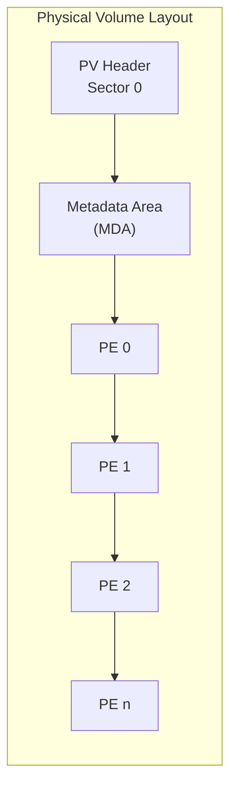
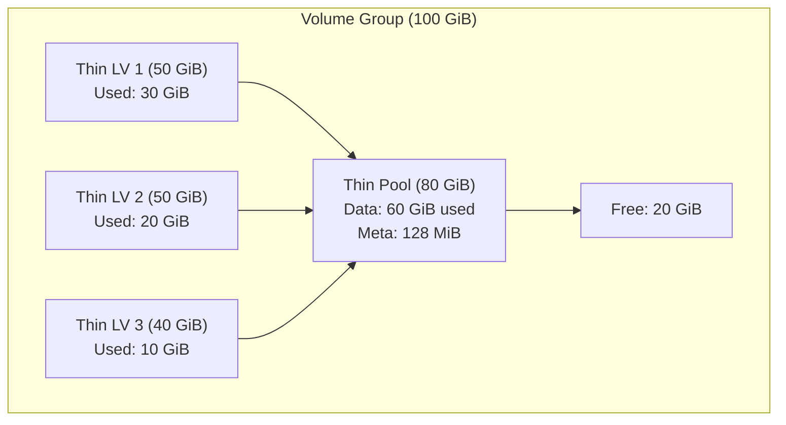
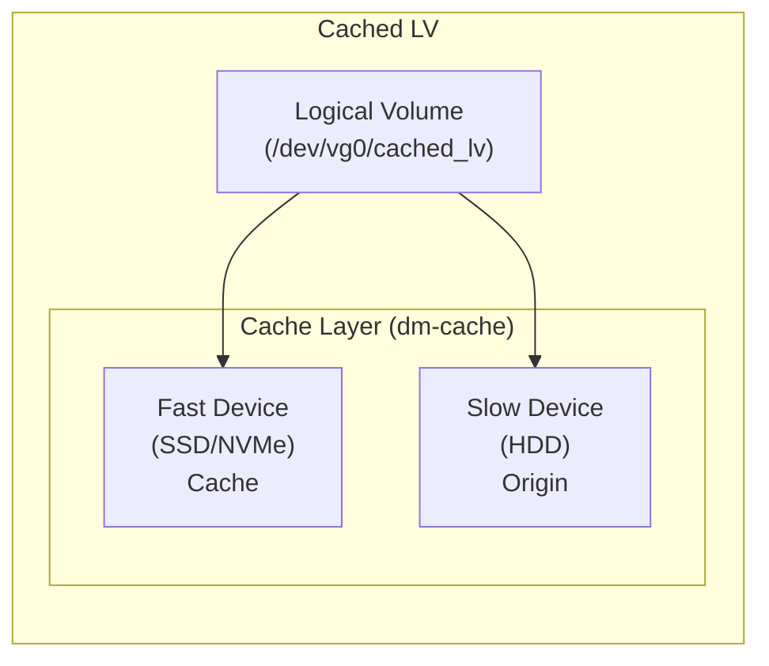
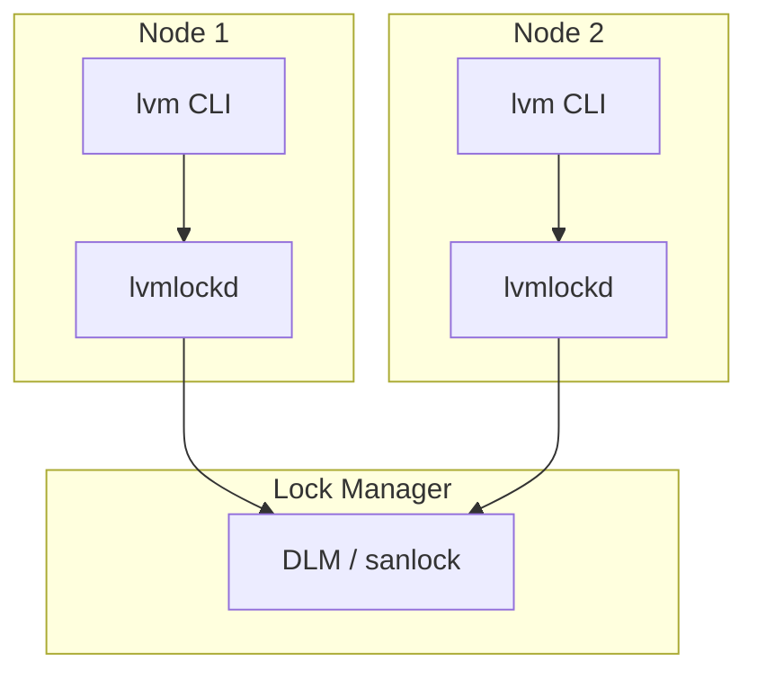

# LVM Deep Dive

## Introduction

The Logical Volume Manager (LVM) is the most widely used volume management framework in Linux. It provides a layer of abstraction between physical storage devices and the filesystem, enabling flexible disk management: resizing volumes on the fly, creating snapshots, striping across multiple disks, and more.

This chapter covers LVM internals: how Physical Volumes (PVs), Volume Groups (VGs), and Logical Volumes (LVs) work under the hood, LVM metadata, thin provisioning, caching, and distributed locking with `lvmlockd`.

## LVM Architecture

```mermaid
graph TD
    subgraph "Logical View"
        FS[Filesystem (ext4/XFS)]
        LV1["/dev/vg0/lv_root"]
        LV2["/dev/vg0/lv_data"]
    end
    subgraph "Volume Group (vg0)"
        VG[VG Metadata + Free Space Pool]
    end
    subgraph "Physical Volumes"
        PV1["/dev/sda2 (PV)"]
        PV2["/dev/sdb1 (PV)"]
        PV3["/dev/nvme0n1p1 (PV)"]
    end

    FS --> LV1
    FS --> LV2
    LV1 --> VG
    LV2 --> VG
    VG --> PV1
    VG --> PV2
    VG --> PV3
```

## Physical Volumes (PV)

A Physical Volume (PV) is a block device or partition that LVM uses for storage. LVM writes metadata to the beginning of the PV and divides the rest into **physical extents** (PEs).

### Creating a PV

```bash
# Create a physical volume
pvcreate /dev/sdb1
#  Physical volume "/dev/sdb1" successfully created.

# View PV details
pvdisplay /dev/sdb1
#  --- Physical volume ---
#  PV Name               /dev/sdb1
#  VG Name               myvg
#  PV Size               100.00 GiB / not usable 4.00 MiB
#  Allocatable           yes
#  PE Size               4.00 MiB
#  Total PE              25599
#  Free PE               12799
#  Allocated PE          12800
#  PV UUID               ABCD-1234-EFGH-5678-IJKL-9012

# PV summary
pvs
#  PV         VG   Fmt  Attr PSize    PFree
#  /dev/sda2  vg0  lvm2 a--  465.25g  100.00g
#  /dev/sdb1  vg0  lvm2 a--  100.00g   50.00g
```

### PV Header and Metadata Area

Every PV has a header at the start of the device:



The PV header contains:
- A UUID uniquely identifying the PV
- Device size
- Locations of metadata areas
- List of all PVs in the VG (in older formats)

```bash
# Dump PV header
pvck --dump /dev/sdb1
# Found label on /dev/sdb1 at sector 1
#  PV UUID: ABCD-1234-EFGH-5678-IJKL-9012
#  PV size: 107374182400 bytes (100.00 GiB)
#  Metadata area: start=4096 size=1048576

# Backup PV metadata
vgcfgbackup myvg
#  Volume group "myvg" successfully backed up.
# Backup stored in /etc/lvm/backup/myvg
```

## Volume Groups (VG)

A Volume Group (VG) aggregates one or more PVs into a single storage pool. The VG manages the allocation of **physical extents** (PEs) to **logical extents** (LEs) of logical volumes.

### VG Operations

```bash
# Create a VG
vgcreate myvg /dev/sdb1 /dev/sdc1
#  Volume group "myvg" successfully created

# Extend a VG (add a new PV)
vgextend myvg /dev/sdd1
#  Volume group "myvg" successfully extended

# Reduce a VG (remove a PV - must be empty first)
pvmove /dev/sdd1          # Move data off the PV
vgreduce myvg /dev/sdd1   # Remove PV from VG

# Display VG details
vgdisplay myvg
#  --- Volume group ---
#  VG Name               myvg
#  System ID
#  Format                lvm2
#  Metadata Areas        2
#  Metadata Sequence No  5
#  VG Access             read/write
#  VG Status             resizable
#  MAX LV                0
#  Cur LV                2
#  Open LV               2
#  Max PV                0
#  Cur PV                2
#  Act PV                2
#  VG Size               199.99 GiB
#  PE Size               4.00 MiB
#  Total PE              51198
#  Alloc PE / Size       38400 / 150.00 GiB
#  Free  PE / Size       12798 / 49.99 GiB
#  VG UUID               1234ABCD-5678-EFGH-9012-IJKL34567890
```

### Physical Extent (PE) Allocation

LVM divides PVs into fixed-size chunks called Physical Extents (PEs). The default PE size is 4 MiB.

```bash
# Set PE size during VG creation (must be power of 2, 8KiB to 16GiB)
vgcreate -s 8m myvg /dev/sdb1
#  Volume group "myvg" successfully created

# Maximum VG size depends on PE size:
# PE=4MiB → max ~256 TiB per VG (with 32-bit LE count)
# PE=8MiB → max ~512 TiB
# PE=16MiB → max ~1 PiB
```

## Logical Volumes (LV)

A Logical Volume (LV) is the virtual block device that applications and filesystems see. LVs are composed of Logical Extents (LEs), which are mapped to PEs on the underlying PVs.

### Basic LV Operations

```bash
# Create a logical volume
lvcreate -L 50G -n lv_data myvg
#  Logical volume "lv_data" created.

# Create with specific number of extents
lvcreate -l 100%FREE -n lv_data myvg
#  Logical volume "lv_data" created.

# Resize an LV (online, with filesystem resize)
lvextend -L +10G /dev/myvg/lv_data
resize2fs /dev/myvg/lv_data  # For ext4
# Or for XFS:
xfs_growfs /dev/myvg/lv_data

# Reduce an LV (must unmount and shrink filesystem first)
umount /dev/myvg/lv_data
e2fsck -f /dev/myvg/lv_data
resize2fs /dev/myvg/lv_data 30G
lvreduce -L 30G /dev/myvg/lv_data

# Display LV
lvdisplay /dev/myvg/lv_data
#  --- Logical volume ---
#  LV Path                /dev/myvg/lv_data
#  LV Name                lv_data
#  VG Name                myvg
#  LV UUID                1234-5678-ABCD-EFGH-IJKL-9012-MNOP
#  LV Write Access        read/write
#  LV Creation host, time server1, 2026-07-21 10:00:00 +0800
#  LV Status              available
#  # open                 1
#  LV Size                50.00 GiB
#  Current LE             12800
#  Segments               1
#  Allocation             inherit
#  Read ahead sectors     auto
#  - currently set to     256
#  Block device           253:0
```

### LV Segment Types

LVM supports multiple segment types for different purposes:

```bash
# Linear (default) - contiguous or fragmented allocation
lvcreate -L 50G -n lv_linear myvg

# Striped - data spread across PVs for performance
lvcreate -L 50G -n lv_striped -i 2 -I 256k myvg
# -i 2 = 2 stripes
# -I 256k = stripe size

# RAID1 - mirrored
lvcreate -L 50G -n lv_mirror --type raid1 -m 1 myvg

# RAID5
lvcreate -L 100G -n lv_raid5 --type raid5 -i 3 myvg

# RAID6
lvcreate -L 100G -n lv_raid6 --type raid6 -i 4 myvg

# View segment details
lvs -o +segtype,stripes,stripe_size
#  LV        VG   Attr       LSize   Pool Origin Data%  Type    #Str Stripe
#  lv_linear myvg -wi-a----- 50.00g                              linear    1     0
#  lv_striped myvg -wi-a----- 50.00g                              striped   2   256k
#  lv_mirror myvg rwi-a-r--  50.00g                              raid1     2     0
```

## LVM Metadata

LVM stores metadata in two locations on each PV for redundancy:

### Metadata Area (MDA)

```bash
# View metadata locations
pvdisplay -m /dev/sdb1
#  --- Physical volume ---
#  PV Name               /dev/sdb1
#  VG Name               myvg
#  ...
#  --- Physical Segments ---
#  Physical extent 0 to 12799:
#    Logical volume  /dev/myvg/lv_data
#    Logical extents 0 to 12799

# Metadata is stored as ASCII text
# Location: /etc/lvm/backup/ (automatic backups)
# Location: /etc/lvm/archive/ (archived on change)
cat /etc/lvm/backup/myvg
# # Generated by LVM2 version 2.03.16(2) (2026-07-21):
# # ...
# myvg {
#     id = "1234ABCD-5678-EFGH-9012-IJKL34567890"
#     seqno = 5
#     format = "lvm2"
#     status = ["RESIZEABLE", "READ", "WRITE"]
#     flags = []
#     extent_size = 8192       # 4 Megabytes
#     max_lv = 0
#     max_pv = 0
#     metadata_copies = 0
#
#     physical_volumes {
#         pv0 {
#             id = "ABCD-1234-EFGH-5678-IJKL-9012"
#             device = "/dev/sdb1"
#             status = ["ALLOCATABLE"]
#             flags = []
#             dev_size = 209715200  # 100 Gigabytes
#             pe_start = 2048
#             pe_count = 25599
#         }
#     }
#
#     logical_volumes {
#         lv_data {
#             id = "1234-5678-ABCD-EFGH-IJKL-9012-MNOP"
#             status = ["READ", "WRITE", "VISIBLE"]
#             flags = []
#             creation_time = 1658374800
#             creation_host = "server1"
#             segment_count = 1
#
#             segment1 {
#                 start_extent = 0
#                 extent_count = 12800  # 50 Gigabytes
#                 type = "linear"
#                 stripe_count = 1
#
#                 stripes = [
#                     "pv0", 0
#                 ]
#             }
#         }
#     }
# }
```

### Metadata Backup and Restore

```bash
# Manual backup
vgcfgbackup myvg

# Restore metadata (CAUTION: overwrites current metadata)
vgcfgrestore myvg

# Restore to a specific PV
vgcfgrestore -f /etc/lvm/backup/myvg myvg

# Check metadata consistency
vgck myvg
```

## Thin Provisioning

Thin provisioning allows you to overallocate storage—create LVs that are larger than the available physical space. Space is allocated on demand from a **thin pool**.



### Thin Provisioning Commands

```bash
# Create a thin pool
lvcreate -L 80G --thinpool thin_pool myvg
#  Logical volume "thin_pool" created.

# Create thin LVs (can exceed pool size!)
lvcreate -V 50G --thin -n thin_lv1 myvg/thin_pool
lvcreate -V 50G --thin -n thin_lv2 myvg/thin_pool
lvcreate -V 40G --thin -n thin_lv3 myvg/thin_pool
# Total allocated: 140 GiB, but pool is only 80 GiB!

# Check usage
lvs myvg/thin_pool
#  LV        VG   Attr       LSize  Pool   Data%  Meta%
#  thin_pool myvg twi-aotz-- 80.00g               75.00  25.00

lvs myvg
#  LV        VG   Attr       LSize  Pool       Origin Data%
#  thin_lv1  myvg Vwi-a-tz-- 50.00g thin_pool         60.00
#  thin_lv2  myvg Vwi-a-tz-- 50.00g thin_pool         40.00
#  thin_lv3  myvg Vwi-a-tz-- 40.00g thin_pool         25.00

# Monitor thin pool - ALERT when data or meta > 80%!
lvs -o +data_percent,metadata_percent myvg/thin_pool
```

### Thin Provisioning Snapshots

Snapshots of thin LVs are very efficient—they share unchanged data with the origin:

```bash
# Create a thin snapshot (nearly instant, no space used initially)
lvcreate -s --name thin_snap1 myvg/thin_lv1

# Snapshot grows as data diverges from origin
lvs myvg/thin_snap1
#  LV          VG   Attr       LSize  Pool       Origin    Data%
#  thin_snap1  myvg Vwi---tz-k 50.00g thin_pool  thin_lv1  0.00

# Activate and use the snapshot
lvchange -ay myvg/thin_snap1
mount /dev/myvg/thin_snap1 /mnt/snapshot
```

## LVM Caching (dm-cache)

LVM caching uses a fast device (SSD/NVMe) as a cache tier for a slower device (HDD):



### Cache Commands

```bash
# Create a cached LV
# 1. Create the origin LV on HDD
lvcreate -L 500G -n lv_slow myvg /dev/sdb1

# 2. Create cache pool on SSD
lvcreate -L 50G -n cache_pool_data myvg /dev/nvme0n1p1
lvcreate -L 1G -n cache_pool_meta myvg /dev/nvme0n1p1

# 3. Convert to cache pool
lvconvert --type cache-pool --poolmetadata myvg/cache_pool_meta myvg/cache_pool_data

# 4. Attach cache to origin
lvconvert --type cache --cachepool myvg/cache_pool_data myvg/lv_slow

# The result
lvs -o +cache_policy,cache_mode,cache_settings myvg/lv_slow
#  LV       VG   Attr       LSize   Pool          Data%  cache_policy cache_mode
#  lv_slow  myvg Cwi-a-C--- 500.00g cache_pool_data 15.00 smq          writethrough

# Cache modes:
# writethrough - writes go to both cache and origin (safe)
# writeback    - writes go to cache only (faster, risk of data loss on cache failure)

lvchange --cachemode writeback myvg/lv_slow
```

## Snapshot Volumes

Traditional (non-thin) LVM snapshots use a **copy-on-write** mechanism:

```bash
# Create a snapshot (must have enough free space in VG)
lvcreate -L 10G -s -n lv_data_snap /dev/myvg/lv_data
#  Logical volume "lv_data_snap" created.

# Mount the snapshot
mount -o ro /dev/myvg/lv_data_snap /mnt/snapshot

# Check snapshot usage
lvs myvg/lv_data_snap
#  LV           VG   Attr       LSize  Pool Origin Data%
#  lv_data_snap myvg swi-a-s--- 10.00g      lv_data 25.00

# Merge snapshot back (restores origin to snapshot state)
umount /mnt/snapshot
lvconvert --merge myvg/lv_data_snap
#  Merging of snapshot myvg/lv_data_snap will occur on next activation of myvg/lv_data.
```

## lvmlockd: Distributed Locking

In clustered environments (e.g., shared SAN storage accessed by multiple nodes), `lvmlockd` provides distributed locking for LVM:



### Setting Up lvmlockd

```bash
# Install lvmlockd and dlm
apt install lvm2-lockd dlm  # Debian/Ubuntu
yum install lvm2-lockd dlm  # RHEL/CentOS

# Enable and start lvmlockd
systemctl enable lvmlockd
systemctl start lvmlockd

# Create a shared VG (requires a lock manager)
vgcreate --shared mysharedvg /dev/sdb1

# Or convert existing VG to shared
vgchange --lock-type dlm myvg

# Activate LV on a specific node
vgchange --lock-start mysharedvg
lvchange -ay mysharedvg/lv_data

# Stop locking on a node
vgchange --lock-stop mysharedvg
```

### Lock Types

| Lock Type | Backend | Use Case |
|-----------|---------|----------|
| `none` | No locking | Single node |
| `dlm` | DLM (Distributed Lock Manager) | Clustered VGs |
| `sanlock` | sanlock | Simpler setups, SAN-based |

## LVM Configuration

```bash
# Main config file
cat /etc/lvm/lvm.conf
# Key settings:

# Global settings
global {
    umask = 077
    use_lvmetad = 1        # Use lvmetad for caching
    use_lvmpolld = 1
    # ...
}

# Device filter (which devices to scan)
devices {
    filter = ["a|sd.*|", "a|nvme.*|", "r|.*|"]
    # Accept sd* and nvme*, reject everything else
}

# Thin pool auto-extend
activation {
    thin_pool_autoextend_threshold = 80   # Extend at 80% usage
    thin_pool_autoextend_percent = 20     # Extend by 20%
}

# Snapshot auto-extend
activation {
    snapshot_autoextend_threshold = 80
    snapshot_autoextend_percent = 20
}
```

### lvm.conf Device Filter Examples

```bash
# Only use /dev/sda and /dev/sdb
filter = ["a|/dev/sd[ab]|", "r|.*|"]

# Exclude loop devices
filter = ["a|.*|", "r|/dev/loop.*|"]

# Only NVMe devices
filter = ["a|/dev/nvme.*|", "r|.*|"]
```

## LVM Event Monitoring

```bash
# Monitor LVM events
dmeventd -f &

# Set up monitoring for thin pool
lvchange --monitor y myvg/thin_pool

# View monitoring status
lvs -o +monitor myvg
```

## Common LVM Recipes

### Move LV Between PVs

```bash
# Move data from one PV to another (online!)
pvmove /dev/sdb1 /dev/sdd1

# Move specific LV's extents
pvmove /dev/sdb1:0-12799 /dev/sdd1
```

### Rename LV

```bash
lvrename myvg lv_old lv_new
```

### Remove LV

```bash
umount /dev/myvg/lv_data
lvremove myvg/lv_data
```

## References

- [LVM2 Source Code](https://sourceware.org/lvm2/)
- [Red Hat LVM Documentation](https://access.redhat.com/documentation/en-us/red_hat_enterprise_linux/9/html/configuring_and_managing_logical_volumes/)
- [LVM HOWTO](https://tldp.org/HOWTO/LVM-HOWTO/)
- [dm-cache Documentation](https://www.kernel.org/doc/html/latest/admin-guide/device-mapper/cache.html)

## Further Reading

- [The Linux Kernel Documentation](https://docs.kernel.org/)
- [LWN.net - Linux and free software news](https://lwn.net/)
- [GNU Project Documentation](https://www.gnu.org/doc/doc.html)
- [GNU Manuals](https://www.gnu.org/manual/manual.html)
- [Free Software Directory](https://directory.fsf.org/wiki/Main_Page)
- [Planet GNU](https://planet.gnu.org/)
- [Free Software Books](https://www.gnu.org/doc/other-free-books.html)

- <https://sourceware.org/lvm2/wiki/> - LVM2 wiki
- <https://man7.org/linux/man-pages/man7/lvmcache.7.html> - lvmcache(7) man page
- <https://man7.org/linux/man-pages/man7/lvmautoactivation.7.html> - Auto-activation
- <https://access.redhat.com/articles/766133> - LVM thin provisioning best practices

## Related Topics

- [Storage Overview](overview.md)
- [RAID Explained](raid-explained.md)
- [Block I/O Layer](block-io.md)
- [Multipath I/O](multipath.md)
