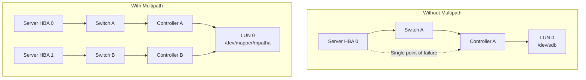
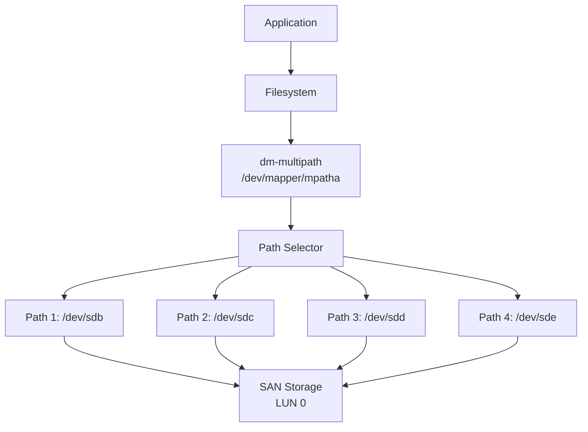
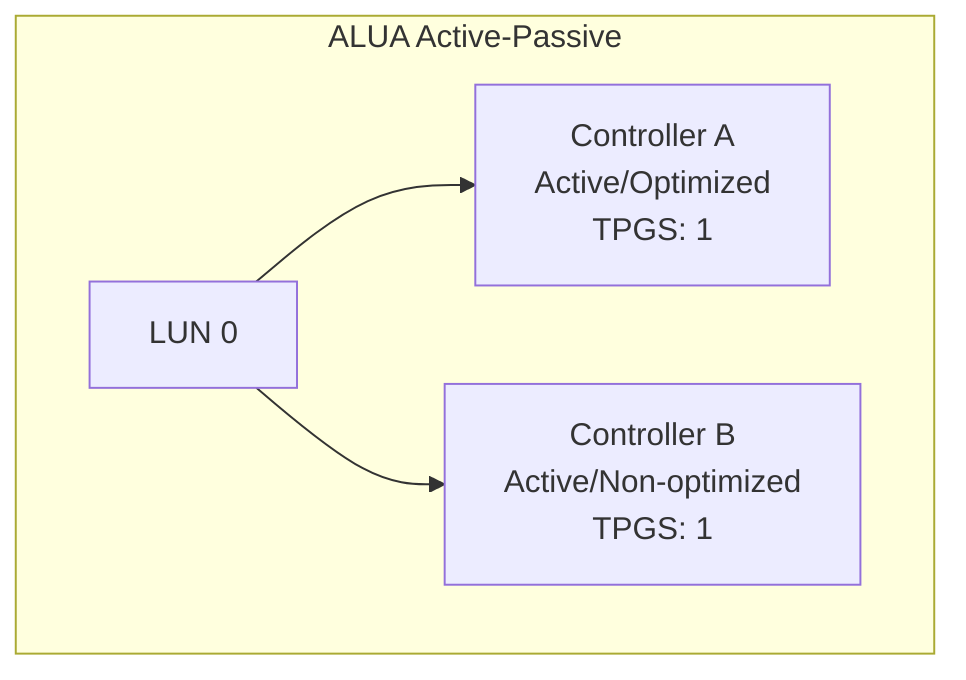
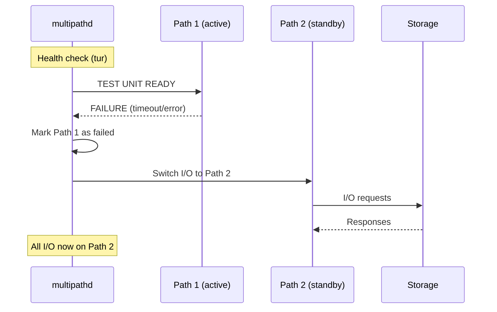
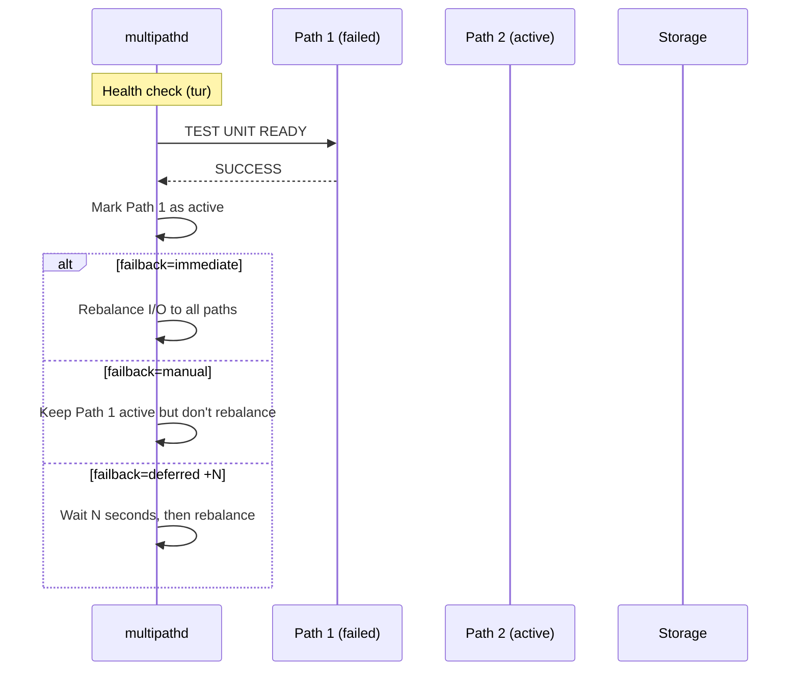

# Multipath I/O

## Introduction

Multipath I/O (MPIO) allows a server to access the same storage device through multiple physical paths—multiple HBAs, cables, switches, or controllers. This provides both **redundancy** (if one path fails, I/O continues through another) and **load balancing** (distributing I/O across paths for better performance).

Linux implements multipath through the **device-mapper multipath** (`dm-multipath`) subsystem. This is essential in enterprise SAN environments where a single LUN may be accessible through 4, 8, or even 16 paths.

## Why Multipath?



Without multipath, a single cable failure, HBA failure, or switch failure can sever access to storage. With multipath, the same LUN is visible through multiple `/dev/sd*` devices, all mapped to a single `/dev/mapper/mpath*` device.

## Device-Mapper Multipath Architecture



### How It Works

1. The storage array presents the same LUN through multiple target ports
2. The server sees multiple `/dev/sd*` devices (one per path)
3. `multipathd` identifies which devices are paths to the same LUN (using SCSI identifiers)
4. A device-mapper multipath device is created that wraps all paths
5. The filesystem uses the multipath device instead of individual paths

## Installation and Configuration

```bash
# Install multipath tools
apt install multipath-tools        # Debian/Ubuntu
yum install device-mapper-multipath  # RHEL/CentOS

# Load the dm-multipath module
modprobe dm-multipath

# Enable and start multipathd
systemctl enable multipathd
systemctl start multipathd
```

### Configuration File

The main configuration is `/etc/multipath.conf`:

```bash
cat /etc/multipath.conf
defaults {
    # Polling interval to check path health (seconds)
    polling_interval        30
    
    # Path selector algorithm
    path_grouping_policy    multibus
    
    # Path checker method
    path_checker            tur
    
    # Failback mode
    failback                immediate
    
    # User-friendly names (mpatha, mpathb, etc.)
    user_friendly_names     yes
    
    # Flush queue on path failure
    flush_on_last_del       yes
    
    # Maximum number of paths
    max_fds                 8192
    
    # Reservation key (for SCSI persistent reservations)
    reservation_key         0x12345678
}

# Blacklist devices that should NOT be multipathed
blacklist {
    wwid "SATA_Samsung_SSD_870_ABC123"
    devnode "^sd[a-c]$"    # Don't multipath sda, sdb, sdc
    device {
        vendor  "Dell"
        product "Virtual"
    }
}

# Whitelist exceptions (override blacklist)
blacklist_exceptions {
    wwid "3600508b4001234567890123456789012"
}

# Device-specific configurations
devices {
    device {
        vendor                  "NETAPP"
        product                 "LUN.*"
        path_grouping_policy    group_by_prio
        path_selector           "round-robin 0"
        path_checker            tur
        prio                    alua
        failback                immediate
        no_path_retry           queue
        rr_min_io               100
        rr_min_io_rq            1
    }
    
    device {
        vendor                  "PURE"
        product                 "FlashArray"
        path_grouping_policy    group_by_prio
        path_selector           "round-robin 0"
        path_checker            tur
        prio                    alua
        failback                immediate
    }
    
    device {
        vendor                  "IBM"
        product                 "2145"
        path_grouping_policy    group_by_prio
        path_selector           "round-robin 0"
        path_checker            tur
        prio                    alua
        failback                immediate
    }
}

# Multipath device configuration
multipaths {
    multipath {
        wwid        "3600508b4001234567890123456789012"
        alias       oracle_data
        path_grouping_policy    group_by_prio
        failback                immediate
        rr_min_io               100
    }
}
```

## Path Selectors

The path selector determines how I/O is distributed across paths:

### round-robin (Default)

```bash
# Round-robin: alternate between all active paths
path_selector "round-robin 0"
# The "0" means use the default number of I/Os before switching (1000 for reads)
```

### service-time

```bash
# Weighted by service time (faster paths get more I/O)
path_selector "service-time 0"
```

### queue-length

```bash
# Weighted by queue length (less busy paths get more I/O)
path_selector "queue-length 0"
```

## Path Priorities and ALUA

### ALUA (Asymmetric Logical Unit Access)

ALUA is a SCSI feature that allows storage controllers to report the preferred path to a LUN. In active-passive arrays, only one controller is "optimized" for a given LUN.



```bash
# Check ALUA state
multipathd show paths
# hcil    dev  dev_t  pri dm_st   chk_st  dev_st
# 0:0:0:1 sdb  8:16   1   active  ready   running
# 0:0:1:1 sdc  8:32   1   active  ready   running
# 1:0:0:1 sdd  8:48   0   active  ready   running
# 1:0:1:1 sde  8:64   0   active  ready   running

# ALUA priority groups:
# Group 0 (optimized) = preferred paths
# Group 1 (non-optimized) = alternate paths

# Configure ALUA priority in multipath.conf
devices {
    device {
        vendor  "NETAPP"
        product "LUN.*"
        prio    alua
    }
}
```

## Failover and Failback

### Failover: Path Failure Detection



### Failback: Path Recovery



### No Path Retry

```bash
# What to do when all paths fail
# queue: queue I/O until a path returns (dangerous for hung apps)
# fail: fail I/O immediately
# N: retry N times, then fail

no_path_retry queue   # Queue until path returns
no_path_retry 5       # Retry 5 times
no_path_retry fail    # Immediate failure
```

## Multipath Commands

### View Multipath Status

```bash
# Show all multipath devices
multipath -ll
# mpatha (3600508b4001234567890123456789012) dm-0 NETAPP,LUN C-Mode
# size=500G features='4 queue_if_no_path' hwhandler='1 alua' wp=rw
# |-+- policy='round-robin 0' prio=50 status=active
# | |- 0:0:0:1 sdb 8:16  active ready running
# | `- 0:0:1:1 sdc 8:32  active ready running
# `-+- policy='round-robin 0' prio=10 status=enabled
#   |- 1:0:0:1 sdd 8:48  active ready running
#   `- 1:0:1:1 sde 8:64  active ready running

# Show multipath topology
multipathd show topology
# mpatha (3600508b4001234567890123456789012) dm-0 NETAPP,LUN C-Mode
# [size=500G][features=4 queue_if_no_path][hwhandler=1 alua][n=0]
# |-+- policy=round-robin 0 [prio=50][status=active]
# | |- 0:0:0:1 sdb 8:16  [active][ready]
# | `- 0:0:1:1 sdc 8:32  [active][ready]
# `-+- policy=round-robin 0 [prio=10][status=enabled]
#   |- 1:0:0:1 sdd 8:48  [active][ready]
#   `- 1:0:1:1 sde 8:64  [active][ready]
```

### Interactive multipathd Console

```bash
# Enter multipathd console
multipathd -k
# multipathd> show maps
# name   sysfs   uuid
# mpatha dm-0    3600508b4001234567890123456789012
#
# multipathd> show paths
# hcil    dev  dev_t  pri dm_st   chk_st  dev_st
# 0:0:0:1 sdb  8:16   50  active  ready   running
# 0:0:1:1 sdc  8:32   50  active  ready   running
# 1:0:0:1 sdd  8:48   10  active  ready   running
# 1:0:1:1 sde  8:64   10  active  ready   running
#
# multipathd> show map mpatha status
# mpatha: dm-0 NETAPP,LUN C-Mode
# size=500G features='4 queue_if_no_path' hwhandler='1 alua' wp=rw
#
# multipathd> fail path mpatha sdb
# ok
#
# multipathd> reinstate path mpatha sdb
# ok
#
# multipathd> resize map mpatha
# ok
#
# multipathd> quit
```

## Device Identification

Multipath identifies devices using SCSI identifiers:

```bash
# View SCSI identifiers
/lib/udev/scsi_id -g -u /dev/sdb
# 3600508b4001234567890123456789012

# Multipath uses the WWID (World Wide Identifier) to group paths
# The WWID comes from:
# 1. SCSI Unit Serial Number (VPD page 0x80)
# 2. SCSI Device Identification (VPD page 0x83)
# 3. ATA serial number (for SATA devices via libata)
```

## Multipath with LVM

Multipath and LVM work together seamlessly:

```bash
# After creating multipath devices, create PVs on them
pvcreate /dev/mapper/mpatha

# Create VG
vgcreate myvg /dev/mapper/mpatha /dev/mapper/mpathb

# Create LV
lvcreate -L 100G -n lv_data myvg

# Mount
mkfs.xfs /dev/myvg/lv_data
mount /dev/myvg/lv_data /data
```

### LVM Configuration for Multipath

```bash
# In /etc/lvm/lvm.conf, filter out individual paths
devices {
    filter = ["a|/dev/mapper/.*|", "r|/dev/sd.*|", "r|.*|"]
    # Accept only dm-multipath devices, reject raw sd* devices
}
```

## Performance Tuning

### Path Group Policy

```bash
# multibus: all paths in one group (load balanced)
path_grouping_policy multibus

# failover: one path active, others standby
path_grouping_policy failover

# group_by_prio: group paths by ALUA priority
path_grouping_policy group_by_prio

# group_by_node_name: group by SCSI node name
path_grouping_policy group_by_node_name

# group_by_serial: group by SCSI serial number
path_grouping_policy group_by_serial
```

### Round-Robin Tuning

```bash
# Minimum I/O count before switching path (for reads)
rr_min_io 1000

# Minimum I/O requests before switching (for newer kernels)
rr_min_io_rq 1

# Both control how many I/Os are sent down one path before
# switching to the next path in the round-robin group
```

## Troubleshooting

### Path Not Appearing

```bash
# Check if device is blacklisted
multipath -v3 2>&1 | grep -i blacklist
# Jul 21 10:00:00 | sdb: blacklisted (udev property match)

# Check SCSI identifiers
/lib/udev/scsi_id -g -u /dev/sdb
# Compare with multipath.conf blacklist/whitelist
```

### Stale Multipath Device

```bash
# Flush and remove stale multipath device
multipath -f mpatha

# If stuck, remove device-mapper table
dmsetup remove mpatha

# Force remove
dmsetup remove --force mpatha
```

### All Paths Down

```bash
# Check path status
multipathd show paths
# All paths show "faulty" or "ghost"

# Check physical connectivity
# Check switch status
# Check storage controller status
# Check for SCSI reservation conflicts

# Force path reinstatement
multipathd reinstate path mpatha sdb
```

## References

- [device-mapper multipath documentation](https://www.kernel.org/doc/html/latest/admin-guide/device-mapper/dm-mpath.html)
- [Red Hat DM Multipath Guide](https://access.redhat.com/documentation/en-us/red_hat_enterprise_linux/9/html/dm_multipath/)
- [multipath.conf(5) man page](https://man7.org/linux/man-pages/man5/multipath.conf.5.html)
- [SCSI ALUA specification](https://www.t10.org/drafts.htm)

## Further Reading

- [The Linux Kernel Documentation](https://docs.kernel.org/)
- [LWN.net - Linux and free software news](https://lwn.net/)
- [GNU Project Documentation](https://www.gnu.org/doc/doc.html)
- [GNU Manuals](https://www.gnu.org/manual/manual.html)
- [Free Software Directory](https://directory.fsf.org/wiki/Main_Page)
- [Planet GNU](https://planet.gnu.org/)
- [Free Software Books](https://www.gnu.org/doc/other-free-books.html)

- <https://christopherco.github.io/multipath-tools/> - multipath-tools documentation
- <https://access.redhat.com/articles/165953> - Multipath troubleshooting guide
- <https://www.snia.org/sites/default/files/SNIA_DMTF_DDC_Multipathing_WP.pdf> - Multipathing best practices

## Related Topics

- [Storage Overview](overview.md)
- [SCSI and NVMe](scsi-nvme.md)
- [Storage Area Networks](san.md)
- [LVM Deep Dive](lvm-deep-dive.md)
