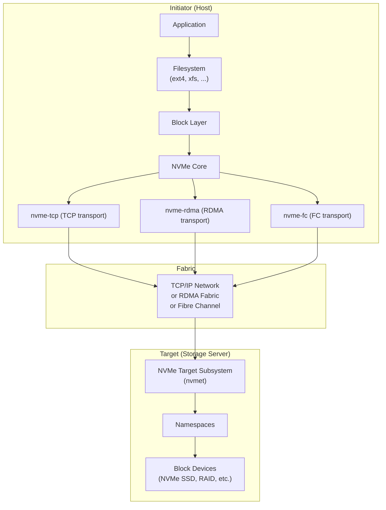
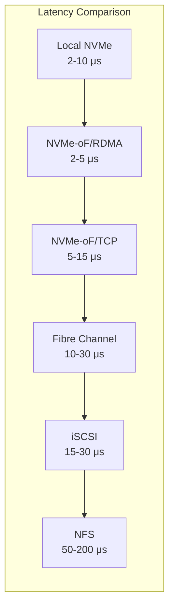
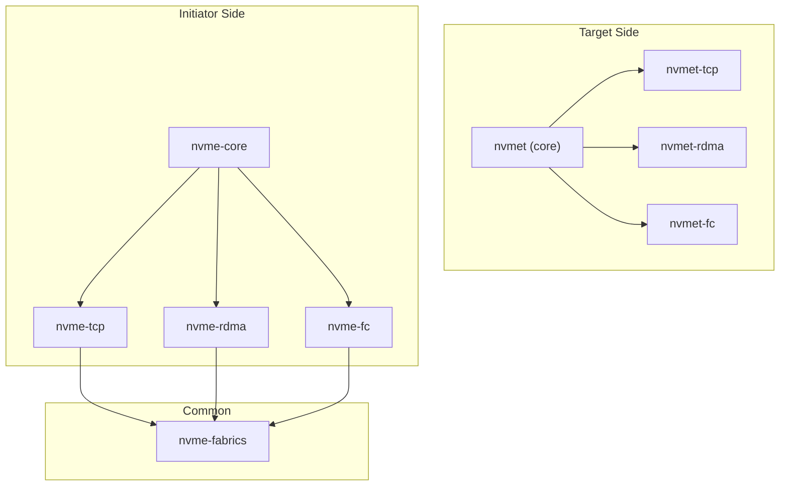

# NVMe over Fabrics (NVMe-oF)

## Introduction

NVMe over Fabrics (NVMe-oF) extends the NVMe protocol — originally designed for local PCIe-attached SSDs — across network fabrics such as TCP/IP, RDMA (RoCE/iWARP), InfiniBand, and Fibre Channel. Defined by the NVM Express specification (starting with revision 1.1 in 2016), NVMe-oF enables disaggregated storage architectures where NVMe namespaces can be exported to remote hosts with latencies approaching local NVMe performance.

The key motivation: traditional network storage protocols (iSCSI, NFS, SMB) add significant protocol overhead. NVMe-oF was designed from the ground up to minimize that overhead, leveraging the same streamlined command set as local NVMe but transported over a fabric.

**Key advantages over traditional protocols:**

- **Lower latency**: NVMe-oF/TCP adds ~5–10 μs vs ~15–30 μs for iSCSI; RDMA transport adds ~2–5 μs
- **Higher IOPS**: Millions of IOPS per host, leveraging NVMe's parallelism (64K queues × 64K commands each)
- **Lower CPU overhead**: Streamlined protocol processing, especially with RDMA
- **Scalability**: Supports thousands of namespaces and hundreds of hosts per target
- **Raw block access**: No filesystem overhead; hosts see raw NVMe devices

## Architecture Overview



### Key Concepts

| Term | Definition |
|------|-----------|
| **Subsystem** | An NVMe-oF export unit identified by an NQN (NVMe Qualified Name). Contains one or more namespaces. |
| **Namespace** | A block storage volume within a subsystem, backed by a local device (NVMe SSD, block device, etc.) |
| **NQN** | NVMe Qualified Name — unique identifier: `nqn.2014-08.org.nvmexpress:uuid:...` |
| **Controller** | A logical connection between an initiator and a subsystem. Each connection creates a controller. |
| **Admin Queue** | Queue pair for management commands (identify, create/delete I/O queues) |
| **I/O Queue** | Queue pairs for data transfer commands (read, write, flush, etc.) |

### Transport Types

| Transport | Kernel Module | Fabric | Typical Latency | Typical Bandwidth |
|-----------|:------------:|--------|:---------------:|:-----------------:|
| **TCP** | `nvme-tcp` | Standard Ethernet | 5–15 μs | 10–100 Gbps |
| **RDMA** | `nvme-rdma` | RoCE/iWARP/IB | 2–5 μs | 10–200 Gbps |
| **FC** | `nvme-fc` | Fibre Channel | 3–8 μs | 16–64 Gbps |
| **PCIe** | `nvme` | Local PCIe | 2–10 μs | 4–16 lanes |

## NVMe-oF vs iSCSI vs Fibre Channel



| Feature | NVMe-oF | iSCSI | Fibre Channel |
|---------|---------|-------|:------------:|
| Protocol overhead | Very low | Medium | Low |
| Hardware requirement | Standard NIC (TCP) | Standard NIC | FC HBA |
| Queue depth | 64K per queue | 1 per session | 2K typical |
| Multiple queues | 64K queues | Limited | Limited |
| CPU overhead | Low (RDMA) / Medium (TCP) | High | Medium |
| Cost | Low (TCP) / High (RDMA) | Low | High |

## Linux Kernel NVMe Target (nvmet)

The Linux kernel includes a built-in NVMe-oF target subsystem (`nvmet`) since kernel 4.8 (FC and RDMA transports) and 5.0 (TCP transport). Configuration is done through the configfs filesystem at `/sys/kernel/config/nvmet/`.

### Kernel Module Structure



### Configfs Layout

```
/sys/kernel/config/nvmet/
├── hosts/                          # Host ACLs (optional)
│   └── nqn.2014-08.org.nvmexpress:uuid:host-id/
├── ports/                          # Listener ports
│   └── 1/
│       ├── addr_adrfam             # ipv4, ipv6, fc, ib
│       ├── addr_traddr             # IP address or FC WWN
│       ├── addr_trsvcid            # Port number (e.g., 4420)
│       ├── addr_trtype             # tcp, rdma, fc
│       ├── ana_groups/             # Asymmetric Namespace Access
│       │   └── 1/
│       │       └── state           # optimized, non_optimized, inaccessible
│       ├── inline_data_size        # Max inline data (bytes)
│       └── subsystems/             # Linked subsystems
│           └── testnqn -> ../../../subsystems/testnqn
└── subsystems/                     # NVMe subsystems
    └── testnqn/
        ├── attr_allow_any_host     # 1 = allow all, 0 = host ACL
        ├── attr_serial             # Virtual serial number
        ├── attr_model              # Virtual model name
        ├── attr_version            # NVMe spec version
        ├── namespaces/
        │   └── 1/
        │       ├── device_path     # Backing device (e.g., /dev/nvme0n1)
        │       ├── enable          # 1 = enabled
        │       └── ana_group       # ANA group ID
        └── allowed_hosts/          # Host ACL entries (when attr_allow_any_host=0)
```

## Configuration: NVMe-oF Target

### Setting Up NVMe-oF over TCP Target

```bash
# Load required kernel modules
sudo modprobe nvmet
sudo modprobe nvmet-tcp

# Verify modules loaded
lsmod | grep nvmet
```

#### Method 1: Direct configfs Configuration

```bash
# Define variables
SUBSYSTEM_NQN="nqn.2024-01.com.example:storage.array0"
TARGET_IP="192.168.100.10"
PORT="4420"
DEVICE="/dev/nvme0n1"

# Create subsystem
sudo mkdir -p /sys/kernel/config/nvmet/subsystems/${SUBSYSTEM_NQN}

# Allow any host (or use host ACLs for security)
echo 1 | sudo tee /sys/kernel/config/nvmet/subsystems/${SUBSYSTEM_NQN}/attr_allow_any_host

# Create namespace (namespace ID = 1)
sudo mkdir -p /sys/kernel/config/nvmet/subsystems/${SUBSYSTEM_NQN}/namespaces/1

# Attach backing device
echo -n "${DEVICE}" | sudo tee /sys/kernel/config/nvmet/subsystems/${SUBSYSTEM_NQN}/namespaces/1/device_path

# Enable namespace
echo 1 | sudo tee /sys/kernel/config/nvmet/subsystems/${SUBSYSTEM_NQN}/namespaces/1/enable

# Configure port
sudo mkdir -p /sys/kernel/config/nvmet/ports/1
echo "${TARGET_IP}" | sudo tee /sys/kernel/config/nvmet/ports/1/addr_traddr
echo "tcp" | sudo tee /sys/kernel/config/nvmet/ports/1/addr_trtype
echo "${PORT}" | sudo tee /sys/kernel/config/nvmet/ports/1/addr_trsvcid
echo "ipv4" | sudo tee /sys/kernel/config/nvmet/ports/1/addr_adrfam

# Link subsystem to port (activates the target)
sudo ln -s /sys/kernel/config/nvmet/subsystems/${SUBSYSTEM_NQN} \
    /sys/kernel/config/nvmet/ports/1/subsystems/${SUBSYSTEM_NQN}

# Verify target is listening
dmesg | tail -5
# Should show: nvmet_tcp: enabling port 1 (192.168.100.10:4420)
```

#### Method 2: Using nvmetcli

```bash
# Install nvmetcli
# Debian/Ubuntu
sudo apt install nvmetcli
# Or from source
git clone git://git.infradead.org/users/hch/nvmetcli.git
cd nvmetcli && sudo python3 setup.py install

# Create JSON configuration file
cat > /tmp/nvmet-config.json << 'EOF'
{
  "hosts": [],
  "ports": [
    {
      "id": 1,
      "addr": {
        "adrfam": "ipv4",
        "traddr": "192.168.100.10",
        "treq": "not specified",
        "trsvcid": "4420",
        "trtype": "tcp"
      },
      "inline_data_size": 16384,
      "ana_groups": [
        {
          "groupid": 1,
          "state": "optimized"
        }
      ],
      "subsystems": [
        "nqn.2024-01.com.example:storage.array0"
      ]
    }
  ],
  "subsystems": [
    {
      "nqn": "nqn.2024-01.com.example:storage.array0",
      "attr": {
        "allow_any_host": true,
        "serial": "deadbeef0001",
        "model": "Linux NVMe Target"
      },
      "namespaces": [
        {
          "device": {
            "path": "/dev/nvme0n1",
            "uuid": "auto"
          },
          "enable": true,
          "nsid": 1
        }
      ]
    }
  ]
}
EOF

# Apply configuration
sudo nvmetcli restore /tmp/nvmet-config.json

# Interactive shell
sudo nvmetcli
/> ls
/> save /etc/nvmet/config.json    # Save current config

# Clear all configuration
sudo nvmetcli clear
```

### Setting Up NVMe-oF over RDMA Target

```bash
# Load modules
sudo modprobe nvmet
sudo modprobe nvmet-rdma

# Load RDMA modules (see RDMA chapter)
sudo modprobe mlx5_core mlx5_ib

# Same as TCP but use rdma transport type
SUBSYSTEM_NQN="nqn.2024-01.com.example:storage.rdma0"
TARGET_IP="192.168.200.10"

sudo mkdir -p /sys/kernel/config/nvmet/subsystems/${SUBSYSTEM_NQN}
echo 1 | sudo tee /sys/kernel/config/nvmet/subsystems/${SUBSYSTEM_NQN}/attr_allow_any_host
sudo mkdir -p /sys/kernel/config/nvmet/subsystems/${SUBSYSTEM_NQN}/namespaces/1
echo -n "/dev/nvme0n1" | sudo tee /sys/kernel/config/nvmet/subsystems/${SUBSYSTEM_NQN}/namespaces/1/device_path
echo 1 | sudo tee /sys/kernel/config/nvmet/subsystems/${SUBSYSTEM_NQN}/namespaces/1/enable

sudo mkdir -p /sys/kernel/config/nvmet/ports/1
echo "${TARGET_IP}" | sudo tee /sys/kernel/config/nvmet/ports/1/addr_traddr
echo "rdma" | sudo tee /sys/kernel/config/nvmet/ports/1/addr_trtype
echo "4420" | sudo tee /sys/kernel/config/nvmet/ports/1/addr_trsvcid
echo "ipv4" | sudo tee /sys/kernel/config/nvmet/ports/1/addr_adrfam

sudo ln -s /sys/kernel/config/nvmet/subsystems/${SUBSYSTEM_NQN} \
    /sys/kernel/config/nvmet/ports/1/subsystems/${SUBSYSTEM_NQN}
```

### Host ACL Configuration

```bash
# Disable allow_any_host
echo 0 | sudo tee /sys/kernel/config/nvmet/subsystems/${SUBSYSTEM_NQN}/attr_allow_any_host

# Add specific host NQN
HOST_NQN="nqn.2024-01.com.example:host:server01"
sudo mkdir -p /sys/kernel/config/nvmet/hosts/${HOST_NQN}
sudo mkdir -p /sys/kernel/config/nvmet/subsystems/${SUBSYSTEM_NQN}/allowed_hosts/
sudo ln -s /sys/kernel/config/nvmet/hosts/${HOST_NQN} \
    /sys/kernel/config/nvmet/subsystems/${SUBSYSTEM_NQN}/allowed_hosts/${HOST_NQN}
```

## Configuration: NVMe-oF Initiator (Host)

### Discovering Available Subsystems

```bash
# Install nvme-cli
sudo apt install nvme-cli    # Debian/Ubuntu
sudo dnf install nvme-cli    # RHEL/Fedora

# Load initiator modules
sudo modprobe nvme_tcp    # For TCP transport
sudo modprobe nvme_fabrics # Common fabric module

# Discover available subsystems on target
sudo nvme discover -t tcp -a 192.168.100.10 -s 4420

# Output:
# Discovery Log Entry 0 - Discovery subsystem
# Discovery Log Entry 1 - Storage subsystem
#   trtype: tcp
#   adrfam: ipv4
#   subtype: nvme subsystem
#   traddr: 192.168.100.10
#   trsvcid: 4420
#   subnqn: nqn.2024-01.com.example:storage.array0
```

### Connecting to a Subsystem

```bash
# Connect to specific subsystem
sudo nvme connect -t tcp \
    -n nqn.2024-01.com.example:storage.array0 \
    -a 192.168.100.10 \
    -s 4420

# List connected NVMe devices
sudo nvme list
# Node             SN                Model           Namespace Usage
# /dev/nvme1n1     deadbeef0001      Linux NVMe      1         100.00 GB

# Connect with options
sudo nvme connect -t tcp \
    -n nqn.2024-01.com.example:storage.array0 \
    -a 192.168.100.10 \
    -s 4420 \
    --nr-io-queues=16 \
    --ctrl-loss-tmo=300 \
    --reconnect-delay=10

# Auto-connect all discovered subsystems
sudo nvme connect-all -t tcp -a 192.168.100.10 -s 4420
```

### RDMA Initiator Connection

```bash
# Load RDMA initiator modules
sudo modprobe nvme-rdma
sudo modprobe nvme-fabrics

# Discover and connect over RDMA
sudo nvme discover -t rdma -a 192.168.200.10 -s 4420
sudo nvme connect -t rdma \
    -n nqn.2024-01.com.example:storage.rdma0 \
    -a 192.168.200.10 \
    -s 4420
```

### Persistent Connections (Auto-mount at Boot)

```bash
# /etc/nvme/hostnqn — host's unique NQN (auto-generated on install)
cat /etc/nvme/hostnqn
# nqn.2014-08.org.nvmexpress:uuid:12345678-1234-1234-1234-123456789abc

# /etc/nvme/discovery.conf — auto-discovery configuration
echo "-t tcp -a 192.168.100.10 -s 4420" | sudo tee /etc/nvme/discovery.conf

# Enable the systemd discovery service
sudo systemctl enable nvme-discover
sudo systemctl start nvme-discover

# Or use /etc/fstab for persistent mount
# First, find the device path
sudo nvme list
# Add to /etc/fstab:
# /dev/nvme1n1  /mnt/nvmeof  xfs  defaults,_netdev  0 0

# Disconnect
sudo nvme disconnect -n nqn.2024-01.com.example:storage.array0
sudo nvme disconnect-all   # Disconnect all remote subsystems
```

## SPDK NVMe-oF Target (Userspace)

SPDK (Storage Performance Development Kit) provides a high-performance userspace NVMe-oF target that bypasses the kernel entirely:

```bash
# Install SPDK
git clone https://github.com/spdk/spdk --recursive
cd spdk
sudo scripts/pkgdep.sh
./configure --with-rdma
make -j$(nproc)

# Start SPDK NVMe-oF target
sudo build/bin/nvmf_tgt

# Configure via JSON-RPC (from another terminal)
# Create RDMA transport
scripts/rpc.py nvmf_create_transport -t RDMA -u 8192 -i 131072 -c 8192

# Create a subsystem
scripts/rpc.py nvmf_create_subsystem nqn.2024-01.com.example:spdk0 \
    -a -s SPDK00000000000001 -d SPDK_Controller1

# Add a namespace (using an NVMe bdev)
scripts/rpc.py bdev_nvme_attach_controller -b Nvme0 -t PCIe -a 0000:03:00.0
scripts/rpc.py nvmf_subsystem_add_ns nqn.2024-01.com.example:spdk0 Nvme0n1

# Add an RDMA listener
scripts/rpc.py nvmf_subsystem_add_listener nqn.2024-01.com.example:spdk0 \
    -t rdma -a 192.168.100.10 -s 4420

# Add a TCP listener (alternative)
scripts/rpc.py nvmf_subsystem_add_listener nqn.2024-01.com.example:spdk0 \
    -t tcp -a 192.168.100.10 -s 4420
```

### Kernel vs SPDK Target

| Feature | Kernel (nvmet) | SPDK |
|---------|:-------------:|:----:|
| Runs in | Kernel space | User space |
| Configuration | configfs / nvmetcli | JSON-RPC |
| CPU overhead | Moderate | Very low |
| Polling mode | Interrupt-driven | Configurable (polling) |
| Ease of use | Simple | Complex |
| Features | Full NVMe-oF spec | Extended features |
| Maturity | Production since ~2018 | Production since ~2019 |

## Performance Tuning

### Target-Side Tuning

```bash
# Increase inline data size (reduces round trips)
echo 16384 | sudo tee /sys/kernel/config/nvmet/ports/1/inline_data_size

# For kernel target, increase queue depth via module parameters
echo "options nvmet nr_poll_queues=8" | sudo tee /etc/modprobe.d/nvmet.conf

# CPU affinity for target threads
# Pin nvmet threads to specific CPUs
taskset -c 0-3 nvmf_tgt   # SPDK example

# NUMA-aware memory allocation
numactl --cpunodebind=0 --membind=0 nvmf_tgt
```

### Initiator-Side Tuning

```bash
# Increase I/O queue count and depth
sudo nvme connect -t tcp -n <NQN> -a <IP> -s 4420 \
    --nr-io-queues=$(nproc) \
    --queue-size=1024

# Set I/O scheduler for remote NVMe
echo none | sudo tee /sys/block/nvme1n1/queue/scheduler

# Increase read-ahead for sequential workloads
echo 2048 | sudo tee /sys/block/nvme1n1/queue/read_ahead_kb

# Set nr_requests for higher concurrency
echo 1024 | sudo tee /sys/block/nvme1n1/queue/nr_requests
```

### TCP-Specific Tuning

```bash
# Increase TCP buffer sizes
echo "net.core.rmem_max = 16777216" | sudo tee -a /etc/sysctl.d/nvme-tcp.conf
echo "net.core.wmem_max = 16777216" | sudo tee -a /etc/sysctl.d/nvme-tcp.conf
echo "net.ipv4.tcp_rmem = 4096 87380 16777216" | sudo tee -a /etc/sysctl.d/nvme-tcp.conf
echo "net.ipv4.tcp_wmem = 4096 65536 16777216" | sudo tee -a /etc/sysctl.d/nvme-tcp.conf
echo "net.ipv4.tcp_window_scaling = 1" | sudo tee -a /etc/sysctl.d/nvme-tcp.conf
sudo sysctl -p /etc/sysctl.d/nvme-tcp.conf

# Enable TCP timestamps and selective ACK
echo "net.ipv4.tcp_timestamps = 1" | sudo tee -a /etc/sysctl.d/nvme-tcp.conf
echo "net.ipv4.tcp_sack = 1" | sudo tee -a /etc/sysctl.d/nvme-tcp.conf

# Use Jumbo Frames (if supported by network)
sudo ip link set enp1s0f0 mtu 9000
```

## Monitoring and Debugging

```bash
# View connected NVMe-oF controllers
sudo nvme list-subsys
# nvme-subsys1 - NQN=nqn.2024-01.com.example:storage.array0
#  +- nvme1 tcp traddr=192.168.100.10 trsvcid=4420 live

# Controller details
sudo nvme id-ctrl /dev/nvme1
sudo nvme show-regs /dev/nvme1

# Monitor I/O statistics
sudo nvme smart-log /dev/nvme1
cat /proc/partitions | grep nvme1
iostat -x 1 /dev/nvme1

# Check kernel NVMe target stats
ls /sys/kernel/config/nvmet/subsystems/
dmesg | grep -i nvmet

# RDMA-specific monitoring
rdma link show
cat /sys/class/infiniband/mlx5_0/ports/1/counters/port_rcv_data

# Use nvme-cli to check ANA (Asymmetric Namespace Access) state
sudo nvme get-feature /dev/nvme1 -f 0x1c    # ANA feature
```

## Troubleshooting

### Common Issues

**Connection refused / target not found:**
```bash
# Check target is listening
ss -tlnp | grep 4420
# Or for RDMA:
rdma_res show

# Check firewall
sudo iptables -L -n | grep 4420
sudo ufw allow 4420/tcp

# Verify subsystem is linked to port
ls -la /sys/kernel/config/nvmet/ports/1/subsystems/
```

**Namespace not visible on initiator:**
```bash
# Verify namespace is enabled
cat /sys/kernel/config/nvmet/subsystems/<NQN>/namespaces/1/enable
# Should be "1"

# Check device_path is correct
cat /sys/kernel/config/nvmet/subsystems/<NQN>/namespaces/1/device_path

# Verify on target: lsblk shows backing device
```

**Connection drops / reconnects:**
```bash
# Check for transport errors
dmesg | grep -i "nvme.*error\|nvmet.*error"

# Increase controller loss timeout
sudo nvme connect -t tcp -n <NQN> -a <IP> -s 4420 \
    --ctrl-loss-tmo=600 \
    --reconnect-delay=10

# Check network path
ping -c 10 <target_ip>
```

**Poor performance:**
```bash
# Check CPU usage — single CPU at 100% indicates bottleneck
top -H

# Verify I/O scheduler
cat /sys/block/nvme1n1/queue/scheduler
# Should be "none" or "mq-deadline"

# Check for queue depth saturation
cat /sys/block/nvme1n1/inflight

# For TCP: check network drops
ethtool -S enp1s0f0 | grep -i drop
```

**Removing a target cleanly:**
```bash
# Disconnect all initiators first, then:
# Unlink subsystem from port
sudo rm /sys/kernel/config/nvmet/ports/1/subsystems/<NQN>

# Disable namespace
echo 0 | sudo tee /sys/kernel/config/nvmet/subsystems/<NQN>/namespaces/1/enable

# Remove namespace
sudo rmdir /sys/kernel/config/nvmet/subsystems/<NQN>/namespaces/1

# Remove port and subsystem
sudo rmdir /sys/kernel/config/nvmet/ports/1
sudo rmdir /sys/kernel/config/nvmet/subsystems/<NQN>
```

## Multi-Path Configuration

```bash
# Configure ANA (Asymmetric Namespace Access) for multipath
# On target: configure different ports in different ANA groups
echo 1 | sudo tee /sys/kernel/config/nvmet/subsystems/<NQN>/namespaces/1/ana_group
echo 2 | sudo tee /sys/kernel/config/nvmet/subsystems/<NQN>/namespaces/2/ana_group

# On initiator: connect via multiple paths
sudo nvme connect -t tcp -n <NQN> -a 192.168.100.10 -s 4420
sudo nvme connect -t tcp -n <NQN> -a 192.168.100.11 -s 4420

# Check multipath configuration
sudo nvme list-subsys
# nvme-subsys1 - NQN=nqn.2024-01.com.example:storage.array0
#  +- nvme1 tcp traddr=192.168.100.10 trsvcid=4420 live optimized
#  +- nvme2 tcp traddr=192.168.100.11 trsvcid=4420 live optimized

# Configure multipath policy (kernel 5.15+)
echo "round-robin" | sudo tee /sys/block/nvme1n1/queue/multipath_policy
# Options: round-robin, service-time, numa
```

## NVMe-oF TLS Security

Starting with Linux kernel 6.x, NVMe-oF supports TLS encryption for TCP transport:

```bash
# Generate TLS key (on target)
nvme gen-tls-key --hostnqn nqn.2024-01.com.example:host0 \
    --subnqn nqn.2024-01.com.example:storage.array0 \
    --keytype psk

# Configure TLS on initiator
sudo nvme connect -t tcp -n <NQN> -a <IP> -s 4420 \
    --tls --key <tls-key>
```

## References

- NVM Express specifications: <https://nvmexpress.org/specifications/>
- Linux NVMe kernel subsystem: `drivers/nvme/`
- Linux NVMe target: `drivers/nvme/target/`
- nvme-cli project: <https://github.com/linux-nvme/nvme-cli>
- nvmetcli: <https://git.infradead.org/users/hch/nvmetcli.git>
- SPDK NVMe-oF: <https://spdk.io/doc/nvmf.html>
- NVMe-oF TCP specification: NVM Express TP8000
- Red Hat NVMe-oF documentation: <https://docs.redhat.com/en/documentation/red_hat_enterprise_linux/9/>
- SSD Central NVMe-oF guide: <https://ssdcentral.net/getting-started-with-nvme-over-fabrics-with-tcp/>
