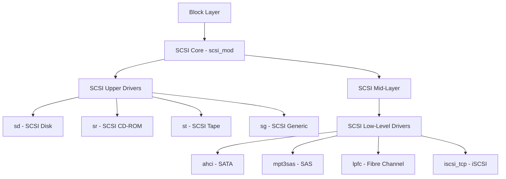
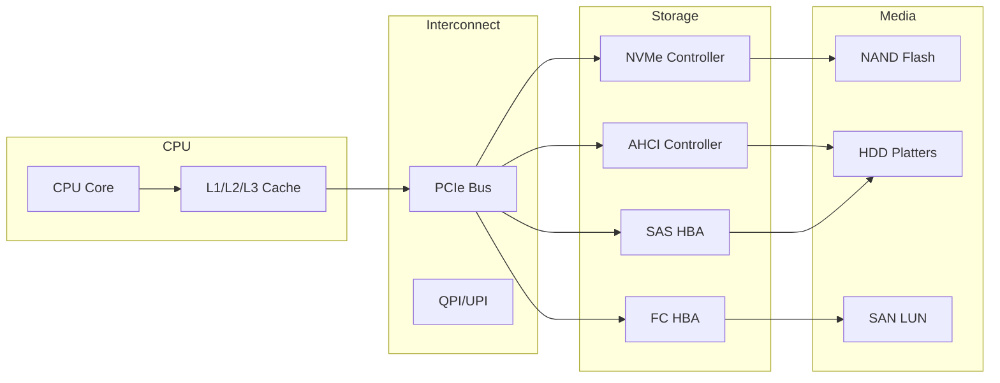
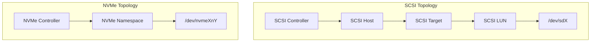
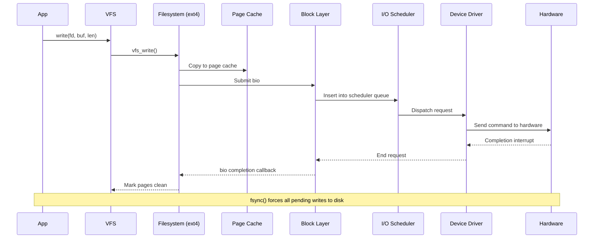

# Storage Overview

## Introduction

Storage is one of the most complex subsystems in the Linux kernel. From the moment an application issues a `write()` syscall to the instant data lands on persistent media, it traverses multiple layers—each with its own abstractions, optimizations, and failure modes. This chapter provides a comprehensive map of the Linux storage stack, covering block devices, the SCSI layer, NVMe, and storage topology.

Understanding the full I/O stack is essential for performance tuning, debugging, and capacity planning. A misconfigured I/O scheduler, a suboptimal queue depth, or a poorly designed storage topology can turn a fast NVMe drive into a bottleneck.

## The Linux I/O Stack

The Linux I/O stack is a layered architecture. Each layer adds its own abstraction and processing overhead:

```mermaid
graph TD
    A[Application / VFS] --> B[Filesystem (ext4, XFS, Btrfs)]
    B --> C[Page Cache / Direct I/O]
    C --> D[Block I/O Layer (bio, request_queue)]
    D --> E[I/O Scheduler (mq-deadline, BFQ, kyber)]
    E --> F[Device Driver (SCSI, NVMe, virtio-blk)]
    F --> G[Block Device /dev/sdX, /dev/nvme0n1]
    G --> H[Hardware (HDD, SSD, NVMe, SAN)]
```

### Layer Descriptions

| Layer | Role | Key Data Structures |
|-------|------|---------------------|
| Application | Issues `read()`/`write()`/`open()` | File descriptors |
| VFS | Unified filesystem interface | `inode`, `dentry`, `file` |
| Filesystem | On-disk format, journaling, allocation | `super_block`, `bio` |
| Page Cache | Caches file data in RAM | `address_space`, `page` |
| Block I/O | Queues and dispatches I/O | `bio`, `request`, `request_queue` |
| I/O Scheduler | Reorders and merges I/O | Scheduler-specific queues |
| Device Driver | Talks to hardware | `Scsi_Host`, `nvme_ns` |
| Hardware | Persistent storage | Controller, NAND platters |

## Block Devices

A **block device** is a storage device that reads and writes data in fixed-size blocks (typically 512 bytes or 4096 bytes). Linux exposes block devices as device nodes under `/dev/`:

```bash
# List block devices
lsblk
# NAME   MAJ:MIN RM   SIZE RO TYPE MOUNTPOINTS
# sda      8:0    0 465.8G  0 disk
# ├─sda1   8:1    0   512M  0 part /boot
# └─sda2   8:2    0 465.3G  0 part /
# nvme0n1 259:0   0 931.5G  0 disk
# └─nvme0n1p1 259:1 0 931.5G 0 part /data
```

### Device Numbers

Every block device has a **major** and **minor** number:
- **Major number**: Identifies the device driver (e.g., `8` for SCSI/SATA, `259` for NVMe)
- **Minor number**: Identifies the specific device or partition

```bash
ls -la /dev/sda /dev/nvme0n1
# brw-rw---- 1 root disk 8, 0 Jul 21 10:00 /dev/sda
# brw-rw---- 1 root disk 259, 0 Jul 21 10:00 /dev/nvme0n1
```

### Device Registration

Block devices register with the kernel through the `gendisk` structure:

```c
struct gendisk {
    int major;              /* major number */
    int first_minor;        /* first minor number */
    int minors;             /* maximum number of minors */
    const char *disk_name;  /* disk name */
    struct request_queue *queue; /* request queue */
    struct block_device_operations *fops;
    /* ... */
};
```

## The SCSI Layer

The SCSI (Small Computer Systems Interface) subsystem in Linux is remarkably broad. It handles not only actual SCSI hardware but also SATA, USB storage, and Fibre Channel devices. The kernel's SCSI layer provides a unified abstraction over diverse transport protocols.



### SCSI Command Lifecycle

1. The block layer constructs a `struct request` and submits it to the SCSI layer
2. The SCSI mid-layer translates it into a SCSI command (`scsi_cmnd`)
3. The low-level driver sends the command to the hardware
4. The hardware completes the command and raises an interrupt
5. The completion handler propagates back up the stack

```bash
# View SCSI devices
cat /proc/scsi/scsi
# Attached devices:
# Host: scsi0 Channel: 00 Id: 00 Lun: 00
#   Vendor: ATA      Model: Samsung SSD 870  Rev: 1B6Q
#   Type:   Direct-Access                    ANSI  SCSI revision: 05

# Detailed SCSI info
lsscsi -v
# [0:0:0:0]    disk    ATA      Samsung SSD 870  1B6Q  /dev/sda
#   dir: /sys/devices/pci0000:00/0000:00:17.0/ata1/host0/target0:0:0/0:0:0:0
```

### SCSI Host Template

Each SCSI driver registers a `scsi_host_template`:

```c
static struct scsi_host_template my_scsi_template = {
    .module         = THIS_MODULE,
    .name           = "my_scsi_driver",
    .queuecommand   = my_queue_command,
    .eh_abort_handler = my_abort,
    .eh_device_reset_handler = my_device_reset,
    .can_queue      = 32,
    .this_id        = -1,
    .sg_tablesize   = 256,
    .cmd_per_lun    = 32,
};
```

## NVMe

NVMe (Non-Volatile Memory Express) is a protocol designed specifically for flash storage. Unlike SCSI, which was designed for spinning disks and tape drives, NVMe exploits the parallelism and low latency of solid-state media.

### Key NVMe Advantages

| Feature | SCSI/SATA | NVMe |
|---------|-----------|------|
| Queue depth | 32 (TCQ) or 1 (NCQ) | 65,535 queues × 65,535 commands |
| Protocol overhead | High (SCSI CDBs) | Low (simple 64-byte commands) |
| Interrupt model | Single IRQ | Per-CPU MSI-X vectors |
| Latency | ~100μs | ~10μs |
| Parallelism | Limited | Massive |

### NVMe Device Nodes

```bash
# NVMe character device
ls -la /dev/nvme0
# crw------- 1 root root 10, 154 Jul 21 10:00 /dev/nvme0

# NVMe namespace block devices
ls -la /dev/nvme0n1*
# brw-rw---- 1 root disk 259, 0 Jul 21 10:00 /dev/nvme0n1
# brw-rw---- 1 root disk 259, 1 Jul 21 10:00 /dev/nvme0n1p1

# NVMe admin character device per namespace
ls -la /dev/nvme0n1
```

### NVMe Controller Information

```bash
nvme id-ctrl /dev/nvme0
# VID       : 0x144d
# SSVID     : 0x144d
# MN        : Samsung SSD 970 EVO Plus 2TB
# FR        : 2B2QEXM7
# MDTS      : 9
# CAP       : ...
# SQES      : 0x66
# CQES      : 0x44
# NN        : 1         # Number of namespaces

nvme id-ns /dev/nvme0n1
# NSZE   : 3907029168   # Namespace size in blocks
# NCAP   : 3907029168   # Namespace capacity
# NUSE   : 1234567890   # Namespace utilization
# LBAF0  : 0x9009200    # LBA format: 512 bytes
```

## Storage Topology

Understanding storage topology means understanding the physical and logical path from CPU to persistent media.



### NUMA-Aware Storage

On multi-socket systems, storage devices are attached to specific NUMA nodes. Accessing storage from a remote NUMA node adds latency:

```bash
# Find which NUMA node a device is on
cat /sys/block/nvme0n1/device/../numa_node
# -1 (means not set or all nodes)

# More reliable method
readlink -f /sys/block/nvme0n1/device
# /sys/devices/pci0000:40/0000:40:01.1/0000:41:00.0/nvme/nvme0

# Check PCIe NUMA node
cat /sys/devices/pci0000:40/numa_node
# 0

# Use numactl to bind I/O to the correct node
numactl --cpunodebind=0 --membind=0 dd if=/dev/nvme0n1 of=/dev/null bs=1M count=1000
```

### SCSI vs NVMe Topology Comparison



## sysfs Block Device Information

The sysfs filesystem exposes extensive information about block devices:

```bash
# Device size (in 512-byte sectors)
cat /sys/block/sda/size
# 976773168

# Queue parameters
cat /sys/block/sda/queue/scheduler
# [mq-deadline] kyber bfq none

cat /sys/block/sda/queue/nr_requests
# 256

cat /sys/block/sda/queue/max_sectors_kb
# 1280

cat /sys/block/sda/queue/rotational
# 0

cat /sys/block/sda/queue/logical_block_size
# 512

cat /sys/block/sda/queue/physical_block_size
# 512
```

## Device Mapper

The device-mapper is a kernel framework that provides a generic way to create virtual block devices. It sits between the filesystem and the actual block device, enabling:

- **LVM** (Logical Volume Manager)
- **dm-crypt** (LUKS encryption)
- **dm-raid** (software RAID)
- **multipath** (multiple paths to a SAN)
- **dm-cache** (SSD caching)

```bash
# View device-mapper targets
dmsetup targets
# linear           v1.1.0
# striped          v1.6.0
# mirror           v1.14.0
# crypt            v2.3.0
# thin-pool        v1.21.0
# cache            v2.3.0

# List device-mapper devices
dmsetup ls --tree
# vg0-root (253:0)
# ├─vg0-root_tdata (253:2)
# │ └─ (...) 
# └─vg0-root_tmeta (253:1)
#   └─ (...)
```

## Putting It All Together

When an application writes data, the I/O traverses these layers:



## References

- [Linux Block I/O Documentation](https://www.kernel.org/doc/html/latest/block/)
- [NVMe Specification](https://nvmexpress.org/specifications/)
- [SCSI Documentation](https://www.kernel.org/doc/html/latest/scsi/)
- [Linux Storage Stack Diagram](https://www.thomas-krenn.com/en/wiki/Linux_Storage_Stack_Diagram)
- [Device Mapper Documentation](https://www.kernel.org/doc/html/latest/admin-guide/device-mapper/)

## Further Reading

- [The Linux Kernel Documentation](https://docs.kernel.org/)
- [GNU Project Documentation](https://www.gnu.org/doc/doc.html)
- [GNU Manuals](https://www.gnu.org/manual/manual.html)
- [Free Software Directory](https://directory.fsf.org/wiki/Main_Page)
- [Planet GNU](https://planet.gnu.org/)
- [Free Software Books](https://www.gnu.org/doc/other-free-books.html)

- Bovet, D. P., & Cesati, M. *Understanding the Linux Kernel*, 3rd Edition. O'Reilly Media.
- Love, R. *Linux Kernel Development*, 3rd Edition. Addison-Wesley.
- <https://kernel.dk/sstor.pdf> - Jens Axboe's storage stack overview
- <https://lwn.net/Articles/738918/> - NVMe and the Linux block layer

## Related Topics

- [SCSI and NVMe Deep Dive](scsi-nvme.md)
- [Block I/O Layer](block-io.md)
- [Multipath I/O](multipath.md)
- [Storage Area Networks](san.md)
- [I/O Performance](../performance/io.md)
