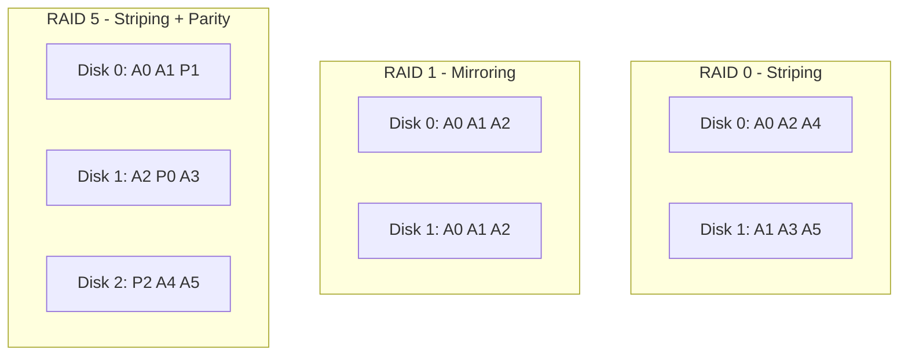
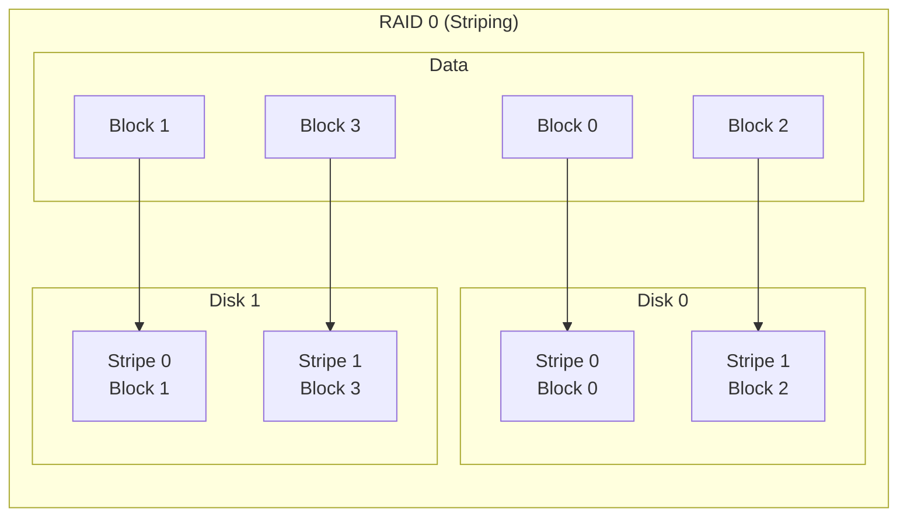
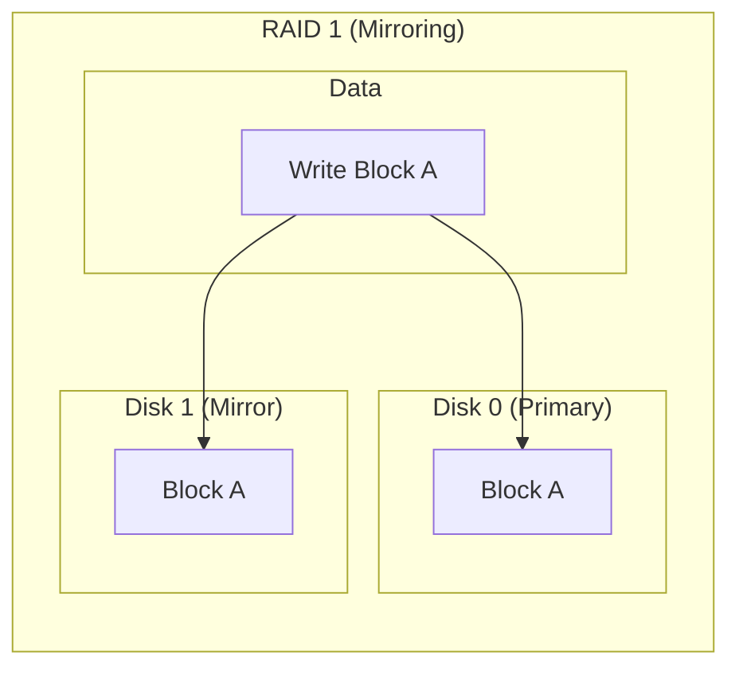
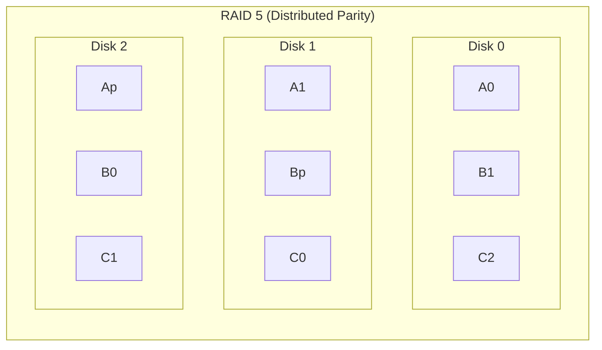
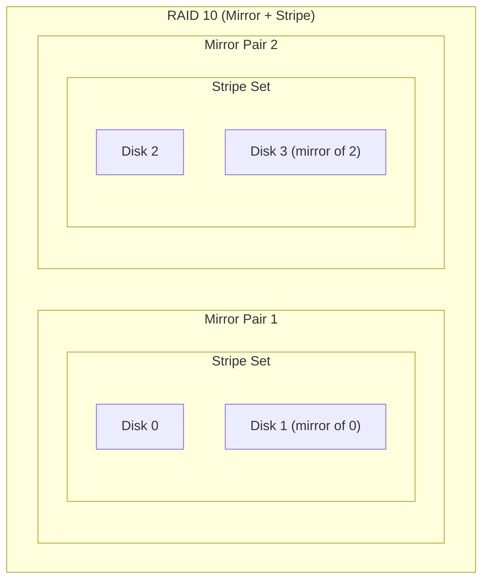
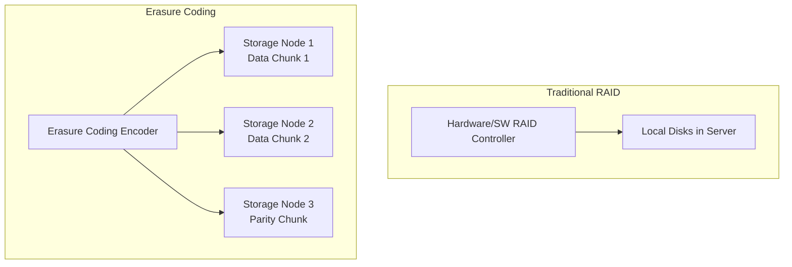

# RAID Explained

## Introduction

Redundant Array of Independent Disks (RAID) is a technology that combines multiple physical disk drives into a single logical unit to improve performance, reliability, or both. Linux provides software RAID through the `md` (Multiple Devices) driver, managed by the `mdadm` utility.

This chapter covers RAID levels 0, 1, 5, 6, and 10, their performance characteristics, rebuild processes, and the comparison between RAID and erasure coding.

## RAID Levels Overview



### RAID Level Comparison

| Level | Min Disks | Redundancy | Read Perf | Write Perf | Usable Capacity | Failure Tolerance |
|-------|-----------|------------|-----------|------------|-----------------|-------------------|
| RAID 0 | 2 | None | Excellent | Excellent | 100% | 0 disks |
| RAID 1 | 2 | Full mirror | Good | Fair | 50% | N-1 disks |
| RAID 5 | 3 | Single parity | Excellent | Good | (N-1)/N | 1 disk |
| RAID 6 | 4 | Double parity | Excellent | Fair | (N-2)/N | 2 disks |
| RAID 10 | 4 | Mirror + stripe | Excellent | Excellent | 50% | 1 per mirror |

## RAID 0: Striping

RAID 0 stripes data across all disks with no redundancy. It maximizes performance and capacity but provides no fault tolerance.



**Characteristics:**
- No parity computation overhead
- Full read and write parallelism across all disks
- Any single disk failure destroys all data
- Best for: scratch space, temporary data, caches

```bash
# Create RAID 0
mdadm --create /dev/md0 --level=0 --raid-devices=2 /dev/sdb1 /dev/sdc1
# mdadm: Defaulting to version 1.2 metadata
# mdadm: array /dev/md0 started.

# View RAID status
cat /proc/mdstat
# Personalities : [raid0]
# md0 : active raid0 sdc1[1] sdb1[0]
#       209715200 blocks super 1.2 512k chunks
#
# unused devices: <none>

mdadm --detail /dev/md0
# /dev/md0:
#         Version : 1.2
#   Creation Time : Mon Jul 21 10:00:00 2026
#      Raid Level : raid0
#      Array Size : 209715200 (200.00 GiB 214.75 GB)
#    Raid Devices : 2
#   Total Devices : 2
#     Persistence : Superblock is persistent
#
#     Number   Major   Minor   RaidDevice State
#        0       8       17        0      active sync   /dev/sdb1
#        1       8       33        1      active sync   /dev/sdc1
```

## RAID 1: Mirroring

RAID 1 mirrors data across all disks. Every write goes to every disk; reads can be served from any disk.



**Characteristics:**
- Write performance: same as single disk (must write to all mirrors)
- Read performance: can read from any disk (load balancing)
- Storage efficiency: 50% (with 2 disks)
- Can survive N-1 disk failures

```bash
# Create RAID 1
mdadm --create /dev/md0 --level=1 --raid-devices=2 /dev/sdb1 /dev/sdc1
# mdadm: array /dev/md0 started.

# Monitor rebuild/resync
cat /proc/mdstat
# md0 : active raid1 sdc1[1] sdb1[0]
#       104857600 blocks [2/2] [UU]
#       [====>................]  resync = 23.4% (24567890/104857600) finish=5.2min speed=256000K/sec

# [UU] means both disks are Up
# [_U] means first disk is failed

# Replace a failed disk
mdadm --manage /dev/md0 --fail /dev/sdb1
mdadm --manage /dev/md0 --remove /dev/sdb1
mdadm --manage /dev/md0 --add /dev/sdd1
```

## RAID 5: Striping with Distributed Parity

RAID 5 stripes data and distributes parity across all disks. It can survive one disk failure.



**Parity calculation:**
- Parity = A0 ⊕ A1 ⊕ A2 (XOR across all data blocks in a stripe)
- On disk failure, missing data = parity ⊕ remaining data blocks

**Write penalty (RAID 5 write hole):**
A small write to RAID 5 requires:
1. Read old data
2. Read old parity
3. Compute new parity = old_parity ⊕ old_data ⊕ new_data
4. Write new data
5. Write new parity

This is known as the "read-modify-write" or "reconstruct-write" penalty.

```bash
# Create RAID 5
mdadm --create /dev/md0 --level=5 --raid-devices=3 /dev/sdb1 /dev/sdc1 /dev/sdd1
# mdadm: array /dev/md0 started.

cat /proc/mdstat
# md0 : active raid5 sdd1[3] sdc1[1] sdb1[0]
#       209715200 blocks super 1.2 level 5, 512k chunk, algorithm 2 [3/2] [UU_]
#       [====>................]  recovery = 20.0% (20971520/104857600) finish=2.3min

# Performance impact
# Sequential read: ~2x single disk (data on 2 disks)
# Sequential write: ~1x single disk (parity computation)
# Random read: ~(N-1)x single disk
# Random write: ~(N/4)x single disk (write hole penalty)
```

## RAID 6: Double Distributed Parity

RAID 6 extends RAID 5 with a second independent parity calculation, allowing any two disks to fail simultaneously.

```bash
# Create RAID 6
mdadm --create /dev/md0 --level=6 --raid-devices=4 /dev/sdb1 /dev/sdc1 /dev/sdd1 /dev/sde1
# mdadm: array /dev/md0 started.

cat /proc/mdstat
# md0 : active raid6 sde1[4] sdd1[2] sdc1[1] sdb1[0]
#       209715200 blocks super 1.2 level 6, 512k chunk, algorithm 2 [4/3] [UUU_]
#       [====>................]  recovery = 20.0% (20971520/104857600)

# Parity calculations:
# P-parity: XOR (same as RAID 5)
# Q-parity: Galois Field arithmetic (Reed-Solomon based)
```

**RAID 6 write penalty:**
Every write requires:
1. Read old data
2. Read old P-parity
3. Read old Q-parity
4. Compute new P-parity
5. Compute new Q-parity
6. Write new data
7. Write new P-parity
8. Write new Q-parity

## RAID 10: Mirrored Stripes

RAID 10 combines RAID 1 (mirroring) and RAID 0 (striping) for both redundancy and performance.



```bash
# Create RAID 10 (with mdadm)
mdadm --create /dev/md0 --level=10 --raid-devices=4 /dev/sdb1 /dev/sdc1 /dev/sdd1 /dev/sde1

# Near layout (default) - stripes are mirrored to adjacent disks
mdadm --create /dev/md0 --level=10 --layout=near --raid-devices=4 /dev/sdb1 /dev/sdc1 /dev/sdd1 /dev/sde1

# Far layout - stripes are mirrored to distant disks (better sequential read)
mdadm --create /dev/md0 --level=10 --layout=far --raid-devices=4 /dev/sdb1 /dev/sdc1 /dev/sdd1 /dev/sde1

cat /proc/mdstat
# md0 : active raid10 sde1[3] sdd1[2] sdc1[1] sdb1[0]
#       209715200 blocks super 1.2 512k chunks 2 near-copies [4/4] [UUUU]
```

## mdadm: Managing Software RAID

### Array Creation

```bash
# Create with specific metadata version
mdadm --create /dev/md0 --level=5 --raid-devices=3 \
    --metadata=1.2 --chunk=512K \
    /dev/sdb1 /dev/sdc1 /dev/sdd1

# Metadata versions:
# 0.90 - Legacy, max 2TB, stored at end of device
# 1.0  - Stored at end, supports larger devices
# 1.1  - Stored at beginning
# 1.2  - Default, stored at 4K offset, recommended
```

### Monitoring and Management

```bash
# Detailed array information
mdadm --detail /dev/md0
# /dev/md0:
#         Version : 1.2
#   Creation Time : Mon Jul 21 10:00:00 2026
#      Raid Level : raid5
#      Array Size : 209715200 (200.00 GiB 214.75 GB)
#   Used Dev Size : 104857600 (100.00 GiB 107.37 GB)
#    Raid Devices : 3
#   Total Devices : 3
#     Persistence : Superblock is persistent
#
#   Intent Bitmap : Internal
#
#     Update Time : Mon Jul 21 12:00:00 2026
#           State : clean
#  Active Devices : 3
# Working Devices : 3
#  Failed Devices : 0
#   Spare Devices : 0
#
#          Layout : left-symmetric
#      Chunk Size : 512K
#
#            Name : server:0  (local to host server)
#            UUID : 12345678:90abcdef:12345678:90abcdef
#          Events : 42
#
#     Number   Major   Minor   RaidDevice State
#        0       8       17        0      active sync   /dev/sdb1
#        1       8       33        1      active sync   /dev/sdc1
#        2       8       49        2      active sync   /dev/sdd1

# Add a spare disk
mdadm --manage /dev/md0 --add /dev/sde1

# Remove a disk (must fail first if active)
mdadm --manage /dev/md0 --fail /dev/sdb1
mdadm --manage /dev/md0 --remove /dev/sdb1

# Stop an array
mdadm --stop /dev/md0

# Assemble an array
mdadm --assemble /dev/md0 /dev/sdb1 /dev/sdc1 /dev/sdd1

# Scan and assemble all arrays
mdadm --assemble --scan

# Auto-assemble at boot
mdadm --detail --scan >> /etc/mdadm/mdadm.conf
```

### Rebuild and Resync

```bash
# Check rebuild status
cat /proc/mdstat
# md0 : active raid5 sdd1[3] sdc1[1] sdb1[0]
#       209715200 blocks super 1.2 level 5, 512k chunk, algorithm 2 [3/2] [UU_]
#       [====>................]  recovery = 20.0% (20971520/104857600) finish=2.3min speed=750000K/sec

# Limit rebuild speed (to reduce production impact)
echo 50000 > /proc/sys/dev/raid/speed_limit_min   # Min 50 MB/s
echo 200000 > /proc/sys/dev/raid/speed_limit_max  # Max 200 MB/s

# Force check (scrub)
echo check > /sys/block/md0/md/sync_action

# Repair (fix errors found during check)
echo repair > /sys/block/md0/md/sync_action

# View sync status
cat /sys/block/md0/md/sync_completed
# 41943040 / 209715200
```

## RAID Performance

### Sequential I/O Performance

```bash
# Benchmark RAID 5 sequential write
fio --name=seqwrite --filename=/dev/md0 --rw=write --bs=1M \
    --ioengine=io_uring --direct=1 --size=10G --numjobs=1
# WRITE: bw=300MiB/s (315MB/s)

# Benchmark RAID 5 random 4K read
fio --name=randread --filename=/dev/md0 --rw=randread --bs=4k \
    --ioengine=io_uring --direct=1 --iodepth=32 --size=1G --numjobs=4
# READ: IOPS=120K
```

### Chunk Size Impact

The chunk size determines how data is distributed across disks:

```bash
# Create with different chunk sizes
mdadm --create /dev/md0 --level=5 --raid-devices=3 --chunk=64K /dev/sd[bc]1
mdadm --create /dev/md0 --level=5 --raid-devices=3 --chunk=512K /dev/sd[bc]1

# Small chunks (64K): Better for small random I/O
# Large chunks (512K+): Better for sequential I/O
```

## RAID vs Erasure Coding

Erasure coding is the distributed equivalent of RAID, used in systems like Ceph, MinIO, and cloud storage.



| Feature | RAID | Erasure Coding |
|---------|------|----------------|
| Scope | Single server | Distributed cluster |
| Reconstruction | Rebuild from local disks | Fetch from remote nodes |
| Network impact | None | Significant during repair |
| Failure domain | Disk/controller | Node/rack/datacenter |
| Overhead | Parity disks | Parity chunks distributed |
| Typical use | Local storage | Object storage (Ceph, MinIO) |

### Erasure Coding Example (Ceph)

```bash
# Ceph erasure code profile
ceph osd erasure-code-profile set myprofile \
    k=4 m=2 plugin=jerasure technique=reed_sol_van
# k=4 data chunks, m=2 parity chunks
# Survives 2 failures
# Storage efficiency: 4/6 = 66.7%

ceph osd pool create ecpool 128 128 erasure myprofile
```

## RAID Monitoring and Alerts

### mdadm Monitoring Daemon

```bash
# Configure mdadm monitoring
cat /etc/mdadm/mdadm.conf
# MAILADDR admin@example.com
# PROGRAM /usr/local/bin/raid-alert.sh

# Start monitoring daemon
mdadm --monitor --scan --daemonise --mail=admin@example.com

# Or via systemd
systemctl enable mdmonitor
systemctl start mdmonitor
```

### SMART Monitoring

```bash
# Install smartmontools
apt install smartmontools

# Check disk health
smartctl -a /dev/sda
# SMART overall-health self-assessment test result: PASSED

# Monitor for RAID
smartctl -a /dev/sda -d sat
```

## Common RAID Recipes

### RAID 1 for Boot Partition

```bash
# Create RAID 1 for /boot
mdadm --create /dev/md0 --level=1 --raid-devices=2 --metadata=1.0 /dev/sda1 /dev/sdb1
mkfs.ext4 /dev/md0
mount /dev/md0 /boot
```

### RAID 10 for Database

```bash
# RAID 10 with near layout for databases
mdadm --create /dev/md0 --level=10 --layout=near --raid-devices=4 \
    --chunk=64K /dev/sd[b-e]1

# Mount with optimal options
mount -o noatime,nodiratime /dev/md0 /var/lib/mysql
```

### RAID 5 for Archive Storage

```bash
# RAID 5 with large chunk size
mdadm --create /dev/md0 --level=5 --raid-devices=5 --chunk=1M \
    /dev/sd[b-f]1

mkfs.xfs /dev/md0
mount -o noatime /dev/md0 /data/archive
```

## References

- [mdadm(8) man page](https://man7.org/linux/man-pages/man8/mdadm.8.html)
- [RAID Wikipedia](https://en.wikipedia.org/wiki/Standard_RAID_levels)
- [Linux RAID Wiki](https://raid.wiki.kernel.org/)
- [md driver documentation](https://www.kernel.org/doc/html/latest/admin-guide/md.html)

## Further Reading

- <https://www.usenix.org/legacy/events/fast09/tech/full_papers/jiang/jiang.pdf> - RAID reliability analysis
- <https://lwn.net/Articles/636968/> - Linux RAID performance tuning
- <https://github.com/ceph/ceph> - Ceph distributed storage (erasure coding)
- <https://www.usenix.org/conference/fast16/technical-sessions/presentation/xia> - Erasure coding performance

## Related Topics

- [Storage Overview](overview.md)
- [LVM Deep Dive](lvm-deep-dive.md)
- [Ceph Distributed Storage](ceph.md)
- [I/O Performance](../performance/io.md)
