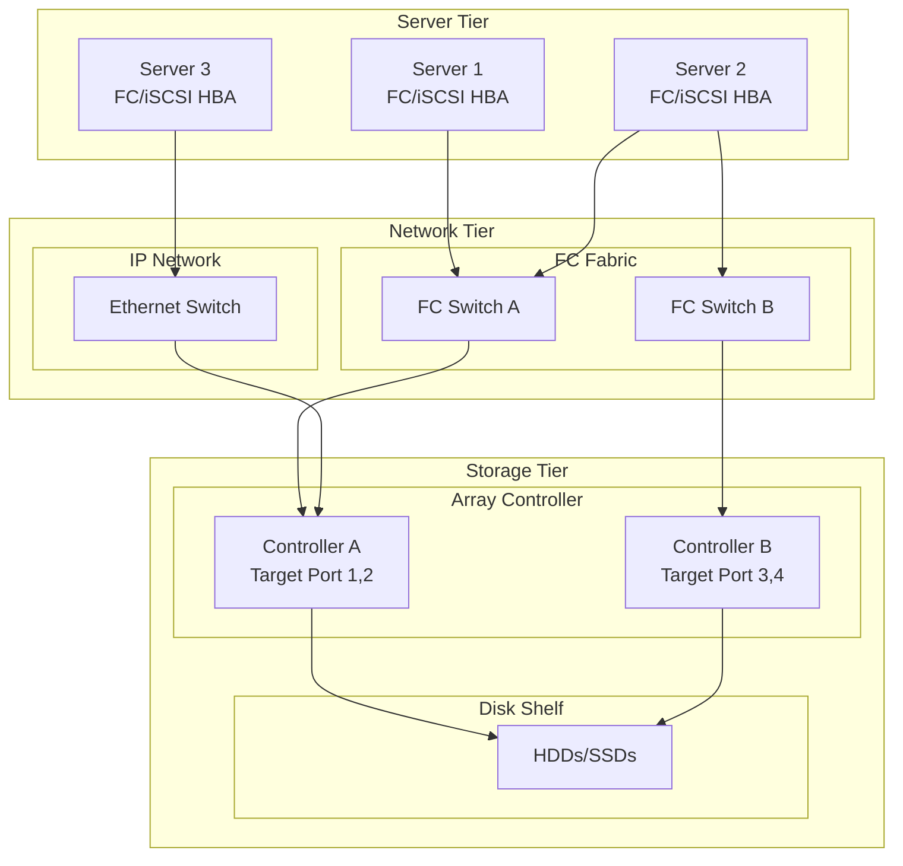
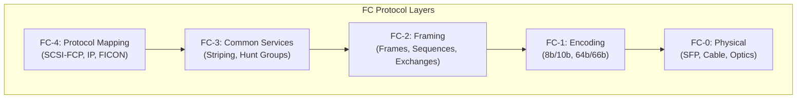
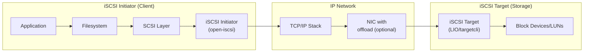
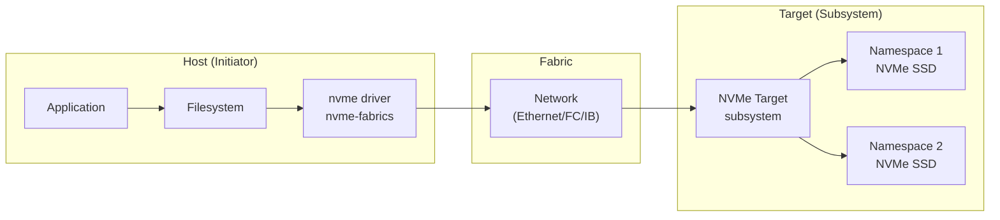
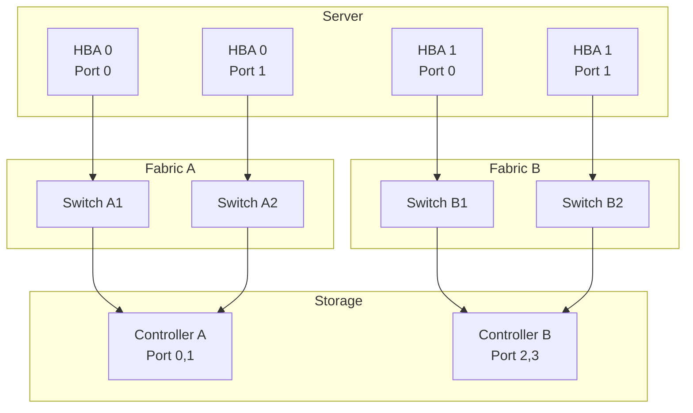

# Storage Area Networks

## Introduction

A Storage Area Network (SAN) is a dedicated, high-speed network that provides block-level access to storage devices. Unlike Network Attached Storage (NAS), which provides file-level access over Ethernet, SANs present raw block devices (LUNs) to servers, which then format them with their own filesystems.

Linux supports two primary SAN transports: **Fibre Channel (FC)** and **iSCSI** (Internet SCSI). This chapter covers both, along with target configuration, LUN masking, and best practices.

## SAN Architecture



## Fibre Channel

Fibre Channel is the traditional SAN transport, offering high bandwidth (16/32/64 Gbps), low latency, and lossless delivery through credit-based flow control.

### FC Protocol Stack



### FC Addressing

Every device in a Fibre Channel fabric gets a **World Wide Name (WWN)** and a **Fabric Port Address**:

```bash
# View FC host adapters
ls /sys/class/fc_host/
# host0  host1

# View FC host info
cat /sys/class/fc_host/host0/port_name
# 0x10000090fa123456

cat /sys/class/fc_host/host0/node_name
# 0x20000090fa123456

cat /sys/class/fc_host/host0/port_state
# Online

cat /sys/class/fc_host/host0/port_type
# NPort (fabric via point-to-point)

cat /sys/class/fc_host/host0/speed
# 32 Gbit/s

cat /sys/class/fc_host/host0/fabric_name
# 0x2001000533abcd00

# View FC remote ports (storage targets)
ls /sys/class/fc_remote_ports/
# rport-0:0-0  rport-0:0-1

cat /sys/class/fc_remote_ports/rport-0:0-0/port_name
# 0x50060e8012345678

cat /sys/class/fc_remote_ports/rport-0:0-0/port_state
# Online
```

### FC LUN Discovery

```bash
# Scan for new LUNs
echo "- - -" > /sys/class/scsi_host/host0/scan

# Or scan specific target/LUN
echo "0 0 1" > /sys/class/scsi_host/host0/scan  # Channel 0, Target 0, LUN 1

# View discovered LUNs
lsscsi
# [0:0:0:0]  disk  NETAPP   LUN C-Mode       9400  /dev/sda
# [0:0:0:1]  disk  NETAPP   LUN C-Mode       9400  /dev/sdb
# [0:0:1:0]  disk  NETAPP   LUN C-Mode       9400  /dev/sdc
# [1:0:0:0]  disk  NETAPP   LUN C-Mode       9400  /dev/sdd
# [1:0:0:1]  disk  NETAPP   LUN C-Mode       9400  /dev/sde

# FC zone info (from switch CLI)
# Brocade:
# zonecreate "zone_server1", "10:00:00:90:fa:12:34:56;50:06:0e:80:12:34:56:78"
# cfgcreate "cfg_prod", "zone_server1"
# cfgenable "cfg_prod"
```

### FC Multipath

```bash
# FC devices are typically multipathed
multipath -ll
# mpatha (3600508b4001234567890123456789012) dm-0 NETAPP,LUN C-Mode
# size=500G features='4 queue_if_no_path' hwhandler='1 alua' wp=rw
# |-+- policy='round-robin 0' prio=50 status=active
# | |- 0:0:0:1 sdb 8:16  active ready running
# | `- 0:0:1:1 sdc 8:32  active ready running
# `-+- policy='round-robin 0' prio=10 status=enabled
#   |- 1:0:0:1 sdd 8:48  active ready running
#   `- 1:0:1:1 sde 8:64  active ready running
```

## iSCSI

iSCSI encapsulates SCSI commands in TCP/IP, allowing storage access over standard Ethernet networks. It's cheaper than FC but requires careful network tuning.

### iSCSI Architecture



### iSCSI Initiator Configuration

```bash
# Install Open-iSCSI
apt install open-iscsi          # Debian/Ubuntu
yum install iscsi-initiator-utils  # RHEL/CentOS

# Get initiator name
cat /etc/iscsi/initiatorname.iscsi
# InitiatorName=iqn.2026-07.com.example:server1

# Set initiator name (if needed)
echo "InitiatorName=iqn.2026-07.com.example:server1" > /etc/iscsi/initiatorname.iscsi
```

### iSCSI Discovery and Login

```bash
# Discover targets
iscsiadm -m discovery -t sendtargets -p 192.168.1.100
# 192.168.1.100:3260,1 iqn.2026-07.com.example:storage.target1

# Discover with CHAP authentication
iscsiadm -m discovery -t sendtargets -p 192.168.1.100 \
    -o update -n node.session.auth.authmethod -v CHAP
iscsiadm -m discovery -t sendtargets -p 192.168.1.100 \
    -o update -n node.session.auth.username -v myuser
iscsiadm -m discovery -t sendtargets -p 192.168.1.100 \
    -o update -n node.session.auth.password -v mypassword

# Login to a target
iscsiadm -m node -T iqn.2026-07.com.example:storage.target1 -p 192.168.1.100 --login
# Login to [iface: default, target: iqn.2026-07.com.example:storage.target1,
#  portal: 192.168.1.100,3260] successful.

# Login to all discovered targets
iscsiadm -m node --loginall=all

# Set automatic login
iscsiadm -m node -T iqn.2026-07.com.example:storage.target1 -p 192.168.1.100 \
    -o update -n node.startup -v automatic

# View active sessions
iscsiadm -m session
# tcp: [1] 192.168.1.100:3260,1 iqn.2026-07.com.example:storage.target1 (non-flash)

# View session details
iscsiadm -m session -P 3
# Target: iqn.2026-07.com.example:storage.target1
# 	Current Portal: 192.168.1.100:3260,1
# 	Persistent Portal: 192.168.1.100:3260,1
# 	...
# 	Attached SCSI devices:
# 	--------------------------------
# 	Host: 2 Channel: 00 Id: 00 Lun: 00
# 	Attached scsi disk sdb		State: running
# 	Host: 2 Channel: 00 Id: 00 Lun: 01
# 	Attached scsi disk sdc		State: running
```

### iSCSI Logout

```bash
# Logout from a target
iscsiadm -m node -T iqn.2026-07.com.example:storage.target1 -p 192.168.1.100 --logout

# Logout from all targets
iscsiadm -m node --logoutall=all

# Delete a node record
iscsiadm -m node -T iqn.2026-07.com.example:storage.target1 -p 192.168.1.100 -o delete
```

## iSCSI Target Configuration (LIO/targetcli)

Linux uses the **LIO** (Linux I/O target) framework, managed through `targetcli`:

```bash
# Install targetcli
apt install targetcli-fb        # Debian/Ubuntu
yum install targetcli            # RHEL/CentOS

# Run targetcli
targetcli
```

### targetcli Configuration Walkthrough

```bash
targetcli
# /> ls
# o- / ........................................................................... [...]
#   o- backstores ................................................................ [...]
#   | o- block .................................................. [Storage Objects: 0]
#   | o- fileio ................................................. [Storage Objects: 0]
#   | o- pscsi .................................................. [Storage Objects: 0]
#   | o- ramdisk ................................................ [Storage Objects: 0]
#   o- iscsi .................................................................... [Targets: 0]
#   o- loopback ................................................................. [Targets: 0]

# 1. Create a backstore (block device backing)
# /> /backstores/block create name=lun0 dev=/dev/sdb
# Created block storage object lun0 using /dev/sdb.

# 2. Create an iSCSI target
# /> /iscsi create iqn.2026-07.com.example:storage.target1
# Created target iqn.2026-07.com.example:storage.target1.
# Created TPG 1.
# Global pref auto_add_default_portal=true
# Created default portal listening on all IPs (0.0.0.0), port 3260.

# 3. Create a LUN (map backstore to target)
# /> /iscsi/iqn.2026-07.com.example:storage.target1/tpg1/luns create /backstores/block/lun0
# Created LUN 0.

# 4. Create an ACL (initiator access control)
# /> /iscsi/iqn.2026-07.com.example:storage.target1/tpg1/acls create iqn.2026-07.com.example:server1
# Created Node ACL for iqn.2026-07.com.example:server1
# Created mapped LUN 0.

# 5. Set authentication (optional)
# /> /iscsi/iqn.2026-07.com.example:storage.target1/tpg1/acls/iqn.2026-07.com.example:server1 set auth userid=myuser
# /> /iscsi/iqn.2026-07.com.example:storage.target1/tpg1/acls/iqn.2026-07.com.example:server1 set auth password=mypassword

# 6. Save configuration
# /> saveconfig
# Configuration saved to /etc/rtslib-fb-target/saveconfig.json

# /> exit
```

### targetcli Structure

```bash
targetcli ls
# o- / ........................................................................... [...]
#   o- backstores ................................................................ [...]
#   | o- block .................................................. [Storage Objects: 1]
#   | | o- lun0 ................... [/dev/sdb (500.0GiB) write-thru activated]
#   | o- fileio ................................................. [Storage Objects: 0]
#   o- iscsi .................................................................... [Targets: 1]
#   | o- iqn.2026-07.com.example:storage.target1 .......................... [TPGs: 1]
#     o- tpg1 ..................................................... [gen-acls, no-auth]
#       o- acls ............................................................ [ACLs: 1]
#       | o- iqn.2026-07.com.example:server1 ......................... [Mapped LUNs: 1]
#       |   o- mapped_lun0 ................................ [lun0 block/lun0 (rw)]
#       o- luns ............................................................ [LUNs: 1]
#       | o- lun0 ......................... [block/lun0 (/dev/sdb) (default_tg_pt_gp)]
#       o- portals ........................................................ [Portals: 1]
#         o- 0.0.0.0:3260 ................................................... [OK]
```

## LUN Masking

LUN masking controls which initiators can see which LUNs. This is a critical security mechanism in shared SAN environments.

### Methods of LUN Masking

| Method | Layer | Description |
|--------|-------|-------------|
| Target-side ACLs | iSCSI/FC target | Restrict which initiators can connect |
| Zoning | FC switch | Group initiators and targets into zones |
| LUN masking | Storage array | Map specific LUNs to specific initiator WWNs |
| Device-mapper multipath | Host | Filter which devices to use |

### FC Zoning

```bash
# Brocade FC switch zoning example
# Create alias for server
# alicreate "server1_hba0", "10:00:00:90:fa:12:34:56"

# Create alias for storage
# alicreate "storage_ctrl_a", "50:06:0e:80:12:34:56:78"

# Create zone
# zonecreate "zone_server1_prod", "server1_hba0; storage_ctrl_a"

# Add zone to configuration
# cfgcreate "cfg_production", "zone_server1_prod"
# cfgenable "cfg_production"
# cfgsave
```

### Storage Array LUN Masking

```bash
# NetApp ONTAP example (CLI)
# Create initiator group
# igroup create -igroup server1_hba -protocol fcp -ostype linux \
#   -initiator 10:00:00:90:fa:12:34:56

# Map LUN to initiator group
# lun map -path /vol/vol1/lun0 -igroup server1_hba -lun-id 0

# View LUN mappings
# lun mapping show
```

## iSCSI Performance Tuning

### Network Tuning

```bash
# Increase TCP buffer sizes
sysctl -w net.core.rmem_max=16777216
sysctl -w net.core.wmem_max=16777216
sysctl -w net.ipv4.tcp_rmem="4096 87380 16777216"
sysctl -w net.ipv4.tcp_wmem="4096 65536 16777216"

# Enable jumbo frames (requires switch support)
ip link set eth0 mtu 9000

# Enable TCP timestamps
sysctl -w net.ipv4.tcp_timestamps=1

# Enable TCP window scaling
sysctl -w net.ipv4.tcp_window_scaling=1

# Disable TCP slow start after idle
sysctl -w net.ipv4.tcp_slow_start_after_idle=0
```

### iSCSI Session Tuning

```bash
# Configure iSCSI parameters
iscsiadm -m node -T iqn.2026-07.com.example:target1 -p 192.168.1.100 \
    -o update -n node.session.timeo.replacement_timeout -v 120

iscsiadm -m node -T iqn.2026-07.com.example:target1 -p 192.168.1.100 \
    -o update -n node.conn[0].timeo.noop_out_interval -v 15

iscsiadm -m node -T iqn.2026-07.com.example:target1 -p 192.168.1.100 \
    -o update -n node.conn[0].timeo.noop_out_timeout -v 15

# Max queue depth per session
iscsiadm -m node -T iqn.2026-07.com.example:target1 -p 192.168.1.100 \
    -o update -n node.session.queue_depth -v 128

# Multiple connections per session (MC/S)
iscsiadm -m node -T iqn.2026-07.com.example:target1 -p 192.168.1.100 \
    -o update -n node.session.nr_sessions -v 4

# iSCSI header and data digest
iscsiadm -m node -T iqn.2026-07.com.example:target1 -p 192.168.1.100 \
    -o update -n node.conn[0].iscsi.HeaderDigest -v CRC32C
```

## Comparison: FC vs iSCSI

| Feature | Fibre Channel | iSCSI |
|---------|---------------|-------|
| Transport | FC fabric | TCP/IP (Ethernet) |
| Speed | 16/32/64 Gbps | 10/25/100 Gbps |
| Latency | Very low (~100μs) | Low (~200-500μs) |
| Cost | High (HBAs, switches) | Low (standard NICs) |
| Management | FC-specific tools | Standard IP tools |
| Distance | Up to 100km+ | Unlimited (routed) |
| Reliability | Lossless (credit-based) | TCP retransmissions |
| Security | Zoning | CHAP, IPSec |
| Best for | Mission-critical, high IOPS | Cost-effective, general use |

## NVMe over Fabrics (NVMe-oF)

NVMe-oF extends the NVMe protocol across network fabrics, allowing remote access to NVMe storage with near-local latency. It is rapidly replacing iSCSI and FC in new deployments.

### NVMe-oF Transport Types

| Transport | Protocol | Typical Latency | Use Case |
|-----------|----------|-----------------|----------|
| **RDMA** (RoCE/IB) | NVMe/RDMA | ~10-20μs | High-performance data centers |
| **TCP** | NVMe/TCP | ~30-80μs | General purpose, existing Ethernet |
| **Fibre Channel** | FC-NVMe | ~15-25μs | Existing FC infrastructure |
| **InfiniBand** | NVMe/IB | ~10-15μs | HPC environments |

### NVMe-oF Architecture



### NVMe/TCP Initiator Configuration

```bash
# Load the NVMe/TCP module
modprobe nvme-tcp

# Discover NVMe-oF subsystems
discovery
nvme discover -t tcp -a 192.168.1.100 -s 4420
# Subsystem: nqn.2026-07.com.example:storage
#   Transport: tcp  Address: 192.168.1.100:4420
#   Namespace ID: 1  /dev/nvme1n1

# Connect to a subsystem
nvme connect -t tcp -a 192.168.1.100 -s 4420 \
  -n nqn.2026-07.com.example:storage

# Verify connection
nvme list
# /dev/nvme1n1  S5PWNX0N789012  Pure Storage  1  2.00 TB

# Persistent connection (survives reboot)
echo "transport=tcp,traddr=192.168.1.100,trsvcid=4420,
subnqn=nqn.2026-07.com.example:storage" > /etc/nvme/discovery.conf

# Auto-connect on boot
systemctl enable --now nvme-connect@
```

### NVMe/RDMA Initiator Configuration

```bash
# Requires RDMA-capable NIC
modprobe nvme-rdma

# Discover over RDMA
nvme discover -t rdma -a 192.168.1.100 -s 4420

# Connect over RDMA
nvme connect -t rdma -a 192.168.1.100 -s 4420 \
  -n nqn.2026-07.com.example:storage

# Check RDMA transport details
nvme show-regs /dev/nvme1 -H | grep -i transport
```

### NVMe-oF Target Configuration (LIO)

```bash
# Using targetcli with NVMe-oF
# 1. Create NVMe backstore
targetcli
# /> /backstores/block create name=nvme_lun0 dev=/dev/nvme0n1
# 2. Create NVMe-oF target
# /> /nvmet create subsystem nqn.2026-07.com.example:storage
# 3. Add namespace
# /> /nvmet/subsystems/nqn.2026-07.com.example:storage/ namespaces create 1 /backstores/block/nvme_lun0
# 4. Add host access
# /> /nvmet/subsystems/nqn.2026-07.com.example:storage/ allowed_hosts create nqn.2026-07.com.example:host1
# 5. Create port
# /> /nvmet/ports/1 create 192.168.1.100 tcp
# 6. Bind subsystem to port
# /> /nvmet/ports/1/subsystems create nqn.2026-07.com.example:storage

# Or using nvmetcli
nvmetcli restore /etc/nvmet/config.json
```

### NVMe-oF vs iSCSI Performance

| Metric | iSCSI | NVMe/TCP | NVMe/RDMA |
|--------|-------|----------|----------|
| Latency (4K read) | ~150-300μs | ~50-80μs | ~15-25μs |
| IOPS (random 4K) | ~200K | ~500K | ~1M+ |
| CPU overhead | Moderate | Low | Very low |
| Queue depth per LUN | 128-256 | 65536 | 65536 |
| Multipath support | DM multipath | Native (ANA) | Native (ANA) |

## FC-NVMe (NVMe over Fibre Channel)

FC-NVMe allows NVMe commands to travel over existing Fibre Channel infrastructure, providing a migration path from FC-SCSI.

```bash
# Check if FC HBA supports NVMe
ls /sys/class/fc_host/host0/
# Look for nvme-related attributes

# FC-NVMe uses new FC-4 type
# Host must support FC-NVMe (NVMe over FC protocol)
# Storage array must support FC-NVMe target

# View NVMe namespaces via FC
nvme list
# Shows both local NVMe and FC-NVMe devices

# FC-NVMe multipath
multipath -ll
# Shows paths via FC-NVMe with ANA (Asymmetric Namespace Access)
```

## SAN Design Best Practices

### Fabric Redundancy



**Design rules:**
- Always use two independent fabrics (Fabric A and B)
- Each HBA port connects to a different fabric
- Each fabric has redundant switches (ISL trunking)
- Storage controllers span both fabrics
- Minimum 4 paths per LUN (2 HBA ports × 2 controllers)

### SAN Zoning Best Practices

```bash
# Single-initiator zoning (recommended)
# Each zone has exactly ONE initiator and ONE or more targets
# This prevents:
# - Device login storms
# - SCSI reservation conflicts
# - Security breaches between hosts

# Bad: multiple initiators in one zone
# zonecreate "bad_zone", "host1_hba; host2_hba; storage_ctrl_a"

# Good: single-initiator zone
# zonecreate "host1_to_storage", "host1_hba; storage_ctrl_a_p0"
# zonecreate "host2_to_storage", "host2_hba; storage_ctrl_a_p0"
```

### SAN Monitoring

```bash
# Monitor FC port errors
for host in /sys/class/fc_host/host*; do
    echo "$(basename $host):"
    echo "  TX frames: $(cat $host/statistics/tx_frames)"
    echo "  RX frames: $(cat $host/statistics/rx_frames)"
    echo "  TX errors: $(cat $host/statistics/tx_frames_err)"
    echo "  RX errors: $(cat $host/statistics/rx_frames_err)"
    echo "  Link failures: $(cat $host/statistics/link_failure_count)"
    echo "  Loss of sync: $(cat $host/statistics/loss_of_sync_count)"
done

# Monitor iSCSI session health
iscsiadm -m session -P 1

# SCSI error monitoring
sg_logs /dev/sda
sg_ses /dev/sg0
```

## References

- [iSCSI RFC 7143](https://tools.ietf.org/html/rfc7143)
- [LIO Target Documentation](http://linux-iscsi.org/wiki/LIO)
- [targetcli Wiki](https://github.com/open-iscsi/targetcli-fb)
- [Red Hat iSCSI Guide](https://access.redhat.com/documentation/en-us/red_hat_enterprise_linux/9/html/managing_storage_devices/configuring-an-iscsi-initiator_managing-storage-devices)

## Further Reading

- [The Linux Kernel Documentation](https://docs.kernel.org/)
- [LWN.net - Linux and free software news](https://lwn.net/)
- [GNU Project Documentation](https://www.gnu.org/doc/doc.html)
- [GNU Manuals](https://www.gnu.org/manual/manual.html)
- [Free Software Directory](https://directory.fsf.org/wiki/Main_Page)
- [Planet GNU](https://planet.gnu.org/)
- [Free Software Books](https://www.gnu.org/doc/other-free-books.html)

- <https://www.open-iscsi.com/> - Open-iSCSI project
- <https://github.com/open-iscsi/targetcli-fb> - targetcli-fb on GitHub
- <https://www.broadcom.com/products/fibre-channel> - Brocade FC documentation
- <https://tools.ietf.org/html/rfc3720> - iSCSI protocol specification

## Related Topics

- [Storage Overview](overview.md)
- [SCSI and NVMe](scsi-nvme.md)
- [Multipath I/O](multipath.md)
- [Network Performance](../performance/network.md)
