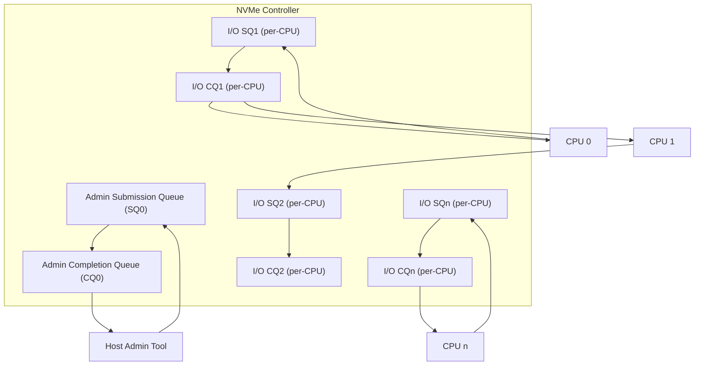
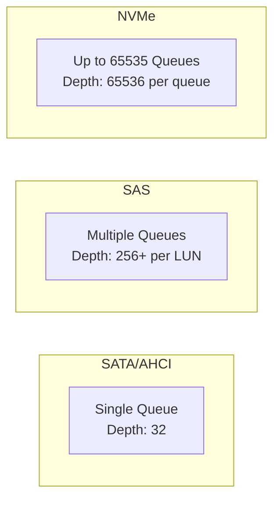
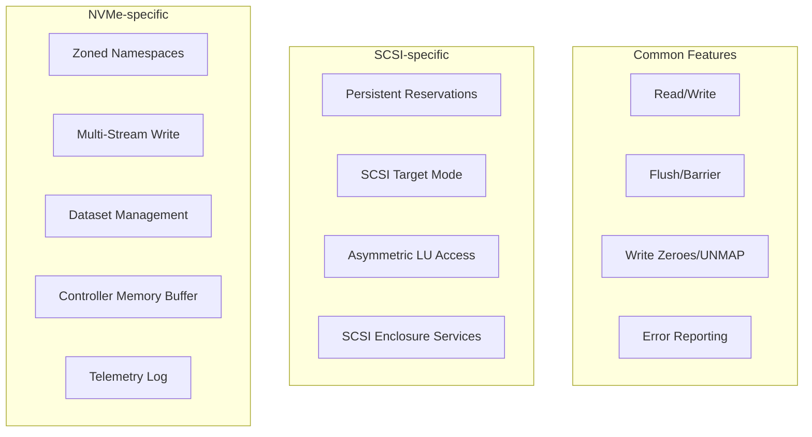

# SCSI and NVMe

## Introduction

SCSI and NVMe are the two dominant storage protocol stacks in Linux. SCSI (Small Computer Systems Interface) has been the workhorse of enterprise storage for decades, while NVMe (Non-Volatile Memory Express) was purpose-built for flash media. Understanding both is essential for anyone managing modern Linux storage.

This chapter dives deep into SCSI commands, NVMe queue architectures, performance characteristics, and the practical differences visible through `/dev/nvme*` device nodes.

## SCSI Architecture in Linux

The Linux SCSI subsystem is one of the most mature and complex components of the kernel. It handles actual SCSI hardware, SAS, SATA (via the `libata` translation layer), USB mass storage, Fibre Channel, and iSCSI.

### SCSI Command Descriptor Blocks (CDBs)

Every SCSI operation is expressed as a Command Descriptor Block (CDB). The most common CDBs are:

| Opcode | Command | Description |
|--------|---------|-------------|
| `0x00` | TEST UNIT READY | Check if device is ready |
| `0x03` | REQUEST SENSE | Get error information |
| `0x08` | READ(6) | Read data (legacy) |
| `0x12` | INQUIRY | Get device identification |
| `0x25` | READ CAPACITY(10) | Get device capacity |
| `0x28` | READ(10) | Read data |
| `0x2A` | WRITE(10) | Write data |
| `0x35` | SYNCHRONIZE CACHE | Flush write cache |
| `0x88` | READ(16) | Read data (large LBA) |
| `0x8A` | WRITE(16) | Write data (large LBA) |
| `0x9E` | SERVICE ACTION IN(16) | Various extended commands |

### SCSI CDB Structure (READ(16) Example)

```c
struct scsi_cdb_read16 {
    uint8_t  opcode;       /* 0x88 */
    uint8_t  flags;        /* protect, dpo, fua, etc. */
    uint64_t lba;          /* Logical Block Address (big-endian) */
    uint32_t transfer_len; /* Number of blocks */
    uint8_t  group_number; /* Command group */
    uint8_t  control;      /* Control byte */
} __attribute__((packed));
```

### Viewing SCSI Commands in Flight

You can trace SCSI commands using the kernel's tracing infrastructure:

```bash
# Enable SCSI tracing
echo 1 > /sys/kernel/debug/tracing/events/scsi/scsi_dispatch_cmd_done/enable
echo 1 > /sys/kernel/debug/tracing/events/scsi/scsi_dispatch_cmd_start/enable

# View trace
cat /sys/kernel/debug/tracing/trace_pipe | head -20
# <...>-1234  [001] d... 12345.678901: scsi_dispatch_cmd_start: host_no=0 channel=0 id=0 lun=0
#   tag=0 opcode=READ_10 cmd_len=10
# <...>-1234  [001] d... 12345.678902: scsi_dispatch_cmd_done: host_no=0 channel=0 id=0 lun=0
#   tag=0 result=GOOD

# Or use sg_raw for manual SCSI commands
sg_inq /dev/sda
# standard INQUIRY:
#   PQual=0  Device_type=0  RMB=0  version=0x06  [SPC-4]
#   [AERC=0] [TrmTsk=0] NormACA=0  HiSUP=0  Resp_data_format=2
#   SCCS=0  ACC=0  TPGS=0  3PC=0  Protect=0
#   BQue=0  EncServ=0  MultiP=0  MChngr=0  LINK=0  Sync=0
#   Vendor identification: ATA
#   Product identification: Samsung SSD 870
#   Product revision level: 1B6Q
```

### SCSI Sense Data

When a SCSI command fails, the device returns **sense data** describing the error:

```bash
# Check sense data with sg_ses
sg_requests /dev/sda
# request sense:  Fixed format, current;  Sense key: No Sense
#  Additional sense: No additional sense information

# Common sense keys:
# 0x0 = No Sense
# 0x1 = Recovered Error
# 0x2 = Not Ready
# 0x3 = Medium Error
# 0x5 = Illegal Request
# 0x6 = Unit Attention
# 0x7 = Data Protect
# 0xb = Aborted Command
```

## NVMe Architecture

NVMe was designed from scratch for non-volatile memory. Its architecture eliminates the bottlenecks inherent in SCSI's single-queue design.

### NVMe Queue Architecture



### NVMe Submission Queue Entry (SQE)

Each NVMe command is a 64-byte structure:

```c
struct nvme_command {
    union {
        struct nvme_common_command common;
        struct nvme_rw_command rw;        /* Read/Write */
        struct nvme_identify identify;
        struct nvme_features features;
        struct nvme_create_cq create_cq;
        struct nvme_create_sq create_sq;
        struct nvme_delete_queue delete_queue;
        struct nvme_abort_cmd abort;
        /* ... more command types */
    };
};

struct nvme_rw_command {
    __u8  opcode;        /* 0x02 = read, 0x01 = write */
    __u8  flags;
    __u16 command_id;
    __le32 nsid;         /* Namespace ID */
    __le64 rsvd2;
    __le64 metadata;
    __le64 slba;         /* Starting LBA */
    __le16 length;       /* Number of blocks - 1 */
    __le16 control;
    __le32 dsmgmt;       /* Dataset management */
    __le32 reftag;
    __le16 apptag;
    __le16 appmask;
};
```

### NVMe Completion Queue Entry (CQE)

Each completion is a 16-byte entry:

```c
struct nvme_completion {
    __le32 result;       /* Command-specific result */
    __u32  rsvd;
    __le16 sq_head;      /* Submission queue head pointer */
    __le16 sq_id;        /* Submission queue ID */
    __u16  command_id;   /* Matches the SQE command_id */
    __le16 status;       /* Status + phase bit */
};
```

The **phase bit** in the status field toggles with each wrap of the completion queue, allowing the controller to signal completion without a doorbell write.

### NVMe Admin vs I/O Commands

| Category | Examples | Queue |
|----------|----------|-------|
| Admin | Identify, Create/Delete SQ/CQ, Set Features, Get Log Page | Admin Queue (QID 0) |
| I/O | Read, Write, Flush, Write Zeroes, Compare, Dataset Management | I/O Queues (QID 1-N) |

## NVMe Device Nodes

Linux exposes NVMe devices through multiple device nodes:

```bash
# Character device: NVMe controller (admin interface)
ls -la /dev/nvme0
# crw------- 1 root root 10, 154 Jul 21 10:00 /dev/nvme0

# Block device: NVMe namespace
ls -la /dev/nvme0n1
# brw-rw---- 1 root disk 259, 0 Jul 21 10:00 /dev/nvme0n1

# Block device: partition on namespace
ls -la /dev/nvme0n1p1
# brw-rw---- 1 root disk 259, 1 Jul 21 10:00 /dev/nvme0n1p1

# Multi-namespace NVMe device
ls /dev/nvme1*
# /dev/nvme1     /dev/nvme1n1   /dev/nvme1n2   /dev/nvme1n1p1
```

### NVMe sysfs Interface

```bash
# Controller info
ls /sys/class/nvme/nvme0/
# address    firmware_rev  model        serial    subsystem  uevent
# cntlid     hwmoni        ng0          state     transport

cat /sys/class/nvme/nvme0/model
# Samsung SSD 970 EVO Plus 2TB

cat /sys/class/nvme/nvme0/serial
# S4EWNX0N123456

cat /sys/class/nvme/nvme0/firmware_rev
# 2B2QEXM7

cat /sys/class/nvme/nvme0/state
# live

cat /sys/class/nvme/nvme0/transport
# pcie

# Namespace info
ls /sys/class/nvme/nvme0/nvme0n1/
# capability  device  discard_alignment  events  ext_range  hidden
# holders  inflight  integrity  mq  ng0n1  partition  queue  range
# removable  ro  size  start  stat  subsystem  uevent

cat /sys/class/nvme/nvme0/nvme0n1/size
# 3907029168
```

## Performance Differences

### Queue Depth and Parallelism

The fundamental performance difference between SCSI and NVMe comes from queue architecture:



### Benchmarking SCSI vs NVMe

```bash
# Quick sequential read benchmark
# SCSI/SATA SSD
fio --name=seqread --filename=/dev/sda --rw=read --bs=1M \
    --ioengine=io_uring --direct=1 --size=1G --numjobs=1
# READ: bw=550MiB/s (577MB/s), 550MiB/s-550MiB/s

# NVMe SSD
fio --name=seqread --filename=/dev/nvme0n1 --rw=read --bs=1M \
    --ioengine=io_uring --direct=1 --size=1G --numjobs=1
# READ: bw=3400MiB/s (3565MB/s), 3400MiB/s-3400MiB/s

# Random 4K read (the real difference)
# SCSI/SATA SSD
fio --name=randread --filename=/dev/sda --rw=randread --bs=4k \
    --ioengine=io_uring --direct=1 --iodepth=32 --size=1G --numjobs=1
# READ: IOPS=95K, avg latency=335μs

# NVMe SSD
fio --name=randread --filename=/dev/nvme0n1 --rw=randread --bs=4k \
    --ioengine=io_uring --direct=1 --iodepth=32 --size=1G --numjobs=1
# READ: IOPS=500K, avg latency=63μs
```

### Latency Breakdown

| Operation | SCSI/SATA | NVMe |
|-----------|-----------|------|
| Command overhead | ~10μs | ~1μs |
| Controller latency | ~50μs | ~5μs |
| Media access (NAND) | ~25μs | ~25μs |
| Interrupt delivery | ~5μs | ~1μs |
| **Total (4K read)** | **~90μs** | **~32μs** |

## NVMe Management with nvme-cli

The `nvme-cli` tool provides comprehensive NVMe management:

```bash
# List all NVMe devices
nvme list
# Node             SN                   Model               Namespace Usage                      Format           FW Rev
# ---------------- -------------------- ------------------- --------- -------------------------- ---------------- -------
# /dev/nvme0n1     S4EWNX0N123456       Samsung SSD 970     1         1.23 TB / 2.00 TB          4 KiB + 0 B      2B2QEXM7

# Get SMART health info
nvme smart-log /dev/nvme0
# Smart Log for NVME device:nvme0 namespace-id:ffffffff
# critical_warning          : 0
# temperature               : 38°C (311 Kelvin)
# available_spare           : 100%
# available_spare_threshold : 10%
# percentage_used           : 2%
# data_units_read           : 12,345,678
# data_units_written        : 45,678,901
# host_read_commands        : 987,654,321
# host_write_commands       : 123,456,789
# controller_busy_time      : 1234
# power_cycles              : 567
# power_on_hours            : 8901
# unsafe_shutdowns          : 12

# Get error log
nvme error-log /dev/nvme0

# Get detailed controller identify
nvme id-ctrl -H /dev/nvme0

# Get namespace identify
nvme id-ns -H /dev/nvme0n1

# Format namespace (WARNING: destroys data!)
nvme format /dev/nvme0n1 --lbaf=1  # Use LBA format 1

# Set features (e.g., power management)
nvme set-feature /dev/nvme0 -f 0x02 -v 0x05  # Set power state to 5

# Get/Set write cache
nvme get-feature /dev/nvme0 -f 0x06  # Volatile Write Cache
nvme set-feature /dev/nvme0 -f 0x06 -v 1  # Enable write cache

# Firmware update
nvme fw-download /dev/nvme0 --fw=new_fw.bin
nvme fw-activate /dev/nvme0 --action=1
```

### NVMe Zoned Namespaces

Modern NVMe devices support Zoned Namespaces (ZNS), which align with the physical properties of NAND flash:

```bash
# Check if device supports ZNS
nvme id-ns -H /dev/nvme0n1 | grep "ZNS"
# ZNS: supported

# List zones
nvme zns report-zones /dev/nvme0n1
# nr_zones: 16384
# Zone 0: start=0x0, len=0x80000, wp=0x80000, type=SEQ_WRITE_REQUIRED, state=EMPTY
# Zone 1: start=0x80000, len=0x80000, wp=0x80000, type=SEQ_WRITE_REQUIRED, state=EMPTY
```

## SCSI Translation Layer (libata)

SATA devices in Linux go through `libata`, which translates between SCSI and ATA protocols:

```bash
# View ATA device info via SCSI layer
hdparm -I /dev/sda
# Model Number:    Samsung SSD 870 EVO 500GB
# Serial Number:   S5PWNX0N123456
# Firmware Rev:    1B6Q
# Transport:       Serial (SATA)

# libata parameters
ls /sys/module/libata/parameters/
# acpi_gtf       atapi_enabled     force           noacpi
# ata_probe_timeout  allow_tpm     ignore_hpa      ...
```

## Comparing SCSI and NVMe Feature Sets



## Kernel Module Information

```bash
# SCSI modules
modinfo sd_mod
# filename:    /lib/modules/.../kernel/drivers/scsi/sd_mod.ko
# description: SCSI disk (sd) driver
# license:     GPL

modinfo scsi_mod
# filename:    /lib/modules/.../kernel/drivers/scsi/scsi_mod.ko
# description: SCSI core

# NVMe modules
modinfo nvme
# filename:    /lib/modules/.../kernel/drivers/nvme/host/nvme.ko
# description: NVMe core
# license:     GPL

modinfo nvme_core
# filename:    /lib/modules/.../kernel/drivers/nvme/host/nvme-core.ko
# description: NVMe driver
# license:     GPL

# NVMe parameters
cat /sys/module/nvme_core/parameters/default_ps_max_latency_us
# 100000
```

## Tuning NVMe Performance

```bash
# Set I/O scheduler to 'none' for NVMe (bypass scheduling overhead)
echo none > /sys/block/nvme0n1/queue/scheduler

# Increase queue depth
echo 1023 > /sys/block/nvme0n1/queue/nr_requests

# Use poll mode for ultra-low latency
echo 1 > /sys/block/nvme0n1/queue/io_poll

# Set CPU affinity for NVMe IRQs
# Find NVMe IRQ numbers
grep nvme /proc/interrupts
#  51:   0   0   0   0   PCI-MSI 524288-edge      nvme0q0
#  52:   12345   0   0   0   PCI-MSI 524289-edge      nvme0q1
#  53:   0   67890   0   0   PCI-MSI 524290-edge      nvme0q2

# Pin NVMe queue interrupts to specific CPUs
echo 1 > /proc/irq/52/smp_affinity  # Queue 1 → CPU 0
echo 2 > /proc/irq/53/smp_affinity  # Queue 2 → CPU 1
```

## References

- [NVMe Base Specification 2.0](https://nvmexpress.org/specifications/)
- [Linux SCSI Documentation](https://www.kernel.org/doc/html/latest/scsi/)
- [nvme-cli GitHub](https://github.com/linux-nvme/nvme-cli)
- [SCSI Command Reference](https://www.seagate.com/files/staticfiles/support/docs/manual/Interface%20manuals/100293068j.pdf)

## Further Reading

- <https://www.kernel.org/doc/html/latest/driver-api/nvme.html> - Linux NVMe driver API
- <https://nvmexpress.org/educational-resources/> - NVMe educational resources
- <https://sg.danny.cz/sg/> - Linux SCSI Generic (sg) driver documentation
- <https://github.com/avocado-framework/avocado> - Test framework with SCSI/NVMe tests

## Related Topics

- [Storage Overview](overview.md)
- [Block I/O Layer](block-io.md)
- [Multipath I/O](multipath.md)
- [I/O Performance](../performance/io.md)
