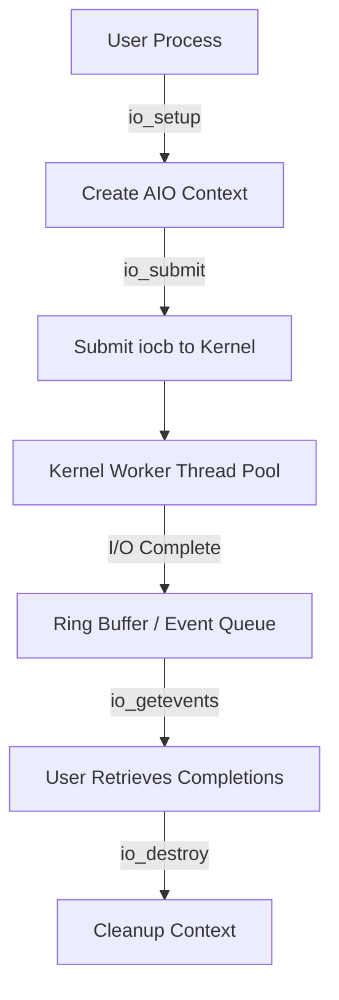
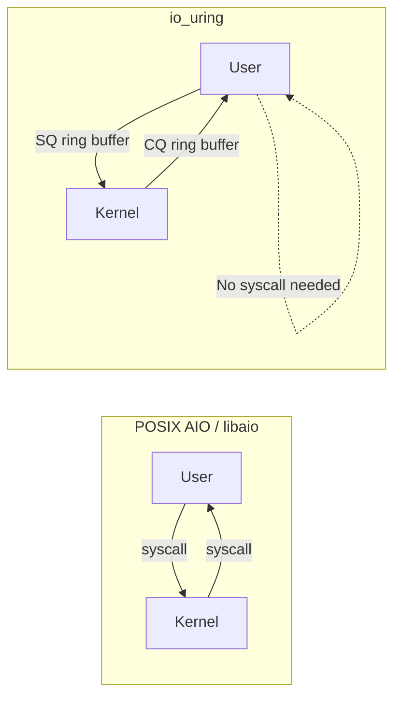
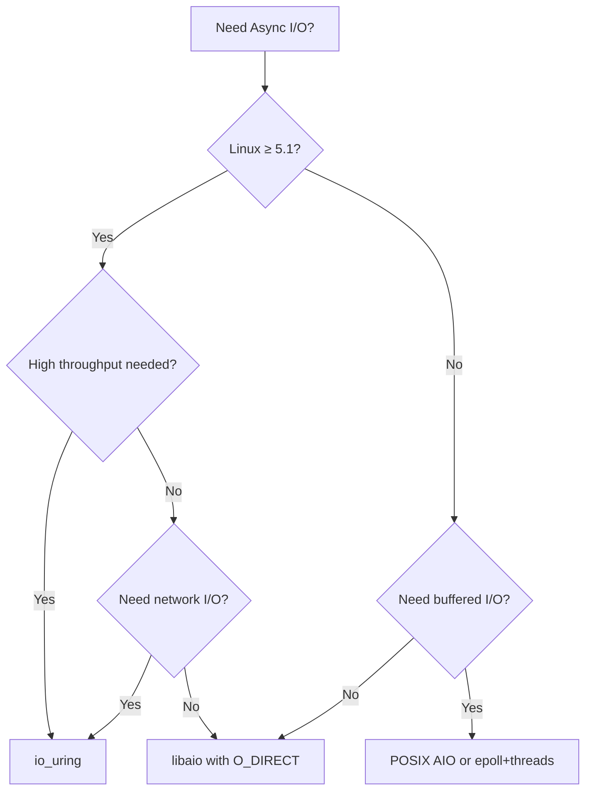

# POSIX AIO (Asynchronous I/O)

## Introduction

Asynchronous I/O allows a process to initiate I/O operations without blocking, continuing execution while the kernel performs the actual read or write. POSIX AIO (`aio_read`, `aio_write`, etc.) is the standardized interface, though Linux offers multiple async I/O mechanisms with different trade-offs.

This chapter covers POSIX AIO, Linux's native `io_submit`/`io_getevents` (libaio), and compares them with the modern `io_uring` interface.

## POSIX AIO Overview

POSIX AIO defines a set of functions that allow overlapped I/O. The caller submits a request and is notified later via one of three mechanisms:

1. **Signals** (`SIGEV_SIGNAL`) — deliver a signal on completion
2. **Threads** (`SIGEV_THREAD`) — spawn a callback in a new thread (glibc implementation)
3. **Polling** (`aio_error`/`aio_suspend`) — explicitly check or wait for completion

### Key Data Structure

```c
struct aiocb {
    int             aio_fildes;     /* File descriptor */
    off_t           aio_offset;     /* File offset */
    volatile void  *aio_buf;        /* Buffer location */
    size_t          aio_nbytes;     /* Length of transfer */
    int             aio_reqprio;    /* Request priority */
    struct sigevent aio_sigevent;   /* Notification method */
    int             aio_lio_opcode; /* Operation for lio_listio */

    /* Internal fields (kernel/glibc) */
    int __error_code;
    int __return_value;
};
```

### aio_read / aio_write

```c
#include <aio.h>
#include <fcntl.h>
#include <stdio.h>
#include <string.h>
#include <errno.h>
#include <unistd.h>

int main(void) {
    struct aiocb cb;
    memset(&cb, 0, sizeof(cb));

    int fd = open("/tmp/testfile", O_RDONLY);
    if (fd < 0) { perror("open"); return 1; }

    char buf[4096];
    cb.aio_fildes = fd;
    cb.aio_buf    = buf;
    cb.aio_nbytes = sizeof(buf);
    cb.aio_offset = 0;

    /* Submit async read */
    if (aio_read(&cb) < 0) {
        perror("aio_read");
        return 1;
    }

    /* Wait for completion */
    const struct aiocb *list[1] = { &cb };
    aio_suspend(list, 1, NULL);

    /* Check result */
    int ret = aio_return(&cb);
    printf("Read %d bytes: %.*s\n", ret, ret, buf);

    close(fd);
    return 0;
}
```

### glibc POSIX AIO Internals

On Linux, glibc implements POSIX AIO using **user-space threads** — one thread per pending request. This means:

- Each `aio_read()` or `aio_write()` spawns a new thread (or reuses one from a pool)
- The thread performs a synchronous `read()` or `write()` in the background
- Completion notification happens via the thread callback or signal

This design has significant overhead:

| Overhead Source | Impact |
|---|---|
| Thread creation | ~50–100 μs per request (without pool) |
| Context switching | Kernel scheduler overhead |
| Memory | Each thread needs a stack (~8 KB default) |
| Scalability | Thousands of threads = thousands of stacks |

```bash
# Verify glibc AIO uses threads
$ strace -f ./aio_demo 2>&1 | grep clone
clone(child_stack=NULL, flags=CLONE_CHILD_CLEARTID|...) = 12345
clone(child_stack=NULL, flags=CLONE_CHILD_CLEARTID|...) = 12346
```

For these reasons, POSIX AIO on Linux is generally **not recommended** for high-performance applications. Use `io_uring` or `epoll`+non-blocking I/O instead.

## Signal-Based AIO Notification

POSIX AIO can notify completion via signals instead of polling:

```c
#include <aio.h>
#include <signal.h>
#include <fcntl.h>
#include <stdio.h>
#include <string.h>
#include <unistd.h>

static volatile int aio_done = 0;

static void aio_handler(int sig, siginfo_t *info, void *context) {
    struct aiocb *cb = (struct aiocb *)info->si_value.sival_ptr;
    int ret = aio_return(cb);
    printf("AIO complete: read %d bytes\n", ret);
    aio_done = 1;
}

int main(void) {
    /* Set up signal handler */
    struct sigaction sa;
    sa.sa_sigaction = aio_handler;
    sa.sa_flags = SA_SIGINFO;
    sigemptyset(&sa.sa_mask);
    sigaction(SIGUSR1, &sa, NULL);

    /* Prepare AIO request */
    struct aiocb cb;
    char buf[4096];
    memset(&cb, 0, sizeof(cb));
    cb.aio_fildes = open("/tmp/testfile", O_RDONLY);
    cb.aio_buf = buf;
    cb.aio_nbytes = sizeof(buf);
    cb.aio_offset = 0;

    /* Request signal on completion */
    cb.aio_sigevent.sigev_notify = SIGEV_SIGNAL;
    cb.aio_sigevent.sigev_signo = SIGUSR1;
    cb.aio_sigevent.sigev_value.sival_ptr = &cb;

    /* Submit */
    aio_read(&cb);

    /* Wait for signal */
    while (!aio_done) {
        pause();  /* Block until signal arrives */
    }

    close(cb.aio_fildes);
    return 0;
}
```

## lio_listio — Batch Submission

`lio_listio` submits multiple operations in a single call, reducing syscall overhead:

```c
#include <aio.h>

int lio_listio(int mode, struct aiocb *const list[], int nent,
               struct sigevent *sig);
```

- `LIO_WAIT` — block until all operations complete
- `LIO_NOWAIT` — return immediately; notify via `sig`

```c
struct aiocb cb1, cb2;
/* ... initialize cb1 for read, cb2 for write ... */
cb1.aio_lio_opcode = LIO_READ;
cb2.aio_lio_opcode = LIO_WRITE;

struct aiocb *list[] = { &cb1, &cb2 };
lio_listio(LIO_WAIT, list, 2, NULL);
```

### lio_listio with Signal Notification

For non-blocking batch operations with notification:

```c
#include <aio.h>
#include <signal.h>
#include <string.h>
#include <stdio.h>

static volatile int completed = 0;

static void batch_handler(int sig) {
    completed = 1;
}

int main(void) {
    signal(SIGUSR1, batch_handler);

    struct aiocb cbs[10];
    char bufs[10][4096];
    struct aiocb *list[10];

    for (int i = 0; i < 10; i++) {
        memset(&cbs[i], 0, sizeof(cbs[i]));
        cbs[i].aio_fildes = open("/tmp/testfile", O_RDONLY);
        cbs[i].aio_buf = bufs[i];
        cbs[i].aio_nbytes = 4096;
        cbs[i].aio_offset = i * 4096;
        cbs[i].aio_lio_opcode = LIO_READ;
        list[i] = &cbs[i];
    }

    /* Notification when all complete */
    struct sigevent sig;
    memset(&sig, 0, sizeof(sig));
    sig.sigev_notify = SIGEV_SIGNAL;
    sig.sigev_signo = SIGUSR1;

    lio_listio(LIO_NOWAIT, list, 10, &sig);

    /* Do other work while I/O proceeds */
    while (!completed) {
        /* ... */
    }

    for (int i = 0; i < 10; i++) {
        ssize_t ret = aio_return(&cbs[i]);
        printf("Read %zd bytes from chunk %d\n", ret, i);
        close(cbs[i].aio_fildes);
    }
    return 0;
}
```

## Linux Native AIO: libaio (io_submit)

The Linux kernel provides its own async I/O interface, distinct from POSIX AIO. glibc's POSIX AIO on Linux historically used **user-space threads** (one per request!), making it inefficient. The native interface avoids this.

### Architecture



### System Calls

```c
#include <libaio.h>
#include <fcntl.h>
#include <stdio.h>
#include <string.h>
#include <unistd.h>

int main(void) {
    io_context_t ctx = 0;
    int fd = open("/tmp/testfile", O_RDONLY | O_DIRECT);

    /* Create context for up to 128 concurrent ops */
    int ret = io_setup(128, &ctx);
    if (ret < 0) { perror("io_setup"); return 1; }

    /* Prepare I/O control block */
    struct iocb cb;
    char buf[4096] __attribute__((aligned(512)));
    memset(&cb, 0, sizeof(cb));
    cb.aio_fildes  = fd;
    cb.aio_lio_opcode = IO_CMD_PREAD;
    cb.u.c.buf    = buf;
    cb.u.c.nbytes = sizeof(buf);
    cb.u.c.offset = 0;

    /* Submit */
    struct iocb *cbs[1] = { &cb };
    ret = io_submit(ctx, 1, cbs);
    if (ret != 1) { perror("io_submit"); return 1; }

    /* Wait for completion */
    struct io_event events[1];
    ret = io_getevents(ctx, 1, 1, events, NULL);
    printf("Read %ld bytes\n", events[0].res);

    io_destroy(ctx);
    close(fd);
    return 0;
}
```

Compile with `-laio`:

```bash
gcc -o aio_demo aio_demo.c -laio
```

### libaio Limitations

| Limitation | Detail |
|---|---|
| `O_DIRECT` required | Buffered I/O falls back to synchronous |
| Thread pool size | Limited kernel worker threads (tunable via `/proc/sys/fs/aio-max-nr`) |
| No buffered read | Can't async-read page cache hits |
| Scalability | Thread-per-request model at kernel level |

## io_uring: The Modern Alternative

Introduced in Linux 5.1, `io_uring` is the successor to both POSIX AIO and libaio, designed for high-performance async I/O with minimal syscall overhead.

### Architecture Comparison



### io_uring Key Concepts

- **Submission Queue (SQ)**: Ring buffer where user posts I/O requests
- **Completion Queue (CQ)**: Ring buffer where kernel posts completions
- **No syscalls needed** for submit/reap when using `IORING_SETUP_SQPOLL`

```c
#include <liburing.h>
#include <fcntl.h>
#include <stdio.h>
#include <string.h>
#include <unistd.h>

int main(void) {
    struct io_uring ring;
    io_uring_queue_init(8, &ring, 0);

    int fd = open("/tmp/testfile", O_RDONLY);
    char buf[4096];

    /* Get a submission queue entry */
    struct io_uring_sqe *sqe = io_uring_get_sqe(&ring);

    /* Prepare a read operation */
    io_uring_prep_read(sqe, fd, buf, sizeof(buf), 0);

    /* Submit and wait */
    io_uring_submit(&ring);

    struct io_uring_cqe *cqe;
    io_uring_wait_cqe(&ring, &cqe);
    printf("Read %d bytes\n", cqe->res);
    io_uring_cqe_seen(&ring, cqe);

    io_uring_queue_exit(&ring);
    close(fd);
    return 0;
}
```

```bash
gcc -o uring_demo uring_demo.c -luring
```

### io_uring Advanced Features

**SQPOLL mode** — kernel thread polls the SQ, eliminating `io_uring_submit()` syscalls:

```c
struct io_uring_params params;
memset(&params, 0, sizeof(params));
params.flags = IORING_SETUP_SQPOLL;
params.sq_thread_idle = 2000;  /* Kernel thread idle timeout (ms) */

struct io_uring ring;
io_uring_queue_init_params(8, &ring, &params);

/* Now submissions don't need a syscall — kernel thread polls the SQ */
struct io_uring_sqe *sqe = io_uring_get_sqe(&ring);
io_uring_prep_read(sqe, fd, buf, sizeof(buf), 0);
io_uring_sqe_set_data(sqe, my_context);
/* No io_uring_submit() needed in SQPOLL mode */
```

**Registered buffers** — pre-register buffers with the kernel to avoid per-I/O mapping:

```c
/* Register buffers once */
struct iovec iovecs[4];
for (int i = 0; i < 4; i++) {
    iovecs[i].iov_base = aligned_alloc(4096, 65536);
    iovecs[i].iov_len = 65536;
}
io_uring_register_buffers(&ring, iovecs, 4);

/* Use registered buffer index instead of pointer */
struct io_uring_sqe *sqe = io_uring_get_sqe(&ring);
io_uring_prep_read_fixed(sqe, fd, NULL, 65536, 0, 1);  /* buffer index 1 */
```

**Linked operations** — chain I/O operations so they execute in sequence:

```c
/* Read then write — linked */
struct io_uring_sqe *sqe1 = io_uring_get_sqe(&ring);
io_uring_prep_read(sqe1, in_fd, buf, 4096, 0);
sqe1->flags |= IOSQE_IO_LINK;

struct io_uring_sqe *sqe2 = io_uring_get_sqe(&ring);
io_uring_prep_write(sqe2, out_fd, buf, 4096, 0);

io_uring_submit(&ring);
/* sqe2 only executes if sqe1 succeeds */
```

### io_uring Multishot Operations

Since Linux 6.0, **multishot** operations allow a single submission to generate multiple completions — ideal for accept loops and receive operations:

```c
/* Multishot accept: one submission, many connections */
struct io_uring_sqe *sqe = io_uring_get_sqe(&ring);
io_uring_prep_multishot_accept(sqe, listen_fd, NULL, NULL, 0);
io_uring_sqe_set_data64(sqe, ACCEPT_COOKIE);
io_uring_submit(&ring);

/* Each new connection generates a CQE */
while (1) {
    struct io_uring_cqe *cqe;
    io_uring_wait_cqe(&ring, &cqe);
    if (cqe->res >= 0) {
        int client_fd = cqe->res;
        handle_client(client_fd);
    }
    io_uring_cqe_seen(&ring, cqe);
}
```

### Performance Comparison

| Feature | POSIX AIO | libaio | io_uring |
|---|---|---|---|
| Buffered I/O | ✅ (threads) | ❌ | ✅ |
| Zero syscall overhead | ❌ | ❌ | ✅ (SQPOLL) |
| Batch submission | `lio_listio` | `io_submit` batch | Ring buffer |
| Network I/O | ❌ | ❌ | ✅ |
| File descriptors | Regular files | `O_DIRECT` only | Any FD |
| Kernel version | Any | Any | ≥ 5.1 |
| Polling mode | ❌ | ❌ | ✅ (`IORING_SETUP_SQPOLL`) |

## Choosing the Right Interface



### When to Use Each Interface

| Use Case | Recommended Interface |
|---|---|
| New high-performance server (Linux ≥ 5.1) | `io_uring` |
| Database with O_DIRECT | `io_uring` or `libaio` |
| Portable POSIX application | `epoll` + non-blocking I/O |
| Simple file copy utility | Synchronous `read()`/`write()` |
| Legacy Linux (< 5.1) | `epoll` + thread pool |
| Network server | `io_uring` or `epoll` |

## Error Handling Patterns

All async I/O interfaces require careful error handling:

### POSIX AIO Error Handling

```c
if (aio_read(&cb) < 0) {
    perror("aio_read");
    return -1;
}

/* After completion */
int err = aio_error(&cb);
if (err == EINPROGRESS) {
    /* Still pending */
} else if (err != 0) {
    /* Error occurred */
    fprintf(stderr, "AIO error: %s\n", strerror(err));
} else {
    /* Success */
    ssize_t bytes = aio_return(&cb);
}
```

### io_uring Error Handling

```c
struct io_uring_cqe *cqe;
io_uring_wait_cqe(&ring, &cqe);

if (cqe->res < 0) {
    /* cqe->res is -errno */
    fprintf(stderr, "I/O error: %s\n", strerror(-cqe->res));
} else if (cqe->res == 0 && expected > 0) {
    /* EOF */
} else {
    /* Success: cqe->res = bytes transferred */
    process_data(buf, cqe->res);
}
io_uring_cqe_seen(&ring, cqe);
```

## O_DIRECT Alignment Requirements

Both `libaio` and direct I/O with `io_uring` require proper alignment:

```c
/* O_DIRECT requires: */
/* - Buffer aligned to filesystem block size (typically 512 or 4096) */
/* - Offset aligned to filesystem block size */
/* - Size is a multiple of filesystem block size */

void *buf;
posix_memalign(&buf, 4096, 4096);  /* Aligned allocation */
int fd = open("file", O_RDONLY | O_DIRECT);
pread(fd, buf, 4096, 0);  /* Offset 0, size 4096 — all aligned */
```

```bash
# Check filesystem block size
$ stat -f /tmp
  Block size: 4096

# Or via /proc
$ cat /proc/mounts | grep /tmp
tmpfs /tmp tmpfs rw,nosuid,nodev 0 0
```

## Practical Example: aio_cmp.c

A comparative program that measures POSIX AIO vs synchronous reads:

```c
#include <aio.h>
#include <fcntl.h>
#include <stdio.h>
#include <string.h>
#include <time.h>
#include <unistd.h>

#define NUM_FILES 100
#define BUFSIZE   4096

static void sync_read_test(const char **files, int n) {
    char buf[BUFSIZE];
    struct timespec start, end;
    clock_gettime(CLOCK_MONOTONIC, &start);

    for (int i = 0; i < n; i++) {
        int fd = open(files[i], O_RDONLY);
        if (fd >= 0) {
            while (read(fd, buf, BUFSIZE) > 0) {}
            close(fd);
        }
    }
    clock_gettime(CLOCK_MONOTONIC, &end);
    double ms = (end.tv_sec - start.tv_sec) * 1000.0 +
                (end.tv_nsec - start.tv_nsec) / 1e6;
    printf("Sync: %.2f ms\n", ms);
}

static void aio_read_test(const char **files, int n) {
    struct aiocb cbs[NUM_FILES];
    char bufs[NUM_FILES][BUFSIZE];
    struct timespec start, end;
    clock_gettime(CLOCK_MONOTONIC, &start);

    for (int i = 0; i < n; i++) {
        memset(&cbs[i], 0, sizeof(cbs[i]));
        cbs[i].aio_fildes  = open(files[i], O_RDONLY);
        cbs[i].aio_buf     = bufs[i];
        cbs[i].aio_nbytes  = BUFSIZE;
        cbs[i].aio_offset  = 0;
        if (cbs[i].aio_fildes >= 0)
            aio_read(&cbs[i]);
    }

    /* Wait for all */
    const struct aiocb *list[NUM_FILES];
    for (int i = 0; i < n; i++) list[i] = &cbs[i];
    aio_suspend(list, n, NULL);

    for (int i = 0; i < n; i++) {
        aio_return(&cbs[i]);
        close(cbs[i].aio_fildes);
    }
    clock_gettime(CLOCK_MONOTONIC, &end);
    double ms = (end.tv_sec - start.tv_sec) * 1000.0 +
                (end.tv_nsec - start.tv_nsec) / 1e6;
    printf("AIO:  %.2f ms\n", ms);
}
```

## Summary

- **POSIX AIO** is portable but glibc's Linux implementation uses threads (slow)
- **libaio** provides kernel-level async I/O but requires `O_DIRECT`
- **io_uring** is the modern gold standard: zero-copy ring buffers, batch submission, and support for all I/O types
- For new code targeting Linux ≥ 5.1, prefer `io_uring`
- For portable code, POSIX AIO with awareness of its limitations

## References

- [The Linux Kernel Documentation](https://docs.kernel.org/)
- [LWN.net - Linux and free software news](https://lwn.net/)
- [GNU Project Documentation](https://www.gnu.org/doc/doc.html)
- [GNU Manuals](https://www.gnu.org/manual/manual.html)
- [Free Software Directory](https://directory.fsf.org/wiki/Main_Page)
- [Planet GNU](https://planet.gnu.org/)
- [Free Software Books](https://www.gnu.org/doc/other-free-books.html)

- [Linux io_uring documentation](https://kernel.dk/io_uring.pdf) — Jens Axboe
- [libaio source and man pages](https://pagure.io/libaio)
- [io_uring man pages](https://unix.systems/man/io_uring.7)
- POSIX AIO specification: `man 7 aio`
- [Efficient IO with io_uring](https://kernel.dk/io_uring.pdf)

## Related Topics

- [Event-Driven Programming](./event-driven.md) — reactor/proactor patterns
- [poll and select](./poll-select.md) — synchronous multiplexing alternatives
- [Memory Management](./memory.md) — `O_DIRECT` alignment requirements and mmap
