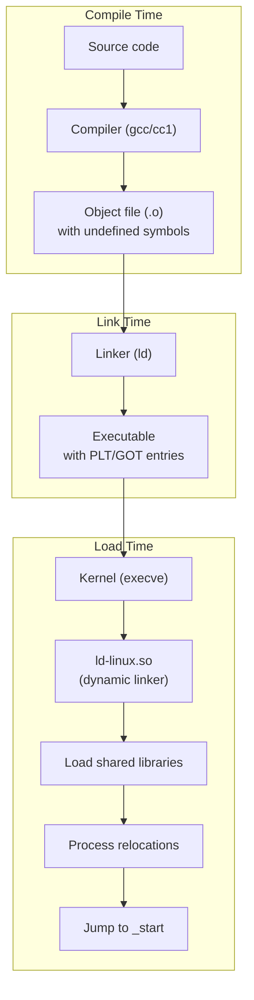
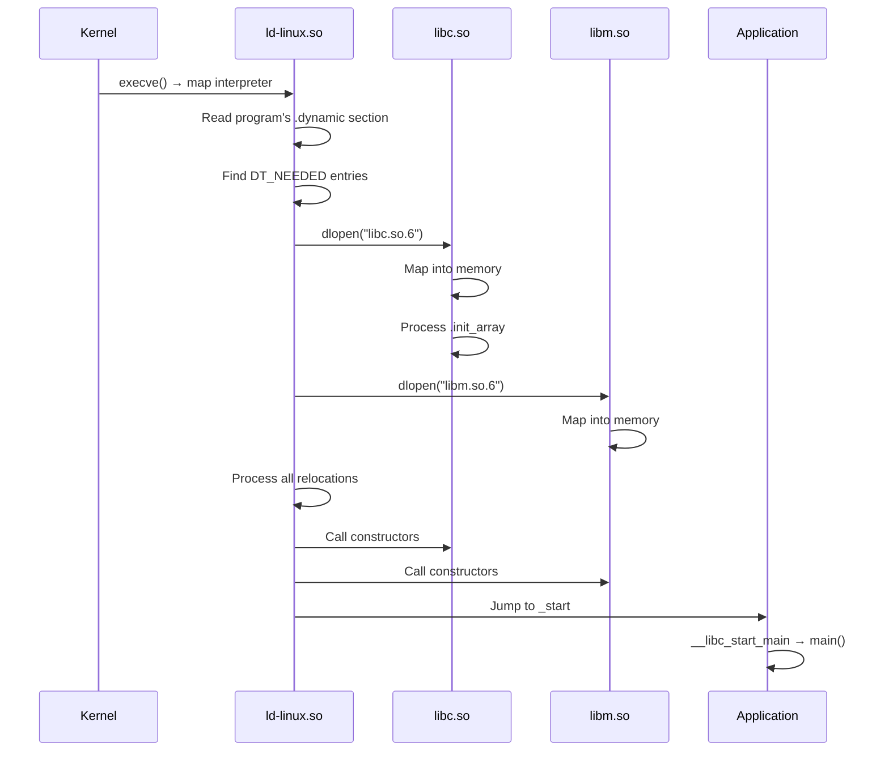
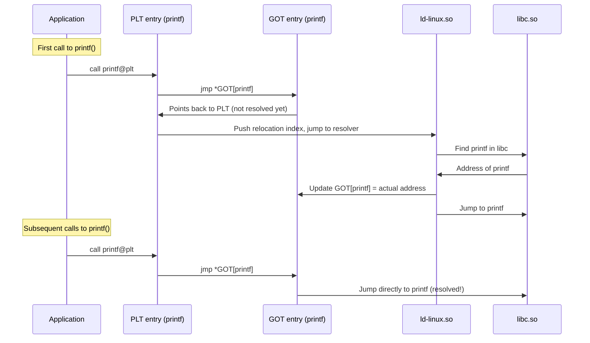

# Dynamic Linking

## Introduction

Dynamic linking is the process of resolving symbol references between separately compiled code units at **runtime** rather than at compile time. It enables shared libraries (`.so` files on Linux) to be loaded into memory once and shared among multiple processes, reducing memory usage and enabling library updates without recompilation.

On Linux, the dynamic linker is `ld-linux.so` (also known as `ld-linux-x86-64.so.2` on x86-64). It's responsible for loading shared libraries, performing relocations, and transferring control to the program's entry point.

## How Dynamic Linking Works

### The Linking Process



### Runtime Loading Sequence



## Shared Libraries

### Creating a Shared Library

```c
/* mathlib.c */
#include <math.h>

double square(double x) {
    return x * x;
}

double cube(double x) {
    return x * x * x;
}

const char *lib_version(void) {
    return "mathlib 1.0";
}
```

```c
/* mathlib.h */
#ifndef MATHLIB_H
#define MATHLIB_H

double square(double x);
double cube(double x);
const char *lib_version(void);

#endif
```

```bash
# Compile with position-independent code
$ gcc -fPIC -c mathlib.c -o mathlib.o

# Create shared library
$ gcc -shared -o libmathlib.so mathlib.o

# Or combine steps
$ gcc -fPIC -shared -o libmathlib.so mathlib.c

# Set soname (embedded name for runtime)
$ gcc -fPIC -shared -Wl,-soname,libmathlib.so.1 -o libmathlib.so.1.0.0 mathlib.c

# Create symlinks
$ ln -sf libmathlib.so.1.0.0 libmathlib.so.1
$ ln -sf libmathlib.so.1.0.0 libmathlib.so
```

### Using a Shared Library

```c
/* main.c */
#include <stdio.h>
#include "mathlib.h"

int main(void)
{
    printf("square(5) = %.0f\n", square(5));
    printf("cube(3) = %.0f\n", cube(3));
    printf("Version: %s\n", lib_version());
    return 0;
}
```

```bash
# Compile and link
$ gcc -o main main.c -L. -lmathlib

# Run with library path
$ LD_LIBRARY_PATH=. ./main
square(5) = 25
cube(3) = 27
Version: mathlib 1.0
```

### Library Naming Convention

```
lib<name>.so.<major>.<minor>.<patch>
│      │    │    │       │       └─ Patch version (bug fixes)
│      │    │    │       └───────── Minor version (backward compatible)
│      │    │    └──────────────── Major version (ABI changes)
│      │    └───────────────────── Shared object
│      └────────────────────────── Library name
└───────────────────────────────── Library prefix
```

## PLT and GOT

The **Procedure Linkage Table (PLT)** and **Global Offset Table (GOT)** are the core mechanisms that make position-independent dynamic linking work.

### The Global Offset Table (GOT)

The GOT is an array of absolute addresses. For position-independent code that can't use absolute addresses directly, the GOT provides a fixed offset table that the dynamic linker fills in at load time.

```c
/* GOT structure (simplified) */
extern void *_GLOBAL_OFFSET_TABLE_[];

/* GOT[0]: Address of _DYNAMIC section */
/* GOT[1]: Linker identifier */
/* GOT[2]: Lazy resolution entry point */
/* GOT[3+]: Function addresses and data addresses */
```

### The Procedure Linkage Table (PLT)

The PLT is a trampoline mechanism for **lazy binding** of function calls. Instead of resolving all function addresses at load time, PLT defers resolution until the first call.

### How PLT/GOT Lazy Binding Works



### Disassembly of PLT

```bash
$ objdump -d -j .plt /bin/ls | head -30

Disassembly of section .plt:

0000000000005a40 <.plt>:
    5a40:   ff 35 ea c7 00 00    push   0xc7ea(%rip)  # 12230 <_GLOBAL_OFFSET_TABLE_+0x8>
    5a46:   ff 25 ec c7 00 00    jmp    *0xc7ec(%rip)  # 12238 <_GLOBAL_OFFSET_TABLE_+0x10>
    5a4c:   0f 1f 40 00          nopl   0x0(%rax)

0000000000005a50 <getenv@plt>:
    5a50:   ff 25 ea c7 00 00    jmp    *0xc7ea(%rip)  # 12240 <getenv@GLIBC_2.2.5>
    5a56:   68 00 00 00 00       push   $0x0
    5a5b:   e9 e0 ff ff ff       jmp    5a40 <.plt>

0000000000005a60 <__ctype_toupper_loc@plt>:
    5a60:   ff 25 e2 c7 00 00    jmp    *0xc7e2(%rip)  # 12248
    5a66:   68 01 00 00 00       push   $0x1
    5a6b:   e9 d0 ff ff ff       jmp    5a40 <.plt>
```

### GOT Entries

```bash
$ objdump -R /bin/ls | head -10

DYNAMIC RELOCATION RECORDS
OFFSET           TYPE              VALUE
000000000012240  R_X86_64_GLOB_DAT  __ctype_toupper_loc@GLIBC_2.3
000000000012248  R_X86_64_GLOB_DAT  __ctype_b_loc@GLIBC_2.3
000000000012250  R_X86_64_GLOB_DAT  stdout@GLIBC_2.2.5
000000000012258  R_X86_64_JUMP_SLOT  getenv@GLIBC_2.2.5
000000000012260  R_X86_64_JUMP_SLOT  __ctype_toupper_loc@GLIBC_2.3
```

## The Dynamic Linker: ld-linux.so

### Finding Libraries

The dynamic linker searches for shared libraries in this order:

1. **DT_RPATH** in the executable (deprecated)
2. **LD_LIBRARY_PATH** environment variable
3. **DT_RUNPATH** in the executable
4. `/etc/ld.so.cache` (compiled cache)
5. `/lib` and `/usr/lib`

```bash
# View library search path for a binary
$ readelf -d /bin/ls | grep -E 'NEEDED|RPATH|RUNPATH'
 0x0000000000000001 (NEEDED)  Shared library: [libselinux.so.1]
 0x0000000000000001 (NEEDED)  Shared library: [libc.so.6]

# Set RUNPATH at link time
$ gcc -o main main.c -Wl,-rpath,/opt/mylib -L/opt/mylib -lmathlib

# Verify
$ readelf -d main | grep RUNPATH
 0x000000000000001d (RUNPATH)  Library runpath: [/opt/mylib]
```

### /etc/ld.so.cache

The cache is generated by `ldconfig` and maps library names to paths:

```bash
# Regenerate cache (after installing new libraries)
$ sudo ldconfig

# View cached libraries
$ ldconfig -p | grep libm
    libm.so.6 (libc6,x86-64) => /lib/x86_64-linux-gnu/libm.so.6

# Add custom library path
$ echo "/opt/mylib" | sudo tee /etc/ld.so.conf.d/mylib.conf
$ sudo ldconfig

# Search with ldconfig
$ ldconfig -p | grep mathlib
```

### ldd — List Shared Library Dependencies

```bash
$ ldd /bin/ls
    linux-vdso.so.1 (0x00007ffd5b1fe000)
    libselinux.so.1 => /lib/x86_64-linux-gnu/libselinux.so.1 (0x00007f8a12340000)
    libc.so.6 => /lib/x86_64-linux-gnu/libc.so.6 (0x00007f8a12150000)
    libpcre2-8.so.0 => /lib/x86_64-linux-gnu/libpcre2-8.so.0 (0x00007f8a120b0000)
    /lib64/ld-linux-x86-64.so.2 (0x00007f8a12500000)

# Recursive dependencies
$ ldd /bin/ls | wc -l
5

# Find which package provides a library
$ dpkg -S libm.so.6
libc6: /lib/x86_64-linux-gnu/libm.so.6
```

**Warning**: Never run `ldd` on untrusted binaries—it executes the program's constructors. Use `readelf -d` instead:

```bash
# Safe alternative
$ readelf -d /untrusted/binary | grep NEEDED
```

## LD_PRELOAD — Library Interposition

`LD_PRELOAD` allows you to inject a shared library that overrides symbols from other libraries. This is a powerful debugging and testing technique.

### Example: Intercepting malloc

```c
/* my_malloc.c */
#define _GNU_SOURCE
#include <dlfcn.h>
#include <stdio.h>
#include <stdlib.h>

static void *(*real_malloc)(size_t) = NULL;
static int malloc_count = 0;

void *malloc(size_t size)
{
    if (!real_malloc)
        real_malloc = dlsym(RTLD_NEXT, "malloc");

    void *ptr = real_malloc(size);
    malloc_count++;
    fprintf(stderr, "malloc(%zu) = %p (count: %d)\n", size, ptr, malloc_count);
    return ptr;
}
```

```bash
# Compile as shared library
$ gcc -fPIC -shared -o libmymalloc.so my_malloc.c -ldl

# Use with any program
$ LD_PRELOAD=./libmymalloc.so ls /tmp
malloc(120) = 0x55a1234 (count: 1)
malloc(40) = 0x55a12bc (count: 2)
...
```

### Example: Overriding open()

```c
/* trace_open.c */
#define _GNU_SOURCE
#include <dlfcn.h>
#include <stdio.h>
#include <fcntl.h>
#include <stdarg.h>

static int (*real_open)(const char *, int, ...) = NULL;

int open(const char *pathname, int flags, ...)
{
    if (!real_open)
        real_open = dlsym(RTLD_NEXT, "open");

    mode_t mode = 0;
    if (flags & O_CREAT) {
        va_list args;
        va_start(args, flags);
        mode = va_arg(args, mode_t);
        va_end(args);
    }

    fprintf(stderr, "open(\"%s\", 0x%x) → ", pathname, flags);
    int fd = real_open(pathname, flags, mode);
    fprintf(stderr, "%d\n", fd);
    return fd;
}
```

```bash
$ gcc -fPIC -shared -o trace_open.so trace_open.c -ldl
$ LD_PRELOAD=./trace_open.so cat /etc/hostname
open("/etc/hostname", 0x0) → 3
example
```

### Security Implications

`LD_PRELOAD` is a security concern in setuid programs:

```bash
# LD_PRELOAD is IGNORED for setuid/setgid programs
$ chmod u+s /usr/bin/myprogram
$ LD_PRELOAD=./evil.so /usr/bin/myprogram
# Preload is ignored — safe
```

## Runtime Linking API: dlopen/dlsym

```c
#include <dlfcn.h>

void *dlopen(const char *filename, int flags);
void *dlsym(void *handle, const char *symbol);
int dlclose(void *handle);
char *dlerror(void);
```

### Plugin Architecture

```c
#include <dlfcn.h>
#include <stdio.h>
#include <stdlib.h>

/* Plugin interface */
typedef struct {
    const char *(*get_name)(void);
    int (*process)(const char *input, char *output, size_t outsize);
} plugin_t;

int main(void)
{
    /* Load plugin dynamically */
    void *handle = dlopen("./plugin_echo.so", RTLD_LAZY);
    if (!handle) {
        fprintf(stderr, "dlopen: %s\n", dlerror());
        return 1;
    }

    /* Find plugin's interface structure */
    plugin_t *plugin = dlsym(handle, "plugin_interface");
    if (!plugin) {
        fprintf(stderr, "dlsym: %s\n", dlerror());
        dlclose(handle);
        return 1;
    }

    printf("Plugin: %s\n", plugin->get_name());

    char output[256];
    plugin->process("Hello", output, sizeof(output));
    printf("Result: %s\n", output);

    /* Unload */
    dlclose(handle);
    return 0;
}
```

```c
/* plugin_echo.c */
#include <string.h>
#include <stdio.h>

static const char *get_name(void) { return "Echo Plugin"; }

static int process(const char *input, char *output, size_t outsize)
{
    snprintf(output, outsize, "Echo: %s", input);
    return 0;
}

/* Export the interface */
__attribute__((visibility("default")))
struct {
    const char *(*get_name)(void);
    int (*process)(const char *, char *, size_t);
} plugin_interface = {
    .get_name = get_name,
    .process = process
};
```

```bash
$ gcc -fPIC -shared -o plugin_echo.so plugin_echo.c
$ gcc -o app app.c -ldl
$ ./app
Plugin: Echo Plugin
Result: Echo: Hello
```

### dlopen Flags

| Flag | Meaning |
|------|---------|
| `RTLD_LAZY` | Lazy binding (PLT-style) |
| `RTLD_NOW` | Resolve all symbols immediately |
| `RTLD_GLOBAL` | Symbols available for subsequent loads |
| `RTLD_LOCAL` | Symbols not available (default) |
| `RTLD_NOLOAD` | Don't load, just check if loaded |
| `RTLD_NODELETE` | Never unload |
| `RTLD_DEEPBIND` | Prefer own symbols over global |

## Symbol Versioning

Linux uses symbol versioning to maintain backward compatibility:

```bash
# View version requirements
$ readelf -V /lib/x86_64-linux-gnu/libc.so.6

Version needs section '.gnu.version_r' contains 2 entries:
 Addr: 0x0000000000022a78  Offset: 0x00022a78  Link: 5 (.dynstr)
  000000: Version: 1  File: ld-linux-x86-64.so.2  Cnt: 1
  0x0010:   Name: GLIBC_2.34  Flags: none  Version: 7

# View defined versions
$ objdump -T /lib/x86_64-linux-gnu/libc.so.6 | grep "GLIBC_2.17"
000000000008c840 g    DF .text  000000000000002b  GLIBC_2.17  clock_gettime
00000000000f2d00 g    DF .text  000000000000001a  GLIBC_2.17  clock_nanosleep
```

### Version Scripts

Control which symbols are exported:

```c
/* version.map */
GLIBC_2.17 {
    global:
        clock_gettime;
        clock_nanosleep;
    local:
        *;
};

MYLIB_1.0 {
    global:
        my_function;
        my_other_function;
};

MYLIB_1.1 {
    global:
        my_new_function;
} MYLIB_1.0;
```

```bash
$ gcc -fPIC -shared -Wl,--version-script=version.map -o libfoo.so foo.c
```

## Controlling Dynamic Linker Behavior

### Environment Variables

| Variable | Effect |
|----------|--------|
| `LD_LIBRARY_PATH` | Additional library search path |
| `LD_PRELOAD` | Libraries to load before others |
| `LD_DEBUG` | Debug dynamic linking |
| `LD_BIND_NOW` | Disable lazy binding |
| `LD_TRACE_LOADED_OBJECTS` | Like `ldd` |
| `LD_AUDIT` | Audit library (LD_AUDIT=audit.so) |

### LD_DEBUG

```bash
# Show all dynamic linking activity
$ LD_DEBUG=all ./hello 2>&1 | head -30
     12345:     file=libc.so.6 [0];  needed by ./hello [0]
     12345:     find library=libc.so.6 [0]; searching
     12345:      search cache=/etc/ld.so.cache
     12345:       trying file=/lib/x86_64-linux-gnu/libc.so.6
     12345:
     12345:     file=libc.so.6 [0];  generating link map
     12345:       dynamic: 0x00007f1234567000  base: 0x00007f1234000000
     12345:         size: 0x00000000001e7c00
     12345:           entry: 0x000000000003c5c0

# Show symbol resolution
$ LD_DEBUG=symbols ./hello 2>&1 | head -20

# Show library search
$ LD_DEBUG=libs ./hello 2>&1
```

## Static vs Dynamic Linking

| Aspect | Static | Dynamic |
|--------|--------|---------|
| **File size** | Larger | Smaller |
| **Memory usage** | Each process has own copy | Shared among processes |
| **Startup time** | Faster (no linking) | Slower (linker runs) |
| **Updates** | Recompile needed | Just update .so |
| **Dependencies** | None at runtime | Must have all .so files |
| **Distribution** | Single binary | Binary + libraries |
| **Security patches** | Recompile | Update library |
| **Licensing** | GPL viral | LGPL friendly |

```bash
# Static linking
$ gcc -static -o hello_static hello.c
$ ls -la hello_static
-rwxr-xr-x 1 user user 2.5M hello_static

# Dynamic linking
$ gcc -o hello_dynamic hello.c
$ ls -la hello_dynamic
-rwxr-xr-x 1 user user 16K hello_dynamic

# Check which is used
$ file hello_static
hello_static: ELF 64-bit LSB executable, x86-64, ...
$ file hello_dynamic
hello_dynamic: ELF 64-bit LSB pie executable, x86-64, ...
```

## Debugging Dynamic Linking Issues

```bash
# Missing library
$ ./myapp
./myapp: error while loading shared libraries: libfoo.so: cannot open shared object file

# Solutions:
$ LD_LIBRARY_PATH=/path/to/lib ./myapp
$ echo "/path/to/lib" | sudo tee /etc/ld.so.conf.d/foo.conf
$ sudo ldconfig

# Symbol not found
$ ./myapp
./myapp: symbol lookup error: ./myapp: undefined symbol: my_function

# Check which libraries provide a symbol
$ nm -D /usr/lib/x86_64-linux-gnu/libc.so.6 | grep printf
000000000005d940 W printf

# Check what a binary needs
$ readelf -d myapp | grep NEEDED
$ objdump -T myapp | grep "UND"
```

## References

- [The Linux Kernel Documentation](https://docs.kernel.org/)
- [LWN.net - Linux and free software news](https://lwn.net/)
- [GNU Project Documentation](https://www.gnu.org/doc/doc.html)
- [GNU Manuals](https://www.gnu.org/manual/manual.html)
- [Free Software Directory](https://directory.fsf.org/wiki/Main_Page)
- [Planet GNU](https://planet.gnu.org/)
- [Free Software Books](https://www.gnu.org/doc/other-free-books.html)

- [ld.so(8) — Linux dynamic linker](https://man7.org/linux/man-pages/man8/ld.so.8.html)
- [dlopen(3) — Linux manual page](https://man7.org/linux/man-pages/man3/dlopen.3.html)
- [ldd(1) — List shared library dependencies](https://man7.org/linux/man-pages/man1/ldd.1.html)
- [Ian Lance Taylor: Linkers](https://www.airs.com/blog/archives/38)
- [How to Write Shared Libraries (Ulrich Drepper)](https://www.akkadia.org/drepper/dsohowto.pdf)
- [ELF Format](./elf.md) — The binary format that dynamic linking operates on

## Related Topics

- [ELF Format](./elf.md) — The binary format structure
- [System Calls](./syscalls.md) — `execve()` triggers dynamic linking
- [Process Control](./process-control.md) — `execve()` and the ELF loader
