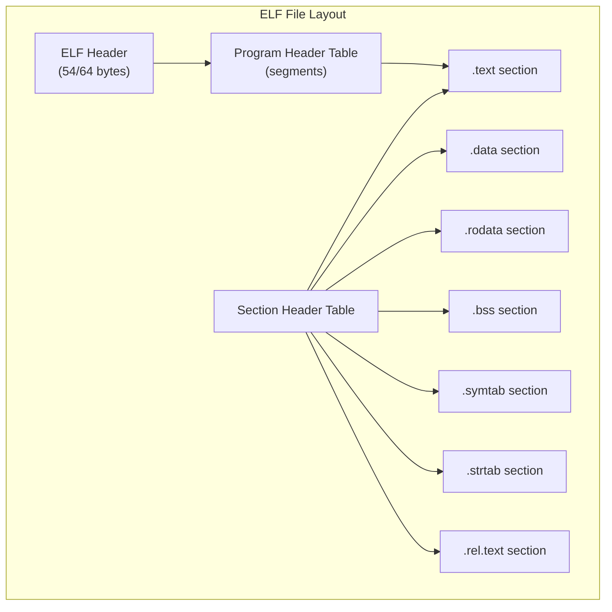
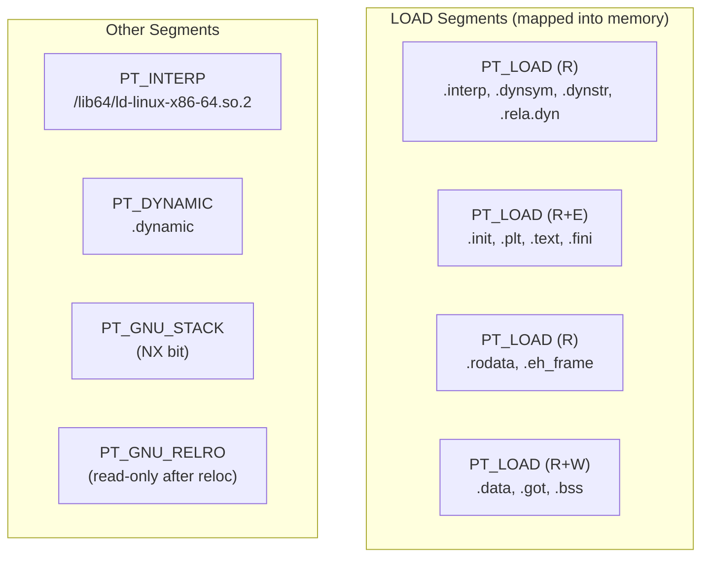
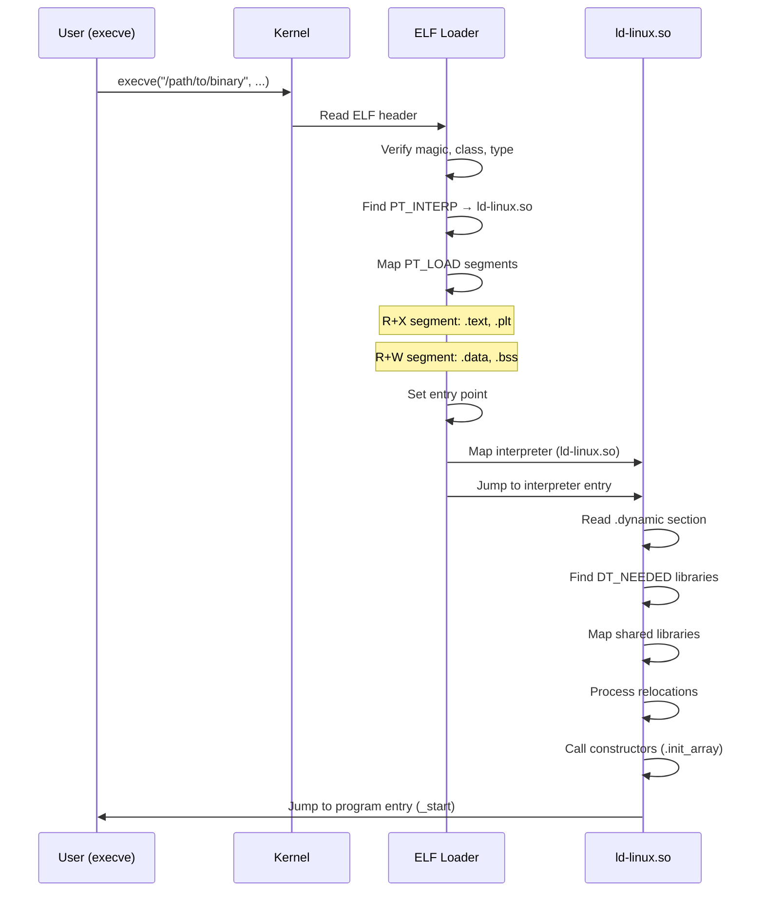

# ELF Format

## Introduction

The **Executable and Linkable Format (ELF)** is the standard binary format on Linux and most Unix-like systems. It defines the structure of executable files, shared libraries, object files, and core dumps. Understanding ELF is essential for systems programmers because it governs how programs are loaded, linked, and executed.

ELF was originally developed by the Unix System Laboratories (USL) as part of the Application Binary Interface (ABI) and was adopted as the standard binary format for SVR4 Unix. Today it's used on Linux, FreeBSD, Android, and many embedded systems.

## ELF File Types

| Type | `e_type` | Extension | Description |
|------|----------|-----------|-------------|
| `ET_REL` | 1 | `.o` | Relocatable object file (compiler output) |
| `ET_EXEC` | 2 | (none) | Executable file (statically linked address) |
| `ET_DYN` | 3 | `.so`, (none) | Shared object / position-independent executable |
| `ET_CORE` | 4 | `.core` | Core dump |
| `ET_NONE` | 0 | — | Unknown type |

```bash
# Identify ELF type
$ file /bin/ls
/bin/ls: ELF 64-bit LSB pie executable, x86-64, version 1 (SYSV),
dynamically linked, interpreter /lib64/ld-linux-x86-64.so.2,
BuildID[sha1]=..., for GNU/Linux 3.2.0, stripped

$ file /lib/x86_64-linux-gnu/libc.so.6
/lib/x86_64-linux-gnu/libc.so.6: ELF 64-bit LSB shared object, x86-64, ...

$ file main.o
main.o: ELF 64-bit LSB relocatable, x86-64, ...
```

## ELF File Structure


### ELF Header

The ELF header is always at offset 0 and identifies the file:

```c
typedef struct {
    unsigned char e_ident[EI_NIDENT]; /* Magic number + class + data + version */
    uint16_t e_type;                  /* Object file type */
    uint16_t e_machine;               /* Architecture */
    uint32_t e_version;               /* Object file version */
    uint64_t e_entry;                 /* Entry point address */
    uint64_t e_phoff;                 /* Program header table offset */
    uint64_t e_shoff;                 /* Section header table offset */
    uint32_t e_flags;                 /* Processor-specific flags */
    uint16_t e_ehsize;                /* ELF header size */
    uint16_t e_phentsize;             /* Program header entry size */
    uint16_t e_phnum;                 /* Number of program header entries */
    uint16_t e_shentsize;             /* Section header entry size */
    uint16_t e_shnum;                 /* Number of section header entries */
    uint16_t e_shstrndx;              /* Section name string table index */
} Elf64_Ehdr;
```

### The Magic Number

```bash
$ xxd -l 16 /bin/ls
00000000: 7f45 4c46 0201 0100 0000 0000 0000 0000  .ELF............
```

| Bytes | Meaning |
|-------|---------|
| `7f` | DEL (ELF magic) |
| `45 4c 46` | "ELF" in ASCII |
| `02` | 64-bit (01 = 32-bit) |
| `01` | Little-endian (02 = big-endian) |
| `01` | ELF version 1 |
| `00` | OS/ABI: System V |

## Sections

Sections are the building blocks of an ELF file at the **linking** level. They contain code, data, symbols, relocation information, and more.

### Standard Sections

| Section | Type | Contents |
|---------|------|----------|
| `.text` | `SHT_PROGBITS` | Executable code |
| `.data` | `SHT_PROGBITS` | Initialized global/static variables |
| `.rodata` | `SHT_PROGBITS` | Read-only data (string literals, constants) |
| `.bss` | `SHT_NOBITS` | Zero-initialized variables (no file space) |
| `.symtab` | `SHT_SYMTAB` | Symbol table (not stripped) |
| `.strtab` | `SHT_STRTAB` | String table for `.symtab` |
| `.dynsym` | `SHT_DYNSYM` | Dynamic symbol table |
| `.dynstr` | `SHT_STRTAB` | String table for `.dynsym` |
| `.rel.text` | `SHT_REL` | Relocations for `.text` |
| `.rela.text` | `SHT_RELA` | Relocations with explicit addends |
| `.plt` | `SHT_PROGBITS` | Procedure Linkage Table |
| `.got` | `SHT_PROGBITS` | Global Offset Table |
| `.dynamic` | `SHT_DYNAMIC` | Dynamic linking information |
| `.init` | `SHT_PROGBITS` | Initialization code (`_init`) |
| `.fini` | `SHT_PROGBITS` | Finalization code (`_fini`) |
| `.comment` | `SHT_PROGBITS` | Compiler version string |
| `.debug_*` | `SHT_PROGBITS` | DWARF debug information |
| `.note.*` | `SHT_NOTE` | Vendor-specific notes |

### Examining Sections with readelf

```bash
$ readelf -S /bin/ls
There are 28 section headers, starting at offset 0x19a18:

Section Headers:
  [Nr] Name              Type             Address           Offset
       Size              EntSize          Flags  Link  Info  Align
  [ 0]                   NULL             0000000000000000  00000000
       0000000000000000  0000000000000000           0     0     0
  [ 1] .interp           PROGBITS         0000000000000318  00000318
       000000000000001c  0000000000000000   A       0     0     1
  [ 2] .note.gnu.pr[...] NOTE             0000000000000338  00000338
       0000000000000030  0000000000000000   A       0     0     8
  [ 3] .gnu.hash         GNU_HASH         0000000000000368  00000368
       00000000000000c4  0000000000000000   A       4     0     8
  [ 4] .dynsym           DYNSYM           0000000000000430  00000430
       0000000000000c00  0000000000000018   A       5     1     8
  [ 5] .dynstr           STRTAB           0000000000001030  00001030
       00000000000005b4  0000000000000000   A       0     0     1
  [12] .text             PROGBITS         0000000000005a80  00005a80
       000000000000a345  0000000000000000  AX       0     0     16
  [13] .fini             PROGBITS         000000000000fdd8  0000fdd8
       0000000000000009  0000000000000000  AX       0     0     4
  [14] .rodata           PROGBITS         000000000000fe00  0000fe00
       0000000000001694  0000000000000000   A       0     0     32
  [24] .data             PROGBITS         0000000000012000  00012000
       0000000000000228  0000000000000000  WA       0     0     8
  [25] .bss              NOBITS           0000000000012228  00012228
       0000000000000b78  0000000000000000  WA       0     0     8
```

## Segments (Program Headers)

Segments are the **execution** view of the ELF file. The kernel loader uses program headers to map the file into memory.

### Program Header Structure

```c
typedef struct {
    uint32_t p_type;    /* Segment type */
    uint32_t p_flags;   /* Segment flags */
    uint64_t p_offset;  /* Offset in file */
    uint64_t p_vaddr;   /* Virtual address in memory */
    uint64_t p_paddr;   /* Physical address (unused on Linux) */
    uint64_t p_filesz;  /* Size in file */
    uint64_t p_memsz;   /* Size in memory */
    uint64_t p_align;   /* Alignment */
} Elf64_Phdr;
```

### Segment Types

| Type | Value | Description |
|------|-------|-------------|
| `PT_LOAD` | 1 | Loadable segment |
| `PT_DYNAMIC` | 2 | Dynamic linking information |
| `PT_INTERP` | 3 | Program interpreter path |
| `PT_NOTE` | 4 | Vendor-specific notes |
| `PT_PHDR` | 6 | Program header table itself |
| `PT_GNU_STACK` | 0x6474e551 | Stack permissions (NX check) |
| `PT_GNU_RELRO` | 0x6474e552 | Read-only after relocation |

### Examining Segments

```bash
$ readelf -l /bin/ls

Elf file type is DYN (Position-Independent Executable file)
Entry point 0x5a80
There are 11 program headers, starting at offset 64

Program Headers:
  Type           Offset             VirtAddr           PhysAddr
                 FileSiz            MemSiz              Flags  Align
  PHDR           0x0000000000000040 0x0000000000000040 0x0000000000000040
                 0x0000000000000268 0x0000000000000268  R      0x8
  INTERP         0x0000000000000318 0x0000000000000318 0x0000000000000318
                 0x000000000000001c 0x000000000000001c  R      0x1
      [Requesting program interpreter: /lib64/ld-linux-x86-64.so.2]
  LOAD           0x0000000000000000 0x0000000000000000 0x0000000000000000
                 0x0000000000001f18 0x0000000000001f18  R      0x1000
  LOAD           0x0000000000005a80 0x0000000000005a80 0x0000000000005a80
                 0x000000000000a345 0x000000000000a345  R E    0x1000
  LOAD           0x000000000000fe00 0x000000000000fe00 0x000000000000fe00
                 0x0000000000001694 0x0000000000001694  R      0x1000
  LOAD           0x0000000000012000 0x0000000000012000 0x0000000000012000
                 0x0000000000000228 0x0000000000000da0  RW     0x1000
  DYNAMIC        0x0000000000012008 0x0000000000012008 0x0000000000012008
                 0x00000000000001f0 0x00000000000001f0  RW     0x8
  NOTE           0x0000000000000338 0x0000000000000338 0x0000000000000338
                 0x0000000000000030 0x0000000000000030  R      0x8
  GNU_EH_FRAME   0x000000000000fe44 0x000000000000fe44 0x000000000000fe44
                 0x0000000000000304 0x0000000000000304  R      0x4
  GNU_STACK      0x0000000000000000 0x0000000000000000 0x0000000000000000
                 0x0000000000000000 0x0000000000000000  RW     0x10
  GNU_RELRO      0x0000000000012000 0x0000000000012000 0x0000000000012000
                 0x0000000000000228 0x0000000000000230  R      0x1

 Section to Segment mapping:
  Segment Sections...
   00
   01     .interp
   02     .interp .note.gnu.property .note.gnu.build-id .gnu.hash
          .dynsym .dynstr .gnu.version .gnu.version_r .rela.dyn .rela.plt
   03     .init .plt .plt.got .text .fini
   04     .rodata .eh_frame_hdr .eh_frame
   05     .init_array .fini_array .dynamic .got .data .bss
   06     .dynamic
```

### Section-to-Segment Mapping


## Symbol Tables

Symbols represent functions, variables, and other named entities.

### Symbol Entry

```c
typedef struct {
    uint32_t st_name;     /* Symbol name (index into string table) */
    uint8_t  st_info;     /* Type and binding */
    uint8_t  st_other;    /* Visibility */
    uint16_t st_shndx;    /* Section index */
    uint64_t st_value;    /* Symbol value (address or offset) */
    uint64_t st_size;     /* Symbol size */
} Elf64_Sym;
```

### Symbol Types

| Type | Value | Description |
|------|-------|-------------|
| `STT_NOTYPE` | 0 | No type |
| `STT_OBJECT` | 1 | Data object (variable) |
| `STT_FUNC` | 2 | Function |
| `STT_SECTION` | 3 | Section name |
| `STT_FILE` | 4 | Source file name |
| `STT_COMMON` | 5 | Common data |
| `STT_TLS` | 6 | Thread-local storage |

### Symbol Binding

| Binding | Value | Description |
|---------|-------|-------------|
| `STB_LOCAL` | 0 | Not visible outside the object file |
| `STB_GLOBAL` | 1 | Visible to all object files |
| `STB_WEAK` | 2 | Like global but lower precedence |

### Symbol Visibility

| Visibility | Value | Description |
|------------|-------|-------------|
| `STV_DEFAULT` | 0 | Default (exported from shared libs) |
| `STV_INTERNAL` | 1 | Processor-specific |
| `STV_HIDDEN` | 2 | Not exported |
| `STV_PROTECTED` | 3 | Not preemptible |

### Examining Symbols

```bash
# Dynamic symbols (exported/needed)
$ readelf -s /bin/ls | head -20
Symbol table '.dynsym' contains 128 entries:
   Num:    Value          Size Type    Bind   Vis      Ndx Name
     0: 0000000000000000     0 NOTYPE  LOCAL  DEFAULT  UND
     1: 0000000000000000     0 FUNC    GLOBAL DEFAULT  UND __ctype_toupper_loc@GLIBC_2.3 (2)
     2: 0000000000000000     0 FUNC    GLOBAL DEFAULT  UND getenv@GLIBC_2.2.5 (3)
     3: 0000000000000000     0 NOTYPE  WEAK   DEFAULT  UND __gmon_start__

# All symbols (including local)
$ readelf -s /bin/ls --wide | wc -l
342

# Filter by name
$ readelf -s /bin/ls | grep -i main
    42: 0000000000009a80   573 FUNC    GLOBAL DEFAULT   13 main

# Using nm (works on non-stripped files)
$ nm /usr/lib/x86_64-linux-gnu/libc.a 2>/dev/null | grep " T " | head -10
```

## Relocations

Relocations patch code/data with actual addresses when linking or loading.

### Relocation Entry

```c
/* Relocation without explicit addend */
typedef struct {
    uint64_t r_offset;  /* Address to patch */
    uint64_t r_info;    /* Symbol + type */
} Elf64_Rel;

/* Relocation with explicit addend */
typedef struct {
    uint64_t r_offset;
    uint64_t r_info;
    int64_t  r_addend;  /* Constant addend */
} Elf64_Rela;
```

### Relocation Types (x86-64)

| Type | Value | Description |
|------|-------|-------------|
| `R_X86_64_NONE` | 0 | No relocation |
| `R_X86_64_64` | 1 | Direct 64-bit: `S + A` |
| `R_X86_64_PC32` | 2 | PC-relative 32-bit: `S + A - P` |
| `R_X86_64_GLOB_DAT` | 6 | GOT entry: `S` |
| `R_X86_64_JUMP_SLOT` | 7 | PLT entry: `S` |
| `R_X86_64_RELATIVE` | 8 | Base-relative: `B + A` |
| `R_X86_64_GOTPCREL` | 9 | GOT-relative PC: `G + GOT + A - P` |
| `R_X86_64_32` | 10 | Truncated 32-bit: `S + A` |
| `R_X86_64_COPY` | 5 | Copy data from shared object |

Where: `S` = symbol value, `A` = addend, `P` = place (offset), `B` = base address, `G` = GOT offset.

### Examining Relocations

```bash
$ readelf -r main.o

Relocation section '.rela.text' at offset 0x2a8 contains 2 entries:
  Offset          Info           Type           Sym. Value    Sym. Name + Addend
00000000001c  000500000004 R_X86_64_PLT32    0000000000000000 printf - 4
000000000023  000500000004 R_X86_64_PLT32    0000000000000000 printf - 4

$ readelf -r /bin/ls | head -20
```

## Dynamic Linking

### The .dynamic Section

```c
typedef struct {
    int64_t  d_tag;     /* Type */
    union {
        uint64_t d_val; /* Integer value */
        uint64_t d_ptr; /* Address */
    } d_un;
} Elf64_Dyn;
```

| Tag | Meaning |
|-----|---------|
| `DT_NEEDED` | Required shared library |
| `DT_SONAME` | Shared object name |
| `DT_SYMTAB` | Address of symbol table |
| `DT_STRTAB` | Address of string table |
| `DT_PLTGOT` | Address of PLT/GOT |
| `DT_JMPREL` | Address of PLT relocations |
| `DT_PLTRELSZ` | Size of PLT relocations |
| `DT_REL/DT_RELA` | Address of relocations |
| `DT_INIT` | Address of init function |
| `DT_FINI` | Address of fini function |

```bash
$ readelf -d /bin/ls | head -20
Dynamic section at offset 0x2008 contains 27 entries:
  Tag        Type                 Name/Value
 0x0000000000000001 (NEEDED)     Shared library: [libselinux.so.1]
 0x0000000000000001 (NEEDED)     Shared library: [libc.so.6]
 0x000000000000000c (INIT)       0x5a68
 0x000000000000000d (FINI)       0xfdd8
 0x0000000000000019 (INIT_ARRAY) 0x12000
 0x000000000000001b (INIT_ARRAYSZ) 8 (bytes)
 0x000000000000001a (FINI_ARRAY) 0x12008
 0x000000000000001c (FINI_ARRAYSZ) 8 (bytes)
 0x000000006ffffef5 (GNU_HASH)   0x368
 0x0000000000000005 (STRTAB)     0x1030
 0x0000000000000006 (SYMTAB)     0x430
 0x000000000000000a (STRSZ)      1460 (bytes)
 0x000000000000000b (SYMENT)     24 (bytes)
 0x0000000000000015 (DEBUG)      0x0
 0x0000000000000003 (PLTGOT)     0x12228
 0x0000000000000002 (PLTRELSZ)   720 (bytes)
 0x0000000000000014 (PLTREL)     RELA
 0x0000000000000017 (JMPREL)     0x1c38
 0x0000000000000007 (RELA)       0x16f0
 0x0000000000000008 (RELASZ)     1352 (bytes)
```

## ELF Loading Process

When `execve()` loads an ELF binary:


## Using objdump

```bash
# Disassemble .text section
$ objdump -d /bin/ls | head -30

# Disassemble with source (if debug info)
$ gcc -g -o hello hello.c
$ objdump -dS hello | head -40

# Show all headers
$ objdump -h main.o

# Show section contents
$ objdump -s -j .rodata hello

# Show relocations
$ objdump -r main.o

# Show dynamic relocations
$ objdump -R /bin/ls
```

## Using readelf

```bash
# All headers
$ readelf -a /bin/ls

# ELF header only
$ readelf -h /bin/ls

# Section headers
$ readelf -S /bin/ls

# Program headers
$ readelf -l /bin/ls

# Symbol table
$ readelf -s /bin/ls

# Dynamic section
$ readelf -d /bin/ls

# Notes
$ readelf -n /bin/ls

# Relocations
$ readelf -r /bin/ls

# DWARF debug info
$ readelf --debug-dump=info hello
```

## Practical Examples

### Examining a Simple Program

```c
/* hello.c */
#include <stdio.h>
int main(void) {
    printf("Hello, World!\n");
    return 0;
}
```

```bash
$ gcc -o hello hello.c

# Show the interpreter
$ readelf -l hello | grep interpreter
      [Requesting program interpreter: /lib64/ld-linux-x86-64.so.2]

# Show shared library dependencies
$ readelf -d hello | grep NEEDED
 0x0000000000000001 (NEEDED)  Shared library: [libc.so.6]

# Show entry point
$ readelf -h hello | grep Entry
  Entry point address:               0x1060

# Show symbol table
$ readelf -s hello | grep main
    51: 0000000000001149    17 FUNC    GLOBAL DEFAULT   16 main
```

### Finding the Entry Point

```bash
$ readelf -h /bin/ls | grep Entry
  Entry point address:               0x5a80

# What's at the entry point?
$ objdump -d /bin/ls | grep -A5 "<_start>:"

0000000000005a80 <_start>:
    5a80:   endbr64
    5a84:   xor    %ebp,%ebp
    5a86:   mov    %rdx,%r9
    5a89:   pop    %rsi
    5a8a:   mov    %rsp,%rdx
```

## References

- [The Linux Kernel Documentation](https://docs.kernel.org/)
- [LWN.net - Linux and free software news](https://lwn.net/)
- [GNU Project Documentation](https://www.gnu.org/doc/doc.html)
- [GNU Manuals](https://www.gnu.org/manual/manual.html)
- [Free Software Directory](https://directory.fsf.org/wiki/Main_Page)
- [Planet GNU](https://planet.gnu.org/)
- [Free Software Books](https://www.gnu.org/doc/other-free-books.html)

- [ELF(5) — Linux manual page](https://man7.org/linux/man-pages/man5/elf.5.html)
- [System V Application Binary Interface](https://www.sco.com/developers/devspecs/gabi41.pdf)
- [x86-64 ABI](https://gitlab.com/x86-psABIs/x86-64-ABI)
- [readelf(1) — Linux manual page](https://man7.org/linux/man-pages/man1/readelf.1.html)
- [objdump(1) — Linux manual page](https://man7.org/linux/man-pages/man1/objdump.1.html)
- [ELF Specification (Wikipedia)](https://en.wikipedia.org/wiki/Executable_and_Linkable_Format)
- [Ian Lance Taylor's Linker Blog Series](https://www.airs.com/blog/archives/38)

## Related Topics

- [Dynamic Linking](./dynamic-linking.md) — How the runtime linker processes ELF
- [System Calls](./syscalls.md) — How `execve()` loads ELF binaries
- [Process Control](./process-control.md) — The `execve()` family
