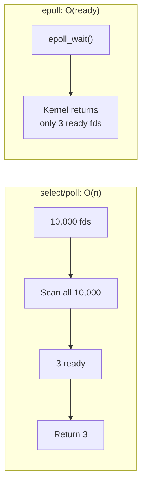
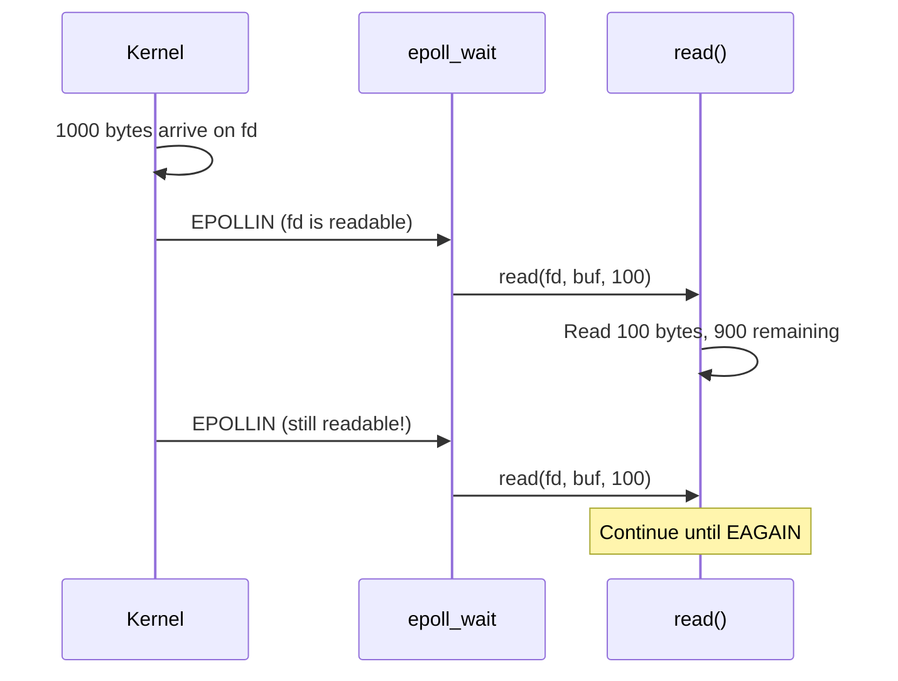
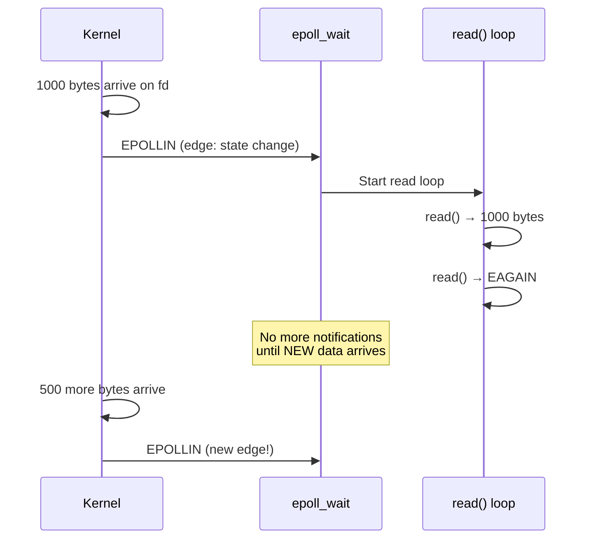
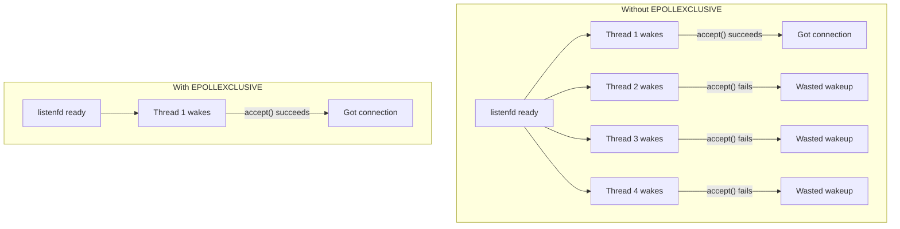

# epoll

## Introduction

`epoll` is Linux's scalable I/O event notification mechanism, designed to efficiently monitor large numbers of file descriptors for readiness. It replaces the older `select()` and `poll()` system calls, which have O(n) complexity and poor performance when monitoring thousands of connections.

`epoll` is the backbone of high-performance network servers on Linux (nginx, Redis, Node.js, HAProxy) and supports both **level-triggered** and **edge-triggered** notification modes.

## Why epoll? The Problem with select/poll

### select() and poll() Limitations

```c
/* select: O(n) scanning every call */
fd_set rfds;
FD_ZERO(&rfds);
for (int i = 0; i < nfds; i++)
    FD_SET(fds[i], &rfds);
select(maxfd + 1, &rfds, NULL, NULL, NULL);

/* Kernel must scan ALL registered fds internally */
```


| Call | Per-call cost | Per-wait cost | Scalability |
|------|--------------|---------------|-------------|
| `select()` | O(1) setup | O(n) scan | Poor |
| `poll()` | O(1) setup | O(n) scan | Poor |
| `epoll` | O(1) setup | O(ready) | **Excellent** |

## The epoll API

### epoll_create() / epoll_create1()

```mermaid
c
#include <sys/epoll.h>

int epoll_create(int size);     /* size is just a hint, ignored since 2.6.8 */
int epoll_create1(int flags);   /* Preferred: supports EPOLL_CLOEXEC */
```

```c
/* Create epoll instance */
int epfd = epoll_create1(EPOLL_CLOEXEC);
if (epfd == -1) {
    perror("epoll_create1");
    return 1;
}
```

### epoll_ctl() — Add/Modify/Delete Monitored FDs

```c
int epoll_ctl(int epfd, int op, int fd, struct epoll_event *event);

/* Operations */
#define EPOLL_CTL_ADD   /* Add fd to monitor */
#define EPOLL_CTL_MOD   /* Modify monitored events */
#define EPOLL_CTL_DEL   /* Remove fd from monitoring */

struct epoll_event {
    uint32_t     events;   /* EPOLLIN, EPOLLOUT, etc. */
    epoll_data_t data;     /* User data returned on events */
};

typedef union epoll_data {
    void    *ptr;
    int      fd;
    uint32_t u32;
    uint64_t u64;
} epoll_data_t;
```

### Event Flags

| Flag | Meaning |
|------|---------|
| `EPOLLIN` | Readable (including peer close, errors) |
| `EPOLLOUT` | Writable |
| `EPOLLRDHUP` | Peer closed connection (stream socket) |
| `EPOLLPRI` | Urgent data (TCP out-of-band) |
| `EPOLLERR` | Error condition (always monitored, can't disable) |
| `EPOLLHUP` | Hang up (always monitored, can't disable) |
| `EPOLLET` | Edge-triggered mode |
| `EPOLLONESHOT` | Monitor once, then disable (re-arm with `EPOLL_CTL_MOD`) |
| `EPOLLEXCLUSIVE` | Wake only one epoll fd (avoid thundering herd) |

### epoll_wait() — Wait for Events

```c
int epoll_wait(int epfd, struct epoll_event *events,
               int maxevents, int timeout);
```

- `timeout = -1`: Block indefinitely
- `timeout = 0`: Return immediately
- `timeout > 0`: Block for at most `timeout` milliseconds
- Returns: Number of ready file descriptors

## Basic Example

```c
#include <sys/epoll.h>
#include <sys/socket.h>
#include <netinet/in.h>
#include <unistd.h>
#include <stdio.h>
#include <string.h>
#include <errno.h>

#define MAX_EVENTS 64
#define BUF_SIZE 1024

int main(void)
{
    /* Create listening socket */
    int listenfd = socket(AF_INET, SOCK_STREAM, 0);
    int opt = 1;
    setsockopt(listenfd, SOL_SOCKET, SO_REUSEADDR, &opt, sizeof(opt));

    struct sockaddr_in addr = {
        .sin_family = AF_INET,
        .sin_addr.s_addr = INADDR_ANY,
        .sin_port = htons(8080)
    };
    bind(listenfd, (struct sockaddr *)&addr, sizeof(addr));
    listen(listenfd, 128);

    /* Create epoll instance */
    int epfd = epoll_create1(EPOLL_CLOEXEC);

    /* Add listening socket to epoll */
    struct epoll_event ev = {
        .events = EPOLLIN,
        .data.fd = listenfd
    };
    epoll_ctl(epfd, EPOLL_CTL_ADD, listenfd, &ev);

    struct epoll_event events[MAX_EVENTS];
    char buf[BUF_SIZE];

    printf("Server listening on port 8080\n");

    while (1) {
        int nfds = epoll_wait(epfd, events, MAX_EVENTS, -1);

        for (int i = 0; i < nfds; i++) {
            if (events[i].data.fd == listenfd) {
                /* New connection */
                int connfd = accept(listenfd, NULL, NULL);
                ev.events = EPOLLIN;
                ev.data.fd = connfd;
                epoll_ctl(epfd, EPOLL_CTL_ADD, connfd, &ev);
                printf("Client connected (fd=%d)\n", connfd);
            } else {
                /* Data on existing connection */
                int fd = events[i].data.fd;
                ssize_t n = read(fd, buf, sizeof(buf));

                if (n <= 0) {
                    /* Connection closed or error */
                    printf("Client disconnected (fd=%d)\n", fd);
                    epoll_ctl(epfd, EPOLL_CTL_DEL, fd, NULL);
                    close(fd);
                } else {
                    /* Echo back */
                    write(fd, buf, n);
                }
            }
        }
    }

    close(epfd);
    close(listenfd);
    return 0;
}
```

## Level-Triggered vs Edge-Triggered

This is one of the most important concepts in epoll.

### Level-Triggered (Default)

`epoll_wait()` reports a fd as ready **whenever** it's in the ready state. If you don't drain all data, the next `epoll_wait()` will report it again.

```c
/* Level-triggered: simple and safe */
ev.events = EPOLLIN;  /* No EPOLLET */
ev.data.fd = connfd;
epoll_ctl(epfd, EPOLL_CTL_ADD, connfd, &ev);

/* Handler can do partial reads */
while (1) {
    int nfds = epoll_wait(epfd, events, MAX_EVENTS, -1);
    for (int i = 0; i < nfds; i++) {
        ssize_t n = read(events[i].data.fd, buf, 100);
        /* Even if we read less than available,
         * epoll_wait will report the fd again */
    }
}
```


### Edge-Triggered (EPOLLET)

`epoll_wait()` reports a fd **only once** when the state changes (edge). You must read/write until `EAGAIN`.

```mermaid
c
/* Edge-triggered: must drain completely */
ev.events = EPOLLIN | EPOLLET;  /* Edge-triggered */
ev.data.fd = connfd;
epoll_ctl(epfd, EPOLL_CTL_ADD, connfd, &ev);

/* MUST use non-blocking fd */
fcntl(connfd, F_SETFL, O_NONBLOCK);

/* Handler MUST drain all data */
while (1) {
    int nfds = epoll_wait(epfd, events, MAX_EVENTS, -1);
    for (int i = 0; i < nfds; i++) {
        /* Read until EAGAIN */
        while (1) {
            ssize_t n = read(events[i].data.fd, buf, sizeof(buf));
            if (n == -1) {
                if (errno == EAGAIN)
                    break;  /* All data read */
                perror("read");
                break;
            }
            if (n == 0) {
                /* EOF */
                close(events[i].data.fd);
                break;
            }
            process(buf, n);
        }
    }
}
```


### Comparison

| Aspect | Level-Triggered | Edge-Triggered |
|--------|----------------|----------------|
| **Notifications** | Every poll cycle until drained | Once per state change |
| **Read requirement** | Can read partially | Must read until EAGAIN |
| **Complexity** | Simpler | More complex |
| **Performance** | Good | Better (fewer wakeups) |
| **Risk of starvation** | None | Must drain completely |
| **Missed events** | Not possible | Possible if not drained |

### EPOLLONESHOT

Useful for multithreaded servers where you want exactly one thread to handle each event:

```mermaid
c
ev.events = EPOLLIN | EPOLLET | EPOLLONESHOT;
epoll_ctl(epfd, EPOLL_CTL_ADD, fd, &ev);

/* Worker thread handles the event */
void *worker(void *arg)
{
    int fd = *(int *)arg;
    handle_connection(fd);

    /* Re-arm the fd for next event */
    struct epoll_event ev = {
        .events = EPOLLIN | EPOLLET | EPOLLONESHOT,
        .data.fd = fd
    };
    epoll_ctl(epfd, EPOLL_CTL_MOD, fd, &ev);
    return NULL;
}
```

## Performance Optimization

### EPOLLEXCLUSIVE

Avoid the **thundering herd** problem when multiple epoll fds are waiting on the same fd:

```c
/* In each thread's epoll setup */
ev.events = EPOLLIN | EPOLLEXCLUSIVE;
ev.data.fd = listenfd;
epoll_ctl(epfd, EPOLL_CTL_ADD, listenfd, &ev);
```


### Thread Pool Pattern

```mermaid
c
/* Main thread: accept connections */
/* Worker threads: handle I/O */

#define NUM_WORKERS 4

struct worker {
    int epfd;
    pthread_t thread;
};

void *worker_thread(void *arg)
{
    struct worker *w = arg;
    struct epoll_event events[64];

    while (1) {
        int nfds = epoll_wait(w->epfd, events, 64, -1);
        for (int i = 0; i < nfds; i++) {
            handle_request(events[i].data.fd);
        }
    }
    return NULL;
}

/* Distribute connections round-robin */
int next_worker = 0;
while (1) {
    int connfd = accept(listenfd, NULL, NULL);
    ev.events = EPOLLIN;
    ev.data.fd = connfd;
    epoll_ctl(workers[next_worker].epfd, EPOLL_CTL_ADD, connfd, &ev);
    next_worker = (next_worker + 1) % NUM_WORKERS;
}
```

### epoll_pwait() — With Signal Mask

```c
int epoll_pwait(int epfd, struct epoll_event *events,
                int maxevents, int timeout,
                const sigset_t *sigmask);

/* Atomically unblock signals and wait */
sigset_t mask;
sigemptyset(&mask);
sigaddset(&mask, SIGINT);
epoll_pwait(epfd, events, maxevents, -1, &mask, NULL);
```

## Timeout and Timer Integration

### Using timerfd with epoll

```c
#include <sys/timerfd.h>

/* Create a timer */
int timerfd = timerfd_create(CLOCK_MONOTONIC, TFD_NONBLOCK | TFD_CLOEXEC);

struct itimerspec timer = {
    .it_interval = { .tv_sec = 1 },  /* Repeating every 1s */
    .it_value = { .tv_sec = 1 }      /* Initial expiry: 1s */
};
timerfd_settime(timerfd, 0, &timer, NULL);

/* Add to epoll */
ev.events = EPOLLIN;
ev.data.fd = timerfd;
epoll_ctl(epfd, EPOLL_CTL_ADD, timerfd, &ev);

/* In event loop */
if (events[i].data.fd == timerfd) {
    uint64_t expirations;
    read(timerfd, &expirations, sizeof(expirations));
    printf("Timer fired %lu times\n", expirations);
}
```

### Using eventfd with epoll

```c
#include <sys/eventfd.h>

/* Create eventfd */
int efd = eventfd(0, EFD_NONBLOCK | EFD_CLOEXEC);

/* Add to epoll */
ev.events = EPOLLIN;
ev.data.fd = efd;
epoll_ctl(epfd, EPOLL_CTL_ADD, efd, &ev);

/* Signal from another thread */
uint64_t val = 1;
write(efd, &val, sizeof(val));

/* In event loop */
if (events[i].data.fd == efd) {
    uint64_t val;
    read(efd, &val, sizeof(val));
    printf("Event signaled %lu times\n", val);
}
```

## Complete Non-Blocking HTTP Server Skeleton

```c
#include <sys/epoll.h>
#include <sys/socket.h>
#include <netinet/in.h>
#include <fcntl.h>
#include <unistd.h>
#include <stdio.h>
#include <string.h>
#include <errno.h>

#define MAX_EVENTS 1024
#define BUF_SIZE 8192

static int set_nonblocking(int fd)
{
    int flags = fcntl(fd, F_GETFL, 0);
    return fcntl(fd, F_SETFL, flags | O_NONBLOCK);
}

int main(void)
{
    int listenfd = socket(AF_INET, SOCK_STREAM | SOCK_NONBLOCK, 0);
    int opt = 1;
    setsockopt(listenfd, SOL_SOCKET, SO_REUSEADDR, &opt, sizeof(opt));

    struct sockaddr_in addr = {
        .sin_family = AF_INET,
        .sin_addr.s_addr = INADDR_ANY,
        .sin_port = htons(8080)
    };
    bind(listenfd, (struct sockaddr *)&addr, sizeof(addr));
    listen(listenfd, 4096);

    int epfd = epoll_create1(EPOLL_CLOEXEC);

    struct epoll_event ev = {
        .events = EPOLLIN,
        .data.fd = listenfd
    };
    epoll_ctl(epfd, EPOLL_CTL_ADD, listenfd, &ev);

    struct epoll_event events[MAX_EVENTS];
    char buf[BUF_SIZE];

    while (1) {
        int nfds = epoll_wait(epfd, events, MAX_EVENTS, -1);

        for (int i = 0; i < nfds; i++) {
            int fd = events[i].data.fd;

            if (fd == listenfd) {
                /* Accept all pending connections */
                while (1) {
                    int connfd = accept4(listenfd, NULL, NULL,
                                         SOCK_NONBLOCK | SOCK_CLOEXEC);
                    if (connfd == -1) {
                        if (errno == EAGAIN || errno == EWOULDBLOCK)
                            break;
                        perror("accept4");
                        break;
                    }

                    ev.events = EPOLLIN | EPOLLET;
                    ev.data.fd = connfd;
                    epoll_ctl(epfd, EPOLL_CTL_ADD, connfd, &ev);
                }
            } else {
                /* Edge-triggered: drain all data */
                while (1) {
                    ssize_t n = read(fd, buf, sizeof(buf));
                    if (n == -1) {
                        if (errno == EAGAIN)
                            break;
                        perror("read");
                        epoll_ctl(epfd, EPOLL_CTL_DEL, fd, NULL);
                        close(fd);
                        break;
                    }
                    if (n == 0) {
                        epoll_ctl(epfd, EPOLL_CTL_DEL, fd, NULL);
                        close(fd);
                        break;
                    }

                    /* Simple HTTP response */
                    const char *resp =
                        "HTTP/1.1 200 OK\r\n"
                        "Content-Length: 13\r\n"
                        "Connection: close\r\n"
                        "\r\n"
                        "Hello, World!";
                    write(fd, resp, strlen(resp));
                }
            }
        }
    }
}
```

## epoll vs poll vs select

| Feature | select | poll | epoll |
|---------|--------|------|-------|
| **Max FDs** | 1024 (FD_SETSIZE) | Unlimited | Unlimited |
| **Complexity** | O(n) | O(n) | O(1) setup, O(ready) wait |
| **FD set rebuild** | Every call | Every call | No (persistent) |
| **Edge-triggered** | No | No | Yes |
| **Thread safety** | No | No | Yes (with EPOLLEXCLUSIVE) |
| **Portability** | All Unix | All Unix | Linux only |

## Level-Triggered vs Edge-Triggered (from man page)

From the man page at `man7.org/linux/man-pages/man7/epoll.7.html`:

### The Core Difference

Consider this scenario:

1. Read side of a pipe (`rfd`) is registered on the epoll instance.
2. Writer writes 2 kB of data.
3. `epoll_wait()` returns `rfd` as ready.
4. Reader reads **1 kB** (not all data).
5. `epoll_wait()` is called again.

**With `EPOLLET` (edge-triggered)**: Step 5 will probably **hang** — the edge-triggered event was consumed in step 3. The remaining 1 kB in the buffer won't generate a new event because no new data arrived.

**Without `EPOLLET` (level-triggered)**: Step 5 returns immediately — the fd is still readable.

### Edge-Triggered Best Practices

When using `EPOLLET`:

1. **Always use nonblocking file descriptors** — avoid blocking reads/writes starving other fds.
2. **Read/write until `EAGAIN`** — after receiving an event, drain the fd completely:
   - For **packet-oriented** files (datagram sockets, terminals in canonical mode): read until `EAGAIN`.
   - For **stream-oriented** files (pipes, FIFOs, stream sockets): can also detect exhaustion by checking if `read()` returned fewer bytes than requested.

### EPOLLONESHOT

For multithreaded servers, `EPOLLONESHOT` ensures exactly one thread handles each event:

```c
ev.events = EPOLLIN | EPOLLET | EPOLLONESHOT;
epoll_ctl(epfd, EPOLL_CTL_ADD, fd, &ev);

/* After handling, re-arm: */
ev.events = EPOLLIN | EPOLLET | EPOLLONESHOT;
epoll_ctl(epfd, EPOLL_CTL_MOD, fd, &ev);
```

### EPOLLEXCLUSIVE

Avoids thundering herd: when multiple epoll fds wait on the same fd, only **one** thread is woken:

```c
ev.events = EPOLLIN | EPOLLEXCLUSIVE;
epoll_ctl(epfd, EPOLL_CTL_ADD, listenfd, &ev);
```

Without `EPOLLEXCLUSIVE`, all threads wake up but only one succeeds on `accept()` — the rest waste CPU.

### Edge-Triggered + Multiple Events

Even with edge-triggered mode, multiple events can be generated for multiple data chunks. The caller can combine `EPOLLET` with `EPOLLONESHOT` to disable the fd after one event, requiring explicit re-arming.

### /proc Interface

`/proc/sys/fs/epoll/max_user_watches` (since Linux 2.6.28): Limits total file descriptors a user can register across all epoll instances. Per real UID. Each registered fd costs ~90 bytes on 32-bit, ~160 bytes on 64-bit. Default = 1/25 (4%) of available low memory divided by registration cost.

### Key Behavior Notes

- **Closing an fd** removes it from all epoll interest lists — but only after ALL fds referring to the same open file description are closed (due to `dup()`, `fork()`, etc.).
- **Events are combined**: If multiple events occur between `epoll_wait()` calls, they are reported together.
- **Two epoll instances** can wait on the same fd — events are reported to both.
- An **epoll fd is itself pollable** — if it has events waiting, it indicates as readable.

## References

- [The Linux Kernel Documentation](https://docs.kernel.org/)
- [LWN.net - Linux and free software news](https://lwn.net/)
- [GNU Project Documentation](https://www.gnu.org/doc/doc.html)
- [GNU Manuals](https://www.gnu.org/manual/manual.html)
- [Free Software Directory](https://directory.fsf.org/wiki/Main_Page)
- [Planet GNU](https://planet.gnu.org/)
- [Free Software Books](https://www.gnu.org/doc/other-free-books.html)

- [epoll(7) — Linux manual page](https://man7.org/linux/man-pages/man7/epoll.7.html)
- [epoll_create(2)](https://man7.org/linux/man-pages/man2/epoll_create.2.html)
- [epoll_ctl(2)](https://man7.org/linux/man-pages/man2/epoll_ctl.2.html)
- [epoll_wait(2)](https://man7.org/linux/man-pages/man2/epoll_wait.2.html)
- [The C10K problem](http://www.kegel.com/c10k.html)
- [epoll scalability for large numbers of connections](https://copyconstruct.medium.com/the-method-to-epolls-madness-d9d2d6305b4e)
- [epoll(7) man page](https://man7.org/linux/man-pages/man7/epoll.7.html)

## Related Topics

- [io_uring](./io-uring.md) — Modern alternative with async I/O
- [File I/O](./file-io.md) — Non-blocking I/O fundamentals
- [Signals](./signals.md) — Self-pipe trick for signal + epoll integration
- [System Calls](./syscalls.md) — The syscall mechanism behind epoll
