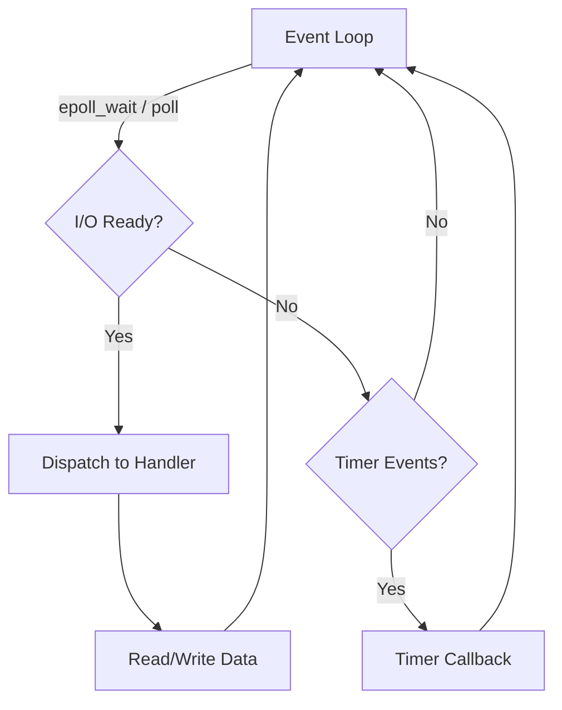
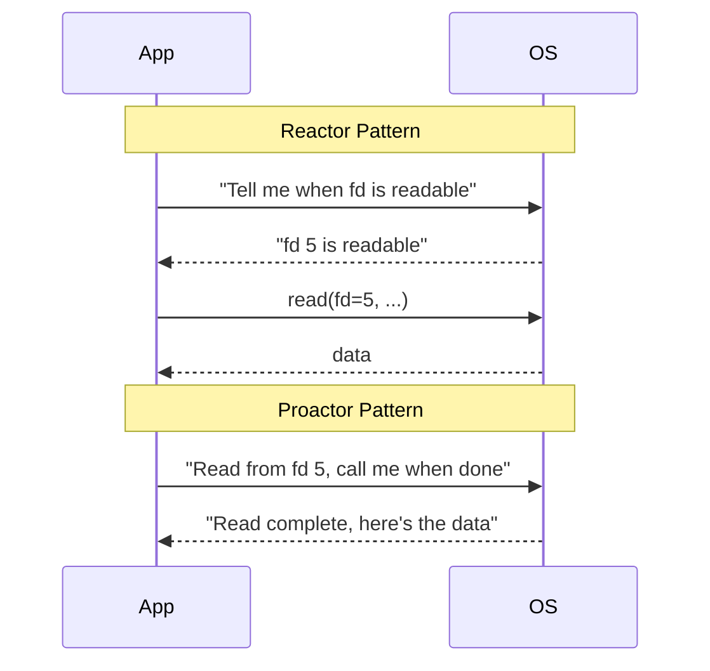
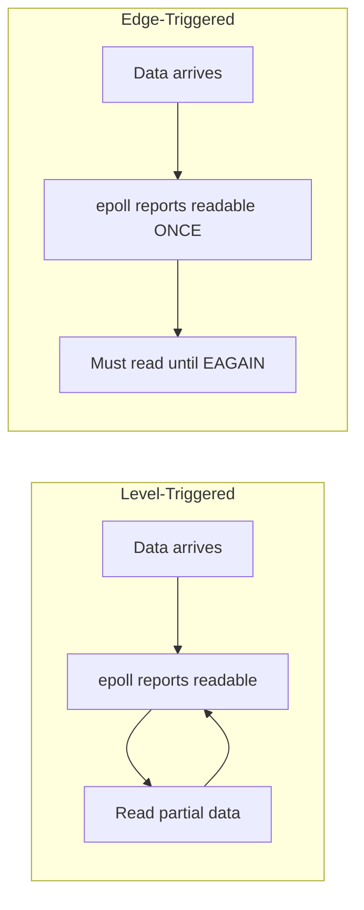
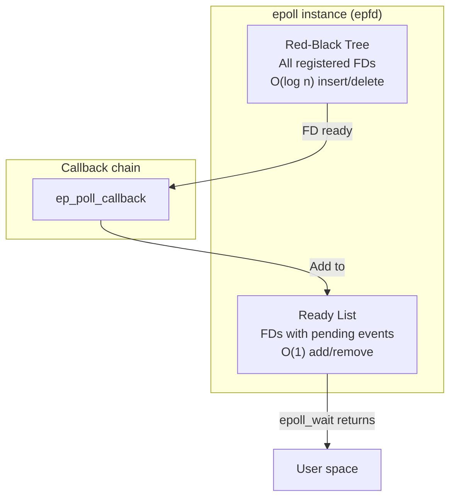

# Event-Driven Programming

## Introduction

Event-driven programming is a paradigm where the flow of execution is determined by events — I/O readiness, timers, signals, user input — rather than sequential code. This model is fundamental to building scalable network servers, GUI applications, and any system that must handle many concurrent operations efficiently.

The two primary architectural patterns are the **Reactor** and **Proactor** patterns, each with distinct approaches to asynchronous operation.

## The Reactor Pattern

The Reactor pattern demultiplexes and dispatches events synchronously. The application registers interest in I/O events, and the event loop notifies when operations can proceed without blocking.

### Architecture



### Reactor Implementation

```c
#include <sys/epoll.h>
#include <sys/socket.h>
#include <netinet/in.h>
#include <unistd.h>
#include <fcntl.h>
#include <stdio.h>
#include <string.h>
#include <errno.h>

#define MAX_EVENTS 1024

static int set_nonblocking(int fd) {
    int flags = fcntl(fd, F_GETFL, 0);
    return fcntl(fd, F_SETFL, flags | O_NONBLOCK);
}

typedef void (*handler_fn)(int fd, void *arg);

struct event_data {
    int       fd;
    handler_fn on_read;
    handler_fn on_write;
    void      *arg;
};

static struct event_data events_map[65536];

static void echo_handler(int fd, void *arg) {
    char buf[4096];
    ssize_t n = read(fd, buf, sizeof(buf));
    if (n > 0) {
        write(fd, buf, n);
    } else if (n == 0) {
        close(fd);
        printf("Client disconnected: fd=%d\n", fd);
    }
}

static void accept_handler(int fd, void *arg) {
    int epoll_fd = *(int *)arg;
    int client = accept(fd, NULL, NULL);
    if (client < 0) return;

    set_nonblocking(client);
    events_map[client].fd = client;
    events_map[client].on_read = echo_handler;

    struct epoll_event ev = {
        .events = EPOLLIN | EPOLLET,
        .data.fd = client
    };
    epoll_ctl(epoll_fd, EPOLL_CTL_ADD, client, &ev);
    printf("New client: fd=%d\n", client);
}

int main(void) {
    int epoll_fd = epoll_create1(0);
    int listen_fd = socket(AF_INET, SOCK_STREAM, 0);
    set_nonblocking(listen_fd);

    struct sockaddr_in addr = {
        .sin_family = AF_INET,
        .sin_port = htons(8080),
        .sin_addr.s_addr = INADDR_ANY
    };
    bind(listen_fd, (struct sockaddr *)&addr, sizeof(addr));
    listen(listen_fd, 128);

    events_map[listen_fd].fd = listen_fd;
    events_map[listen_fd].on_read = accept_handler;
    events_map[listen_fd].arg = &epoll_fd;

    struct epoll_event ev = { .events = EPOLLIN, .data.fd = listen_fd };
    epoll_ctl(epoll_fd, EPOLL_CTL_ADD, listen_fd, &ev);

    struct epoll_event active[MAX_EVENTS];
    printf("Reactor listening on :8080\n");

    for (;;) {
        int n = epoll_wait(epoll_fd, active, MAX_EVENTS, -1);
        for (int i = 0; i < n; i++) {
            int fd = active[i].data.fd;
            if (active[i].events & EPOLLIN) {
                events_map[fd].on_read(fd, events_map[fd].arg);
            }
        }
    }
}
```

### Characteristics

- **Synchronous dispatch**: Handlers run in the event loop thread
- **Non-blocking I/O required**: All sockets must be `O_NONBLOCK`
- **Single-threaded by default**: Scale via multiple event loops (one per thread)
- **Used by**: nginx, Redis, Node.js (libuv), memcached

## The Proactor Pattern

The Proactor pattern delegates I/O operations to the OS and is notified upon completion. The application initiates an operation and processes the result asynchronously.

### Reactor vs Proactor



| Aspect | Reactor | Proactor |
|---|---|---|
| I/O initiation | App checks readiness | OS performs I/O |
| Completion notification | "Ready to read" | "Read complete, N bytes" |
| Typical APIs | `epoll`, `kqueue`, `select` | `io_uring`, `aio_read`, IOCP (Windows) |
| Complexity | Simpler handlers | Completion callbacks |
| Efficiency | May need extra read calls | Single round-trip |

## Event Loop Design

A well-designed event loop handles multiple event types:

```c
struct event_loop {
    int             epoll_fd;
    int             stop;
    struct timer_tree *timers;    /* Red-black tree of timers */
    int             wakeup_fd;    /* eventfd for cross-thread wakeup */
};

void event_loop_run(struct event_loop *loop) {
    struct epoll_event events[MAX_EVENTS];

    while (!loop->stop) {
        int timeout = timer_next_timeout(loop->timers);
        int n = epoll_wait(loop->epoll_fd, events, MAX_EVENTS, timeout);

        /* Process I/O events */
        for (int i = 0; i < n; i++) {
            struct event_data *ev = events[i].data.ptr;
            if (events[i].events & EPOLLIN)
                ev->on_read(ev->fd, ev->arg);
            if (events[i].events & EPOLLOUT)
                ev->on_write(ev->fd, ev->arg);
        }

        /* Process expired timers */
        timer_process_expired(loop->timers);
    }
}
```

### Timer Management

Event loops need efficient timer management. Common approaches:

- **Min-heap**: O(log n) insert/delete, O(1) find-min
- **Red-black tree**: Used by Linux kernel and libev
- **Timing wheel**: O(1) insert, good for large numbers of similar timeouts
- **Hierarchical timing wheels**: Used by libevent

```c
/* Linux timerfd integration */
#include <sys/timerfd.h>

int timer_fd = timerfd_create(CLOCK_MONOTONIC, TFD_NONBLOCK);
struct itimerspec ts = {
    .it_interval = { .tv_sec = 5 },    /* Repeat every 5s */
    .it_value    = { .tv_sec = 5 }     /* First fire at 5s */
};
timerfd_settime(timer_fd, 0, &ts, NULL);

/* Add timer_fd to epoll */
struct epoll_event ev = { .events = EPOLLIN, .data.fd = timer_fd };
epoll_ctl(epoll_fd, EPOLL_CTL_ADD, timer_fd, &ev);
```

## Major Event Libraries

### libevent

The oldest widely-used event library. Provides a portable API over `epoll`, `kqueue`, `select`, `poll`, and more.

```c
#include <event2/event.h>
#include <event2/listener.h>

static void on_read(struct bufferevent *bev, void *arg) {
    struct evbuffer *input = bufferevent_get_input(bev);
    size_t len = evbuffer_get_length(input);
    char *data = malloc(len);
    evbuffer_remove(input, data, len);
    bufferevent_write(bev, data, len);  /* echo */
    free(data);
}

static void on_accept(struct evconnlistener *listener, evutil_socket_t fd,
                       struct sockaddr *addr, int len, void *arg) {
    struct event_base *base = arg;
    struct bufferevent *bev = bufferevent_socket_new(base, fd,
        BEV_OPT_CLOSE_ON_FREE);
    bufferevent_setcb(bev, on_read, NULL, NULL, NULL);
    bufferevent_enable(bev, EV_READ);
}

int main(void) {
    struct event_base *base = event_base_new();

    struct sockaddr_in sin = {
        .sin_family = AF_INET,
        .sin_port = htons(8080)
    };
    struct evconnlistener *listener = evconnlistener_new_bind(
        base, on_accept, base, LEV_OPT_CLOSE_ON_FREE | LEV_OPT_REUSEABLE,
        128, (struct sockaddr *)&sin, sizeof(sin));

    event_base_dispatch(base);
    evconnlistener_free(listener);
    event_base_free(base);
}
```

```bash
gcc -o echo_server echo_server.c -levent
```

### libev

Smaller, faster, and more minimal than libevent. No buffering or DNS — just pure event loop.

```c
#include <ev.h>
#include <stdio.h>

static ev_io stdin_watcher;
static ev_timer timer_watcher;

static void stdin_cb(EV_P_ ev_io *w, int revents) {
    char buf[256];
    ssize_t n = read(w->fd, buf, sizeof(buf));
    if (n > 0) printf("Input: %.*s\n", (int)n, buf);
}

static void timer_cb(EV_P_ ev_timer *w, int revents) {
    printf("Timer fired!\n");
    ev_timer_again(EV_A_ w);  /* Restart */
}

int main(void) {
    EV_P = ev_default_loop(0);

    ev_io_init(&stdin_watcher, stdin_cb, STDIN_FILENO, EV_READ);
    ev_io_start(EV_A_ &stdin_watcher);

    ev_timer_init(&timer_watcher, timer_cb, 2.0, 1.0);  /* 2s initial, 1s repeat */
    ev_timer_start(EV_A_ &timer_watcher);

    ev_run(EV_A_ 0);
}
```

### libuv

The event loop powering Node.js. Provides a unified async API for I/O, DNS, processes, threads, and more.

```c
#include <uv.h>
#include <stdio.h>

uv_loop_t *loop;

void on_timer(uv_timer_t *handle) {
    static int count = 0;
    printf("Timer tick %d\n", ++count);
    if (count >= 5) {
        uv_timer_stop(handle);
        uv_stop(loop);
    }
}

int main(void) {
    loop = uv_default_loop();
    uv_timer_t timer;
    uv_timer_init(loop, &timer);
    uv_timer_start(&timer, on_timer, 0, 1000);  /* Every 1s */
    uv_run(loop, UV_RUN_DEFAULT);
    uv_loop_close(loop);
}
```

### Library Comparison

| Feature | libevent | libev | libuv |
|---|---|---|---|
| Backend | epoll/kqueue/select/poll | epoll/kqueue/select/poll | epoll/kqueue/IOCP |
| DNS | ✅ (async) | ❌ | ✅ (async) |
| Bufferevent | ✅ | ❌ | ✅ (stream handles) |
| Thread pool | ✅ | ❌ | ✅ |
| Timers | ✅ | ✅ | ✅ |
| Signals | ✅ | ✅ | ✅ |
| Windows | ✅ | Partial | ✅ (first-class) |
| License | BSD | BSD | MIT |

## Edge-Triggered vs Level-Triggered



**Level-triggered** (`EPOLLIN`): epoll reports the fd as long as data is available. Simpler but may cause redundant wakeups.

**Edge-triggered** (`EPOLLIN | EPOLLET`): epoll reports only on state change. More efficient but requires reading **all** available data (until `EAGAIN`) to avoid missing events.

```c
/* Edge-triggered requires non-blocking loop */
while (1) {
    ssize_t n = read(fd, buf, sizeof(buf));
    if (n < 0) {
        if (errno == EAGAIN) break;  /* Done, all data consumed */
        perror("read");
        break;
    }
    if (n == 0) { /* EOF */ break; }
    process(buf, n);
}
```

## epoll Internals

Understanding how epoll works internally helps write more efficient event-driven code.

### Data Structures

The kernel maintains two main data structures for each epoll instance:

1. **Red-black tree** (`rb_root`): Stores all registered file descriptors. O(log n) insertion and deletion.
2. **Ready list** (`rdllist`): Linked list of file descriptors with pending events. O(1) to add and retrieve.



When a file descriptor becomes ready:
1. The kernel calls `ep_poll_callback()` (registered as a wait queue callback)
2. The callback adds the FD to the ready list (if not already there)
3. `epoll_wait()` returns the ready list to user space

### epoll_create vs epoll_create1

```c
/* Legacy: only flag is 0 */
int epfd = epoll_create(256);  /* 256 is just a hint, not a limit */

/* Modern: supports EPOLL_CLOEXEC */
int epfd = epoll_create1(EPOLL_CLOEXEC);  /* Close-on-exec */
```

### Performance Characteristics

| Operation | Time Complexity |
|---|---|
| `epoll_ctl(ADD)` | O(log n) |
| `epoll_ctl(DEL)` | O(log n) |
| `epoll_ctl(MOD)` | O(log n) |
| `epoll_wait` (per ready FD) | O(1) |
| Total `epoll_wait` for k ready FDs | O(k) |

This is why epoll scales well: adding/removing FDs is O(log n), but waiting for events is O(1) per ready FD — regardless of the total number of monitored FDs.

## kqueue: The BSD Alternative

On BSD systems (FreeBSD, macOS, NetBSD), the equivalent of epoll is **kqueue**:

```c
#include <sys/event.h>
#include <sys/time.h>

/* Create kqueue */
int kq = kqueue();

/* Register interest in a file descriptor */
struct kevent change;
EV_SET(&change, fd, EVFILT_READ, EV_ADD, 0, 0, NULL);
kevent(kq, &change, 1, NULL, 0, NULL);

/* Wait for events */
struct kevent events[64];
int n = kevent(kq, NULL, 0, events, 64, NULL);
for (int i = 0; i < n; i++) {
    if (events[i].filter == EVFILT_READ) {
        int fd = events[i].ident;
        ssize_t n = read(fd, buf, sizeof(buf));
        /* ... */
    }
}
```

### kqueue vs epoll

| Feature | epoll | kqueue |
|---|---|---|
| Platform | Linux | FreeBSD, macOS, NetBSD |
| FD types | Any FD | Any FD, plus signals, timers, processes |
| Timer integration | Needs `timerfd` | Built-in (`EVFILT_TIMER`) |
| Signal integration | Needs `signalfd` | Built-in (`EVFILT_SIGNAL`) |
| Process monitoring | Needs `pidfd` | Built-in (`EVFILT_PROC`) |
| Edge/Level trigger | Both | Edge-triggered by default |

kqueue is more general — it can monitor file descriptors, signals, timers, and processes in a single API. On Linux, these require separate mechanisms (`timerfd`, `signalfd`, `pidfd`) that are then added to epoll.

## Poll and Select: Legacy Multiplexing

Before epoll/kqueue, Unix systems used `select()` and `poll()`:

### select()

```c
#include <sys/select.h>

fd_set readfds;
FD_ZERO(&readfds);
FD_SET(fd1, &readfds);
FD_SET(fd2, &readfds);

int maxfd = (fd1 > fd2 ? fd1 : fd2) + 1;
struct timeval tv = { .tv_sec = 5, .tv_usec = 0 };

int n = select(maxfd, &readfds, NULL, NULL, &tv);
if (n > 0) {
    if (FD_ISSET(fd1, &readfds)) { /* fd1 ready */ }
    if (FD_ISSET(fd2, &readfds)) { /* fd2 ready */ }
}
```

**Problems with select():**
- O(n) scanning of all FDs on each call
- Maximum FD number limited by `FD_SETSIZE` (typically 1024)
- Must rebuild fd_set on each call

### poll()

```c
#include <poll.h>

struct pollfd fds[2] = {
    { .fd = fd1, .events = POLLIN },
    { .fd = fd2, .events = POLLIN | POLLOUT }
};

int n = poll(fds, 2, 5000);  /* 5000ms timeout */
for (int i = 0; i < 2; i++) {
    if (fds[i].revents & POLLIN)  { /* readable */ }
    if (fds[i].revents & POLLOUT) { /* writable */ }
}
```

### Comparison

| Feature | select | poll | epoll |
|---|---|---|---|
| Max FDs | `FD_SETSIZE` (1024) | No hard limit | No hard limit |
| Performance | O(n) | O(n) | O(1) per ready FD |
| State between calls | Must rebuild | Keeps state | Keeps state |
| Kernel overhead | Copies entire fd_set | Copies pollfd array | No copies |
| Scalability | Poor | Poor | Excellent |

## The Thundering Herd Problem

When multiple threads wait on the same listening socket, a new connection wakes **all** of them, but only one can accept. Solutions:

1. **`EPOLLEXCLUSIVE`** (Linux 4.5+): Only wake one thread
2. **`SO_REUSEPORT`**: Each thread has its own listening socket
3. **Single acceptor thread**: One thread accepts, distributes to workers

```c
/* EPOLLEXCLUSIVE usage */
struct epoll_event ev = {
    .events = EPOLLIN | EPOLLEXCLUSIVE,
    .data.fd = listen_fd
};
epoll_ctl(epoll_fd, EPOLL_CTL_ADD, listen_fd, &ev);
```

## Connection Pooling with Event Loops

In production event-driven servers, connection management is critical:

```c
struct connection {
    int fd;
    enum { CONN_READING, CONN_WRITING, CONN_IDLE } state;
    char read_buf[16384];
    char write_buf[16384];
    size_t read_len;
    size_t write_len;
    time_t last_active;  /* For timeout detection */
    struct connection *next;  /* Free list link */
};

#define MAX_CONNECTIONS 10000
static struct connection conn_pool[MAX_CONNECTIONS];
static struct connection *free_list = NULL;

static void pool_init(void) {
    for (int i = 0; i < MAX_CONNECTIONS - 1; i++) {
        conn_pool[i].next = &conn_pool[i + 1];
    }
    conn_pool[MAX_CONNECTIONS - 1].next = NULL;
    free_list = &conn_pool[0];
}

static struct connection *conn_alloc(void) {
    if (!free_list) return NULL;  /* Pool exhausted */
    struct connection *c = free_list;
    free_list = c->next;
    c->state = CONN_IDLE;
    c->read_len = 0;
    c->write_len = 0;
    c->last_active = time(NULL);
    return c;
}

static void conn_free(struct connection *c) {
    close(c->fd);
    c->next = free_list;
    free_list = c;
}
```

### Idle Connection Timeout

Event loops must clean up idle connections to prevent resource exhaustion:

```c
static void sweep_idle_connections(int epoll_fd, struct connection **conns,
                                   int max_fd, time_t now) {
    for (int i = 0; i < max_fd; i++) {
        if (conns[i] && (now - conns[i]->last_active) > 60) {
            /* 60 second idle timeout */
            epoll_ctl(epoll_fd, EPOLL_CTL_DEL, conns[i]->fd, NULL);
            conn_free(conns[i]);
            conns[i] = NULL;
        }
    }
}
```

## Signal Handling in Event Loops

Signals are problematic in event-driven programs because they can interrupt `epoll_wait()` at any time. Solutions:

### signalfd

```c
#include <sys/signalfd.h>
#include <signal.h>

/* Block signals so they don't interrupt epoll_wait */
    sigset_t mask;
    sigemptyset(&mask);
    sigaddset(&mask, SIGINT);
    sigaddset(&mask, SIGTERM);
    sigaddset(&mask, SIGHUP);
    sigprocmask(SIG_BLOCK, &mask, NULL);

/* Create signalfd — signals become readable events */
    int sfd = signalfd(-1, &mask, SFD_NONBLOCK | SFD_CLOEXEC);

/* Add to epoll */
    struct epoll_event ev = { .events = EPOLLIN, .data.fd = sfd };
    epoll_ctl(epoll_fd, EPOLL_CTL_ADD, sfd, &ev);

/* In event loop */
    if (fd == sfd) {
        struct signalfd_siginfo si;
        read(sfd, &si, sizeof(si));
        if (si.ssi_signo == SIGINT) {
            shutdown_server();
        }
    }
```

### eventfd for Cross-Thread Wakeup

```c
#include <sys/eventfd.h>

int wakeup_fd = eventfd(0, EFD_NONBLOCK | EFD_CLOEXEC);

/* Add to epoll */
struct epoll_event ev = { .events = EPOLLIN, .data.fd = wakeup_fd };
epoll_ctl(epoll_fd, EPOLL_CTL_ADD, wakeup_fd, &ev);

/* From another thread: wake up the event loop */
uint64_t val = 1;
write(wakeup_fd, &val, sizeof(val));

/* In event loop: drain the eventfd */
uint64_t dummy;
read(wakeup_fd, &dummy, sizeof(dummy));
/* Now handle cross-thread requests */
```

## io_uring as an Event Loop

`io_uring` can serve as a complete event loop replacement, handling both I/O and timeouts:

```c
#include <liburing.h>

struct io_uring ring;
io_uring_queue_init(256, &ring, 0);

/* Submit timeout operation */
struct io_uring_sqe *sqe = io_uring_get_sqe(&ring);
struct __kernel_timespec ts = { .tv_sec = 5 };
io_uring_prep_timeout(sqe, &ts, 0, 0);

/* Submit read */
sqe = io_uring_get_sqe(&ring);
io_uring_prep_read(sqe, fd, buf, sizeof(buf), 0);

io_uring_submit(&ring);

/* Wait for any completion */
struct io_uring_cqe *cqe;
io_uring_wait_cqe(&ring, &cqe);
/* Check cqe->res to determine if it was the read or timeout */
```

## References

- [The Linux Kernel Documentation](https://docs.kernel.org/)
- [LWN.net - Linux and free software news](https://lwn.net/)
- [GNU Project Documentation](https://www.gnu.org/doc/doc.html)
- [GNU Manuals](https://www.gnu.org/manual/manual.html)
- [Free Software Directory](https://directory.fsf.org/wiki/Main_Page)
- [Planet GNU](https://planet.gnu.org/)
- [Free Software Books](https://www.gnu.org/doc/other-free-books.html)

- [libevent documentation](https://libevent.org/)
- [libev documentation](http://software.schmorp.de/pkg/libev.html)
- [libuv documentation](https://docs.libuv.org/)
- [epoll man page](https://man7.org/linux/man-pages/man7/epoll.7.html)
- [C10K problem](http://www.kegel.com/c10k.html) — Dan Kegel

## Related Topics

- [poll and select](./poll-select.md) — lower-level I/O multiplexing
- [POSIX AIO](./aio.md) — proactor-style async I/O
- [Unix Domain Sockets](./ipc/unix-sockets.md) — local IPC with event loops
