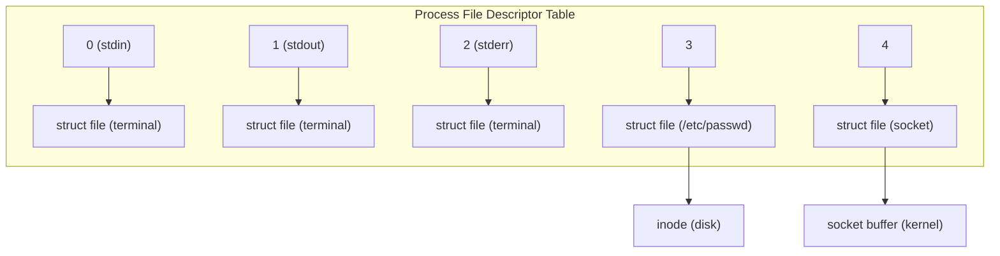
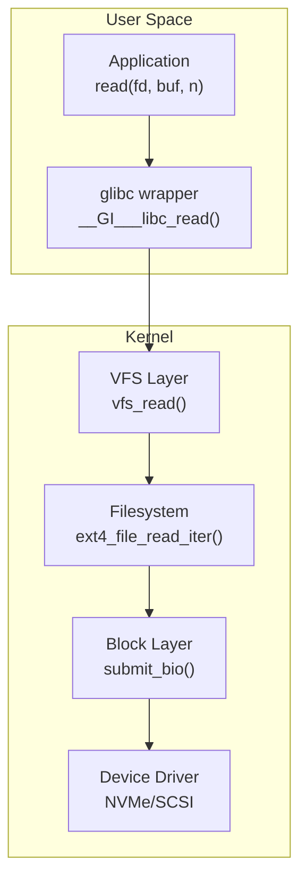
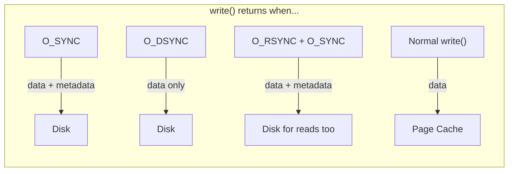
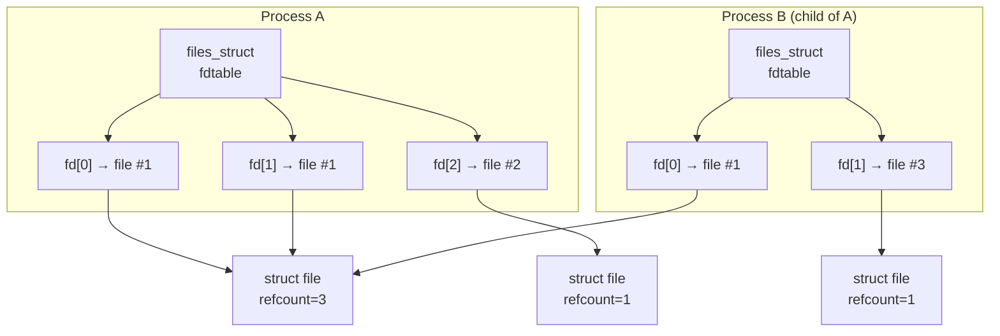

# POSIX File I/O

## Introduction

File I/O is the backbone of Unix/Linux programming. The POSIX file I/O API provides a unified, portable interface for reading and writing not just files on disk, but also devices, pipes, sockets, and virtually everything else in the Linux "everything is a file" philosophy.

This chapter covers the core POSIX I/O functions—`open`, `read`, `write`, `close`, `lseek`—along with advanced topics like direct I/O, synchronous I/O, file descriptor tables, and the `dup2` system call. Understanding these primitives is essential because every higher-level I/O abstraction (stdio, memory-mapped files, io_uring) builds on top of them.

## The File Descriptor

A **file descriptor** (fd) is a small non-negative integer that the kernel uses to reference an open file. Every process has a **file descriptor table** maintained in the kernel's `task_struct`:



**Reserved descriptors:**

| FD | Name | Default |
|----|------|---------|
| 0 | stdin | Standard input |
| 1 | stdout | Standard output |
| 2 | stderr | Standard error |

```bash
# View file descriptors for a process
$ ls -la /proc/self/fd
lrwx------ 1 user user 64 Jul 21 12:00 0 -> /dev/pts/0
lrwx------ 1 user user 64 Jul 21 12:00 1 -> /dev/pts/0
lrwx------ 1 user user 64 Jul 21 12:00 2 -> /dev/pts/0
lr-x------ 1 user user 64 Jul 21 12:00 3 -> /proc/12345/fd
```

### The Three-Level I/O Architecture



## open() and openat()

### Function Signatures

```c
#include <fcntl.h>
#include <sys/types.h>
#include <sys/stat.h>

/* Legacy open — deprecated in new code */
int open(const char *pathname, int flags, ... /* mode_t mode */);

/* Preferred: openat — relative to a directory fd */
int openat(int dirfd, const char *pathname, int flags, ... /* mode_t mode */);
```

### Flags

```c
/* Access mode (mutually exclusive, masked with O_ACCMODE) */
O_RDONLY    /* Read only */
O_WRONLY    /* Write only */
O_RDWR      /* Read and write */

/* File creation */
O_CREAT     /* Create if it doesn't exist (needs mode argument) */
O_EXCL      /* Fail if O_CREAT and file exists (atomic) */
O_TRUNC     /* Truncate to zero length if it exists */
O_APPEND    /* Append to end on every write */

/* I/O behavior */
O_NONBLOCK  /* Non-blocking I/O */
O_NOCTTY    /* Don't become controlling terminal */
O_DSYNC     /* Synchronized data writes (see below) */
O_RSYNC     /* Synchronized read (equivalent to O_SYNC on Linux) */
O_SYNC      /* Synchronized file integrity writes */
O_DIRECT    /* Bypass page cache (direct I/O) */
O_NOATIME   /* Don't update access time */
O_TMPFILE   /* Create unnamed temporary file */
O_CLOEXEC   /* Set close-on-exec flag */
O_DIRECTORY /* Fail if not a directory */
O_NOFOLLOW  /* Don't follow symlinks */
O_PATH      /* Obtain an fd for path operations only */
```

### Examples

```c
#include <fcntl.h>
#include <unistd.h>
#include <stdio.h>
#include <string.h>
#include <errno.h>

int main(void)
{
    int fd;

    /* Create a new file with mode 0644 */
    fd = open("example.txt", O_WRONLY | O_CREAT | O_TRUNC, 0644);
    if (fd == -1) {
        perror("open");
        return 1;
    }

    const char *msg = "Hello, POSIX I/O!\n";
    write(fd, msg, strlen(msg));
    close(fd);

    /* Atomic create — fails if file exists */
    fd = open("example.txt", O_WRONLY | O_CREAT | O_EXCL, 0644);
    if (fd == -1 && errno == EEXIST) {
        printf("File already exists (good, that was atomic!)\n");
    }

    /* openat — relative to a directory */
    int dirfd = open("/tmp", O_RDONLY | O_DIRECTORY);
    if (dirfd != -1) {
        fd = openat(dirfd, "testfile.txt",
                    O_WRONLY | O_CREAT | O_TRUNC, 0600);
        write(fd, "via openat\n", 11);
        close(fd);
        close(dirfd);
    }

    return 0;
}
```

**Why `openat()` over `open()`:**

1. **Race-free directory resolution**: Avoid TOCTOU bugs with relative paths
2. **Consistent behavior**: `openat(AT_FDCWD, ...)` is identical to `open()`
3. **Sandboxing**: Combine with `O_PATH` and `/proc/self/fd/` for secure path resolution

## read() and write()

### Function Signatures

```c
#include <unistd.h>

ssize_t read(int fd, void *buf, size_t count);
ssize_t write(int fd, const void *buf, size_t count);
```

**Return values:**
- `> 0`: Number of bytes actually read/written
- `0`: End of file (read only)
- `-1`: Error (check `errno`)

### Critical: Short Reads and Writes

**Always handle short reads and writes.** A single `read()`/`write()` call is NOT guaranteed to transfer all requested bytes:

```c
/* WRONG: ignoring short writes */
write(fd, buf, len);  /* Might write fewer than len bytes! */

/* CORRECT: loop until all bytes are written */
ssize_t write_all(int fd, const void *buf, size_t count)
{
    const char *p = buf;
    size_t remaining = count;

    while (remaining > 0) {
        ssize_t n = write(fd, p, remaining);
        if (n == -1) {
            if (errno == EINTR)
                continue;   /* Interrupted by signal, retry */
            return -1;      /* Real error */
        }
        remaining -= n;
        p += n;
    }
    return count;
}

/* CORRECT: loop for reads too */
ssize_t read_all(int fd, void *buf, size_t count)
{
    char *p = buf;
    size_t remaining = count;

    while (remaining > 0) {
        ssize_t n = read(fd, p, remaining);
        if (n == -1) {
            if (errno == EINTR)
                continue;
            return -1;
        }
        if (n == 0)
            break;  /* EOF */
        remaining -= n;
        p += n;
    }
    return count - remaining;
}
```

**Why short reads/writes happen:**
- `read()` from a pipe/socket may return fewer bytes than requested
- `write()` to a regular file may be interrupted by a signal
- Near the end of a file
- Kernel buffer constraints

### readv() and writev() — Scatter/Gather I/O

```c
#include <sys/uio.h>

ssize_t readv(int fd, const struct iovec *iov, int iovcnt);
ssize_t writev(int fd, const struct iovec *iov, int iovcnt);

struct iovec {
    void  *iov_base;    /* Starting address */
    size_t iov_len;     /* Number of bytes */
};
```

```c
/* Write a header + payload in a single syscall */
struct iovec iov[2];
iov[0].iov_base = header;
iov[0].iov_len = header_len;
iov[1].iov_base = payload;
iov[1].iov_len = payload_len;

writev(fd, iov, 2);  /* Single syscall, atomic for pipes */
```

## close()

```c
#include <unistd.h>
int close(int fd);
```

**Key details:**
- Returns 0 on success, -1 on error
- The fd number is freed and can be reused by subsequent `open()`/`socket()` calls
- **Errors on close are real!** Especially for NFS and network filesystems where `close()` flushes data. Always check the return value.
- `close()` is **not idempotent**: closing an already-closed fd returns `EBADF`

```c
/* WRONG: ignoring close errors */
close(fd);

/* CORRECT */
if (close(fd) == -1) {
    perror("close");
    /* Handle error—data may not have been written! */
}
```

### close-on-exec (CLOEXEC)

By default, file descriptors survive `exec()`. To prevent leaking fds to child processes:

```c
/* At open time (preferred—atomic) */
int fd = open("file", O_RDONLY | O_CLOEXEC);

/* After the fact (has a race window) */
int fd = open("file", O_RDONLY);
fcntl(fd, F_SETFD, FD_CLOEXEC);
```

## lseek() — File Offset

```c
#include <unistd.h>
off_t lseek(int fd, off_t offset, int whence);
```

| whence | Meaning |
|--------|---------|
| `SEEK_SET` | Set offset to `offset` bytes from beginning |
| `SEEK_CUR` | Set offset to current + `offset` |
| `SEEK_END` | Set offset to file size + `offset` |
| `SEEK_DATA` | Next data region at or after `offset` |
| `SEEK_HOLE` | Next hole (sparse file) at or after `offset` |

```c
/* Get current file offset */
off_t pos = lseek(fd, 0, SEEK_CUR);

/* Get file size */
off_t size = lseek(fd, 0, SEEK_END);

/* Seek to beginning */
lseek(fd, 0, SEEK_SET);

/* Sparse file operations */
lseek(fd, 1024*1024, SEEK_SET);  /* Create a 1MB "hole" */
write(fd, "X", 1);               /* Write 1 byte at 1MB offset */
```

**Notes:**
- `lseek()` does not work on pipes, sockets, or FIFOs (`ESPIPE`)
- The file offset can be positioned past the end of the file (creates a sparse "hole" on most filesystems)

## O_DIRECT — Bypassing the Page Cache

`O_DIRECT` sends I/O directly between user buffers and the block device, bypassing the kernel's page cache. This is critical for databases and applications that manage their own caching.

### Requirements

```c
/* Buffer must be aligned to filesystem block size (typically 512 or 4096) */
#define ALIGNMENT 4096

void *buf;
posix_memalign(&buf, ALIGNMENT, 4096);

int fd = open("data.db", O_RDWR | O_DIRECT);
read(fd, buf, 4096);  /* Must be multiple of block size */
```

```c
/* Full O_DIRECT example */
#include <fcntl.h>
#include <unistd.h>
#include <stdlib.h>
#include <stdio.h>
#include <string.h>

#define BLOCK_SIZE 4096

int main(void)
{
    void *buf;
    int fd;

    /* Aligned buffer allocation */
    if (posix_memalign(&buf, BLOCK_SIZE, BLOCK_SIZE) != 0) {
        perror("posix_memalign");
        return 1;
    }

    fd = open("direct_test.dat", O_RDWR | O_CREAT | O_DIRECT, 0644);
    if (fd == -1) {
        perror("open");
        return 1;
    }

    /* Write — must be aligned in size too */
    memset(buf, 'A', BLOCK_SIZE);
    ssize_t n = write(fd, buf, BLOCK_SIZE);
    printf("Wrote %zd bytes (direct I/O)\n", n);

    /* Read back */
    lseek(fd, 0, SEEK_SET);
    memset(buf, 0, BLOCK_SIZE);
    n = read(fd, buf, BLOCK_SIZE);
    printf("Read %zd bytes: first char = '%c'\n", n, ((char *)buf)[0]);

    close(fd);
    free(buf);
    return 0;
}
```

**When to use O_DIRECT:**
- Databases (PostgreSQL, MySQL/InnoDB) with their own buffer pools
- Avoiding double-buffering (page cache + application cache)
- Streaming workloads where data is accessed once

**When NOT to use O_DIRECT:**
- Small random reads (page cache is better)
- Sequential access patterns (readahead helps)
- When you want POSIX semantics

## O_SYNC — Synchronous I/O



| Flag | write() completes after | read() behavior |
|------|------------------------|-----------------|
| None | Data in page cache | From page cache |
| `O_SYNC` | Data + metadata on disk | From page cache |
| `O_DSYNC` | Data on disk | From page cache |
| `O_SYNC\|O_RSYNC` | Data + metadata on disk | Synchronized |

```bash
# Compare write performance
$ dd if=/dev/zero of=/tmp/test_nosync bs=4k count=10000
$ dd if=/dev/zero of=/tmp/test_sync bs=4k count=10000 oflag=sync
```

## The File Descriptor Table

### Process-Level FD Table

Each process has its own file descriptor table, stored in `task_struct->files`:



**Three-level structure:**

1. **Process fd table**: Array in `files_struct` mapping fd numbers to `struct file *`
2. **Open file table**: `struct file` instances with current offset, flags, refcount
3. **Inode/vnode**: File metadata, data on disk

**Key insight**: `dup()` and `fork()` create *new fd table entries* pointing to the *same* `struct file`. This means:
- Two fds sharing a `struct file` share the same file offset
- Two fds with separate `struct file` instances have independent offsets

## dup2() — Duplicating File Descriptors

```c
#include <unistd.h>

int dup(int oldfd);              /* Lowest available fd */
int dup2(int oldfd, int newfd);  /* Specific fd number */
int dup3(int oldfd, int newfd, int flags);  /* dup2 + flags */
```

### Classic Use Case: I/O Redirection

```c
#include <unistd.h>
#include <fcntl.h>
#include <stdio.h>

int main(void)
{
    /* Redirect stdout to a file */
    int fd = open("output.txt", O_WRONLY | O_CREAT | O_TRUNC, 0644);
    if (fd == -1) {
        perror("open");
        return 1;
    }

    /* Now fd 1 (stdout) points to output.txt */
    dup2(fd, STDOUT_FILENO);
    close(fd);  /* Close original—stdout still works */

    /* This goes to output.txt, not the terminal */
    printf("Hello from redirected stdout!\n");

    /* Restore stdout (if needed) would require saving original fd */
    return 0;
}
```

### Implementing a Shell Pipe

```c
/* Simulate: ls | grep .c */
#include <unistd.h>
#include <sys/wait.h>

int main(void)
{
    int pipefd[2];
    pipe(pipefd);  /* pipefd[0]=read, pipefd[1]=write */

    if (fork() == 0) {
        /* Child 1: ls */
        dup2(pipefd[1], STDOUT_FILENO);  /* stdout → pipe write */
        close(pipefd[0]);
        close(pipefd[1]);
        execlp("ls", "ls", NULL);
    }

    if (fork() == 0) {
        /* Child 2: grep */
        dup2(pipefd[0], STDIN_FILENO);   /* stdin ← pipe read */
        close(pipefd[0]);
        close(pipefd[1]);
        execlp("grep", "grep", ".c", NULL);
    }

    close(pipefd[0]);
    close(pipefd[1]);
    wait(NULL);
    wait(NULL);
    return 0;
}
```

### dup3 with CLOEXEC

```c
/* Atomically set close-on-exec */
int newfd = dup3(oldfd, targetfd, O_CLOEXEC);
```

## pread() and pwrite() — Positioned I/O

```c
#include <unistd.h>

ssize_t pread(int fd, void *buf, size_t count, off_t offset);
ssize_t pwrite(int fd, const void *buf, size_t count, off_t offset);
```

These combine `lseek()` + `read()`/`write()` atomically:

```c
/* Thread-safe: no race on file offset */
pread(fd, buf1, 100, 0);     /* Thread A reads bytes 0-99 */
pread(fd, buf2, 100, 100);   /* Thread B reads bytes 100-199 */
/* Both work concurrently without locking */
```

## Scatter/Gather with preadv/pwritev

```c
/* Combines positioned I/O with scatter/gather */
ssize_t preadv(int fd, const struct iovec *iov, int iovcnt, off_t offset);
ssize_t pwritev(int fd, const struct iovec *iov, int iovcnt, off_t offset);

/* Linux-specific extensions with flags */
ssize_t preadv2(int fd, const struct iovec *iov, int iovcnt,
                off_t offset, int flags);
ssize_t pwritev2(int fd, const struct iovec *iov, int iovcnt,
                 off_t offset, int flags);
```

## File I/O Performance Patterns

### Sequential Read Ahead

```c
/* The kernel automatically readaheads for sequential access */
int fd = open("largefile", O_RDONLY);
char buf[4096];
while (read(fd, buf, sizeof(buf)) > 0) {
    process(buf);
}
close(fd);
/* Kernel detects sequential pattern and prefetches */
```

### posix_fadvise()

```c
#include <fcntl.h>

int posix_fadvise(int fd, off_t offset, off_t len, int advice);
```

| Advice | Meaning |
|--------|---------|
| `POSIX_FADV_NORMAL` | Default behavior |
| `POSIX_FADV_SEQUENTIAL` | Expect sequential access (aggressive readahead) |
| `POSIX_FADV_RANDOM` | Expect random access (disable readahead) |
| `POSIX_FADV_WILLNEED` | Will need these pages soon (prefetch) |
| `POSIX_FADV_DONTNEED` | Won't need these pages (drop from cache) |
| `POSIX_FADV_NOREUSE` | Use each page once |

```c
/* Tell kernel we'll read sequentially */
posix_fadvise(fd, 0, 0, POSIX_FADV_SEQUENTIAL);

/* Prefetch a region */
posix_fadvise(fd, offset, length, POSIX_FADV_WILLNEED);

/* Drop data from cache when done */
posix_fadvise(fd, 0, 0, POSIX_FADV_DONTNEED);
```

### fallocate() — Preallocating Space

```c
#include <fcntl.h>

int fallocate(int fd, int mode, off_t offset, off_t len);
```

```c
/* Allocate 1GB without writing zeros */
fallocate(fd, 0, 0, 1024ULL * 1024 * 1024);

/* Punch a hole (create sparse region) */
fallocate(fd, FALLOC_FL_PUNCH_HOLE | FALLOC_FL_KEEP_SIZE,
          1024*1024, 4096);
```

## References

- [The Linux Kernel Documentation](https://docs.kernel.org/)
- [LWN.net - Linux and free software news](https://lwn.net/)
- [GNU Project Documentation](https://www.gnu.org/doc/doc.html)
- [GNU Manuals](https://www.gnu.org/manual/manual.html)
- [Free Software Directory](https://directory.fsf.org/wiki/Main_Page)
- [Planet GNU](https://planet.gnu.org/)
- [Free Software Books](https://www.gnu.org/doc/other-free-books.html)

- [open(2) — Linux manual page](https://man7.org/linux/man-pages/man2/open.2.html)
- [read(2) — Linux manual page](https://man7.org/linux/man-pages/man2/read.2.html)
- [write(2) — Linux manual page](https://man7.org/linux/man-pages/man2/write.2.html)
- [lseek(2) — Linux manual page](https://man7.org/linux/man-pages/man2/lseek.2.html)
- [dup(2) — Linux manual page](https://man7.org/linux/man-pages/man2/dup.2.html)
- [fcntl(2) — Linux manual page](https://man7.org/linux/man-pages/man2/fcntl.2.html)
- ["Advanced Programming in the UNIX Environment" by W. Richard Stevens](https://www.amazon.com/Advanced-Programming-UNIX-Environment-3rd/dp/0321637739)
- [The Linux Programming Interface by Michael Kerrisk](https://man7.org/tlpi/)

## Related Topics

- [System Calls](./syscalls.md) — How `read()` and `write()` reach the kernel
- [io_uring](./io-uring.md) — Asynchronous I/O alternative
- [epoll](./epoll.md) — Efficient readiness notification for non-blocking I/O
- [Process Control](./process-control.md) — `fork()`, `exec()`, and fd inheritance
- [Pipes](./ipc/pipes.md) — Pipe I/O with `read()`/`write()`
- [ELF Format](./elf.md) — How binaries use file I/O to load segments
