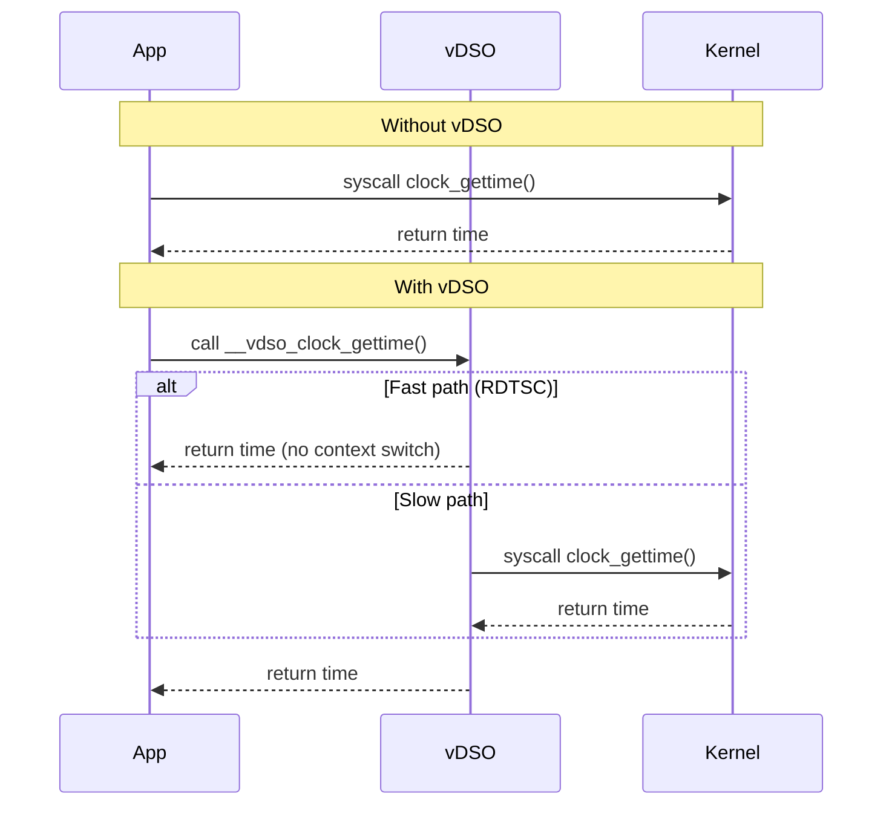

# Inline Assembly

## Introduction

Inline assembly allows embedding assembly language instructions directly within C/C++ code. This is essential for accessing CPU-specific instructions not exposed by the compiler, implementing performance-critical routines, interacting with hardware, and writing low-level kernel or runtime code.

GCC's extended inline assembly is the de facto standard on Linux, providing a rich constraint system to communicate between C variables and assembly operands.

## GCC Inline Assembly Syntax

### Basic Form

```c
asm("assembly template"
    : output operands    /* optional */
    : input operands     /* optional */
    : clobber list       /* optional */
);
```

Or using the `__asm__` keyword (preferred in headers to avoid conflicts):

```c
__asm__ __volatile__("assembly template"
    : "=r"(result)      /* output */
    : "r"(input)        /* input */
    : "memory"          /* clobbers */
);
```

### Simple Examples

```c
/* Read the CPU timestamp counter */
static inline uint64_t rdtsc(void) {
    uint32_t lo, hi;
    __asm__ __volatile__("rdtsc" : "=a"(lo), "=d"(hi));
    return ((uint64_t)hi << 32) | lo;
}

/* CPUID instruction */
static inline void cpuid(uint32_t leaf, uint32_t *eax, uint32_t *ebx,
                         uint32_t *ecx, uint32_t *edx) {
    __asm__ __volatile__("cpuid"
        : "=a"(*eax), "=b"(*ebx), "=c"(*ecx), "=d"(*edx)
        : "a"(leaf)
    );
}

/* Memory barrier */
#define mb()  __asm__ __volatile__("mfence" ::: "memory")
#define rmb() __asm__ __volatile__("lfence" ::: "memory")
#define wmb() __asm__ __volatile__("sfence" ::: "memory")
```

## Operand Constraints

Constraints tell the compiler how to bind C variables to assembly operands.

### Common x86-64 Constraints

| Constraint | Meaning |
|---|---|
| `r` | General-purpose register |
| `a` | `%eax`/`%rax` |
| `b` | `%ebx`/`%rbx` |
| `c` | `%ecx`/`%rcx` |
| `d` | `%edx`/`%rdx` |
| `S` | `%esi`/`%rsi` |
| `D` | `%edi`/`%rdi` |
| `m` | Memory operand |
| `i` | Immediate integer |
| `n` | Known immediate integer |
| `g` | Any register, memory, or immediate |
| `0` | Same as operand 0 (matching constraint) |

### Output Modifiers

| Modifier | Meaning |
|---|---|
| `=` | Write-only (overwrites previous value) |
| `+` | Read-write (both input and output) |
| `&` | Early clobber (written before all inputs consumed) |
| `%` | Commutative with next operand |

### Constraint Examples

```c
/* Simple addition: output in a register */
int add(int a, int b) {
    int result;
    __asm__("addl %2, %1\n\t"
            "movl %1, %0"
            : "=r"(result)
            : "r"(a), "r"(b)
    );
    return result;
}

/* Using specific registers */
uint64_t syscall1(uint64_t nr, uint64_t arg1) {
    uint64_t ret;
    __asm__ __volatile__(
        "syscall"
        : "=a"(ret)
        : "a"(nr), "D"(arg1)
        : "rcx", "r11", "memory"
    );
    return ret;
}

/* Memory operand */
static inline void atomic_inc(int *ptr) {
    __asm__ __volatile__(
        "lock incl %0"
        : "+m"(*ptr)
        :
        : "memory"
    );
}
```

## Clobber Lists

The clobber list tells the compiler which registers or state the assembly modifies beyond the explicit operands.

### Common Clobbers

```c
/* "memory" — assembly reads/writes memory not listed in operands */
__asm__ __volatile__(
    "mov %0, %%rax"
    :
    : "r"(ptr)
    : "memory"
);

/* "cc" — condition codes (flags register) modified */
__asm__(
    "add %1, %0"
    : "+r"(val)
    : "r"(other)
    : "cc"
);

/* Specific register clobbers */
__asm__ __volatile__(
    "cpuid"
    : "=a"(eax), "=b"(ebx), "=c"(ecx), "=d"(edx)
    : "a"(leaf)
);
/* No clobber needed — outputs already specify exact registers */
```

### "memory" Clobber Deep Dive

The `"memory"` clobber acts as a **compiler memory barrier**. It tells the compiler:
1. Any memory value may have changed — re-read from memory, don't use cached values in registers
2. Don't reorder memory accesses across this barrier
3. Write pending stores to memory before this point

```c
/* This prevents compiler from reordering across the asm */
static inline void compiler_barrier(void) {
    __asm__ __volatile__("" ::: "memory");
}

/* Combined with hardware barrier for full fence */
#define smp_mb() __asm__ __volatile__("mfence" ::: "memory")
```

## Advanced Patterns

### Multi-line Assembly with Labels

```c
/* Atomic compare-and-swap */
static inline int atomic_cmpxchg(int *ptr, int old, int new_val) {
    int prev;
    __asm__ __volatile__(
        "lock cmpxchgl %2, %1"
        : "=a"(prev), "+m"(*ptr)
        : "r"(new_val), "0"(old)
        : "memory"
    );
    return prev;
}
```

### Accessing CPU Control Registers

```c
/* Read CR3 (page table base) — kernel only */
static inline uint64_t read_cr3(void) {
    uint64_t val;
    __asm__("mov %%cr3, %0" : "=r"(val));
    return val;
}

/* Write to MSR (Model Specific Register) */
static inline void wrmsr(uint32_t msr, uint64_t value) {
    uint32_t lo = value & 0xFFFFFFFF;
    uint32_t hi = value >> 32;
    __asm__ __volatile__(
        "wrmsr"
        :
        : "c"(msr), "a"(lo), "d"(hi)
    );
}
```

### String Operations

```c
/* Optimized memcpy using rep movsb */
static inline void *fast_memcpy(void *dst, const void *src, size_t n) {
    __asm__ __volatile__(
        "rep movsb"
        : "+D"(dst), "+S"(src), "+c"(n)
        :
        : "memory"
    );
    return dst;
}

/* Optimized memset */
static inline void *fast_memset(void *dst, int val, size_t n) {
    __asm__ __volatile__(
        "rep stosb"
        : "+D"(dst), "+c"(n)
        : "a"(val)
        : "memory"
    );
    return dst;
}
```

## vsyscall and vDSO

### vsyscall (Legacy)

The `vsyscall` page is a fixed-address memory page mapped by the kernel containing fast implementations of certain syscalls. It's at a fixed address (typically `0xffffffffff600000`).

```c
/* vsyscall gettime — legacy approach */
/* Fixed address, always mapped, but limited (only 4 syscall slots) */
/* Deprecated in favor of vDSO */
```

**Problems with vsyscall:**
- Fixed addresses conflict with ASLR
- Only 4 entry points available
- Security concerns (ROP gadgets at known addresses)
- Emulated via traps on modern kernels (slow)

### vDSO (Virtual Dynamic Shared Object)

The vDSO is the modern replacement. It's a small shared library mapped into every process by the kernel, containing fast syscall implementations.

```bash
# Inspect vDSO mapping
cat /proc/self/maps | grep vdso
# 7fff1b5fe000-7fff1b600000 r-xp 00000000 00:0:0 [vdso]
```

```c
#include <stdio.h>
#include <time.h>
#include <sys/auxv.h>
#include <elf.h>

int main(void) {
    /* Get vDSO base address */
    void *vdso = (void *)getauxval(AT_SYSINFO_EHDR);
    printf("vDSO base: %p\n", vdso);

    /* Using clock_gettime — goes through vDSO, no syscall */
    struct timespec ts;
    clock_gettime(CLOCK_MONOTONIC, &ts);
    printf("Time: %ld.%09ld\n", ts.tv_sec, ts.tv_nsec);
    return 0;
}
```

### How vDSO Works



### Functions Provided by vDSO

| Function | Syscall Avoided | Notes |
|---|---|---|
| `__vdso_clock_gettime` | `clock_gettime` | Uses TSC with calibration |
| `__vdso_gettimeofday` | `gettimeofday` | Legacy, use clock_gettime |
| `__vdso_time` | `time` | Coarse resolution |
| `__vdso_clock_getres` | `clock_getres` | Resolution query |
| `__vdso_getcpu` | `getcpu` | CPU/core affinity |

### vDSO Internals

The vDSO is a minimal ELF shared object. The kernel builds it at boot and maps it into every process's address space at a random location (ASLR-compatible).

```bash
# Extract and inspect vDSO
dd if=/proc/self/mem of=vdso.so bs=1 skip=$((0x7fff1b5fe000)) count=8192 2>/dev/null
readelf -a vdso.so

# Disassemble
objdump -d vdso.so
```

```c
/* How the C library resolves vDSO functions (simplified) */
#include <sys/auxv.h>
#include <elf.h>

typedef long (*clock_gettime_fn)(int, struct timespec *);

static clock_gettime_fn find_vdso_clock_gettime(void) {
    Elf64_Ehdr *ehdr = (Elf64_Ehdr *)getauxval(AT_SYSINFO_EHDR);
    if (!ehdr) return NULL;

    Elf64_Dyn *dyn = (Elf64_Dyn *)((char *)ehdr + /* .dynamic offset */);
    /* Walk dynamic section to find symbol table, string table */
    /* Search for __vdso_clock_gettime symbol */
    /* ... ELF parsing code ... */
    return NULL; /* Simplified */
}
```

## Architecture-Specific Notes

### AArch64 (ARM64)

```c
/* ARM64 inline asm */
static inline uint64_t read_ctr_el0(void) {
    uint64_t val;
    __asm__("mrs %0, ctr_el0" : "=r"(val));
    return val;
}

/* Atomic operation on ARM64 */
static inline void atomic_add(int *ptr, int val) {
    __asm__ __volatile__(
        "1: ldxr w1, [%0]\n\t"
        "   add w1, w1, %1\n\t"
        "   stxr w2, w1, [%0]\n\t"
        "   cbnz w2, 1b\n\t"
        : : "r"(ptr), "r"(val) : "w1", "w2", "memory"
    );
}
```

### Constraint Differences by Architecture

| Constraint | x86-64 | ARM64 | RISC-V |
|---|---|---|---|
| Register | `r` | `r` | `r` |
| Memory | `m` | `m` | `m` |
| Immediate | `i`, `n` | `i`, `n`, `I`, `J`, `K` | `i` |
| Specific reg | `a`, `b`, `c`, `d` | N/A (use local vars) | N/A |

## Best Practices

1. **Always use `__volatile__`** if the asm has side effects the compiler shouldn't optimize away
2. **Use `"memory"` clobber** when accessing memory not listed in operands
3. **Don't assume register values** between asm statements — the compiler may insert code
4. **Prefer compiler builtins** when available (`__builtin_popcount`, `__sync_*`, etc.)
5. **Test with `-O2` and `-O0`** — inline asm bugs often only appear with optimization
6. **Use `static inline`** functions to wrap assembly, not raw asm blocks

```c
/* Prefer compiler builtins over inline asm when possible */
int popcount(uint64_t x) {
    /* Instead of: __asm__("popcnt %0, %1" ...) */
    return __builtin_popcountll(x);
}

/* Compiler-generated atomics are safer */
int val = __sync_fetch_and_add(&counter, 1);
```

## Kernel Inline Assembly Patterns

The Linux kernel makes extensive use of inline assembly for hardware interaction.

### System Call Invocation

```c
/* x86-64 syscall wrapper (simplified) */
static inline long syscall3(long nr, long a1, long a2, long a3) {
    long ret;
    __asm__ __volatile__(
        "syscall"
        : "=a"(ret)
        : "a"(nr), "D"(a1), "S"(a2), "d"(a3)
        : "rcx", "r11", "memory"
    );
    return ret;
}

/* Usage */
long bytes = syscall3(1 /* __NR_write */, 1 /* stdout */,
                     (long)"Hello\n", 6);
```

The kernel also defines syscalls using inline asm macros:

```c
/* From arch/x86/include/asm/unistd.h */
#define __SYSCALL_DEFINEx(x, name, ...) \
    asmlinkage long sys##name(__MAP(x,__SC_DECL,__VA_ARGS__))

/* Example: sys_write defined via macro */
SYSCALL_DEFINE3(write, unsigned int, fd, const char __user *, buf,
                size_t, count)
{
    /* ... kernel implementation ... */
}
```

### Interrupt Control

```c
/* Disable interrupts (x86-64, kernel only) */
static inline void local_irq_disable(void) {
    __asm__ __volatile__("cli" ::: "memory");
}

/* Enable interrupts */
static inline void local_irq_enable(void) {
    __asm__ __volatile__("sti" ::: "memory");
}

/* Save and restore interrupt state */
static inline unsigned long local_irq_save(void) {
    unsigned long flags;
    __asm__ __volatile__(
        "pushfq\n\t"
        "pop %0\n\t"
        "cli"
        : "=r"(flags) :: "memory"
    );
    return flags;
}
```

### x86 Port I/O

```c
/* Read from I/O port */
static inline uint8_t inb(uint16_t port) {
    uint8_t val;
    __asm__ __volatile__("inb %1, %0" : "=a"(val) : "Nd"(port));
    return val;
}

/* Write to I/O port */
static inline void outb(uint8_t val, uint16_t port) {
    __asm__ __volatile__("outb %0, %1" : : "a"(val), "Nd"(port));
}

/* Read from PCI config space (uses port I/O) */
static inline uint32_t pci_config_read(uint8_t bus, uint8_t dev,
                                        uint8_t func, uint8_t offset) {
    uint32_t addr = 0x80000000 |
                    (bus << 16) | (dev << 11) | (func << 8) | (offset & 0xFC);
    outl(addr, 0xCF8);  /* PCI CONFIG_ADDRESS */
    return inl(0xCFC);   /* PCI CONFIG_DATA */
}
```

### Reading Performance Counters

```c
/* Read CR4 register (kernel only) */
static inline unsigned long read_cr4(void) {
    unsigned long val;
    __asm__("mov %%cr4, %0" : "=r"(val));
    return val;
}

/* Write CR4 register */
static inline void write_cr4(unsigned long val) {
    __asm__ __volatile__("mov %0, %%cr4" : : "r"(val) : "memory");
}

/* Read TSC with serialization (prevents out-of-order execution) */
static inline uint64_t rdtscp(uint32_t *aux) {
    uint32_t lo, hi, aux_val;
    __asm__ __volatile__(
        "rdtscp"
        : "=a"(lo), "=d"(hi), "=c"(aux_val)
    );
    if (aux) *aux = aux_val;
    return ((uint64_t)hi << 32) | lo;
}

/* Serialize instruction stream (CPUID as serialization point) */
static inline void cpuid_serialize(void) {
    uint32_t eax, ebx, ecx, edx;
    __asm__ __volatile__("cpuid"
        : "=a"(eax), "=b"(ebx), "=c"(ecx), "=d"(edx)
        : "a"(0)
    );
}
```

### SIMD Operations

```c
#include <immintrin.h>  /* Prefer intrinsics over inline asm for SIMD */

/* But sometimes inline asm is needed for specific instructions */

/* AES-NI round key generation */
static inline __m128i aeskeygenassist(__m128i key, uint8_t rcon) {
    __m128i result;
    __asm__("aeskeygenassist %1, %2, %0"
            : "=x"(result)
            : "x"(key), "i"(rcon)
    );
    return result;
}

/* CRC32 instruction (hardware CRC) */
static inline uint32_t crc32c(uint32_t crc, uint8_t val) {
    __asm__("crc32b %1, %0" : "+r"(crc) : "rm"(val));
    return crc;
}
```

## Debugging Inline Assembly

### Common Pitfalls

```c
/* BAD: Missing "memory" clobber */
__asm__(
    "mov %0, (%1)"
    :
    : "r"(value), "r"(ptr)
    /* Missing: "memory" */
);
/* Compiler may reorder memory accesses around this asm! */

/* BAD: Assuming specific register allocation */
int a = 1, b = 2;
__asm__("add %0, %1" : "=r"(a) : "r"(b));
/* Compiler may put a and b in the same register! */

/* GOOD: Use matching constraint or early clobber */
int a = 1, b = 2;
__asm__("add %1, %0" : "+r"(a) : "r"(b) : "cc");
```

### Disassembling Inline Assembly

```bash
# Compile and disassemble to verify asm output
$ gcc -O2 -S -o test.s test.c
$ objdump -d test.o

# Check specific asm block with -fverbose-asm
$ gcc -O2 -fverbose-asm -S -o test.s test.c
```

### Using GDB to Step Through Assembly


```bash
# Compile with debug info
$ gcc -g -O0 -o test test.c

# In GDB
$ gdb ./test
(gdb) break main
(gdb) run
(gdb) display/i $pc   # Show next instruction
(gdb) stepi           # Step one instruction
(gdb) info registers  # Show all registers
(gdb) x/10i $pc       # Disassemble from current PC
```

## Compiler Intrinsics vs Inline Assembly

Modern compilers provide **intrinsics** — built-in functions that map to specific instructions without writing raw assembly. Prefer intrinsics when available:

| Task | Inline Assembly | Compiler Intrinsic |
|---|---|---|
| Population count | `__asm__("popcnt ...")` | `__builtin_popcountll()` |
| Byte swap | `__asm__("bswap ...")` | `__builtin_bswap64()` |
| Leading zeros | `__asm__("lzcnt ...")` | `__builtin_clzll()` |
| Trailing zeros | `__asm__("tzcnt ...")` | `__builtin_ctzll()` |
| Atomic add | `__asm__("lock add ...")` | `__atomic_add_fetch()` |
| Memory barrier | `__asm__("mfence ...")` | `__atomic_thread_fence()` |
| Unreachable | `__asm__("ud2")` | `__builtin_unreachable()` |

**Advantages of intrinsics over inline asm:**
- Compiler can optimize around them (register allocation, instruction scheduling)
- Portable across architectures (intrinsic works on x86 and ARM)
- No risk of clobber list errors
- Better interaction with optimizers and LTO (Link-Time Optimization)

```c
/* Compare: byte swap with inline asm vs intrinsic */

/* Inline assembly — verbose, architecture-specific */
static inline uint64_t bswap64_asm(uint64_t x) {
    __asm__("bswap %0" : "+r"(x));
    return x;
}

/* Intrinsic — clean, portable */
static inline uint64_t bswap64_builtin(uint64_t x) {
    return __builtin_bswap64(x);
}

/* Both generate the same bswap instruction on x86-64 */
```

### SSE/AVX Intrinsics

For SIMD operations, intrinsics are strongly preferred:

```c
#include <immintrin.h>

/* Vectorized add using AVX2 intrinsics */
void vector_add(float *a, float *b, float *out, size_t n) {
    size_t i;
    for (i = 0; i + 8 <= n; i += 8) {
        __m256 va = _mm256_loadu_ps(&a[i]);
        __m256 vb = _mm256_loadu_ps(&b[i]);
        __m256 vc = _mm256_add_ps(va, vb);
        _mm256_storeu_ps(&out[i], vc);
    }
    /* Handle remainder */
    for (; i < n; i++) {
        out[i] = a[i] + b[i];
    }
}

/* Compare: same thing with inline asm (much harder to write correctly) */
void vector_add_asm(float *a, float *b, float *out, size_t n) {
    for (size_t i = 0; i + 8 <= n; i += 8) {
        __asm__ __volatile__(
            "vmovups (%1), %%ymm0\n\t"
            "vaddps (%2), %%ymm0, %%ymm0\n\t"
            "vmovups %%ymm0, (%0)\n\t"
            : : "r"(&out[i]), "r"(&a[i]), "r"(&b[i])
            : "ymm0", "memory"
        );
    }
}
```

## Inline Assembly in Bootloaders

Bootloaders and early boot code use inline assembly extensively:

```c
/* Real-mode interrupt (BIOS call) */
static void bios_print(const char *msg) {
    while (*msg) {
        __asm__ __volatile__(
            "int $0x10"
            : : "a"((0x0E << 8) | *msg), "b"(0x0007)
        );
        msg++;
    }
}

/* Switch from real mode to protected mode */
static void switch_to_protected(void) {
    /* Disable interrupts */
    __asm__ __volatile__("cli");

    /* Load GDT */
    __asm__ __volatile__("lgdt %0" : : "m"(gdt_desc));

    /* Set PE bit in CR0 */
    uint32_t cr0;
    __asm__("mov %%cr0, %0" : "=r"(cr0));
    cr0 |= 1;  /* Protected Enable */
    __asm__ __volatile__("mov %0, %%cr0" : : "r"(cr0));

    /* Far jump to flush pipeline and load CS */
    __asm__ __volatile__(
        "ljmpl $0x08, $1f\n"
        "1:\n"
        "mov $0x10, %%ax\n"
        "mov %%ax, %%ds\n"
        "mov %%ax, %%es\n"
        "mov %%ax, %%ss\n"
        : : : "ax"
    );
}
```

## References

- [The Linux Kernel Documentation](https://docs.kernel.org/)
- [LWN.net - Linux and free software news](https://lwn.net/)
- [GNU Project Documentation](https://www.gnu.org/doc/doc.html)
- [GNU Manuals](https://www.gnu.org/manual/manual.html)
- [Free Software Directory](https://directory.fsf.org/wiki/Main_Page)
- [Planet GNU](https://planet.gnu.org/)
- [Free Software Books](https://www.gnu.org/doc/other-free-books.html)

- [GCC Extended Asm documentation](https://gcc.gnu.org/onlinedocs/gcc/Extended-Asm.html)
- [GCC Constraints](https://gcc.gnu.org/onlinedocs/gcc/Constraints.html)
- [Linux kernel inline asm guide](https://www.kernel.org/doc/html/latest/process/programming-language.html)
- [vDSO man page](https://man7.org/linux/man-pages/man7/vdso.7.html)
- [System V AMD64 ABI](https://gitlab.com/x86-psABIs/x86-64-ABI)

## Related Topics

- [Memory Management](./memory.md) — mmap, page tables, and kernel memory mapping
- [POSIX AIO](./aio.md) — kernel interaction patterns
- [System Calls](../syscalls/) — how user space enters kernel mode
