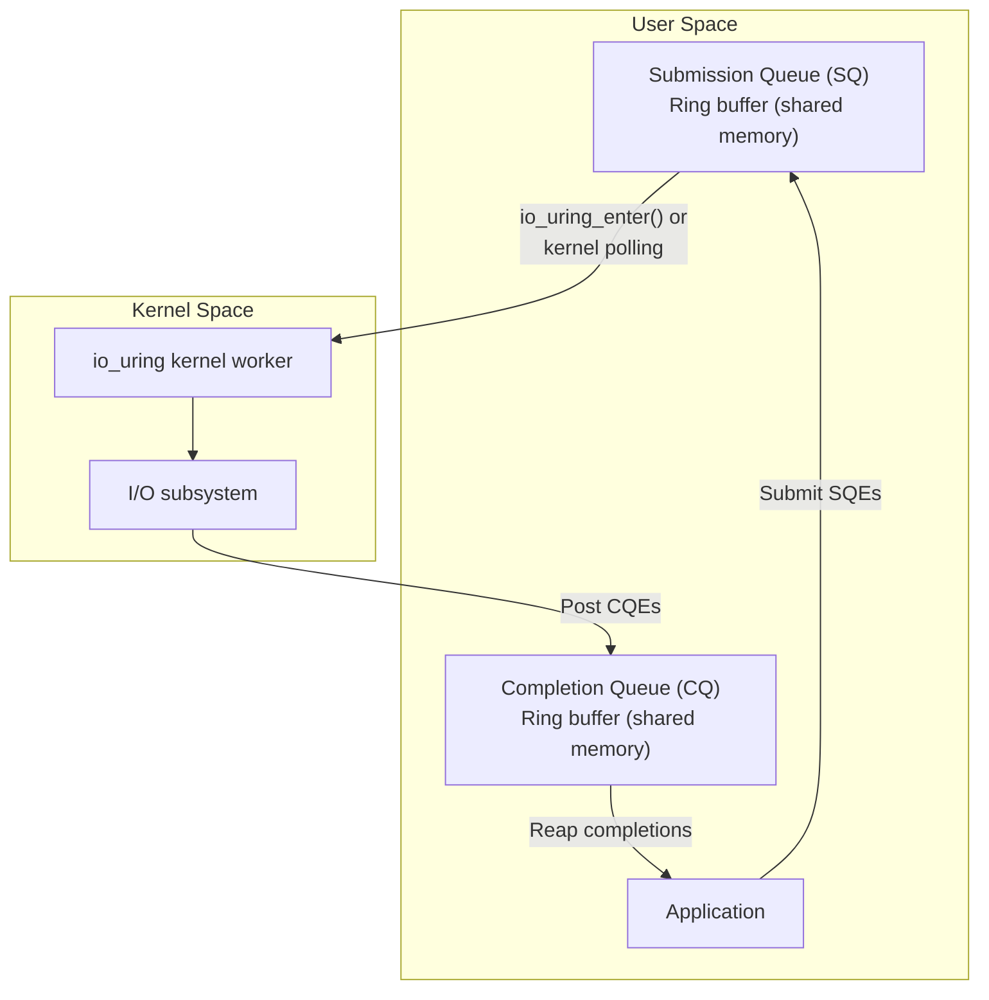
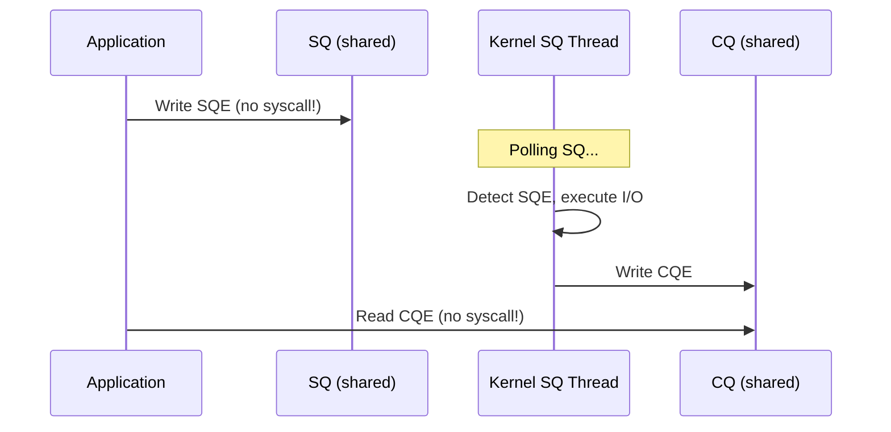

# io_uring

## Introduction

`io_uring` is a Linux kernel interface for **asynchronous I/O** introduced in Linux 5.1 by Jens Axboe. It solves longstanding problems with the POSIX AIO interface (poor performance, limited syscall support, signal-based completion) by using shared memory ring buffers between the kernel and user space, minimizing the number of system calls needed for I/O operations.

`io_uring` supports an ever-growing set of operations: file I/O, network I/O, timers, signals, and even `open()`, `close()`, `stat()`, and `connect()`. It has become the standard for high-performance I/O on Linux.

## Architecture



### Key Design Principles

1. **Shared ring buffers**: SQ and CQ are mapped into user space — no copy needed
2. **Batching**: Submit multiple operations with a single `io_uring_enter()` syscall
3. **Kernel-side polling**: With `IORING_SETUP_SQPOLL`, the kernel polls the SQ, eliminating even the `io_uring_enter()` call
4. **Zero-copy**: Registered buffers eliminate repeated buffer registration
5. **Fixed files**: Pre-register file descriptors for faster operations

## io_uring_setup()

```c
#include <linux/io_uring.h>

int io_uring_setup(unsigned entries, struct io_uring_params *params);
```

### The io_uring_params Structure

```c
struct io_uring_params {
    __u32 sq_entries;       /* Actual SQ size (output) */
    __u32 cq_entries;       /* Actual CQ size (output) */
    __u32 flags;            /* IORING_SETUP_* flags */
    __u32 sq_thread_cpu;    /* CPU for SQ polling thread */
    __u32 sq_thread_idle;   /* Idle timeout for SQ thread (ms) */
    __u32 features;         /* Supported features (output) */
    __u32 wq_fd;            /* Shared workqueue fd */
    __u32 resv[3];
    struct io_sqring_offsets sq_off;  /* SQ ring offsets */
    struct io_cqring_offsets cq_off;  /* CQ ring offsets */
};
```

### Setup Flags

| Flag | Effect |
|------|--------|
| `IORING_SETUP_SQPOLL` | Kernel thread polls SQ (no `io_uring_enter()` needed) |
| `IORING_SETUP_SQ_AFF` | Pin SQ thread to specific CPU |
| `IORING_SETUP_CQSIZE` | Specify CQ size independently |
| `IORING_SETUP_CLAMP` | Clamp parameters instead of erroring |
| `IORING_SETUP_R_DISABLED` | Start with ring disabled |
| `IORING_SETUP_SUBMIT_ALL` | Submit all SQEs even if one fails |
| `IORING_SETUP_SINGLE_ISSUER` | Only one thread submits (optimization) |
| `IORING_SETUP_DEFER_TASKRUN` | Defer CQE processing to `io_uring_enter()` |

## Submission Queue (SQ)

### Submission Queue Entry (SQE)

```c
struct io_uring_sqe {
    __u8  opcode;       /* IORING_OP_* */
    __u8  flags;        /* IOSQE_* flags */
    __u16 ioprio;       /* I/O priority */
    __s32 fd;           /* File descriptor */
    __u64 off;          /* Offset (or addr2 for some ops) */
    __u64 addr;         /* Buffer address */
    __u32 len;          /* Buffer length */
    __u64 data;         /* User data (passed back in CQE) */
    union {
        __u16 opcode_flags;
        __u32 splice_fd_in;
    };
    __u64 __pad2[3];
};
```

### SQE Flags

| Flag | Meaning |
|------|---------|
| `IOSQE_FIXED_FILE` | `fd` is an index into registered files |
| `IOSQE_IO_DRAIN` | Wait for previous SQEs to complete |
| `IOSQE_IO_LINK` | Link with next SQE (sequential dependency) |
| `IOSQE_IO_HARDLINK` | Like LINK but survives errors |
| `IOSQE_ASYNC` | Force async execution |
| `IOSQE_BUFFER_SELECT` | Select buffer from registered pool |

### Supported Opcodes

| Opcode | Operation |
|--------|-----------|
| `IORING_OP_READ` | Read from fd |
| `IORING_OP_WRITE` | Write to fd |
| `IORING_OP_READV` | Vectored read |
| `IORING_OP_WRITEV` | Vectored write |
| `IORING_OP_READ_FIXED` | Read with registered buffer |
| `IORING_OP_WRITE_FIXED` | Write with registered buffer |
| `IORING_OP_SEND` | Send on socket |
| `IORING_OP_RECV` | Receive on socket |
| `IORING_OP_ACCEPT` | Accept connection |
| `IORING_OP_CONNECT` | Connect socket |
| `IORING_OP_OPENAT` | Open file |
| `IORING_OP_CLOSE` | Close fd |
| `IORING_OP_STATX` | Stat file |
| `IORING_OP_TIMEOUT` | Timer |
| `IORING_OP_POLL_ADD` | Add poll |
| `IORING_OP_POLL_REMOVE` | Remove poll |
| `IORING_OP_FSYNC` | File sync |
| `IORING_OP_SPLICE` | Splice data |
| `IORING_OP_TEE` | Tee data |
| `IORING_OP_SHUTDOWN` | Shutdown socket |

## Completion Queue (CQ)

### Completion Queue Entry (CQE)

```c
struct io_uring_cqe {
    __u64 user_data;    /* Matches SQE.user_data */
    __s32 res;          /* Result (like syscall return) */
    __u32 flags;        /* CQE flags */
};
```

- `res` >= 0: Success (bytes transferred, fd number, etc.)
- `res` < 0: Error (negated errno, e.g., `-EBADF`)

### CQE Flags

| Flag | Meaning |
|------|---------|
| `IORING_CQE_F_BUFFER` | Buffer ID in upper 16 bits of `flags` |
| `IORING_CQE_F_MORE` | More completions coming (for multishot) |
| `IORING_CQE_F_SOCK_NONEMPTY` | Socket has more data |

## Basic Example: Async File Read

```c
#include <liburing.h>
#include <fcntl.h>
#include <stdio.h>
#include <string.h>
#include <unistd.h>

int main(void)
{
    struct io_uring ring;
    struct io_uring_sqe *sqe;
    struct io_uring_cqe *cqe;

    /* Initialize io_uring with 4 entries */
    int ret = io_uring_queue_init(4, &ring, 0);
    if (ret < 0) {
        fprintf(stderr, "io_uring_queue_init: %s\n", strerror(-ret));
        return 1;
    }

    /* Open file */
    int fd = open("/etc/hostname", O_RDONLY);
    if (fd < 0) {
        perror("open");
        return 1;
    }

    char buf[256];
    memset(buf, 0, sizeof(buf));

    /* Get a submission queue entry */
    sqe = io_uring_get_sqe(&ring);

    /* Prepare a read operation */
    io_uring_prep_read(sqe, fd, buf, sizeof(buf) - 1, 0);
    io_uring_sqe_set_data(sqe, buf);  /* Associate user data */

    /* Submit the SQE */
    io_uring_submit(&ring);

    /* Wait for completion */
    ret = io_uring_wait_cqe(&ring, &cqe);
    if (ret < 0) {
        fprintf(stderr, "io_uring_wait_cqe: %s\n", strerror(-ret));
        return 1;
    }

    /* Check result */
    if (cqe->res < 0) {
        fprintf(stderr, "Read failed: %s\n", strerror(-cqe->res));
    } else {
        printf("Read %d bytes: %s\n", cqe->res, buf);
    }

    /* Mark CQE as consumed */
    io_uring_cqe_seen(&ring, cqe);

    /* Cleanup */
    close(fd);
    io_uring_queue_exit(&ring);

    return 0;
}
```

```bash
$ gcc -o uring_read uring_read.c -luring
$ ./uring_read
Read 7 bytes: example
```

## Batch Submission

The real power of io_uring comes from batching multiple operations:

```c
#include <liburing.h>
#include <fcntl.h>
#include <stdio.h>
#include <string.h>

int main(void)
{
    struct io_uring ring;
    io_uring_queue_init(32, &ring, 0);

    int fds[3];
    fds[0] = open("/etc/hostname", O_RDONLY);
    fds[1] = open("/etc/os-release", O_RDONLY);
    fds[2] = open("/proc/version", O_RDONLY);

    char bufs[3][256];
    memset(bufs, 0, sizeof(bufs));

    /* Submit 3 reads in one batch */
    struct io_uring_sqe *sqe;

    sqe = io_uring_get_sqe(&ring);
    io_uring_prep_read(sqe, fds[0], bufs[0], 255, 0);
    io_uring_sqe_set_data(sqe, (void *)(long)0);

    sqe = io_uring_get_sqe(&ring);
    io_uring_prep_read(sqe, fds[1], bufs[1], 255, 0);
    io_uring_sqe_set_data(sqe, (void *)(long)1);

    sqe = io_uring_get_sqe(&ring);
    io_uring_prep_read(sqe, fds[2], bufs[2], 255, 0);
    io_uring_sqe_set_data(sqe, (void *)(long)2);

    /* Submit all 3 at once */
    io_uring_submit(&ring);

    /* Collect all 3 completions */
    for (int i = 0; i < 3; i++) {
        struct io_uring_cqe *cqe;
        io_uring_wait_cqe(&ring, &cqe);

        int idx = (int)(long)io_uring_cqe_get_data(cqe);
        if (cqe->res >= 0)
            printf("File %d: read %d bytes\n", idx, cqe->res);

        io_uring_cqe_seen(&ring, cqe);
    }

    for (int i = 0; i < 3; i++)
        close(fds[i]);
    io_uring_queue_exit(&ring);

    return 0;
}
```

## SQ Polling Mode

With `IORING_SETUP_SQPOLL`, a kernel thread continuously polls the submission queue. The application never needs to call `io_uring_enter()` for submission:

```c
struct io_uring_params params = {0};
params.flags = IORING_SETUP_SQPOLL;
params.sq_thread_idle = 2000;  /* Idle for 2s before sleeping */

io_uring_queue_init_params(256, &ring, &params);

/* Submit without syscall (kernel thread picks up SQEs) */
sqe = io_uring_get_sqe(&ring);
io_uring_prep_read(sqe, fd, buf, size, offset);
io_uring_sqe_set_data(sqe, ctx);

/* Memory barrier to ensure SQE is visible */
io_uring_submit(&ring);  /* May not need syscall in SQPOLL mode */

/* Check if kernel thread is still running */
if (io_uring_sq_ready(&ring) > 0) {
    /* SQ thread might be sleeping, wake it up */
    io_uring_enter(ring.fd, 0, 0, IORING_ENTER_SQ_WAIT);
}
```



**Latency improvement**: ~0.1μs per operation (vs ~0.3μs with `io_uring_enter()`).

## Registered Buffers

Avoid repeated buffer registration with `io_uring_register_buffers()`:

```c
/* Register buffers upfront */
struct iovec iovecs[4];
for (int i = 0; i < 4; i++) {
    iovecs[i].iov_base = aligned_alloc(4096, 4096);
    iovecs[i].iov_len = 4096;
}
io_uring_register_buffers(&ring, iovecs, 4);

/* Use registered buffer by index */
sqe = io_uring_get_sqe(&ring);
io_uring_prep_read_fixed(sqe, fd, iovecs[0].iov_base,
                         4096, 0, 0);  /* buffer index 0 */

/* Unregister when done */
io_uring_unregister_buffers(&ring);
```

### Registered Files

```c
int fds[100];
for (int i = 0; i < 100; i++)
    fds[i] = open(files[i], O_RDONLY);

io_uring_register_files(&ring, fds, 100);

/* Use file index instead of fd (faster) */
sqe = io_uring_get_sqe(&ring);
sqe->flags |= IOSQE_FIXED_FILE;
io_uring_prep_read(sqe, 5, buf, size, 0);  /* File index 5, not fd 5 */
```

## Linked Operations (Chains)

```c
/* Write then fsync — fsync waits for write to complete */
sqe = io_uring_get_sqe(&ring);
io_uring_prep_write(sqe, fd, data, len, offset);
sqe->flags |= IOSQE_IO_LINK;  /* Link to next */
io_uring_sqe_set_data(sqe, (void *)1);

sqe = io_uring_get_sqe(&ring);
io_uring_prep_fsync(sqe, fd, 0);
io_uring_sqe_set_data(sqe, (void *)2);

io_uring_submit(&ring);
```


## Polling for Events

```c
/* Poll for readability */
sqe = io_uring_get_sqe(&ring);
io_uring_prep_poll_add(sqe, fd, POLLIN);
io_uring_sqe_set_data(sqe, ctx);
io_uring_submit(&ring);

/* Multishot poll — keeps generating events */
sqe = io_uring_get_sqe(&ring);
io_uring_prep_poll_add(sqe, fd, POLLIN);
sqe->ioprio |= IORING_OP_MULTISHOT_POLL;  /* if supported */
io_uring_submit(&ring);
```

## Timeout Operations

```c
/* Single timeout after 1 second */
struct __kernel_timespec ts = { .tv_sec = 1, .tv_nsec = 0 };
sqe = io_uring_get_sqe(&ring);
io_uring_prep_timeout(sqe, &ts, 0, 0);
io_uring_submit(&ring);

/* Link: read with timeout */
sqe = io_uring_get_sqe(&ring);
io_uring_prep_read(sqe, fd, buf, size, 0);
sqe->flags |= IOSQE_IO_LINK;

sqe = io_uring_get_sqe(&ring);
io_uring_prep_timeout(sqe, &ts, 0, 0);

io_uring_submit(&ring);
/* If read completes first, timeout CQE has res == -ETIME */
```

## Error Handling

```c
io_uring_submit_and_wait(&ring, 1);

struct io_uring_cqe *cqe;
unsigned head;
unsigned completed = 0;

io_uring_for_each_cqe(&ring, head, cqe) {
    completed++;
    if (cqe->res < 0) {
        /* Error: cqe->res is negated errno */
        fprintf(stderr, "Operation failed: %s\n",
                strerror(-cqe->res));
    } else {
        /* Success: cqe->res is bytes/transferred count */
        printf("Operation succeeded: %d\n", cqe->res);
    }
}
io_uring_cq_advance(&ring, completed);
```

## io_uring vs epoll vs AIO

| Feature | io_uring | epoll | POSIX AIO |
|---------|----------|-------|-----------|
| **Async I/O** | Yes | No (readiness) | Yes |
| **Syscalls per op** | 0-1 | 1+ | 1+ |
| **Batch submit** | Yes | No | No |
| **File I/O** | Yes | No | Yes |
| **Network I/O** | Yes | Yes | No |
| **Poll mode** | Yes | N/A | No |
| **Zero-copy** | Yes (registered bufs) | No | No |
| **Linked ops** | Yes | No | No |
| **Kernel version** | 5.1+ | 2.6+ | All |

## liburing — The Userspace Library

`liburing` provides a convenient C API:

```c
#include <liburing.h>

/* Setup */
struct io_uring ring;
io_uring_queue_init(depth, &ring, flags);
io_uring_queue_init_params(depth, &ring, &params);

/* Submit */
struct io_uring_sqe *sqe = io_uring_get_sqe(&ring);
io_uring_prep_read(sqe, fd, buf, len, offset);
io_uring_submit(&ring);

/* Wait */
struct io_uring_cqe *cqe;
io_uring_wait_cqe(&ring, &cqe);
io_uring_cqe_seen(&ring, cqe);

/* Cleanup */
io_uring_queue_exit(&ring);
```

```bash
# Install liburing
$ sudo apt install liburing-dev

# Compile
$ gcc -o myio myio.c -luring
```

## Real-World Applications

- **Tokio (Rust)**: Uses io_uring via `tokio-uring`
- **Glommio (Rust)**: Thread-per-core io_uring runtime
- **Seastar (C++)**: High-performance framework using io_uring
- **fio**: Storage benchmark tool with io_uring engine
- **SPDK**: Storage performance development kit

## References

- [io_uring(7) — Linux manual page](https://man7.org/linux/man-pages/man7/io_uring.7.html)
- [io_uring_setup(2)](https://man7.org/linux/man-pages/man2/io_uring_setup.2.html)
- [liburing documentation](https://github.com/axboe/liburing)
- [Jens Axboe's io_uring introduction](https://kernel.dk/io_uring.pdf)
- [Shrinking the I/O gap with io_uring (LWN)](https://lwn.net/Articles/810414/)
- [io_uring and networking (LWN)](https://lwn.net/Articles/853724/)
- [Efficient IO with io_uring (kernel.dk)](https://kernel.dk/io_uring-whatsnew.pdf)

## Related Topics

- [System Calls](./syscalls.md) — io_uring is a syscall-based interface
- [epoll](./epoll.md) — Readiness-based I/O alternative
- [File I/O](./file-io.md) — Synchronous I/O primitives
- [Pipes](./ipc/pipes.md) — Pipe I/O with io_uring
