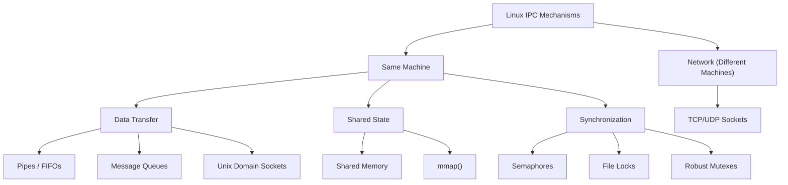
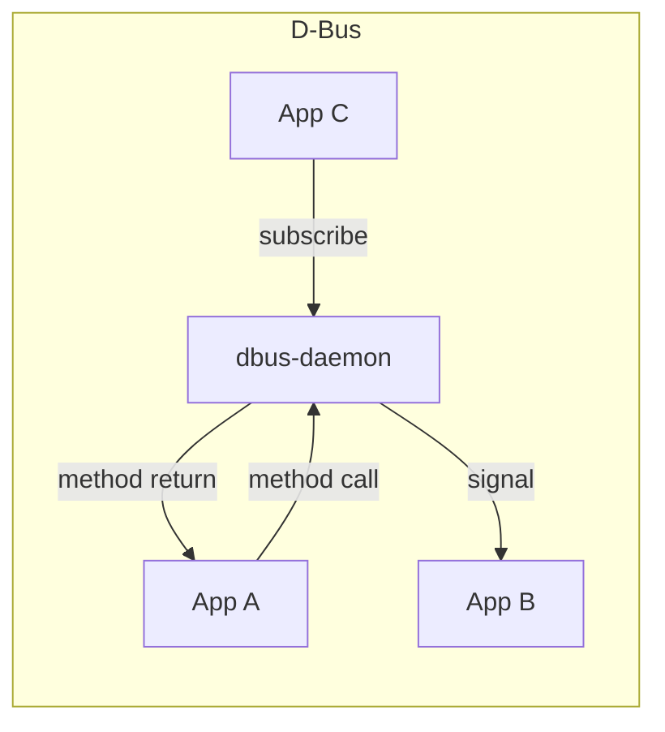
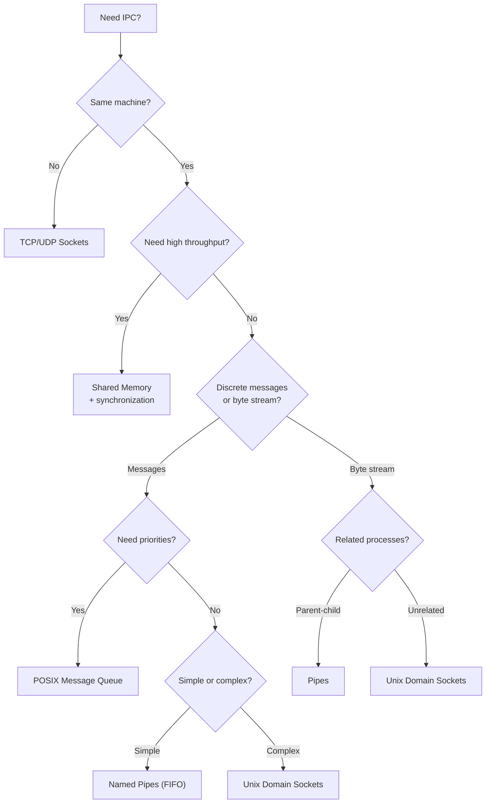

# IPC Overview

## Introduction

**Inter-Process Communication (IPC)** refers to mechanisms that allow separate processes to exchange data and synchronize their actions. Since processes have independent address spaces by design, they cannot directly access each other's memory—IPC provides the bridge.

Linux offers a rich set of IPC mechanisms inherited from multiple Unix traditions (System V, POSIX, BSD) and modern Linux-specific innovations. Choosing the right IPC mechanism depends on your requirements: throughput, latency, complexity, portability, and whether the processes are on the same machine.

## IPC Mechanism Taxonomy


## System V IPC vs POSIX IPC

Linux supports two major IPC families, each providing semaphores, message queues, and shared memory.

### System V IPC

Introduced in AT&T Unix System III (1980s). Available on virtually all Unix systems.

```c
#include <sys/ipc.h>
#include <sys/shm.h>    /* Shared memory */
#include <sys/sem.h>    /* Semaphores */
#include <sys/msg.h>    /* Message queues */

/* Key generation */
key_t ftok(const char *pathname, int proj_id);

/* Shared memory */
int shmget(key_t key, size_t size, int shmflg);
void *shmat(int shmid, const void *shmaddr, int shmflg);
int shmdt(const void *shmaddr);
int shmctl(int shmid, int cmd, struct shmid_ds *buf);

/* Message queues */
int msgget(key_t key, int msgflg);
int msgsnd(int msqid, const void *msgp, size_t msgsz, int msgflg);
ssize_t msgrcv(int msqid, void *msgp, size_t msgsz, long msgtyp, int msgflg);
int msgctl(int msqid, int cmd, struct msqid_ds *buf);

/* Semaphores */
int semget(key_t key, int nsems, int semflg);
int semop(int semid, struct sembuf *sops, size_t nsops);
int semctl(int semid, int semnum, int cmd, ...);
```

### POSIX IPC

Introduced in POSIX.1b (1993). Cleaner API, integrated with filesystem namespace.

```c
#include <mqueue.h>     /* Message queues */
#include <semaphore.h>  /* Semaphores */
#include <sys/mman.h>   /* Shared memory */

/* Message queues */
mqd_t mq_open(const char *name, int oflag, ...);
ssize_t mq_receive(mqd_t mqdes, char *msg_ptr, size_t msg_len, unsigned *msg_prio);
int mq_send(mqd_t mqdes, const char *msg_ptr, size_t msg_len, unsigned msg_prio);
int mq_close(mqd_t mqdes);
int mq_unlink(const char *name);

/* Named semaphores */
sem_t *sem_open(const char *name, int oflag, ...);
int sem_wait(sem_t *sem);
int sem_post(sem_t *sem);
int sem_close(sem_t *sem);
int sem_unlink(const char *name);

/* Shared memory */
int shm_open(const char *name, int oflag, mode_t mode);
int shm_unlink(const char *name);
/* Then use ftruncate() and mmap() */
```

### Comparison Table

| Feature | System V | POSIX |
|---------|----------|-------|
| **API style** | `get`/`ctl` operations | `open`/`close`/`unlink` |
| **Naming** | `key_t` (ftok or IPC_PRIVATE) | `/name` (filesystem namespace) |
| **Message queues** | `msgget`/`msgsnd`/`msgrcv` | `mq_open`/`mq_send`/`mq_receive` |
| **Shared memory** | `shmget`/`shmat` | `shm_open` + `mmap()` |
| **Semaphores** | `semget`/`semop` | `sem_open` or `sem_init` |
| **Portability** | All Unix | POSIX-compliant systems |
| **Limits** | `/proc/sys/kernel/shm*` | Filesystem limits |
| **Removal** | `ipcrm` command | `shm_unlink()`/`mq_unlink()` |
| **Priority msgs** | No (type-based selection) | Yes (0-31 priority levels) |
| **Notification** | No | `mq_notify()` with signals |

## IPC Mechanisms in Detail

### 1. Pipes

Anonymous unidirectional byte streams, typically between parent and child.

```c
int pipefd[2];  /* [0]=read, [1]=write */
pipe(pipefd);
```

**Best for**: Simple parent-child communication, shell pipelines.

See [Pipes](./ipc/pipes.md) for details.

### 2. Named Pipes (FIFOs)

Like pipes but with a filesystem name, allowing unrelated processes to communicate.

```c
mkfifo("/tmp/myfifo", 0666);
```

### 3. Message Queues

Send and receive discrete messages with optional priority:

```c
/* System V message queue */
struct msgbuf {
    long mtype;      /* Message type (must be > 0) */
    char mtext[256]; /* Message data */
};

/* Send */
struct msgbuf msg = { .mtype = 1, .mtext = "Hello" };
msgsnd(msqid, &msg, strlen(msg.mtext), 0);

/* Receive (type 0 = any type) */
msgrcv(msqid, &buf, sizeof(buf.mtext), 0, 0);
```

```c
/* POSIX message queue */
mqd_t mq = mq_open("/myqueue", O_CREAT | O_RDWR, 0644, NULL);

mq_send(mq, "Hello", 5, 1);  /* priority 1 */

char buf[256];
unsigned prio;
ssize_t n = mq_receive(mq, buf, sizeof(buf), &prio);
printf("Received: %.*s (priority: %u)\n", (int)n, buf, prio);

mq_close(mq);
mq_unlink("/myqueue");
```

### 4. Shared Memory

The fastest IPC mechanism—processes share a region of memory:

```c
/* POSIX shared memory */
int fd = shm_open("/myshm", O_CREAT | O_RDWR, 0644);
ftruncate(fd, 4096);
void *ptr = mmap(NULL, 4096, PROT_READ | PROT_WRITE, MAP_SHARED, fd, 0);

/* Now both processes can read/write through ptr */
sprintf(ptr, "Hello from process %d", getpid());

/* Cleanup */
munmap(ptr, 4096);
close(fd);
shm_unlink("/myshm");
```

See [Shared Memory](./ipc/shared-memory.md) for details.

### 5. Semaphores

Synchronization primitives for controlling access to shared resources:

```c
/* POSIX named semaphore */
sem_t *sem = sem_open("/mysem", O_CREAT, 0644, 1);  /* Binary semaphore */

sem_wait(sem);     /* Decrement (block if 0) */
/* Critical section */
sem_post(sem);     /* Increment */

sem_close(sem);
sem_unlink("/mysem");
```

### 6. Unix Domain Sockets

Full-featured socket API for local communication:

```c
#include <sys/socket.h>
#include <sys/un.h>

int sockfd = socket(AF_UNIX, SOCK_STREAM, 0);

struct sockaddr_un addr = { .sun_family = AF_UNIX };
strcpy(addr.sun_path, "/tmp/mysocket");

bind(sockfd, (struct sockaddr *)&addr, sizeof(addr));
listen(sockfd, 5);

/* Client connects with: */
connect(sockfd, (struct sockaddr *)&addr, sizeof(addr));
```

**Advantages over pipes:**
- Bidirectional
- Supports `SOCK_DGRAM` (datagram) mode
- Can pass file descriptors and credentials via `sendmsg()`/`recvmsg()`
- Supports `SCM_RIGHTS` for fd passing

### 7. D-Bus

A high-level IPC framework built on Unix domain sockets:



## Choosing the Right IPC Mechanism


### Decision Matrix

| Mechanism | Throughput | Latency | Complexity | Bidirectional | Data Boundary |
|-----------|-----------|---------|-----------|---------------|---------------|
| Pipes | Medium | Low | Very Low | No | Stream |
| FIFO | Medium | Low | Low | No | Stream |
| Message Queue | Medium | Low | Medium | N/A | Message |
| Shared Memory | **Highest** | **Lowest** | High | Yes | N/A |
| Unix Socket | Medium | Low | Medium | Yes | Both |
| TCP Socket | Medium | Higher | Medium | Yes | Both |
| Signal | N/A | N/A | Low | No | No data |

## System V IPC Administration

### ipcs — View IPC Resources

```bash
# Show all IPC resources
$ ipcs

------ Shared Memory Segments --------
key        shmid      owner      perms      bytes      nattch     status
0x00000000 0          root       644        80         2
0x00000000 32769      root       644        16384      0

------ Semaphore Arrays --------
key        semid      owner      perms      nsems
0x0000a4d2 0          root       600        1

------ Message Queues --------
key        msqid      owner      perms      used-bytes   messages
0x00000000 0          root       644        0            0

# Show limits
$ ipcs -l

# Show specific resource details
$ ipcs -m -i 0
```

### ipcrm — Remove IPC Resources

```bash
# Remove by ID
$ ipcrm -m 32769    # Shared memory
$ ipcrm -s 0        # Semaphore
$ ipcrm -q 0        # Message queue

# Remove by key
$ ipcrm -M 0x1234   # Shared memory
$ ipcrm -S 0x1234   # Semaphore
$ ipcrm -Q 0x1234   # Message queue
```

### System V IPC Limits

```bash
# View kernel IPC limits
$ cat /proc/sys/kernel/shmmax     # Max shared memory segment size
$ cat /proc/sys/kernel/shmall     # Total shared memory pages
$ cat /proc/sys/kernel/shmmni     # Max number of segments
$ cat /proc/sys/kernel/msgmni     # Max message queues
$ cat /proc/sys/kernel/msgmax     # Max message size
$ cat /proc/sys/kernel/sem        # Semaphore limits (4 values)

# Increase limits temporarily
$ echo 67108864 > /proc/sys/kernel/shmmax

# Persistently in /etc/sysctl.conf
kernel.shmmax = 67108864
```

## POSIX IPC Naming

POSIX IPC objects use names starting with `/`:

```bash
# List POSIX shared memory objects (on tmpfs)
$ ls -la /dev/shm/
total 0
drwxrwxrwt  2 root root   40 Jul 21 12:00 .
drwxr-xr-x 19 root root 3820 Jul 21 12:00 ..
-rw-r--r--  1 user user 4096 Jul 21 12:00 myshm

# List POSIX message queues
$ ls -la /dev/mqueue/
total 0
drwxrwxrwt  2 root root  40 Jul 21 12:00 .
-rw-r--r--  1 user user  80 Jul 21 12:00 myqueue

# Read message queue attributes
$ cat /dev/mqueue/myqueue
QSIZE:5    NOTIFY:0    SIGNO:0    NOTIFY_PID:0    CURMSGS:1
```

## Security and Permissions

Both System V and POSIX IPC support permission checking:

```c
/* System V: set permissions at creation */
int shmid = shmget(key, size, IPC_CREAT | 0660);

/* POSIX: set mode at creation */
int fd = shm_open("/myshm", O_CREAT | O_RDWR, 0660);
```

**IPC ownership and permissions follow the same rules as files:**
- Owner UID/GID set from creating process
- Permission bits checked on access
- Creator can modify permissions via `shmctl()`/`msgctl()`/`semctl()`

### IPC Security Best Practices

```c
/* 1. Use IPC_PRIVATE for untrusted environments */
int shmid = shmget(IPC_PRIVATE, size, IPC_CREAT | 0600);
/* Only the creating process and its children can access */

/* 2. Set restrictive permissions */
int fd = shm_open("/myshm", O_CREAT | O_RDWR | O_EXCL, 0600);
/* O_EXCL prevents race conditions with existing objects */

/* 3. Use ftruncate + mmap instead of shmat for POSIX shm */
int fd = shm_open("/myshm", O_CREAT | O_RDWR, 0600);
ftruncate(fd, 4096);
void *ptr = mmap(NULL, 4096, PROT_READ | PROT_WRITE, MAP_SHARED, fd, 0);
/* mmap gives more control over memory protection */
mprotect(ptr, 4096, PROT_READ);  /* Make read-only after setup */

/* 4. Clean up IPC objects when done */
shm_unlink("/myshm");  /* Remove from namespace */
```

### Checking for IPC Leaks

```bash
# Find IPC objects owned by a user
$ ipcs -u

# Show all IPC objects with creator info
$ ipcs -a

# Find orphaned shared memory segments
$ ipcs -m | awk '$6 == 0 {print $2}'  # nattch == 0

# Clean up all IPC objects for current user
$ ipcrm --all

# POSIX shared memory cleanup
$ ls /dev/shm/
$ rm /dev/shm/unused_object

# POSIX message queue cleanup
$ ls /dev/mqueue/
$ rm /dev/mqueue/unused_queue
```

## Advanced IPC Patterns

### Memory-Mapped File IPC

Two processes can communicate through a memory-mapped file:

```c
#include <sys/mman.h>
#include <fcntl.h>
#include <unistd.h>
#include <string.h>

/* Process A: create and write */
int fd = open("/tmp/shared.dat", O_CREAT | O_RDWR, 0644);
ftruncate(fd, 4096);
void *ptr = mmap(NULL, 4096, PROT_READ | PROT_WRITE, MAP_SHARED, fd, 0);
sprintf(ptr, "Hello from PID %d", getpid());
msync(ptr, 4096, MS_SYNC);

/* Process B: open and read */
int fd = open("/tmp/shared.dat", O_RDONLY);
void *ptr = mmap(NULL, 4096, PROT_READ, MAP_SHARED, fd, 0);
printf("Received: %s\n", (char *)ptr);
```

**Advantages over pipes:**
- Random access to shared data
- Survives process restarts (data persists on disk)
- Can be much larger than pipe buffers

**Disadvantages:**
- Requires synchronization (no built-in signaling)
- File must be on a filesystem (not tmpfs for pure IPC)

### futex-Based Synchronization

`futex` (Fast Userspace muTEX) is the building block for efficient synchronization:

```c
#include <linux/futex.h>
#include <sys/syscall.h>
#include <unistd.h>

static int futex_wait(int *addr, int expected) {
    return syscall(SYS_futex, addr, FUTEX_WAIT, expected, NULL, NULL, 0);
}

static int futex_wake(int *addr, int n) {
    return syscall(SYS_futex, addr, FUTEX_WAKE, n, NULL, NULL, 0);
}

/* Simple mutex using futex */
static int mutex = 0;  /* 0 = unlocked, 1 = locked, 2 = locked with waiters */

void lock(void) {
    int expected = 0;
    if (__atomic_compare_exchange_n(&mutex, &expected, 1, 0,
                                    __ATOMIC_ACQUIRE, __ATOMIC_RELAXED)) {
        return;  /* Fast path: uncontended */
    }
    /* Slow path: someone else holds the lock */
    while (__atomic_exchange_n(&mutex, 2, __ATOMIC_ACQUIRE) != 0) {
        futex_wait(&mutex, 2);
    }
}

void unlock(void) {
    if (__atomic_exchange_n(&mutex, 0, __ATOMIC_RELEASE) == 2) {
        futex_wake(&mutex, 1);  /* Wake one waiter */
    }
}
```

The key insight: in the uncontended case, `lock()` and `unlock()` are just atomic operations — no syscall needed. The kernel is only involved when there's actual contention.

### pidfd: Modern Process Interaction

Since Linux 5.3, `pidfd` provides race-free process interaction:

```c
#include <sys/pidfd.h>
#include <signal.h>

/* Open a pidfd for a child process */
int pidfd = pidfd_open(pid, 0);

/* Send signal via pidfd (no PID reuse race) */
pidfd_send_signal(pidfd, SIGTERM, NULL, 0);

/* Wait for process exit */
struct pollfd pfd = { .fd = pidfd, .events = POLLIN };
poll(&pfd, 1, -1);  /* Blocks until process exits */

/* Use with epoll for event-driven process monitoring */
struct epoll_event ev = { .events = EPOLLIN, .data.fd = pidfd };
epoll_ctl(epoll_fd, EPOLL_CTL_ADD, pidfd, &ev);
```

**Why pidfd matters:** PIDs can be reused after a process exits. Traditional `kill(pid, sig)` can accidentally signal the wrong process. `pidfd` binds to the specific process instance.

## Performance Comparison

Typical benchmarks on modern hardware (Intel i7, DDR4):

| Mechanism | Latency (μs) | Throughput (MB/s) |
|-----------|---------------|-------------------|
| Shared memory + futex | ~0.1 | 10,000+ |
| Unix domain socket | ~5 | 5,000 |
| Pipe | ~5 | 4,000 |
| TCP loopback | ~20 | 3,000 |
| POSIX message queue | ~10 | 2,000 |
| System V message queue | ~15 | 1,500 |

*Note: These are approximate and vary significantly by workload, message size, and hardware.*

### Benchmarking IPC

```c
/* Simple ping-pong benchmark: measure round-trip latency */
#include <stdio.h>
#include <time.h>
#include <unistd.h>

#define ITERATIONS 100000

int main(void) {
    int pipe1[2], pipe2[2];
    pipe(pipe1); pipe(pipe2);

    struct timespec start, end;
    clock_gettime(CLOCK_MONOTONIC, &start);

    if (fork() == 0) {
        /* Child: echo back */
        char buf[64];
        for (int i = 0; i < ITERATIONS; i++) {
            read(pipe1[0], buf, 1);
            write(pipe2[1], "x", 1);
        }
        _exit(0);
    }

    /* Parent: send and receive */
    char buf[64];
    for (int i = 0; i < ITERATIONS; i++) {
        write(pipe1[1], "x", 1);
        read(pipe2[0], buf, 1);
    }

    clock_gettime(CLOCK_MONOTONIC, &end);
    double us = (end.tv_sec - start.tv_sec) * 1e6 +
                (end.tv_nsec - start.tv_nsec) / 1e3;
    printf("Pipe round-trip: %.2f μs\n", us / ITERATIONS);
    return 0;
}
```

## References

- [The Linux Kernel Documentation](https://docs.kernel.org/)
- [LWN.net - Linux and free software news](https://lwn.net/)
- [GNU Project Documentation](https://www.gnu.org/doc/doc.html)
- [GNU Manuals](https://www.gnu.org/manual/manual.html)
- [Free Software Directory](https://directory.fsf.org/wiki/Main_Page)
- [Planet GNU](https://planet.gnu.org/)
- [Free Software Books](https://www.gnu.org/doc/other-free-books.html)

- [Introduction to IPC — Beej's Guide](https://beej.us/guide/bgipc/)
- [System V IPC — Linux man pages](https://man7.org/linux/man-pages/man7/svipc.7.html)
- [POSIX IPC — Linux man pages](https://man7.org/linux/man-pages/man7/posixipc.7.html)
- [Unix Domain Sockets — man 7 unix](https://man7.org/linux/man-pages/man7/unix.7.html)
- [The Linux Programming Interface, Chapters 43-55](https://man7.org/tlpi/)

## Related Topics

- [Pipes](./ipc/pipes.md) — Anonymous and named pipes
- [Shared Memory](./ipc/shared-memory.md) — POSIX and System V shared memory
- [Threads](./threads.md) — IPC between threads (shared memory by default)
- [epoll](./epoll.md) — Monitoring IPC file descriptors
- [io_uring](./io-uring.md) — Async I/O for IPC
