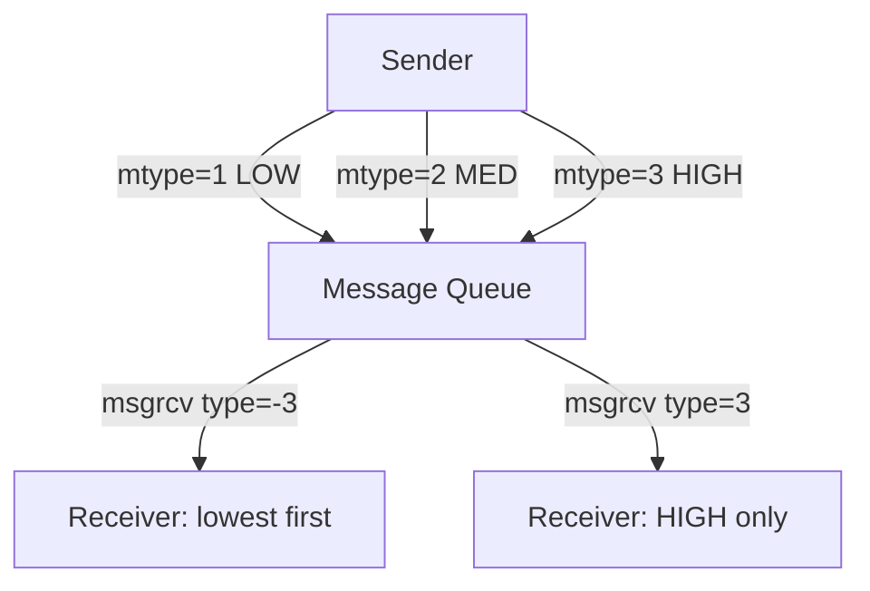

# Message Queues

## Introduction

Message queues provide a mechanism for processes to exchange data in discrete messages rather than continuous byte streams. Linux supports two distinct message queue interfaces: **System V IPC** (`msgget`, `msgsnd`, `msgrcv`) and **POSIX message queues** (`mq_open`, `mq_send`, `mq_receive`). Each has different semantics, performance characteristics, and use cases.

## System V Message Queues

### Overview

System V IPC is the older interface, originating from AT&T UNIX System V (1983). Messages are identified by a key (typically derived from a pathname via `ftok`) and have a type field that enables selective receiving.

### Creating a Queue

```c
#include <sys/ipc.h>
#include <sys/msg.h>
#include <stdio.h>

int main(void) {
    /* Generate a key from a pathname */
    key_t key = ftok("/tmp/myqueue", 42);
    if (key == -1) { perror("ftok"); return 1; }

    /* Create or access the queue */
    int msqid = msgget(key, IPC_CREAT | 0644);
    if (msqid == -1) { perror("msgget"); return 1; }

    printf("Queue ID: %d\n", msqid);
    return 0;
}
```

### Message Structure

Every message must start with a `long mtype` field:

```c
#include <sys/msg.h>

struct msgbuf {
    long mtype;      /* Message type (> 0) */
    char mtext[256]; /* Message data */
};
```

### Sending Messages

```c
#include <sys/ipc.h>
#include <sys/msg.h>
#include <stdio.h>
#include <string.h>

struct msgbuf {
    long mtype;
    char mtext[256];
};

int main(void) {
    key_t key = ftok("/tmp/myqueue", 42);
    int msqid = msgget(key, IPC_CREAT | 0644);

    struct msgbuf msg;
    msg.mtype = 1;  /* Message type 1 */
    strcpy(msg.mtext, "Hello from sender!");

    if (msgsnd(msqid, &msg, strlen(msg.mtext) + 1, 0) == -1) {
        perror("msgsnd");
        return 1;
    }
    printf("Sent: %s\n", msg.mtext);

    /* Non-blocking send */
    msg.mtype = 2;
    strcpy(msg.mtext, "Urgent message");
    if (msgsnd(msqid, &msg, strlen(msg.mtext) + 1, IPC_NOWAIT) == -1) {
        perror("msgsnd nonblock");
    }
    return 0;
}
```

### Receiving Messages

```c
#include <sys/ipc.h>
#include <sys/msg.h>
#include <stdio.h>
#include <string.h>

struct msgbuf {
    long mtype;
    char mtext[256];
};

int main(void) {
    key_t key = ftok("/tmp/myqueue", 42);
    int msqid = msgget(key, IPC_CREAT | 0644);

    struct msgbuf msg;

    /* Receive any message type */
    ssize_t len = msgrcv(msqid, &msg, sizeof(msg.mtext), 0, 0);
    if (len == -1) { perror("msgrcv"); return 1; }
    printf("Received (type %ld): %s\n", msg.mtype, msg.mtext);

    /* Receive only type 2 messages */
    len = msgrcv(msqid, &msg, sizeof(msg.mtext), 2, 0);
    if (len == -1) { perror("msgrcv type2"); return 1; }
    printf("Type 2: %s\n", msg.mtext);

    /* Receive with type filtering semantics */
    /* mtype > 0: exact match */
    /* mtype == 0: any type */
    /* mtype < 0: type ≤ |mtype| (lowest first) */
    len = msgrcv(msqid, &msg, sizeof(msg.mtext), -5, 0);
    /* Gets message with lowest type ≤ 5 */

    return 0;
}
```

### Type-Based Selective Receive

The `mtype` parameter in `msgrcv` enables powerful selective receive:

```c
/* Type filtering rules */
msgrcv(qid, &msg, size, 0, 0);   /* Any type, FIFO order */
msgrcv(qid, &msg, size, 1, 0);   /* Only type 1 */
msgrcv(qid, &msg, size, 5, 0);   /* Only type 5 */
msgrcv(qid, &msg, size, -3, 0);  /* Any type ≤ 3, lowest first */
msgrcv(qid, &msg, size, -1, 0);  /* Lowest type available */
```

This is useful for priority-based message routing:



### Queue Management

```c
#include <sys/ipc.h>
#include <sys/msg.h>

/* Get queue info */
struct msqid_ds info;
msgctl(msqid, IPC_STAT, &info);
printf("Messages: %lu\n", info.msg_qnum);
printf("Bytes:    %lu\n", info.msg_cbytes);
printf("Max bytes:%lu\n", info.msg_qbytes);

/* Set queue limits */
info.msg_qbytes = 65536;  /* Increase max bytes */
msgctl(msqid, IPC_SET, &info);

/* Delete queue */
msgctl(msqid, IPC_RMID, NULL);

/* List all IPC resources from shell */
ipcs -q
```

### System V Limits

```bash
# View IPC limits
ipcs -l

# Key parameters in /proc/sys/kernel/
cat /proc/sys/kernel/msgmni   # Max queues (default: 32000)
cat /proc/sys/kernel/msgmnb   # Max bytes per queue (default: 16384)
cat /proc/sys/kernel/msgmax   # Max message size (default: 8192)
```

## POSIX Message Queues

### Overview

POSIX message queues (Linux kernel 2.6.6+) offer a cleaner API, file-system visibility (`/dev/mqueue/`), priority support, and notification mechanisms.

### Creating and Opening

```c
#include <mqueue.h>
#include <fcntl.h>
#include <sys/stat.h>
#include <stdio.h>

int main(void) {
    /* Create a queue */
    struct mq_attr attr = {
        .mq_flags   = 0,
        .mq_maxmsg  = 10,        /* Max messages in queue */
        .mq_msgsize = 256,       /* Max message size */
        .mq_curmsgs = 0          /* Current messages (read-only) */
    };

    mqd_t mq = mq_open("/myqueue", O_CREAT | O_RDWR, 0644, &attr);
    if (mq == (mqd_t)-1) {
        perror("mq_open");
        return 1;
    }

    printf("Queue opened: fd=%d\n", mq);
    return 0;
}
```

### Sending and Receiving

```c
#include <mqueue.h>
#include <stdio.h>
#include <string.h>
#include <stdlib.h>

/* Sender */
int sender(void) {
    mqd_t mq = mq_open("/myqueue", O_WRONLY);
    if (mq == (mqd_t)-1) { perror("mq_open"); return 1; }

    const char *msg = "Hello, POSIX MQ!";
    unsigned int prio = 5;  /* Priority 0-31 (higher = more urgent) */

    if (mq_send(mq, msg, strlen(msg), prio) == -1) {
        perror("mq_send");
        return 1;
    }
    printf("Sent: %s (priority %u)\n", msg, prio);

    mq_close(mq);
    return 0;
}

/* Receiver */
int receiver(void) {
    mqd_t mq = mq_open("/myqueue", O_RDONLY);
    if (mq == (mqd_t)-1) { perror("mq_open"); return 1; }

    struct mq_attr attr;
    mq_getattr(mq, &attr);

    char *buf = malloc(attr.mq_msgsize);
    unsigned int prio;
    ssize_t len;

    while ((len = mq_receive(mq, buf, attr.mq_msgsize, &prio)) > 0) {
        printf("Received: %.*s (priority %u)\n", (int)len, buf, prio);
    }

    free(buf);
    mq_close(mq);
    return 0;
}
```

### Non-blocking and Timed Operations

```c
#include <mqueue.h>
#include <fcntl.h>
#include <time.h>
#include <errno.h>

/* Non-blocking */
mqd_t mq = mq_open("/myqueue", O_RDONLY | O_NONBLOCK);
char buf[256];
unsigned int prio;
ssize_t len = mq_receive(mq, buf, sizeof(buf), &prio);
if (len == -1 && errno == EAGAIN) {
    printf("Queue empty (non-blocking)\n");
}

/* Timed receive */
struct timespec ts;
clock_gettime(CLOCK_REALTIME, &ts);
ts.tv_sec += 5;  /* 5 second timeout */

len = mq_timedreceive(mq, buf, sizeof(buf), &prio, &ts);
if (len == -1 && errno == ETIMEDOUT) {
    printf("Timed out after 5 seconds\n");
}

/* Timed send */
struct timespec send_ts;
clock_gettime(CLOCK_REALTIME, &send_ts);
send_ts.tv_sec += 2;
mq_timedsend(mq, "msg", 3, 1, &send_ts);
```

### Asynchronous Notification

POSIX MQs can notify via signals or threads when messages arrive:

```c
#include <mqueue.h>
#include <signal.h>
#include <stdio.h>
#include <unistd.h>

static volatile int got_message = 0;

static void notification_handler(int sig) {
    got_message = 1;
}

int main(void) {
    mqd_t mq = mq_open("/myqueue", O_RDONLY | O_NONBLOCK);

    /* Register for signal notification */
    struct sigevent sev;
    sev.sigev_notify = SIGEV_SIGNAL;
    sev.sigev_signo  = SIGUSR1;
    signal(SIGUSR1, notification_handler);

    mq_notify(mq, &sev);

    while (1) {
        pause();  /* Wait for signal */
        if (got_message) {
            got_message = 0;

            /* Drain all messages */
            char buf[256];
            unsigned int prio;
            while (mq_receive(mq, buf, sizeof(buf), &prio) > 0) {
                printf("Got: %.*s\n", 256, buf);
            }

            /* Re-register (one-shot!) */
            mq_notify(mq, &sev);
        }
    }
}
```

**Important**: `mq_notify` is one-shot. You must re-register after each notification.

### Thread-Based Notification

```c
#include <mqueue.h>
#include <pthread.h>
#include <stdio.h>

static void *notify_thread(void *arg) {
    union sigval sv = *(union sigval *)arg;
    mqd_t mq = (mqd_t)sv.sival_int;

    char buf[256];
    unsigned int prio;
    ssize_t len = mq_receive(mq, buf, sizeof(buf), &prio);
    printf("Thread notified, received: %.*s\n", (int)len, buf);
    return NULL;
}

int main(void) {
    mqd_t mq = mq_open("/myqueue", O_RDONLY | O_NONBLOCK);

    struct sigevent sev;
    sev.sigev_notify          = SIGEV_THREAD;
    sev.sigev_notify_function = notify_thread;
    sev.sigev_notify_attributes = NULL;
    sev.sigev_value.sival_int = mq;

    mq_notify(mq, &sev);
    /* Thread will be spawned when a message arrives */
    pause();
}
```

## Filesystem Visibility

POSIX MQs are visible in the filesystem:

```bash
# Mount the mqueue filesystem
sudo mount -t mqueue none /dev/mqueue

# List queues
ls /dev/mqueue/
# myqueue

# Inspect queue attributes
cat /dev/mqueue/myqueue
# QSIZE:1234  NOTIFY:0  SIGNO:0  NOTIFY_PID:0  CB:0

# Delete from filesystem
rm /dev/mqueue/myqueue
```

## System V vs POSIX Comparison

| Feature | System V | POSIX |
|---|---|---|
| **API** | `msgget`/`msgsnd`/`msgrcv` | `mq_open`/`mq_send`/`mq_receive` |
| **Identification** | Integer key → ID | Named path (string) |
| **Message priority** | Type-based filtering | Explicit priority (0-31) |
| **Max message size** | 8192 (default, tunable) | Configurable at open |
| **Notification** | None (poll only) | Signal or thread |
| **Filesystem** | No (`ipcs` command) | `/dev/mqueue/` |
| **Portability** | Most UNIX | POSIX (limited on macOS) |
| **Performance** | Good | Better (newer kernel path) |
| **Close semantics** | `msgctl(IPC_RMID)` | `mq_unlink()` |

## Practical Example: Producer-Consumer

```c
#include <mqueue.h>
#include <pthread.h>
#include <stdio.h>
#include <stdlib.h>
#include <string.h>
#include <unistd.h>

#define QUEUE_NAME "/work_queue"
#define NUM_ITEMS  20
#define NUM_WORKERS 4

static mqd_t work_queue;

static void *producer(void *arg) {
    for (int i = 0; i < NUM_ITEMS; i++) {
        char msg[64];
        snprintf(msg, sizeof(msg), "task-%d", i);
        mq_send(work_queue, msg, strlen(msg), i % 5);  /* Varying priority */
        printf("Produced: %s (prio=%d)\n", msg, i % 5);
        usleep(50000);
    }
    /* Send poison pills */
    for (int i = 0; i < NUM_WORKERS; i++) {
        mq_send(work_queue, "DONE", 4, 0);
    }
    return NULL;
}

static void *consumer(void *arg) {
    int id = *(int *)arg;
    char buf[64];
    unsigned int prio;

    while (1) {
        ssize_t len = mq_receive(work_queue, buf, sizeof(buf), &prio);
        if (len <= 0) break;

        buf[len] = '\0';
        if (strcmp(buf, "DONE") == 0) break;

        printf("  Worker %d: processing %s (prio=%u)\n", id, buf, prio);
        usleep(100000);  /* Simulate work */
    }
    return NULL;
}

int main(void) {
    struct mq_attr attr = { 0, 50, 64, 0 };
    work_queue = mq_open(QUEUE_NAME, O_CREAT | O_RDWR, 0644, &attr);

    pthread_t prod, workers[NUM_WORKERS];
    int ids[NUM_WORKERS];

    pthread_create(&prod, NULL, producer, NULL);
    for (int i = 0; i < NUM_WORKERS; i++) {
        ids[i] = i;
        pthread_create(&workers[i], NULL, consumer, &ids[i]);
    }

    pthread_join(prod, NULL);
    for (int i = 0; i < NUM_WORKERS; i++)
        pthread_join(workers[i], NULL);

    mq_close(work_queue);
    mq_unlink(QUEUE_NAME);
    return 0;
}
```

```bash
gcc -o mq_demo mq_demo.c -lpthread -lrt
```

## Performance Considerations

- POSIX MQs use a kernel-managed circular buffer
- Messages are copied between user and kernel space (not zero-copy)
- For large data, consider shared memory + semaphore instead
- System V queues have a fixed max message size; POSIX queues are more flexible
- Both interfaces are slower than pipes for simple byte-stream IPC

## References

- [msgget(2) man page](https://man7.org/linux/man-pages/man2/msgget.2.html)
- [mq_overview(7) man page](https://man7.org/linux/man-pages/man7/mq_overview.7.html)
- [POSIX Message Queues (Linux kernel docs)](https://www.kernel.org/doc/html/latest/userspace-api/sysVipc.html)
- [Beej's Guide to Unix IPC](https://beej.us/guide/bgipc/)

## Related Topics

- [POSIX Semaphores](./semaphores.md) — synchronization for shared resources
- [Unix Domain Sockets](./unix-sockets.md) — alternative IPC mechanism
- [Event-Driven Programming](../event-driven.md) — integrating message queues into event loops
