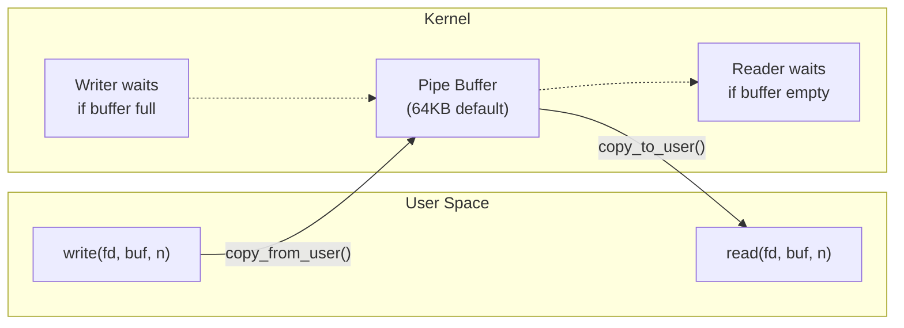
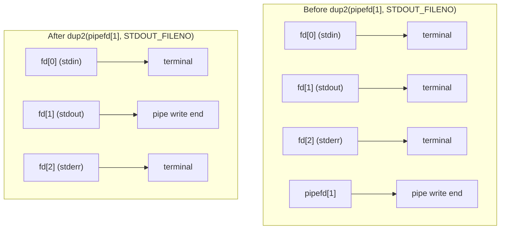
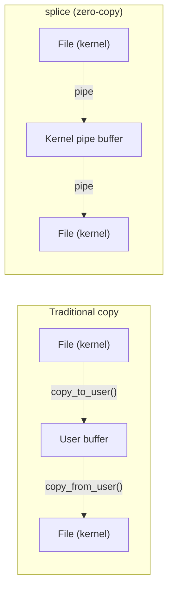

# Pipes

## Introduction

Pipes are the oldest and simplest IPC mechanism in Unix. A pipe is a **unidirectional byte stream** with two ends: a read end and a write end. Data written to one end can be read from the other, in order (FIFO). Pipes are the foundation of Unix shell pipelines (`ls | grep | sort`) and are used extensively in process communication.

Linux provides two types of pipes:
- **Anonymous pipes** (`pipe()`): Between related processes (typically parent-child after `fork()`)
- **Named pipes (FIFOs)** (`mkfifo()`): Between any processes, accessible via filesystem path

## Anonymous Pipes

### pipe() — Creating a Pipe

```c
#include <unistd.h>

int pipe(int pipefd[2]);
/* pipefd[0] = read end
   pipefd[1] = write end */
```

```c
#include <unistd.h>
#include <stdio.h>
#include <string.h>
#include <sys/wait.h>

int main(void)
{
    int pipefd[2];
    pid_t pid;
    char buf[256];

    if (pipe(pipefd) == -1) {
        perror("pipe");
        return 1;
    }

    pid = fork();
    if (pid == -1) {
        perror("fork");
        return 1;
    }

    if (pid == 0) {
        /* Child: writer */
        close(pipefd[0]);  /* Close read end */
        const char *msg = "Hello from child!";
        write(pipefd[1], msg, strlen(msg));
        close(pipefd[1]);
        _exit(0);
    }

    /* Parent: reader */
    close(pipefd[1]);  /* Close write end */
    ssize_t n = read(pipefd[0], buf, sizeof(buf) - 1);
    if (n > 0) {
        buf[n] = '\0';
        printf("Parent received: '%s'\n", buf);
    }
    close(pipefd[0]);
    wait(NULL);

    return 0;
}
```

```
$ gcc -o pipe_demo pipe_demo.c && ./pipe_demo
Parent received: 'Hello from child!'
```

### How Pipes Work Internally



The kernel implements pipes as an in-kernel buffer (a ring buffer in `struct pipe_inode_info`). Key behaviors:

- **Default capacity**: 65,536 bytes (64 KB) — `/proc/sys/fs/pipe-max-size`
- **Atomic writes**: Writes of ≤ `PIPE_BUF` bytes (4096 on Linux) are atomic
- **Blocking reads**: Block if the pipe is empty (unless `O_NONBLOCK`)
- **Blocking writes**: Block if the pipe is full (unless `O_NONBLOCK`)
- **EOF condition**: All write ends are closed; `read()` returns 0
- **Broken pipe**: Write when all read ends are closed → `SIGPIPE` + `EPIPE`

### pipe2() — Pipe with Flags

```c
#include <unistd.h>

int pipe2(int pipefd[2], int flags);
```

| Flag | Effect |
|------|--------|
| `O_CLOEXEC` | Set close-on-exec on both fds |
| `O_NONBLOCK` | Set non-blocking on both fds |
| `O_DIRECT` | Packet mode (see below) |

```c
/* Modern pipe creation with flags */
pipe2(pipefd, O_CLOEXEC | O_NONBLOCK);
```

### Shell Pipelines

The shell implements `cmd1 | cmd2 | cmd3` using pipes and `dup2()`:

```c
#include <unistd.h>
#include <sys/wait.h>

/* Implement: ls -la | grep "\.c" | wc -l */
int main(void)
{
    int pipe1[2], pipe2[2];
    pipe(pipe1);
    pipe(pipe2);

    /* Process 1: ls -la → pipe1[1] */
    if (fork() == 0) {
        dup2(pipe1[1], STDOUT_FILENO);
        close(pipe1[0]); close(pipe1[1]);
        close(pipe2[0]); close(pipe2[1]);
        execlp("ls", "ls", "-la", NULL);
        _exit(127);
    }

    /* Process 2: pipe1[0] → grep → pipe2[1] */
    if (fork() == 0) {
        dup2(pipe1[0], STDIN_FILENO);
        dup2(pipe2[1], STDOUT_FILENO);
        close(pipe1[0]); close(pipe1[1]);
        close(pipe2[0]); close(pipe2[1]);
        execlp("grep", "grep", "\\.c", NULL);
        _exit(127);
    }

    /* Process 3: pipe2[0] → wc -l */
    if (fork() == 0) {
        dup2(pipe2[0], STDIN_FILENO);
        close(pipe1[0]); close(pipe1[1]);
        close(pipe2[0]); close(pipe2[1]);
        execlp("wc", "wc", "-l", NULL);
        _exit(127);
    }

    close(pipe1[0]); close(pipe1[1]);
    close(pipe2[0]); close(pipe2[1]);

    for (int i = 0; i < 3; i++)
        wait(NULL);

    return 0;
}
```


## dup2() for I/O Redirection

`dup2()` is essential for building pipelines. It redirects one file descriptor to point to another:

```c
#include <unistd.h>

int dup2(int oldfd, int newfd);
/* Returns newfd on success, -1 on error */
/* If oldfd == newfd, does nothing and returns newfd */
```

### How dup2 Works



```c
/* Pattern: redirect stdout to pipe, then exec */
int pipefd[2];
pipe(pipefd);

if (fork() == 0) {
    close(pipefd[0]);              /* Close unused read end */
    dup2(pipefd[1], STDOUT_FILENO); /* stdout → pipe */
    close(pipefd[1]);              /* Close original (stdout is now the copy) */
    execlp("ls", "ls", NULL);      /* ls writes to pipe */
}
```

### Common Redirection Patterns

```c
/* Redirect stdin from file */
int fd = open("input.txt", O_RDONLY);
dup2(fd, STDIN_FILENO);
close(fd);

/* Redirect stdout to file */
int fd = open("output.txt", O_WRONLY | O_CREAT | O_TRUNC, 0644);
dup2(fd, STDOUT_FILENO);
close(fd);

/* Redirect stderr to stdout (2>&1) */
dup2(STDOUT_FILENO, STDERR_FILENO);

/* Swap stdin and stdin (rare) */
int saved_stdin = dup(STDIN_FILENO);
dup2(fd, STDIN_FILENO);
/* ... use redirected stdin ... */
dup2(saved_stdin, STDIN_FILENO);
close(saved_stdin);
```

## Named Pipes (FIFOs)

A **FIFO** (First In, First Out) is a named pipe with a filesystem entry. Unlike anonymous pipes, FIFOs allow unrelated processes to communicate.

### Creating FIFOs

```c
#include <sys/types.h>
#include <sys/stat.h>

int mkfifo(const char *pathname, mode_t mode);
int mkfifoat(int dirfd, const char *pathname, mode_t mode);
```

```bash
# Create from command line
$ mkfifo /tmp/myfifo
$ ls -la /tmp/myfifo
prw-r--r-- 1 user user 0 Jul 21 12:00 /tmp/myfifo
# Note the 'p' prefix indicating a pipe
```

### FIFO Example

```c
/* writer.c */
#include <fcntl.h>
#include <sys/stat.h>
#include <unistd.h>
#include <stdio.h>
#include <string.h>

int main(void)
{
    const char *fifo_path = "/tmp/myfifo";

    /* Create FIFO if it doesn't exist */
    mkfifo(fifo_path, 0666);

    /* Open blocks until a reader opens the other end */
    int fd = open(fifo_path, O_WRONLY);
    printf("Writer: FIFO opened\n");

    const char *messages[] = {
        "First message\n",
        "Second message\n",
        "Third message\n"
    };

    for (int i = 0; i < 3; i++) {
        write(fd, messages[i], strlen(messages[i]));
        sleep(1);
    }

    close(fd);
    return 0;
}
```

```c
/* reader.c */
#include <fcntl.h>
#include <sys/stat.h>
#include <unistd.h>
#include <stdio.h>

int main(void)
{
    const char *fifo_path = "/tmp/myfifo";
    char buf[256];

    /* Open blocks until a writer opens the other end */
    int fd = open(fifo_path, O_RDONLY);
    printf("Reader: FIFO opened\n");

    ssize_t n;
    while ((n = read(fd, buf, sizeof(buf) - 1)) > 0) {
        buf[n] = '\0';
        printf("Received: %s", buf);
    }

    close(fd);
    unlink(fifo_path);  /* Clean up */
    return 0;
}
```

```
# Terminal 1:
$ ./writer
Writer: FIFO opened

# Terminal 2:
$ ./reader
Reader: FIFO opened
Received: First message
Received: Second message
Received: Third message
```

### FIFO Blocking Behavior

| Operation | Blocking? |
|-----------|-----------|
| `open(fifo, O_RDONLY)` | Blocks until a writer opens |
| `open(fifo, O_WRONLY)` | Blocks until a reader opens |
| `open(fifo, O_RDONLY \| O_NONBLOCK)` | Returns immediately |
| `open(fifo, O_WRONLY \| O_NONBLOCK)` | Returns `ENXIO` if no reader |

```c
/* Non-blocking open for reader (doesn't wait for writer) */
int fd = open(fifo_path, O_RDONLY | O_NONBLOCK);

/* Use O_RDWR to avoid blocking on open */
int fd = open(fifo_path, O_RDWR);  /* Never blocks */
```

## Pipe Capacity and Behavior

### Default Capacity

```bash
# Default pipe buffer size
$ cat /proc/sys/fs/pipe-max-size
1048576    # 1MB (max allowed)

# Per-pipe default
$ getconf PIPE_BUF
4096       # Atomic write guarantee

# Check actual buffer size of a pipe
$ cat /proc/<pid>/fdinfo/<fd> | grep -i pipe
```

### Adjusting Pipe Size

```c
#include <fcntl.h>

/* Get current pipe size */
long size = fcntl(pipefd[0], F_GETPIPE_SZ);

/* Set pipe size (up to /proc/sys/fs/pipe-max-size) */
fcntl(pipefd[0], F_SETPIPE_SZ, 1024 * 1024);  /* 1MB */
```

```bash
# Increase max pipe size system-wide
$ echo 2097152 > /proc/sys/fs/pipe-max-size
```

### Atomic Writes and PIPE_BUF

POSIX guarantees that writes of ≤ `PIPE_BUF` bytes to a pipe are **atomic**—they won't be interleaved with writes from other processes:

```c
/* This write is guaranteed atomic on Linux (≤ 4096 bytes) */
char msg[4096];
memset(msg, 'A', sizeof(msg));
write(pipefd[1], msg, sizeof(msg));

/* This write may be split across multiple reads */
char big[65536];
write(pipefd[1], big, sizeof(big));  /* Not guaranteed atomic */
```

## splice() and tee() — Zero-Copy Pipe Operations

### splice() — Move Data Between Pipe and fd

```c
#include <fcntl.h>

ssize_t splice(int fd_in, off_t *off_in,
               int fd_out, off_t *off_out,
               size_t len, unsigned int flags);
```

`splice()` moves data between a file descriptor and a pipe **without copying through user space**. At least one of the endpoints must be a pipe.

```c
#include <fcntl.h>
#include <unistd.h>
#include <stdio.h>

/* Copy file using splice (zero-copy through kernel) */
int main(int argc, char *argv[])
{
    if (argc != 3) {
        fprintf(stderr, "Usage: %s <src> <dst>\n", argv[0]);
        return 1;
    }

    int src = open(argv[1], O_RDONLY);
    int dst = open(argv[2], O_WRONLY | O_CREAT | O_TRUNC, 0644);

    int pipefd[2];
    pipe(pipefd);

    /* splice: src_fd → pipe */
    /* splice: pipe → dst_fd */
    /* Both happen in kernel space, no user-space copies */
    ssize_t n;
    while ((n = splice(src, NULL, pipefd[1], NULL, 65536, 0)) > 0) {
        splice(pipefd[0], NULL, dst, NULL, n, 0);
    }

    close(src);
    close(dst);
    close(pipefd[0]);
    close(pipefd[1]);

    return 0;
}
```



### tee() — Duplicate Pipe Data

```c
#include <fcntl.h>

ssize_t tee(int fd_in, int fd_out, size_t len, unsigned int flags);
```

`tee()` copies data from one pipe to another **without consuming** the input. Like `splice()`, both endpoints must be pipes.

```c
/* Implement: cmd 2>&1 | tee logfile
 * (send stdout to both terminal and log file) */
#include <fcntl.h>
#include <unistd.h>

int main(void)
{
    int pipe_in[2], pipe_out[2], pipe_tee[2];
    pipe(pipe_in);
    pipe(pipe_out);
    pipe(pipe_tee);

    if (fork() == 0) {
        /* Child: cmd writes to pipe_in */
        dup2(pipe_in[1], STDOUT_FILENO);
        close(pipe_in[0]); close(pipe_in[1]);
        execlp("ls", "ls", "-la", NULL);
        _exit(127);
    }

    close(pipe_in[1]);

    if (fork() == 0) {
        /* Tee process: duplicates pipe data */
        ssize_t n;
        while ((n = tee(pipe_in[0], pipe_tee[1], 65536, 0)) > 0) {
            splice(pipe_in[0], NULL, pipe_out[1], NULL, n, 0);
        }
        close(pipe_out[1]);
        close(pipe_tee[1]);
        _exit(0);
    }

    close(pipe_in[0]);
    close(pipe_out[1]);
    close(pipe_tee[1]);

    if (fork() == 0) {
        /* Logger: reads from tee copy, writes to file */
        int logfd = open("output.log", O_WRONLY | O_CREAT | O_TRUNC, 0644);
        splice(pipe_tee[0], NULL, logfd, NULL, 65536, 0);
        close(logfd);
        _exit(0);
    }

    /* Parent: reads from pipe_out, writes to terminal */
    splice(pipe_out[0], NULL, STDOUT_FILENO, NULL, 65536, 0);

    return 0;
}
```

## Non-Blocking Pipes

```c
#include <fcntl.h>
#include <unistd.h>
#include <errno.h>

int pipefd[2];
pipe(pipefd);

/* Set non-blocking */
fcntl(pipefd[0], F_SETFL, O_NONBLOCK);
fcntl(pipefd[1], F_SETFL, O_NONBLOCK);

/* Non-blocking read */
char buf[256];
ssize_t n = read(pipefd[0], buf, sizeof(buf));
if (n == -1 && errno == EAGAIN) {
    /* No data available right now */
}

/* Non-blocking write */
n = write(pipefd[1], "data", 4);
if (n == -1 && errno == EAGAIN) {
    /* Pipe buffer is full */
}
```

## Packet Mode (O_DIRECT)

With `pipe2(pipefd, O_DIRECT)`, pipes operate in **packet mode**:

```c
int pipefd[2];
pipe2(pipefd, O_DIRECT);

write(pipefd[1], "Hello", 5);
write(pipefd[1], "World", 5);

char buf[256];
/* Each read returns exactly one write (no merging) */
ssize_t n = read(pipefd[0], buf, sizeof(buf));  /* n = 5, "Hello" */
n = read(pipefd[0], buf, sizeof(buf));           /* n = 5, "World" */
```

## /proc Filesystem Interface

```bash
# View pipe buffer usage for a process
$ cat /proc/<pid>/fdinfo/<pipe_fd>
pos:    0
flags:  0100000
mnt_id: 14
pipe:   offset:0 len:1234 bufsz:65536

# View pipe capacity
$ ls -l /proc/<pid>/fd/ | grep pipe
lr-x------ 1 user user 64 Jul 21 12:00 3 -> pipe:[12345]

# System-wide pipe limits
$ cat /proc/sys/fs/pipe-max-size
$ cat /proc/sys/fs/pipe-user-pages-hard
$ cat /proc/sys/fs/pipe-user-pages-soft
```

## References

- [The Linux Kernel Documentation](https://docs.kernel.org/)
- [LWN.net - Linux and free software news](https://lwn.net/)
- [GNU Project Documentation](https://www.gnu.org/doc/doc.html)
- [GNU Manuals](https://www.gnu.org/manual/manual.html)
- [Free Software Directory](https://directory.fsf.org/wiki/Main_Page)
- [Planet GNU](https://planet.gnu.org/)
- [Free Software Books](https://www.gnu.org/doc/other-free-books.html)

- [pipe(2) — Linux manual page](https://man7.org/linux/man-pages/man2/pipe.2.html)
- [fifo(7) — Named pipes](https://man7.org/linux/man-pages/man7/fifo.7.html)
- [dup(2) — Linux manual page](https://man7.org/linux/man-pages/man2/dup.2.html)
- [splice(2) — Linux manual page](https://man7.org/linux/man-pages/man2/splice.2.html)
- [tee(2) — Linux manual page](https://man7.org/linux/man-pages/man2/tee.2.html)
- [pipe(7) — Linux manual page](https://man7.org/linux/man-pages/man7/pipe.7.html)

## Related Topics

- [File I/O](../file-io.md) — `read()`, `write()`, `dup2()` fundamentals
- [Process Control](../process-control.md) — `fork()`, `execve()`, fd inheritance
- [epoll](../epoll.md) — Monitoring pipes for readiness
- [Shared Memory](./shared-memory.md) — Higher-bandwidth IPC alternative
- [io_uring](../io-uring.md) — Async pipe I/O
