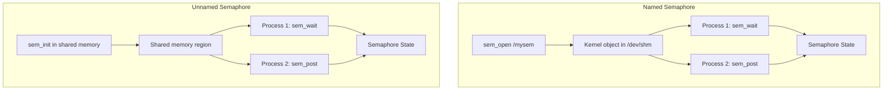

# POSIX Semaphores

## Introduction

Semaphores are a synchronization primitive used to control access to shared resources. A semaphore is essentially a counter that supports two atomic operations: **wait** (decrement, block if zero) and **post** (increment, wake a waiter). POSIX provides two flavors: **named semaphores** (identified by a string name, accessible across unrelated processes) and **unnamed semaphores** (embedded in shared memory or used within a single process).

## Named Semaphores

### Creating and Opening

```c
#include <semaphore.h>
#include <fcntl.h>
#include <stdio.h>
#include <errno.h>

int main(void) {
    /* Create a named semaphore with initial value 1 (mutex) */
    sem_t *sem = sem_open("/mysem", O_CREAT | O_EXCL, 0644, 1);
    if (sem == SEM_FAILED) {
        if (errno == EEXIST) {
            /* Already exists, just open it */
            sem = sem_open("/mysem", 0);
        } else {
            perror("sem_open");
            return 1;
        }
    }

    printf("Semaphore opened: %p\n", (void *)sem);
    return 0;
}
```

### Wait and Post Operations

```c
#include <semaphore.h>
#include <stdio.h>
#include <pthread.h>
#include <unistd.h>

static sem_t *sem;

static void *worker(void *arg) {
    int id = *(int *)arg;
    printf("Worker %d: waiting...\n", id);

    sem_wait(sem);  /* Decrement; block if 0 */
    printf("Worker %d: acquired semaphore\n", id);

    /* Critical section */
    sleep(2);

    printf("Worker %d: releasing\n", id);
    sem_post(sem);  /* Increment; wake a waiter */
    return NULL;
}

int main(void) {
    sem = sem_open("/workers", O_CREAT, 0644, 3);  /* Allow 3 concurrent */

    pthread_t threads[10];
    int ids[10];
    for (int i = 0; i < 10; i++) {
        ids[i] = i;
        pthread_create(&threads[i], NULL, worker, &ids[i]);
    }

    for (int i = 0; i < 10; i++)
        pthread_join(threads[i], NULL);

    sem_close(sem);
    sem_unlink("/workers");
    return 0;
}
```

```bash
gcc -o sem_demo sem_demo.c -lpthread
```

### Semaphore Variants

```c
#include <semaphore.h>
#include <time.h>
#include <errno.h>

sem_t *sem = sem_open("/mysem", O_CREAT, 0644, 1);

/* Blocking wait */
sem_wait(sem);

/* Non-blocking try */
if (sem_trywait(sem) == -1) {
    if (errno == EAGAIN) {
        printf("Semaphore not available\n");
    }
}

/* Timed wait */
struct timespec ts;
clock_gettime(CLOCK_REALTIME, &ts);
ts.tv_sec += 5;  /* 5 second timeout */
if (sem_timedwait(sem, &ts) == -1) {
    if (errno == ETIMEDOUT) {
        printf("Timed out\n");
    }
}

/* Get current value */
int val;
sem_getvalue(sem, &val);
printf("Semaphore value: %d\n", val);

/* Post (increment) */
sem_post(sem);

/* Cleanup */
sem_close(sem);
sem_unlink("/mysem");
```

### Filesystem Visibility

Named semaphores appear in the filesystem:

```bash
# Mount if not already mounted
sudo mount -t tmpfs tmpfs /dev/shm

# Named semaphores are in /dev/shm/ with sem. prefix
ls /dev/shm/sem.*
# /dev/shm/sem.mysem

# Delete
rm /dev/shm/sem.mysem
# Or programmatically:
# sem_unlink("/mysem");
```

## Unnamed (Memory-Based) Semaphores

Unnamed semaphores are allocated in user memory — typically in shared memory for inter-process use, or in process memory for thread synchronization.

### Thread Synchronization

```c
#include <semaphore.h>
#include <pthread.h>
#include <stdio.h>

static sem_t sem;
static int shared_data = 0;

static void *producer(void *arg) {
    for (int i = 0; i < 5; i++) {
        shared_data = i * 10;
        printf("Produced: %d\n", shared_data);
        sem_post(&sem);  /* Signal consumer */
        usleep(100000);
    }
    return NULL;
}

static void *consumer(void *arg) {
    for (int i = 0; i < 5; i++) {
        sem_wait(&sem);  /* Wait for producer */
        printf("Consumed: %d\n", shared_data);
    }
    return NULL;
}

int main(void) {
    sem_init(&sem, 0, 0);  /* pshared=0 (threads), initial=0 */

    pthread_t prod, cons;
    pthread_create(&prod, NULL, producer, NULL);
    pthread_create(&cons, NULL, consumer, NULL);

    pthread_join(prod, NULL);
    pthread_join(cons, NULL);

    sem_destroy(&sem);
    return 0;
}
```

### Inter-Process Synchronization (Shared Memory)

```c
#include <semaphore.h>
#include <sys/mman.h>
#include <sys/wait.h>
#include <stdio.h>
#include <unistd.h>

struct shared {
    sem_t mutex;
    int   counter;
};

int main(void) {
    /* Create shared memory region */
    struct shared *shm = mmap(NULL, sizeof(struct shared),
                              PROT_READ | PROT_WRITE,
                              MAP_SHARED | MAP_ANONYMOUS, -1, 0);

    /* Initialize semaphore in shared memory */
    /* pshared=1: shared between processes */
    sem_init(&shm->mutex, 1, 1);
    shm->counter = 0;

    if (fork() == 0) {
        /* Child */
        for (int i = 0; i < 100000; i++) {
            sem_wait(&shm->mutex);
            shm->counter++;
            sem_post(&shm->mutex);
        }
        return 0;
    }

    /* Parent */
    for (int i = 0; i < 100000; i++) {
        sem_wait(&shm->mutex);
        shm->counter++;
        sem_post(&shm->mutex);
    }

    wait(NULL);
    printf("Final counter: %d\n", shm->counter);  /* 200000 */

    sem_destroy(&shm->mutex);
    munmap(shm, sizeof(struct shared));
    return 0;
}
```

## Named vs Unnamed Semaphores



| Feature | Named | Unnamed |
|---|---|---|
| **Identification** | String name (`/mysem`) | Memory address |
| **Creation** | `sem_open()` | `sem_init()` |
| **Cross-process** | Yes (any process with name) | Yes (shared memory required) |
| **Cleanup** | `sem_unlink()` | `sem_destroy()` |
| **Filesystem** | Visible in `/dev/shm/` | Not visible |
| **Persistence** | Survives process exit | Freed with memory |
| **Use case** | Unrelated processes | Threads or shared memory |

## System V Semaphores

### Overview

System V semaphores are older but still widely used. They operate on **sets** of semaphores and support atomic operations on multiple semaphores simultaneously.

```c
#include <sys/ipc.h>
#include <sys/sem.h>
#include <stdio.h>

union semun {
    int              val;
    struct semid_ds *buf;
    unsigned short  *array;
};

int main(void) {
    key_t key = ftok("/tmp/semfile", 42);

    /* Create semaphore set with 2 semaphores */
    int semid = semget(key, 2, IPC_CREAT | 0644);
    if (semid == -1) { perror("semget"); return 1; }

    /* Initialize: sem[0] = 1 (mutex), sem[1] = 5 (resource count) */
    union semun arg;
    arg.val = 1;
    semctl(semid, 0, SETVAL, arg);
    arg.val = 5;
    semctl(semid, 1, SETVAL, arg);

    printf("Semaphore set created: id=%d\n", semid);
    return 0;
}
```

### Wait and Post

```c
#include <sys/ipc.h>
#include <sys/sem.h>

/* Wait (decrement) operation */
struct sembuf op_wait = {
    .sem_num = 0,    /* Semaphore index */
    .sem_op  = -1,   /* Decrement */
    .sem_flg = 0     /* Blocking */
};

/* Post (increment) operation */
struct sembuf op_post = {
    .sem_num = 0,
    .sem_op  = 1,
    .sem_flg = 0
};

/* Non-blocking try */
struct sembuf op_try = {
    .sem_num = 0,
    .sem_op  = -1,
    .sem_flg = IPC_NOWAIT
};

int main(void) {
    int semid = /* ... get semaphore set ... */;

    /* Wait */
    semop(semid, &op_wait, 1);

    /* Critical section */

    /* Post */
    semop(semid, &op_post, 1);
    return 0;
}
```

### Atomic Multi-Semaphore Operations

The power of System V semaphores is atomic operations on multiple semaphores:

```c
/* Atomically wait on sem[0] AND sem[1] */
struct sembuf ops[] = {
    { .sem_num = 0, .sem_op = -1, .sem_flg = 0 },  /* Lock mutex */
    { .sem_num = 1, .sem_op = -1, .sem_flg = 0 },  /* Decrement resource */
};
semop(semid, ops, 2);  /* Both operations are atomic */

/* Atomically release both */
struct sembuf release[] = {
    { .sem_num = 0, .sem_op = 1, .sem_flg = 0 },
    { .sem_num = 1, .sem_op = 1, .sem_flg = 0 },
};
semop(semid, release, 2);
```

### System V Semaphore Limits

```bash
ipcs -s          # List semaphore sets
ipcs -ls         # Show limits

# Kernel parameters
cat /proc/sys/kernel/sem
# SEMMSL SEMMNS SEMOPM SEMMNI
# 32000  1024000000 500  32000
```

## POSIX vs System V Semaphores

| Feature | POSIX | System V |
|---|---|---|
| **API** | `sem_wait`/`sem_post` | `semop()` with `sembuf` |
| **Granularity** | Single semaphore | Set of semaphores |
| **Multi-atomic** | No | Yes (multiple semops) |
| **Named** | `sem_open` | `semget` + key |
| **Unnamed** | `sem_init` | N/A |
| **Undo on crash** | No | `SEM_UNDO` flag |
| **Performance** | Faster (futex-based) | Slower (syscall-heavy) |
| **Portability** | POSIX (limited on macOS) | Most UNIX |

## Practical Patterns

### Binary Semaphore (Mutex)

```c
/* Protect a critical section */
sem_t *mutex = sem_open("/my_mutex", O_CREAT, 0644, 1);

sem_wait(mutex);      /* Lock */
/* ... critical section ... */
sem_post(mutex);      /* Unlock */
```

### Counting Semaphore (Resource Pool)

```c
/* Limit concurrent access to N resources */
sem_t *pool = sem_open("/conn_pool", O_CREAT, 0644, MAX_CONNECTIONS);

sem_wait(pool);       /* Acquire connection */
/* ... use connection ... */
sem_post(pool);       /* Release connection */
```

### Producer-Consumer with Bounded Buffer

```c
#include <semaphore.h>
#include <pthread.h>
#include <stdio.h>

#define BUFFER_SIZE 5

static int buffer[BUFFER_SIZE];
static int in = 0, out = 0;
static sem_t empty;   /* Count of empty slots */
static sem_t full;    /* Count of full slots */
static sem_t mutex;   /* Buffer access mutex */

static void *producer(void *arg) {
    for (int i = 0; i < 20; i++) {
        sem_wait(&empty);   /* Wait for empty slot */
        sem_wait(&mutex);   /* Lock buffer */

        buffer[in] = i;
        printf("Produced %d at [%d]\n", i, in);
        in = (in + 1) % BUFFER_SIZE;

        sem_post(&mutex);   /* Unlock buffer */
        sem_post(&full);    /* Signal full slot */
    }
    return NULL;
}

static void *consumer(void *arg) {
    for (int i = 0; i < 20; i++) {
        sem_wait(&full);    /* Wait for data */
        sem_wait(&mutex);   /* Lock buffer */

        int item = buffer[out];
        printf("Consumed %d from [%d]\n", item, out);
        out = (out + 1) % BUFFER_SIZE;

        sem_post(&mutex);   /* Unlock buffer */
        sem_post(&empty);   /* Signal empty slot */
    }
    return NULL;
}

int main(void) {
    sem_init(&empty, 0, BUFFER_SIZE);
    sem_init(&full, 0, 0);
    sem_init(&mutex, 0, 1);

    pthread_t prod, cons;
    pthread_create(&prod, NULL, producer, NULL);
    pthread_create(&cons, NULL, consumer, NULL);

    pthread_join(prod, NULL);
    pthread_join(cons, NULL);

    sem_destroy(&empty);
    sem_destroy(&full);
    sem_destroy(&mutex);
    return 0;
}
```

### Readers-Writers Problem

```c
#include <semaphore.h>
#include <pthread.h>
#include <stdio.h>

static sem_t rw_mutex;      /* Protects writers */
static sem_t mutex;         /* Protects reader_count */
static int reader_count = 0;

static void *reader(void *arg) {
    int id = *(int *)arg;

    sem_wait(&mutex);
    reader_count++;
    if (reader_count == 1)
        sem_wait(&rw_mutex);  /* First reader locks out writers */
    sem_post(&mutex);

    printf("Reader %d: reading\n", id);
    usleep(100000);

    sem_wait(&mutex);
    reader_count--;
    if (reader_count == 0)
        sem_post(&rw_mutex);  /* Last reader allows writers */
    sem_post(&mutex);
    return NULL;
}

static void *writer(void *arg) {
    int id = *(int *)arg;

    sem_wait(&rw_mutex);
    printf("Writer %d: writing\n", id);
    usleep(200000);
    sem_post(&rw_mutex);
    return NULL;
}
```

## Semaphore vs Mutex

| Property | Semaphore | Mutex |
|---|---|---|
| **Values** | 0 to N | Binary (locked/unlocked) |
| **Ownership** | No ownership | Owner must unlock |
| **Use case** | Resource counting, signaling | Mutual exclusion |
| **Recursive lock** | Natural (count > 1) | Needs recursive mutex |
| **Priority inversion** | Can occur | PI-aware mutexes exist |

**Rule of thumb**: Use a mutex for mutual exclusion. Use a semaphore for signaling or counting.

## Debugging Semaphores

```bash
# List POSIX named semaphores
ls -la /dev/shm/sem.*

# List System V semaphore sets
ipcs -s

# Remove a stuck System V semaphore
ipcrm -s <semid>

# Check for semaphore leaks
ipcs -s --human
```

## References

- [sem_overview(7) man page](https://man7.org/linux/man-pages/man7/sem_overview.7.html)
- [sem_open(3) man page](https://man7.org/linux/man-pages/man3/sem_open.3.html)
- [semop(2) man page](https://man7.org/linux/man-pages/man2/semop.2.html)
- [POSIX IPC documentation](https://www.kernel.org/doc/html/latest/userspace-api/sysVipc.html)
- [The Little Book of Semaphores](https://greenteapress.com/wp/semaphores/) — Allen Downey

## Related Topics

- [Message Queues](./message-queues.md) — message-based IPC
- [Unix Domain Sockets](./unix-sockets.md) — socket-based IPC
- [Memory Management](../memory.md) — shared memory via mmap
