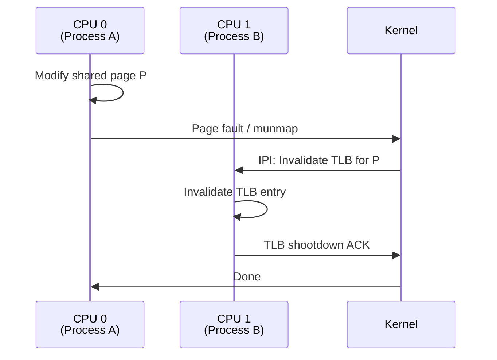

# Shared Memory

## Introduction

Shared memory is the **fastest IPC mechanism** available on Linux. It allows multiple processes to access the same region of physical memory, enabling data transfer without any kernel-mediated copying. The tradeoff is that synchronization becomes the responsibility of the application—processes must coordinate access using semaphores, mutexes, or other synchronization primitives.

Linux provides three main shared memory interfaces:
1. **System V shared memory** (`shmget`/`shmat`) — the classic Unix interface
2. **POSIX shared memory** (`shm_open` + `mmap`) — the modern, preferred interface
3. **Anonymous `mmap()`** — for related processes (parent-child via `fork()`)

## POSIX Shared Memory

### Creating and Mapping

```c
#include <sys/mman.h>
#include <sys/stat.h>
#include <fcntl.h>
#include <unistd.h>
#include <stdio.h>
#include <string.h>

int main(void)
{
    const char *name = "/myshm";
    const size_t size = 4096;

    /* Create shared memory object */
    int fd = shm_open(name, O_CREAT | O_RDWR, 0644);
    if (fd == -1) {
        perror("shm_open");
        return 1;
    }

    /* Set the size */
    if (ftruncate(fd, size) == -1) {
        perror("ftruncate");
        return 1;
    }

    /* Map into address space */
    void *ptr = mmap(NULL, size, PROT_READ | PROT_WRITE,
                     MAP_SHARED, fd, 0);
    if (ptr == MAP_FAILED) {
        perror("mmap");
        return 1;
    }

    /* Use the shared memory */
    sprintf((char *)ptr, "Hello from PID %d!", getpid());
    printf("Written: '%s'\n", (char *)ptr);

    /* Cleanup */
    munmap(ptr, size);
    close(fd);
    shm_unlink(name);

    return 0;
}
```

### Two-Process Communication

```c
/* writer.c - Creates and writes to shared memory */
#include <sys/mman.h>
#include <sys/stat.h>
#include <fcntl.h>
#include <unistd.h>
#include <stdio.h>
#include <string.h>

struct shared_data {
    int ready;
    char message[256];
    pid_t writer_pid;
};

int main(void)
{
    int fd = shm_open("/example_shm", O_CREAT | O_RDWR, 0644);
    ftruncate(fd, sizeof(struct shared_data));

    struct shared_data *data = mmap(NULL, sizeof(struct shared_data),
                                    PROT_READ | PROT_WRITE,
                                    MAP_SHARED, fd, 0);

    /* Write data */
    data->writer_pid = getpid();
    strncpy(data->message, "Hello from writer process!", sizeof(data->message));

    /* Signal that data is ready (memory barrier needed in production) */
    __sync_synchronize();  /* Compiler + hardware memory barrier */
    data->ready = 1;

    printf("Writer: data written, waiting for reader...\n");
    while (data->ready == 1)
        usleep(1000);  /* Wait for reader to consume */

    printf("Writer: reader consumed data, cleaning up\n");

    munmap(data, sizeof(struct shared_data));
    close(fd);
    shm_unlink("/example_shm");

    return 0;
}
```

```c
/* reader.c - Reads from shared memory */
#include <sys/mman.h>
#include <sys/stat.h>
#include <fcntl.h>
#include <unistd.h>
#include <stdio.h>

struct shared_data {
    int ready;
    char message[256];
    pid_t writer_pid;
};

int main(void)
{
    int fd = shm_open("/example_shm", O_RDWR, 0);
    if (fd == -1) {
        perror("shm_open (is writer running?)");
        return 1;
    }

    struct shared_data *data = mmap(NULL, sizeof(struct shared_data),
                                    PROT_READ | PROT_WRITE,
                                    MAP_SHARED, fd, 0);

    /* Wait for data to be ready */
    while (data->ready == 0)
        usleep(1000);

    printf("Reader: message = '%s'\n", data->message);
    printf("Reader: writer PID = %d\n", data->writer_pid);

    /* Signal that we've consumed the data */
    data->ready = 0;
    __sync_synchronize();

    munmap(data, sizeof(struct shared_data));
    close(fd);

    return 0;
}
```

```
# Terminal 1:
$ ./writer
Writer: data written, waiting for reader...
Writer: reader consumed data, cleaning up

# Terminal 2 (start within a few seconds):
$ ./reader
Reader: message = 'Hello from writer process!'
Reader: writer PID = 12345
```

## System V Shared Memory

### shmget() — Create/Get Segment

```c
#include <sys/ipc.h>
#include <sys/shm.h>

int shmget(key_t key, size_t size, int shmflg);
```

| Flag | Meaning |
|------|---------|
| `IPC_CREAT` | Create if it doesn't exist |
| `IPC_EXCL` | Fail if it already exists |
| `0666` | Permissions (read/write for owner, group, other) |

```c
/* Generate a unique key */
key_t key = ftok("/tmp/myshmfile", 'R');

/* Create a 4KB shared memory segment */
int shmid = shmget(key, 4096, IPC_CREAT | 0666);
if (shmid == -1) {
    perror("shmget");
    return 1;
}

/* Or use IPC_PRIVATE for anonymous (parent-child only) */
int shmid = shmget(IPC_PRIVATE, 4096, 0666);
```

### shmat() — Attach Segment

```c
void *shmat(int shmid, const void *shmaddr, int shmflg);
```

```c
/* Attach at any address (recommended) */
void *ptr = shmat(shmid, NULL, 0);
if (ptr == (void *)-1) {
    perror("shmat");
    return 1;
}

/* Now use it like normal memory */
sprintf((char *)ptr, "Hello from System V shared memory");

/* Detach when done */
shmdt(ptr);
```

### shmctl() — Control Operations

```c
int shmctl(int shmid, int cmd, struct shmid_ds *buf);
```

```c
/* Get info about the segment */
struct shmid_ds info;
shmctl(shmid, IPC_STAT, &info);
printf("Size: %zu, Attach count: %d, Creator PID: %d\n",
       info.shm_segsz, info.shm_nattch, info.shm_cpid);

/* Remove the segment */
shmctl(shmid, IPC_RMID, NULL);

/* Change permissions */
shmctl(shmid, IPC_SET, &new_info);
```

### Complete System V Example

```c
#include <sys/ipc.h>
#include <sys/shm.h>
#include <stdio.h>
#include <string.h>
#include <unistd.h>

#define SHM_SIZE 4096

int main(void)
{
    /* Create key */
    key_t key = ftok("/tmp", 'S');
    if (key == -1) {
        perror("ftok");
        return 1;
    }

    /* Create shared memory */
    int shmid = shmget(key, SHM_SIZE, IPC_CREAT | 0666);
    if (shmid == -1) {
        perror("shmget");
        return 1;
    }

    /* Attach */
    char *data = (char *)shmat(shmid, NULL, 0);
    if (data == (char *)-1) {
        perror("shmat");
        return 1;
    }

    /* Write */
    snprintf(data, SHM_SIZE, "Hello from PID %d", getpid());
    printf("Written to shared memory: '%s'\n", data);

    /* Show segment info */
    struct shmid_ds info;
    shmctl(shmid, IPC_STAT, &info);
    printf("Segment ID: %d, Size: %zu, Attachments: %d\n",
           shmid, info.shm_segsz, info.shm_nattch);

    /* Detach */
    shmdt(data);

    /* Don't remove yet — other processes may need it */
    /* shmctl(shmid, IPC_RMID, NULL); */

    return 0;
}
```

## mmap() — Anonymous Shared Memory

For related processes (parent-child), `mmap()` with `MAP_SHARED | MAP_ANONYMOUS` creates shared memory without any name:

```c
#include <sys/mman.h>
#include <unistd.h>
#include <stdio.h>
#include <sys/wait.h>

int main(void)
{
    /* Create shared mapping (shared across fork) */
    int *counter = mmap(NULL, sizeof(int),
                        PROT_READ | PROT_WRITE,
                        MAP_SHARED | MAP_ANONYMOUS, -1, 0);

    *counter = 0;

    pid_t pid = fork();
    if (pid == 0) {
        /* Child */
        for (int i = 0; i < 1000000; i++)
            (*counter)++;
        _exit(0);
    }

    /* Parent */
    for (int i = 0; i < 1000000; i++)
        (*counter)++;

    wait(NULL);
    printf("Counter: %d (expected: 2000000)\n", *counter);
    /* Note: actual value may be less due to race condition! */

    munmap(counter, sizeof(int));
    return 0;
}
```

### MAP_SHARED vs MAP_PRIVATE

| Flag | Effect |
|------|--------|
| `MAP_SHARED` | Writes are visible to other mappings and (if backed by file) written to disk |
| `MAP_PRIVATE` | Copy-on-write; writes are private to this process |

```c
/* Shared between parent and child */
int *shared = mmap(NULL, 4096, PROT_READ | PROT_WRITE,
                   MAP_SHARED | MAP_ANONYMOUS, -1, 0);

/* Private copy (copy-on-write) */
int *private = mmap(NULL, 4096, PROT_READ | PROT_WRITE,
                    MAP_PRIVATE | MAP_ANONYMOUS, -1, 0);
```

## Synchronization for Shared Memory

Shared memory alone provides no synchronization. Processes must coordinate access.

### POSIX Named Semaphores

```c
#include <semaphore.h>
#include <fcntl.h>

/* Producer-consumer with shared memory + semaphore */

/* Shared memory layout */
struct ring_buffer {
    sem_t mutex;         /* Protects buffer */
    sem_t items;         /* Count of available items */
    sem_t spaces;        /* Count of available spaces */
    int buffer[100];
    int read_pos;
    int write_pos;
};

/* Initialize (once, by creator) */
void init_buffer(struct ring_buffer *rb)
{
    sem_init(&rb->mutex, 1, 1);   /* pshared=1 for cross-process */
    sem_init(&rb->items, 1, 0);
    sem_init(&rb->spaces, 1, 100);
    rb->read_pos = 0;
    rb->write_pos = 0;
}

/* Producer */
void produce(struct ring_buffer *rb, int item)
{
    sem_wait(&rb->spaces);   /* Wait for space */
    sem_wait(&rb->mutex);    /* Lock */

    rb->buffer[rb->write_pos] = item;
    rb->write_pos = (rb->write_pos + 1) % 100;

    sem_post(&rb->mutex);    /* Unlock */
    sem_post(&rb->items);    /* Signal item available */
}

/* Consumer */
int consume(struct ring_buffer *rb)
{
    sem_wait(&rb->items);    /* Wait for item */
    sem_wait(&rb->mutex);    /* Lock */

    int item = rb->buffer[rb->read_pos];
    rb->read_pos = (rb->read_pos + 1) % 100;

    sem_post(&rb->mutex);    /* Unlock */
    sem_post(&rb->spaces);   /* Signal space available */

    return item;
}
```

### Robust Mutexes for Shared Memory

```c
#include <pthread.h>

/* Shared mutex between processes */
struct shared_state {
    pthread_mutex_t mutex;
    int data;
};

/* Initialize mutex for process-shared use */
void init_shared_mutex(pthread_mutex_t *mutex)
{
    pthread_mutexattr_t attr;
    pthread_mutexattr_init(&attr);
    pthread_mutexattr_setpshared(&attr, PTHREAD_PROCESS_SHARED);
    pthread_mutexattr_setrobust(&attr, PTHREAD_MUTEX_ROBUST);
    pthread_mutex_init(mutex, &attr);
    pthread_mutexattr_destroy(&attr);
}

/* Lock with robust handling */
int robust_lock(pthread_mutex_t *mutex)
{
    int ret = pthread_mutex_lock(mutex);
    if (ret == EOWNERDEAD) {
        /* Previous owner died while holding the lock.
         * The mutex is now "consistent" after we recover. */
        pthread_mutex_consistent(mutex);
        /* Lock is acquired, data may be inconsistent */
        return EOWNERDEAD;
    }
    return ret;
}
```

### futex-Based Synchronization

For lightweight synchronization without kernel overhead in the uncontended case:

```c
#include <linux/futex.h>
#include <sys/syscall.h>
#include <unistd.h>

int futex(int *uaddr, int futex_op, int val,
          const struct timespec *timeout, int *uaddr2, int val3)
{
    return syscall(SYS_futex, uaddr, futex_op, val, timeout, uaddr2, val3);
}

/* Simple mutex using futex */
struct futex_mutex {
    int state;  /* 0=unlocked, 1=locked-no-waiters, 2=locked-with-waiters */
};

void futex_lock(struct futex_mutex *m)
{
    int expected = 0;
    /* Fast path: try to acquire */
    if (__sync_bool_compare_and_swap(&m->state, 0, 1))
        return;

    /* Slow path: contention */
    while (__sync_lock_test_and_set(&m->state, 2) != 0) {
        futex(&m->state, FUTEX_WAIT, 2, NULL, NULL, 0);
    }
}

void futex_unlock(struct futex_mutex *m)
{
    if (__sync_sub_and_fetch(&m->state, 1) != 0) {
        /* There are waiters */
        m->state = 0;
        futex(&m->state, FUTEX_WAKE, 1, NULL, NULL, 0);
    }
}
```

## Memory-Mapped File as Shared Memory

Back shared memory with a file for persistence:

```c
#include <sys/mman.h>
#include <sys/stat.h>
#include <fcntl.h>
#include <unistd.h>

/* Map a file as shared memory */
int fd = open("/data/shared.db", O_RDWR | O_CREAT, 0644);
ftruncate(fd, 4096);

void *ptr = mmap(NULL, 4096, PROT_READ | PROT_WRITE,
                 MAP_SHARED, fd, 0);

/* Changes are automatically written to the file */
sprintf((char *)ptr, "Persistent data");

/* Force write to disk */
msync(ptr, 4096, MS_SYNC);

/* Or let kernel decide when to write */
msync(ptr, 4096, MS_ASYNC);
```

## Shared Memory and TLB Shootdown

When a process modifies shared memory, other processes' TLB entries may be stale. The kernel handles **TLB shootdown**—sending IPIs (Inter-Processor Interrupts) to other CPUs to invalidate their TLB entries.



## /dev/shm — tmpfs for Shared Memory

POSIX shared memory objects live on a `tmpfs` filesystem:

```bash
# List shared memory objects
$ ls -la /dev/shm/
total 0
drwxrwxrwt  2 root root   60 Jul 21 12:00 .
drwxr-xr-x 19 root root 3820 Jul 21 12:00 ..
-rw-r--r--  1 user user 4096 Jul 21 12:00 myshm

# Check size usage
$ df -h /dev/shm
Filesystem      Size  Used Avail Use% Mounted on
tmpfs           3.9G  4.0K  3.9G   1% /dev/shm

# Adjust size
$ sudo mount -o remount,size=8G /dev/shm

# Persistent in /etc/fstab
tmpfs  /dev/shm  tmpfs  defaults,size=8G  0  0
```

## Comparison: System V vs POSIX Shared Memory

| Feature | System V | POSIX |
|---------|----------|-------|
| **Creation** | `shmget(key, size, flags)` | `shm_open(name, flags, mode)` |
| **Attachment** | `shmat(shmid, NULL, 0)` | `mmap(NULL, size, prot, MAP_SHARED, fd, 0)` |
| **Naming** | `key_t` (ftok) | `/name` (filesystem) |
| **Removal** | `shmctl(shmid, IPC_RMID)` | `shm_unlink(name)` |
| **Size change** | Not supported | `ftruncate()` |
| **Resize after attach** | No | Yes (new mappings) |
| **Listing** | `ipcs -m` | `ls /dev/shm/` |
| **Limits** | `shmmax`, `shmall` | Filesystem limits |
| **Portability** | All Unix | POSIX-compliant |

## Performance

Shared memory performance depends on synchronization overhead:

```c
/* Benchmark: ping-pong between two processes */
/* Results on modern hardware (approximate): */

/* Shared memory + futex: ~0.1 μs per round trip */
/* Shared memory + semaphore: ~0.3 μs per round trip */
/* Shared memory + mutex: ~0.2 μs per round trip */
/* Pipe: ~5 μs per round trip */
/* Unix socket: ~5 μs per round trip */
```

**Throughput**: Shared memory can achieve **10+ GB/s** for bulk data transfer, limited only by memory bandwidth.

## References

- [The Linux Kernel Documentation](https://docs.kernel.org/)
- [LWN.net - Linux and free software news](https://lwn.net/)
- [GNU Project Documentation](https://www.gnu.org/doc/doc.html)
- [GNU Manuals](https://www.gnu.org/manual/manual.html)
- [Free Software Directory](https://directory.fsf.org/wiki/Main_Page)
- [Planet GNU](https://planet.gnu.org/)
- [Free Software Books](https://www.gnu.org/doc/other-free-books.html)

- [shm_overview(7) — POSIX shared memory](https://man7.org/linux/man-pages/man7/shm_overview.7.html)
- [shmget(2) — System V shared memory](https://man7.org/linux/man-pages/man2/shmget.2.html)
- [shm_open(3) — POSIX shared memory](https://man7.org/linux/man-pages/man3/shm_open.3.html)
- [mmap(2) — Memory mapping](https://man7.org/linux/man-pages/man2/mmap.2.html)
- [futex(2) — Fast userspace mutex](https://man7.org/linux/man-pages/man2/futex.2.html)
- [The Linux Programming Interface, Chapter 48-54](https://man7.org/tlpi/)

## Related Topics

- [IPC Overview](../ipc.md) — Comparison of all IPC mechanisms
- [Threads](../threads.md) — Shared memory is the default for threads
- [Pipes](./pipes.md) — Lower-bandwidth alternative
- [io_uring](../io-uring.md) — Shared memory rings for async I/O
