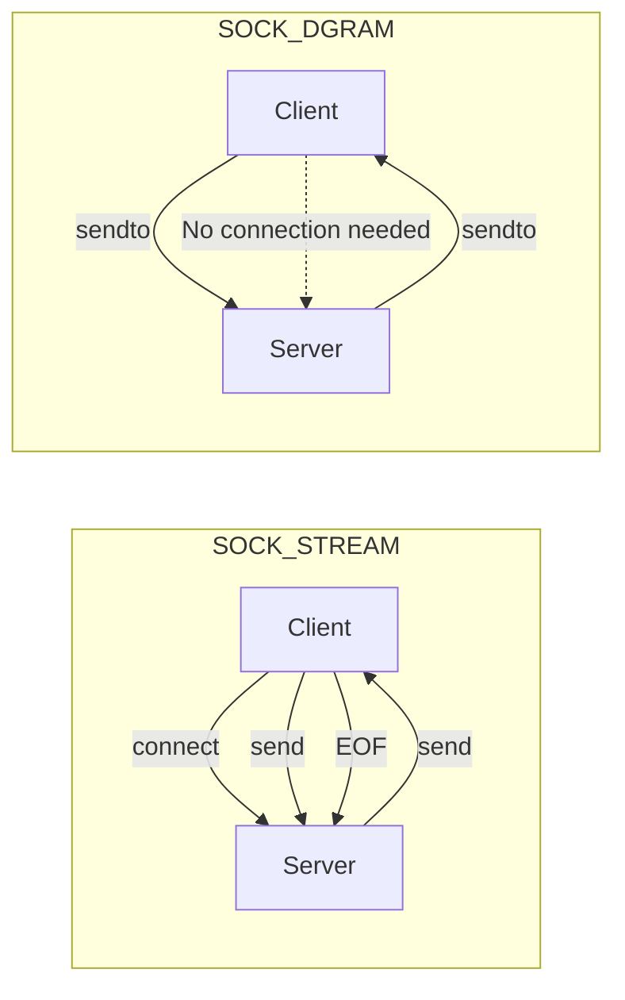
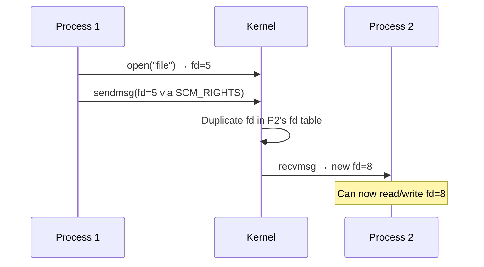

# Unix Domain Sockets

## Introduction

Unix domain sockets (AF_UNIX) provide inter-process communication between processes on the same machine. Unlike TCP/IP sockets, they don't involve network protocol overhead — data is copied directly between processes in kernel space. They support both stream (`SOCK_STREAM`) and datagram (`SOCK_DGRAM`) semantics, and can pass file descriptors between processes via `SCM_RIGHTS`.

## Creating Unix Domain Sockets

### Stream Socket (Connection-Oriented)

```c
#include <sys/socket.h>
#include <sys/un.h>
#include <unistd.h>
#include <stdio.h>
#include <string.h>

#define SOCKET_PATH "/tmp/unix_stream.sock"

int main(void) {
    int server_fd = socket(AF_UNIX, SOCK_STREAM, 0);
    if (server_fd < 0) { perror("socket"); return 1; }

    struct sockaddr_un addr;
    memset(&addr, 0, sizeof(addr));
    addr.sun_family = AF_UNIX;
    strncpy(addr.sun_path, SOCKET_PATH, sizeof(addr.sun_path) - 1);

    /* Remove stale socket file */
    unlink(SOCKET_PATH);

    if (bind(server_fd, (struct sockaddr *)&addr, sizeof(addr)) < 0) {
        perror("bind");
        return 1;
    }

    listen(server_fd, 5);
    printf("Listening on %s\n", SOCKET_PATH);

    int client_fd = accept(server_fd, NULL, NULL);
    char buf[256];
    ssize_t n = read(client_fd, buf, sizeof(buf));
    printf("Received: %.*s\n", (int)n, buf);

    write(client_fd, "ACK", 3);
    close(client_fd);
    close(server_fd);
    unlink(SOCKET_PATH);
    return 0;
}
```

### Datagram Socket (Connectionless)

```c
#include <sys/socket.h>
#include <sys/un.h>
#include <unistd.h>
#include <stdio.h>
#include <string.h>

#define SERVER_PATH "/tmp/unix_dgram.sock"
#define CLIENT_PATH "/tmp/unix_dgram_client.sock"

/* Receiver */
int server(void) {
    int fd = socket(AF_UNIX, SOCK_DGRAM, 0);
    unlink(SERVER_PATH);

    struct sockaddr_un addr = { .sun_family = AF_UNIX };
    strncpy(addr.sun_path, SERVER_PATH, sizeof(addr.sun_path) - 1);
    bind(fd, (struct sockaddr *)&addr, sizeof(addr));

    char buf[256];
    struct sockaddr_un client_addr;
    socklen_t client_len = sizeof(client_addr);

    ssize_t n = recvfrom(fd, buf, sizeof(buf), 0,
                         (struct sockaddr *)&client_addr, &client_len);
    printf("Received from %s: %.*s\n", client_addr.sun_path, (int)n, buf);

    /* Reply to client */
    sendto(fd, "ACK", 3, 0,
           (struct sockaddr *)&client_addr, client_len);

    close(fd);
    unlink(SOCKET_PATH);
    return 0;
}

/* Sender */
int client(void) {
    int fd = socket(AF_UNIX, SOCK_DGRAM, 0);
    unlink(CLIENT_PATH);

    struct sockaddr_un client_addr = { .sun_family = AF_UNIX };
    strncpy(client_addr.sun_path, CLIENT_PATH, sizeof(client_addr.sun_path) - 1);
    bind(fd, (struct sockaddr *)&client_addr, sizeof(client_addr));

    struct sockaddr_un server_addr = { .sun_family = AF_UNIX };
    strncpy(server_addr.sun_path, SERVER_PATH, sizeof(server_addr.sun_path) - 1);

    sendto(fd, "Hello!", 6, 0,
           (struct sockaddr *)&server_addr, sizeof(server_addr));

    char buf[256];
    ssize_t n = recv(fd, buf, sizeof(buf), 0);
    printf("Reply: %.*s\n", (int)n, buf);

    close(fd);
    unlink(CLIENT_PATH);
    return 0;
}
```

## Abstract Namespace

Linux supports an "abstract" namespace where sockets don't create filesystem entries:

```c
struct sockaddr_un addr;
memset(&addr, 0, sizeof(addr));
addr.sun_family = AF_UNIX;
/* First byte is '\0', followed by the name */
addr.sun_path[0] = '\0';
strcpy(addr.sun_path + 1, "my_abstract_socket");

socklen_t len = offsetof(struct sockaddr_un, sun_path) + 1 + strlen("my_abstract_socket");
bind(fd, (struct sockaddr *)&addr, len);
```

```bash
# List abstract sockets
ss -xa
# or
cat /proc/net/unix
```

### Abstract vs Pathname

| Feature | Pathname | Abstract |
|---|---|---|
| Filesystem entry | Yes (`/tmp/foo.sock`) | No |
| Cleanup needed | `unlink()` after use | Automatic |
| Security | Filesystem permissions | Process access |
| Portable | Most UNIX | Linux only |

## Stream vs Datagram



| Feature | SOCK_STREAM | SOCK_DGRAM |
|---|---|---|
| Connection | Yes (`connect`/`accept`) | No |
| Ordering | Guaranteed | Not guaranteed |
| Duplication | No duplicates | Possible duplicates |
| Boundaries | Byte stream | Message boundaries |
| Reliability | Reliable | Best-effort |
| Use case | Request/response, RPC | Logging, notifications |

## SCM_RIGHTS: Passing File Descriptors

The most powerful feature of Unix domain sockets: passing open file descriptors between unrelated processes.

### How It Works



### Sender (Passing a File Descriptor)

```c
#include <sys/socket.h>
#include <sys/un.h>
#include <sys/stat.h>
#include <fcntl.h>
#include <unistd.h>
#include <stdio.h>
#include <string.h>

#define SOCKET_PATH "/tmp/fd_pass.sock"

void send_fd(int socket, int fd_to_send) {
    struct msghdr msg = {0};
    struct cmsghdr *cmsg;
    char buf[CMSG_SPACE(sizeof(int))];
    struct iovec io = { .iov_base = "x", .iov_len = 1 };

    msg.msg_iov = &io;
    msg.msg_iovlen = 1;
    msg.msg_control = buf;
    msg.msg_controllen = sizeof(buf);

    cmsg = CMSG_FIRSTHDR(&msg);
    cmsg->cmsg_level = SOL_SOCKET;
    cmsg->cmsg_type  = SCM_RIGHTS;
    cmsg->cmsg_len   = CMSG_LEN(sizeof(int));
    *(int *)CMSG_DATA(cmsg) = fd_to_send;

    if (sendmsg(socket, &msg, 0) < 0)
        perror("sendmsg");
}

int main(void) {
    int sock = socket(AF_UNIX, SOCK_STREAM, 0);
    struct sockaddr_un addr = { .sun_family = AF_UNIX };
    strncpy(addr.sun_path, SOCKET_PATH, sizeof(addr.sun_path) - 1);
    unlink(SOCKET_PATH);
    bind(sock, (struct sockaddr *)&addr, sizeof(addr));
    listen(sock, 1);

    int client = accept(sock, NULL, NULL);

    /* Open a file and pass the fd */
    int fd = open("/etc/hostname", O_RDONLY);
    printf("Sending fd %d\n", fd);
    send_fd(client, fd);

    close(fd);
    close(client);
    close(sock);
    unlink(SOCKET_PATH);
    return 0;
}
```

### Receiver (Receiving a File Descriptor)

```c
#include <sys/socket.h>
#include <sys/un.h>
#include <unistd.h>
#include <stdio.h>
#include <string.h>

int recv_fd(int socket) {
    struct msghdr msg = {0};
    struct cmsghdr *cmsg;
    char buf[CMSG_SPACE(sizeof(int))];
    char dummy;
    struct iovec io = { .iov_base = &dummy, .iov_len = 1 };

    msg.msg_iov = &io;
    msg.msg_iovlen = 1;
    msg.msg_control = buf;
    msg.msg_controllen = sizeof(buf);

    if (recvmsg(socket, &msg, 0) < 0) {
        perror("recvmsg");
        return -1;
    }

    cmsg = CMSG_FIRSTHDR(&msg);
    if (cmsg && cmsg->cmsg_level == SOL_SOCKET &&
        cmsg->cmsg_type == SCM_RIGHTS) {
        return *(int *)CMSG_DATA(cmsg);
    }
    return -1;
}

int main(void) {
    int sock = socket(AF_UNIX, SOCK_STREAM, 0);
    struct sockaddr_un addr = { .sun_family = AF_UNIX };
    strncpy(addr.sun_path, "/tmp/fd_pass.sock", sizeof(addr.sun_path) - 1);
    connect(sock, (struct sockaddr *)&addr, sizeof(addr));

    int fd = recv_fd(sock);
    printf("Received fd: %d\n", fd);

    /* Read from the received fd */
    char buf[256];
    ssize_t n = read(fd, buf, sizeof(buf));
    printf("Content: %.*s\n", (int)n, buf);

    close(fd);
    close(sock);
    return 0;
}
```

### Use Cases for SCM_RIGHTS

1. **Privilege separation**: A privileged process opens files, passes fds to unprivileged workers
2. **Process spawning**: Parent opens a log file, passes fd to child
3. **Connection handoff**: One process accepts connections, passes to another
4. **Sandboxing**: A broker process mediates file access

```mermaid
graph TD
    A[Privileged Process] -->|open /etc/shadow| B[fd = 5]
    A -->|SCM_RIGHTS: pass fd 5| C[Unprivileged Worker]
    C -->|read fd 8| D[Read data safely]
    Note: Worker never had permission to open the file directly
```

## Abstract Socket Example: Simple RPC

```c
#include <sys/socket.h>
#include <sys/un.h>
#include <unistd.h>
#include <stdio.h>
#include <string.h>
#include <stdlib.h>

#define ABSTRACT_NAME "\0my_rpc_service"

/* Simple protocol: 4-byte length + payload */

static int send_msg(int fd, const char *msg) {
    uint32_t len = strlen(msg);
    write(fd, &len, 4);
    write(fd, msg, len);
    return 0;
}

static char *recv_msg(int fd) {
    uint32_t len;
    if (read(fd, &len, 4) != 4) return NULL;
    char *buf = malloc(len + 1);
    read(fd, buf, len);
    buf[len] = '\0';
    return buf;
}

int server(void) {
    int fd = socket(AF_UNIX, SOCK_STREAM, 0);
    struct sockaddr_un addr;
    memset(&addr, 0, sizeof(addr));
    addr.sun_family = AF_UNIX;
    memcpy(addr.sun_path, ABSTRACT_NAME, sizeof(ABSTRACT_NAME) - 1);

    socklen_t len = offsetof(struct sockaddr_un, sun_path) + sizeof(ABSTRACT_NAME) - 1;
    bind(fd, (struct sockaddr *)&addr, len);
    listen(fd, 5);

    printf("RPC server ready\n");
    while (1) {
        int client = accept(fd, NULL, NULL);
        char *req = recv_msg(client);
        printf("Request: %s\n", req);

        /* Simple echo RPC */
        char reply[512];
        snprintf(reply, sizeof(reply), "Echo: %s", req);
        send_msg(client, reply);

        free(req);
        close(client);
    }
}

int client(const char *request) {
    int fd = socket(AF_UNIX, SOCK_STREAM, 0);
    struct sockaddr_un addr;
    memset(&addr, 0, sizeof(addr));
    addr.sun_family = AF_UNIX;
    memcpy(addr.sun_path, ABSTRACT_NAME, sizeof(ABSTRACT_NAME) - 1);

    socklen_t len = offsetof(struct sockaddr_un, sun_path) + sizeof(ABSTRACT_NAME) - 1;
    connect(fd, (struct sockaddr *)&addr, len);

    send_msg(fd, request);
    char *reply = recv_msg(fd);
    printf("Reply: %s\n", reply);

    free(reply);
    close(fd);
    return 0;
}
```

## Performance: Unix Sockets vs TCP

```bash
# Benchmark: Unix domain socket vs TCP loopback
# Using iperf3 or custom benchmark

# Unix domain socket: ~2x faster than TCP loopback
# No TCP/IP overhead, no checksums, no routing
```

| Metric | Unix Socket | TCP Loopback |
|---|---|---|
| Latency | ~3-5 µs | ~10-15 µs |
| Throughput | ~50 GB/s | ~25 GB/s |
| Syscalls | Same | Same |
| Overhead | Minimal | TCP/IP stack |
| Security | Filesystem perms | Firewall needed |

## Socket Options

```c
/* Get peer credentials (PID, UID, GID) */
struct ucred cred;
socklen_t len = sizeof(cred);
getsockopt(client_fd, SOL_SOCKET, SO_PEERCRED, &cred, &len);
printf("Peer: PID=%d UID=%d GID=%d\n", cred.pid, cred.uid, cred.gid);

/* Set socket permissions */
chmod(SOCKET_PATH, 0660);

/* Receive credentials with each message (SO_PASSCRED) */
int one = 1;
setsockopt(fd, SOL_SOCKET, SO_PASSCRED, &one, sizeof(one));

/* Send/recv credentials as ancillary data */
struct msghdr msg;
struct cmsghdr *cmsg;
/* ... see SCM_CREDENTIALS ... */
```

## Real-World Usage

### Docker and Container Sockets

```bash
# Docker daemon listens on a Unix socket
ls -la /var/run/docker.sock
# srw-rw---- 1 root docker 0 ... /var/run/docker.sock

# Communicate with Docker
curl --unix-socket /var/run/docker.sock http://localhost/containers/json
```

### systemd Journal

```bash
# systemd-journald uses /run/systemd/journal/stdout
# Applications write to journald via Unix sockets
```

### D-Bus

```bash
# D-Bus session bus uses Unix sockets
ls /run/user/1000/bus
# or abstract socket
ss -xa | grep dbus
```

## Security Considerations

1. **Filesystem permissions** control access to pathname sockets
2. **`SO_PEERCRED`** provides reliable authentication (can't be forged)
3. **Abstract sockets** have no filesystem permissions — any process can connect
4. **`SCM_RIGHTS`** can leak file descriptors if not careful
5. **Socket directory** should have restricted permissions (e.g., `0700`)

```c
/* Secure socket creation */
int create_secure_socket(const char *path) {
    int fd = socket(AF_UNIX, SOCK_STREAM, 0);

    /* Set umask to restrict permissions */
    mode_t old_umask = umask(0077);
    struct sockaddr_un addr = { .sun_family = AF_UNIX };
    strncpy(addr.sun_path, path, sizeof(addr.sun_path) - 1);
    unlink(path);
    bind(fd, (struct sockaddr *)&addr, sizeof(addr));
    umask(old_umask);

    listen(fd, 5);
    return fd;
}
```

## References

- [unix(7) man page](https://man7.org/linux/man-pages/man7/unix.7.html)
- [socket(7) man page](https://man7.org/linux/man-pages/man7/socket.7.html)
- [SCM_RIGHTS tutorial](https://blog.cloudflare.com/know-your-scm_rights/)
- [Beej's Guide to Unix IPC](https://beej.us/guide/bgipc/)

## Advanced Patterns

### Socket Activation (systemd)

systemd can listen on Unix sockets and pass them to services on demand:

```ini
# /etc/systemd/system/my-service.socket
[Unit]
Description=My Service Socket

[Socket]
ListenStream=/run/my-service.sock
Accept=no

[Install]
WantedBy=sockets.target
```

```ini
# /etc/systemd/system/my-service.service
[Unit]
Description=My Service
Requires=my-service.socket

[Service]
ExecStart=/usr/bin/my-service
```

```bash
# Enable socket activation
systemctl enable my-service.socket
systemctl start my-service.socket

# The service starts automatically when a client connects
curl --unix-socket /run/my-service.sock http://localhost/
```

### Multiplexed Server with SCM_RIGHTS

A privileged broker passes file descriptors to unprivileged workers:

```c
/* Broker: accepts connections, passes to workers */
void broker_loop(int listen_fd, int worker_fd) {
    while (1) {
        int client = accept(listen_fd, NULL, NULL);
        if (client < 0) continue;

        /* Pass client fd to worker */
        send_fd(worker_fd, client);

        /* Close our copy */
        close(client);
    }
}

/* Worker: receives fds from broker, processes requests */
void worker_loop(int broker_fd) {
    while (1) {
        int client = recv_fd(broker_fd);
        if (client < 0) continue;

        /* Process client request */
        char buf[4096];
        ssize_t n = read(client, buf, sizeof(buf));
        if (n > 0) {
            /* Handle request */
            write(client, "OK", 2);
        }
        close(client);
    }
}
```

### Unix Socket as PID File Lock

Use abstract sockets as a reliable PID-based lock:

```c
#include <sys/socket.h>
#include <sys/un.h>
#include <unistd.h>
#include <stdio.h>
#include <errno.h>

#define LOCK_NAME "\0my-daemon-lock"

int acquire_lock(void) {
    int fd = socket(AF_UNIX, SOCK_STREAM, 0);
    if (fd < 0) return -1;

    struct sockaddr_un addr;
    memset(&addr, 0, sizeof(addr));
    addr.sun_family = AF_UNIX;
    memcpy(addr.sun_path, LOCK_NAME, sizeof(LOCK_NAME) - 1);

    socklen_t len = offsetof(struct sockaddr_un, sun_path) +
                    sizeof(LOCK_NAME) - 1;

    if (bind(fd, (struct sockaddr *)&addr, len) < 0) {
        if (errno == EADDRINUSE) {
            /* Another instance is running */
            close(fd);
            return -1;
        }
        close(fd);
        return -1;
    }

    return fd;  /* Keep fd open to hold the lock */
}
```

### Zero-Copy with splice()

For high-throughput data transfer between Unix sockets and files:

```c
#include <fcntl.h>
#include <unistd.h>

/* Transfer data from file to socket without copying to userspace */
int sendfile_to_socket(int file_fd, int socket_fd, size_t count) {
    /* Create a pipe for splice */
    int pipefd[2];
    if (pipe(pipefd) < 0)
        return -1;

    /* splice: file → pipe */
    ssize_t n = splice(file_fd, NULL, pipefd[1], NULL,
                        count, SPLICE_F_MOVE);
    if (n < 0) {
        close(pipefd[0]);
        close(pipefd[1]);
        return -1;
    }

    /* splice: pipe → socket */
    ssize_t sent = splice(pipefd[0], NULL, socket_fd, NULL,
                          n, SPLICE_F_MOVE | SPLICE_F_MORE);

    close(pipefd[0]);
    close(pipefd[1]);
    return sent;
}
```

## Socket Pair Utility

`socketpair()` creates a pair of connected Unix sockets, useful for
parent-child IPC:

```c
#include <sys/socket.h>
#include <unistd.h>

int sv[2];
if (socketpair(AF_UNIX, SOCK_STREAM, 0, sv) < 0) {
    perror("socketpair");
    return 1;
}

pid_t pid = fork();
if (pid == 0) {
    /* Child */
    close(sv[0]);
    write(sv[1], "hello parent", 12);
    close(sv[1]);
} else {
    /* Parent */
    close(sv[1]);
    char buf[12];
    read(sv[0], buf, sizeof(buf));
    printf("Received: %s\n", buf);
    close(sv[0]);
}
```

## Benchmarking Unix Sockets

```bash
# Using socat for quick benchmarks
# Server:
socat UNIX-LISTEN:/tmp/bench.sock,fork,reuseaddr EXEC:/bin/cat

# Client (throughput test):
for i in $(seq 1 10000); do
    echo "test" | socat - UNIX-CONNECT:/tmp/bench.sock
done

# Using iperf3 (supports Unix sockets via --bind)
# Or custom benchmark:
# Unix socket: ~100,000 round-trips/sec for small messages
# TCP loopback: ~50,000 round-trips/sec for small messages
```

## Related Topics

- [Message Queues](./message-queues.md) — alternative IPC mechanisms
- [POSIX Semaphores](./semaphores.md) — synchronization primitives
- [Event-Driven Programming](../event-driven.md) — integrating sockets into event loops
- [poll and select](../poll-select.md) — multiplexing socket I/O
- [io_uring](../aio.md) — completion-based I/O for Unix sockets
