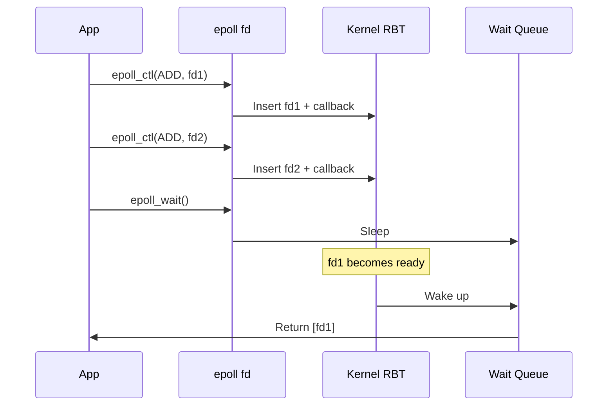
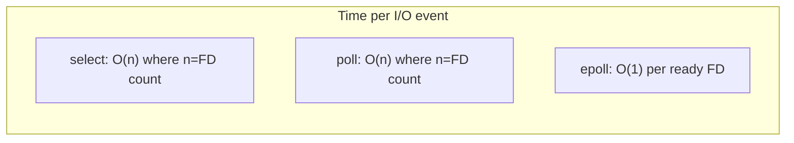

# poll and select: I/O Multiplexing

## Introduction

I/O multiplexing allows a single thread to monitor multiple file descriptors for readiness, avoiding the overhead of one thread per connection. The three main interfaces on Linux are `select`, `poll`, and `epoll`. This chapter covers each in detail, compares their characteristics, and provides practical guidance on choosing the right one.

## select

`select` is the oldest I/O multiplexing interface, standardized in POSIX. It monitors three sets of file descriptors for read, write, and exceptional conditions.

### API

```c
#include <sys/select.h>

int select(int nfds,
           fd_set *readfds,
           fd_set *writefds,
           fd_set *exceptfds,
           struct timeval *timeout);
```

### fd_set Operations

```c
#include <sys/select.h>

fd_set readfds;
FD_ZERO(&readfds);          /* Clear all bits */
FD_SET(STDIN_FILENO, &readfds);  /* Set bit for fd 0 */
FD_SET(fd, &readfds);       /* Set bit for fd */

if (FD_ISSET(fd, &readfds)) {
    /* fd is ready for reading */
}

FD_CLR(fd, &readfds);       /* Clear bit for fd */
```

### fd_set Implementation

```c
/* Typical fd_set implementation (Linux glibc) */
#define FD_SETSIZE 1024

typedef struct {
    unsigned long fds_bits[FD_SETSIZE / (8 * sizeof(unsigned long))];
} fd_set;

/* FD_SET is essentially: */
#define FD_SET(fd, set) \
    ((set)->fds_bits[(fd) / NFDBITS] |= (1UL << ((fd) % NFDBITS)))
```

**Key limitation**: `FD_SETSIZE` is typically 1024. File descriptors above this value cause undefined behavior.

### select Example

```c
#include <sys/select.h>
#include <sys/socket.h>
#include <netinet/in.h>
#include <unistd.h>
#include <stdio.h>
#include <string.h>

#define MAX_FD 1024

int main(void) {
    int listen_fd = socket(AF_INET, SOCK_STREAM, 0);
    int opt = 1;
    setsockopt(listen_fd, SOL_SOCKET, SO_REUSEADDR, &opt, sizeof(opt));

    struct sockaddr_in addr = {
        .sin_family = AF_INET,
        .sin_port = htons(8080),
        .sin_addr.s_addr = INADDR_ANY
    };
    bind(listen_fd, (struct sockaddr *)&addr, sizeof(addr));
    listen(listen_fd, 128);

    int clients[MAX_FD];
    int max_fd = listen_fd;

    fd_set readfds;
    printf("select() server on :8080\n");

    for (;;) {
        FD_ZERO(&readfds);
        FD_SET(listen_fd, &readfds);

        for (int i = 0; i <= max_fd; i++) {
            if (clients[i]) FD_SET(i, &readfds);
        }

        int n = select(max_fd + 1, &readfds, NULL, NULL, NULL);
        if (n < 0) { perror("select"); continue; }

        /* Check listening socket */
        if (FD_ISSET(listen_fd, &readfds)) {
            int client = accept(listen_fd, NULL, NULL);
            if (client < MAX_FD) {
                clients[client] = 1;
                if (client > max_fd) max_fd = client;
                printf("New client: fd=%d\n", client);
            }
        }

        /* Check client sockets */
        for (int i = 0; i <= max_fd; i++) {
            if (!clients[i] || !FD_ISSET(i, &readfds)) continue;

            char buf[4096];
            ssize_t n = read(i, buf, sizeof(buf));
            if (n > 0) {
                write(i, buf, n);  /* Echo */
            } else {
                close(i);
                clients[i] = 0;
                printf("Client disconnected: fd=%d\n", i);
            }
        }
    }
}
```

### select Limitations

1. **O(n) scan**: Must check all `nfds` descriptors every call
2. **fd_set size limit**: Usually 1024 (compile-time)
3. **Modifies fd_sets**: Must rebuild sets before each call
4. **Three separate sets**: Three copies for read/write/except
5. **No edge-triggered**: Always level-triggered

## poll

`poll` is a more modern alternative to `select`, addressing several limitations.

### API

```c
#include <poll.h>

int poll(struct pollfd *fds, nfds_t nfds, int timeout_ms);

struct pollfd {
    int   fd;         /* File descriptor */
    short events;     /* Events to watch */
    short revents;    /* Events returned */
};
```

### Event Flags

| Flag | Meaning |
|---|---|
| `POLLIN` | Data available for reading |
| `POLLOUT` | Writing won't block |
| `POLLERR` | Error condition |
| `POLLHUP` | Hang up (connection closed) |
| `POLLNVAL` | Invalid fd |
| `POLLPRI` | Urgent data (out-of-band) |
| `POLLRDHUP` | Peer closed connection (Linux-specific) |

### poll Example

```c
#include <poll.h>
#include <sys/socket.h>
#include <netinet/in.h>
#include <unistd.h>
#include <stdio.h>
#include <string.h>

#define MAX_CLIENTS 10000

int main(void) {
    int listen_fd = socket(AF_INET, SOCK_STREAM, 0);
    int opt = 1;
    setsockopt(listen_fd, SOL_SOCKET, SO_REUSEADDR, &opt, sizeof(opt));

    struct sockaddr_in addr = {
        .sin_family = AF_INET,
        .sin_port = htons(8080),
        .sin_addr.s_addr = INADDR_ANY
    };
    bind(listen_fd, (struct sockaddr *)&addr, sizeof(addr));
    listen(listen_fd, 128);

    struct pollfd fds[MAX_CLIENTS + 1];
    memset(fds, 0, sizeof(fds));
    int nfds = 1;

    fds[0].fd = listen_fd;
    fds[0].events = POLLIN;

    printf("poll() server on :8080\n");

    for (;;) {
        int n = poll(fds, nfds, -1);
        if (n < 0) { perror("poll"); continue; }

        /* Check listening socket */
        if (fds[0].revents & POLLIN) {
            int client = accept(listen_fd, NULL, NULL);
            if (client >= 0 && nfds < MAX_CLIENTS + 1) {
                fds[nfds].fd = client;
                fds[nfds].events = POLLIN | POLLRDHUP;
                nfds++;
                printf("New client: fd=%d (total: %d)\n", client, nfds - 1);
            }
        }

        /* Check client sockets */
        for (int i = 1; i < nfds; i++) {
            if (fds[i].revents & (POLLIN | POLLRDHUP | POLLHUP | POLLERR)) {
                char buf[4096];
                ssize_t n = read(fds[i].fd, buf, sizeof(buf));
                if (n > 0) {
                    write(fds[i].fd, buf, n);
                } else {
                    close(fds[i].fd);
                    printf("Client disconnected: fd=%d\n", fds[i].fd);
                    /* Compact array */
                    fds[i] = fds[nfds - 1];
                    nfds--;
                    i--;
                }
            }
        }
    }
}
```

### select vs poll

```c
/* select: must rebuild sets each iteration */
fd_set readfds;
FD_ZERO(&readfds);
for (int i = 0; i < n; i++)
    FD_SET(fds[i], &readfds);
select(max_fd + 1, &readfds, NULL, NULL, NULL);

/* poll: events/revents are separate, no rebuild needed */
poll(fds, nfds, -1);
/* Just check revents */
```

## epoll

`epoll` is Linux's high-performance I/O multiplexing mechanism, designed to scale to hundreds of thousands of file descriptors.

### API

```c
#include <sys/epoll.h>

int epoll_create(int size);          /* Create epoll instance */
int epoll_create1(int flags);        /* Create with flags (EPOLL_CLOEXEC) */

int epoll_ctl(int epfd, int op, int fd, struct epoll_event *event);
/* op: EPOLL_CTL_ADD, EPOLL_CTL_MOD, EPOLL_CTL_DEL */

int epoll_wait(int epfd, struct epoll_event *events,
               int maxevents, int timeout);

struct epoll_event {
    uint32_t     events;   /* Epoll events */
    epoll_data_t data;     /* User data */
};

typedef union epoll_data {
    void    *ptr;
    int      fd;
    uint32_t u32;
    uint64_t u64;
} epoll_data_t;
```

### epoll Internals



### epoll Example

```c
#include <sys/epoll.h>
#include <sys/socket.h>
#include <netinet/in.h>
#include <unistd.h>
#include <fcntl.h>
#include <stdio.h>
#include <string.h>
#include <errno.h>

#define MAX_EVENTS 1024

static int set_nonblocking(int fd) {
    int flags = fcntl(fd, F_GETFL, 0);
    return fcntl(fd, F_SETFL, flags | O_NONBLOCK);
}

int main(void) {
    int epoll_fd = epoll_create1(0);
    int listen_fd = socket(AF_INET, SOCK_STREAM, 0);
    int opt = 1;
    setsockopt(listen_fd, SOL_SOCKET, SO_REUSEADDR, &opt, sizeof(opt));
    set_nonblocking(listen_fd);

    struct sockaddr_in addr = {
        .sin_family = AF_INET,
        .sin_port = htons(8080),
        .sin_addr.s_addr = INADDR_ANY
    };
    bind(listen_fd, (struct sockaddr *)&addr, sizeof(addr));
    listen(listen_fd, 128);

    struct epoll_event ev = {
        .events = EPOLLIN | EPOLLEXCLUSIVE,
        .data.fd = listen_fd
    };
    epoll_ctl(epoll_fd, EPOLL_CTL_ADD, listen_fd, &ev);

    struct epoll_event events[MAX_EVENTS];
    printf("epoll server on :8080\n");

    for (;;) {
        int n = epoll_wait(epoll_fd, events, MAX_EVENTS, -1);
        for (int i = 0; i < n; i++) {
            int fd = events[i].data.fd;

            if (fd == listen_fd) {
                /* Accept all pending connections */
                while (1) {
                    int client = accept(listen_fd, NULL, NULL);
                    if (client < 0) {
                        if (errno == EAGAIN || errno == EWOULDBLOCK)
                            break;
                        perror("accept");
                        break;
                    }
                    set_nonblocking(client);
                    struct epoll_event cev = {
                        .events = EPOLLIN | EPOLLET,
                        .data.fd = client
                    };
                    epoll_ctl(epoll_fd, EPOLL_CTL_ADD, client, &cev);
                    printf("New client: fd=%d\n", client);
                }
            } else {
                /* Edge-triggered: read all available data */
                while (1) {
                    char buf[4096];
                    ssize_t n = read(fd, buf, sizeof(buf));
                    if (n < 0) {
                        if (errno == EAGAIN) break;
                        perror("read");
                        close(fd);
                        epoll_ctl(epoll_fd, EPOLL_CTL_DEL, fd, NULL);
                        break;
                    }
                    if (n == 0) {
                        close(fd);
                        epoll_ctl(epoll_fd, EPOLL_CTL_DEL, fd, NULL);
                        printf("Client disconnected: fd=%d\n", fd);
                        break;
                    }
                    write(fd, buf, n);
                }
            }
        }
    }
}
```

## Comprehensive Comparison

| Feature | select | poll | epoll |
|---|---|---|---|
| **Time complexity** | O(n) per call | O(n) per call | O(1) per event |
| **FD limit** | 1024 (FD_SETSIZE) | Unlimited | Unlimited |
| **Rebuild sets** | Every call | Not needed | Not needed |
| **Kernel data** | Copied each call | Copied each call | Persistent (RB-tree) |
| **Trigger mode** | Level only | Level only | Level or Edge |
| **Scalability** | Poor (>100 FDs) | Moderate | Excellent (100K+) |
| **Portability** | POSIX | POSIX | Linux only |
| **Close notification** | Implicit | Implicit | Explicit EPOLL_CTL_DEL |

### Performance Characteristics



```
Benchmark: 10,000 idle connections, 1 active

select:  ~10ms per event (scans all 10K FDs)
poll:    ~10ms per event (scans all 10K FDs)
epoll:   ~0.01ms per event (direct lookup)
```

## Other I/O Multiplexing Mechanisms

### kqueue (FreeBSD/macOS)

```c
#include <sys/event.h>

int kq = kqueue();
struct kevent change;
EV_SET(&change, fd, EVFILT_READ, EV_ADD, 0, 0, NULL);
kevent(kq, &change, 1, NULL, 0, NULL);

struct kevent events[10];
int n = kevent(kq, NULL, 0, events, 10, NULL);
```

### io_uring (Linux 5.1+)

See [POSIX AIO](./aio.md) for io_uring details. io_uring can also act as an event loop:

```c
#include <liburing.h>

struct io_uring ring;
io_uring_queue_init(256, &ring, 0);

/* Register fixed files */
io_uring_register_files(&ring, fds, num_fds);

/* Poll for readability */
struct io_uring_sqe *sqe = io_uring_get_sqe(&ring);
io_uring_prep_poll_add(sqe, fd, POLLIN);
io_uring_submit(&ring);

struct io_uring_cqe *cqe;
io_uring_wait_cqe(&ring, &cqe);
/* fd is now readable */
```

## Best Practices

1. **Use `epoll` for Linux servers** with many connections
2. **Use `poll`** for portable code with moderate FD counts (< 1000)
3. **Avoid `select`** in new code — fd_set limits and O(n) scanning
4. **Edge-triggered** for high-throughput, but requires careful `EAGAIN` handling
5. **`EPOLLEXCLUSIVE`** (Linux 4.5+) for multi-threaded accept
6. **`EPOLLONESHOT`** for one-shot notifications (re-arm with `EPOLL_CTL_MOD`)

```c
/* EPOLLONESHOT: fire once, then re-arm */
ev.events = EPOLLIN | EPOLLONESHOT;
epoll_ctl(epoll_fd, EPOLL_CTL_MOD, fd, &ev);  /* Re-arm */
```

## References

- [The Linux Kernel Documentation](https://docs.kernel.org/)
- [LWN.net - Linux and free software news](https://lwn.net/)
- [GNU Project Documentation](https://www.gnu.org/doc/doc.html)
- [GNU Manuals](https://www.gnu.org/manual/manual.html)
- [Free Software Directory](https://directory.fsf.org/wiki/Main_Page)
- [Planet GNU](https://planet.gnu.org/)
- [Free Software Books](https://www.gnu.org/doc/other-free-books.html)

- [select(2) man page](https://man7.org/linux/man-pages/man2/select.2.html)
- [poll(2) man page](https://man7.org/linux/man-pages/man2/poll.2.html)
- [epoll(7) man page](https://man7.org/linux/man-pages/man7/epoll.7.html)
- [The C10K problem](http://www.kegel.com/c10k.html)
- [epoll scalability](https://copyconstruct.medium.com/the-method-to-epolls-madness-d54f9d3a4db7)

## Related Topics

- [Event-Driven Programming](./event-driven.md) — reactor/proactor patterns built on top
- [POSIX AIO](./aio.md) — async I/O alternatives
- [Unix Domain Sockets](./ipc/unix-sockets.md) — local IPC with multiplexed I/O
