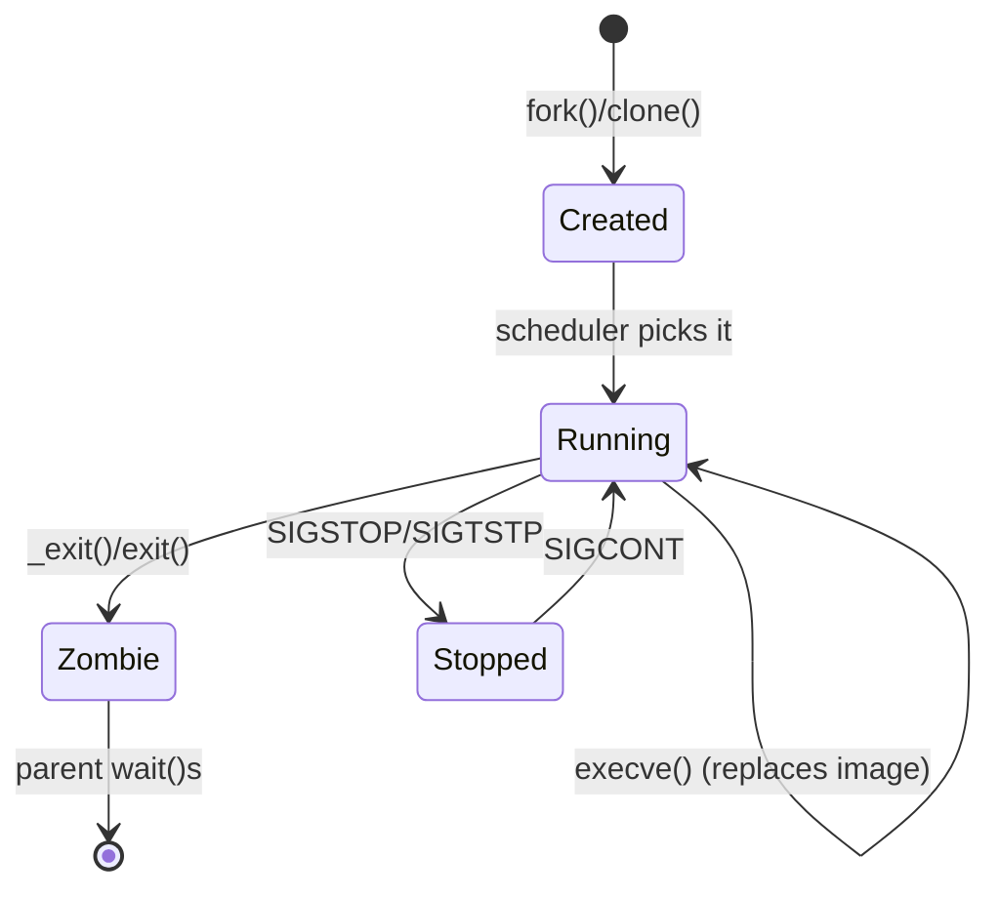
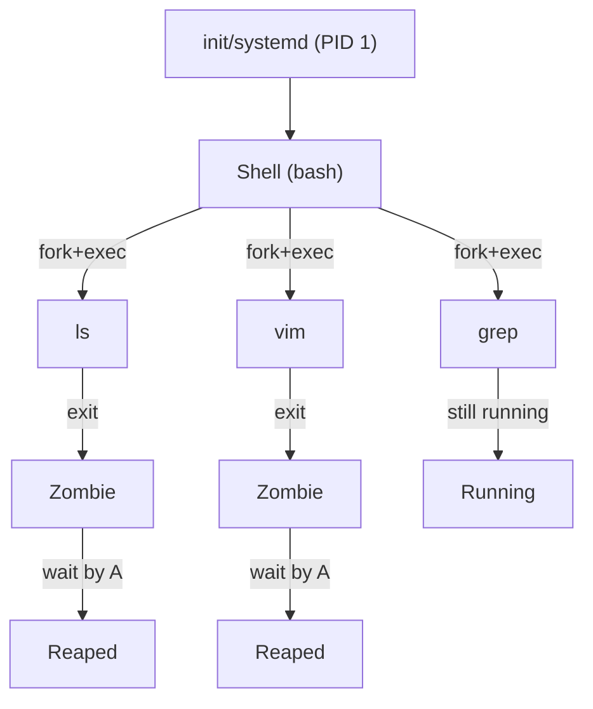
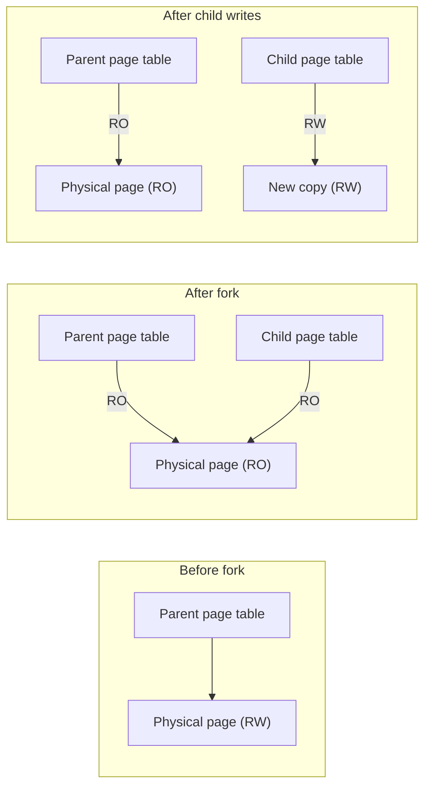
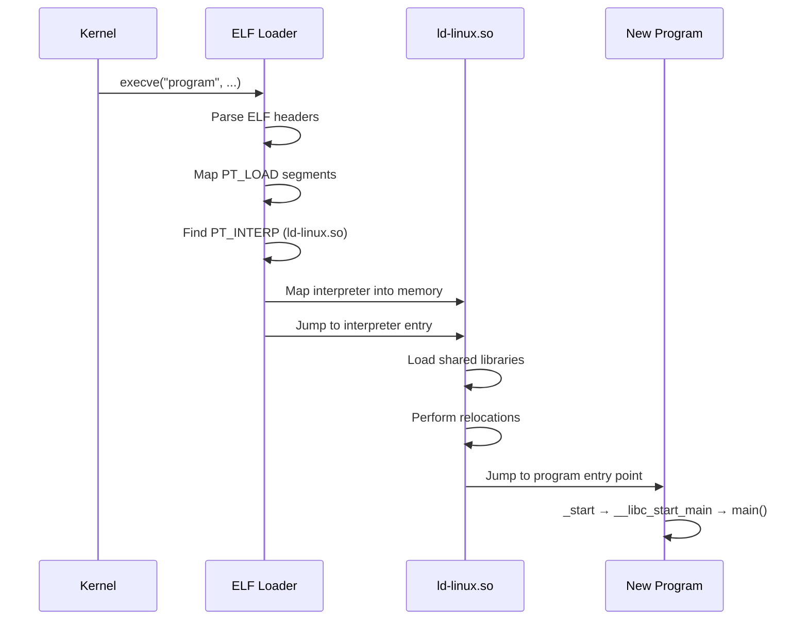
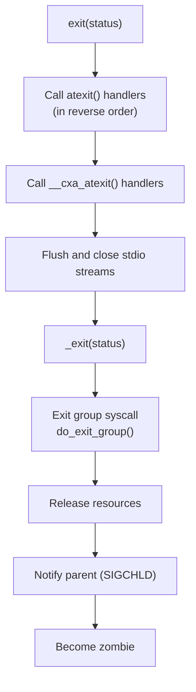
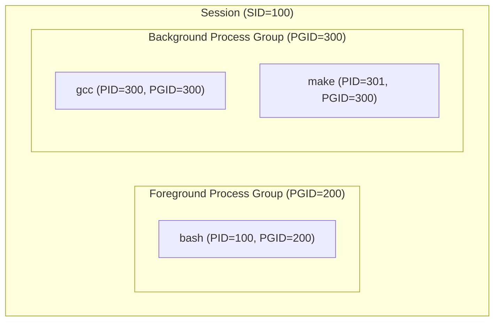
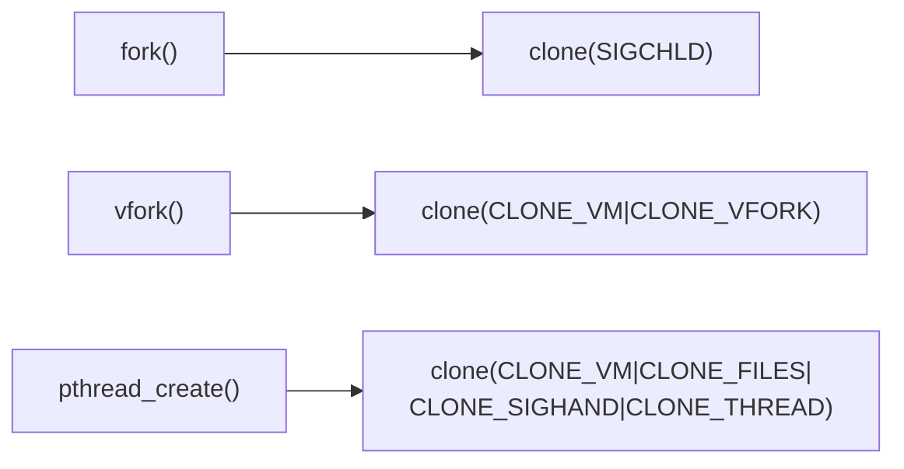

# Process Control

## Introduction

Process management is at the heart of Unix/Linux system programming. Every running program is a process, and the kernel provides a small set of powerful primitives—`fork`, `execve`, `wait`, `exit`—that together form the process lifecycle. These primitives enable shells, service managers, container runtimes, and virtually every multi-process application on Linux.

This chapter covers the complete process lifecycle: creation, execution, waiting, and termination. We'll examine zombie processes, daemon creation, and the nuances that make process control on Linux both elegant and tricky.

## The Process Lifecycle





## fork() — Creating a Process

```c
#include <unistd.h>
#include <sys/types.h>

pid_t fork(void);
```

`fork()` creates a new process by duplicating the calling process. The new process (child) is an almost exact copy of the parent.

### Return Value

- **In the parent**: Returns the child's PID (> 0)
- **In the child**: Returns 0
- **On error**: Returns -1 (no child created)

```c
#include <stdio.h>
#include <unistd.h>
#include <sys/types.h>

int main(void)
{
    pid_t pid = fork();

    if (pid == -1) {
        perror("fork");
        return 1;
    }

    if (pid == 0) {
        /* Child process */
        printf("Child: PID=%d, PPID=%d\n", getpid(), getppid());
    } else {
        /* Parent process */
        printf("Parent: my PID=%d, child PID=%d\n", getpid(), pid);
    }

    printf("Both processes execute this line\n");
    return 0;
}
```

```
$ ./fork_demo
Parent: my PID=1234, child PID=1235
Both processes execute this line
Child: PID=1235, PPID=1234
Both processes execute this line
```

### What is (and isn't) Shared After fork()

| Property | Shared? | Notes |
|----------|---------|-------|
| Code (text) | Yes (read-only) | Same physical pages |
| Stack | No | Separate copies |
| Heap | No | Copy-on-write (COW) |
| File descriptors | Yes | Same open file table entries |
| File offsets | Yes | Shared `struct file` |
| Signal handlers | Yes | Same handler table |
| Signal masks | No | Inherited at fork time |
| PID | No | Different PIDs |
| Memory mappings | No (COW) | `MAP_SHARED` mappings are shared |

### Copy-on-Write (COW)

Linux optimizes `fork()` with COW: parent and child initially share the same physical pages, marked read-only. Pages are copied only when either process writes to them:



### fork() Variants

```c
#include <sched.h>
#include <sys/wait.h>

/* More control over what is shared */
pid_t clone(int (*fn)(void *), void *stack, int flags, void *arg, ...);

/* Linux-specific: vfork — parent blocks until child exec()s or _exit() */
pid_t vfork(void);

/* posix_spawn — fork+exec in one call (more efficient on some systems) */
int posix_spawn(pid_t *pid, const char *path,
                const posix_spawn_file_actions_t *file_actions,
                const posix_spawnattr_t *attrp,
                char *const argv[], char *const envp[]);
```

**`vfork()` caveats:**
- Child shares parent's memory and stack until `execve()` or `_exit()`
- Parent is suspended until child calls `execve()` or `_exit()`
- Child must NOT modify any variables or call any function except `execve()` or `_exit()`
- Rarely needed today—`posix_spawn()` is preferred

## execve() — Replacing the Process Image

```c
#include <unistd.h>

int execve(const char *pathname, char *const argv[], char *const envp[]);
```

`execve()` replaces the current process image with a new program. On success, it **never returns**. The PID remains the same.

### The exec Family

```c
/* All paths to execve(): */
int execl(const char *path, const char *arg0, ... /* NULL */);
int execlp(const char *file, const char *arg0, ... /* NULL */);
int execle(const char *path, const char *arg0, ... /* NULL, char *const envp[] */);
int execv(const char *path, char *const argv[]);
int execvp(const char *file, char *const argv[]);
int execvpe(const char *file, char *const argv[], char *const envp[]);
int fexecve(int fd, char *const argv[], char *const envp[]);
```

| Function | Searches PATH? | Environment |
|----------|---------------|-------------|
| `execl` | No | Inherited |
| `execlp` | **Yes** | Inherited |
| `execle` | No | **Specified** |
| `execv` | No | Inherited |
| `execvp` | **Yes** | Inherited |
| `fexecve` | No (fd-based) | **Specified** |

```c
#include <unistd.h>
#include <stdio.h>

int main(void)
{
    char *argv[] = { "ls", "-la", "/tmp", NULL };
    char *envp[] = { "PATH=/bin:/usr/bin", NULL };

    /* Direct execution — no PATH search */
    execve("/bin/ls", argv, envp);

    /* If we reach here, execve failed */
    perror("execve");
    return 1;
}
```

### What Survives execve()

| Preserved | Lost |
|-----------|------|
| PID, PPID | Entire address space |
| Open fd table | Heap, stack |
| Process group | Signal handlers (default restored) |
| Session ID | Memory mappings |
| Working directory | Thread state |
| Resource limits | Accounting data |
| `O_CLOEXEC` fds **closed** | Non-`O_CLOEXEC` fds kept |

### The ELF Interpreter and execve()

When `execve()` loads an ELF binary:



## wait() and waitpid() — Collecting Child Status

```c
#include <sys/wait.h>

pid_t wait(int *wstatus);
pid_t waitpid(pid_t pid, int *wstatus, int options);
int waitid(idtype_t idtype, id_t id, siginfo_t *infop, int options);
```

### wait()

Blocks until any child exits:

```c
#include <sys/wait.h>
#include <stdio.h>
#include <unistd.h>
#include <stdlib.h>

int main(void)
{
    pid_t pid = fork();

    if (pid == 0) {
        /* Child */
        printf("Child working...\n");
        sleep(2);
        exit(42);
    }

    /* Parent */
    int status;
    pid_t child = wait(&status);
    printf("Child %d exited\n", child);

    if (WIFEXITED(status))
        printf("Exit status: %d\n", WEXITSTATUS(status));
    else if (WIFSIGNALED(status))
        printf("Killed by signal: %d\n", WTERMSIG(status));

    return 0;
}
```

```
$ ./wait_demo
Child working...
Child 1235 exited
Exit status: 42
```

### waitpid() — Precise Control

```c
/* Wait for specific child */
waitpid(child_pid, &status, 0);

/* Wait for any child in same process group */
waitpid(0, &status, 0);

/* Wait for any child in specific process group */
waitpid(-pgid, &status, 0);

/* Non-blocking — returns 0 if no child has exited */
waitpid(child_pid, &status, WNOHANG);

/* Wait for stopped children too */
waitpid(child_pid, &status, WUNTRACED);

/* Wait for continued children */
waitpid(child_pid, &status, WCONTINUED);
```

### Status Macros

```c
WIFEXITED(status)      /* True if child exited normally */
WEXITSTATUS(status)    /* Exit code (only if WIFEXITED) */
WIFSIGNALED(status)    /* True if killed by signal */
WTERMSIG(status)       /* Signal number (only if WIFSIGNALED) */
WCOREDUMP(status)      /* True if core dump was created */
WIFSTOPPED(status)     /* True if child is stopped */
WSTOPSIG(status)       /* Signal that stopped the child */
WIFCONTINUED(status)   /* True if child was continued */
```

## Zombie Processes

A **zombie** is a terminated process whose exit status has not yet been collected by its parent. The kernel keeps the process entry (`task_struct`) alive until the parent calls `wait()`.

### Why Zombies Exist

The zombie state ensures:
1. The parent can learn the child's exit status
2. The kernel can report resource usage (CPU time, etc.)
3. The PID is not reused until the parent acknowledges termination

### The Problem

If the parent never calls `wait()`, zombies accumulate:

```bash
# Count zombies on the system
$ ps aux | awk '$8=="Z" {count++} END {print count " zombies"}'
3 zombies

# List zombies
$ ps -eo pid,ppid,stat,cmd | awk '$3 ~ /Z/'
  4567  1234 Z [defunct] <defunct>
```

### Solutions

**1. Parent calls wait():**
```c
while (waitpid(-1, NULL, WNOHANG) > 0)
    ;  /* Reap all zombies */
```

**2. SIGCHLD handler:**
```c
#include <signal.h>
#include <sys/wait.h>

void sigchld_handler(int sig)
{
    /* Reap all terminated children */
    while (waitpid(-1, NULL, WNOHANG) > 0)
        ;
}

int main(void)
{
    struct sigaction sa = {
        .sa_handler = sigchld_handler,
        .sa_flags = SA_RESTART | SA_NOCLDSTOP
    };
    sigemptyset(&sa.sa_mask);
    sigaction(SIGCHLD, &sa, NULL);

    /* Children will be reaped automatically */
    if (fork() == 0) exit(0);

    /* Parent continues working */
    pause();
    return 0;
}
```

**3. Double fork (for long-running parents):**
```c
pid_t pid = fork();
if (pid == 0) {
    /* First child */
    pid_t grandchild = fork();
    if (grandchild == 0) {
        /* Grandchild — does the actual work */
        do_work();
        exit(0);
    }
    /* First child exits immediately */
    exit(0);
}
/* Parent waits for first child (quick) */
waitpid(pid, NULL, 0);
/* Grandchild is orphaned → adopted by init, which reaps it */
```

### Orphan Processes

When a parent exits before its child, the child becomes an **orphan** and is re-parented to PID 1 (init/systemd):

```bash
# See the reaper
$ ps -o pid,ppid,cmd -p $PID
  PID  PPID CMD
 4567     1 ./orphaned_child
```

Modern Linux supports `PR_SET_CHILD_SUBREAPER` (see `prctl(2)`) to make a process other than PID 1 the reaper of orphaned descendants.

## exit() and _exit()

```c
#include <stdlib.h>
void exit(int status);      /* C library: flushes stdio, calls atexit handlers */

#include <unistd.h>
void _exit(int status);     /* Kernel: immediate termination */

/* Exit status range: 0-255 (only lower 8 bits) */
```

### What exit() Does



```c
#include <stdlib.h>
#include <stdio.h>

void cleanup1(void) { printf("cleanup1\n"); }
void cleanup2(void) { printf("cleanup2\n"); }

int main(void)
{
    atexit(cleanup1);
    atexit(cleanup2);

    printf("main doing work\n");
    exit(0);

    /* Output:
     * main doing work
     * cleanup2
     * cleanup1
     */
}
```

**Important**: In a `fork()`'d child, call `_exit()` (not `exit()`) to avoid flushing the parent's stdio buffers twice.

## Daemon Creation

A **daemon** is a background process that runs without a controlling terminal. The classic daemon creation recipe:

```c
#include <sys/stat.h>
#include <fcntl.h>
#include <unistd.h>
#include <stdlib.h>
#include <signal.h>
#include <syslog.h>

int daemonize(void)
{
    pid_t pid;

    /* Step 1: Fork and let parent exit */
    pid = fork();
    if (pid < 0) return -1;
    if (pid > 0) _exit(0);  /* Parent exits */

    /* Step 2: Create new session (detach from terminal) */
    if (setsid() < 0) return -1;

    /* Step 3: Fork again (prevent terminal re-acquisition) */
    pid = fork();
    if (pid < 0) return -1;
    if (pid > 0) _exit(0);

    /* Step 4: Clear file mode mask */
    umask(0);

    /* Step 5: Change to root (or appropriate directory) */
    if (chdir("/") < 0) return -1;

    /* Step 6: Close all open file descriptors */
    for (int fd = sysconf(_SC_OPEN_MAX); fd >= 0; fd--)
        close(fd);

    /* Step 7: Redirect stdin/stdout/stderr to /dev/null */
    int devnull = open("/dev/null", O_RDWR);
    if (devnull >= 0) {
        dup2(devnull, STDIN_FILENO);
        dup2(devnull, STDOUT_FILENO);
        dup2(devnull, STDERR_FILENO);
        if (devnull > STDERR_FILENO)
            close(devnull);
    }

    /* Step 8: Open syslog */
    openlog("mydaemon", LOG_PID, LOG_DAEMON);
    syslog(LOG_INFO, "Daemon started");

    return 0;
}

int main(void)
{
    if (daemonize() < 0)
        return 1;

    /* Daemon main loop */
    while (1) {
        /* Do work */
        sleep(60);
    }

    return 0;
}
```

```mermaid
graph TD
    A["Original Process"] -->|fork #1| B["Child 1"]
    A -->|exit| DEAD1["Parent exits"]
    B -->|setsid()| C["Session leader<br/>(no controlling terminal)"]
    C -->|fork #2| D["Child 2 (daemon)"]
    C -->|exit| DEAD2["Child 1 exits"]
    D --> E["umask(0)"]
    E --> F["chdir('/')"]
    F --> G["Close all fds"]
    G --> H["Redirect 0,1,2 → /dev/null"]
    H --> I["Main daemon loop"]
```

**Why double fork?**
The first `fork()` + `setsid()` creates a new session. The second `fork()` ensures the daemon is not the session leader, preventing it from accidentally acquiring a controlling terminal by opening a terminal device.

## System Calls: fork + execve Pattern

The canonical process creation pattern in Unix:

```c
#include <unistd.h>
#include <sys/wait.h>
#include <stdio.h>
#include <stdlib.h>

int spawn(const char *program, char **argv)
{
    pid_t pid = fork();

    if (pid == -1) {
        perror("fork");
        return -1;
    }

    if (pid == 0) {
        /* Child: replace with new program */
        execvp(program, argv);
        /* execvp only returns on error */
        perror("execvp");
        _exit(127);
    }

    /* Parent: wait for child */
    int status;
    if (waitpid(pid, &status, 0) == -1) {
        perror("waitpid");
        return -1;
    }

    if (WIFEXITED(status))
        return WEXITSTATUS(status);
    return -1;
}

int main(void)
{
    char *argv[] = { "ls", "-la", "/tmp", NULL };
    int ret = spawn("ls", argv);
    printf("ls exited with status %d\n", ret);
    return 0;
}
```

## Process Groups and Sessions

```c
#include <unistd.h>

/* Process group */
pid_t getpgrp(void);
pid_t getpgid(pid_t pid);
int setpgid(pid_t pid, pid_t pgid);

/* Session */
pid_t getsid(pid_t pid);
pid_t setsid(void);
```



## clone() — The Low-Level Primitive

On Linux, `fork()`, `vfork()`, and `pthread_create()` are all implemented using `clone()`:

```c
#define _GNU_SOURCE
#include <sched.h>

int clone(int (*fn)(void *), void *stack, int flags, void *arg, ...);
```

| Flag | Effect |
|------|--------|
| `CLONE_VM` | Share address space (threads) |
| `CLONE_FS` | Share filesystem info |
| `CLONE_FILES` | Share file descriptor table |
| `CLONE_SIGHAND` | Share signal handlers |
| `CLONE_THREAD` | Same thread group |
| `CLONE_NEWPID` | New PID namespace (containers) |
| `CLONE_NEWNS` | New mount namespace |
| `CLONE_NEWNET` | New network namespace |
| `CLONE_NEWUSER` | New user namespace |



## References

- [fork(2) — Linux manual page](https://man7.org/linux/man-pages/man2/fork.2.html)
- [execve(2) — Linux manual page](https://man7.org/linux/man-pages/man2/execve.2.html)
- [wait(2) — Linux manual page](https://man7.org/linux/man-pages/man2/wait.2.html)
- [exit(3) — Linux manual page](https://man7.org/linux/man-pages/man3/exit.3.html)
- [clone(2) — Linux manual page](https://man7.org/linux/man-pages/man2/clone.2.html)
- [daemon(7) — Linux manual page](https://man7.org/linux/man-pages/man7/daemon.7.html)
- [The Linux Programming Interface, Chapters 24-27](https://man7.org/tlpi/)

## Related Topics

- [System Calls](./syscalls.md) — The mechanism behind all process control
- [Signals](./signals.md) — `SIGCHLD`, signal handling during fork/exec
- [Threads](./threads.md) — `pthread_create` uses `clone()` internally
- [File I/O](./file-io.md) — File descriptor inheritance across fork/exec
- [IPC](./ipc.md) — Communication between processes
- [ELF Format](./elf.md) — What `execve()` actually loads
