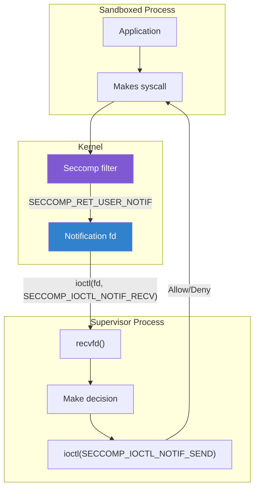

# Seccomp Userspace Programming Guide

## Introduction

Seccomp (Secure Computing Mode) is a Linux kernel feature that restricts which system calls a process can invoke. While the [security overview](../security/seccomp.md) covers seccomp's architecture and security implications, this page is a **practical programming guide** for application developers who want to sandbox their code using seccomp.

Seccomp is used by browsers (Chrome, Firefox), container runtimes (Docker, runc), systemd services, and many other privileged applications. It provides defense-in-depth: even if an attacker achieves code execution, seccomp can block dangerous syscalls.

## Quick Start

### Minimal Example: Restrict to Safe Syscalls

```c
#include <stdio.h>
#include <stdlib.h>
#include <unistd.h>
#include <seccomp.h>
#include <errno.h>

int main(void)
{
    /* Initialize the seccomp filter context
     * SCMP_ACT_KILL = kill process on violation */
    scmp_filter_ctx ctx = seccomp_init(SCMP_ACT_KILL);
    if (ctx == NULL) {
        fprintf(stderr, "Failed to init seccomp\n");
        return 1;
    }

    /* Allow basic syscalls needed to run */
    seccomp_rule_add(ctx, SCMP_ACT_ALLOW, SCMP_SYS(read), 0);
    seccomp_rule_add(ctx, SCMP_ACT_ALLOW, SCMP_SYS(write), 0);
    seccomp_rule_add(ctx, SCMP_ACT_ALLOW, SCMP_SYS(exit), 0);
    seccomp_rule_add(ctx, SCMP_ACT_ALLOW, SCMP_SYS(exit_group), 0);
    seccomp_rule_add(ctx, SCMP_ACT_ALLOW, SCMP_SYS(brk), 0);
    seccomp_rule_add(ctx, SCMP_ACT_ALLOW, SCMP_SYS(rt_sigreturn), 0);

    /* Load and activate the filter */
    if (seccomp_load(ctx) < 0) {
        fprintf(stderr, "Failed to load seccomp filter\n");
        seccomp_release(ctx);
        return 1;
    }

    /* From this point, only the above syscalls are allowed.
     * Any other syscall (e.g., open, socket, execve) will
     * cause the process to be killed with SIGSYS. */

    printf("Seccomp filter active!\n");
    write(STDOUT_FILENO, "write() works!\n", 15);

    seccomp_release(ctx);
    return 0;
}
```

```bash
gcc -o seccomp_basic seccomp_basic.c -lseccomp
./seccomp_basic
# Output:
# Seccomp filter active!
# write() works!
```

## libseccomp API

### Installation

```bash
# Debian/Ubuntu
sudo apt install libseccomp-dev

# Fedora/RHEL
sudo dnf install libseccomp-devel

# Arch
sudo pacman -S libseccomp
```

### Core Functions

| Function | Description |
|----------|-------------|
| `seccomp_init()` | Create a new filter context |
| `seccomp_rule_add()` | Add a rule (allow/deny a syscall) |
| `seccomp_rule_add_exact()` | Add rule with exact argument matching |
| `seccomp_load()` | Load the filter into the kernel |
| `seccomp_release()` | Free the filter context |
| `seccomp_export_pfc()` | Export filter as PFC (human-readable) |
| `seccomp_export_bpf()` | Export filter as BPF bytecode |

### Filter Actions

```c
/* Default actions for seccomp_init() */
SCMP_ACT_KILL            /* Kill process (SIGSYS) */
SCMP_ACT_KILL_PROCESS    /* Kill entire process (Linux 4.14+) */
SCMP_ACT_TRAP            /* Send SIGSYS signal */
SCMP_ACT_ERRNO(EPERM)    /* Return -EPERM from syscall */
SCMP_ACT_TRACE(0)        /* Notify ptrace tracer */
SCMP_ACT_LOG             /* Allow but log to audit */
SCMP_ACT_ALLOW           /* Allow syscall */
```

### Argument Filtering

```c
/* Allow open() only for reading (flags == O_RDONLY) */
seccomp_rule_add(ctx, SCMP_ACT_ALLOW, SCMP_SYS(open), 1,
    SCMP_A1(SCMP_CMP_EQ, O_RDONLY));

/* Allow ioctl() only for specific fd and request */
seccomp_rule_add(ctx, SCMP_ACT_ALLOW, SCMP_SYS(ioctl), 2,
    SCMP_A0(SCMP_CMP_EQ, STDOUT_FILENO),
    SCMP_A1(SCMP_CMP_EQ, TIOCGWINSZ));

/* Allow socket() only for AF_INET and SOCK_STREAM */
seccomp_rule_add(ctx, SCMP_ACT_ALLOW, SCMP_SYS(socket), 2,
    SCMP_A0(SCMP_CMP_EQ, AF_INET),
    SCMP_A1(SCMP_CMP_EQ, SOCK_STREAM));

/* Comparison operators */
SCMP_CMP_EQ          /* Equal */
SCMP_CMP_NE          /* Not equal */
SCMP_CMP_LT          /* Less than */
SCMP_CMP_LE          /* Less or equal */
SCMP_CMP_GT          /* Greater than */
SCMP_CMP_GE          /* Greater or equal */
SCMP_CMP_MASKED_EQ   /* Masked equality (bitwise) */

/* Argument positions */
SCMP_A0(cmp, val)   /* First argument (rdi on x86_64) */
SCMP_A1(cmp, val)   /* Second argument (rsi) */
SCMP_A2(cmp, val)   /* Third argument (rdx) */
SCMP_A3(cmp, val)   /* Fourth argument (r10) */
SCMP_A4(cmp, val)   /* Fifth argument (r8) */
SCMP_A5(cmp, val)   /* Sixth argument (r9) */
```

## Practical Examples

### Example 1: Web Server Sandbox

A web server needs file I/O, networking, and basic memory management, but shouldn't be able to load kernel modules, reboot, or mount filesystems:

```c
#include <seccomp.h>
#include <sys/socket.h>
#include <fcntl.h>

int sandbox_web_server(void)
{
    scmp_filter_ctx ctx;

    /* Default: log violations but allow (for development) */
    ctx = seccomp_init(SCMP_ACT_LOG);
    if (!ctx)
        return -1;

    /* File I/O */
    seccomp_rule_add(ctx, SCMP_ACT_ALLOW, SCMP_SYS(open), 0);
    seccomp_rule_add(ctx, SCMP_ACT_ALLOW, SCMP_SYS(openat), 0);
    seccomp_rule_add(ctx, SCMP_ACT_ALLOW, SCMP_SYS(close), 0);
    seccomp_rule_add(ctx, SCMP_ACT_ALLOW, SCMP_SYS(read), 0);
    seccomp_rule_add(ctx, SCMP_ACT_ALLOW, SCMP_SYS(write), 0);
    seccomp_rule_add(ctx, SCMP_ACT_ALLOW, SCMP_SYS(readv), 0);
    seccomp_rule_add(ctx, SCMP_ACT_ALLOW, SCMP_SYS(writev), 0);
    seccomp_rule_add(ctx, SCMP_ACT_ALLOW, SCMP_SYS(lseek), 0);
    seccomp_rule_add(ctx, SCMP_ACT_ALLOW, SCMP_SYS(fstat), 0);
    seccomp_rule_add(ctx, SCMP_ACT_ALLOW, SCMP_SYS(newfstatat), 0);
    seccomp_rule_add(ctx, SCMP_ACT_ALLOW, SCMP_SYS(access), 0);
    seccomp_rule_add(ctx, SCMP_ACT_ALLOW, SCMP_SYS(faccessat), 0);

    /* Networking */
    seccomp_rule_add(ctx, SCMP_ACT_ALLOW, SCMP_SYS(socket), 0);
    seccomp_rule_add(ctx, SCMP_ACT_ALLOW, SCMP_SYS(bind), 0);
    seccomp_rule_add(ctx, SCMP_ACT_ALLOW, SCMP_SYS(listen), 0);
    seccomp_rule_add(ctx, SCMP_ACT_ALLOW, SCMP_SYS(accept), 0);
    seccomp_rule_add(ctx, SCMP_ACT_ALLOW, SCMP_SYS(accept4), 0);
    seccomp_rule_add(ctx, SCMP_ACT_ALLOW, SCMP_SYS(connect), 0);
    seccomp_rule_add(ctx, SCMP_ACT_ALLOW, SCMP_SYS(sendto), 0);
    seccomp_rule_add(ctx, SCMP_ACT_ALLOW, SCMP_SYS(recvfrom), 0);
    seccomp_rule_add(ctx, SCMP_ACT_ALLOW, SCMP_SYS(sendmsg), 0);
    seccomp_rule_add(ctx, SCMP_ACT_ALLOW, SCMP_SYS(recvmsg), 0);
    seccomp_rule_add(ctx, SCMP_ACT_ALLOW, SCMP_SYS(shutdown), 0);
    seccomp_rule_add(ctx, SCMP_ACT_ALLOW, SCMP_SYS(setsockopt), 0);
    seccomp_rule_add(ctx, SCMP_ACT_ALLOW, SCMP_SYS(getsockopt), 0);
    seccomp_rule_add(ctx, SCMP_ACT_ALLOW, SCMP_SYS(epoll_create1), 0);
    seccomp_rule_add(ctx, SCMP_ACT_ALLOW, SCMP_SYS(epoll_ctl), 0);
    seccomp_rule_add(ctx, SCMP_ACT_ALLOW, SCMP_SYS(epoll_wait), 0);

    /* Memory management */
    seccomp_rule_add(ctx, SCMP_ACT_ALLOW, SCMP_SYS(mmap), 0);
    seccomp_rule_add(ctx, SCMP_ACT_ALLOW, SCMP_SYS(munmap), 0);
    seccomp_rule_add(ctx, SCMP_ACT_ALLOW, SCMP_SYS(mprotect), 0);
    seccomp_rule_add(ctx, SCMP_ACT_ALLOW, SCMP_SYS(brk), 0);
    seccomp_rule_add(ctx, SCMP_ACT_ALLOW, SCMP_SYS(madvise), 0);
    seccomp_rule_add(ctx, SCMP_ACT_ALLOW, SCMP_SYS(mremap), 0);

    /* Process management */
    seccomp_rule_add(ctx, SCMP_ACT_ALLOW, SCMP_SYS(exit), 0);
    seccomp_rule_add(ctx, SCMP_ACT_ALLOW, SCMP_SYS(exit_group), 0);
    seccomp_rule_add(ctx, SCMP_ACT_ALLOW, SCMP_SYS(futex), 0);
    seccomp_rule_add(ctx, SCMP_ACT_ALLOW, SCMP_SYS(nanosleep), 0);
    seccomp_rule_add(ctx, SCMP_ACT_ALLOW, SCMP_SYS(getpid), 0);
    seccomp_rule_add(ctx, SCMP_ACT_ALLOW, SCMP_SYS(gettid), 0);

    /* Signals */
    seccomp_rule_add(ctx, SCMP_ACT_ALLOW, SCMP_SYS(rt_sigaction), 0);
    seccomp_rule_add(ctx, SCMP_ACT_ALLOW, SCMP_SYS(rt_sigprocmask), 0);
    seccomp_rule_add(ctx, SCMP_ACT_ALLOW, SCMP_SYS(rt_sigreturn), 0);

    /* Time */
    seccomp_rule_add(ctx, SCMP_ACT_ALLOW, SCMP_SYS(clock_gettime), 0);
    seccomp_rule_add(ctx, SCMP_ACT_ALLOW, SCMP_SYS(gettimeofday), 0);

    int ret = seccomp_load(ctx);
    seccomp_release(ctx);
    return ret;
}
```

### Example 2: Restrict File Access (Read-Only)

```c
int sandbox_read_only_files(void)
{
    scmp_filter_ctx ctx = seccomp_init(SCMP_ACT_KILL);
    if (!ctx)
        return -1;

    /* Allow read() and write() to stdout/stderr only */
    seccomp_rule_add(ctx, SCMP_ACT_ALLOW, SCMP_SYS(write), 1,
        SCMP_A0(SCMP_CMP_EQ, STDOUT_FILENO));
    seccomp_rule_add(ctx, SCMP_ACT_ALLOW, SCMP_SYS(write), 1,
        SCMP_A0(SCMP_CMP_EQ, STDERR_FILENO));
    seccomp_rule_add(ctx, SCMP_ACT_ALLOW, SCMP_SYS(read), 1,
        SCMP_A0(SCMP_CMP_EQ, STDIN_FILENO));

    /* Allow open() only for reading (O_RDONLY == 0) */
    seccomp_rule_add(ctx, SCMP_ACT_ALLOW, SCMP_SYS(open), 1,
        SCMP_A1(SCMP_CMP_MASKED_EQ, O_ACCMODE, O_RDONLY));

    /* openat() — allow only AT_FDCWD with O_RDONLY */
    seccomp_rule_add(ctx, SCMP_ACT_ALLOW, SCMP_SYS(openat), 2,
        SCMP_A0(SCMP_CMP_EQ, AT_FDCWD),
        SCMP_A2(SCMP_CMP_MASKED_EQ, O_ACCMODE, O_RDONLY));

    seccomp_rule_add(ctx, SCMP_ACT_ALLOW, SCMP_SYS(close), 0);
    seccomp_rule_add(ctx, SCMP_ACT_ALLOW, SCMP_SYS(fstat), 0);
    seccomp_rule_add(ctx, SCMP_ACT_ALLOW, SCMP_SYS(exit), 0);
    seccomp_rule_add(ctx, SCMP_ACT_ALLOW, SCMP_SYS(exit_group), 0);
    seccomp_rule_add(ctx, SCMP_ACT_ALLOW, SCMP_SYS(brk), 0);
    seccomp_rule_add(ctx, SCMP_ACT_ALLOW, SCMP_SYS(rt_sigreturn), 0);

    return seccomp_load(ctx);
}
```

### Example 3: Restrict Network to TCP Only

```c
int sandbox_tcp_only(void)
{
    scmp_filter_ctx ctx = seccomp_init(SCMP_ACT_ERRNO(EACCES));
    if (!ctx)
        return -1;

    /* Allow socket() only for TCP (AF_INET + SOCK_STREAM) */
    seccomp_rule_add(ctx, SCMP_ACT_ALLOW, SCMP_SYS(socket), 2,
        SCMP_A0(SCMP_CMP_EQ, AF_INET),
        SCMP_A1(SCMP_CMP_EQ, SOCK_STREAM));

    /* Also allow AF_INET6 + SOCK_STREAM */
    seccomp_rule_add(ctx, SCMP_ACT_ALLOW, SCMP_SYS(socket), 2,
        SCMP_A0(SCMP_CMP_EQ, AF_INET6),
        SCMP_A1(SCMP_CMP_EQ, SOCK_STREAM));

    /* Allow socket() for AF_UNIX (local IPC) */
    seccomp_rule_add(ctx, SCMP_ACT_ALLOW, SCMP_SYS(socket), 1,
        SCMP_A0(SCMP_CMP_EQ, AF_UNIX));

    /* Block UDP — socket(AF_INET, SOCK_DGRAM) will return EACCES */

    /* ... allow other needed syscalls ... */

    return seccomp_load(ctx);
}
```

## Seccomp Notification (SECCOMP_RET_USER_NOTIF)

Linux 5.0+ allows a **supervisor process** to handle syscall decisions in userspace. This is used by container runtimes (e.g., runc) for safe file access across mount namespaces.

### Architecture



### Supervisor Process Example

```c
#include <linux/seccomp.h>
#include <sys/ioctl.h>
#include <sys/prctl.h>
#include <linux/filter.h>
#include <linux/audit.h>
#include <stdio.h>
#include <stdlib.h>
#include <unistd.h>
#include <fcntl.h>
#include <errno.h>

/* Set up seccomp filter with USER_NOTIF for openat */
int setup_notify_filter(void)
{
    struct sock_filter filter[] = {
        BPF_STMT(BPF_LD | BPF_W | BPF_ABS,
                 offsetof(struct seccomp_data, nr)),
        BPF_JUMP(BPF_JMP | BPF_JEQ | BPF_K, __NR_openat, 0, 1),
        BPF_STMT(BPF_RET | BPF_K, SECCOMP_RET_USER_NOTIF),
        BPF_JUMP(BPF_JMP | BPF_JEQ | BPF_K, __NR_open, 0, 1),
        BPF_STMT(BPF_RET | BPF_K, SECCOMP_RET_USER_NOTIF),
        BPF_STMT(BPF_RET | BPF_K, SECCOMP_RET_ALLOW),
    };

    struct sock_fprog prog = {
        .len = sizeof(filter) / sizeof(filter[0]),
        .filter = filter,
    };

    if (prctl(PR_SET_NO_NEW_PRIVS, 1, 0, 0, 0))
        return -1;

    if (prctl(PR_SET_SECCOMP, SECCOMP_MODE_FILTER, &prog))
        return -1;

    return 0;
}

/* Supervisor: receive and handle notifications */
void supervisor_loop(int notify_fd)
{
    while (1) {
        struct seccomp_notif *req = NULL;
        struct seccomp_notif_resp resp = {};
        struct seccomp_notif_sizes sizes;

        seccomp_notif_sizes(&sizes);
        req = malloc(sizes.seccomp_notif);

        if (ioctl(notify_fd, SECCOMP_IOCTL_NOTIF_RECV, req) < 0) {
            if (errno == EINTR)
                continue;
            perror("RECV");
            break;
        }

        printf("Supervisor: pid %d syscall %d\n", req->pid, req->data.nr);

        resp.id = req->id;
        resp.error = 0;
        resp.val = 0;

        ioctl(notify_fd, SECCOMP_IOCTL_NOTIF_SEND, &resp);
        free(req);
    }
}
```

## Raw BPF Filters

For advanced use cases or when libseccomp isn't available:

```c
#include <linux/seccomp.h>
#include <linux/filter.h>
#include <linux/audit.h>
#include <sys/prctl.h>
#include <stddef.h>

int install_raw_bpf_filter(void)
{
    struct sock_filter filter[] = {
        /* Verify architecture is x86_64 */
        BPF_STMT(BPF_LD | BPF_W | BPF_ABS,
                 offsetof(struct seccomp_data, arch)),
        BPF_JUMP(BPF_JMP | BPF_JEQ | BPF_K, AUDIT_ARCH_X86_64, 1, 0),
        BPF_STMT(BPF_RET | BPF_K, SECCOMP_RET_KILL),

        /* Load syscall number */
        BPF_STMT(BPF_LD | BPF_W | BPF_ABS,
                 offsetof(struct seccomp_data, nr)),

        /* Allow read (0) */
        BPF_JUMP(BPF_JMP | BPF_JEQ | BPF_K, __NR_read, 0, 1),
        BPF_STMT(BPF_RET | BPF_K, SECCOMP_RET_ALLOW),

        /* Allow write (1) */
        BPF_JUMP(BPF_JMP | BPF_JEQ | BPF_K, __NR_write, 0, 1),
        BPF_STMT(BPF_RET | BPF_K, SECCOMP_RET_ALLOW),

        /* Allow exit (60) */
        BPF_JUMP(BPF_JMP | BPF_JEQ | BPF_K, __NR_exit, 0, 1),
        BPF_STMT(BPF_RET | BPF_K, SECCOMP_RET_ALLOW),

        /* Allow exit_group (231) */
        BPF_JUMP(BPF_JMP | BPF_JEQ | BPF_K, __NR_exit_group, 0, 1),
        BPF_STMT(BPF_RET | BPF_K, SECCOMP_RET_ALLOW),

        /* Allow brk (12) */
        BPF_JUMP(BPF_JMP | BPF_JEQ | BPF_K, __NR_brk, 0, 1),
        BPF_STMT(BPF_RET | BPF_K, SECCOMP_RET_ALLOW),

        /* Allow rt_sigreturn (15) */
        BPF_JUMP(BPF_JMP | BPF_JEQ | BPF_K, __NR_rt_sigreturn, 0, 1),
        BPF_STMT(BPF_RET | BPF_K, SECCOMP_RET_ALLOW),

        /* Kill everything else */
        BPF_STMT(BPF_RET | BPF_K, SECCOMP_RET_KILL),
    };

    struct sock_fprog prog = {
        .len = sizeof(filter) / sizeof(filter[0]),
        .filter = filter,
    };

    if (prctl(PR_SET_NO_NEW_PRIVS, 1, 0, 0, 0))
        return -1;

    if (prctl(PR_SET_SECCOMP, SECCOMP_MODE_FILTER, &prog))
        return -1;

    return 0;
}
```

### BPF Filter with Argument Checking

```c
/* Check open() flags argument for O_RDONLY only */
struct sock_filter filter_with_args[] = {
    BPF_STMT(BPF_LD | BPF_W | BPF_ABS,
             offsetof(struct seccomp_data, arch)),
    BPF_JUMP(BPF_JMP | BPF_JEQ | BPF_K, AUDIT_ARCH_X86_64, 1, 0),
    BPF_STMT(BPF_RET | BPF_K, SECCOMP_RET_KILL),

    BPF_STMT(BPF_LD | BPF_W | BPF_ABS,
             offsetof(struct seccomp_data, nr)),

    /* Check for openat syscall */
    BPF_JUMP(BPF_JMP | BPF_JEQ | BPF_K, __NR_openat, 1, 0),
    BPF_JUMP(BPF_JMP | BPF_JEQ | BPF_K, __NR_open, 0, 5),

    /* Load flags argument (arg2 for openat) */
    BPF_STMT(BPF_LD | BPF_W | BPF_ABS,
             offsetof(struct seccomp_data, args[2])),

    /* Mask out everything except O_ACCMODE */
    BPF_STMT(BPF_ALU | BPF_AND | BPF_K, 3),

    /* Check if O_RDONLY (0) */
    BPF_JUMP(BPF_JMP | BPF_JEQ | BPF_K, 0, 1, 0),
    BPF_STMT(BPF_RET | BPF_K, SECCOMP_RET_ERRNO | EACCES),

    /* Allow */
    BPF_STMT(BPF_RET | BPF_K, SECCOMP_RET_ALLOW),

    /* Default: allow all other syscalls */
    BPF_STMT(BPF_RET | BPF_K, SECCOMP_RET_ALLOW),
};
```

## Seccomp with Systemd

### Restricting systemd Services

```ini
# /etc/systemd/system/my-service.service
[Unit]
Description=Sandboxed Service

[Service]
ExecStart=/usr/bin/my-service

# SystemCallFilter= allows only listed syscalls
# ~ prefix means "deny these syscalls"
SystemCallFilter=read write open close mmap brk exit exit_group futex
SystemCallFilter=socket connect sendto recvfrom
SystemCallFilter=~mount umount reboot kexec_load init_module

# SystemCallArchitectures= restrict to native arch only
SystemCallArchitectures=native

# SystemCallErrorNumber= errno for denied syscalls
SystemCallErrorNumber=EPERM

# MemoryDenyWriteExecute= deny W+X memory
MemoryDenyWriteExecute=yes

# NoNewPrivileges= required for seccomp
NoNewPrivileges=yes
```

### Finding Required Syscalls

```bash
# Trace syscalls used by your application
strace -f -c -o syscalls.txt /usr/bin/my-service

# Or use audit
sudo auditctl -a always,exit -F arch=b64 -S all -F pid=$PID

# Or use perf
sudo perf trace -p $PID --duration 0
```

## Seccomp and Containers

### Docker Seccomp Profiles

```json
{
    "defaultAction": "SCMP_ACT_ERRNO",
    "defaultErrnoRet": 1,
    "archMap": [
        {
            "architecture": "SCMP_ARCH_X86_64",
            "subArchitectures": ["SCMP_ARCH_X86", "SCMP_ARCH_X32"]
        }
    ],
    "syscalls": [
        {
            "names": [
                "read", "write", "open", "close", "stat", "fstat",
                "lseek", "mmap", "mprotect", "munmap", "brk",
                "ioctl", "access", "pipe", "select", "sched_yield",
                "mremap", "dup", "dup2", "nanosleep", "getpid",
                "socket", "connect", "accept", "sendto", "recvfrom",
                "sendmsg", "recvmsg", "shutdown", "bind", "listen",
                "setsockopt", "getsockopt", "clone", "fork",
                "execve", "exit", "wait4", "kill", "uname",
                "fcntl", "flock", "fsync", "fdatasync",
                "getdents", "getcwd", "chdir", "rename", "mkdir",
                "rmdir", "link", "unlink", "readlink", "chmod",
                "fchmod", "chown", "fchown", "umask",
                "gettimeofday", "getuid", "getgid", "geteuid",
                "getegid", "getppid", "rt_sigaction",
                "rt_sigprocmask", "rt_sigreturn", "exit_group",
                "futex", "set_robust_list", "openat", "mkdirat",
                "newfstatat", "unlinkat", "renameat", "readlinkat",
                "fchmodat", "faccessat", "epoll_create", "epoll_ctl",
                "epoll_wait", "epoll_create1", "accept4", "epoll_pwait"
            ],
            "action": "SCMP_ACT_ALLOW"
        }
    ]
}
```

```bash
# Run container with custom seccomp profile
docker run --security-opt seccomp=custom-profile.json my-image

# Run with default profile
docker run my-image

# Run with no seccomp (insecure!)
docker run --security-opt seccomp=unconfined my-image
```

## Debugging Seccomp Filters

### Using strace

```bash
# See which syscalls are being made
strace -f ./my_program 2>&1 | head -20

# See seccomp violations (SIGSYS)
strace -f -e signal=SIGSYS ./my_program

# Trace specific syscalls
strace -e trace=open,openat,read,write ./my_program
```

### Using Audit

```bash
# Enable seccomp audit logging
sudo auditctl -a always,exit -F arch=b64 -S all

# Check audit log for violations
sudo ausearch -m SECCOMP

# Example output:
# type=SECCOMP msg=audit(...): auid=1000 uid=1000 gid=1000
#   ses=1 pid=1234 comm="my_program" exe="/usr/bin/my_program"
#   sig=31 arch=c000003e syscall=2 compat=0 ip=0x7f... code=0x0
```

### Using the Log Action

```c
/* Use SCMP_ACT_LOG to allow but log violations during development */
scmp_filter_ctx ctx = seccomp_init(SCMP_ACT_LOG);

/* This will log to audit but not kill the process */
seccomp_rule_add(ctx, SCMP_ACT_ALLOW, SCMP_SYS(read), 0);
seccomp_rule_add(ctx, SCMP_ACT_ALLOW, SCMP_SYS(write), 0);
```

### Exporting Filter for Inspection

```c
/* Export as human-readable PFC (Pseudo Filter Code) */
seccomp_export_pfc(ctx, STDOUT_FILENO);

/* Export as BPF bytecode (for kernel audit) */
seccomp_export_bpf(ctx, fd);
```

## Best Practices

### Development vs. Production

```c
#ifdef NDEBUG
/* Production: kill on violation */
#define SECCOMP_DEFAULT_ACTION SCMP_ACT_KILL_PROCESS
#else
/* Development: log violations */
#define SECCOMP_DEFAULT_ACTION SCMP_ACT_LOG
#endif

int apply_sandbox(void)
{
    scmp_filter_ctx ctx = seccomp_init(SECCOMP_DEFAULT_ACTION);
    if (!ctx) return -1;

    /* ... add rules ... */

    int ret = seccomp_load(ctx);
    seccomp_release(ctx);
    return ret;
}
```

### The no_new_privs Requirement

```c
#include <sys/prctl.h>

/* Required before loading seccomp filters for unprivileged processes */
if (prctl(PR_SET_NO_NEW_PRIVS, 1, 0, 0, 0) < 0) {
    perror("prctl(NO_NEW_PRIVS)");
    return -1;
}

/* This prevents:
 * - execve() from gaining capabilities
 * - setuid/setgid from changing privileges
 * - Any privilege escalation via suid binaries
 */
```

### Common Pitfalls

1. **Forgetting `rt_sigreturn`**: Without it, signal handlers can't return
2. **Forgetting `exit_group`**: Threads may not terminate cleanly
3. **Not allowing `futex`**: Most synchronization primitives use futex
4. **Forgetting `mmap`/`brk`**: Memory allocation will fail
5. **Architecture check in BPF**: Always verify `arch` to prevent 32-bit bypass
6. **Not setting `no_new_privs`**: seccomp_load() will fail without it

```c
/* Essential syscalls that are easy to forget */
seccomp_rule_add(ctx, SCMP_ACT_ALLOW, SCMP_SYS(rt_sigreturn), 0);
seccomp_rule_add(ctx, SCMP_ACT_ALLOW, SCMP_SYS(exit_group), 0);
seccomp_rule_add(ctx, SCMP_ACT_ALLOW, SCMP_SYS(futex), 0);
seccomp_rule_add(ctx, SCMP_ACT_ALLOW, SCMP_SYS(brk), 0);
seccomp_rule_add(ctx, SCMP_ACT_ALLOW, SCMP_SYS(mmap), 0);
seccomp_rule_add(ctx, SCMP_ACT_ALLOW, SCMP_SYS(munmap), 0);
```

## Source References

| Source | Path | Description |
|--------|------|-------------|
| Kernel | `kernel/seccomp.c` | Core seccomp implementation |
| BPF JIT | `kernel/seccomp.c` | BPF filter JIT compilation |
| Notification | `kernel/seccomp.c` | `SECCOMP_RET_USER_NOTIF` handler |
| libseccomp | `github.com/seccomp/libseccomp` | Userspace library |
| Header | `include/uapi/linux/seccomp.h` | Seccomp UAPI definitions |
| BPF filter | `include/linux/filter.h` | BPF instruction definitions |
| Systemd | `src/core/execute.c` | Systemd seccomp integration |

## See Also

- [Seccomp Security](../security/seccomp.md) — Security architecture overview
- [Seccomp BPF (Containers)](../containers/seccomp-bpf.md) — Container seccomp profiles
- [Seccomp Notify](../containers/seccomp-notify.md) — Notification-based seccomp
- [Capabilities](../security/capabilities.md) — Linux capabilities
- [System Calls](./syscalls.md) — System call interface
- [eBPF](../debugging/ebpf.md) — Extended BPF for tracing and filtering
