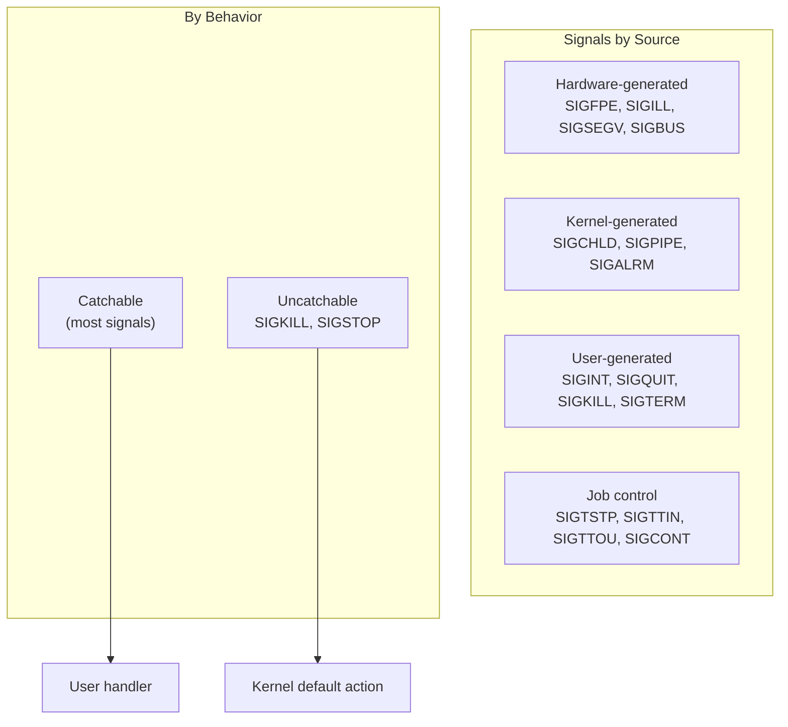
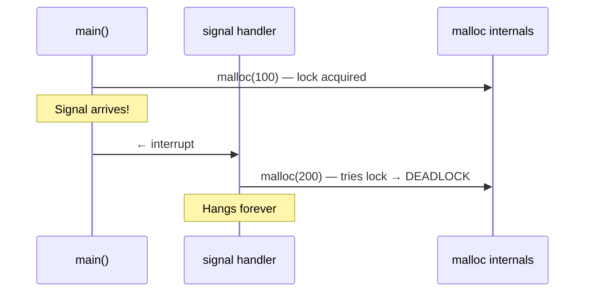

# Signals

## Introduction

Signals are a form of **asynchronous inter-process communication** in Unix/Linux. They notify a process that an event has occurred—a user pressed Ctrl+C, a child process exited, a timer expired, or an invalid memory access happened. Signals are the oldest IPC mechanism in Unix and remain fundamental to process management, job control, and error handling.

Unlike pipes or sockets, signals carry no data—only a signal number. This simplicity is both their strength (lightweight, always available) and their challenge (limited information, reentrancy constraints).

## Standard Signals

Linux defines 64 signals on most architectures (31 standard + 33 real-time):

| Signal | Number | Default | Description |
|--------|--------|---------|-------------|
| `SIGHUP` | 1 | Terminate | Terminal hangup / reload config |
| `SIGINT` | 2 | Terminate | Interrupt (Ctrl+C) |
| `SIGQUIT` | 3 | Core dump | Quit (Ctrl+\\) |
| `SIGILL` | 4 | Core dump | Illegal instruction |
| `SIGTRAP` | 5 | Core dump | Breakpoint / trace |
| `SIGABRT` | 6 | Core dump | Abort (from `abort()`) |
| `SIGBUS` | 7 | Core dump | Bus error (misaligned access) |
| `SIGFPE` | 8 | Core dump | Floating-point exception |
| `SIGKILL` | 9 | Terminate | **Cannot be caught or ignored** |
| `SIGUSR1` | 10 | Terminate | User-defined signal 1 |
| `SIGSEGV` | 11 | Core dump | Segmentation fault |
| `SIGUSR2` | 12 | Terminate | User-defined signal 2 |
| `SIGPIPE` | 13 | Terminate | Broken pipe |
| `SIGALRM` | 14 | Terminate | Timer expired |
| `SIGTERM` | 15 | Terminate | Graceful termination request |
| `SIGCHLD` | 17 | Ignore | Child status changed |
| `SIGCONT` | 18 | Continue | Continue if stopped |
| `SIGSTOP` | 19 | Stop | **Cannot be caught or ignored** |
| `SIGTSTP` | 20 | Stop | Terminal stop (Ctrl+Z) |
| `SIGTTIN` | 21 | Stop | Background read from terminal |
| `SIGTTOU` | 22 | Stop | Background write to terminal |

### Signal Categories



### Default Actions

| Action | Signals |
|--------|---------|
| **Terminate** | `SIGHUP`, `SIGINT`, `SIGKILL`, `SIGPIPE`, `SIGALRM`, `SIGTERM`, `SIGUSR1/2` |
| **Core dump** | `SIGQUIT`, `SIGILL`, `SIGTRAP`, `SIGABRT`, `SIGBUS`, `SIGFPE`, `SIGSEGV` |
| **Stop** | `SIGSTOP`, `SIGTSTP`, `SIGTTIN`, `SIGTTOU` |
| **Continue** | `SIGCONT` |
| **Ignore** | `SIGCHLD` (by default on some systems) |

## signal() — Simple Signal Handling

```c
#include <signal.h>

typedef void (*sighandler_t)(int);
sighandler_t signal(int signum, sighandler_t handler);
```

### Special Values for handler

- `SIG_DFL` — Restore default action
- `SIG_IGN` — Ignore the signal
- Function pointer — Call this function when signal arrives

```c
#include <stdio.h>
#include <signal.h>
#include <unistd.h>

volatile sig_atomic_t got_signal = 0;

void handler(int sig)
{
    got_signal = 1;
}

int main(void)
{
    signal(SIGINT, handler);
    signal(SIGTERM, handler);

    printf("PID: %d — send SIGINT or SIGTERM\n", getpid());

    while (!got_signal) {
        pause();  /* Sleep until a signal arrives */
    }

    printf("Caught signal, exiting gracefully\n");
    return 0;
}
```

**Problem with `signal()`:**
- Behavior varies across systems (System V vs BSD semantics)
- Signal handler may be reset to `SIG_DFL` after delivery (System V)
- Signal being handled is not automatically blocked during handler execution
- **Use `sigaction()` instead in production code.**

## sigaction() — Reliable Signal Handling

```c
#include <signal.h>

int sigaction(int signum, const struct sigaction *act,
              struct sigaction *oldact);

struct sigaction {
    void     (*sa_handler)(int);        /* SIG_DFL, SIG_IGN, or handler */
    void     (*sa_sigaction)(int, siginfo_t *, void *);  /* Extended handler */
    sigset_t   sa_mask;                 /* Signals to block during handler */
    int        sa_flags;                /* Flags */
    void     (*sa_restorer)(void);      /* Not for application use */
};
```

### Flags

| Flag | Meaning |
|------|---------|
| `SA_RESTART` | Restart interrupted system calls |
| `SA_SIGINFO` | Use `sa_sigaction` instead of `sa_handler` |
| `SA_NOCLDSTOP` | Don't notify on child stop (SIGCHLD) |
| `SA_NOCLDWAIT` | Don't create zombies (SIGCHLD) |
| `SA_NODEFER` | Don't block signal during its own handler |
| `SA_ONSTACK` | Use alternate signal stack |
| `SA_RESETHAND` | Reset handler to SIG_DFL after delivery |

### Complete Example with sigaction()

```c
#include <stdio.h>
#include <signal.h>
#include <unistd.h>
#include <string.h>
#include <errno.h>

volatile sig_atomic_t shutdown_requested = 0;

void handle_signal(int sig, siginfo_t *info, void *context)
{
    (void)context;

    /* Async-signal-safe operations only! */
    const char msg[] = "\nReceived signal, shutting down...\n";
    write(STDERR_FILENO, msg, sizeof(msg) - 1);

    /* Store sender PID (requires SA_SIGINFO) */
    char buf[64];
    int len = snprintf(buf, sizeof(buf), "Sent by PID: %d\n", info->si_pid);
    write(STDERR_FILENO, buf, len);

    shutdown_requested = 1;
}

int main(void)
{
    struct sigaction sa;
    memset(&sa, 0, sizeof(sa));

    sa.sa_sigaction = handle_signal;
    sa.sa_flags = SA_SIGINFO | SA_RESTART;
    sigemptyset(&sa.sa_mask);

    /* Block SIGTERM and SIGINT during handler */
    sigaddset(&sa.sa_mask, SIGTERM);
    sigaddset(&sa.sa_mask, SIGINT);

    if (sigaction(SIGINT, &sa, NULL) == -1) {
        perror("sigaction SIGINT");
        return 1;
    }
    if (sigaction(SIGTERM, &sa, NULL) == -1) {
        perror("sigaction SIGTERM");
        return 1;
    }

    printf("Server running (PID: %d). Press Ctrl+C to stop.\n", getpid());

    while (!shutdown_requested) {
        pause();
    }

    printf("Clean shutdown complete.\n");
    return 0;
}
```

### SA_SIGINFO: Extended Signal Information

When using `SA_SIGINFO`, the handler receives a `siginfo_t` structure:

```c
siginfo_t {
    int      si_signo;     /* Signal number */
    int      si_errno;     /* Errno value */
    int      si_code;      /* Signal code */
    pid_t    si_pid;       /* Sending process ID */
    uid_t    si_uid;       /* Real user ID of sender */
    int      si_status;    /* Exit value or signal */
    clock_t  si_utime;     /* User CPU time consumed */
    clock_t  si_stime;     /* System CPU time consumed */
    sigval_t si_value;     /* Signal value (for sigqueue) */
    void    *si_addr;      /* Faulting address (SIGSEGV, etc.) */
    int      si_band;      /* Band event (SIGPOLL) */
    int      si_fd;        /* File descriptor (SIGPOLL) */
};
```

```c
/* SIGSEGV handler that shows faulting address */
void segv_handler(int sig, siginfo_t *info, void *context)
{
    (void)context;
    char buf[128];
    int len = snprintf(buf, sizeof(buf),
        "SIGSEGV at address %p\n", info->si_addr);
    write(STDERR_FILENO, buf, len);
    _exit(1);
}
```

## Signal Masks

Each thread has a **signal mask** that determines which signals are currently blocked. Blocked signals are **pending** until unblocked.

```c
#include <signal.h>

int sigemptyset(sigset_t *set);           /* Clear all signals */
int sigfillset(sigset_t *set);            /* Set all signals */
int sigaddset(sigset_t *set, int signum); /* Add signal */
int sigdelset(sigset_t *set, int signum); /* Remove signal */
int sigismember(const sigset_t *set, int signum); /* Test membership */

/* Get/set current signal mask */
int sigprocmask(int how, const sigset_t *set, sigset_t *oldset);
```

### How Values for `how`

| Value | Action |
|-------|--------|
| `SIG_BLOCK` | Block signals in `set` (add to mask) |
| `SIG_UNBLOCK` | Unblock signals in `set` (remove from mask) |
| `SIG_SETMASK` | Set mask to exactly `set` |

### Critical Section Pattern

```c
sigset_t block_mask, old_mask;

/* Block SIGINT during critical section */
sigemptyset(&block_mask);
sigaddset(&block_mask, SIGINT);
sigprocmask(SIG_BLOCK, &block_mask, &old_mask);

/* === Critical section === */
/* SIGINT is queued but not delivered */
shared_data++;
/* === End critical section === */

/* Restore original mask (unblock SIGINT) */
sigprocmask(SIG_SETMASK, &old_mask, NULL);
/* Pending SIGINT is now delivered */
```

### Waiting for Signals with sigwait()

```c
#include <signal.h>

int sigwait(const sigset_t *set, int *sig);
```

`sigwait()` synchronously waits for a signal—useful for event loops that prefer polling over asynchronous handlers:

```c
#include <signal.h>
#include <stdio.h>
#include <unistd.h>

int main(void)
{
    sigset_t mask;
    int sig;

    /* Block SIGINT and SIGTERM */
    sigemptyset(&mask);
    sigaddset(&mask, SIGINT);
    sigaddset(&mask, SIGTERM);
    sigprocmask(SIG_BLOCK, &mask, NULL);

    printf("Waiting for signals (PID: %d)...\n", getpid());

    while (1) {
        /* Synchronous signal reception */
        sigwait(&mask, &sig);

        switch (sig) {
        case SIGINT:
            printf("Caught SIGINT\n");
            break;
        case SIGTERM:
            printf("Caught SIGTERM, exiting\n");
            return 0;
        }
    }
}
```

### sigtimedwait() — Wait with Timeout

```c
#include <signal.h>
#include <time.h>

int sigtimedwait(const sigset_t *set, siginfo_t *info,
                 const struct timespec *timeout);
```

## Async-Signal-Safety

This is one of the most important and misunderstood concepts in signal handling.

### The Problem

Signal handlers interrupt normal execution at unpredictable points. If a signal handler calls a function that the interrupted code was also calling (e.g., `malloc()`), the program can corrupt internal data structures and crash.



### Async-Signal-Safe Functions

Only a limited set of functions are **guaranteed safe** to call from signal handlers. POSIX defines these (from `signal-safety(7)`):

**Safe to call:**
- `_exit()`, `_Exit()`
- `write()`, `read()` (but not `stdio`)
- `close()`, `open()` (be careful)
- `kill()`, `raise()`
- `sigaction()`, `sigprocmask()`, `sigpending()`
- `getpid()`, `getuid()`, `getgid()`
- `alarm()`, `sleep()`, `nanosleep()`
- `dup()`, `dup2()`
- `ftruncate()`
- `pipe()`

**NOT safe (common mistakes):**

| Function | Why it's unsafe |
|----------|----------------|
| `printf()` / `fprintf()` | Uses internal buffers and locks |
| `malloc()` / `free()` | Uses internal locks |
| `sprintf()` / `snprintf()` | May use `localeconv()` internally |
| `syslog()` | Uses locks and dynamic memory |
| `pthread_mutex_lock()` | May deadlock |
| `exit()` | Calls `atexit` handlers, flushes stdio |

### Safe Signal Handler Pattern

```c
#include <signal.h>
#include <unistd.h>
#include <string.h>

/* Use volatile sig_atomic_t for communication */
volatile sig_atomic_t g_signal_received = 0;

void handler(int sig)
{
    /* Only safe: write() and assignment to sig_atomic_t */
    g_signal_received = sig;

    /* Optionally log via write() */
    const char msg[] = "signal received\n";
    (void)write(STDERR_FILENO, msg, strlen(msg));
    /* Note: strlen() is technically not async-signal-safe,
     * but is practically safe since it doesn't access shared state */
}

int main(void)
{
    struct sigaction sa = {
        .sa_handler = handler,
        .sa_flags = SA_RESTART
    };
    sigemptyset(&sa.sa_mask);
    sigaction(SIGINT, &sa, NULL);

    while (1) {
        if (g_signal_received) {
            /* Process signal outside handler — safe to call anything */
            printf("Handled signal %d\n", g_signal_received);
            g_signal_received = 0;
        }
        pause();
    }
}
```

### Self-Pipe Trick

For event loops that need to wake up from `select()`/`poll()` on signal delivery:

```c
#include <signal.h>
#include <unistd.h>
#include <sys/select.h>

static int sig_pipe[2];  /* pipe for signal notification */

void signal_handler(int sig)
{
    int saved_errno = errno;
    write(sig_pipe[1], &sig, sizeof(sig));
    errno = saved_errno;
}

int main(void)
{
    pipe(sig_pipe);

    struct sigaction sa = { .sa_handler = signal_handler };
    sigemptyset(&sa.sa_mask);
    sa.sa_flags = SA_RESTART;
    sigaction(SIGINT, &sa, NULL);
    sigaction(SIGTERM, &sa, NULL);

    fd_set rfds;
    int maxfd = sig_pipe[0] > STDIN_FILENO ? sig_pipe[0] : STDIN_FILENO;

    while (1) {
        FD_ZERO(&rfds);
        FD_SET(STDIN_FILENO, &rfds);
        FD_SET(sig_pipe[0], &rfds);

        select(maxfd + 1, &rfds, NULL, NULL, NULL);

        if (FD_ISSET(sig_pipe[0], &rfds)) {
            int sig;
            read(sig_pipe[0], &sig, sizeof(sig));
            printf("Signal %d received via self-pipe\n", sig);
            if (sig == SIGTERM) break;
        }

        if (FD_ISSET(STDIN_FILENO, &rfds)) {
            char buf[256];
            ssize_t n = read(STDIN_FILENO, buf, sizeof(buf));
            if (n > 0) write(STDOUT_FILENO, buf, n);
        }
    }

    close(sig_pipe[0]);
    close(sig_pipe[1]);
    return 0;
}
```

## Real-Time Signals

Standard signals (1-31) have two limitations:
1. **No queuing**: If multiple instances of the same signal arrive before delivery, only one is delivered
2. **No data**: Only the signal number is available

Real-time signals (signals 32-63 on Linux, defined as `SIGRTMIN` to `SIGRTMAX`) solve both problems.

### Sending Real-Time Signals with Data

```c
#include <signal.h>

int sigqueue(pid_t pid, int signo, const union sigval value);

union sigval {
    int    sival_int;
    void  *sival_ptr;
};
```

```c
/* Sender */
#include <signal.h>
#include <stdio.h>
#include <stdlib.h>

int main(int argc, char *argv[])
{
    if (argc != 3) {
        fprintf(stderr, "Usage: %s <pid> <value>\n", argv[0]);
        return 1;
    }

    pid_t pid = atoi(argv[1]);
    int value = atoi(argv[2]);

    union sigval sv;
    sv.sival_int = value;

    if (sigqueue(pid, SIGRTMIN, sv) == -1) {
        perror("sigqueue");
        return 1;
    }

    printf("Sent SIGRTMIN with value %d to PID %d\n", value, pid);
    return 0;
}
```

```c
/* Receiver */
#include <signal.h>
#include <stdio.h>
#include <unistd.h>

void rt_handler(int sig, siginfo_t *info, void *context)
{
    (void)context;
    printf("Received signal %d, value = %d, from PID %d\n",
           sig, info->si_value.sival_int, info->si_pid);
}

int main(void)
{
    struct sigaction sa;
    sa.sa_sigaction = rt_handler;
    sa.sa_flags = SA_SIGINFO;
    sigemptyset(&sa.sa_mask);

    sigaction(SIGRTMIN, &sa, NULL);

    printf("Waiting for real-time signals (PID: %d)...\n", getpid());

    while (1)
        pause();
}
```

```
# Terminal 1:
$ ./rt_receiver
Waiting for real-time signals (PID: 5678)...

# Terminal 2:
$ ./rt_sender 5678 42
Sent SIGRTMIN with value 42 to PID 5678

$ ./rt_sender 5678 99
$ ./rt_sender 5678 7

# Terminal 1 shows all three:
Received signal 34, value = 42, from PID 5679
Received signal 34, value = 99, from PID 5680
Received signal 34, value = 7, from PID 5681
```

### Real-Time Signal Ordering

Real-time signals are **queued** and **delivered in order** of signal number (lowest first). Multiple instances of the same real-time signal are delivered in FIFO order.

```bash
# Check real-time signal range
$ kill -l | grep RT
31) SIGSYS    32) SIGRTMIN   33) SIGRTMIN+1  ...  64) SIGRTMAX
```

## Sending Signals

```c
#include <signal.h>

/* Send to a process */
int kill(pid_t pid, int sig);

/* Send to yourself */
int raise(int sig);

/* Send to a thread (same process) */
int pthread_kill(pthread_t thread, int sig);

/* Send with data */
int sigqueue(pid_t pid, int signo, union sigval value);
```

### kill() PID Semantics

| PID value | Target |
|-----------|--------|
| `> 0` | Process with that PID |
| `0` | Every process in sender's process group |
| `-1` | Every process the sender can signal (except init) |
| `< -1` | Every process in process group `abs(pid)` |

### Timer Signals

```c
#include <signal.h>
#include <time.h>

/* POSIX timers */
int timer_create(clockid_t clockid, struct sigevent *sevp, timer_t *timerid);
int timer_settime(timer_t timerid, int flags,
                  const struct itimerspec *new_value,
                  struct itimerspec *old_value);
```

```c
#include <signal.h>
#include <time.h>
#include <stdio.h>
#include <unistd.h>

void timer_handler(int sig, siginfo_t *si, void *uc)
{
    (void)sig; (void)uc;
    static int count = 0;
    printf("Timer fired! (%d)\n", ++count);
}

int main(void)
{
    /* Set up signal handler */
    struct sigaction sa = {
        .sa_sigaction = timer_handler,
        .sa_flags = SA_SIGINFO
    };
    sigemptyset(&sa.sa_mask);
    sigaction(SIGALRM, &sa, NULL);

    /* Create timer */
    struct sigevent sev = {
        .sigev_notify = SIGEV_SIGNAL,
        .sigev_signo = SIGALRM
    };
    timer_t timerid;
    timer_create(CLOCK_REALTIME, &sev, &timerid);

    /* Arm: fire every 1 second */
    struct itimerspec its = {
        .it_interval = { .tv_sec = 1 },
        .it_value = { .tv_sec = 1 }
    };
    timer_settime(timerid, 0, &its, NULL);

    printf("Timer running, will fire every second...\n");
    for (int i = 0; i < 5; i++)
        pause();

    timer_delete(timerid);
    return 0;
}
```

## Signal Handling in Multithreaded Programs

In multithreaded programs:
- Signals are delivered to **any thread** that doesn't have the signal blocked
- Use `pthread_sigmask()` (not `sigprocmask()`) to set per-thread signal masks
- Best practice: block signals in all threads, handle them in a dedicated thread

```c
/* Dedicated signal thread pattern */
#include <signal.h>
#include <pthread.h>
#include <stdio.h>

void *signal_thread(void *arg)
{
    sigset_t *mask = arg;
    int sig;

    while (1) {
        sigwait(mask, &sig);
        printf("Signal thread: received signal %d\n", sig);

        if (sig == SIGTERM || sig == SIGINT) {
            /* Initiate graceful shutdown */
            printf("Shutting down...\n");
            break;
        }
    }
    return NULL;
}

int main(void)
{
    sigset_t mask;
    sigemptyset(&mask);
    sigaddset(&mask, SIGINT);
    sigaddset(&mask, SIGTERM);

    /* Block signals in all threads */
    pthread_sigmask(SIG_BLOCK, &mask, NULL);

    /* Create worker threads (signals remain blocked) */
    pthread_t worker;
    pthread_create(&worker, NULL, (void *(*)(void *))pause, NULL);

    /* Create signal handling thread */
    pthread_t sig_tid;
    pthread_create(&sig_tid, NULL, signal_thread, &mask);

    pthread_join(sig_tid, NULL);
    return 0;
}
```

## References

- [The Linux Kernel Documentation](https://docs.kernel.org/)
- [LWN.net - Linux and free software news](https://lwn.net/)
- [GNU Project Documentation](https://www.gnu.org/doc/doc.html)
- [GNU Manuals](https://www.gnu.org/manual/manual.html)
- [Free Software Directory](https://directory.fsf.org/wiki/Main_Page)
- [Planet GNU](https://planet.gnu.org/)
- [Free Software Books](https://www.gnu.org/doc/other-free-books.html)

- [signal(7) — Linux manual page](https://man7.org/linux/man-pages/man7/signal.7.html)
- [sigaction(2) — Linux manual page](https://man7.org/linux/man-pages/man2/sigaction.2.html)
- [signal-safety(7) — Async-signal-safe functions](https://man7.org/linux/man-pages/man7/signal-safety.7.html)
- [sigqueue(3) — Linux manual page](https://man7.org/linux/man-pages/man3/sigqueue.3.html)
- [pthread_kill(3) — Linux manual page](https://man7.org/linux/man-pages/man3/pthread_kill.3.html)
- [The Linux Programming Interface, Chapter 20-22](https://man7.org/tlpi/)

## Related Topics

- [System Calls](./syscalls.md) — Signals are delivered via kernel mechanisms
- [Process Control](./process-control.md) — `SIGCHLD`, fork/exec signal semantics
- [Threads](./threads.md) — Signal handling in multithreaded programs
- [epoll](./epoll.md) — Self-pipe trick for signal + I/O integration
