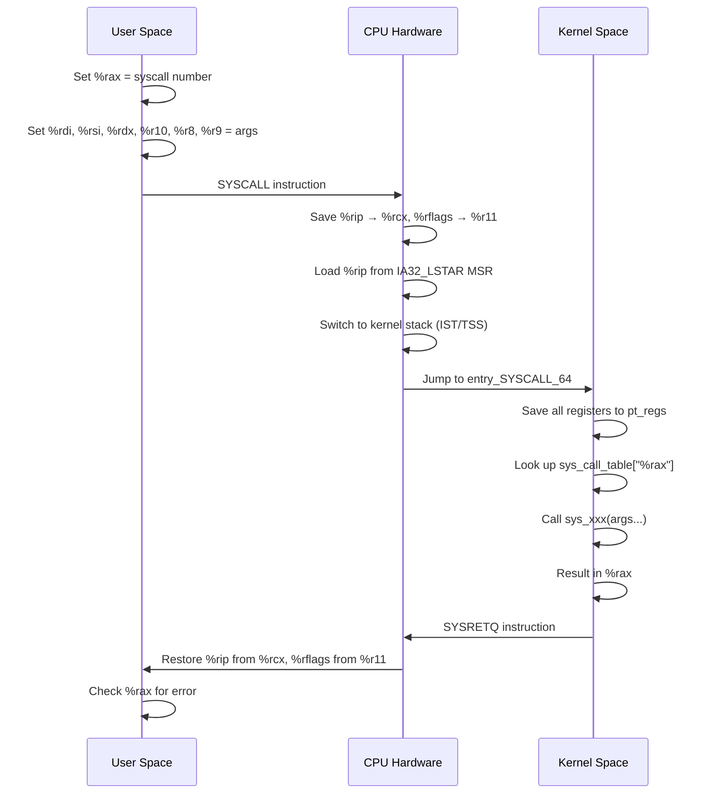

# System Calls

## Introduction

A **system call** (syscall) is the fundamental interface between user-space applications and the Linux kernel. Every privileged operation—reading a file, creating a process, allocating memory, sending network packets—ultimately passes through a system call. Understanding the syscall mechanism is essential for systems programmers, performance engineers, and anyone who wants to understand how Linux really works.

Unlike ordinary function calls, system calls involve a deliberate **transition from user mode to kernel mode**, a change in privilege level enforced by the CPU hardware. This transition has measurable cost and well-defined semantics that differ from regular library calls.

## The System Call Mechanism

### Privilege Levels (Rings)

Modern x86-64 CPUs enforce privilege levels (rings):

| Ring | Name | Usage |
|------|------|-------|
| 0 | Kernel | Linux kernel code |
| 1-2 | (unused) | Typically unused on Linux |
| 3 | User | Application code |

A system call is the controlled mechanism for Ring 3 code to request Ring 0 services. The CPU provides special instructions for this transition that:

1. Switch to kernel stack
2. Save user-space registers
3. Jump to a predefined kernel entry point
4. Raise privilege to Ring 0

```mermaid
flowchart LR
    A["User Process<br>Ring 3"] -->|syscall instruction| B["Kernel Entry Point<br>Ring 0"]
    B --> C[syscall_table[nr]]
    C --> D[Kernel Handler]
    D -->|sysret/iret| A
```
### The System Call Table

The kernel maintains a **system call table**—an array of function pointers indexed by syscall number. On x86-64 Linux, this is defined in `arch/x86/entry/syscall_64.c`:

```c
/* Simplified from kernel source */
asmlinkage const sys_call_ptr_t sys_call_table[] = {
    [0] = sys_read,
    [1] = sys_write,
    [2] = sys_open,
    [3] = sys_close,
    /* ... hundreds more ... */
    [435] = sys_io_uring_setup,
    [436] = sys_io_uring_enter,
    [437] = sys_io_uring_register,
};
```

Each architecture defines its own table and numbering. The x86-64 syscall numbers are in `include/uapi/asm-generic/unistd.h` and `arch/x86/entry/syscalls/syscall_64.tbl`.

**Viewing syscall numbers:**

```bash
# Install audit tools
$ sudo apt install auditd

# List all syscall numbers for x86-64
$ cat /usr/include/asm/unistd_64.h | head -20
#define __NR_read 0
#define __NR_write 1
#define __NR_open 2
#define __NR_close 3
#define __NR_stat 4
#define __NR_fstat 5
#define __NR_lstat 6
#define __NR_poll 7
#define __NR_lseek 8
#define __NR_mmap 9

# Or use ausyscall
$ ausyscall --dump | head -10
read	0
write	1
open	2
close	3
stat	4
fstat	5
```

### User/Kernel Transition Details

When a user process invokes a syscall, the following sequence occurs:


**Key steps in detail:**

1. **Register setup**: The user-space code loads the syscall number into `%rax` and arguments into `%rdi`, `%rsi`, `%rdx`, `%r10`, `%r8`, `%r9` (note: `%r10` instead of `%rcx`, because `SYSCALL` clobbers `%rcx`).

2. **SYSCALL instruction**: The CPU:
   - Saves the return address (`%rip` after SYSCALL) into `%rcx`
   - Saves `%rflags` into `%r11`
   - Masks `%rflags` with `IA32_FMASK`
   - Loads `%rip` from the `IA32_LSTAR` MSR (Model-Specific Register)
   - Sets `%cs` and `%ss` to kernel segments
   - Raises privilege to Ring 0

3. **Kernel entry** (`entry_SYSCALL_64` in `arch/x86/entry/entry_64.S`):
   - Saves all user registers onto the kernel stack (forming `pt_regs`)
   - Calls `do_syscall_64()` which indexes into `sys_call_table`
   - Executes the kernel function

4. **Kernel exit**:
   - Places return value in `%rax` (negative errno convention for errors)
   - Restores user registers from `pt_regs`
   - Executes `SYSRETQ` (or `IRETQ` in edge cases)

## SYSENTER vs SYSCALL vs INT 0x80

### Legacy: INT 0x80

The oldest mechanism on x86. Uses a software interrupt:

```asm
mov eax, 1        ; syscall number: sys_write
mov ebx, 1        ; fd: stdout
mov ecx, msg      ; buffer
mov edx, len      ; count
int 0x80           ; trigger interrupt
```

**Drawbacks**: Slow—goes through the full interrupt descriptor table (IDT) lookup, interrupt handling pipeline, and privilege-level stack switch. Still supported for 32-bit compatibility.

### SYSENTER/SYSEXIT (Intel, 32-bit)

Introduced with Pentium II for faster syscall entry on 32-bit:

```asm
mov eax, 1          ; syscall number
mov ebx, arg1
mov ecx, arg2
mov edx, arg3
; Set up kernel stack in %esp beforehand
mov ecx, esp        ; user stack saved in ecx
sysenter            ; fast transition
; Returns here via sysexit
```

Faster than `INT 0x80` because it bypasses IDT lookup and uses MSRs for direct entry.

### SYSCALL/SYSRET (AMD, 64-bit)

The preferred mechanism on x86-64 Linux:

```asm
mov rax, 1          ; __NR_write
mov rdi, 1          ; fd
lea rsi, [msg]      ; buf
mov rdx, len        ; count
syscall              ; fast transition to kernel
; Return value in rax
```

**SYSCALL advantages:**
- Defined specifically for 64-bit mode
- Saves/restores `%rip` and `%rflags` via registers (no memory access)
- Entry point configured via `IA32_LSTAR` MSR
- `FMASK` MSR for automatic flag masking

### Comparison

| Mechanism | Architecture | Speed | Notes |
|-----------|-------------|-------|-------|
| `INT 0x80` | x86 (32/64) | Slowest | Full IDT lookup, legacy |
| `SYSENTER` | x86 (32-bit) | Fast | Intel-specific |
| `SYSCALL` | x86-64 | Fastest | AMD-originated, standard on x86-64 |
| `SVC` | ARM64 | Fast | ARM equivalent |

### Kernel Entry Selection

The kernel dynamically selects the entry mechanism at boot based on CPU features:

```c
/* Simplified from arch/x86/kernel/cpu/common.c */
void syscall_init(void)
{
    wrmsr(MSR_STAR, 0, (__u32)(__USER32_CS << 16) | __KERNEL_CS);
    wrmsr(MSR_LSTAR, (unsigned long)entry_SYSCALL_64);

    /* Mask traps and direction flag on syscall entry */
    wrmsr(MSR_SYSCALL_MASK,
          EFLAC_TF | EFLAC_DF | EFLAC_IF | EFLAC_IOPL);
}
```

## Writing a Custom System Call

### Step 1: Define the Handler

Add your handler to the kernel source tree:

```c
/* kernel/sys.c or a new file */
#include <linux/syscalls.h>
#include <linux/kernel.h>

SYSCALL_DEFINE1(hello, int, count)
{
    int i;
    for (i = 0; i < count; i++)
        printk(KERN_INFO "Hello from syscall! (%d/%d)\n", i + 1, count);
    return count;
}
```

The `SYSCALL_DEFINE1` macro handles type checking, `copy_from_user()` safety annotations, and `pt_regs` parameter passing. Use `SYSCALL_DEFINE<n>` for n arguments (up to 6).

### Step 2: Register in the Syscall Table

For x86-64, add to `arch/x86/entry/syscalls/syscall_64.tbl`:

```
# Add at the end (use next available number)
548    common    hello    sys_hello
```

### Step 3: Add Prototype

In `include/linux/syscalls.h`:

```c
asmlinkage long sys_hello(int count);
```

### Step 4: Rebuild and Install

```bash
# Configure the kernel
$ make menuconfig

# Build
$ make -j$(nproc)

# Install
$ sudo make modules_install
$ sudo make install

# Reboot into new kernel
$ sudo reboot
```

### Step 5: Invoke from Userspace

```c
#include <stdio.h>
#include <unistd.h>
#include <sys/syscall.h>

/* Must match the number added to syscall_64.tbl */
#define __NR_hello 548

int main(void)
{
    long ret = syscall(__NR_hello, 3);
    if (ret < 0) {
        perror("syscall");
        return 1;
    }
    printf("Syscall returned: %ld\n", ret);

    /* Check kernel log */
    /* dmesg | tail */
    return 0;
}
```

```
$ ./hello_syscall
Syscall returned: 3

$ dmesg | tail -3
[12345.678] Hello from syscall! (1/3)
[12345.678] Hello from syscall! (2/3)
[12345.678] Hello from syscall! (3/3)
```

## Tracing System Calls

### strace

The most common tool for observing syscalls:

```bash
# Trace all syscalls for a command
$ strace ls /tmp
execve("/bin/ls", ["ls", "/tmp"], 0x7ffd4a3b1c20 /* 42 vars */) = 0
brk(NULL)                               = 0x5632a0000000
access("/etc/ld.so.preload", R_OK)      = -1 ENOENT
openat(AT_FDCWD, "/etc/ld.so.cache", O_RDONLY|O_CLOEXEC) = 3
fstat(3, {st_mode=S_IFREG|0644, st_size=52428}) = 0
mmap(NULL, 52428, PROT_READ, MAP_PRIVATE, 3, 0) = 0x7f8a12340000
close(3)                                = 0
openat(AT_FDCWD, "/lib/x86_64-linux-gnu/libc.so.6", O_RDONLY|O_CLOEXEC) = 3
read(3, "\177ELF\2\1\1\3\0\0\0\0\0\0\0\0\3\0>\0\1\0\0\0...", 832) = 832
# ... many more ...

# Trace specific syscalls only
$ strace -e trace=open,read,write cat /etc/hostname

# Trace with timestamps
$ strace -t ls /tmp

# Count syscalls
$ strace -c ls /tmp
% time     seconds  usecs/call     calls    errors syscall
------ ----------- ----------- --------- --------- ----------------
  0.00    0.000000           0         1           read
  0.00    0.000000           0         3           write
  0.00    0.000000           0         5           open
  ...
100.00    0.000123                     42           total
```

### perf trace

```bash
# System-wide syscall tracing
$ sudo perf trace ls /tmp

# With statistics
$ sudo perf trace -s ls /tmp
```

### Syscall auditing (auditd)

```bash
# Monitor all open() syscalls
$ sudo auditctl -a always,exit -F arch=b64 -S openat
$ sudo ausearch -i
```

## Syscall Overhead and Optimization

### Cost of a Syscall

A typical syscall costs **100–300 nanoseconds** on modern hardware, compared to **1–5 ns** for a function call. The overhead comes from:

1. CPU mode switch (Ring 3 → Ring 0 → Ring 3)
2. Register save/restore
3. Pipeline flush
4. Cache/TLB side effects
5. Spectre mitigations (retpoline, IBRS)

```bash
# Benchmark syscall vs function call
$ cat bench_syscall.c
```

```c
#include <stdio.h>
#include <time.h>
#include <unistd.h>
#include <sys/syscall.h>

#define ITERATIONS 1000000

int main(void)
{
    struct timespec start, end;
    int i;

    /* Benchmark getppid() syscall */
    clock_gettime(CLOCK_MONOTONIC, &start);
    for (i = 0; i < ITERATIONS; i++)
        syscall(__NR_getppid);
    clock_gettime(CLOCK_MONOTONIC, &end);

    long ns = (end.tv_sec - start.tv_sec) * 1000000000L +
              (end.tv_nsec - start.tv_nsec);
    printf("Syscall: %ld ns/call\n", ns / ITERATIONS);

    return 0;
}
```

```
$ gcc -O2 -o bench_syscall bench_syscall.c && ./bench_syscall
Syscall: 245 ns/call
```

### Reducing Syscall Overhead

- **Batch operations**: `readv()`/`writev()` for scatter-gather I/O
- **Avoid unnecessary syscalls**: Use `statx()` instead of multiple `stat()` calls
- **Use io_uring**: See [io_uring](./io-uring.md) for submission/completion batching
- **vDSO**: Some syscalls (e.g., `gettimeofday`, `clock_gettime`) are implemented in user-space via the [vDSO](https://man7.org/linux/man-pages/man7/vdso.7.html)

### The vDSO (Virtual Dynamic Shared Object)

The vDSO is a small shared library mapped into every process by the kernel. It provides fast user-space implementations of certain syscalls:

```bash
# See the vDSO mapping
$ cat /proc/self/maps | grep vdso
7ffd5b1fe000-7ffd5b200000 r-xp 00000000 00:00 0 [vdso]
```

```c
/* vDSO-accelerated call—no actual syscall instruction */
#include <time.h>
struct timespec ts;
clock_gettime(CLOCK_MONOTONIC, &ts);  /* Uses vDSO, ~20ns */
```

## Seccomp: Filtering System Calls

Linux provides **seccomp** (Secure Computing Mode) to restrict which syscalls a process can use:

```c
#include <seccomp.h>
#include <stdio.h>
#include <unistd.h>

int main(void)
{
    scmp_filter_ctx ctx;

    ctx = seccomp_init(SCMP_ACT_KILL); /* Default: kill */
    seccomp_rule_add(ctx, SCMP_ACT_ALLOW, SCMP_SYS(read), 0);
    seccomp_rule_add(ctx, SCMP_ACT_ALLOW, SCMP_SYS(write), 0);
    seccomp_rule_add(ctx, SCMP_ACT_ALLOW, SCMP_SYS(exit), 0);
    seccomp_load(ctx);

    /* From here, only read/write/exit are allowed */
    write(1, "Hello!\n", 7);

    /* This will be killed: */
    /* open("/etc/passwd", O_RDONLY); */

    _exit(0);
}
```

```bash
$ gcc -o seccomp_demo seccomp_demo.c -lseccomp
$ ./seccomp_demo
Hello!
# Calling open() would trigger SIGKILL
```

## The `syscall()` Wrapper

The C library provides `syscall()` for direct syscall invocation:

```c
#define _GNU_SOURCE
#include <unistd.h>
#include <sys/syscall.h>

/* These are equivalent: */
ssize_t n1 = read(fd, buf, sizeof(buf));
ssize_t n2 = syscall(__NR_read, fd, buf, sizeof(buf));
```

**When to use `syscall()` directly:**
- Accessing syscalls not wrapped by glibc
- Calling new syscalls before glibc adds wrappers
- Bypassing glibc behavior (e.g., cancellation points)
- Testing and debugging

## ARM64 System Calls

ARM64 Linux uses the `SVC` (Supervisor Call) instruction for system calls:

### ARM64 Calling Convention

```asm
// ARM64 syscall convention:
// x8 = syscall number
// x0-x5 = arguments (6 args max)
// x0 = return value

mov x8, #64         // __NR_write
mov x0, #1          // fd = stdout
ldr x1, =msg        // buf
mov x2, #13         // count
svc #0               // invoke syscall
// Return value in x0
```

### ARM64 vs x86-64 Comparison

| Aspect | x86-64 | ARM64 |
|--------|--------|-------|
| Instruction | `SYSCALL` | `SVC #0` |
| Syscall number register | `%rax` | `x8` |
| Arguments | `%rdi, %rsi, %rdx, %r10, %r8, %r9` | `x0-x5` |
| Return value | `%rax` | `x0` |
| Clobbered by kernel | `%rcx, %r11` | `x0-x7, x30` |
| Entry point | `IA32_LSTAR` MSR | `vectors` page |
| Error convention | Negative errno | Negative errno |

### ARM64 Kernel Entry

```asm
// arch/arm64/kernel/entry.S
el0_sync:
    kernel_entry 0
    mrs x25, esr_el1          // Exception Syndrome Register
    lsr x24, x25, #ESR_ELx_EC_SHIFT // Exception class
    cmp x24, #ESR_ELx_EC_SVC64  // SVC from AArch64?
    b.eq el0_svc
    // ... handle other exceptions ...

el0_svc:
    adrp stbl, sys_call_table   // Load syscall table
    // ... lookup and dispatch ...
```

## Syscall Auditing

The audit subsystem can track all system calls:

```bash
# Enable syscall auditing
sudo auditctl -a always,exit -F arch=b64 -S openat -F success=1
sudo auditctl -a always,exit -F arch=b64 -S execve

# Search audit logs
sudo ausearch -sc execve --interpret
# type=EXECVE msg=audit(1690000000.123:456): argc=3 a0="ls" a1="-la" a2="/tmp"

# Audit all syscalls for a specific user
sudo auditctl -a always,exit -F arch=b64 -S all -F uid=1000

# Monitor file access
sudo auditctl -w /etc/passwd -p wa -k passwd_access
sudo ausearch -k passwd_access

# Performance impact: auditing adds ~5-10% syscall overhead
# Only audit what you need
```

## Syscall Error Handling

### The Negative Errno Convention

```c
/* Kernel return convention: 
 * - Success: non-negative value (often bytes transferred)
 * - Error: negative errno value
 *
 * glibc wrapper: sets errno and returns -1
 */

ssize_t n = read(fd, buf, sizeof(buf));
if (n < 0) {
    /* errno is set by glibc */
    switch (errno) {
    case EAGAIN:     /* Non-blocking, try again later */
    case EINTR:      /* Interrupted by signal, retry */
    case EIO:        /* I/O error */
    case EFAULT:     /* Bad buffer address */
    case EBADF:      /* Bad file descriptor */
        break;
    }
}
```

### EINTR Handling

```c
/* Many syscalls can be interrupted by signals and return EINTR.
 * The correct pattern is to retry: */

ssize_t safe_read(int fd, void *buf, size_t count)
{
    ssize_t n;
    do {
        n = read(fd, buf, count);
    } while (n < 0 && errno == EINTR);
    return n;
}

/* Functions that can return EINTR:
 * read(), write(), open(), close(), connect(), accept(),
 * waitpid(), sem_wait(), mq_receive(), nanosleep(), etc.
 */
```

### Common Syscall Pitfalls

```c
/* 1. TOCTOU (Time-of-Check-Time-of-Use) vulnerability */
/* BAD: race between access() and open() */
if (access(filename, W_OK) == 0) {
    fd = open(filename, O_WRONLY);  // File may have changed!
}
/* GOOD: use open() with O_CREAT and handle EACCES */
fd = open(filename, O_WRONLY | O_CREAT | O_EXCL, 0600);

/* 2. Short reads/writes */
/* read()/write() may return fewer bytes than requested */
ssize_t total = 0;
while (total < count) {
    ssize_t n = write(fd, buf + total, count - total);
    if (n < 0) {
        if (errno == EINTR) continue;
        return -1;
    }
    total += n;
}

/* 3. Signal safety */
/* Only async-signal-safe functions can be called from signal handlers */
/* Safe: write(), read(), _exit(), kill() */
/* Unsafe: malloc(), printf(), mutex_lock() */
```

## Syscall Categories

### Common Syscall Families

| Category | Key Syscalls | Man Section |
|----------|-------------|-------------|
| File I/O | `open`, `read`, `write`, `close`, `lseek` | 2 |
| Process | `fork`, `execve`, `wait4`, `exit`, `kill` | 2 |
| Memory | `mmap`, `munmap`, `brk`, `mprotect`, `madvise` | 2 |
| Network | `socket`, `bind`, `listen`, `accept`, `connect` | 2 |
| IPC | `pipe`, `shmget`, `msgget`, `semget` | 2 |
| Time | `clock_gettime`, `nanosleep`, `timerfd` | 2 |
| Security | `seccomp`, `prctl`, `capset`, `pivot_root` | 2 |
| Signals | `sigaction`, `sigprocmask`, `signalfd` | 2 |

### Syscall Frequency Analysis

```bash
# What syscalls does a typical program make?
strace -c ls /tmp 2>&1 | tail -15
% time     seconds  usecs/call     calls    errors syscall
------ ----------- ----------- --------- --------- ----------------
  0.00    0.000000           0         1           read
  0.00    0.000000           0         3           write
  0.00    0.000000           0         5           open
  0.00    0.000000           0         5           close
  0.00    0.000000           0         8           fstat
  0.00    0.000000           0        12           mmap
  0.00    0.000000           0         3           mprotect
  0.00    0.000000           0         1           munmap
  0.00    0.000000           0         1           brk
  ...
100.00    0.000123                     42           total

# System-wide syscall profiling
sudo perf stat -e 'raw_syscalls:sys_enter' -a sleep 5
# 123,456 raw_syscalls:sys_enter
```

## Syscall Interposition

Syscall interposition allows you to intercept and modify syscall behavior:

### ptrace-based Interposition

```c
/* strace uses ptrace to intercept syscalls */
#include <sys/ptrace.h>
#include <sys/wait.h>

pid_t child = fork();
if (child == 0) {
    /* Child: request tracing */
    ptrace(PTRACE_TRACEME, 0, NULL, NULL);
    execvp("ls", (char *[]){"ls", NULL});
} else {
    /* Parent: intercept syscalls */
    int status;
    while (waitpid(child, &status, 0) > 0) {
        struct ptrace_syscall_info info;
        ptrace(PTRACE_GET_SYSCALL_INFO, child, sizeof(info), &info);
        /* info.op.nr = syscall number */
        /* info.entry.args[0..5] = arguments */
        ptrace(PTRACE_SYSCALL, child, NULL, NULL);
    }
}
```

### seccomp Notify

```c
/* seccomp user notification (since Linux 5.0) */
/* Allows a supervisor process to handle syscalls for another process */

#include <linux/seccomp.h>
#include <sys/ioctl.h>

/* Supervisor sets up notification fd */
struct seccomp_notif_addfd addfd = {
    .id = req->id,
    .newfd = new_fd,
};
ioctl(notify_fd, SECCOMP_IOCTL_NOTIF_ADDFD, &addfd);
```

## io_uring: Batching Syscalls

`io_uring` reduces syscall overhead by batching I/O operations:

```c
/* Traditional: 1 syscall per I/O
 * read() -> syscall -> return
 * read() -> syscall -> return
 * read() -> syscall -> return
 *
 * io_uring: submit multiple I/Os, then wait for all
 * io_uring_submit() -> 1 syscall, 3 I/Os
 */

#include <liburing.h>

struct io_uring ring;
io_uring_queue_init(32, &ring, 0);

/* Submit 3 reads in one syscall */
for (int i = 0; i < 3; i++) {
    struct io_uring_sqe *sqe = io_uring_get_sqe(&ring);
    io_uring_prep_read(sqe, fds[i], bufs[i], 4096, 0);
}
io_uring_submit(&ring);  /* Single syscall for all 3 */

/* Wait for all completions */
for (int i = 0; i < 3; i++) {
    struct io_uring_cqe *cqe;
    io_uring_wait_cqe(&ring, &cqe);
    /* Process completion */
    io_uring_cqe_seen(&ring, cqe);
}
```

## References

- [The Linux Kernel Documentation](https://docs.kernel.org/)
- [LWN.net - Linux and free software news](https://lwn.net/)
- [Linux System Call Table (x86-64)](https://filippo.io/linux-syscall-table/)
- [Linux System Call Table (ARM64)](https://arm64.syscall.sh/)
- [man 2 syscall](https://man7.org/linux/man-pages/man2/syscall.2.html)
- [man 2 syscalls](https://man7.org/linux/man-pages/man2/syscalls.2.html)
- [Kernel source: arch/x86/entry/entry_64.S](https://elixir.bootlin.com/linux/latest/source/arch/x86/entry/entry_64.S)
- [Kernel source: arch/arm64/kernel/entry.S](https://elixir.bootlin.com/linux/latest/source/arch/arm64/kernel/entry.S)
- [seccomp(2) man page](https://man7.org/linux/man-pages/man2/seccomp.2.html)
- [io_uring documentation](https://kernel.dk/io_uring.pdf)
- [GNU Project Documentation](https://www.gnu.org/doc/doc.html)

## Related Topics

- [File I/O](./file-io.md) — The most common syscalls: `open`, `read`, `write`, `close`
- [Process Control](./process-control.md) — `fork`, `execve`, `wait`, `exit`
- [Signals](./signals.md) — Signal delivery and handling
- [io_uring](./io-uring.md) — Modern async syscall interface
- [ELF Format](./elf.md) — How binaries invoke syscalls
- [Dynamic Linking](./dynamic-linking.md) — How `libc` wraps syscalls
- [Seccomp](../security/seccomp.md) — Syscall filtering
