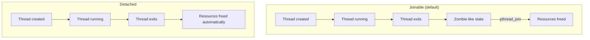
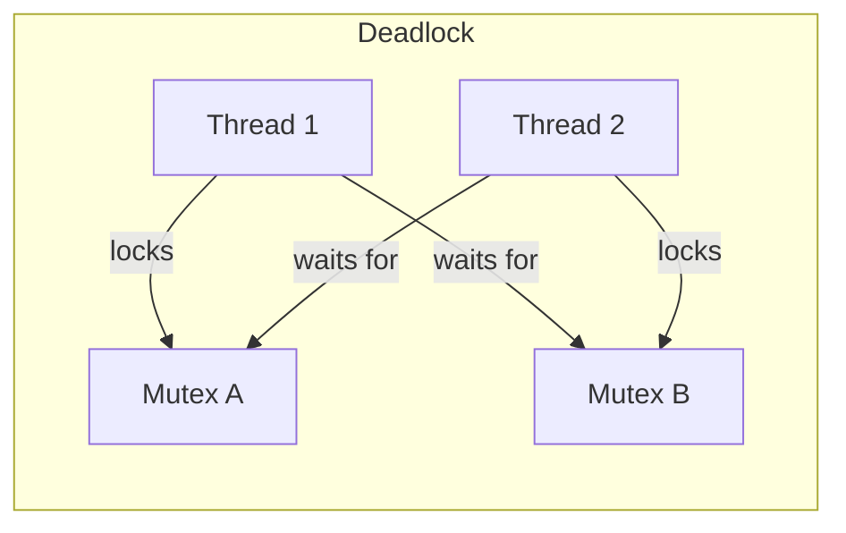
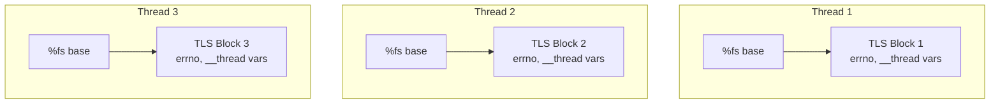
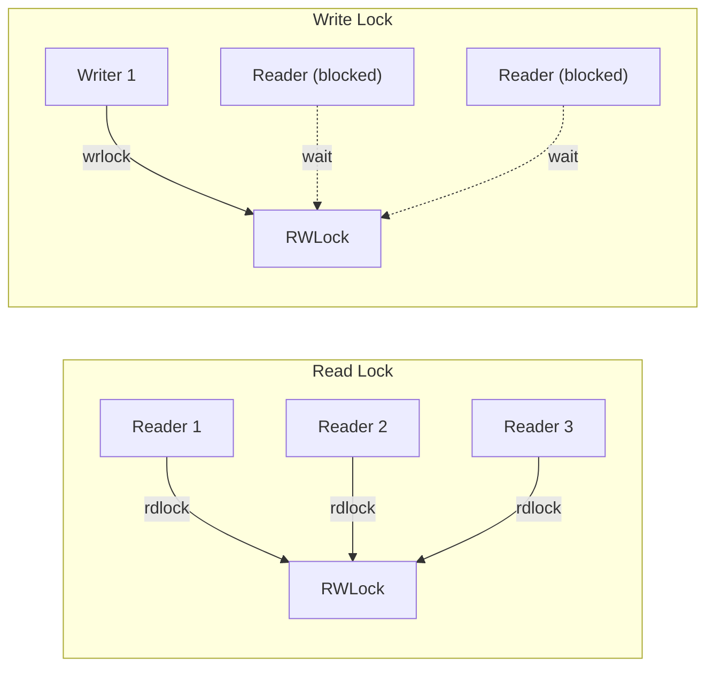

# Pthreads (POSIX Threads)

## Introduction

POSIX threads (pthreads) provide the standard threading API on Linux and other Unix-like systems. Threads share the same address space, file descriptors, and signal handlers, but each has its own stack, register state, and signal mask. This shared-nothing-except-memory model enables efficient parallelism and concurrent I/O, but requires careful synchronization.

On Linux, pthreads are implemented using the `clone()` system call with flags like `CLONE_VM | CLONE_FILES | CLONE_SIGHAND | CLONE_THREAD`. Each thread is a full schedulable entity from the kernel's perspective (1:1 threading model).

## Thread Creation

```c
#include <pthread.h>

int pthread_create(pthread_t *thread, const pthread_attr_t *attr,
                   void *(*start_routine)(void *), void *arg);
```

### Basic Example

```c
#include <pthread.h>
#include <stdio.h>
#include <stdlib.h>
#include <unistd.h>

void *worker(void *arg)
{
    int id = *(int *)arg;
    printf("Thread %d: running (TID=%ld)\n", id, (long)pthread_self());
    sleep(1);
    printf("Thread %d: done\n", id);
    return NULL;  /* Return value accessible via pthread_join */
}

int main(void)
{
    pthread_t threads[4];
    int ids[4];

    for (int i = 0; i < 4; i++) {
        ids[i] = i;
        int ret = pthread_create(&threads[i], NULL, worker, &ids[i]);
        if (ret != 0) {
            fprintf(stderr, "pthread_create: %s\n", strerror(ret));
            return 1;
        }
    }

    /* Wait for all threads to finish */
    for (int i = 0; i < 4; i++) {
        pthread_join(threads[i], NULL);
    }

    printf("All threads completed\n");
    return 0;
}
```

```
$ gcc -pthread -o threads threads.c && ./threads
Thread 0: running (TID=140234567890)
Thread 2: running (TID=140234498050)
Thread 1: running (TID=140234530180)
Thread 3: running (TID=140234465920)
Thread 0: done
Thread 2: done
Thread 1: done
Thread 3: done
All threads completed
```

### Thread Attributes

```c
pthread_attr_t attr;
pthread_attr_init(&attr);

/* Set stack size */
pthread_attr_setstacksize(&attr, 2 * 1024 * 1024);  /* 2MB */

/* Set detached state */
pthread_attr_setdetachstate(&attr, PTHREAD_CREATE_DETACHED);

/* Set scheduling policy */
pthread_attr_setschedpolicy(&attr, SCHED_FIFO);
pthread_attr_setschedparam(&attr, &param);

pthread_create(&thread, &attr, worker, NULL);
pthread_attr_destroy(&attr);
```

## Thread Termination and Joining

```c
/* Wait for thread completion */
int pthread_join(pthread_t thread, void **retval);

/* Detach thread (no join needed, resources freed automatically) */
int pthread_detach(pthread_t thread);

/* Cancel a thread */
int pthread_cancel(pthread_t thread);

/* Exit current thread */
void pthread_exit(void *retval);
```

### Join vs Detach


```mermaid
c
/* Pattern: join all threads */
#define NUM_THREADS 8
pthread_t threads[NUM_THREADS];

for (int i = 0; i < NUM_THREADS; i++)
    pthread_create(&threads[i], NULL, worker, &args[i]);

for (int i = 0; i < NUM_THREADS; i++) {
    void *result;
    pthread_join(threads[i], &result);
    printf("Thread %d returned %ld\n", i, (long)result);
}
```

## Mutexes

A **mutex** (mutual exclusion) protects shared data from concurrent access.

```c
#include <pthread.h>

int pthread_mutex_init(pthread_mutex_t *mutex, const pthread_mutexattr_t *attr);
int pthread_mutex_lock(pthread_mutex_t *mutex);
int pthread_mutex_trylock(pthread_mutex_t *mutex);
int pthread_mutex_unlock(pthread_mutex_t *mutex);
int pthread_mutex_destroy(pthread_mutex_t *mutex);
```

### Basic Mutex Usage

```c
#include <pthread.h>
#include <stdio.h>

#define NUM_THREADS 4
#define ITERATIONS 1000000

long counter = 0;
pthread_mutex_t lock = PTHREAD_MUTEX_INITIALIZER;

void *increment(void *arg)
{
    (void)arg;
    for (int i = 0; i < ITERATIONS; i++) {
        pthread_mutex_lock(&lock);
        counter++;
        pthread_mutex_unlock(&lock);
    }
    return NULL;
}

int main(void)
{
    pthread_t threads[NUM_THREADS];

    for (int i = 0; i < NUM_THREADS; i++)
        pthread_create(&threads[i], NULL, increment, NULL);

    for (int i = 0; i < NUM_THREADS; i++)
        pthread_join(threads[i], NULL);

    printf("Counter: %ld (expected: %ld)\n",
           counter, (long)NUM_THREADS * ITERATIONS);
    return 0;
}
```

```
$ gcc -pthread -o mutex mutex.c && ./mutex
Counter: 4000000 (expected: 4000000)
```

### Mutex Types

```c
pthread_mutexattr_t attr;
pthread_mutexattr_init(&attr);

/* Normal: deadlock if same thread locks twice */
pthread_mutexattr_settype(&attr, PTHREAD_MUTEX_NORMAL);

/* Errorcheck: returns EDEADLK on double lock */
pthread_mutexattr_settype(&attr, PTHREAD_MUTEX_ERRORCHECK);

/* Recursive: allows multiple locks from same thread */
pthread_mutexattr_settype(&attr, PTHREAD_MUTEX_RECURSIVE);

/* Default: implementation-defined (usually NORMAL) */
pthread_mutexattr_settype(&attr, PTHREAD_MUTEX_DEFAULT);
```

### Deadlock Prevention


**Prevention strategies:**

```mermaid
c
/* Strategy 1: Consistent lock ordering */
/* Always lock A before B */
pthread_mutex_lock(&mutex_a);
pthread_mutex_lock(&mutex_b);
/* ... */
pthread_mutex_unlock(&mutex_b);
pthread_mutex_unlock(&mutex_a);

/* Strategy 2: trylock with backoff */
int try_lock_both(pthread_mutex_t *a, pthread_mutex_t *b)
{
    while (1) {
        pthread_mutex_lock(a);
        if (pthread_mutex_trylock(b) == 0)
            return 0;  /* Got both */
        pthread_mutex_unlock(a);
        /* Backoff and retry */
        usleep(1);
    }
}

/* Strategy 3: Use lock hierarchy numbers */
/* Assign each mutex a rank; always lock higher rank first */
```

## Condition Variables

Condition variables allow threads to wait for a specific condition to become true, avoiding busy-waiting.

```c
#include <pthread.h>

int pthread_cond_init(pthread_cond_t *cond, const pthread_condattr_t *attr);
int pthread_cond_wait(pthread_cond_t *cond, pthread_mutex_t *mutex);
int pthread_cond_timedwait(pthread_cond_t *cond, pthread_mutex_t *mutex,
                           const struct timespec *abstime);
int pthread_cond_signal(pthread_cond_t *cond);
int pthread_cond_broadcast(pthread_cond_t *cond);
int pthread_cond_destroy(pthread_cond_t *cond);
```

### Producer-Consumer Pattern

```c
#include <pthread.h>
#include <stdio.h>
#include <stdlib.h>

#define QUEUE_SIZE 10

int queue[QUEUE_SIZE];
int count = 0;  /* Number of items in queue */

pthread_mutex_t mutex = PTHREAD_MUTEX_INITIALIZER;
pthread_cond_t not_empty = PTHREAD_COND_INITIALIZER;
pthread_cond_t not_full = PTHREAD_COND_INITIALIZER;

void enqueue(int item)
{
    pthread_mutex_lock(&mutex);

    /* Wait while queue is full */
    while (count == QUEUE_SIZE)
        pthread_cond_wait(&not_full, &mutex);

    queue[count++] = item;

    /* Signal that queue is not empty */
    pthread_cond_signal(&not_empty);
    pthread_mutex_unlock(&mutex);
}

int dequeue(void)
{
    pthread_mutex_lock(&mutex);

    /* Wait while queue is empty */
    while (count == 0)
        pthread_cond_wait(&not_empty, &mutex);

    int item = queue[--count];

    /* Signal that queue is not full */
    pthread_cond_signal(&not_full);
    pthread_mutex_unlock(&mutex);

    return item;
}

void *producer(void *arg)
{
    int id = *(int *)arg;
    for (int i = 0; i < 20; i++) {
        int item = id * 100 + i;
        enqueue(item);
        printf("Producer %d: enqueued %d\n", id, item);
    }
    return NULL;
}

void *consumer(void *arg)
{
    (void)arg;
    for (int i = 0; i < 30; i++) {
        int item = dequeue();
        printf("Consumer: dequeued %d\n", item);
    }
    return NULL;
}

int main(void)
{
    pthread_t prod[2], cons;
    int ids[] = {0, 1};

    pthread_create(&cons, NULL, consumer, NULL);
    pthread_create(&prod[0], NULL, producer, &ids[0]);
    pthread_create(&prod[1], NULL, producer, &ids[1]);

    pthread_join(prod[0], NULL);
    pthread_join(prod[1], NULL);
    pthread_join(cons, NULL);

    return 0;
}
```

### Key Rules for Condition Variables

1. **Always use `while` loops**, not `if`, for the condition check:
   
```c
   /* WRONG: may have spurious wakeups */
   if (count == 0) pthread_cond_wait(...);

   /* CORRECT */
   while (count == 0) pthread_cond_wait(...);
   
```

2. **Always hold the mutex** when calling `pthread_cond_wait()`:
   
```c
   pthread_mutex_lock(&mutex);
   while (!condition)
       pthread_cond_wait(&cond, &mutex);  /* Atomically releases mutex + waits */
   /* Mutex is re-acquired when woken */
   /* ... use shared data ... */
   pthread_mutex_unlock(&mutex);
   
```

3. **Signal vs Broadcast:**
   - `pthread_cond_signal()` — wakes one waiting thread
   - `pthread_cond_broadcast()` — wakes all waiting threads
   - Use `signal` when only one waiter can proceed; `broadcast` when the condition changed for all

## Thread-Local Storage (TLS)

Each thread gets its own copy of a TLS variable:

### `__thread` Keyword (GCC/Clang)

```c
#include <pthread.h>
#include <stdio.h>

__thread int tls_counter = 0;
__thread char tls_buffer[256];

void *worker(void *arg)
{
    int id = *(int *)arg;

    tls_counter = id * 10;
    snprintf(tls_buffer, sizeof(tls_buffer), "Thread %d data", id);

    printf("Thread %d: counter=%d, buffer='%s'\n",
           id, tls_counter, tls_buffer);
    return NULL;
}

int main(void)
{
    pthread_t threads[3];
    int ids[] = {0, 1, 2};

    for (int i = 0; i < 3; i++)
        pthread_create(&threads[i], NULL, worker, &ids[i]);

    for (int i = 0; i < 3; i++)
        pthread_join(threads[i], NULL);

    return 0;
}
```

```
Thread 0: counter=0, buffer='Thread 0 data'
Thread 1: counter=10, buffer='Thread 1 data'
Thread 2: counter=20, buffer='Thread 2 data'
```

### POSIX `pthread_key_t` API

```c
#include <pthread.h>

pthread_key_t key;

void destructor(void *value)
{
    free(value);  /* Called when thread exits */
}

void init_key(void)
{
    pthread_key_create(&key, destructor);
}

void *worker(void *arg)
{
    /* Allocate per-thread data */
    int *data = malloc(sizeof(int));
    *data = *(int *)arg;
    pthread_setspecific(key, data);

    /* Retrieve per-thread data */
    int *my_data = pthread_getspecific(key);
    printf("My data: %d\n", *my_data);

    return NULL;
}
```

### TLS Implementation


On x86-64, TLS uses the `%fs` segment register. Each thread has a different `%fs` base, so `mov %fs:offset, %rax` accesses thread-specific data.

## Thread Cancellation

```mermaid
c
#include <pthread.h>

int pthread_cancel(pthread_t thread);
int pthread_setcancelstate(int state, int *oldstate);
int pthread_setcanceltype(int type, int *oldtype);
void pthread_testcancel(void);
```

### Cancellation States and Types

| State | Meaning |
|-------|---------|
| `PTHREAD_CANCEL_ENABLE` | Cancellation is enabled (default) |
| `PTHREAD_CANCEL_DISABLE` | Cancellation is deferred |

| Type | Meaning |
|------|---------|
| `PTHREAD_CANCEL_DEFERRED` | Cancel at next cancellation point (default) |
| `PTHREAD_CANCEL_ASYNCHRONOUS` | Cancel at any time (dangerous) |

### Cancellation Points

POSIX defines functions that are **cancellation points**—`pthread_cancel()` will take effect there:

- `read()`, `write()`, `open()`, `close()`
- `pthread_cond_wait()`, `pthread_cond_timedwait()`
- `sleep()`, `nanosleep()`
- `select()`, `poll()`
- `wait()`, `waitpid()`
- `printf()`, `scanf()`
- `malloc()`, `free()`

### Cleanup Handlers

```c
#include <pthread.h>

void pthread_cleanup_push(void (*routine)(void *), void *arg);
void pthread_cleanup_pop(int execute);
```

```c
#include <pthread.h>
#include <stdio.h>
#include <stdlib.h>
#include <unistd.h>

void cleanup_handler(void *arg)
{
    printf("Cleanup: freeing %s\n", (char *)arg);
    free(arg);
}

void *cancellable_worker(void *arg)
{
    (void)arg;

    char *resource = strdup("important data");
    pthread_cleanup_push(cleanup_handler, resource);

    /* This loop contains cancellation points */
    while (1) {
        printf("Working...\n");
        sleep(1);  /* Cancellation point */
    }

    /* cleanup_pop(1) would execute the handler;
     * cleanup_pop(0) would not.
     * This code is never reached but the push/pop must pair. */
    pthread_cleanup_pop(1);

    return NULL;
}

int main(void)
{
    pthread_t thread;
    pthread_create(&thread, NULL, cancellable_worker, NULL);

    sleep(3);
    pthread_cancel(thread);

    void *retval;
    pthread_join(thread, &retval);

    if (retval == PTHREAD_CANCELED)
        printf("Thread was cancelled\n");

    return 0;
}
```

```
$ gcc -pthread -o cancel cancel.c && ./cancel
Working...
Working...
Working...
Cleanup: freeing important data
Thread was cancelled
```

## Spinlocks

For very short critical sections where sleeping (via mutex) is more expensive than busy-waiting:

```c
#include <pthread.h>

pthread_spinlock_t spinlock;

pthread_spin_init(&spinlock, PTHREAD_PROCESS_PRIVATE);

pthread_spin_lock(&spinlock);
/* Very short critical section (< 1μs) */
pthread_spin_unlock(&spinlock);

pthread_spin_destroy(&spinlock);
```

**When to use spinlocks:**
- Critical section is extremely short (nanoseconds)
- Running on a multi-core system
- Thread priority is high and preemption is unlikely
- Inside interrupt handlers or real-time contexts

**When NOT to use spinlocks:**
- Critical section may block or take significant time
- Single-core systems (wastes CPU)
- General-purpose code (prefer mutexes)

## Read-Write Locks

When reads vastly outnumber writes:

```c
#include <pthread.h>

pthread_rwlock_t rwlock = PTHREAD_RWLOCK_INITIALIZER;

/* Multiple readers can hold simultaneously */
pthread_rwlock_rdlock(&rwlock);
/* ... read shared data ... */
pthread_rwlock_unlock(&rwlock);

/* Only one writer, blocks all readers */
pthread_rwlock_wrlock(&rwlock);
/* ... modify shared data ... */
pthread_rwlock_unlock(&rwlock);
```


## Barriers

Wait for all threads to reach a synchronization point:

```mermaid
c
#include <pthread.h>

pthread_barrier_t barrier;

pthread_barrier_init(&barrier, NULL, NUM_THREADS);  /* Wait for N threads */

/* Each thread does its work, then waits at the barrier */
do_phase_1();
pthread_barrier_wait(&barrier);  /* Block until all threads arrive */
do_phase_2();  /* All threads proceed together */

pthread_barrier_destroy(&barrier);
```

## Once Initialization

Thread-safe one-time initialization:

```c
#include <pthread.h>

pthread_once_t once_control = PTHREAD_ONCE_INIT;

void init_function(void)
{
    /* Called exactly once, by the first thread to reach pthread_once */
    printf("Initializing...\n");
}

void *worker(void *arg)
{
    (void)arg;
    pthread_once(&once_control, init_function);
    /* ... */
    return NULL;
}
```

## Performance Considerations

### False Sharing

When different threads modify variables that reside on the same cache line, performance degrades due to cache-line bouncing:

```c
/* BAD: false sharing */
struct {
    long counter_a;  /* Thread 0 writes */
    long counter_b;  /* Thread 1 writes */
    /* Both on same 64-byte cache line! */
} shared;

/* GOOD: pad to separate cache lines */
struct {
    long counter_a;
    char padding[56];  /* Pad to 64 bytes */
    long counter_b;
    char padding2[56];
} shared_padded;

/* Or use compiler alignment */
struct {
    long counter_a __attribute__((aligned(64)));
    long counter_b __attribute__((aligned(64)));
} shared_aligned;
```

### Number of Threads

```bash
# Get number of CPU cores
$ nproc
8

# Or via sysconf in C
long nprocs = sysconf(_SC_NPROCESSORS_ONLN);
```

**Rule of thumb:**
- CPU-bound work: `num_threads = num_cores`
- I/O-bound work: `num_threads = num_cores * (1 + wait_time / compute_time)`
- Mixed: tune experimentally

## References

- [The Linux Kernel Documentation](https://docs.kernel.org/)
- [LWN.net - Linux and free software news](https://lwn.net/)
- [GNU Project Documentation](https://www.gnu.org/doc/doc.html)
- [GNU Manuals](https://www.gnu.org/manual/manual.html)
- [Free Software Directory](https://directory.fsf.org/wiki/Main_Page)
- [Planet GNU](https://planet.gnu.org/)
- [Free Software Books](https://www.gnu.org/doc/other-free-books.html)

- [pthread_create(3) — Linux manual page](https://man7.org/linux/man-pages/man3/pthread_create.3.html)
- [pthread_mutex_lock(3) — Linux manual page](https://man7.org/linux/man-pages/man3/pthread_mutex_lock.3.html)
- [pthread_cond_wait(3) — Linux manual page](https://man7.org/linux/man-pages/man3/pthread_cond_wait.3.html)
- [pthread_cancel(3) — Linux manual page](https://man7.org/linux/man-pages/man3/pthread_cancel.3.html)
- [pthreads(7) — POSIX Threads](https://man7.org/linux/man-pages/man7/pthreads.7.html)
- [The Linux Programming Interface, Chapter 29-33](https://man7.org/tlpi/)

## Related Topics

- [System Calls](./syscalls.md) — `clone()` is the underlying syscall for thread creation
- [Signals](./signals.md) — Signal handling in multithreaded programs
- [Process Control](./process-control.md) — Threads vs processes
- [IPC](./ipc.md) — Inter-process and inter-thread communication
- [Shared Memory](./ipc/shared-memory.md) — Shared memory between threads
