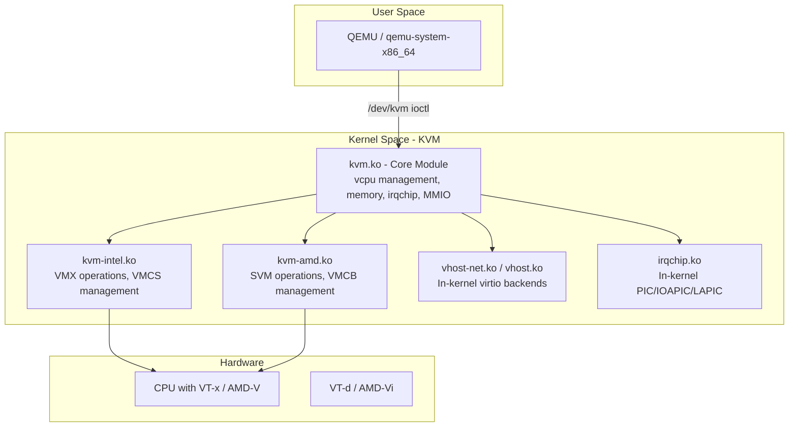
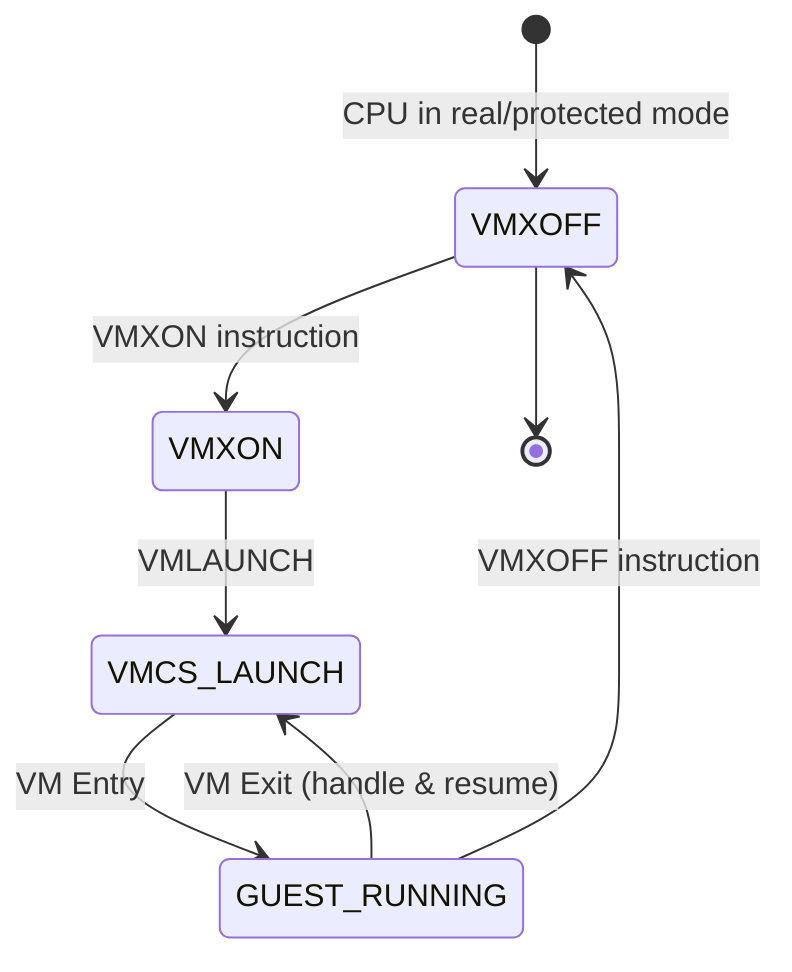
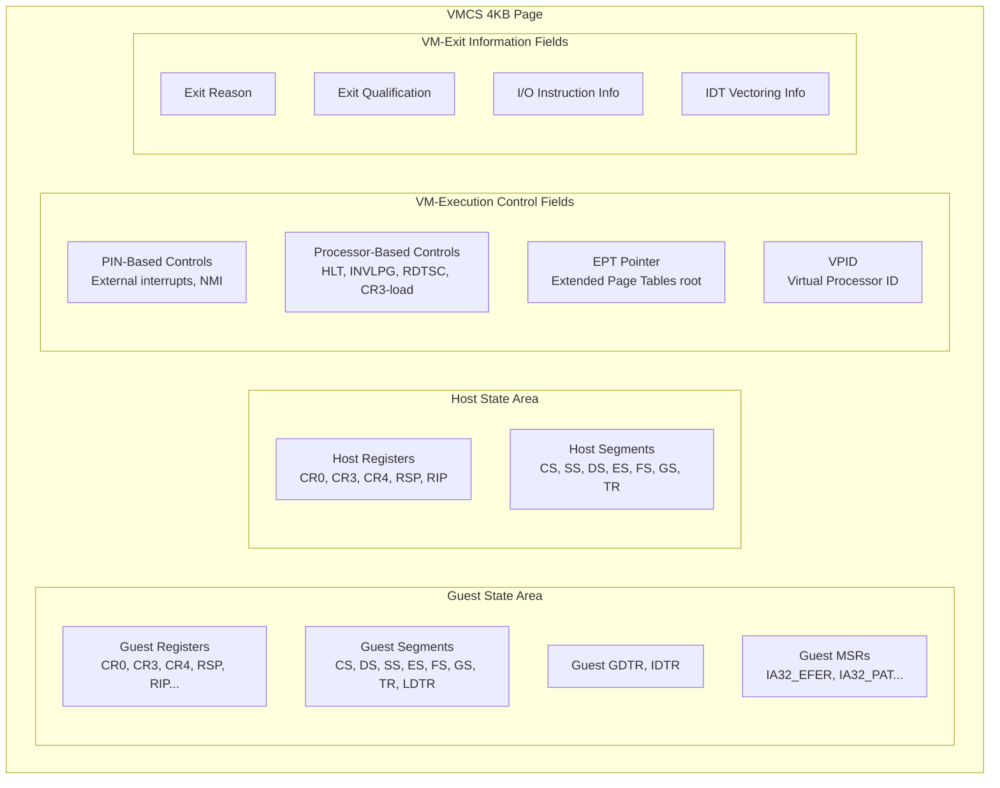
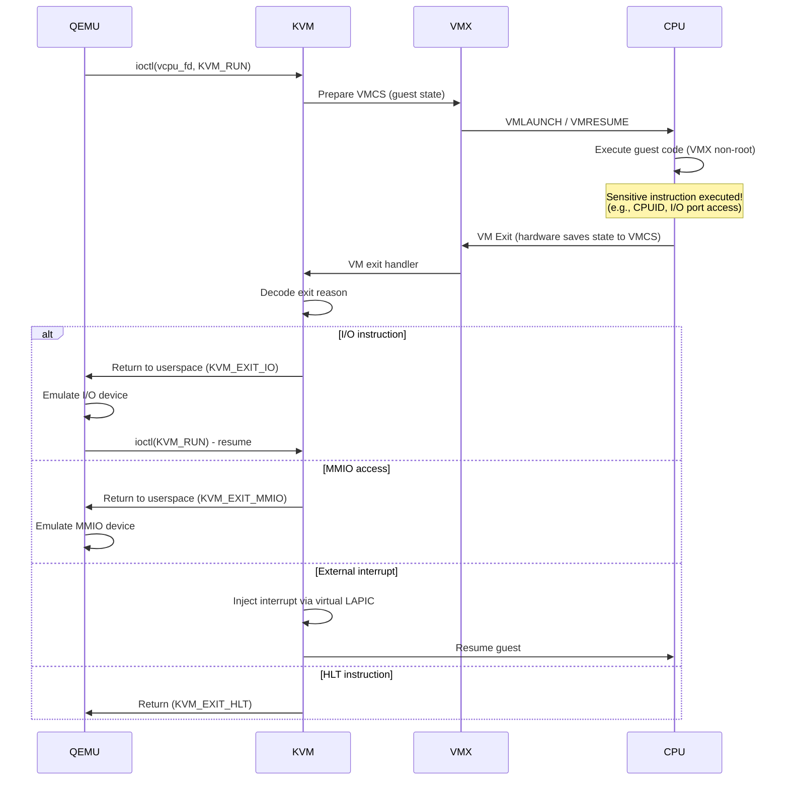
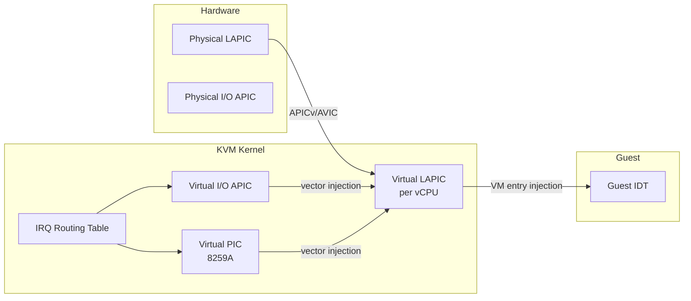
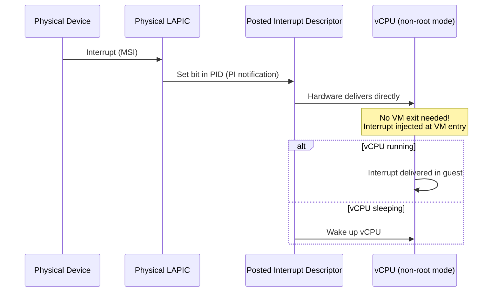
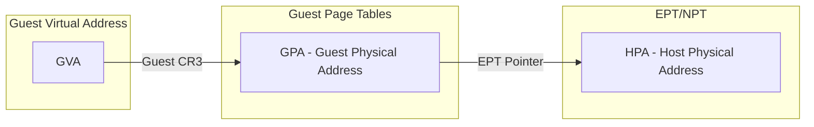
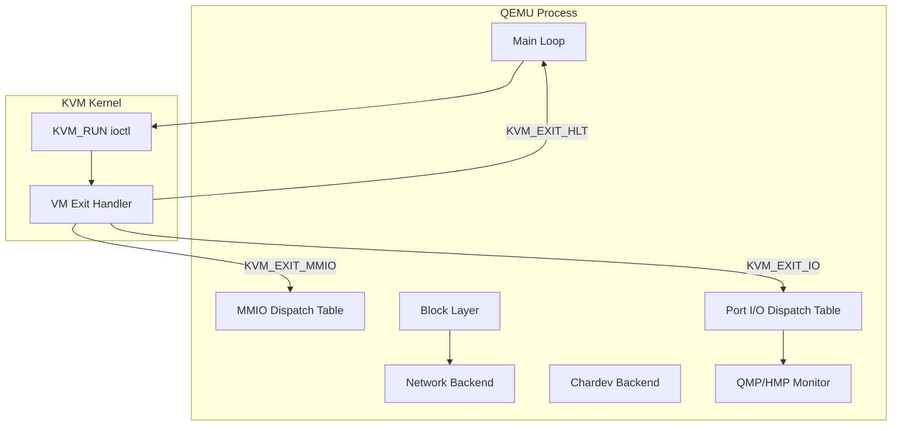

# KVM Internals

## Introduction

KVM (Kernel-based Virtual Machine) is the Linux kernel's native virtualization subsystem. Unlike traditional hypervisors that replace the operating system, KVM transforms the Linux kernel itself into a hypervisor by leveraging hardware-assisted virtualization extensions (Intel VT-x and AMD-V). This design means every Linux machine with appropriate hardware is a potential hypervisor, with no separate hypervisor layer to install or maintain.

This chapter dives deep into KVM's kernel internals: how it manages virtual CPUs, handles memory virtualization, intercepts hardware access, and integrates with userspace emulators like QEMU.

## KVM Module Architecture

KVM is split into a hardware-agnostic core and architecture-specific modules:

```
kvm.ko              — Core KVM infrastructure (common code)
kvm-intel.ko        — Intel VT-x implementation (VMX)
kvm-amd.ko          — AMD-V implementation (SVM)
```



### Module Loading

```bash
# Check loaded KVM modules
lsmod | grep kvm
# kvm_intel              380928  1
# kvm                   1089536  1 kvm_intel

# Module parameters (Intel)
cat /sys/module/kvm_intel/parameters/nested
# Y  (nested virtualization enabled)

cat /sys/module/kvm_intel/parameters/enable_shadow_vmcs
# Y

# Module parameters (AMD)
cat /sys/module/kvm_amd/parameters/nested
# 1

# Disable KVM (e.g., for debugging)
# echo 0 > /sys/module/kvm_intel/parameters/enable_unsafe_vm_shadow
```

## VMX Module (Intel VT-x)

The VMX module (`kvm-intel.ko`) implements Intel's VT-x extensions. It manages the hardware virtualization state through the VMCS.

### VMX Operation Modes



**VMX root mode** (hypervisor) and **VMX non-root mode** (guest) are the two operating modes introduced by VT-x. The CPU transitions between them via:

- **VM Entry** (VMLAUNCH/VMRESUME) — root → non-root
- **VM Exit** — non-root → root (triggered by sensitive instructions, interrupts, etc.)

### VMCS (Virtual Machine Control Structure)

The VMCS is a 4KB data structure in physical memory that holds the complete state of a virtual machine. Each vCPU has one active VMCS at a time.



**VMCS fields:**

| Field Group | Examples | Purpose |
|-------------|----------|---------|
| Guest State | RSP, RIP, CR0, CR3, CS, SS | Loaded on VM entry, saved on VM exit |
| Host State | RSP, RIP, CR0, CR3, CS | Loaded on VM exit |
| VM-Execution Controls | EPTP, VPID, MSR bitmap | Configure what causes VM exits |
| VM-Exit Controls | Exit reason, qualification | Information about why exit occurred |
| VM-Entry Controls | Event injection, IDT vectoring | Inject interrupts/exceptions into guest |

**VMCS shadowing** allows nested virtualization to run more efficiently by letting L2 guest VM exits handled by L1 hypervisor without causing a full VM exit to host.

```c
/* KVM's VMCS field encoding (simplified) */
#define VMCS_ENCODE(field, access, type, width) \
    (((field) << 13) | ((access) << 10) | ((type) << 8) | (width))

/* Reading VMCS field */
static inline u64 vmcs_read64(unsigned long field) {
    u64 value;
    asm volatile("vmread %1, %0" : "=rm"(value) : "r"(field));
    return value;
}

/* Writing VMCS field */
static inline void vmcs_write64(unsigned long field, u64 value) {
    asm volatile("vmwrite %0, %1" :: "r"(value), "rm"(field));
}
```

### VM Entry / Exit Flow



## VMCB (AMD SVM)

AMD's SVM (Secure Virtual Machine) uses the VMCB (Virtual Machine Control Block) instead of Intel's VMCS. The VMCB is a 4KB structure stored in physical memory.

```c
/* Simplified VMCB control area layout */
struct vmcb_control_area {
    u32 intercept_cr;        /* CR read/write intercepts */
    u32 intercept_dr;        /* DR read/write intercepts */
    u32 intercept_exceptions; /* Exception intercepts */
    u64 intercept_misc;      /* Misc instruction intercepts */
    u8 reserved1[40];
    u16 pause_filter_thresh;
    u16 pause_filter_count;
    u64 iopm_base_pa;        /* I/O permission map */
    u64 msrpm_base_pa;       /* MSR permission map */
    u64 tsc_offset;
    u32 guest_asid;          /* Guest ASID */
    u8 tlb_ctl;
    u8 reserved2[3];
    u32 v_tpr;               /* Virtual TPR */
    /* ... more fields ... */
    u64 exitcode;
    u64 exitinfo1;
    u64 exitinfo2;
    /* ... */
};
```

**Key differences from VMX:**

| Feature | Intel VMX | AMD SVM |
|---------|-----------|---------|
| Control structure | VMCS (per-vCPU) | VMCB (per-vCPU) |
| Nested page tables | EPT (Extended Page Tables) | NPT (Nested Page Tables) |
| TLB tagging | VPID | ASID |
| MSR filtering | MSR bitmap | MSR permission map |
| Instruction | VMLAUNCH/VMRESUME | VMRUN |
| Exit mechanism | Automatic VM exit | #VMEXIT |

## vCPU Management

A virtual CPU (vCPU) is KVM's representation of a single processor core within a guest VM. Each vCPU has:

- Its own VMCS/VMCB
- Its own `kvm_vcpu` kernel structure
- Its own thread in the host (typically 1:1 mapping)
- Its own register state and pending interrupts

```mermaid
graph TB
    subgraph KVM VM Instance
        VM[kvm struct<br/>memory regions, irqchip, devices]
        VCPU0[kvm_vcpu #0<br/>Thread: TID 1001<br/>VMCS/VMCB, registers]
        VCPU1[kvm_vcpu #1<br/>Thread: TID 1002<br/>VMCS/VMCB, registers]
        VCPU2[kvm_vcpu #2<br/>Thread: TID 1003<br/>VMCS/VMCB, registers]
        VM --> VCPU0
        VM --> VCPU1
        VM --> VCPU2
    end
    subgraph Host Process (QEMU)
        T0[Thread 0] -->|KVM_RUN| VCPU0
        T1[Thread 1] -->|KVM_RUN| VCPU1
        T2[Thread 2] -->|KVM_RUN| VCPU2
    end
```

### vCPU Creation

```c
/* KVM vCPU creation (simplified kernel path) */
int kvm_vm_ioctl_create_vcpu(struct kvm *kvm, u32 id) {
    struct kvm_vcpu *vcpu;
    int r;

    // Allocate vCPU structure
    vcpu = kmem_cache_zalloc(kvm_vcpu_cache, GFP_KERNEL);

    // Initialize vCPU (architecture-specific)
    kvm_arch_vcpu_create(vcpu);

    // Create VMCS/VMCB
    kvm_x86_ops->vcpu_create(vcpu);

    // Allocate page for kvm_run structure
    vcpu->run = page_address(kvm_vcpu_alloc_page(vcpu));

    // Add to VM's vCPU array
    kvm->vcpus[id] = vcpu;

    // Create eventfd for irqfd
    kvm_arch_vcpu_postcreate(vcpu);

    return 0;
}
```

### vCPU Scheduling

When a vCPU thread calls `ioctl(KVM_RUN)`, the kernel enters guest mode. The vCPU thread may be descheduled by the host scheduler, which effectively "pauses" the guest.

```bash
# Check vCPU thread mapping
ps -eLo pid,tid,comm | grep "CPU"

# Pin vCPU threads to physical cores for performance
taskset -pc 0 $(pgrep -f "qemu.*vcpu 0")
taskset -pc 1 $(pgrep -f "qemu.*vcpu 1")

# KVM supports halt polling — briefly spinning when guest halts
# to avoid the overhead of sleeping/waking
cat /sys/module/kvm/parameters/halt_poll_ns
# 100000  (100µs default)

# Adjust halt polling (microseconds)
echo 50000 > /sys/module/kvm/parameters/halt_poll_ns
```

## IRQ Chip (In-Kernel Interrupt Controller)

KVM can emulate interrupt controllers entirely in kernel space, avoiding expensive VM exits to userspace.

### Interrupt Architecture



### LAPIC Virtualization

The Local APIC (Advanced Programmable Interrupt Controller) is virtualized per vCPU. KVM provides:

- **Virtual LAPIC** — full software emulation of the LAPIC registers
- **APICv** (Intel) / **AVIC** (AMD) — hardware-assisted LAPIC virtualization that reduces VM exits

```bash
# Check if APICv is available
dmesg | grep -i apic
# kvm: LAPIC enabled with APICv

# In-kernel irqchip (created by QEMU)
# QEMU command:
qemu-system-x86_64 -enable-kvm -machine kernel-irqchip=on ...

# PIC + IOAPIC + LAPIC are all emulated in kernel
# Without this, every interrupt would cause a VM exit to QEMU
```

### IRQ Routing

KVM maintains an IRQ routing table that maps guest IRQ numbers to interrupt sources:

```c
/* KVM IRQ routing entry */
struct kvm_irq_routing_entry {
    __u32 gsi;          /* Guest-side IRQ number */
    __u32 type;         /* KVM_IRQ_ROUTING_IRQCHIP, MSI, etc. */
    __u32 flags;
    union {
        struct kvm_irq_routing_irqchip irqchip;  /* PIC/IOAPIC pin */
        struct kvm_irq_routing_msi msi;          /* MSI address/data */
        struct kvm_irq_routing_s390_adapter adapter;
        struct kvm_irq_routing_hv_sint hv_sint;  /* Hyper-V sint */
    } u;
};
```

### Posted Interrupts

Intel's APICv introduces **posted interrupts**, allowing external interrupts to be delivered to a guest without a VM exit:



## Memory Virtualization

KVM implements a two-level page table translation:

1. **Guest page tables** — managed by the guest OS (virtual → guest physical)
2. **Extended Page Tables (EPT/NPT)** — managed by KVM (guest physical → host physical)



### Shadow Page Tables (Legacy)

Before EPT/NPT, KVM used shadow page tables — maintaining a single-level page table mapping GVA → HPA directly. This was expensive because every guest page table modification required a VM exit.

### EPT (Extended Page Tables)

```bash
# Check if EPT is available
dmesg | grep -i ept
# kvm: EPT enabled
# kvm: EPT caps: 0x00000f7b

# Check NPT (AMD)
dmesg | grep -i npt
# kvm: NPT enabled
```

### Memory Slot Management

KVM manages guest memory through memory regions (slots):

```c
/* KVM memory region */
struct kvm_userspace_memory_region {
    __u32 slot;              /* Slot index (0-31 typical) */
    __u32 flags;             /* KVM_MEM_LOG_DIRTY_PAGES, etc. */
    __u64 guest_phys_addr;   /* Guest physical address start */
    __u64 memory_size;       /* Size in bytes */
    __u64 userspace_addr;    /* Host virtual address (mmap'd) */
};

/* Dirty page tracking for live migration */
struct kvm_dirty_log {
    __u32 slot;
    __u32 padding;
    union {
        __u64 __user *dirty_bitmap;  /* One bit per page */
        __u64 padding2;
    };
};
```

```bash
# View KVM memory stats
cat /proc/$(pidof qemu-system-x86_64)/status | grep -i mem
# VmSize:  5242880 kB
# VmRSS:   2097152 kB
```

## KVM API

The KVM userspace API is exposed through `/dev/kvm` ioctl calls:

### Key ioctls

| ioctl | Description |
|-------|-------------|
| `KVM_GET_API_VERSION` | Returns API version (currently 12) |
| `KVM_CREATE_VM` | Creates a new VM instance |
| `KVM_SET_USER_MEMORY_REGION` | Maps host memory to guest physical |
| `KVM_CREATE_VCPU` | Creates a virtual CPU |
| `KVM_GET_SREGS` / `KVM_SET_SREGS` | Get/set segment registers |
| `KVM_GET_REGS` / `KVM_SET_REGS` | Get/set general registers |
| `KVM_RUN` | Enter guest mode |
| `KVM_SET_CPUID2` | Set CPUID leaves for vCPU |
| `KVM_SET_MSRS` | Set Model-Specific Registers |
| `KVM_IRQFD` | Attach eventfd to IRQ |
| `KVM_IOEVENTFD` | Attach eventfd to I/O port |
| `KVM_CREATE_IRQCHIP` | Create in-kernel interrupt controller |
| `KVM_CREATE_PIT2` | Create in-kernel PIT |
| `KVM_SET_TSC_KHZ` | Set vCPU TSC frequency |
| `KVM_GET_CLOCK` / `KVM_SET_CLOCK` | Get/set guest clock |
| `KVM_SET_IDENTITY_MAP_ADDR` | Set identity map page address |
| `KVM_SET_TSS_ADDR` | Set TSS address |
| `KVM_CREATE_PIT2` | Create in-kernel i8254 PIT |
| `KVM_SET_CLOCK` | Set guest clock |
| `KVM_GET_DIRTY_LOG` | Get dirty page bitmap (for migration) |
| `KVM_SET_VCPU_EVENTS` | Set vCPU events (interrupts, exceptions) |
| `KVM_GET_DEBUGREGS` / `KVM_SET_DEBUGREGS` | Get/set debug registers |
| `KVM_SET_ENABLE_CAP` | Enable KVM capability |

### KVM API Usage Flow

```c
#include <linux/kvm.h>
#include <sys/ioctl.h>
#include <sys/mman.h>
#include <fcntl.h>

int main(void)
{
    int kvm_fd, vm_fd, vcpu_fd;
    struct kvm_sregs sregs;
    struct kvm_regs regs;
    struct kvm_userspace_memory_region mem;

    /* 1. Open KVM device */
    kvm_fd = open("/dev/kvm", O_RDWR | O_CLOEXEC);

    /* 2. Check API version */
    int api_ver = ioctl(kvm_fd, KVM_GET_API_VERSION, 0);
    if (api_ver != 12) {
        fprintf(stderr, "KVM API version %d, expected 12\n", api_ver);
        return 1;
    }

    /* 3. Create VM */
    vm_fd = ioctl(kvm_fd, KVM_CREATE_VM, 0);

    /* 4. Set up memory */
    void *mem_region = mmap(NULL, 0x100000, PROT_READ | PROT_WRITE,
                           MAP_SHARED | MAP_ANONYMOUS, -1, 0);
    mem.slot = 0;
    mem.guest_phys_addr = 0;
    mem.memory_size = 0x100000;
    mem.userspace_addr = (unsigned long)mem_region;
    ioctl(vm_fd, KVM_SET_USER_MEMORY_REGION, &mem);

    /* 5. Create vCPU */
    vcpu_fd = ioctl(vm_fd, KVM_CREATE_VCPU, 0);

    /* 6. Map the kvm_run structure */
    size_t mmap_size = ioctl(kvm_fd, KVM_GET_VCPU_MMAP_SIZE, 0);
    struct kvm_run *run = mmap(NULL, mmap_size, PROT_READ | PROT_WRITE,
                               MAP_SHARED, vcpu_fd, 0);

    /* 7. Set up special registers */
    ioctl(vcpu_fd, KVM_GET_SREGS, &sregs);
    sregs.cs.base = 0;
    sregs.cs.selector = 0;
    ioctl(vcpu_fd, KVM_SET_SREGS, &sregs);

    /* 8. Set up general registers */
    regs.rip = 0;
    regs.rsp = 0x100000;
    regs.rflags = 0x2;
    ioctl(vcpu_fd, KVM_SET_REGS, &regs);

    /* 9. Load guest code */
    memcpy(mem_region, guest_code, sizeof(guest_code));

    /* 10. Run guest */
    while (1) {
        ioctl(vcpu_fd, KVM_RUN, 0);

        switch (run->exit_reason) {
        case KVM_EXIT_IO:
            if (run->io.direction == KVM_EXIT_IO_OUT)
                putchar(*((char *)run + run->io.data_offset));
            break;
        case KVM_EXIT_HLT:
            return 0;
        case KVM_EXIT_INTERNAL_ERROR:
            fprintf(stderr, "Internal error: %u\n", run->internal.suberror);
            return 1;
        }
    }
}
```

### KVM Run Structure

```c
struct kvm_run {
    /* in */
    __u8 request_interrupt_window;
    __u8 immediate_exit;
    __u8 padding1[6];

    /* out */
    __u32 exit_reason;
    __u8 ready_for_interrupt_injection;
    __u8 if_flag;
    __u16 flags;

    /* in (pre_kvm_run), out (post_kvm_run) */
    __u64 cr8;
    __u64 apic_base;

    union {
        /* KVM_EXIT_UNKNOWN */
        struct { __u64 hardware_exit_reason; } hw;
        /* KVM_EXIT_IO */
        struct {
            __u8 direction;  /* 0=out, 1=in */
            __u8 size;       /* bytes */
            __u16 port;
            __u32 count;
            __u64 data_offset;
        } io;
        /* KVM_EXIT_MMIO */
        struct {
            __u64 phys_addr;
            __u8 data[8];
            __u32 len;
            __u8 is_write;
        } mmio;
        /* KVM_EXIT_HLT */
        struct {} hlt;
        /* KVM_EXIT_INTERNAL_ERROR */
        struct {
            __u32 suberror;
            __u32 ndata;
            __u64 data[16];
        } internal;
        /* KVM_EXIT_DEBUG */
        struct {
            struct kvm_debug_exit_arch arch;
        } debug;
        /* KVM_EXIT_SYSTEM_EVENT */
        struct {
            __u32 type;
            __u64 flags;
            __u64 data[16];
        } system_event;
        /* ... more exit types ... */
    };
};
```

### Common Exit Reasons

```c
enum {
    KVM_EXIT_UNKNOWN = 0,
    KVM_EXIT_EXCEPTION = 1,
    KVM_EXIT_IO = 2,
    KVM_EXIT_HYPERCALL = 3,
    KVM_EXIT_DEBUG = 4,
    KVM_EXIT_HLT = 5,
    KVM_EXIT_MMIO = 6,
    KVM_EXIT_IRQ_WINDOW_OPEN = 7,
    KVM_EXIT_SHUTDOWN = 8,
    KVM_EXIT_FAIL_ENTRY = 9,
    KVM_EXIT_INTR = 10,
    KVM_EXIT_SET_TPR = 11,
    KVM_EXIT_TPR_ACCESS = 12,
    KVM_EXIT_S390_SIEIC = 13,
    KVM_EXIT_S390_RESET = 14,
    KVM_EXIT_DCR = 15,
    KVM_EXIT_NMI = 16,
    KVM_EXIT_INTERNAL_ERROR = 17,
    KVM_EXIT_OSI = 18,
    KVM_EXIT_PAPR_HCALL = 19,
    KVM_EXIT_S390_UCONTROL = 20,
    KVM_EXIT_WATCHDOG = 21,
    KVM_EXIT_S390_TSCH = 22,
    KVM_EXIT_EPR = 23,
    KVM_EXIT_SYSTEM_EVENT = 24,
    KVM_EXIT_S390_STSI = 25,
    KVM_EXIT_IOAPIC_EOI = 26,
    KVM_EXIT_HYPERV = 27,
    KVM_EXIT_ARM_NISV = 28,
    KVM_EXIT_X86_RDMSR = 29,
    KVM_EXIT_X86_WRMSR = 30,
    KVM_EXIT_DIRTY_RING_FULL = 31,
    KVM_EXIT_AP_RESET_HOLD = 32,
    KVM_EXIT_X86_BUS_LOCK = 33,
    KVM_EXIT_XEN = 34,
    KVM_EXIT_RISCV_SBI = 35,
    KVM_EXIT_RISCV_CSR = 36,
    KVM_EXIT_NOTIFY = 37,
};
```

## QEMU Integration

QEMU is the primary userspace component that works with KVM. It provides:

1. **Device emulation** — network cards, disk controllers, USB, graphics
2. **Machine model** — chipset, firmware (BIOS/UEFI), buses
3. **Management interface** — QMP (QEMU Machine Protocol) for control
4. **Live migration** — moving running VMs between hosts



### QEMU + KVM Execution Model

```bash
# Typical QEMU command with KVM
qemu-system-x86_64 \
  -enable-kvm \
  -machine q35,accel=kvm \
  -cpu host \
  -smp 4,sockets=1,cores=2,threads=2 \
  -m 8G \
  -device virtio-blk-pci,drive=drv0 \
  -drive file=disk.qcow2,format=qcow2,if=none,id=drv0 \
  -device virtio-net-pci,netdev=net0 \
  -netdev user,id=net0,hostfwd=tcp::2222-:22 \
  -device virtio-gpu-pci \
  -display gtk \
  -monitor stdio

# Monitor the VM
(qemu) info status
(qemu) info cpus
(qemu) info network
(qemu) info block
```

## Performance Tuning

### VM Exit Minimization

Every VM exit is expensive (~1-2 microseconds). Minimizing exits is critical:

```bash
# Enable halt polling to reduce HLT exits
echo 200000 > /sys/module/kvm/parameters/halt_poll_ns

# Use in-kernel irqchip (reduces interrupt-related exits)
# Default in modern QEMU

# Enable APICv/AVIC (reduces LAPIC access exits)
# Check: dmesg | grep -i "virtual apic"

# Use virtio for I/O (reduces I/O port exits)
# virtio uses shared memory rings instead of port I/O

# MSR filtering — avoid unnecessary MSR exits
# KVM_SET_MSR_FILTER ioctl (Linux 5.2+)
```

### NUMA and CPU Pinning

```bash
# Check NUMA topology
numactl --hardware

# Pin vCPU to specific physical CPU
# In libvirt XML:
# <vcpupin vcpu='0' cpuset='2'/>
# <vcpupin vcpu='1' cpuset='3'/>
# <emulatorpin cpuset='0-1'/>

# Or via QEMU command line:
# taskset -c 2,3 qemu-system-x86_64 -enable-kvm -smp 2 ...
```

### Huge Pages

```bash
# Allocate 1GB huge pages for VM memory
echo 8 > /sys/kernel/mm/hugepages/hugepages-1048576kB/nr_hugepages

# QEMU with hugepages
qemu-system-x86_64 -enable-kvm -m 8G \
  -object memory-backend-file,id=mem,size=8G,mem-path=/dev/hugepages \
  -machine memory-backend=mem ...

# Check hugepage allocation
cat /proc/meminfo | grep -i huge
```

## Nested Virtualization

KVM supports running a hypervisor inside a VM (L0 → L1 → L2):

```bash
# Enable nested virtualization (Intel)
echo "options kvm_intel nested=Y" > /etc/modprobe.d/kvm.conf
modprobe -r kvm_intel && modprobe kvm_intel

# Enable nested virtualization (AMD)
echo "options kvm_amd nested=1" > /etc/modprobe.d/kvm.conf
modprobe -r kvm_amd && modprobe kvm_amd

# Inside the VM, verify KVM is available
grep -c vmx /proc/cpuinfo  # Should show > 0
```

```mermaid
graph TB
    subgraph L0 Host
        L0_KVM[KVM Module]
    end
    subgraph L1 VM (Nested Hypervisor)
        L1_KVM[KVM Module]
        L1_VM[L2 VM]
        L1_KVM --> L1_VM
    end
    L0_KVM -->|VMCS shadowing| L1_KVM
```

## KVM API Details (from docs.kernel.org)

### API File Descriptor Hierarchy

The KVM API is organized around three levels of file descriptors:

1. **System fd** (`/dev/kvm`): Global KVM queries and VM creation
2. **VM fd**: Per-VM operations (memory, IRQ routing, device creation)
3. **vCPU fd**: Per-vCPU operations (registers, MSRs, execution)
4. **Device fd**: Per-device operations (virtio-mmio, etc.)

```
open("/dev/kvm")  →  system_fd
  KVM_CREATE_VM     →  vm_fd
    KVM_CREATE_VCPU    →  vcpu_fd
    KVM_CREATE_DEVICE  →  device_fd
```

**Key restriction**: VM ioctls must be issued from the same process that created the VM. However, the VM's lifecycle is tied to its file descriptor, not the creating process — if the process forks, the VM persists until all references to the VM fd are closed.

### KVM API Version and Extensions

The KVM API version is stabilized at **12** (since Linux 2.6.22). No backward-incompatible changes are allowed. Extensions are identified by `KVM_CAP_*` constants and can be queried with `KVM_CHECK_EXTENSION`:

```c
int has_ept = ioctl(kvm_fd, KVM_CHECK_EXTENSION, KVM_CAP_EXT_EPT);
```

### Capabilities That Can Be Enabled

Some capabilities must be explicitly enabled on vCPUs or VMs:

- **vCPU capabilities** (set via `KVM_ENABLE_CAP` on vcpu fd): e.g., `KVM_CAP_X86_DISABLE_EXITS` to disable MWAIT/HLT exits
- **VM capabilities** (set via `KVM_ENABLE_CAP` on vm fd): e.g., `KVM_CAP_DIRTY_LOG_RING` for efficient dirty page tracking

### Coalesced MMIO

When `KVM_CAP_COALESCED_MMIO` is available, KVM batches multiple MMIO writes into a shared memory ring, reducing VM exits for device emulation. The ring is mapped at `KVM_COALESCED_MMIO_PAGE_OFFSET * PAGE_SIZE` within the vCPU's mmap area.

### Dirty Page Tracking

For live migration, KVM provides dirty page tracking via `KVM_GET_DIRTY_LOG` or the newer `KVM_CAP_DIRTY_LOG_RING` (Linux 5.9+). The dirty log ring is a per-VM shared memory region that records dirty pages without requiring a separate ioctl, reducing migration overhead.

### KVM on ARM64

On ARM64, the physical address size (IPA size) for a VM defaults to 40 bits but can be configured:

```c
vm_fd = ioctl(dev_fd, KVM_CREATE_VM, KVM_VM_TYPE_ARM_IPA_SIZE(48));
```

The IPA size must be between 32 and the host's `Host_IPA_Limit`. This affects stage-2 (guest physical → host physical) address translation size, not the guest-visible `PARange`.

## References

1. KVM source code: `virt/kvm/` and `arch/x86/kvm/` in the Linux kernel tree
2. Intel. "Intel® 64 and IA-32 Architectures Software Developer's Manual, Volume 3C: System Programming Guide, Part 3." Chapter 23-33: VMX.
3. AMD. "AMD64 Architecture Programmer's Manual Volume 2: System Programming." Chapter 15: Secure Virtual Machine.
4. KVM API documentation: `Documentation/virt/kvm/api.rst` in the Linux kernel tree.
5. Laan, J. van der. "KVM and QEMU Integration." KVM Forum.

## Further Reading

- [The Linux Kernel Documentation](https://docs.kernel.org/)
- [LWN.net - Linux and free software news](https://lwn.net/)
- [GNU Project Documentation](https://www.gnu.org/doc/doc.html)
- [GNU Manuals](https://www.gnu.org/manual/manual.html)
- [Free Software Directory](https://directory.fsf.org/wiki/Main_Page)
- [Planet GNU](https://planet.gnu.org/)
- [Free Software Books](https://www.gnu.org/doc/other-free-books.html)

- [The Definitive KVM API Documentation — docs.kernel.org](https://docs.kernel.org/virt/kvm/api.html) — Official KVM API reference (ioctls, capabilities, extensions, restrictions)
- [KVM API Documentation — kernel.org](https://www.kernel.org/doc/html/latest/virt/kvm/api.html)
- [KVM Forum Presentations](https://www.linux-kvm.org/page/KVM_Forum)
- [Intel SDM Volume 3C — VMX](https://www.intel.com/sdm)
- [QEMU Internals Documentation](https://www.qemu.org/docs/master/devel/)
- [KVM Source Browser](https://elixir.bootlin.com/linux/latest/source/virt/kvm)

## Related Topics

- [Virtualization Overview](./overview.md) — types and comparison of virtualization
- [QEMU](./qemu.md) — device emulation and VM management
- [Xen Hypervisor](./xen.md) — alternative virtualization approach
- [cgroups v2](../containers/cgroups-v2.md) — resource management used for VM scheduling
- [ARM Architecture](../embedded/arm.md) — KVM on ARM
