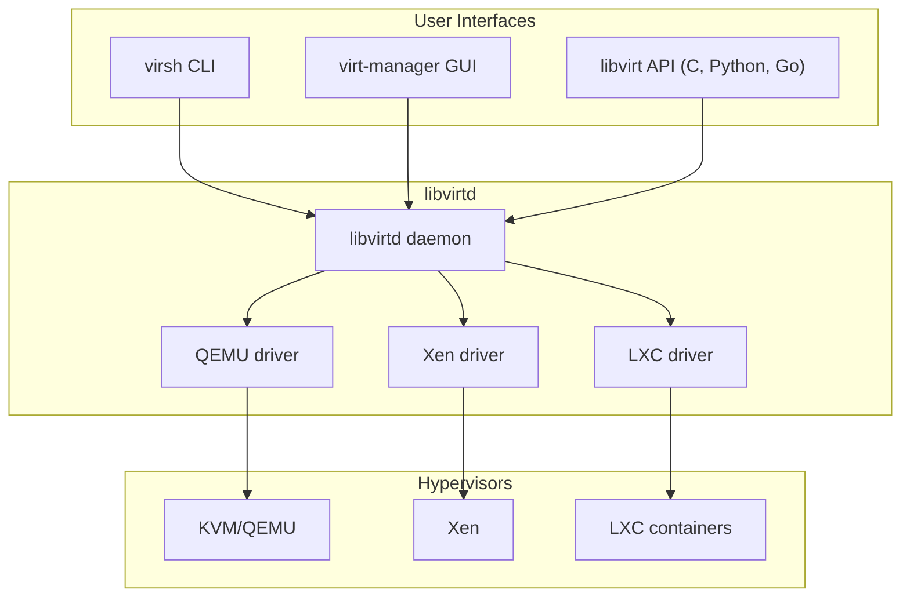

# libvirt: Virtualization Management Toolkit

libvirt is the de facto standard API and toolkit for managing virtualization
platforms on Linux. It provides a unified interface to KVM/QEMU, Xen, LXC,
and other hypervisors. This chapter covers the `virsh` command-line tool,
domain XML configuration, virtual networking, storage pools, and the
`virt-manager` GUI.

---

## 1. Architecture Overview



### 1.1 Installation

```bash
# Debian/Ubuntu
sudo apt install libvirt-daemon-system libvirt-clients qemu-kvm \
    virt-manager virtinst bridge-utils

# Fedora/RHEL
sudo dnf install libvirt libvirt-client qemu-kvm virt-manager

# Enable and start
sudo systemctl enable --now libvirtd
sudo usermod -aG libvirt $USER
sudo usermod -aG kvm $USER
```

---

## 2. virsh Commands

### 2.1 Domain (VM) Management

```bash
# List domains
virsh list                    # running
virsh list --all              # all (including stopped)

# Start / stop / restart
virsh start myvm
virsh shutdown myvm           # graceful
virsh destroy myvm            # force stop (like pulling the power)
virsh reboot myvm

# Suspend / resume
virsh suspend myvm
virsh resume myvm

# Autostart
virsh autostart myvm
virsh autostart --disable myvm

# Console access
virsh console myvm            # serial console
virsh vncdisplay myvm         # show VNC display

# Delete
virsh undefine myvm --remove-all-storage
```

### 2.2 Information and Monitoring

```bash
# VM info
virsh dominfo myvm
# Name:           myvm
# UUID:           12345678-1234-1234-1234-123456789abc
# OS Type:        hvm
# State:          running
# CPU(s):         4
# Max memory:     4194304 KiB
# Used memory:    4194304 KiB

# CPU stats
virsh cpu-stats myvm

# Block device stats
virsh domblkstat myvm vda

# Network stats
virsh domifstat myvm vnet0

# Live XML dump
virsh dumpxml myvm
```

### 2.3 Snapshots

```bash
# Create snapshot
virsh snapshot-create-as myvm snap1 "Before upgrade"

# List snapshots
virsh snapshot-list myvm

# Revert
virsh snapshot-revert myvm snap1

# Delete snapshot
virsh snapshot-delete myvm snap1
```

### 2.4 Migrate

```bash
# Live migration
virsh migrate --live myvm qemu+ssh://desthost/system

# With persistent storage
virsh migrate --live --persistent --undefinesource \
    myvm qemu+ssh://desthost/system
```

---

## 3. Domain XML

### 3.1 Anatomy of a Domain XML

```xml
<domain type='kvm'>
  <name>myvm</name>
  <uuid>12345678-1234-1234-1234-123456789abc</uuid>
  <memory unit='KiB'>4194304</memory>
  <currentMemory unit='KiB'>4194304</currentMemory>
  <vcpu placement='static'>4</vcpu>

  <os>
    <type arch='x86_64' machine='pc-q35-8.2'>hvm</type>
    <boot dev='hd'/>
    <boot dev='cdrom'/>
  </os>

  <features>
    <acpi/>
    <apic/>
    <vmport state='off'/>
  </features>

  <cpu mode='host-passthrough' check='none'>
    <topology sockets='1' dies='1' cores='4' threads='1'/>
    <feature policy='require' name='topoext'/>
  </cpu>

  <clock offset='utc'>
    <timer name='rtc' tickpolicy='catchup'/>
    <timer name='pit' tickpolicy='delay'/>
    <timer name='hpet' present='no'/>
  </clock>

  <devices>
    <emulator>/usr/bin/qemu-system-x86_64</emulator>

    <disk type='file' device='disk'>
      <driver name='qemu' type='qcow2'/>
      <source file='/var/lib/libvirt/images/myvm.qcow2'/>
      <target dev='vda' bus='virtio'/>
    </disk>

    <disk type='file' device='cdrom'>
      <driver name='qemu' type='raw'/>
      <source file='/var/lib/libvirt/images/install.iso'/>
      <target dev='sda' bus='sata'/>
      <readonly/>
    </disk>

    <interface type='network'>
      <mac address='52:54:00:12:34:56'/>
      <source network='default'/>
      <model type='virtio'/>
    </interface>

    <graphics type='vnc' port='-1' autoport='yes'/>
    <console type='pty'>
      <target type='serial' port='0'/>
    </console>

    <memballoon model='virtio'/>
  </devices>
</domain>
```

### 3.2 CPU Pinning

```xml
<cputune>
  <vcpupin vcpu='0' cpuset='0'/>
  <vcpupin vcpu='1' cpuset='1'/>
  <vcpupin vcpu='2' cpuset='2'/>
  <vcpupin vcpu='3' cpuset='3'/>
  <emulatorpin cpuset='0-1'/>
</cputune>
```

### 3.3 Memory Tuning

```xml
<memoryBacking>
  <hugepages>
    <page size='2048' unit='KiB'/>
  </hugepages>
  <locked/>
</memoryBacking>
```

### 3.4 Virtio Devices

```xml
<!-- Virtio disk -->
<disk type='file' device='disk'>
  <driver name='qemu' type='qcow2' io='native' cache='none'/>
  <source file='/var/lib/libvirt/images/data.qcow2'/>
  <target dev='vdb' bus='virtio'/>
  <address type='pci' domain='0x0000' bus='0x04' slot='0x00' function='0x0'/>
</disk>

<!-- Virtio network -->
<interface type='bridge'>
  <source bridge='br0'/>
  <model type='virtio'/>
  <driver name='vhost' queues='4'/>
</interface>
```

### 3.5 Editing Domain XML

```bash
# Edit offline config
virsh edit myvm

# Edit live config (not persistent)
virsh dumpxml myvm > /tmp/myvm.xml
# Edit /tmp/myvm.xml
virsh define /tmp/myvm.xml
```

---

## 4. Virtual Networks

### 4.1 Default NAT Network

libvirt creates a `default` NAT network automatically:

```bash
# List networks
virsh net-list --all

# Start default network
virsh net-start default
virsh net-autostart default

# Show network XML
virsh net-dumpxml default
```

Default network XML:

```xml
<network>
  <name>default</name>
  <forward mode='nat'/>
  <bridge name='virbr0' stp='on' delay='0'/>
  <ip address='192.168.122.1' netmask='255.255.255.0'>
    <dhcp>
      <range start='192.168.122.2' end='192.168.122.254'/>
      <host mac='52:54:00:12:34:56' name='myvm' ip='192.168.122.100'/>
    </dhcp>
  </ip>
</network>
```

### 4.2 Bridged Network (Direct LAN Access)

```xml
<network>
  <name>bridged</name>
  <forward mode='bridge'/>
  <bridge name='br0'/>
</network>
```

```bash
# Create host bridge (in /etc/netplan/01-bridge.yaml)
network:
  version: 2
  ethernets:
    enp0s3:
      dhcp4: no
  bridges:
    br0:
      interfaces: [enp0s3]
      dhcp4: yes
```

### 4.3 Isolated Network

```xml
<network>
  <name>isolated</name>
  <bridge name='virbr1' stp='on' delay='0'/>
  <ip address='10.0.0.1' netmask='255.255.255.0'/>
</network>
```

### 4.4 Network Types

| Mode | Forward | Use Case |
|------|---------|----------|
| `nat` | MASQUERADE | Default, VMs access internet via host |
| `bridge` | Direct | VMs appear on physical LAN |
| `route` | Routed | VMs on separate subnet, routed to LAN |
| `isolated` | None | VM-only network, no host/internet |
| `passthrough` | Direct | VM gets physical NIC |

---

## 5. Storage Pools

### 5.1 Default Storage Pool

```bash
# List pools
virsh pool-list --all

# Default location
ls /var/lib/libvirt/images/

# Pool info
virsh pool-info default
```

### 5.2 Creating Storage Pools

```bash
# Directory-based pool
virsh pool-define-as mypool dir - - - - /mnt/data/vms
virsh pool-build mypool
virsh pool-start mypool
virsh pool-autostart mypool

# LVM-based pool
virsh pool-define-as lvm-pool logical \
    - - "lvm_vg" "vg_vms" "/dev/vg_vms"
virsh pool-build lvm-pool
virsh pool-start lvm-pool
```

### 5.3 Storage Pool Types

| Type | Source | Description |
|------|--------|-------------|
| `dir` | Directory path | Simple, uses host filesystem |
| `logical` | LVM volume group | Thin provisioning, snapshots |
| `disk` | Physical disk | Raw disk access |
| `netfs` | NFS mount | Shared storage for migration |
| `iscsi` | iSCSI target | SAN-backed storage |
| `zfs` | ZFS dataset | ZFS volumes |

### 5.4 Volume Management

```bash
# Create a volume
virsh vol-create-as default myvm.qcow2 50G --format qcow2

# List volumes
virsh vol-list default

# Clone a volume
virsh vol-clone --pool default template.qcow2 myvm.qcow2

# Delete a volume
virsh vol-delete --pool default myvm.qcow2

# Resize
virsh vol-resize --pool default myvm.qcow2 100G
```

---

## 6. virt-manager

### 6.1 Features

`virt-manager` is a GTK-based GUI for libvirt:

- Create, start, stop, and delete VMs
- Live console (VNC/SPICE)
- CPU, memory, and disk hotplug
- Storage and network management
- Performance graphs (CPU, memory, network, disk I/O)

### 6.2 Remote Connections

```bash
# Connect to remote libvirt
virt-manager -c qemu+ssh://user@remotehost/system

# Or add via GUI: File → Add Connection
```

### 6.3 virt-install — CLI VM Creation

```bash
# Create a VM with virt-install
virt-install \
    --name myvm \
    --memory 4096 \
    --vcpus 4 \
    --disk size=50,format=qcow2,bus=virtio \
    --cdrom /var/lib/libvirt/images/ubuntu-24.04-live-server-amd64.iso \
    --os-variant ubuntu24.04 \
    --network network=default,model=virtio \
    --graphics vnc,listen=0.0.0.0 \
    --boot uefi \
    --noautoconsole
```

### 6.4 virt-clone

```bash
# Clone an existing VM
virt-clone \
    --original myvm \
    --name myvm-clone \
    --auto-clone

# With specific storage
virt-clone \
    --original myvm \
    --name myvm-clone \
    --file /var/lib/libvirt/images/myvm-clone.qcow2
```

---

## 7. Advanced Configuration

### 7.1 UEFI Boot (OVMF)

```bash
# Install OVMF
sudo apt install ovmf

# Use in domain XML
<os>
  <type arch='x86_64' machine='pc-q35-8.2'>hvm</type>
  <loader readonly='yes' type='pflash'>/usr/share/OVMF/OVMF_CODE_4M.fd</loader>
  <nvram>/var/lib/libvirt/qemu/nvram/myvm_VARS.fd</nvram>
  <boot dev='hd'/>
</os>
```

### 7.2 PCI Passthrough

```xml
<hostdev mode='subsystem' type='pci' managed='yes'>
  <source>
    <address domain='0x0000' bus='0x01' slot='0x00' function='0x0'/>
  </source>
</hostdev>
```

### 7.3 USB Passthrough

```xml
<hostdev mode='subsystem' type='usb' managed='yes'>
  <source>
    <vendor id='0x046d'/>
    <product id='0xc52b'/>
  </source>
</hostdev>
```

### 7.4 Virtio-FS Shared Filesystem

```xml
<!-- Host -->
<filesystem type='mount' accessmode='passthrough'>
  <driver type='virtiofs'/>
  <source dir='/home/user/shared'/>
  <target dir='shared'/>
</filesystem>

<!-- Memory backing required for virtiofs -->
<memoryBacking>
  <source type='memfd'/>
  <access mode='shared'/>
</memoryBacking>
```

---

## 8. libvirt Hooks

### 8.1 Hook Scripts

libvirt can run scripts before/after VM lifecycle events:

```bash
# /etc/libvirt/hooks/qemu
#!/bin/bash
VM_NAME=$1
EVENT=$2
DETAIL=$3

case "$EVENT" in
    start)
        logger "VM $VM_NAME starting"
        # Set up firewall rules, etc.
        ;;
    stopped)
        logger "VM $VM_NAME stopped"
        # Clean up
        ;;
    migrate)
        logger "VM $VM_NAME migrating"
        ;;
esac
```

### 8.2 QEMU Hooks Directory

```bash
# Per-VM hooks
/etc/libvirt/hooks/qemu.d/myvm/start/begin/01-setup.sh
/etc/libvirt/hooks/qemu.d/myvm/stopped/end/01-cleanup.sh
```

---

## 9. Remote Access and API

### 9.1 SSH Tunneling

```bash
# Connect to remote libvirt
virsh -c qemu+ssh://root@remotehost/system list --all
```

### 9.2 TCP/TLS Access

```bash
# Enable TCP listener in /etc/libvirt/libvirtd.conf
listen_tls = 1
listen_tcp = 1
auth_tcp = "sasl"

# libvirtd.conf: set listen_addr
listen_addr = "0.0.0.0"
```

### 9.3 Python API

```python
import libvirt

conn = libvirt.open('qemu:///system')
if conn is None:
    print('Failed to connect')
    exit(1)

# List running domains
for domain in conn.listAllDomains():
    if domain.isActive():
        print(f"  {domain.name()} (ID {domain.ID()})")

conn.close()
```

---

## Further Reading

- [libvirt Documentation — libvirt.org](https://libvirt.org/docs.html)
- [virsh man page](https://libvirt.org/manpages/virsh.html)
- [Domain XML Format — libvirt.org](https://libvirt.org/formatdomain.html)
- [Network XML Format — libvirt.org](https://libvirt.org/formatnetwork.html)
- [Storage XML Format — libvirt.org](https://libvirt.org/formatstorage.html)
- [KVM Documentation — docs.kernel.org](https://docs.kernel.org/virt/kvm/index.html)
- [virt-manager GitHub](https://github.com/virt-manager/virt-manager)
- [libvirt Python bindings](https://libvirt.org/python.html)
- [OVMF/UEFI for QEMU](https://github.com/tianocore/tianocore.github.io/wiki/OVMF)
