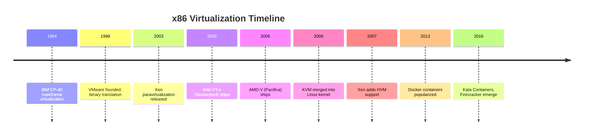
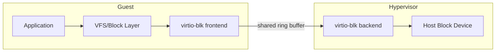
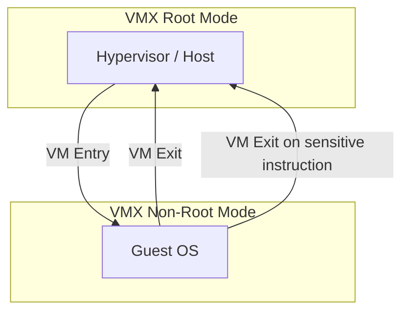
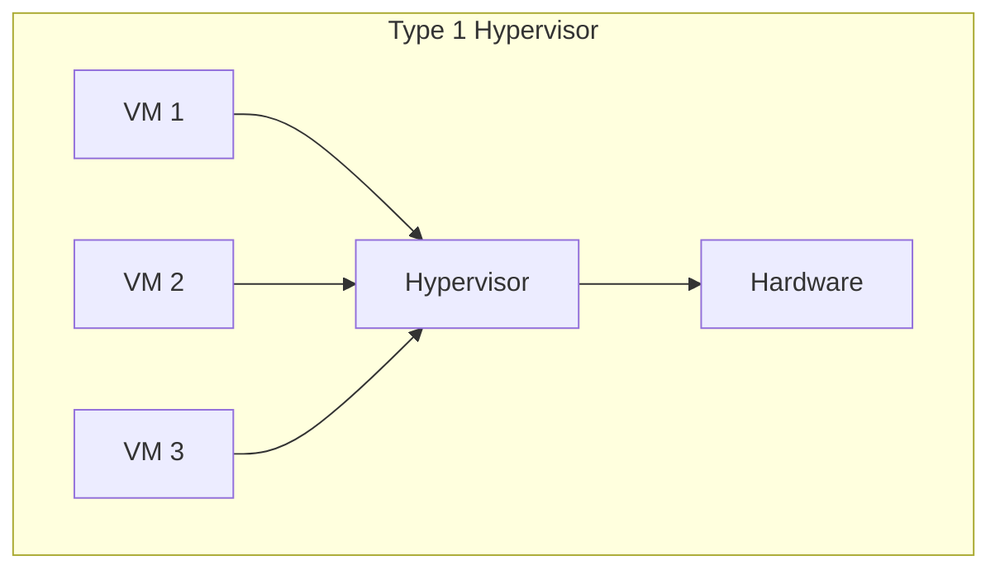
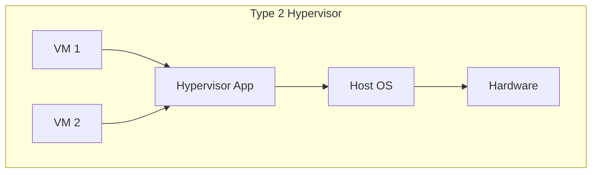
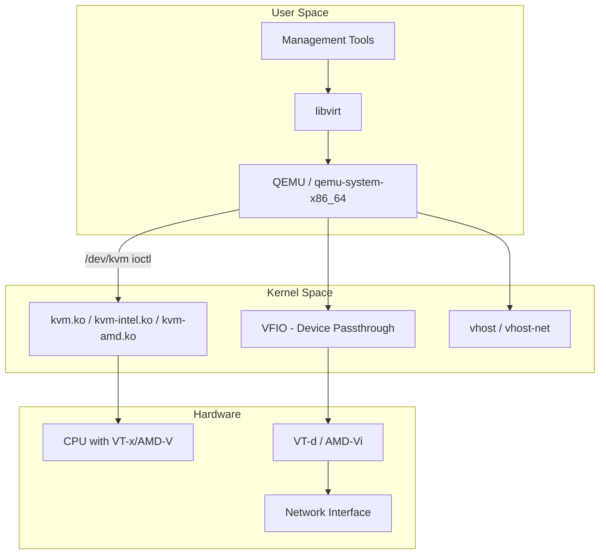
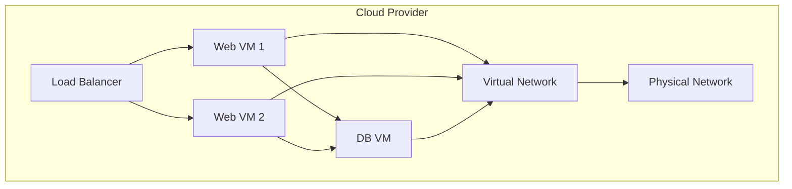
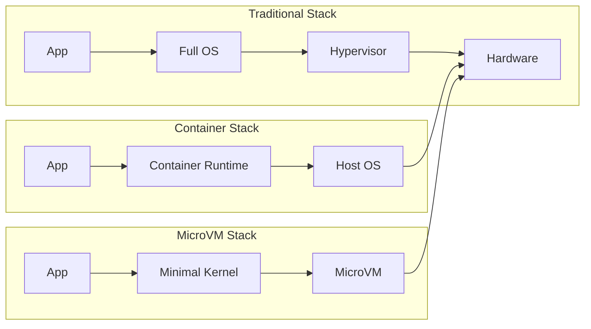

# Virtualization Overview

## Introduction

Virtualization is the foundational technology that enables a single physical machine to run multiple isolated operating system instances simultaneously. It underpins modern cloud computing, data center consolidation, development workflows, and increasingly, desktop computing. Understanding virtualization requires grasping hardware architecture, CPU privilege rings, memory management, and the delicate dance between software and silicon.

This chapter surveys the landscape of virtualization technologies on Linux, from full hardware emulation to lightweight paravirtualization, and examines the hypervisors that make it all possible.

## Historical Context

IBM pioneered virtualization in the 1960s with the CP-40 and CP-67 systems on mainframes. The idea lay largely dormant in the x86 world until the early 2000s, when VMware and the open-source Xen project brought it to commodity hardware. The x86 architecture was originally not designed to be virtualizable — a fact that shaped two decades of engineering workarounds.

### The x86 Virtualization Problem

Classic x86 has four privilege rings (Ring 0–3). The operating system runs in Ring 0 (kernel mode), and applications in Ring 3 (user mode). A hypervisor also needs Ring 0, creating a conflict. Popek and Goldberg's 1974 virtualization requirements state that a virtualizable architecture must trap all sensitive instructions — instructions that modify or query privileged state. On x86, 17 instructions are "sensitive but unprivileged" (e.g., `POPF`, `SGDT`), meaning they silently fail or behave differently in user mode rather than trapping to the hypervisor.

This deficiency led to two solutions:

1. **Binary translation** — dynamically rewriting problematic instructions at runtime (VMware's original approach)
2. **Paravirtualization** — modifying the guest OS to explicitly call the hypervisor via hypercalls (Xen's approach)
3. **Hardware-assisted virtualization** — adding new CPU modes that resolve the conflict (Intel VT-x, AMD-V)



## Types of Virtualization

### Full Virtualization

Full virtualization presents a complete virtual hardware platform to the guest operating system. The guest is unmodified — it believes it is running on real hardware. All hardware devices are emulated in software.

**Characteristics:**
- Guest OS is completely unmodified
- Full hardware emulation (CPU, memory, disk, network, display)
- Strong isolation between guest and host
- Higher overhead due to emulation
- Can run any operating system (including proprietary ones)

**Approaches to full virtualization:**

| Approach | Mechanism | Examples |
|----------|-----------|----------|
| Software emulation | Interpret or translate every instruction | QEMU (TCG), Bochs |
| Binary translation | Rewrite sensitive instructions at runtime | VMware Workstation (legacy) |
| Hardware-assisted | CPU provides native virtualization support | KVM, Hyper-V, modern VMware |

**Software Emulation Example (QEMU TCG):**

```bash
# Run an ARM guest on an x86 host using QEMU's Tiny Code Generator
qemu-system-aarch64 \
  -machine virt \
  -cpu cortex-a72 \
  -m 2048 \
  -kernel Image \
  -dtb virt.dtb \
  -append "console=ttyAMA0" \
  -nographic

# The guest ARM instructions are translated to x86 at runtime
# Performance: ~5-10x slower than native
```

### Paravirtualization (PV)

Paravirtualization modifies the guest operating system kernel to replace privileged operations with explicit calls to the hypervisor (hypercalls). The guest "knows" it is virtualized and cooperates with the hypervisor.

**Characteristics:**
- Guest OS is modified to use hypercalls
- No need for binary translation or hardware assist
- Better performance than software-based full virtualization
- Cannot run unmodified operating systems (Windows, proprietary OSes)
- Requires a paravirtualized frontend/backend driver model for I/O

**Hypercall mechanism:**

```c
/* Xen hypercall example — guest requesting memory mapping */
static inline int HYPERVISOR_update_va_mapping(
    unsigned long va, pte_t new_val, unsigned long flags)
{
    struct mmuext_op op;
    op.cmd = MMUEXT_UPDATE_ONLY_VA_MAPPING;
    op.arg1.linear_addr = va;
    op.arg2.pte = new_val;
    return HYPERVISOR_mmuext_op(&op, 1, NULL, DOMID_SELF);
}

/* The VMCALL/VMINSTRUCTION traps to the hypervisor */
/* On x86: INT 0x82 (Xen) or VMCALL (KVM hypercall) */
```

**Paravirtualized I/O (virtio model):**



### Hardware-Assisted Virtualization

Hardware-assisted virtualization adds new CPU operating modes that resolve the x86 virtualization deficiency. The CPU itself traps sensitive instructions, allowing the hypervisor to run in a new, more privileged mode.

#### Intel VT-x (Virtualization Technology for x86)

Intel VT-x introduces two new CPU modes:

- **VMX root mode** — for the hypervisor (host)
- **VMX non-root mode** — for the guest

The transition between these modes is managed by a data structure called the **VMCS** (Virtual Machine Control Structure).



**Key VT-x features:**
- **VMCS** — 4KB page per vCPU storing guest/host state, exit controls
- **VM Entry/Exit** — hardware-managed transitions between root and non-root mode
- **EPT** (Extended Page Tables) — hardware-assisted two-level address translation for guest physical → host physical
- **VPID** (Virtual Processor ID) — avoids TLB flushes on VM entry/exit
- **VMFUNC** — allows guest to perform certain operations without VM exit

#### AMD-V (AMD Virtualization / SVM)

AMD-V provides similar functionality with different terminology:

- **VMCB** (Virtual Machine Control Block) — analogous to Intel's VMCS
- **NPT** (Nested Page Tables) — analogous to Intel's EPT
- **ASID** (Address Space ID) — analogous to Intel's VPID

```bash
# Check if hardware virtualization is available
# Intel:
grep -c vmx /proc/cpuinfo
# AMD:
grep -c svm /proc/cpuinfo

# Check kernel module loaded
lsmod | grep kvm
# Expected output:
# kvm_intel              380928  0
# kvm                   1089536  1 kvm_intel
# or
# kvm_amd                151552  0
# kvm                   1089536  1 kvm_amd
```

## Hypervisor Classification

### Type 1 (Bare-Metal) Hypervisors

Type 1 hypervisors run directly on hardware without a host operating system. The hypervisor itself IS the operating system (or runs alongside a minimal management partition).



**Examples:**

| Hypervisor | License | Notes |
|-----------|---------|-------|
| VMware ESXi | Proprietary | Dominant in enterprise data centers |
| Xen | GPL v2 | Used by AWS, many cloud providers |
| Hyper-V | Proprietary | Microsoft's hypervisor, runs Windows/Linux guests |
| KVM | GPL v2 | Part of Linux kernel, often categorized as Type 1 |

> **Note:** KVM's classification is debated. Since it turns the Linux kernel itself into a hypervisor, and Linux has a full host OS stack, some classify it as Type 2. However, since KVM runs in kernel mode and the host OS is not a prerequisite for VM execution, others consider it Type 1.

### Type 2 (Hosted) Hypervisors

Type 2 hypervisors run as applications on a conventional host operating system.



**Examples:**

| Hypervisor | License | Notes |
|-----------|---------|-------|
| VirtualBox | GPL v2 | Oracle-maintained, cross-platform |
| VMware Workstation | Proprietary | Desktop virtualization, VMware Fusion for macOS |
| QEMU (standalone) | GPL v2 | Full software emulation, no host kernel module |
| Parallels | Proprietary | macOS-focused |

## Hypervisor Comparison

### Feature Matrix

| Feature | KVM | Xen | VMware ESXi | VirtualBox | Hyper-V |
|---------|-----|-----|-------------|------------|---------|
| Type | 1 (kernel module) | 1 (bare-metal) | 1 (bare-metal) | 2 (hosted) | 1 (bare-metal) |
| License | GPL v2 | GPL v2 | Proprietary | GPL v2 | Proprietary |
| Full virtualization | ✅ | ✅ | ✅ | ✅ | ✅ |
| Paravirtualization | ✅ (virtio) | ✅ (native PV) | ✅ (PV drivers) | ✅ (virtio) | ✅ (Enlighten) |
| Hardware assist | VT-x/AMD-V | VT-x/AMD-V | VT-x/AMD-V | VT-x/AMD-V | VT-x/AMD-V |
| Nested virtualization | ✅ | ✅ | ✅ | ✅ | ✅ |
| Live migration | ✅ | ✅ | ✅ | ✅ | ✅ |
| Hot-plug CPU/RAM | ✅ | ✅ | ✅ | ❌ | ✅ |
| SR-IOV | ✅ | ✅ | ✅ | ❌ | ✅ |
| GPU passthrough | ✅ | ✅ | ✅ | Limited | ✅ |
| Max vCPUs per VM | 710+ | 512+ | 768 | 32 | 2048 |
| Memory overhead | Low | Low | Low | Medium | Low |

### Performance Considerations

```bash
# Benchmarking virtualization overhead with UnixBench
# Native:
./Run -c 1 -c $(nproc) dhry2reg whetstone-double

# Inside KVM VM:
# Typical overhead: 2-5% for CPU-bound workloads
# Typical overhead: 5-15% for I/O-bound workloads (without virtio)
# Typical overhead: 1-3% for I/O-bound workloads (with virtio)
```

## KVM Architecture Overview

KVM (Kernel-based Virtual Machine) is the primary virtualization technology in Linux. It transforms the Linux kernel into a hypervisor by leveraging hardware-assisted virtualization.



### The `/dev/kvm` Interface

KVM exposes a character device `/dev/kvm` that provides the userspace API:

```bash
# KVM device permissions
ls -la /dev/kvm
# crw-rw----+ 1 root kvm 10, 232 Jul 21 10:00 /dev/kvm

# System call flow for creating a VM:
# 1. open("/dev/kvm")           → get KVM file descriptor
# 2. ioctl(kvm_fd, KVM_GET_API_VERSION) → verify API version (12)
# 3. ioctl(kvm_fd, KVM_CREATE_VM)       → create a VM instance
# 4. ioctl(vm_fd, KVM_SET_USER_MEMORY_REGION) → map guest memory
# 5. ioctl(vm_fd, KVM_CREATE_VCPU)      → create a virtual CPU
# 6. mmap(vcpu_fd, KVM_RUN)             → enter guest mode
# 7. ioctl(vcpu_fd, KVM_RUN)            → run the vCPU
```

**Minimal KVM example in C:**

```c
#include <stdio.h>
#include <stdlib.h>
#include <fcntl.h>
#include <sys/ioctl.h>
#include <sys/mman.h>
#include <linux/kvm.h>

int main() {
    int kvm_fd = open("/dev/kvm", O_RDWR | O_CLOEXEC);
    int api_ver = ioctl(kvm_fd, KVM_GET_API_VERSION, 0);
    printf("KVM API version: %d\n", api_ver);

    int vm_fd = ioctl(kvm_fd, KVM_CREATE_VM, 0);

    // Allocate 4KB of guest memory
    void *mem = mmap(NULL, 0x1000, PROT_READ | PROT_WRITE,
                     MAP_SHARED | MAP_ANONYMOUS, -1, 0);

    // Map guest physical address 0x0 to our memory
    struct kvm_userspace_memory_region region = {
        .slot = 0,
        .guest_phys_addr = 0,
        .memory_size = 0x1000,
        .userspace_addr = (__u64)mem,
    };
    ioctl(vm_fd, KVM_SET_USER_MEMORY_REGION, &region);

    // Write x86 HLT instruction at guest address 0x0
    // This is the simplest possible guest program
    char *code = (char *)mem;
    code[0] = 0xF4; // HLT

    int vcpu_fd = ioctl(vm_fd, KVM_CREATE_VCPU, 0);

    // Map the kvm_run structure
    struct kvm_run *run = mmap(NULL, sizeof(struct kvm_run),
                               PROT_READ | PROT_WRITE, MAP_SHARED,
                               vcpu_fd, 0);

    // Configure segment registers for flat real mode
    struct kvm_sregs sregs;
    ioctl(vcpu_fd, KVM_GET_SREGS, &sregs);
    sregs.cs.base = 0;
    sregs.cs.selector = 0;
    ioctl(vcpu_fd, KVM_SET_SREGS, &sregs);

    struct kvm_regs regs = {
        .rip = 0,
        .rflags = 0x2, // bit 1 always set
    };
    ioctl(vcpu_fd, KVM_SET_REGS, &regs);

    // Run the VM
    ioctl(vcpu_fd, KVM_RUN, 0);

    printf("VM exit reason: %d\n", run->exit_reason);
    // Expected: KVM_EXIT_HLT (5)

    return 0;
}
```

## Virtualization Use Cases

### Cloud Computing



- **IaaS** — AWS EC2, GCP Compute Engine, Azure VMs
- **Multi-tenancy** — strong isolation between customers
- **Elastic scaling** — spin up/down VMs on demand

### Development and Testing

```bash
# Quick VM for testing with libvirt
virt-install \
  --name test-vm \
  --ram 2048 \
  --vcpus 2 \
  --disk size=20 \
  --os-variant ubuntu22.04 \
  --network default \
  --graphics none \
  --console pty,target_type=serial \
  --location 'http://archive.ubuntu.com/ubuntu/dists/jammy/main/installer-amd64/' \
  --extra-args 'console=ttyS0,115200n8 serial'

# Snapshot before risky changes
virsh snapshot-create-as test-vm pre-change "Before risky update"
# ... make changes ...
# Rollback if needed
virsh snapshot-revert test-vm pre-change
```

### Security Isolation

- **Sandboxing** — run untrusted code in isolated VMs
- **Confidential computing** — AMD SEV, Intel TDX encrypt VM memory
- **MicroVMs** — Firecracker, Kata Containers for lightweight isolation

## Modern Trends

### MicroVMs

MicroVMs strip down the traditional VM to essentials, trading device flexibility for speed:

```bash
# Firecracker microVM startup time: ~125ms
# Memory overhead: ~5MB per VM
# Designed for serverless (AWS Lambda uses Firecracker)

# Kata Containers: VM isolation with container semantics
# Each container runs in its own lightweight VM
```

### Confidential Computing

```bash
# AMD SEV (Secure Encrypted Virtualization)
# Encrypts VM memory with per-VM keys
# Hypervisor cannot read guest memory
qemu-system-x86_64 \
  -machine q35,confidential-guest-support=sev0 \
  -object sev-guest,id=sev0,cbitpos=47,reduced-phys-bits=1 \
  ...

# Intel TDX (Trust Domain Extensions)
# Similar concept, different implementation
# Hardware-enforced memory encryption and integrity
```

### Container vs VM Convergence



## References

1. Popek, G. J., & Goldberg, R. P. (1974). "Formal Requirements for Virtualizable Third Generation Architectures." *Communications of the ACM*, 17(7).
2. Adams, K., & Agesen, O. (2006). "A Comparison of Software and Hardware Techniques for x86 Virtualization." *ASPLOS '06*.
3. Intel. "Intel® 64 and IA-32 Architectures Software Developer's Manual, Volume 3C." [https://www.intel.com/sdm](https://www.intel.com/sdm)
4. AMD. "AMD64 Architecture Programmer's Manual, Volume 2: System Programming." [https://www.amd.com/en/support/tech-docs](https://www.amd.com/en/support/tech-docs)
5. KVM Documentation. [https://www.kernel.org/doc/html/latest/virt/kvm/](https://www.kernel.org/doc/html/latest/virt/kvm/)

## Further Reading

- [The Linux Kernel Documentation](https://docs.kernel.org/)
- [LWN.net - Linux and free software news](https://lwn.net/)
- [GNU Project Documentation](https://www.gnu.org/doc/doc.html)
- [GNU Manuals](https://www.gnu.org/manual/manual.html)
- [Free Software Directory](https://directory.fsf.org/wiki/Main_Page)
- [Planet GNU](https://planet.gnu.org/)
- [Free Software Books](https://www.gnu.org/doc/other-free-books.html)

- [KVM Documentation — kernel.org](https://www.kernel.org/doc/html/latest/virt/kvm/)
- [Xen Project Wiki](https://wiki.xenproject.org/)
- [QEMU Documentation](https://www.qemu.org/docs/master/)
- [Firecracker Design](https://firecracker-microvm.github.io/)
- [Confidential Computing Consortium](https://confidentialcomputing.io/)
- [VMware Virtualization Basics](https://www.vmware.com/topics/glossary/content/virtualization)

## Related Topics

- [KVM Internals](./kvm.md) — deep dive into KVM's kernel implementation
- [QEMU](./qemu.md) — device emulation and VM management
- [Xen Hypervisor](./xen.md) — paravirtualization and the Xen architecture
- [Container Overview](../containers/overview.md) — lightweight virtualization alternatives
- [Embedded Linux](../embedded/overview.md) — virtualization in embedded contexts
