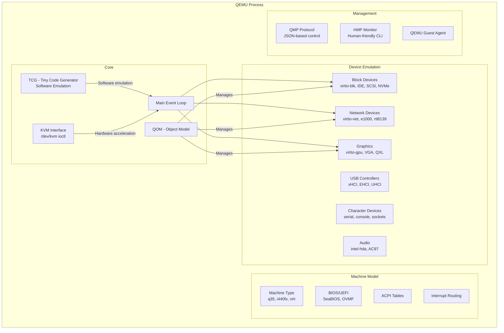
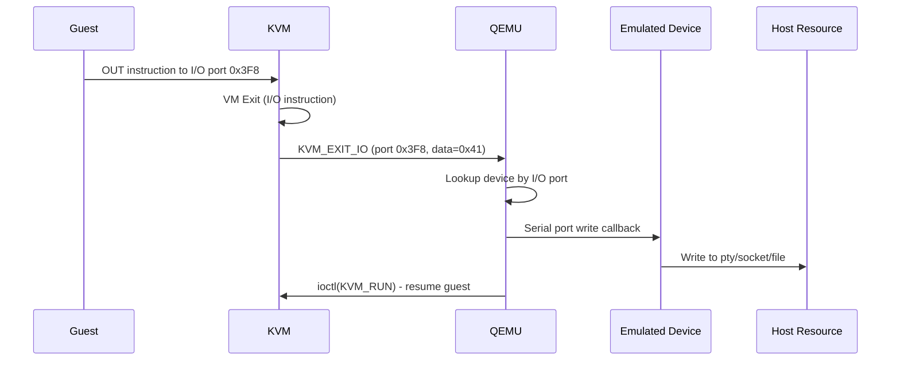
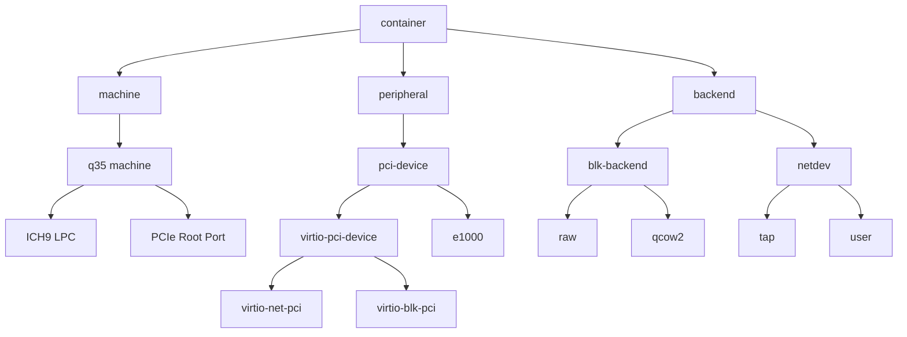

# QEMU

## Introduction

QEMU (Quick Emulator) is a versatile open-source machine emulator and virtualizer. As an emulator, it can run operating systems and programs for one architecture on a completely different architecture (e.g., ARM on x86). As a virtualizer, combined with KVM or Xen, it achieves near-native performance by executing guest code directly on the host CPU.

QEMU is the de facto standard userspace component for KVM-based virtualization on Linux. It provides device emulation, machine modeling, firmware loading, and management interfaces that complement KVM's kernel-level CPU and memory virtualization.

## Architecture Overview



## QEMU Operating Modes

### Full System Emulation

QEMU emulates an entire machine, including CPU, memory, and all peripherals. The guest OS runs unmodified.

```bash
# x86_64 system emulation (no KVM — pure software)
qemu-system-x86_64 \
  -machine q35 \
  -cpu qemu64 \
  -m 2048 \
  -drive file=disk.qcow2,format=qcow2 \
  -cdrom install.iso \
  -boot d \
  -display gtk

# ARM system emulation on x86 host
qemu-system-aarch64 \
  -machine virt \
  -cpu cortex-a72 \
  -m 4096 \
  -drive file=arm64-disk.qcow2,if=virtio \
  -kernel Image \
  -dtb virt.dtb \
  -append "root=/dev/vda console=ttyAMA0" \
  -nographic

# RISC-V system emulation
qemu-system-riscv64 \
  -machine virt \
  -cpu rv64 \
  -m 1024 \
  -kernel Image \
  -append "root=/dev/vda" \
  -drive file=riscv64-disk.qcow2,if=virtio \
  -nographic
```

### User-Mode Emulation

QEMU can run individual Linux binaries compiled for another architecture without a full system:

```bash
# Run an ARM binary on x86 host
qemu-aarch64 ./hello_arm64

# Run with a custom library path (chroot-like)
qemu-aarch64 -L /usr/aarch64-linux-gnu/ ./hello_arm64

# Register binfmt_misc for transparent execution
# (usually done by the qemu-user-binfmt package)
echo ':qemu-aarch64:M::\x7fELF\x02\x01\x01\x00\x00\x00\x00\x00\x00\x00\x00\x00\x02\x00\xb7:\xff\xff\xff\xff\xff\xff\xff\x00\xff\xff\xff\xff\xff\xff\xff\xff\xfe\xff\xff:/usr/bin/qemu-aarch64:' \
  > /proc/sys/fs/binfmt_misc/register

# Now ARM binaries can be executed directly!
./hello_arm64  # Transparently runs via qemu-aarch64
```

### KVM Acceleration

When running on a Linux host with KVM, QEMU delegates CPU execution to the kernel:

```bash
# KVM-accelerated x86 on x86
qemu-system-x86_64 -enable-kvm -cpu host -m 4096 ...

# Check acceleration status
qemu-system-x86_64 -accel help
# Accelerators: kvm, tcg

# Performance comparison
# TCG (software): ~5-10% of native
# KVM (hardware): ~95-99% of native
```

## Device Emulation

QEMU provides hundreds of emulated devices. These fall into several categories:

### Device Categories

```mermaid
graph TB
    subgraph Storage
        IDE[IDE/ATA PIIX4, ICH6]
        SCSI[SCSI LSI53C895A, virtio-scsi]
        NVMe_NVMe[NVMe]
        VIRTIO_BLK[virtio-blk]
        FLOPPY[Floppy]
        SD[SD card]
    end
    subgraph Network
        E1000[Intel e1000]
        RTL8139[Realtek RTL8139]
        VIRTIO_NET[virtio-net]
        VMXNET3[VMware vmxnet3]
    end
    subgraph Display
        VGA[VGA/Cirrus]
        QXL[QXL (SPICE)]
        VIRTIO_GPU[virtio-gpu]
        BOCHS[Bochs Display]
    end
    subgraph USB
        XHCI[xHCI]
        EHCI[EHCI]
        UHCI[UHCI]
    end
```

### Device Emulation Flow

When a guest accesses an emulated device, the flow is:



### Adding Devices

```bash
# Add a virtio NIC
qemu-system-x86_64 \
  -device virtio-net-pci,netdev=net0,mac=52:54:00:12:34:56 \
  -netdev tap,id=net0,script=no,downscript=no

# Add a virtio disk
qemu-system-x86_64 \
  -device virtio-blk-pci,drive=drv0,bootindex=1 \
  -drive file=disk.qcow2,format=qcow2,if=none,id=drv0 \
  -drive file=scratch.raw,format=raw,if=none,id=drv1 \
  -device virtio-blk-pci,drive=drv1

# Add a USB controller and device
qemu-system-x86_64 \
  -device qemu-xhci,id=xhci \
  -device usb-storage,drive=usbstick,bus=xhci.0 \
  -drive file=usb.img,format=raw,if=none,id=usbstick

# Hot-plug a device at runtime via QMP
# {"execute": "device_add", "arguments": {"driver": "virtio-net-pci", "id": "nic1", "netdev": "net1"}}
```

## QOM (QEMU Object Model)

QOM is QEMU's object-oriented framework for modeling all objects in the system: devices, buses, machines, backends, and more.

### QOM Hierarchy



### QOM Device Model

Each emulated device is a QOM object with:
- **Properties** — configurable parameters (e.g., MAC address, drive)
- **Realize** — initialization when the device becomes "real"
- **Methods** — MMIO/PIO read/write callbacks, reset, etc.

```c
/* QOM device definition (simplified) */
static void my_device_class_init(ObjectClass *klass, void *data) {
    DeviceClass *dc = DEVICE_CLASS(klass);
    
    dc->desc = "My Custom Device";
    dc->realize = my_device_realize;
    dc->reset = my_device_reset;
    
    /* Define properties */
    object_class_property_add_bool(klass, "enabled",
        my_device_get_enabled, my_device_set_enabled);
}

/* Register the device type */
static const TypeInfo my_device_info = {
    .name = "my-device",
    .parent = "pci-device",
    .instance_size = sizeof(MyDevice),
    .class_init = my_device_class_init,
};

/* Query QOM tree from QEMU monitor */
/* (qemu) qom-tree /machine/unattached/device[0] */
```

### Querying QOM

```bash
# List QOM tree from QEMU monitor
(qemu) qom-list /
# (qemu) qom-list /machine
# (qemu) qom-get /machine/unattached/isa-serial[0] backend

# QMP JSON API
echo '{"execute": "qom-list", "arguments": {"path": "/"}}' | \
  socat - UNIX-CONNECT:/tmp/qemu-monitor.sock
```

## Machine Types

QEMU defines machine types that specify the chipset, bus topology, and default devices:

### x86 Machine Types

| Machine | Chipset | Default | Use Case |
|---------|---------|---------|----------|
| `pc` (i440fx) | Intel 440FX | IDE, PCI | Legacy compatibility |
| `q35` | Intel Q35/ICH9 | PCIe, AHCI | Modern workloads |
| `microvm` | Minimal | virtio-mmio | MicroVMs, fast boot |
| `isapc` | ISA only | ISA devices | Very old OSes |

```bash
# List available machine types
qemu-system-x86_64 -machine help

# q35 is recommended for modern VMs
qemu-system-x86_64 -machine q35,accel=kvm \
  -cpu host \
  -m 4096 \
  -drive file=disk.qcow2,format=qcow2,if=none,id=drv0 \
  -device virtio-blk-pci,drive=drv0 \
  ...

# microvm for minimal, fast-booting VMs
qemu-system-x86_64 -machine microvm,accel=kvm \
  -cpu host \
  -m 512 \
  -kernel bzImage \
  -append "console=ttyS0" \
  -nographic
# Boots in ~125ms with Firecracker-like performance
```

### ARM Machine Types

```bash
# List ARM64 machine types
qemu-system-aarch64 -machine help

# virt is the standard ARM virtual platform
qemu-system-aarch64 -machine virt \
  -cpu cortex-a72 \
  -m 2048 \
  -drive file=arm64.qcow2,if=virtio \
  -nographic
```

## Virtio

Virtio is the paravirtualized I/O framework that provides high-performance device emulation. Instead of emulating real hardware (which causes many VM exits), virtio uses shared memory ring buffers between guest and host.

### Virtio Architecture


### Virtio Transport Types

| Transport | Mechanism | Performance |
|-----------|-----------|-------------|
| virtio-pci | PCI config space + MMIO | High |
| virtio-mmio | Memory-mapped I/O | High (ARM) |
| vhost-net | In-kernel virtio backend | Very high |
| vhost-user | Userspace backend (DPDK) | Highest |

### Virtio Devices

```bash
# virtio-blk — block device
qemu-system-x86_64 \
  -device virtio-blk-pci,drive=drv0 \
  -drive file=disk.qcow2,format=qcow2,if=none,id=drv0

# virtio-scsi — SCSI controller (supports many LUNs)
qemu-system-x86_64 \
  -device virtio-scsi-pci,id=scsi0 \
  -device scsi-hd,bus=scsi0.0,drive=drv0 \
  -drive file=disk.qcow2,format=qcow2,if=none,id=drv0

# virtio-net — network device
qemu-system-x86_64 \
  -device virtio-net-pci,netdev=net0 \
  -netdev tap,id=net0,script=no,vhost=on

# virtio-gpu — graphics
qemu-system-x86_64 \
  -device virtio-gpu-pci \
  -display gtk,gl=on

# virtio-fs — shared filesystem (virtiofsd)
qemu-system-x86_64 \
  -chardev socket,id=char0,path=/tmp/vhost-fs.sock \
  -device vhost-user-fs-pci,chardev=char0,tag=myfs

# virtio-vsock — host-guest communication
qemu-system-x86_64 \
  -device vhost-vsock-pci,guest-cid=3
```

### Virtio Performance

```bash
# Benchmark virtio-blk vs IDE
# virtio-blk: ~500K IOPS (4K random read)
# IDE emulation: ~10K IOPS (4K random read)
# ~50x improvement

# Benchmark virtio-net vs e1000
# virtio-net: ~10 Gbps
# e1000: ~1 Gbps
# vhost-net adds another ~30% improvement over QEMU backend
```

## QEMU Image Formats

### QCOW2

QCOW2 (QEMU Copy-On-Write version 2) is the most commonly used disk image format:

```bash
# Create a QCOW2 image
qemu-img create -f qcow2 disk.qcow2 50G

# QCOW2 features:
# - Sparse allocation (only uses host space as needed)
# - Snapshots (internal and external)
# - Compression (zlib, zstd)
# - Encryption (LUKS)
# - Backing files (copy-on-write chains)

# Create with backing file (copy-on-write)
qemu-img create -f qcow2 -b base.qcow2 -F qcow2 overlay.qcow2

# Inspect image
qemu-img info disk.qcow2
# image: disk.qcow2
# file format: qcow2
# virtual size: 50 GiB (53687091200 bytes)
# disk size: 1.2 GiB
# cluster_size: 65536
# Format specific information:
#     compat: 1.1
#     compression type: zlib
#     lazy refcounts: false
#     refcount bits: 16
#     corrupt: false
#     extended l2: false

# Create snapshot
qemu-img snapshot -c snap1 disk.qcow2

# List snapshots
qemu-img snapshot -l disk.qcow2

# Convert between formats
qemu-img convert -f qcow2 -O raw disk.qcow2 disk.raw
```

### Image Format Comparison

| Format | Sparse | Snapshots | Compression | Backing Files |
|--------|--------|-----------|-------------|---------------|
| qcow2 | ✅ | ✅ | ✅ | ✅ |
| raw | ✅* | ❌ | ❌ | ❌ |
| vmdk | ✅ | ✅ | ❌ | ✅ |
| vdi | ✅ | ✅ | ❌ | ✅ |
| vhdx | ✅ | ❌ | ✅ | ❌ |

*Raw images are sparse when created on a filesystem that supports sparse files.

## QMP (QEMU Machine Protocol)

QMP is a JSON-based protocol for controlling QEMU programmatically:

### QMP Connection

```bash
# Start QEMU with QMP socket
qemu-system-x86_64 \
  -qmp unix:/tmp/qmp.sock,server,nowait \
  ...

# Connect via socat
socat - UNIX-CONNECT:/tmp/qmp.sock

# Initial handshake
# QMP sends: {"QMP": {"version": {"qemu": {"micro": 0, "minor": 2, "major": 8}}, "capabilities": []}}
# Send: {"execute": "qmp_capabilities"}
# Response: {"return": {}}
```

### Common QMP Commands

```bash
# Query VM status
{"execute": "query-status"}

# Query CPUs
{"execute": "query-cpus-fast"}

# Query block devices
{"execute": "query-block"}

# Take a screenshot
{"execute": "screendump", "arguments": {"filename": "/tmp/screen.ppm"}}

# Create a snapshot
{"execute": "blockdev-snapshot-sync", "arguments": {
    "device": "drv0",
    "snapshot-file": "/tmp/snap.qcow2"
}}

# Hot-plug a CPU
{"execute": "device_add", "arguments": {
    "driver": "virtio-net-pci",
    "id": "nic1",
    "netdev": "net1"
}}

# Migrate to another host
{"execute": "migrate", "arguments": {
    "uri": "tcp:destination:4444"
}}

# Query migration status
{"execute": "query-migrate"}
```

### libvirt Integration

libvirt is the most common management layer for QEMU/KVM:

```bash
# Define a VM from XML
virsh define vm.xml

# Start/stop
virsh start myvm
virsh shutdown myvm
virsh destroy myvm  # Force stop

# List VMs
virsh list --all

# Connect to console
virsh console myvm

# Live migrate
virsh migrate --live myvm qemu+ssh://dest/system

# Snapshot
virsh snapshot-create-as myvm snap1 "Before update"
virsh snapshot-revert myvm snap1
```

## Buildroot / Yocto Integration

QEMU is heavily used in embedded Linux development:

```bash
# Buildroot: run QEMU target
cd buildroot
make qemu_x86_64_defconfig
make
qemu-system-x86_64 \
  -M pc \
  -kernel output/images/bzImage \
  -drive file=output/images/rootfs.ext4,if=virtio,format=raw \
  -append "root=/dev/vda console=ttyS0" \
  -nographic \
  -net nic,model=virtio \
  -net user

# Yocto: run QEMU target
runqemu qemux86-64 nographic
```

## Cross-Architecture Emulation Summary

| Host | Guest | QEMU Command | Notes |
|------|-------|-------------|-------|
| x86_64 | ARM64 | `qemu-system-aarch64` | Full system emulation |
| x86_64 | ARM32 | `qemu-system-arm` | Full system emulation |
| x86_64 | RISC-V | `qemu-system-riscv64` | Full system emulation |
| x86_64 | MIPS | `qemu-system-mips` | Full system emulation |
| x86_64 | x86_64 | `qemu-system-x86_64 -enable-kvm` | Hardware-accelerated |
| x86_64 | ARM binary | `qemu-aarch64` | User-mode (single binary) |

## References

1. Bellard, F. (2005). "QEMU, a Fast and Portable Dynamic Translator." *USENIX Annual Technical Conference*.
2. QEMU Documentation. [https://www.qemu.org/docs/master/](https://www.qemu.org/docs/master/)
3. Rusty Russell. "Virtio: Towards a De-Facto Standard for Virtual I/O Devices." *ACM SIGOPS Operating Systems Review*, 2008.
4. QEMU Source Code. [https://gitlab.com/qemu-project/qemu](https://gitlab.com/qemu-project/qemu)

## Further Reading

- [The Linux Kernel Documentation](https://docs.kernel.org/)
- [LWN.net - Linux and free software news](https://lwn.net/)
- [GNU Project Documentation](https://www.gnu.org/doc/doc.html)
- [GNU Manuals](https://www.gnu.org/manual/manual.html)
- [Free Software Directory](https://directory.fsf.org/wiki/Main_Page)
- [Planet GNU](https://planet.gnu.org/)
- [Free Software Books](https://www.gnu.org/doc/other-free-books.html)

- [QEMU Documentation](https://www.qemu.org/docs/master/)
- [QEMU Wiki](https://wiki.qemu.org/Main_Page)
- [Virtio Specification](https://docs.oasis-open.org/virtio/virtio/v1.2/virtio-v1.2.html)
- [libvirt Documentation](https://libvirt.org/docs.html)
- [QEMU Block Documentation](https://www.qemu.org/docs/master/system/invocation.html)

## Related Topics

- [KVM Internals](./kvm.md) — kernel-side virtualization
- [Virtualization Overview](./overview.md) — types and comparison
- [Xen Hypervisor](./xen.md) — alternative hypervisor
- [Device Tree](../embedded/device-tree.md) — device description for embedded
- [Container Overview](../containers/overview.md) — lighter-weight isolation
