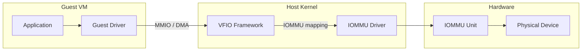
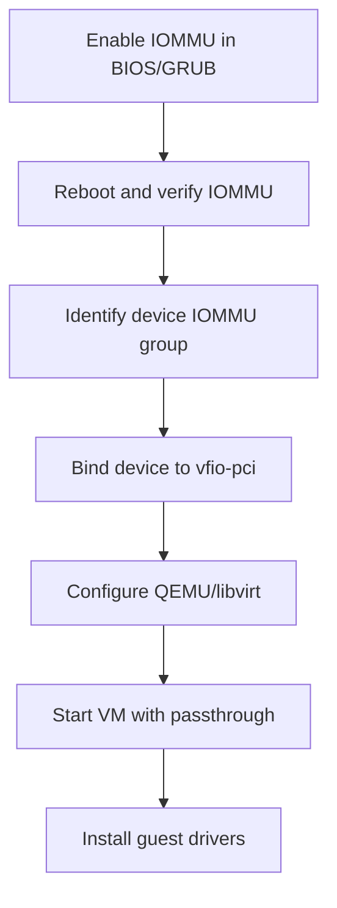
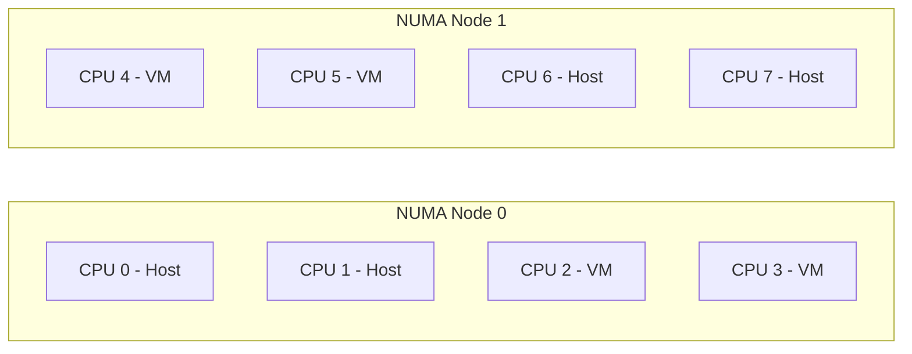

# VFIO: Virtual Function I/O and Device Passthrough

VFIO (Virtual Function I/O) is a kernel framework that allows safe,
IOMMU-protected assignment of physical devices to virtual machines. It enables
near-native performance for GPUs, NICs, and NVMe drives in VMs. This chapter
covers IOMMU groups, device passthrough, vfio-pci binding, QEMU integration,
and hugepages configuration.

---

## 1. Overview



### 1.1 Why VFIO?

| Method | Performance | Isolation | Complexity |
|--------|-------------|-----------|------------|
| Emulated (e1000) | Poor | None | Low |
| Virtio | Good | Paravirt | Medium |
| SR-IOV | Excellent | Hardware | Medium |
| VFIO Passthrough | Native | IOMMU | High |

VFIO gives the guest **direct hardware access** with IOMMU enforcing memory
isolation — the device cannot access host memory outside its assigned regions.

---

## 2. Prerequisites

### 2.1 Hardware Requirements

- **IOMMU**: Intel VT-d or AMD-Vi
- **CPU**: VT-x/AMD-V (nested with IOMMU)
- **Device**: Must be in its own IOMMU group (or ACS-capable)

### 2.2 Enable IOMMU

Add to kernel boot parameters:

```bash
# Intel
intel_iommu=on iommu=pt

# AMD
amd_iommu=on iommu=pt
```

Edit GRUB:

```bash
sudo vim /etc/default/grub
GRUB_CMDLINE_LINUX_DEFAULT="... intel_iommu=on iommu=pt"
sudo update-grub
sudo reboot
```

### 2.3 Verify IOMMU

```bash
# Check IOMMU enabled
dmesg | grep -i iommu
# [    0.000000] DMAR: IOMMU enabled

# Check IOMMU groups
for d in /sys/kernel/iommu_groups/*/devices/*; do
    n=${d#*/iommu_groups/}; n=${n%%/*}
    printf 'IOMMU Group %s: ' "$n"
    lspci -nns "${d##*/}"
done
```

### 2.4 Required Kernel Modules

```bash
# Load VFIO modules
sudo modprobe vfio
sudo modprobe vfio_pci
sudo modprobe vfio_iommu_type1

# Verify
lsmod | grep vfio
# vfio_pci               81920  0
# vfio_iommu_type1       40960  0
# vfio                   40960  2 vfio_pci,vfio_iommu_type1
```

---

## 3. IOMMU Groups

### 3.1 Understanding IOMMU Groups

An IOMMU group is the smallest unit of device isolation. All devices in the same
group share the same IOMMU context — they must all be passed through together or
none at all.

```bash
# List all IOMMU groups
find /sys/kernel/iommu_groups/ -type l | sort -V | \
    while read line; do
        echo -n "IOMMU Group $(echo $line | cut -d'/' -f5): "
        lspci -nns "$(basename $line)"
    done
```

Example output:

```
IOMMU Group 0: 00:00.0 Host bridge [0600]: Intel Corporation Device [8086:3e20]
IOMMU Group 1: 00:01.0 PCI bridge [0604]: Intel Corporation Xeon E3-1200 v5 PCIe [8086:1901]
IOMMU Group 1: 01:00.0 VGA compatible controller [0300]: NVIDIA GeForce RTX 3080 [10de:2206]
IOMMU Group 1: 01:00.1 Audio device [0403]: NVIDIA Device [10de:1aef]
```

### 3.2 The Problem: Shared Groups

In this example, the GPU (01:00.0) and its audio function (01:00.1) are in the
same IOMMU group. Both must be passed through together.

### 3.3 ACS Override Patch

If devices are incorrectly grouped, the ACS override patch can split them:

```bash
# Add to kernel parameters (USE WITH CAUTION — reduces isolation)
pcie_acs_override=downstream,multifunction
```

**Warning:** This weakens IOMMU isolation. Only use in non-production
environments.

---

## 4. Device Passthrough Setup

### 4.1 Step-by-Step Workflow



### 4.2 Identify the Device

```bash
# Find device BDF (Bus:Device.Function)
lspci -nn | grep -i nvidia
# 01:00.0 VGA compatible controller [0300]: NVIDIA Corporation Device [10de:2206] (rev a1)
# 01:00.1 Audio device [0403]: NVIDIA Corporation Device [10de:1aef] (rev a1)

# Get vendor:device IDs
lspci -nns 01:00.0
# 01:00.0 0300: 10de:2206 (rev a1)
```

### 4.3 Bind to vfio-pci

#### Method 1: Kernel Parameter

```bash
# Add to GRUB (early binding, before other drivers load)
GRUB_CMDLINE_LINUX_DEFAULT="... vfio-pci.ids=10de:2206,10de:1aef"
sudo update-grub
```

#### Method 2: Modprobe Configuration

```bash
# /etc/modprobe.d/vfio.conf
options vfio-pci ids=10de:2206,10de:1aef

# /etc/modprobe.d/blacklist-nouveau.conf
blacklist nouveau
options nouveau modeset=0

# /etc/modprobe.d/blacklist-nvidia.conf
blacklist nvidia
blacklist nvidia_drm
blacklist nvidia_modeset

# Update initramfs
sudo update-initramfs -u
```

#### Method 3: Runtime Binding

```bash
# Unbind from current driver
echo 0000:01:00.0 | sudo tee /sys/bus/pci/devices/0000:01:00.0/driver/unbind

# Bind to vfio-pci
echo "10de 2206" | sudo tee /sys/bus/pci/drivers/vfio-pci/new_id
```

### 4.4 Verify Binding

```bash
lspci -nnk -s 01:00.0
# 01:00.0 VGA compatible controller [0300]: NVIDIA Corporation Device [10de:2206]
#         Kernel driver in use: vfio-pci
```

---

## 5. QEMU Usage

### 5.1 Command-Line Passthrough

```bash
qemu-system-x86_64 \
    -enable-kvm \
    -m 8G \
    -smp 8,sockets=1,cores=4,threads=2 \
    -cpu host,kvm=off,hv_vendor_id=randomid \
    -device vfio-pci,host=01:00.0,multifunction=on \
    -device vfio-pci,host=01:00.1 \
    -drive file=/var/lib/libvirt/images/win10.qcow2,format=qcow2,if=virtio \
    -cdrom /path/to/win10.iso \
    -boot d \
    -nographic
```

### 5.2 libvirt Domain XML

```xml
<domain type='kvm'>
  <name>gpu-vm</name>
  <memory unit='GiB'>8</memory>
  <vcpu placement='static'>8</vcpu>

  <cputune>
    <vcpupin vcpu='0' cpuset='2'/>
    <vcpupin vcpu='1' cpuset='3'/>
    <vcpupin vcpu='2' cpuset='4'/>
    <vcpupin vcpu='3' cpuset='5'/>
    <vcpupin vcpu='4' cpuset='6'/>
    <vcpupin vcpu='5' cpuset='7'/>
    <vcpupin vcpu='6' cpuset='8'/>
    <vcpupin vcpu='7' cpuset='9'/>
    <emulatorpin cpuset='0-1'/>
  </cputune>

  <memoryBacking>
    <hugepages>
      <page size='2048' unit='KiB'/>
    </hugepages>
    <locked/>
  </memoryBacking>

  <os>
    <type arch='x86_64' machine='pc-q35-8.2'>hvm</type>
    <loader readonly='yes' type='pflash'>/usr/share/OVMF/OVMF_CODE_4M.fd</loader>
    <nvram>/var/lib/libvirt/qemu/nvram/gpu-vm_VARS.fd</nvram>
  </os>

  <features>
    <acpi/>
    <apic/>
    <hyperv mode='custom'>
      <relaxed state='on'/>
      <vapic state='on'/>
      <spinlocks state='on' retries='8191'/>
      <vendor_id state='on' value='randomid'/>
    </hyperv>
    <kvm>
      <hidden state='on'/>
    </kvm>
  </features>

  <cpu mode='host-passthrough' check='none'>
    <topology sockets='1' dies='1' cores='4' threads='2'/>
    <feature policy='require' name='topoext'/>
  </cpu>

  <devices>
    <emulator>/usr/bin/qemu-system-x86_64</emulator>

    <!-- GPU passthrough -->
    <hostdev mode='subsystem' type='pci' managed='yes'>
      <source>
        <address domain='0x0000' bus='0x01' slot='0x00' function='0x0'/>
      </source>
      <address type='pci' domain='0x0000' bus='0x01' slot='0x00' function='0x0' multifunction='on'/>
    </hostdev>

    <!-- GPU audio passthrough -->
    <hostdev mode='subsystem' type='pci' managed='yes'>
      <source>
        <address domain='0x0000' bus='0x01' slot='0x00' function='0x1'/>
      </source>
      <address type='pci' domain='0x0000' bus='0x01' slot='0x00' function='0x1'/>
    </hostdev>

    <disk type='file' device='disk'>
      <driver name='qemu' type='qcow2' io='native' cache='none'/>
      <source file='/var/lib/libvirt/images/win10.qcow2'/>
      <target dev='vda' bus='virtio'/>
    </disk>
  </devices>
</domain>
```

---

## 6. Hugepages

### 6.1 Why Hugepages?

Standard 4 KB pages cause TLB (Translation Lookaside Buffer) thrashing with
large VMs. Hugepages use 2 MB or 1 GB pages, dramatically reducing TLB misses.

| Page Size | Entries in 8 GB | TLB Pressure |
|-----------|-----------------|--------------|
| 4 KB | 2,097,152 | Very high |
| 2 MB | 4,096 | Low |
| 1 GB | 8 | Minimal |

### 6.2 Configuring Hugepages

```bash
# Allocate 2 MB hugepages at boot
# Add to kernel parameters:
hugepagesz=2M hugepages=4096   # 8 GB total

# Or at runtime
echo 4096 | sudo tee /proc/sys/vm/nr_hugepages

# Verify
cat /proc/meminfo | grep Huge
# HugePages_Total:    4096
# HugePages_Free:     4096
# HugePages_Rsvd:        0
# Hugepagesize:       2048 kB
```

### 6.3 1 GB Hugepages

```bash
# Must be allocated at boot (cannot be done at runtime for 1G pages)
hugepagesz=1G hugepages=8
```

### 6.4 Mount Hugepages

```bash
# Mount hugetlbfs
sudo mount -t hugetlbfs none /dev/hugepages

# Verify
mount | grep huge
# none on /dev/hugepages type hugetlbfs (rw,relatime,pagesize=2M)
```

### 6.5 libvirt Hugepage Configuration

```xml
<memoryBacking>
  <hugepages>
    <page size='2048' unit='KiB'/>
    <!-- Or for 1GB pages: -->
    <!-- <page size='1048576' unit='KiB'/> -->
  </hugepages>
  <locked/>
  <nosharepages/>
  <access mode='shared'/>
</memoryBacking>
```

### 6.6 NUMA-Aware Hugepages

```bash
# Allocate hugepages per NUMA node
echo 2048 | sudo tee /sys/devices/system/node/node0/hugepages/hugepages-2048kB/nr_hugepages
echo 2048 | sudo tee /sys/devices/system/node/node1/hugepages/hugepages-2048kB/nr_hugepages

# Verify per-node allocation
cat /sys/devices/system/node/node*/meminfo | grep Huge
```

---

## 7. Performance Tuning

### 7.1 CPU Pinning Strategy



Pin VM vCPUs to the same NUMA node as the passed-through device:

```bash
# Find device NUMA node
cat /sys/bus/pci/devices/0000:01:00.0/numa_node
# 0

# Pin vCPUs to NUMA node 0 CPUs
# (see libvirt XML cputune section above)
```

### 7.2 IOMMU Interrupt Remapping

```bash
# Check interrupt remapping support
dmesg | grep -i "interrupt remapping"
# [    0.000000] DMAR: Interrupt remapping enabled

# If not enabled, enable in BIOS (Intel VT-d interrupt remapping)
```

### 7.3 MSI/MSI-X Interrupts

```bash
# Check if device uses MSI
lspci -vvv -s 01:00.0 | grep -i msi
# Capabilities: [68] MSI: Enable+ Count=1/1 Maskable- 64bit+

# Enable MSI in guest (Windows: usually automatic, Linux: modprobe option)
```

### 7.4 Avoiding the "Reset Bug"

Some GPUs (notably AMD) have issues with function-level reset (FLR):

```bash
# Check if device supports FLR
lspci -vvv -s 01:00.0 | grep -i "reset"

# Workaround: vendor-specific reset scripts
# /etc/libvirt/hooks/qemu.d/gpu-vm/started/begin/01-gpu-reset.sh
#!/bin/bash
echo 1 > /sys/bus/pci/devices/0000:01:00.0/remove
sleep 1
echo 1 > /sys/bus/pci/rescan
```

---

## 8. SR-IOV with VFIO

### 8.1 SR-IOV Overview

SR-IOV (Single Root I/O Virtualization) allows a single physical device to
present multiple Virtual Functions (VFs), each assignable to a different VM.

```bash
# Enable SR-IOV VFs on an Intel NIC
echo 4 | sudo tee /sys/class/net/ens1f0/device/sriov_numvfs

# List VFs
lspci | grep "Virtual Function"
# 03:10.0 Ethernet controller: Intel Corporation X710/X557-AT 10GBASE-T (VF)
# 03:10.2 Ethernet controller: Intel Corporation X710/X557-AT 10GBASE-T (VF)
# 03:10.4 Ethernet controller: Intel Corporation X710/X557-AT 10GBASE-T (VF)
# 03:10.6 Ethernet controller: Intel Corporation X710/X557-AT 10GBASE-T (VF)
```

### 8.2 VFIO with SR-IOV

```bash
# Bind a VF to vfio-pci
echo "8086 154c" | sudo tee /sys/bus/pci/drivers/vfio-pci/new_id
echo "0000:03:10.0" | sudo tee /sys/bus/pci/devices/0000:03:10.0/driver/unbind
echo "0000:03:10.0" | sudo tee /sys/bus/pci/drivers/vfio-pci/bind
```

---

## 9. Debugging VFIO Issues

### 9.1 Common Problems

| Symptom | Cause | Solution |
|---------|-------|----------|
| "No IOMMU group" | IOMMU not enabled | Add `intel_iommu=on` to GRUB |
| "Group not viable" | Devices in shared group | Pass all devices in group |
| "Failed to set IOMMU" | Kernel too old | Use kernel 5.4+ |
| Device not resettable | Reset bug | Use vendor reset script |
| Black screen in guest | Wrong driver loaded first | Use early vfio-pci binding |

### 9.2 Diagnostic Commands

```bash
# IOMMU status
dmesg | grep -i -e iommu -e dmar -e vt-d

# VFIO device info
ls -la /dev/vfio/

# Device IOMMU group
readlink /sys/bus/pci/devices/0000:01:00.0/iommu_group

# VFIO debug
echo 1 | sudo tee /sys/module/vfio/parameters/enable_unsafe_noiommu_mode  # only for testing
```

### 9.3 Enable VFIO Debug Logging

```bash
# Dynamic debug
echo 'module vfio +p' | sudo tee /sys/kernel/debug/dynamic_debug/control
echo 'module vfio_pci +p' | sudo tee /sys/kernel/debug/dynamic_debug/control

# Watch logs
dmesg -w | grep vfio
```

---

## 10. Full Setup Script

```bash
#!/bin/bash
# vfio-setup.sh — One-time VFIO passthrough setup

set -e

GPU_ID="10de:2206"
AUDIO_ID="10de:1aef"

echo "=== Enabling VFIO modules ==="
cat <<EOF | sudo tee /etc/modules-load.d/vfio.conf
vfio
vfio_iommu_type1
vfio_pci
EOF

echo "=== Blacklisting nouveau ==="
cat <<EOF | sudo tee /etc/modprobe.d/blacklist-nouveau.conf
blacklist nouveau
options nouveau modeset=0
EOF

echo "=== Binding GPU to vfio-pci ==="
cat <<EOF | sudo tee /etc/modprobe.d/vfio.conf
options vfio-pci ids=${GPU_ID},${AUDIO_ID}
softdep nvidia pre: vfio-pci
EOF

echo "=== Updating GRUB ==="
sudo sed -i 's/GRUB_CMDLINE_LINUX_DEFAULT="\(.*\)"/GRUB_CMDLINE_LINUX_DEFAULT="\1 intel_iommu=on iommu=pt"/' /etc/default/grub
sudo update-grub

echo "=== Updating initramfs ==="
sudo update-initramfs -u

echo "=== Allocating hugepages ==="
echo "vm.nr_hugepages=4096" | sudo tee /etc/sysctl.d/hugepages.conf
sudo sysctl -p /etc/sysctl.d/hugepages.conf

echo "Done! Reboot to apply changes."
```

---

## Further Reading

- [VFIO Documentation — docs.kernel.org](https://docs.kernel.org/driver-api/vfio.html)
- [Alex Williamson's VFIO Blog](https://vfio.blogspot.com/)
- [VFIO Tips and Tricks — Arch Wiki](https://wiki.archlinux.org/title/PCI_passthrough_via_OVMF)
- [IOMMU Documentation — docs.kernel.org](https://docs.kernel.org/admin-guide/kernel-parameters.txt) (search for `iommu`)
- [GPU Passthrough Guide — Reddit r/VFIO](https://www.reddit.com/r/VFIO/)
- [Hugepages Documentation — docs.kernel.org](https://docs.kernel.org/admin-guide/mm/hugetlbpage.html)
- [SR-IOV Documentation — docs.kernel.org](https://docs.kernel.org/PCI/pci-iov-howto.html)
- [KVM VFIO API — docs.kernel.org](https://docs.kernel.org/virt/kvm/devices/vfio.html)
- [vfio-pci(4) man page](https://man7.org/linux/man-pages/man4/vfio-pci.4.html)
