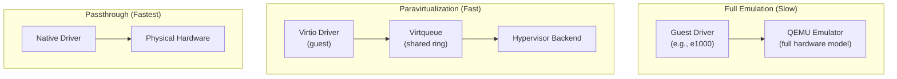
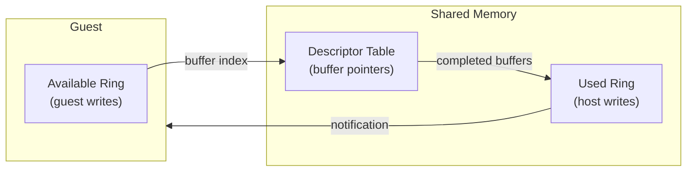
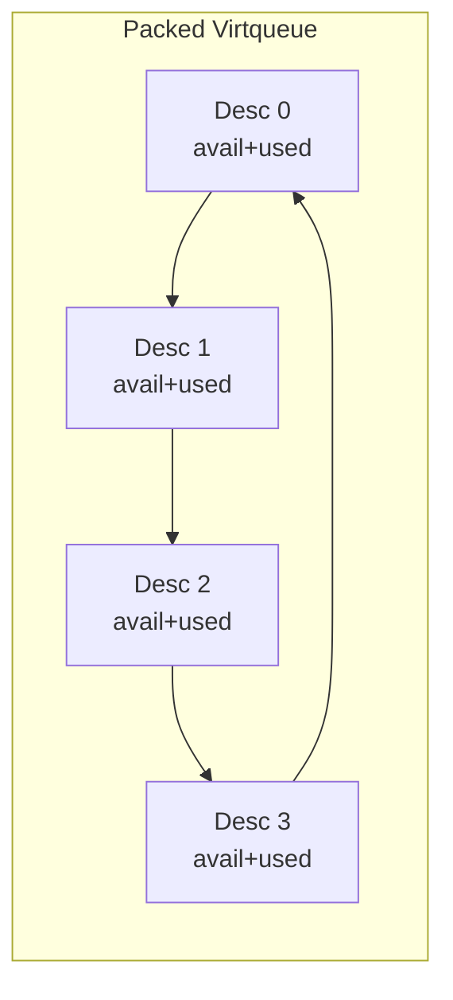
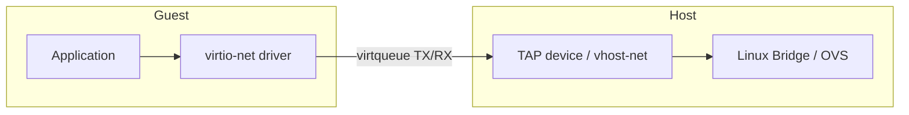
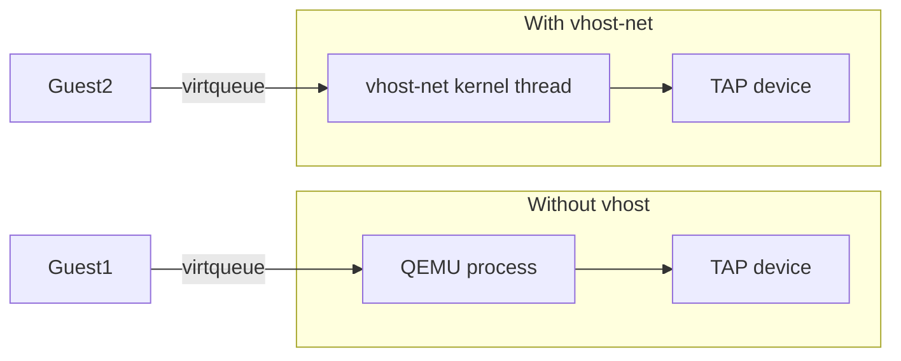

# Virtio: Paravirtualized I/O for Virtual Machines

Virtio is the standard paravirtualization framework for I/O in virtual machines.
Instead of emulating real hardware, virtio defines an efficient guest-hypervisor
communication protocol that both sides understand natively. This chapter covers
virtio device types (net, blk, scsi), vhost, vDPA, packed virtqueues, and
performance tuning.

---

## 1. What Is Paravirtualization?



| Approach | Performance | Compatibility | Complexity |
|----------|-------------|---------------|------------|
| Full emulation | 10–30% native | Works with any OS | High (emulate hardware) |
| Paravirt (virtio) | 70–95% native | Requires virtio driver | Medium |
| Passthrough (VFIO) | ~100% native | Needs dedicated HW | High |

---

## 2. Virtqueue Architecture

### 2.1 Split Virtqueues (Traditional)

A virtqueue consists of three descriptor tables shared between guest and host:



- **Descriptor Table** — Array of buffer descriptors (addr, len, flags, next)
- **Available Ring** — Guest tells host which descriptors are ready
- **Used Ring** — Host tells guest which descriptors are done

### 2.2 Packed Virtqueues (Linux 4.20+, Virtio 1.1)

Packed virtqueues merge all three tables into a single descriptor ring, improving
cache locality and reducing memory barriers.



Benefits:
- **Better cache performance** — single contiguous memory region
- **Fewer memory barriers** — driver and device flags in same descriptor
- **Up to 10–20% throughput improvement** for small messages

---

## 3. Virtio Device Types

### 3.1 virtio-net — Network Device



**Guest driver:**

```bash
# Linux guest — check driver
ethtool -i eth0
# driver: virtio_net

# Features negotiation
ethtool -k eth0
# tcp-segmentation-offload: on
# generic-receive-offload: on
```

**Host configuration (QEMU):**

```bash
qemu-system-x86_64 \
    -device virtio-net-pci,netdev=net0,mac=52:54:00:12:34:56 \
    -netdev tap,id=net0,script=/etc/qemu-ifup,vhost=on
```

**libvirt XML:**

```xml
<interface type='bridge'>
  <source bridge='br0'/>
  <model type='virtio'/>
  <driver name='vhost' queues='4'>
    <host mrg_rxbuf='on'/>
  </driver>
</interface>
```

### 3.2 virtio-blk — Block Device

Simple block device interface. One virtqueue per device.

```bash
qemu-system-x86_64 \
    -device virtio-blk-pci,drive=drive0 \
    -drive file=disk.qcow2,format=qcow2,if=none,id=drive0,aio=native,cache=none
```

Guest verification:

```bash
# Check virtio-blk driver
lsblk -t
# NAME   ALIGNMENT MIN-IO OPT-IO PHY-SEC LOG-SEC ROTA SCHED    RQ-SIZE
# vda           0    512      0     512      512    0 mq-deadline     256

cat /sys/block/vda/queue/scheduler
# [mq-deadline] kyber none
```

### 3.3 virtio-scsi — SCSI Device

More feature-rich than virtio-blk: supports multiple LUNs, SCSI commands,
rescan, and discard/TRIM.

```bash
qemu-system-x86_64 \
    -device virtio-scsi-pci,id=scsi0 \
    -device scsi-hd,bus=scsi0.0,drive=drive0 \
    -drive file=disk.qcow2,format=qcow2,if=none,id=drive0
```

**Comparison: virtio-blk vs virtio-scsi**

| Feature | virtio-blk | virtio-scsi |
|---------|------------|-------------|
| Multiple LUNs | One per device | Many per controller |
| SCSI commands | No | Yes (pass-through) |
| Discard/TRIM | Limited | Full |
| Multi-queue | Yes | Yes |
| Performance | Slightly faster (simple) | Slightly slower (more features) |
| Use case | Simple disk | Complex storage, multi-disk |

---

## 4. vhost — Kernel-Based Backend

### 4.1 What Is vhost?

vhost moves the virtio backend from QEMU userspace into the kernel, reducing
context switches and data copies.



### 4.2 vhost-net

```bash
# Enable vhost-net in QEMU
qemu-system-x86_64 \
    -device virtio-net-pci,netdev=net0 \
    -netdev tap,id=net0,vhost=on

# Verify vhost is active
lsmod | grep vhost
# vhost_net              32768  1
# vhost                  53248  1 vhost_net

# Check vhost thread
ps aux | grep vhost
# root  1234  0.5  vhost-1234-qemu
```

### 4.3 vhost-scsi

```bash
# Use vhost-scsi for SCSI target
qemu-system-x86_64 \
    -device vhost-scsi-pci,wwpn=naa.5001405888888888 \
    -object memory-backend-file,id=mem,size=4G,mem-path=/dev/hugepages,share=on \
    -numa node,memdev=mem
```

### 4.4 vhost-user

For userspace datapath (DPDK, OVS-DPDK):

```bash
# Start OVS-DPDK with vhost-user
ovs-vsctl add-port br0 vhost-user0 -- \
    set Interface vhost-user0 type=dpdkvhostuserclient \
    options:vhost-server-path=/var/run/openvswitch/vhost-user0
```

---

## 5. vDPA — Virtio Data Path Acceleration

### 5.1 What Is vDPA?

vDPA provides a hardware-accelerated virtio datapath. Hardware vendors implement
the virtio datapath in their NIC firmware while the control plane remains
software-defined.

```mermaid
flowchart TB
    subgraph Guest
        DRV[virtio-net driver]
    end
    subgraph vDPA
        VDPA[vDPA bus]
        subgraph HW["Hardware"]
            CTRL[Control plane<br/>(software)]
            DATA[Data plane<br/>(hardware/firmware)]
        end
        VDPA --> CTRL
        VDPA --> DATA
    end
    DRV -->|virtqueue| VDPA
```

### 5.2 vDPA vs SR-IOV vs vhost

| Feature | vhost | SR-IOV | vDPA |
|---------|-------|--------|------|
| Performance | High | Highest | Highest |
| Configurability | Full | Limited | Full (SW control plane) |
| Live migration | Yes | Difficult | Yes |
| Vendor lock-in | None | Some | None (virtio standard) |

### 5.3 Using vDPA

```bash
# Check vDPA devices
vdpa dev list

# Create a vDPA device
vdpa dev add mgmtdev pci/0000:03:00.0 name vdpa0

# Use with QEMU
qemu-system-x86_64 \
    -device virtio-net-pci,netdev=net0 \
    -netdev vhost-vdpa,id=net0,vhostdev=/dev/vhost-vdpa-0
```

---

## 6. Virtio Feature Negotiation

### 6.1 Feature Bits

Devices and drivers negotiate features during initialization:

| Feature | Bit | Description |
|---------|-----|-------------|
| `VIRTIO_NET_F_CSUM` | 0 | Host checksums |
| `VIRTIO_NET_F_GSO` | 6 | Generic segmentation offload |
| `VIRTIO_NET_F_MRG_RXBUF` | 15 | Merge receive buffers |
| `VIRTIO_NET_F_MTU` | 3 | Host sets MTU |
| `VIRTIO_RING_F_INDIRECT_DESC` | 28 | Indirect descriptors |
| `VIRTIO_RING_F_EVENT_IDX` | 29 | Interrupt suppression |
| `VIRTIO_F_ORDER_PLATFORM` | 36 | Platform ordering |

### 6.2 Querying Features

```bash
# QEMU monitor
(qemu) info virtio
# virtio-net: features: 0x100000000 (indirect_desc)

# Guest-side
ethtool -i eth0
cat /sys/class/net/eth0/device/features
```

---

## 7. Multi-Queue Performance

### 7.1 Multi-Queue virtio-net

```bash
# QEMU: enable multi-queue
qemu-system-x86_64 \
    -device virtio-net-pci,netdev=net0,mq=on,vectors=8 \
    -netdev tap,id=net0,script=/etc/qemu-ifup,vhost=on,queues=4

# Guest: configure multi-queue
ethtool -L eth0 combined 4
```

### 7.2 Multi-Queue virtio-blk

```bash
# QEMU
qemu-system-x86_64 \
    -device virtio-blk-pci,drive=drive0,num-queues=4 \
    -drive file=disk.qcow2,format=qcow2,if=none,id=drive0

# Guest: verify
cat /sys/block/vda/queue/nr_requests
cat /sys/block/vda/mq/*/cpu_list
```

---

## 8. Performance Tuning

### 8.1 Guest-Side Tuning

```bash
# Increase virtqueue size
echo 1024 | sudo tee /sys/module/virtio_ring/parameters/max_queue_size

# Enable busy polling
echo 50 | sudo tee /sys/class/net/eth0/napi_defer_hard_irqs

# Use XDP for fast packet processing
ip link set dev eth0 xdpgeneric pass

# Tune interrupt coalescing
ethtool -C eth0 rx-usecs 50 tx-usecs 50
```

### 8.2 Host-Side Tuning

```bash
# Enable vhost for all virtio devices
# (default in modern QEMU)

# Use io_uring for virtio-blk
qemu-system-x86_64 \
    -device virtio-blk-pci,drive=drive0,iothread=iothread0 \
    -object iothread,id=iothread0 \
    -drive file=disk.qcow2,format=qcow2,if=none,id=drive0,aio=io_uring

# Pin vhost threads
taskset -c 0-3 qemu-system-x86_64 ...
```

### 8.3 Hugepages for Virtio

```bash
# Allocate hugepages (reduces TLB misses for virtio buffers)
echo 4096 | sudo tee /proc/sys/vm/nr_hugepages

# QEMU with hugepages
qemu-system-x86_64 \
    -object memory-backend-file,id=mem,size=4G,mem-path=/dev/hugepages,share=on \
    -numa node,memdev=mem \
    ...
```

### 8.4 Benchmark Comparison

```bash
# Network throughput (iperf3)
# Emulated e1000:   ~1 Gbps
# virtio-net:       ~10 Gbps
# virtio-net+vhost: ~18 Gbps
# vDPA:             ~20 Gbps (line rate on 25G NIC)

# Disk I/O (fio)
# Emulated IDE:     ~100 MB/s
# virtio-blk:       ~2 GB/s
# virtio-blk+io_uring: ~3 GB/s
# VFIO NVMe:        ~7 GB/s (native)
```

---

## 9. Virtio in Non-Linux Guests

### 9.1 Windows

Download drivers from [Fedora VirtIO-Win](https://fedorapeople.org/groups/virt/virtio-win/direct-downloads/stable-virtio/):

```bash
# Attach driver ISO
qemu-system-x86_64 \
    -cdrom virtio-win.iso \
    -device virtio-net-pci,netdev=net0 \
    -device virtio-blk-pci,drive=drive0
```

### 9.2 FreeBSD

FreeBSD has native virtio drivers:

```bash
# In FreeBSD guest
kldload virtio
kldload if_vtnet
kldload virtio_blk
```

---

## 10. Virtio Specification

The Virtio specification is maintained by OASIS:

| Version | Key Features |
|---------|--------------|
| 1.0 | Split virtqueues, basic devices |
| 1.1 | Packed virtqueues, VIRTIO_F_ORDER_PLATFORM |
| 1.2 | Admin virtqueue, virtio-mem, virtio-fs |

The specification defines:
- Device initialization and feature negotiation
- Virtqueue layout and operation
- Device-specific configuration (net, blk, scsi, etc.)
- Transport bindings (PCI, MMIO, CCW)

---

## Further Reading

- [Virtio Specification 1.2 — OASIS](https://docs.oasis-open.org/virtio/virtio/v1.2/virtio-v1.2.html)
- [Linux Virtio Documentation — docs.kernel.org](https://docs.kernel.org/driver-api/virtio/index.html)
- [vhost Documentation — docs.kernel.org](https://docs.kernel.org/virt/kvm/vhost.html)
- [vDPA Documentation — docs.kernel.org](https://docs.kernel.org/networking/device_drivers/ethernet/mellanox/mlx5/vdpa.html)
- [Packed Virtqueues — LWN.net](https://lwn.net/Articles/773778/)
- [virtio-net driver — docs.kernel.org](https://docs.kernel.org/networking/device_drivers/net/virtio_net.html)
- [QEMU Virtio Devices](https://www.qemu.org/docs/master/system/devices/virtio.html)
- [DPDK vhost-user](https://doc.dpdk.org/guides/prog_guide/vhost_lib.html)
- [OASIS Virtio TC](https://www.oasis-open.org/committees/tc_home.php?wg_abbrev=virtio)
