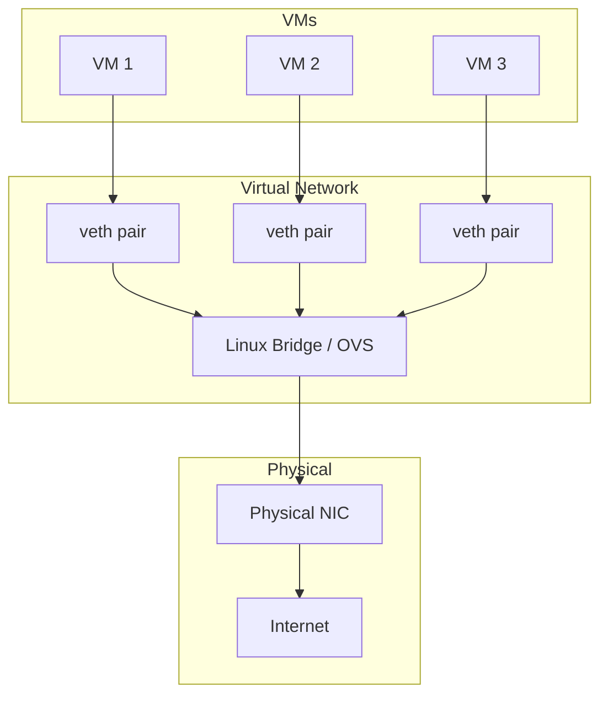
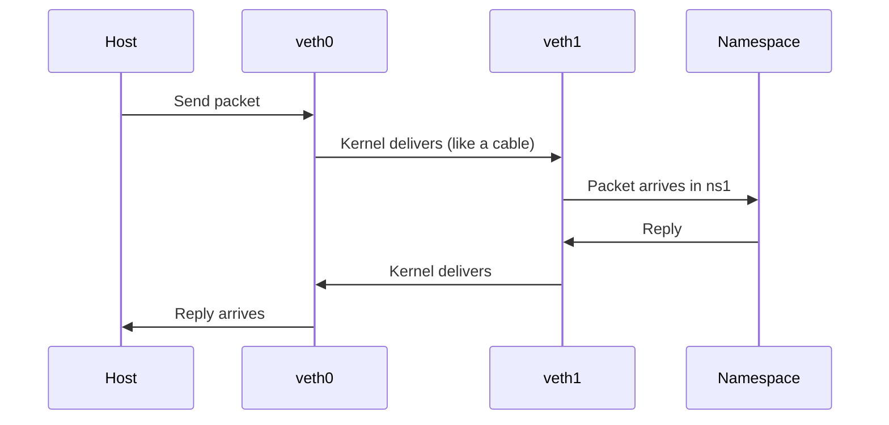
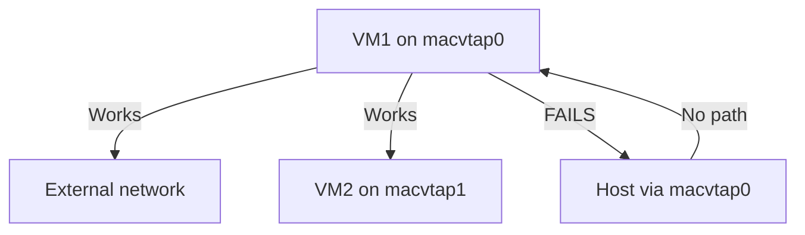

# Virtual Networking

Virtual networking connects virtual machines to each other and to the outside
world. This chapter covers Linux bridges, veth pairs, macvtap interfaces,
Open vSwitch (OVS), and NAT — the building blocks of every virtualized network
on Linux.

---

## 1. Architecture Overview



---

## 2. veth Pairs

### 2.1 What Is a veth Pair?

A `veth` (virtual Ethernet) pair is a virtual network cable — packets sent on
one end appear on the other. They are essential for connecting network
namespaces (containers) to bridges.

```bash
# Create a veth pair
sudo ip link add veth0 type veth peer name veth1

# Bring them up
sudo ip link set veth0 up
sudo ip link set veth1 up

# Verify
ip link show type veth
```

### 2.2 veth with Network Namespaces

```bash
# Create a namespace
sudo ip netns add ns1

# Move one end into the namespace
sudo ip link set veth1 netns ns1

# Configure inside the namespace
sudo ip netns exec ns1 ip addr add 10.0.0.2/24 dev veth1
sudo ip netns exec ns1 ip link set veth1 up
sudo ip netns exec ns1 ip link set lo up

# Configure host side
sudo ip addr add 10.0.0.1/24 dev veth0

# Test
ping -c3 10.0.0.2
```

### 2.3 veth Lifecycle



---

## 3. Linux Bridge

### 3.1 What Is a Linux Bridge?

A Linux bridge is a kernel-level Layer 2 switch. It forwards Ethernet frames
between ports based on MAC address learning.

```bash
# Install bridge utilities
sudo apt install bridge-utils

# Create a bridge
sudo ip link add name br0 type bridge
sudo ip link set br0 up

# Add ports to the bridge
sudo ip link set veth0 master br0
sudo ip link set eth0 master br0
```

### 3.2 Bridge Configuration

```bash
# View bridge status
bridge link show
# 3: veth0@if2: <BROADCAST,MULTICAST,UP> mtu 1500 master br0 state forwarding

bridge fdb show
# 00:11:22:33:44:55 dev veth0 master br0

# STP configuration
sudo ip link set br0 type bridge stp_state 1
sudo ip link set br0 type bridge priority 32768

# Ageing time
sudo ip link set br0 type bridge ageing_time 30000  # 30 seconds
```

### 3.3 Bridge with QEMU VMs

```bash
# QEMU tap interface setup script
cat > /etc/qemu-ifup << 'EOF'
#!/bin/bash
switch=br0
if [ -n "$1" ]; then
    ip link set $1 up
    ip link set $1 master ${switch}
fi
EOF
chmod +x /etc/qemu-ifup

# QEMU command
qemu-system-x86_64 \
    -netdev tap,id=net0,script=/etc/qemu-ifup,downscript=/etc/qemu-ifdown \
    -device virtio-net-pci,netdev=net0,mac=52:54:00:12:34:56
```

### 3.4 Bridge + VLAN

```bash
# Create VLAN-aware bridge
sudo ip link add name br0 type bridge vlan_filtering 1

# Add VLAN 100 to port
sudo bridge vlan add dev veth0 vid 100
sudo bridge vlan add dev eth0 vid 100

# PVID (untagged ingress)
sudo bridge vlan add dev veth0 vid 100 pvid untagged

# Show VLAN table
bridge vlan show
```

---

## 4. macvtap

### 4.1 What Is macvtap?

`macvtap` is a virtual network interface that combines a MAC address with a tap
device. It's an alternative to bridges that provides direct access to the
physical NIC.

```bash
# Create a macvtap device
sudo ip link add link eth0 name macvtap0 type macvtap mode bridge
sudo ip link set macvtap0 up

# The device file for QEMU
ls -la /dev/tap$(cat /sys/class/net/macvtap0/ifindex)
# crw------- 1 root root 243, 0 Jul 21 10:00 /dev/tap10
```

### 4.2 macvtap Modes

| Mode | Behavior | Use Case |
|------|----------|----------|
| `bridge` | All macvtap devices on same NIC can communicate | VM-to-VM on same host |
| `vepa` | Hairpin via physical switch (VEPA) | When switch supports VEPA |
| `private` | No inter-VM communication | Isolated VMs |

### 4.3 macvtap with libvirt

```xml
<interface type='direct'>
  <source dev='eth0' mode='bridge'/>
  <model type='virtio'/>
</interface>
```

### 4.4 macvtap Limitations



**Key limitation:** VMs cannot communicate with the host via macvtap. Use a
bridge if host-VM communication is required.

---

## 5. Open vSwitch (OVS)

### 5.1 What Is OVS?

Open vSwitch is a production-grade, programmable virtual switch. It supports
OpenFlow, VXLAN, GRE, Geneve tunnels, and advanced QoS.

```bash
# Install OVS
sudo apt install openvswitch-switch

# Start OVS
sudo systemctl enable --now openvswitch-switch
```

### 5.2 Basic OVS Operations

```bash
# Create a bridge
sudo ovs-vsctl add-br ovs-br0

# Add ports
sudo ovs-vsctl add-port ovs-br0 eth0
sudo ovs-vsctl add-port ovs-br0 veth0

# List bridges and ports
sudo ovs-vsctl show
sudo ovs-vsctl list-ports ovs-br0

# Delete a bridge
sudo ovs-vsctl del-br ovs-br0
```

### 5.3 OVS with QEMU

```bash
# Create internal port for QEMU
sudo ovs-vsctl add-port ovs-br0 tap0 -- set Interface tap0 type=internal
sudo ip link set tap0 up

# QEMU
qemu-system-x86_64 \
    -netdev tap,id=net0,fd=3 3<>/dev/tap0 \
    -device virtio-net-pci,netdev=net0
```

### 5.4 VXLAN Tunnels

```bash
# Host A (192.168.1.10)
sudo ovs-vsctl add-br ovs-br0
sudo ovs-vsctl add-port ovs-br0 vxlan0 -- \
    set Interface vxlan0 type=vxlan options:remote_ip=192.168.1.20 options:key=1000

# Host B (192.168.1.20)
sudo ovs-vsctl add-br ovs-br0
sudo ovs-vsctl add-port ovs-br0 vxlan0 -- \
    set Interface vxlan0 type=vxlan options:remote_ip=192.168.1.10 options:key=1000

# VMs on both hosts can now communicate via VXLAN tunnel
```

### 5.5 OpenFlow Rules

```bash
# Add a flow rule: forward all traffic from port 1 to port 2
sudo ovs-ofctl add-flow ovs-br0 "in_port=1,action=output:2"

# Mirror all traffic from port 1 to port 3 (monitoring)
sudo ovs-ofctl add-flow ovs-br0 "in_port=1,action=output:2,output:3"

# Show flows
sudo ovs-ofctl dump-flows ovs-br0

# Delete all flows
sudo ovs-ofctl del-flows ovs-br0
```

### 5.6 OVS vs Linux Bridge

| Feature | Linux Bridge | Open vSwitch |
|---------|-------------|--------------|
| Complexity | Simple | Moderate |
| OpenFlow | No | Yes |
| VXLAN/GRE | Basic | Full support |
| STP | Yes | Yes |
| Performance | High | High (with DPDK: very high) |
| Management | `ip` / `bridge` | `ovs-vsctl` / `ovs-ofctl` |
| Use case | Simple setups | Data center, SDN |

---

## 6. NAT (Network Address Translation)

### 6.1 NAT for VMs

NAT allows VMs to access the internet through the host's IP address.

```bash
# Enable IP forwarding
echo 1 | sudo tee /proc/sys/net/ipv4/ip_forward

# Set up NAT with iptables
sudo iptables -t nat -A POSTROUTING -o eth0 -j MASQUERADE
sudo iptables -A FORWARD -i br0 -o eth0 -j ACCEPT
sudo iptables -A FORWARD -i eth0 -o br0 -m state --state RELATED,ESTABLISHED -j ACCEPT

# Persist
sudo apt install iptables-persistent
sudo netfilter-persistent save
```

### 6.2 libvirt NAT Network

```xml
<network>
  <name>default</name>
  <forward mode='nat'>
    <nat>
      <port start='1024' end='65535'/>
    </nat>
  </forward>
  <bridge name='virbr0'/>
  <ip address='192.168.122.1' netmask='255.255.255.0'>
    <dhcp>
      <range start='192.168.122.2' end='192.168.122.254'/>
    </dhcp>
  </ip>
</network>
```

### 6.3 Port Forwarding

```bash
# Forward host port 8080 to VM 192.168.122.100:80
sudo iptables -t nat -A PREROUTING -p tcp --dport 8080 \
    -j DNAT --to-destination 192.168.122.100:80

# Forward SSH
sudo iptables -t nat -A PREROUTING -p tcp --dport 2222 \
    -j DNAT --to-destination 192.168.122.100:22
```

### 6.4 nftables Alternative

```bash
# Modern nftables NAT
sudo nft add table nat
sudo nft add chain nat postrouting { type nat hook postrouting priority 100 \; }
sudo nft add rule nat postrouting oifname "eth0" masquerade

# Port forwarding
sudo nft add chain nat prerouting { type nat hook prerouting priority -100 \; }
sudo nft add rule nat prerouting tcp dport 8080 dnat to 192.168.122.100:80
```

---

## 7. Network Namespaces

### 7.1 Creating Isolated Networks

```bash
# Create two namespaces
sudo ip netns add ns1
sudo ip netns add ns2

# Create veth pairs
sudo ip link add veth-ns1 type veth peer name veth-ns1-br
sudo ip link add veth-ns2 type veth peer name veth-ns2-br

# Move endpoints into namespaces
sudo ip link set veth-ns1 netns ns1
sudo ip link set veth-ns2 netns ns2

# Create bridge
sudo ip link add br-int type bridge
sudo ip link set br-int up

# Attach bridge-side veth to bridge
sudo ip link set veth-ns1-br master br-int
sudo ip link set veth-ns1-br up
sudo ip link set veth-ns2-br master br-int
sudo ip link set veth-ns2-br up

# Configure namespaces
sudo ip netns exec ns1 ip addr add 10.0.0.1/24 dev veth-ns1
sudo ip netns exec ns1 ip link set veth-ns1 up
sudo ip netns exec ns1 ip link set lo up

sudo ip netns exec ns2 ip addr add 10.0.0.2/24 dev veth-ns2
sudo ip netns exec ns2 ip link set veth-ns2 up
sudo ip netns exec ns2 ip link set lo up

# Test
sudo ip netns exec ns1 ping -c3 10.0.0.2
```

---

## 8. WireGuard VPN for VMs

### 8.1 Secure VM Network Over Untrusted Networks

```bash
# Host A
sudo ip link add wg0 type wireguard
sudo wg set wg0 private-key /etc/wireguard/private.key \
    listen-port 51820 \
    peer <HOST_B_PUBKEY> \
    endpoint 203.0.113.2:51820 \
    allowed-ips 10.0.0.0/24
sudo ip addr add 10.0.0.1/24 dev wg0
sudo ip link set wg0 up

# Host B (similar config)
# Then bridge wg0 with VM bridge
sudo ip link set wg0 master br0
```

---

## 9. Performance Tuning

### 9.1 Bridge Offloading

```bash
# Enable hardware offloading on bridge
sudo ethtool -K eth0 tx-checksum-ipv4 on
sudo ethtool -K eth0 tx-checksum-ipv6 on
sudo ethtool -K eth0 rx-checksumming on

# GRO/GSO on bridge ports
sudo ethtool -K veth0 gro on gso on tso on
```

### 9.2 Bridge Hairpin Mode

```bash
# Enable hairpin mode (for VMs on same bridge to communicate)
sudo bridge link set dev veth0 hairpin on
```

### 9.3 OVS with DPDK

```bash
# Install OVS-DPDK
sudo apt install openvswitch-switch-dpdk

# Configure DPDK
sudo ovs-vsctl set Open_vSwitch . other_config:dpdk-init=true
sudo systemctl restart openvswitch-switch

# Create DPDK bridge
sudo ovs-vsctl add-br br0 -- set bridge br0 datapath_type=netdev
sudo ovs-vsctl add-port br0 dpdk0 -- set Interface dpdk0 type=dpdk
```

### 9.4 MTU and Jumbo Frames

```bash
# Set MTU for jumbo frames
sudo ip link set br0 mtu 9000
sudo ip link set veth0 mtu 9000
# Ensure physical NIC also supports 9000 MTU
sudo ip link set eth0 mtu 9000
```

---

## 10. Monitoring Virtual Networks

### 10.1 Bridge Monitoring

```bash
# Bridge status
bridge -s link show

# MAC address table
bridge fdb show

# STP status
bridge -s -d -t fdb show
```

### 10.2 OVS Monitoring

```bash
# OVS status
sudo ovs-vsctl show
sudo ovs-ofctl show ovs-br0

# Port statistics
sudo ovs-ofctl dump-ports ovs-br0

# Flow statistics
sudo ovs-ofctl dump-flows ovs-br0
```

### 10.3 tcpdump on Virtual Interfaces

```bash
# Capture on bridge
sudo tcpdump -i br0 -nn -e

# Capture on veth pair
sudo tcpdump -i veth0 -nn

# Capture inside namespace
sudo ip netns exec ns1 tcpdump -i veth-ns1 -nn
```

---

## Further Reading

- [Linux Bridge Documentation — docs.kernel.org](https://docs.kernel.org/networking/bridge.html)
- [Open vSwitch Documentation — openvswitch.org](https://docs.openvswitch.org/en/latest/)
- [macvtap Kernel Documentation — docs.kernel.org](https://docs.kernel.org/networking/devices.html) (search macvtap)
- [Linux Network Namespaces — man7.org](https://man7.org/linux/man-pages/man8/ip-netns.8.html)
- [nftables Wiki — wiki.nftables.org](https://wiki.nftables.org/wiki-nftables/index.php/Main_Page)
- [libvirt Networking — libvirt.org](https://libvirt.org/formatnetwork.html)
- [DPDK with OVS](https://docs.openvswitch.org/en/latest/intro/install/dpdk/)
- [WireGuard Documentation](https://www.wireguard.com/)
- [ip-link(8) man page](https://man7.org/linux/man-pages/man8/ip-link.8.html)
- [bridge(8) man page](https://man7.org/linux/man-pages/man8/bridge.8.html)
