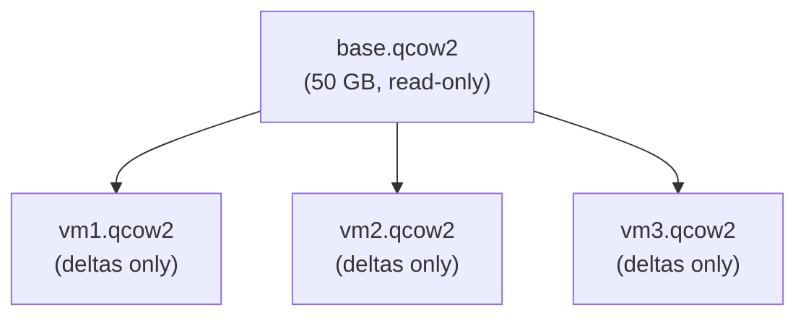
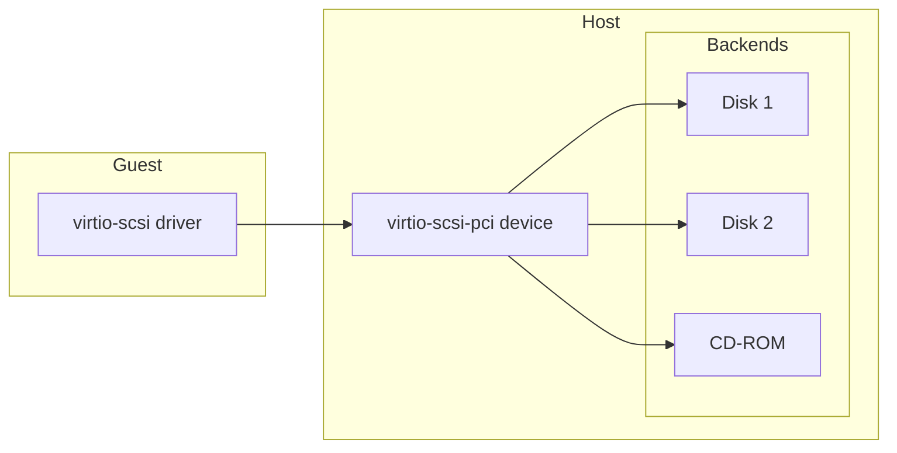
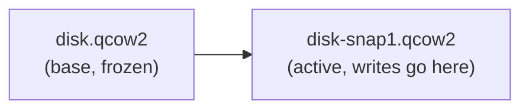
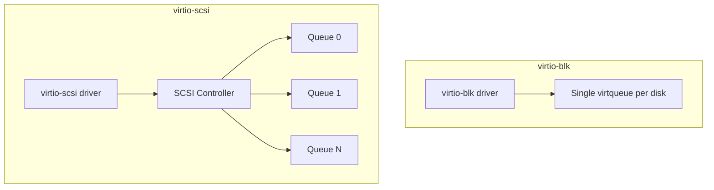
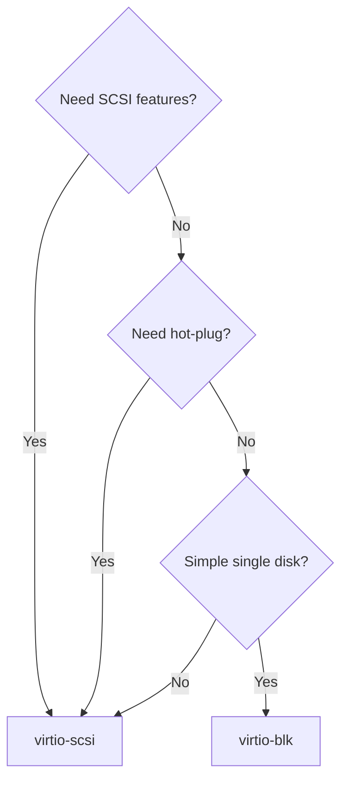

# Virtual Storage

Virtual storage is the foundation of VM disk management. This chapter covers
disk image formats (qcow2 vs raw), thin provisioning, virtio-scsi, disk image
management, and snapshots — the essential toolkit for any virtualization
administrator.

---

## 1. Disk Image Formats

### 1.1 Raw Images

A raw image is a byte-for-byte representation of the disk. A 50 GB raw image
occupies 50 GB on the host filesystem regardless of how much data the guest
has written.

```bash
# Create a raw image
qemu-img create -f raw disk.raw 50G

# Check actual size
ls -lh disk.raw
# -rw-r--r-- 1 user user 50G Jul 21 10:00 disk.raw

# Sparse raw image (uses only what's written)
qemu-img create -f raw disk-sparse.raw 50G
# Shows 50G allocation but only uses actual written blocks
ls -lhs disk-sparse.raw
```

### 1.2 qcow2 Images

**QEMU Copy-On-Write version 2** is the most feature-rich format:

```bash
# Create a qcow2 image
qemu-img create -f qcow2 disk.qcow2 50G

# Check
qemu-img info disk.qcow2
# image: disk.qcow2
# file format: qcow2
# virtual size: 50 GiB (53687091200 bytes)
# disk size: 196 KiB
# cluster_size: 65536
# Format specific information:
#     compat: 1.1
#     compression type: zlib
#     lazy refcounts: false
#     refcount bits: 16
#     corrupt: false
```

### 1.3 Comparison

| Feature | Raw | qcow2 |
|---------|-----|-------|
| Thin provisioning | Yes (sparse) | Yes (native) |
| Snapshots | No (external only) | Yes (internal) |
| Compression | No | Yes (zlib, zstd) |
| Encryption | No | Yes (AES-LUKS) |
| Backing file | No | Yes |
| Performance | Best | 5–10% slower |
| Metadata overhead | None | Small |
| Host FS support | Any | Any |

**Rule of thumb:** Use raw for maximum performance in production, qcow2 for
development, testing, and when you need snapshots.

---

## 2. Thin Provisioning

### 2.1 What Is Thin Provisioning?

Thin provisioning allocates storage on demand rather than upfront. A 100 GB
thin-provisioned disk with only 10 GB of data consumes ~10 GB on the host.


### 2.2 qcow2 Thin Provisioning

```bash
# Create thin-provisioned qcow2 (default behavior)
qemu-img create -f qcow2 thin.qcow2 100G

# Actual size
du -h thin.qcow2
# 196K    thin.qcow2

# Write 5 GB of data inside VM...
# Now check again
du -h thin.qcow2
# 5.1G    thin.qcow2
```

### 2.3 Raw Sparse Files

```bash
# Create sparse raw file
truncate -s 100G sparse.raw
# Or
qemu-img create -f raw sparse.raw 100G

# Check allocation
du -h sparse.raw
# 0       sparse.raw

# ls shows full size
ls -lh sparse.raw
# -rw-r--r-- 1 user user 100G Jul 21 10:00 sparse.raw
```

### 2.4 Monitoring Thin Provisioning

```bash
# Check actual vs virtual size
qemu-img info disk.qcow2

# Monitor growth over time
watch -n 5 'du -h disk.qcow2'

# Alert when approaching limit
THRESHOLD=90  # percent
ACTUAL=$(du -m disk.qcow2 | cut -f1)
VIRTUAL=$(qemu-img info disk.qcow2 | grep "virtual size" | grep -oP '\d+(?= GiB)')
USAGE=$((ACTUAL * 100 / (VIRTUAL * 1024)))
if [ $USAGE -gt $THRESHOLD ]; then
    echo "WARNING: Disk usage at ${USAGE}%"
fi
```

### 2.5 Overcommit

```bash
# Check total overcommit
virsh pool-info default
# Allocation: 250.00 GiB
# Available: 500.00 GiB
# Capacity:  1.00 TiB

# You've allocated 250 GB but only physically have 1 TB total
# This is safe as long as you monitor actual usage
```

---

## 3. qcow2 Advanced Features

### 3.1 Backing Files (Copy-on-Write Clones)

Create multiple VMs sharing a single base image:

```bash
# Create base image
qemu-img create -f qcow2 base.qcow2 50G
# Install OS into base.qcow2...

# Create linked clones
qemu-img create -f qcow2 -b base.qcow2 -F qcow2 vm1.qcow2
qemu-img create -f qcow2 -b base.qcow2 -F qcow2 vm2.qcow2
qemu-img create -f qcow2 -b base.qcow2 -F qcow2 vm3.qcow2

# Each clone only stores differences from the base
du -h vm1.qcow2 vm2.qcow2 vm3.qcow2
# 196K    vm1.qcow2
# 196K    vm2.qcow2
# 196K    vm3.qcow2

# Check backing chain
qemu-img info --backing-chain vm1.qcow2
```



### 3.2 Compression

```bash
# Create compressed qcow2
qemu-img create -f qcow2 -o compression_type=zstd compressed.qcow2 50G

# Convert existing image to compressed
qemu-img convert -c -O qcow2 source.raw compressed.qcow2

# Convert with zstd (qemu 7.0+)
qemu-img convert -c -o compression_type=zstd -O qcow2 source.raw compressed.qcow2
```

### 3.3 Encryption

```bash
# Create encrypted qcow2
qemu-img create -f qcow2 \
    --object secret,id=sec0,data=MySecretPassword \
    -o encrypt.format=luks,encrypt.key-secret=sec0 \
    encrypted.qcow2 50G

# Or use a key file
qemu-img create -f qcow2 \
    --object secret,id=sec0,file=/path/to/keyfile \
    -o encrypt.format=luks,encrypt.key-secret=sec0 \
    encrypted.qcow2 50G
```

---

## 4. virtio-scsi

### 4.1 Architecture



### 4.2 Configuration

```bash
# QEMU with virtio-scsi
qemu-system-x86_64 \
    -device virtio-scsi-pci,id=scsi0,num_queues=4 \
    -device scsi-hd,bus=scsi0.0,drive=drive0,rotation_rate=0 \
    -device scsi-hd,bus=scsi0.1,drive=drive1,rotation_rate=0 \
    -device scsi-cd,bus=scsi0.2,drive=cd0 \
    -drive file=disk1.qcow2,format=qcow2,if=none,id=drive0,aio=io_uring,cache=none \
    -drive file=disk2.qcow2,format=qcow2,if=none,id=drive1,aio=io_uring,cache=none \
    -drive file=install.iso,format=raw,if=none,id=cd0,media=cdrom
```

### 4.3 virtio-scsi Features

| Feature | Description |
|---------|-------------|
| Multi-queue | Multiple request queues for parallel I/O |
| Discard/TRIM | Reclaim unused blocks |
| Write barriers | Ensure data persistence |
| Thin provisioning | `UNMAP` support |
| Persistent reservations | SCSI PR for clustering |
| NUMA affinity | Queue-to-CPU mapping |

### 4.4 Guest Configuration

```bash
# Check virtio-scsi in guest
cat /proc/scsi/scsi
# Host: scsi0 Channel: 00 Id: 00 Lun: 00
#   Vendor: QEMU     Model: QEMU HARDDISK    Rev: 2.5+
#   Type:   Direct-Access                    ANSI  SCSI revision: 05

# Enable discard
sudo fstrim -v /mount/point

# Persistent discard in fstab
# /dev/sda1 /mount/point ext4 defaults,discard 0 2
```

---

## 5. Disk Image Management

### 5.1 qemu-img Operations

```bash
# Create
qemu-img create -f qcow2 disk.qcow2 50G

# Info
qemu-img info disk.qcow2

# Check integrity
qemu-img check disk.qcow2

# Resize (grow)
qemu-img resize disk.qcow2 +20G
# Then grow the partition and filesystem inside the VM

# Resize (shrink)
qemu-img resize --shrink disk.qcow2 30G

# Convert between formats
qemu-img convert -f raw -O qcow2 source.raw dest.qcow2
qemu-img convert -f qcow2 -O raw source.qcow2 dest.raw

# Commit changes to backing file
qemu-img commit vm1.qcow2
```

### 5.2 Benchmarking Disk Images

```bash
# Sequential read
qemu-img bench -c 1024 -f qcow2 -t none disk.qcow2

# Sequential write
qemu-img bench -c 1024 -f qcow2 -t cache disk.qcow2

# Compare formats
for fmt in raw qcow2; do
    echo "=== $fmt ==="
    qemu-img create -f $fmt test.$fmt 10G
    qemu-img bench -c 4096 -f $fmt test.$fmt
    rm test.$fmt
done
```

### 5.3 Image Conversion

```bash
# VMDK (VMware) to qcow2
qemu-img convert -f vmdk -O qcow2 vmware.vmdk qemu.qcow2

# VDI (VirtualBox) to qcow2
qemu-img convert -f vdi -O qcow2 virtualbox.vdi qemu.qcow2

# VHDX (Hyper-V) to qcow2
qemu-img convert -f vhdx -O qcow2 hyperv.vhdx qemu.qcow2

# qcow2 to VMDK
qemu-img convert -f qcow2 -O vmdk -o subformat=streamOptimized qemu.qcow2 vmware.vmdk
```

---

## 6. Snapshots

### 6.1 Internal Snapshots (qcow2)

Internal snapshots store everything within the qcow2 file.

```bash
# Create snapshot
qemu-img snapshot -c snap1 disk.qcow2

# List snapshots
qemu-img snapshot -l disk.qcow2
# Snapshot list:
# ID        TAG                 VM SIZE                DATE       VM CLOCK
# 1         snap1                  0 B 2024-07-21 10:00:00   00:00:00.000

# Revert to snapshot
qemu-img snapshot -a snap1 disk.qcow2

# Delete snapshot
qemu-img snapshot -d snap1 disk.qcow2
```

### 6.2 External Snapshots

External snapshots create a new overlay file, leaving the original untouched.

```bash
# Create external snapshot
qemu-img snapshot -c snap1 -f qcow2 disk.qcow2

# Or manually with overlays
qemu-img create -f qcow2 -b disk.qcow2 -F qcow2 disk-snap1.qcow2
# Now use disk-snap1.qcow2 as the active disk
# disk.qcow2 becomes the backing file (frozen at point-in-time)
```



### 6.3 Live Snapshots with libvirt

```bash
# Create snapshot (VM running)
virsh snapshot-create-as myvm snap1 "Before upgrade"

# List
virsh snapshot-list myvm

# Revert
virsh snapshot-revert myvm snap1

# Delete
virsh snapshot-delete myvm snap1
```

### 6.4 Snapshot Chains

```bash
# Create a chain of snapshots
qemu-img snapshot -c base disk.qcow2
qemu-img snapshot -c snap1 disk.qcow2
qemu-img snapshot -c snap2 disk.qcow2

# View chain
qemu-img info disk.qcow2
# Snapshot list:
# ID        TAG                 VM SIZE                DATE
# 1         base                   0 B 2024-07-21 08:00:00
# 2         snap1                  0 B 2024-07-21 10:00:00
# 3         snap2                  0 B 2024-07-21 12:00:00
```

### 6.5 Snapshot Performance Impact

| Snapshot Type | Performance Impact | Use Case |
|---------------|-------------------|----------|
| Internal (few) | Minimal | Quick rollback points |
| Internal (many) | Degrades with count | Keep < 10 snapshots |
| External | Better for many snaps | Long-term, backups |
| Blockcommit | Merge overlay to base | Consolidate chain |

---

## 7. Storage Pool Architecture

### 7.1 Directory-Based Storage

```bash
# Create a storage pool
virsh pool-define-as vms dir - - - - /var/lib/libvirt/images
virsh pool-build vms
virsh pool-start vms
virsh pool-autostart vms

# Create a volume
virsh vol-create-as vms myvm.qcow2 50G --format qcow2

# List volumes
virsh vol-list vms
```

### 7.2 LVM-Based Storage

```bash
# Create LVM pool
virsh pool-define-as lvm-pool logical \
    - - "lvm_vg" "vg_vms" "/dev/vg_vms"
virsh pool-build lvm-pool
virsh pool-start lvm-pool

# Create an LV volume
virsh vol-create-as lvm-pool myvm 50G --format raw

# Create a thin volume
virsh vol-create-as lvm-pool myvm-thin 50G \
    --format raw \
    --allocation 0
```

### 7.3 iSCSI Storage

```bash
# Discover targets
iscsiadm -m discovery -t sendtargets -p 192.168.1.100

# Create iSCSI pool
virsh pool-define-as iscsi-pool iscsi - - \
    "iqn.2024-01.com.example:storage" \
    - "/dev/disk/by-path"
virsh pool-build iscsi-pool
virsh pool-start iscsi-pool
```

### 7.4 NFS Storage (Shared for Migration)

```bash
# Mount NFS share
sudo mount -t nfs storage-server:/exports/vms /mnt/nfs-vms

# Create NFS pool
virsh pool-define-as nfs-pool netfs - - - - /mnt/nfs-vms
virsh pool-build nfs-pool
virsh pool-start nfs-pool
```

---

## 8. virtio-blk vs virtio-scsi

### 8.1 Architecture Comparison



### 8.2 Feature Comparison

| Feature | virtio-blk | virtio-scsi |
|---------|------------|-------------|
| Multi-queue | Yes | Yes |
| Multiple LUNs | 1 per device | Many per controller |
| SCSI passthrough | No | Yes |
| Discard/TRIM | Yes (limited) | Full |
| Hot-plug | Limited | Full |
| CD-ROM | No (use IDE/SATA) | Yes |
| Performance (IOPS) | Slightly higher | Comparable |
| Use case | Simple disk | Complex storage, multi-disk |

### 8.3 When to Use Which



---

## 9. Storage I/O Optimization

### 9.1 Cache Modes

| Cache Mode | Safety | Performance | Use Case |
|------------|--------|-------------|----------|
| `none` | Safe | High | Default for qcow2 |
| `writethrough` | Safest | Moderate | Conservative |
| `writeback` | Risk of data loss on crash | Highest | Testing only |
| `directsync` | Safest + O_DIRECT | Lowest | Special cases |
| `unsafe` | No sync at all | Maximum | Temporary VMs |

```bash
# Set cache mode in QEMU
-drive file=disk.qcow2,format=qcow2,cache=none,aio=native

# Set cache mode in libvirt
<disk type='file' device='disk'>
  <driver name='qemu' type='qcow2' cache='none' io='native'/>
  ...
</disk>
```

### 9.2 I/O Throttling

```bash
# Limit I/O bandwidth (bytes/sec)
qemu-system-x86_64 \
    -drive file=disk.qcow2,format=qcow2,if=virtio,\
throttling.bps-total=104857600,\
throttling.iops-total=1000

# Per-VM throttling in libvirt
<disk type='file' device='disk'>
  <driver name='qemu' type='qcow2'/>
  <source file='/var/lib/libvirt/images/disk.qcow2'/>
  <target dev='vda' bus='virtio'/>
  <iotune>
    <total_bytes_sec>104857600</total_bytes_sec>
    <total_iops_sec>1000</total_iops_sec>
  </iotune>
</disk>
```

### 9.3 io_uring Backend (Linux 5.1+)

```bash
# Use io_uring for better async I/O
qemu-system-x86_64 \
    -drive file=disk.qcow2,format=qcow2,if=none,id=drive0,aio=io_uring,cache=none \
    -device virtio-blk-pci,drive=drive0,iothread=io0 \
    -object iothread,id=io0
```

### 9.4 NUMA-Aware Storage

```bash
# Pin I/O thread to same NUMA node as storage
qemu-system-x86_64 \
    -object iothread,id=io0 \
    -object memory-backend-ram,id=mem0,size=4G \
    -numa node,memdev=mem0,cpus=0-3 \
    -device virtio-blk-pci,drive=drive0,iothread=io0 \
    -drive file=disk.qcow2,format=qcow2,if=none,id=drive0,aio=io_uring
```

---

## 10. Backup Strategies

### 10.1 Live Backup with External Snapshots

```bash
#!/bin/bash
# live-backup.sh — Back up a running VM using external snapshots

VM_NAME=$1
BACKUP_DIR=/backups/$VM_NAME/$(date +%Y%m%d)

mkdir -p $BACKUP_DIR

# Create external snapshot
virsh snapshot-create-as $VM_NAME backup-snap \
    --diskspec vda,snapshot=external \
    --disk-only --atomic

# The VM now writes to the snapshot overlay
# The original disk is frozen and safe to copy

# Copy the base disk
cp /var/lib/libvirt/images/$VM_NAME.qcow2 $BACKUP_DIR/

# Merge snapshot back into base
virsh blockcommit $VM_NAME vda --active --pivot

# Cleanup
virsh snapshot-delete $VM_NAME backup-snap --metadata
```

### 10.2 Incremental Backups

```bash
# Create dirty bitmap (QEMU 2.10+)
qemu-system-x86_64 \
    -drive file=disk.qcow2,format=qcow2,if=virtio \
    -object throttle-group,id=throttle0,bps-total=104857600 \
    ...

# In QEMU monitor
(qemu) block-dirty-bitmap-add drive0 backup0
# ... after some writes ...
(qemu) block-dirty-bitmap-add drive0 backup1

# Export changed blocks between backup0 and backup1
```

---

## Further Reading

- [QEMU Disk Images — qemu.org](https://www.qemu.org/docs/master/system/images.html)
- [qcow2 Format Specification — qemu.org](https://gitlab.com/qemu/qemu/-/blob/master/docs/interop/qcow2.rst)
- [QEMU Block I/O — qemu.org](https://www.qemu.org/docs/master/system/virtio-blk.html)
- [libvirt Storage — libvirt.org](https://libvirt.org/formatstorage.html)
- [virtio-scsi Specification — OASIS](https://docs.oasis-open.org/virtio/virtio/v1.2/virtio-v1.2.html#x1-2580005)
- [LVM Thin Provisioning — redhat.com](https://access.redhat.com/documentation/en-us/red_hat_enterprise_linux/9/html/configuring_and_managing_logical_volumes/creating-and-managing-thin-volumes_configuring-and-managing-logical-volumes)
- [io_uring — kernel.dk](https://kernel.dk/io_uring.pdf)
- [qemu-img(1) man page](https://man7.org/linux/man-pages/man1/qemu-img.1.html)
- [KVM Storage Documentation — docs.kernel.org](https://docs.kernel.org/virt/kvm/index.html)
