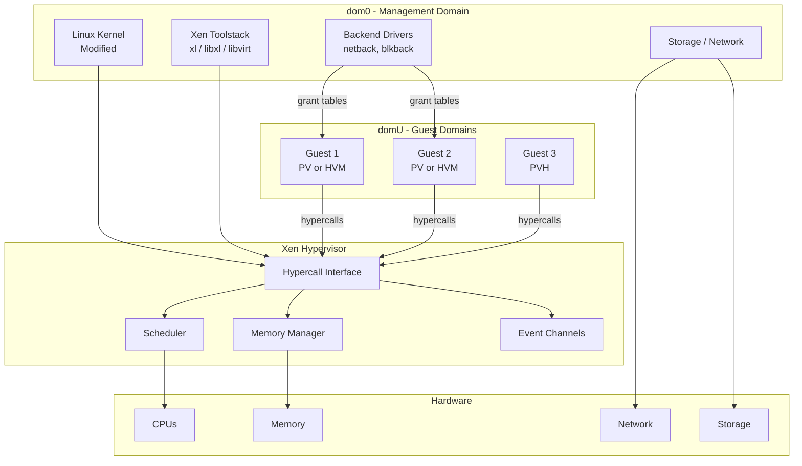
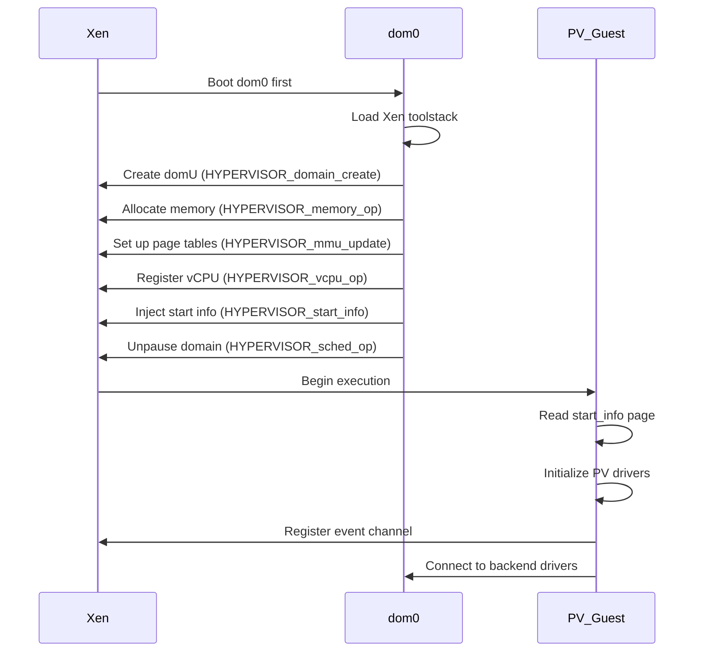
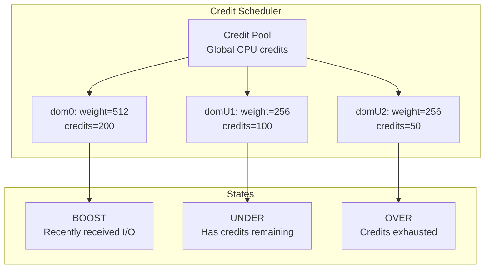
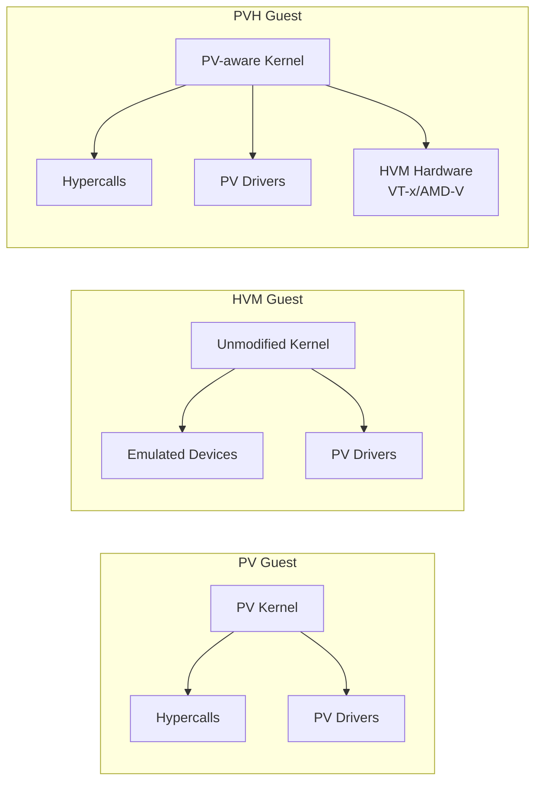
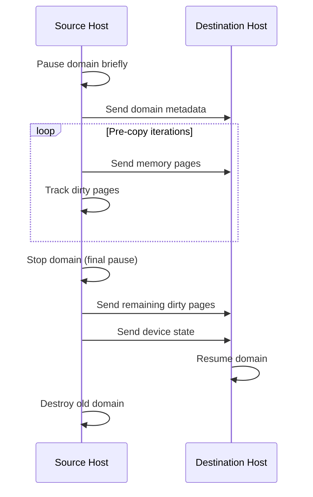

# Xen Hypervisor

## Introduction

Xen is a Type-1 bare-metal hypervisor that has been a cornerstone of server virtualization since its inception at the University of Cambridge in 2003. It pioneered paravirtualization on x86 — a technique where the guest operating system is modified to cooperate with the hypervisor, achieving high performance without hardware virtualization extensions.

Xen's architecture is distinct from KVM: rather than turning the host OS into a hypervisor, Xen runs as a thin layer between the hardware and all operating systems, including the management domain (dom0). This design has made it the hypervisor of choice for major cloud providers including AWS (which uses a customized Xen for EC2).

## Architecture Overview



### Domain Types

| Domain | Description | Privileges |
|--------|-------------|------------|
| **dom0** | Initial domain, boots first | Full hardware access, runs toolstack |
| **domU** | Unprivileged guest domains | No direct hardware access |
| **driver domain** | Specialized domU for device drivers | Runs backend drivers for other domains |
| **stubdomain** | Minimal domain per HVM guest | Runs device model (QEMU) in isolation |

## Paravirtualization (PV)

Xen's original approach modifies the guest OS to replace privileged instructions with hypercalls. This avoids the overhead of trapping and emulating privileged operations.

### Hypercall Mechanism

```c
/* Xen hypercall ABI on x86_64 */
static inline long HYPERVISOR_memory_op(int cmd, void *arg) {
    long ret;
    register long r10 asm("r10") = 0;
    register long r8  asm("r8")  = 0;
    asm volatile(
        "syscall"
        : "=a"(ret)
        : "0"(__HYPERVISOR_memory_op),
          "D"(cmd), "S"(arg),
          "r"(r10), "r"(r8)
        : "rcx", "r11", "memory");
    return ret;
}

/* Common hypercalls:
 * __HYPERVISOR_memory_op     — memory management
 * __HYPERVISOR_mmu_update    — page table updates
 * __HYPERVISOR_set_trap_table — exception handlers
 * __HYPERVISOR_console_io    — console I/O
 * __HYPERVISOR_event_channel_op — event channels
 * __HYPERVISOR_grant_table_op   — shared memory
 * __HYPERVISOR_sched_op     — scheduler operations
 */
```

### PV Guest Boot Sequence



### PV Frontend/Backend Model

```mermaid
graph LR
    subgraph domU (PV Guest)
        FE_NET[netfront<br/>Network Frontend]
        FE_BLK[blkfront<br/>Block Frontend]
        FE_FB[fbfront<br/>Framebuffer Frontend]
    end
    subgraph Xen Hypervisor
        GT[Grant Tables<br/>Shared Memory]
        EC[Event Channels<br/>Notifications]
    end
    subgraph dom0 (Backend)
        BE_NET[netback<br/>Network Backend]
        BE_BLK[blkback<br/>Block Backend]
        BE_FB[fbbackend<br/>Framebuffer Backend]
    end

    FE_NET <-->|grant table + event channel| BE_NET
    FE_BLK <-->|grant table + event channel| BE_BLK
    FE_FB <-->|grant table + event channel| BE_FB
```

## Hardware Virtual Machine (HVM)

HVM mode runs unmodified operating systems (including Windows) by leveraging hardware-assisted virtualization (VT-x/AMD-V). HVM guests require a device model (QEMU) to emulate hardware.

```bash
# HVM guest configuration (xl)
cat > hvm.cfg << 'EOF'
name = "hvm-guest"
type = "hvm"
memory = 2048
vcpus = 4
disk = ['file:/var/lib/xen/images/disk.qcow2,xvda,w']
vif = ['bridge=xenbr0']
boot = "cd"
cdrom = "/var/lib/xen/images/install.iso"
vnc = 1
vnclisten = "0.0.0.0"
serial = "pty"
EOF

xl create hvm.cfg
xl list
# Name                    ID  Mem  VCPUs  State  Time(s)
# Domain-0                 0  4096  4     r-----  1234.5
# hvm-guest                1  2048  4     -b----  56.7
```

### HVM with PV Drivers (PVHVM)

HVM guests can use PV drivers for better I/O performance:

```bash
# Linux HVM guest with PV drivers
# Install xen-guest-tools in the guest
# The guest automatically uses:
# - netfront/netback instead of emulated e1000
# - blkfront/blkback instead of emulated IDE
# - PV timer instead of emulated PIT
```

## dom0 and domU

### dom0 (Domain Zero)

dom0 is the privileged management domain that boots first and has full hardware access:

```bash
# dom0 responsibilities:
# 1. Runs the Xen toolstack (xl, libxl)
# 2. Provides backend drivers for domU I/O
# 3. Manages physical device access
# 4. Controls domain lifecycle

# xl — command-line management tool
xl list                    # List domains
xl info                    # Xen hypervisor info
xl top                     # Real-time domain stats
xl create vm.cfg           # Create domain
xl destroy vm-name         # Force-destroy domain
xl pause vm-name           # Pause domain
xl unpause vm-name         # Unpause domain
xl save vm-name /tmp/save  # Save domain state
xl restore /tmp/save       # Restore domain
xl migrate vm-name dest    # Live migration
xl console vm-name         # Attach to console
xl dmesg                   # Xen hypervisor log
```

### domU (Unprivileged Domain)

```bash
# domU has no direct hardware access
# All I/O goes through frontend → grant table → event channel → backend

# Inside a PV domU, check Xen features
cat /proc/xen/capabilities
# control_d

# Check Xen version
xl version
# Xen version 4.17.0

# Xenstore (shared configuration database)
xenstore-list /
# console
# device
# vm
# backend
# lib
```

## Xenstore

Xenstore is a hierarchical configuration database shared between domains. It's used for:
- Device configuration (frontend ↔ backend negotiation)
- Domain metadata
- Feature flags

```mermaid
graph TB
    subgraph Xenstore Tree
        ROOT[/]
        LOCAL[/local]
        DOMAIN[/local/domain]
        D0[/local/domain/0]
        D1[/local/domain/1]
        D1_VM[/local/domain/1/vm]
        D1_DEVICE[/local/domain/1/device]
        BACKEND[/local/domain/0/backend]
        BE_VBD[/local/domain/0/backend/vbd]
        BE_VIF[/local/domain/0/backend/vif]
    end
    ROOT --> LOCAL
    LOCAL --> DOMAIN
    DOMAIN --> D0
    DOMAIN --> D1
    D1 --> D1_VM
    D1 --> D1_DEVICE
    D0 --> BACKEND
    BACKEND --> BE_VBD
    BACKEND --> BE_VIF
```

```bash
# Xenstore operations
xenstore-list /local/domain/1
# console
# cpu
# device
# memory
# vm
# name

xenstore-read /local/domain/1/name
# hvm-guest

xenstore-read /local/domain/1/vm
# /vm/a1b2c3d4-...

# Write a value (requires appropriate permissions)
xenstore-write /local/domain/1/data/mykey "myvalue"

# Watch for changes
xenstore-watch /local/domain/1/device/vif/0/state

# Device state negotiation via xenstore:
# Frontend sets state → Backend reads → Backend sets state → Frontend reads
xenstore-read /local/domain/1/device/vbd/768/state
# 4 (Connected)
```

### Grant Tables

Grant tables provide secure shared memory between domains:

```c
/* Grant table reference — dom0 shares a page with domU */
struct gnttab_map_grant_ref {
    uint64_t host_addr;      /* Host virtual address */
    uint32_t flags;          /* GNTMAP_host_map, etc. */
    grant_ref_t ref;         /* Grant reference number */
    domid_t dom;             /* Domain ID */
    int16_t status;          /* GNTST_okay on success */
    uint64_t dev_bus_addr;   /* Device bus address (for DMA) */
};

/* Flow:
 * 1. domU grants access to a page: GNTTABOP_grant_access
 * 2. dom0 maps the page: GNTTABOP_map_grant_ref
 * 3. Both can now read/write the shared page
 * 4. Cleanup: GNTTABOP_unmap_grant_ref
 */
```

### Event Channels

Event channels are the Xen equivalent of inter-processor interrupts (IPIs):

```c
/* Event channel operations */
struct evtchn_bind_interdomain {
    domid_t remote_dom;
    evtchn_port_t remote_port;
    evtchn_port_t local_port;  /* Output */
};

/* Flow:
 * 1. domU allocates event channel: EVTCHNOP_alloc_unbound
 * 2. dom0 binds to it: EVTCHNOP_bind_interdomain
 * 3. domU sends event: EVTCHNOP_send
 * 4. dom0 receives via registered callback
 */
```

## Credit Scheduler

The Credit scheduler is Xen's default CPU scheduler. It's a proportional-share scheduler that distributes CPU time fairly among domains.

### How It Works



**Scheduler states:**
- **BOOST** — Domain recently received an event (I/O completion). Gets priority scheduling.
- **UNDER** — Domain still has credits. Can run but yields to BOOST domains.
- **OVER** — Domain has exhausted its credits. Gets lowest priority.

```bash
# View scheduler configuration
xl sched-credit -d 0
# Name: Domain-0
# Weight: 512
# Cap: 0 (unlimited)

# Set domain weight (relative share of CPU)
xl sched-credit -d hvm-guest -w 256

# Cap CPU usage (percentage of one physical CPU)
xl sched-credit -d hvm-guest -c 50  # 50% of one CPU

# List all domains with scheduler info
xl sched-credit -a
```

### Other Schedulers

| Scheduler | Algorithm | Use Case |
|-----------|-----------|----------|
| **Credit** | Proportional-share | General purpose (default) |
| **Credit2** | Improved Credit | Better NUMA awareness |
| **RTDS** | Real-time deferrable server | Real-time workloads |
| **null** | No scheduling | Testing only |

## PVH (Paravirtualized HVM)

PVH combines the best of PV and HVM:



**PVH advantages:**
- Uses hardware virtualization (VT-x/AMD-V) for CPU and memory
- Uses PV drivers for I/O (no QEMU device model needed)
- No BIOS/UEFI emulation required
- Simpler and faster than HVM
- Smaller attack surface (no QEMU)

```bash
# PVH guest configuration
cat > pvh.cfg << 'EOF'
name = "pvh-guest"
type = "pvh"
memory = 1024
vcpus = 2
kernel = "/boot/vmlinuz-6.1-xen"
ramdisk = "/boot/initramfs-6.1-xen.img"
extra = "root=/dev/xvda console=hvc0"
disk = ['file:/var/lib/xen/images/disk.raw,xvda,w']
vif = ['bridge=xenbr0']
EOF

xl create pvh.cfg
```

## Live Migration

Xen supports live migration of running domains:

```bash
# Live migrate a domain to another host
xl migrate hvm-guest destination-host

# With SSH tunneling
xl migrate hvm-guest destination-host --ssh=/usr/bin/ssh

# Migration flow:
# 1. Pre-copy: iterate memory pages, send dirty pages
# 2. Stop-and-copy: briefly pause domain, send remaining pages
# 3. Resume on destination
# Typical downtime: 50-500ms
```



## Security Features

### FLASK (Xen Security Module)

```bash
# FLASK provides mandatory access control for Xen
# Similar to SELinux policies for the hypervisor

# Example policy rules:
# allow dom0 domU:create
# allow domU dom0:device_access { vbd vif }
# deny domU domU:interdomain_communication
```

### Stub Domains

```bash
# HVM guests run QEMU for device emulation
# By default, QEMU runs in dom0 (security risk)
# Stub domains run QEMU in a separate, minimal domU

# Enable stub domains
xl create hvm.cfg -F  # Force stub domain
# Now QEMU runs in an isolated stub domain
# Even if QEMU is compromised, dom0 is protected
```

## Xen vs KVM

| Aspect | Xen | KVM |
|--------|-----|-----|
| Architecture | Standalone hypervisor | Linux kernel module |
| dom0 | Required management domain | Host OS is the management domain |
| PV support | Native | Via virtio |
| HVM support | Via VT-x/AMD-V + QEMU | Via VT-x/AMD-V + QEMU |
| PVH | ✅ | N/A |
| Security model | dom0/domU separation | Linux namespaces/cgroups |
| Use cases | Cloud (AWS), security-critical | General purpose, cloud (GCP) |
| Community | Xen Project (Linux Foundation) | Linux kernel community |

## References

1. Barham, P., et al. (2003). "Xen and the Art of Virtualization." *SOSP '03*.
2. Xen Project Documentation. [https://xenproject.org/documentation/](https://xenproject.org/documentation/)
3. Chisnall, D. (2007). *The Definitive Guide to the Xen Hypervisor*. Prentice Hall.
4. Xen Source Code. [https://xenbits.xen.org/gitweb/?p=xen.git](https://xenbits.xen.org/gitweb/?p=xen.git)

## Further Reading

- [The Linux Kernel Documentation](https://docs.kernel.org/)
- [LWN.net - Linux and free software news](https://lwn.net/)
- [GNU Project Documentation](https://www.gnu.org/doc/doc.html)
- [GNU Manuals](https://www.gnu.org/manual/manual.html)
- [Free Software Directory](https://directory.fsf.org/wiki/Main_Page)
- [Planet GNU](https://planet.gnu.org/)
- [Free Software Books](https://www.gnu.org/doc/other-free-books.html)

- [Xen Project Wiki](https://wiki.xenproject.org/)
- [Xen Documentation](https://xenproject.org/documentation/)
- [xl(1) Man Page](https://xenbits.xen.org/docs/4.17-testing/man/xl.1.html)
- [AWS and Xen](https://aws.amazon.com/ec2/faqs/)
- [Xen Security Advisory Process](https://xenbits.xen.org/xsa/)

## Related Topics

- [Virtualization Overview](./overview.md) — virtualization types and comparison
- [KVM Internals](./kvm.md) — alternative kernel-based virtualization
- [QEMU](./qemu.md) — device emulation used with Xen HVM
- [Container Overview](../containers/overview.md) — alternative isolation mechanism
